# Visual Architecture Guide

**Version:** 2.0.0  
**Purpose:** Mermaid diagram library for routing architecture  
**Audience:** Visual learners, presenters, documenters

---

## 🎯 **PURPOSE**

This document contains **12 Mermaid diagrams** explaining every aspect of routing architecture visually. Use these for:

- 📖 **Learning** - Understand concepts visually
- 👥 **Presentations** - Explain to team/stakeholders
- 📚 **Documentation** - Add to project docs
- 🎓 **Onboarding** - Train new developers

---

## 📊 **DIAGRAM INDEX**

**Quick Navigation:**

1. [High-Level Overview](#diagram-1-high-level-architecture)
2. [App Component Structure](#diagram-2-app-component-structure)
3. [Layout + Outlet Pattern](#diagram-3-layout--outlet-pattern)
4. [Route Resolution Flow](#diagram-4-route-resolution-flow)
5. [Navigation Callback Flow](#diagram-5-navigation-callback-flow)
6. [Lazy Loading Process](#diagram-6-lazy-loading-process)
7. [safeLazy Helper Logic](#diagram-7-safelazy-helper-logic)
8. [Protected Route Flow](#diagram-8-protected-route-flow)
9. [User Journey Example](#diagram-9-user-journey-example)
10. [Folder Structure](#diagram-10-folder-structure)
11. [Error Handling Paths](#diagram-11-error-handling-paths)
12. [Deployment Architecture](#diagram-12-deployment-architecture)

---

## 📐 **DIAGRAM 1: High-Level Architecture**

**What it shows:** Complete routing system from browser to components


**Key Concepts:**
- BrowserRouter provides routing context
- Routes defined in single config
- Layouts wrap child routes
- Outlet renders matched child
- Auth guards protected routes

---

## 📐 **DIAGRAM 2: App Component Structure**

**What it shows:** Provider hierarchy in App.tsx


**Provider Order (Critical):**
1. HelmetProvider (outermost)
2. BrowserRouter (routing context)
3. AuthProvider (app state)
4. AppRoutes (route rendering)

**Why This Order:**
- HelmetProvider manages document head
- BrowserRouter must wrap route hooks
- AuthProvider needs router context
- AppRoutes uses routing hooks

---

## 📐 **DIAGRAM 3: Layout + Outlet Pattern**

**What it shows:** How layouts wrap child routes


**Result Structure:**
```
<MarketingLayout>
  <Header />
  <main>
    <AboutPage /> ← Rendered in Outlet
  </main>
  <Footer />
</MarketingLayout>
```

---

## 📐 **DIAGRAM 4: Route Resolution Flow**

**What it shows:** How router matches URLs to components

```mermaid
flowchart TD
    Start([User navigates to /services]) --> BR[BrowserRouter<br/>Receives URL]
    
    BR --> Parse[Parse URL<br/>pathname = /services]
    
    Parse --> Config[Load Route Config<br/>/routes/index.tsx]
    
    Config --> Loop{For each route}
    
    Loop -->|Route 1: /| NoMatch1[Path doesn't match]
    Loop -->|Route 2: /services| Match[✅ Path matches!]
    Loop -->|Route 3: /app| NoMatch2[Path doesn't match]
    
    Match --> CheckLayout{Has parent layout?}
    
    CheckLayout -->|Yes| RenderLayout[Render MarketingLayout]
    CheckLayout -->|No| RenderDirect[Render component directly]
    
    RenderLayout --> FindOutlet[Find <Outlet /> in layout]
    
    FindOutlet --> RenderChild[Render ServicesPage<br/>in Outlet]
    
    RenderDirect --> Display[Display component]
    RenderChild --> Display
    
    Display --> Success[✅ Page renders]
    
    NoMatch1 --> Loop
    NoMatch2 --> Loop
    
    Loop -->|No matches| CatchAll{Catch-all (*) exists?}
    
    CatchAll -->|Yes| NotFound[Render 404 page]
    CatchAll -->|No| BlankScreen[❌ Blank screen]
    
    style Match fill:#e8f5e9
    style Success fill:#e8f5e9
    style BlankScreen fill:#ffebee
    style NotFound fill:#fff9c4
```

**Key Points:**
- Router tries each route in order
- First match wins
- Catch-all (*) must be last
- Layout routes render parent first

---

## 📐 **DIAGRAM 5: Navigation Callback Flow**

**What it shows:** How navigation works through layers


**Code Example:**

```typescript
// UI Layer (Button.tsx)
export function Button({ onClick }: { onClick: () => void }) {
  return <button onClick={onClick}>Click</button>;
}

// Routing Layer (ButtonRoute.tsx)
export default function ButtonRoute() {
  const navigate = useNavigate(); // ← Router hook
  
  const handleClick = () => {
    navigate(ROUTES.SERVICES); // ← Navigation logic
  };
  
  return <Button onClick={handleClick} />; // ← Pass callback
}
```

**Benefits:**
- UI components testable (no router mocks)
- Routing logic centralized
- Easy to refactor routes

---

## 📐 **DIAGRAM 6: Lazy Loading Process**

**What it shows:** How code splitting and lazy loading works

```mermaid
flowchart TD
    Start([Route matches]) --> Lazy{Component lazy loaded?}
    
    Lazy -->|No| RenderDirect[Render immediately]
    
    Lazy -->|Yes| Suspense{Suspense boundary exists?}
    
    Suspense -->|No| Error1[❌ Error<br/>Suspense required]
    
    Suspense -->|Yes| ShowFallback[Show loading fallback<br/>spinner]
    
    ShowFallback --> LoadChunk[Download code chunk<br/>from server]
    
    LoadChunk --> ParseJS[Parse JavaScript]
    
    ParseJS --> CheckExport{Has export?}
    
    CheckExport -->|Default export| UseDefault[Use default]
    CheckExport -->|Named export| CheckHelper{Using safeLazy?}
    CheckExport -->|No export| Error2[❌ Error<br/>No valid export]
    
    CheckHelper -->|Yes| UseNamed[Use named export]
    CheckHelper -->|No| Error3[❌ Error<br/>Element type invalid]
    
    UseDefault --> RenderComp[Render component]
    UseNamed --> RenderComp
    RenderDirect --> RenderComp
    
    RenderComp --> Success[✅ Component displays]
    
    style ShowFallback fill:#fff9c4
    style Success fill:#e8f5e9
    style Error1,Error2,Error3 fill:#ffebee
```



**Timeline:**

```
Time 0ms:   Route matched
Time 10ms:  Suspense fallback shown
Time 200ms: Chunk downloaded
Time 250ms: JavaScript parsed
Time 300ms: Component rendered
```

---

## 📐 **DIAGRAM 7: safeLazy Helper Logic**

**What it shows:** How safeLazy handles both export types

```mermaid
flowchart TD
    Start([safeLazy called]) --> Import[Execute dynamic import<br/>await importFn]
    
    Import --> Module[Receive module object]
    
    Module --> CheckDefault{module has<br/>'default' key?}
    
    CheckDefault -->|Yes| ReturnDefault[return default<br/>export]
    
    CheckDefault -->|No| CheckNamed{exportName<br/>provided?}
    
    CheckNamed -->|Yes| HasNamed{module has<br/>exportName key?}
    CheckNamed -->|No| UseFallback[Use first export<br/>Object.values[0]]
    
    HasNamed -->|Yes| ReturnNamed[return named<br/>export]
    HasNamed -->|No| UseFallback
    
    ReturnDefault --> Success[✅ Component loads]
    ReturnNamed --> Success
    UseFallback --> Success
    
    style Success fill:#e8f5e9
```

**Usage Examples:**

```typescript
// Component with default export
export default function HomePage() { ... }
const HomePage = safeLazy(() => import('./HomePage'));

// Component with named export
export function HomePage() { ... }
const HomePage = safeLazy(() => import('./HomePage'), 'HomePage');

// Both work! safeLazy handles it.
```

---

## 📐 **DIAGRAM 8: Protected Route Flow**

**What it shows:** Authentication and redirect logic

```mermaid
sequenceDiagram
    participant User
    participant Router
    participant Protected as ProtectedRoute
    participant Auth as useAuth hook
    participant Login as LoginPage
    participant Dashboard

    User->>Router: Navigate to<br/>/app/dashboard
    
    Router->>Protected: Render ProtectedRoute
    
    Protected->>Auth: Check isAuthenticated
    Auth-->>Protected: false (not logged in)
    
    Protected->>Protected: Save intended destination<br/>state = { from: '/app/dashboard' }
    
    Protected->>Login: <Navigate to="/login"<br/>state={{ from }} />
    
    Login-->>User: Show login form
    
    User->>Login: Submit credentials
    Login->>Auth: login(email, password)
    Auth->>Auth: Validate + save token
    Auth-->>Login: Success
    
    Login->>Login: Read state.from<br/>= '/app/dashboard'
    
    Login->>Router: navigate('/app/dashboard')
    
    Router->>Protected: Render ProtectedRoute
    Protected->>Auth: Check isAuthenticated
    Auth-->>Protected: true ✅
    
    Protected->>Dashboard: Render Dashboard
    Dashboard-->>User: Show dashboard ✅
```



**Key Points:**
- Preserve intended destination in `location.state`
- After login, redirect to intended page
- Not just to a default route

---

## 📐 **DIAGRAM 9: User Journey Example**

**What it shows:** Complete user flow through the app


**URL Path Traced:**
```
/
→ /services
→ /services/ai-chatbots
→ /wizard/1
→ /wizard/2
→ /wizard/3
→ /wizard/processing
→ /wizard/complete
→ /login (if not logged in)
→ /app/dashboard
→ /app/leads
→ /app/leads/123
```

---

## 📐 **DIAGRAM 10: Folder Structure**

**What it shows:** File organization and relationships

```mermaid
flowchart TD
    Root[/src/] --> Routes[/routes/<br/>Route config + wrappers]
    Root --> Layouts[/layouts/<br/>Layout components]
    Root --> Components[/components/<br/>UI components]
    Root --> Utils[/utils/<br/>Utilities]
    Root --> Constants[/constants/<br/>Constants]
    
    Routes --> RoutesIndex[index.tsx<br/>Route configuration]
    Routes --> Marketing[marketing/<br/>Marketing route wrappers]
    Routes --> App[app/<br/>App route wrappers]
    
    Layouts --> MarketingL[MarketingLayout.tsx<br/>Public pages layout]
    Layouts --> AppL[AppLayout.tsx<br/>Protected pages layout]
    
    Utils --> SafeLazy[safeLazy.ts<br/>Lazy loading helper]
    
    Constants --> RoutesConst[routes.ts<br/>ROUTES constants]
    
    RoutesIndex -.->|imports| MarketingL
    RoutesIndex -.->|imports| AppL
    RoutesIndex -.->|imports| SafeLazy
    
    Marketing -.->|imports| Components
    App -.->|imports| Components
    
    Marketing -.->|uses| RoutesConst
    App -.->|uses| RoutesConst
    
    style Routes fill:#fff9c4
    style Layouts fill:#e8f5e9
    style Components fill:#e3f2fd
    style Utils fill:#f3e5f5
    style Constants fill:#fff3e0
```

**Dependency Flow:**
- Routes import Layouts
- Routes import Utils (safeLazy)
- Route wrappers import Components
- Everyone imports Constants (ROUTES)
- Components import nothing routing-related

---

## 📐 **DIAGRAM 11: Error Handling Paths**

**What it shows:** How errors are handled

```mermaid
flowchart TD
    Start([User Action]) --> Router[React Router]
    
    Router --> Match{Route matches?}
    
    Match -->|Yes| Render[Attempt to render]
    Match -->|No| CatchAll{Catch-all (*)?}
    
    CatchAll -->|Yes| NotFound[404 NotFoundPage]
    CatchAll -->|No| BlankScreen[❌ Blank screen]
    
    Render --> Lazy{Lazy loaded?}
    
    Lazy -->|No| RenderSync[Render immediately]
    Lazy -->|Yes| LoadChunk{Chunk loads?}
    
    LoadChunk -->|Fail| ChunkError[❌ Chunk load error<br/>Error boundary]
    LoadChunk -->|Success| ExportCheck{Valid export?}
    
    ExportCheck -->|No| ExportError[❌ Invalid export<br/>Error boundary]
    ExportCheck -->|Yes| ComponentRender{Component renders?}
    
    RenderSync --> ComponentRender
    
    ComponentRender -->|Error| RuntimeError[❌ Runtime error<br/>Error boundary]
    ComponentRender -->|Success| Success[✅ Page displays]
    
    NotFound --> Recovery[Show recovery options<br/>Go Home, Go Back]
    ChunkError --> Recovery
    ExportError --> Recovery
    RuntimeError --> Recovery
    
    Recovery --> UserAction{User chooses}
    UserAction -->|Go Home| Router
    UserAction -->|Go Back| Browser[Browser history]
    
    style Success fill:#e8f5e9
    style BlankScreen fill:#ffebee
    style NotFound fill:#fff9c4
    style ChunkError fill:#ffebee
    style ExportError fill:#ffebee
    style RuntimeError fill:#ffebee
```

**Error Recovery Strategies:**

| Error Type | Recovery |
|------------|----------|
| 404 Not Found | Show helpful 404 page |
| Chunk load fail | Retry or show error |
| Invalid export | Fix code (safeLazy) |
| Runtime error | Error boundary catches |

---

## 📐 **DIAGRAM 12: Deployment Architecture**

**What it shows:** Production deployment flow


**Platform Configs:**


---

## 🎯 **HOW TO USE THESE DIAGRAMS**

### **For Learning**

1. Start with Diagram 1 (High-Level Overview)
2. Then Diagram 2 (App Structure)
3. Deep dive into specific topics as needed

### **For Presentations**

1. Copy diagram markdown
2. Paste into Mermaid Live Editor (mermaid.live)
3. Export as SVG/PNG
4. Add to slides

### **For Documentation**

1. Copy diagram into markdown files
2. Add context paragraphs above/below
3. Link from README or docs

### **For Debugging**

1. Find relevant diagram
2. Trace your issue through the flow
3. Identify where the flow breaks

---

## 📝 **CUSTOMIZATION**

**To modify diagrams for your project:**

1. Copy diagram code
2. Update text labels
3. Add/remove nodes as needed
4. Adjust colors (fill:#hexcode)
5. Test in Mermaid Live Editor

**Color Scheme Used:**

- `#e3f2fd` - Light blue (primary components)
- `#fff9c4` - Yellow (processing/routing)
- `#e8f5e9` - Green (success states)
- `#fff3e0` - Orange (protected/special)
- `#ffebee` - Red (errors)
- `#f3e5f5` - Purple (wizard/flows)

---

**These diagrams are your visual guide to routing architecture. Reference them often, share them widely, and update them as your routing evolves.**
