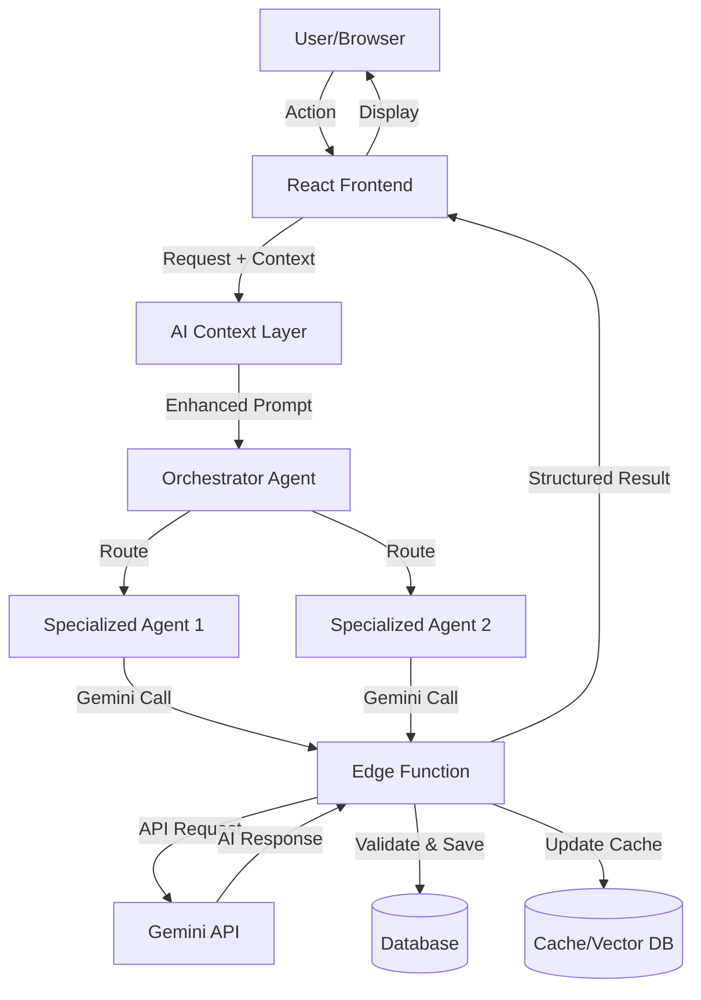
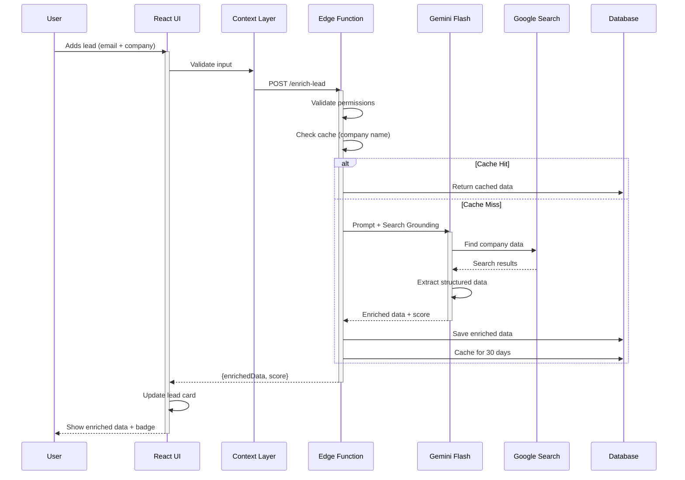

# AI AGENTS SYSTEM ARCHITECTURE

**Purpose**: Define how AI agents work end-to-end in the Sales Intelligence OS  
**Audience**: Product, Design, Engineering  
**Status**: Production System Design

---

## OVERVIEW

This system uses **AI agents** to automate sales intelligence tasks. Agents analyze data, extract insights, prioritize actions, and draft communications—all triggered by user actions in the UI.

**Key Principle**: AI assists, humans decide. No execution without confirmation.

---

## AI MODEL STRATEGY

### Gemini 2.0 Flash (Fast & Cheap)
**Use for**:
- Lead enrichment (company data lookup)
- Quick form suggestions
- Simple search queries
- Chat responses
- Tag suggestions

**Why**: Sub-second responses, low cost, Search Grounding available

**Cost**: ~$0.10 per 1M tokens

---

### Gemini 2.0 Pro (Complex Reasoning)
**Use for**:
- Call transcript analysis
- Deal health assessment
- Multi-factor scoring
- Sentiment analysis
- Email tone detection

**Why**: Better reasoning, longer context, higher accuracy

**Cost**: ~$1.25 per 1M tokens

---

### Gemini 2.0 Pro Thinking (Multi-Step Planning)
**Use for**:
- Post-call action prioritization
- Strategic recommendations
- Complex decision trees
- Risk assessment
- Opportunity evaluation

**Why**: Chain-of-thought reasoning, explains decisions, handles ambiguity

**Cost**: ~$1.25 per 1M tokens + thinking time

---

### Function Calling
**Use for**:
- Structured data extraction
- Safe backend actions (create task, send email)
- Database queries
- API integrations

**Why**: Predictable outputs, type-safe, prevents hallucination

**All Models**: Available on Flash & Pro

---

### Grounding with Google Search
**Use for**:
- Lead enrichment (find company info)
- Market research
- News about prospects
- Competitor intelligence

**Why**: Fresh external data, reduces hallucination, cites sources

**Models**: Flash, Pro

---

### Grounding with Google Maps
**Use for**:
- Location-based lead filtering
- Territory planning
- Event location suggestions
- Travel time estimates

**Why**: Accurate location data, route optimization

**Models**: Flash, Pro

---

### File Search / RAG (Retrieval Augmented Generation)
**Use for**:
- Search call transcripts
- Find past conversations
- Internal knowledge base
- Product documentation search

**Why**: Ground responses in user's own data, no retraining needed

**Setup**: Vector database (Supabase pgvector)

---

### Structured Outputs
**Use for**:
- Database writes
- API responses
- UI component data
- Form validation

**Why**: Type-safe, predictable, no parsing errors

**All Models**: JSON mode available

---

### Code Execution
**Use for**:
- Contract value calculations
- ROI computations
- Statistical analysis
- Data transformations

**Why**: Accurate math, safe sandbox, explainable

**Models**: Pro only

---

### URL Context Tool
**Use for**:
- Analyze prospect's website
- Extract product details
- Understand company positioning

**Why**: Contextual intelligence from public URLs

**Models**: Pro

---

### Interactions API (Multi-Turn)
**Use for**:
- Chatbot conversations
- Wizards with memory
- Progressive disclosure
- Context-aware Q&A

**Why**: Maintains conversation state, cheaper than context stuffing

**Models**: All

---

### Deep Research
**Use for**:
- Market analysis reports
- Competitive landscape
- Industry trend analysis
- Account planning

**Why**: Long-running, thorough, cites sources

**Models**: Pro (experimental)

---

## CORE AI AGENTS

### 1. Orchestrator Agent
**Role**: Main coordinator, routes user requests to specialized agents

**Trigger**: Any AI-powered user action

**Input**:
- User request (natural language or action)
- Current context (page, selected lead, etc.)
- User permissions

**Logic**:
1. Parse user intent
2. Determine required agents
3. Check permissions
4. Execute in correct order
5. Aggregate results

**Output**: Structured response for UI

**Model**: Gemini 2.0 Pro (needs reasoning)

**Example**:
```
User: "Analyze my last call with Acme Corp"
Orchestrator decides:
  → Call Retrieval Agent (find transcript)
  → Call Analysis Agent (analyze content)
  → Action Extraction Agent (find next steps)
  → Return aggregated results
```

---

### 2. Lead Enrichment Agent
**Role**: Find and score company information

**Trigger**: New lead created, manual "Enrich" button

**Input**:
- Company name
- Email domain
- Existing data (optional)

**Tools**:
- Gemini 2.0 Flash
- Search Grounding
- Function Calling (for structured output)

**Logic**:
1. Search Google for company data
2. Extract: size, industry, revenue, location, tech stack
3. Calculate fit score (0-100)
4. Return structured data

**Output**:
```
{
  companySize: "51-200",
  industry: "SaaS",
  revenue: "Series B",
  score: 85,
  confidence: 90
}
```

**Edge Function**: `enrich-lead`
- Validates input
- Calls Gemini
- Saves to database
- Returns result

**Frontend**:
- Shows "Enriching..." state
- Displays score badge
- Shows enriched data in cards

---

### 3. Call Analysis Agent
**Role**: Transcribe and analyze sales calls

**Trigger**: Call recording uploaded

**Input**:
- Audio file URL OR transcript
- Lead context (deal stage, value)

**Tools**:
- Gemini 2.0 Pro (reasoning)
- Speech-to-Text (if audio)
- Function Calling (action extraction)

**Logic**:
1. Transcribe audio (if needed)
2. Analyze sentiment (positive/neutral/negative)
3. Extract key points, concerns, next steps
4. Identify buying signals and risks
5. Calculate deal health score
6. Extract action items (structured)

**Output**:
```
{
  sentiment: "positive",
  keyPoints: ["Budget approved", "Q1 timeline"],
  actions: [
    {type: "send_email", priority: "high", ...},
    {type: "schedule_meeting", priority: "medium", ...}
  ],
  dealHealth: {score: 85, status: "healthy"}
}
```

**Edge Function**: `analyze-call`
- Validates audio/transcript
- Calls Gemini Pro
- Extracts actions via function calling
- Saves transcript + actions to DB
- Updates deal health

**Frontend**:
- Shows "Analyzing..." with thinking state
- Displays summary
- Shows action cards (one-click execute)

---

### 4. Action Architect Agent
**Role**: Prioritize and draft post-call actions

**Trigger**: Call analysis complete, user clicks "Generate Actions"

**Input**:
- Call transcript
- Extracted action items
- Lead context
- User's calendar (optional)

**Tools**:
- Gemini 2.0 Pro Thinking (multi-step reasoning)
- Function Calling (email drafts, meeting slots)

**Logic**:
1. Analyze all action items
2. Consider urgency, impact, dependencies
3. Prioritize using chain-of-thought
4. Draft emails (personalized tone)
5. Suggest meeting times
6. Explain reasoning

**Output**:
```
{
  prioritizedActions: [
    {
      action: "Send proposal",
      urgency: 95,
      reasoning: "Client requested by Friday, budget approved",
      emailDraft: "Hi John, Following up on..."
    }
  ],
  suggestedMeetings: [
    {time: "2024-12-22 10:00", reasoning: "Before Friday deadline"}
  ]
}
```

**Edge Function**: `architect-actions`
- Calls Gemini Thinking
- Generates drafts
- Returns prioritized list

**Frontend**:
- Shows "Thinking..." state (explain reasoning)
- Displays actions in priority order
- Email drafts are editable
- One-click send or schedule

---

### 5. Natural Language Search Agent
**Role**: Parse queries and find relevant CRM data

**Trigger**: User types in Command Bar (Cmd+K)

**Input**:
- Natural language query
- User's access permissions

**Tools**:
- Gemini 2.0 Flash (fast)
- Function Calling (extract filters)
- Vector search (for semantic matching)

**Logic**:
1. Parse query → extract entities (dates, statuses, names)
2. Convert to database filters
3. Execute search
4. Rank by relevance
5. Return results with snippets

**Output**:
```
{
  query: "leads in fintech closing this month",
  interpretation: {
    filters: {
      industry: "fintech",
      dealStage: ["proposal", "negotiation"],
      closeDate: {start: "2024-12-01", end: "2024-12-31"}
    }
  },
  results: [
    {type: "lead", title: "Acme Corp", score: 95, ...}
  ]
}
```

**Edge Function**: `search-query`
- Parses with Gemini
- Queries database
- Returns ranked results

**Frontend**:
- Command Bar shows instant results
- Highlights matched terms
- Explains query interpretation

---

### 6. Context & Memory Agent
**Role**: Remember conversation state, prevent repetition

**Trigger**: Every AI interaction

**Input**:
- User ID
- Session ID
- Recent actions

**Tools**:
- Interactions API (multi-turn)
- Context caching (30 min TTL)

**Logic**:
1. Load cached user context
2. Include in AI prompts
3. Update after each interaction
4. Expire after inactivity

**Output**: Enhanced prompts with memory

**Edge Function**: Built into all agents

**Frontend**: Transparent to user (just works better)

---

### 7. Email Drafter Agent
**Role**: Generate personalized sales emails

**Trigger**: User clicks "Draft Email" on action item

**Input**:
- Lead profile
- Recent activity
- Tone preference (formal/casual)
- Email purpose (follow-up, proposal, etc.)

**Tools**:
- Gemini 2.0 Pro (tone matching)
- RAG (user's past emails for style)

**Logic**:
1. Load lead context
2. Find similar past emails (RAG)
3. Match user's writing style
4. Generate draft
5. Include personalization (name, company, specifics)

**Output**: Editable email draft

**Edge Function**: `draft-email`

**Frontend**:
- Shows draft in modal
- User edits before sending
- Learns from edits (future improvement)

---

### 8. Deal Health Monitor Agent
**Role**: Continuously assess deal risk

**Trigger**: After every activity (call, email, update)

**Input**:
- Deal data
- Activity history
- Call transcripts
- Email sentiment

**Tools**:
- Gemini 2.0 Pro (multi-factor analysis)
- Code Execution (score calculation)

**Logic**:
1. Analyze all signals (positive + negative)
2. Calculate health score (0-100)
3. Identify risk factors
4. Compare to similar deals
5. Recommend actions

**Output**:
```
{
  score: 72,
  status: "at_risk",
  factors: [
    {name: "No activity in 15 days", impact: "negative"},
    {name: "Champion engaged", impact: "positive"}
  ],
  recommendations: ["Schedule check-in call"]
}
```

**Edge Function**: `calculate-deal-health`
- Runs after each activity
- Updates database
- Triggers alerts if score drops

**Frontend**:
- Health badge on deal cards
- Trend chart
- Risk alerts

---

## UI ↔ AI ↔ BACKEND FLOW

### System Architecture



---

### Detailed Flow: Lead Enrichment Example



---

## WORKFLOWS

### Workflow 1: Simple (Single Agent)

**Scenario**: User adds a lead

| Step | Actor | Action | AI Agent | Tool | Output |
|------|-------|--------|----------|------|--------|
| 1 | User | Enters email + company | - | - | Form data |
| 2 | UI | Validates & submits | - | - | POST /leads |
| 3 | Backend | Creates lead record | - | - | Lead ID |
| 4 | System | Triggers enrichment | Lead Enrichment | Gemini Flash + Search | Enriched data |
| 5 | Backend | Updates lead | - | - | Lead saved |
| 6 | UI | Shows enriched data | - | - | Score badge, company info |

**Time**: 3-5 seconds  
**User sees**: "Enriching..." → Score 85/100 + company details

---

### Workflow 2: Medium (Plan + Execute)

**Scenario**: User uploads call recording

| Step | Actor | Action | AI Agent | Tool | Output |
|------|-------|--------|----------|------|--------|
| 1 | User | Uploads audio file | - | - | File URL |
| 2 | UI | Shows "Analyzing..." | - | - | Thinking state |
| 3 | Backend | Receives file | - | - | File stored |
| 4 | System | Transcribes call | Call Analysis | Gemini Pro + STT | Transcript |
| 5 | System | Analyzes content | Call Analysis | Gemini Pro | Sentiment, key points |
| 6 | System | Extracts actions | Call Analysis | Function Calling | Action items |
| 7 | System | Calculates health | Deal Health | Pro + Code Exec | Health score |
| 8 | Backend | Saves all data | - | - | DB updated |
| 9 | UI | Shows results | - | - | Summary + actions |
| 10 | User | Reviews actions | - | - | Can edit/execute |

**Time**: 15-30 seconds  
**User sees**: Progress → "Analyzing..." → Summary + prioritized actions

---

### Workflow 3: Complex (Multi-Agent + Grounding)

**Scenario**: User asks "What deals are at risk this week?"

| Step | Actor | Action | AI Agent | Tool | Output |
|------|-------|--------|----------|------|--------|
| 1 | User | Types query in Command Bar | - | - | Text query |
| 2 | UI | Opens search modal | - | - | Thinking animation |
| 3 | System | Parses query | NL Search | Gemini Flash + Function Calling | Filters extracted |
| 4 | System | Searches database | - | - | Matching deals |
| 5 | System | Checks each deal health | Deal Health Monitor | Gemini Pro | Health scores |
| 6 | System | Analyzes risk factors | Deal Health Monitor | Code Execution | Risk analysis |
| 7 | System | Prioritizes results | Orchestrator | Gemini Pro Thinking | Ranked list |
| 8 | System | Generates recommendations | Action Architect | Gemini Thinking | Action suggestions |
| 9 | Backend | Logs search | - | - | Analytics |
| 10 | UI | Shows results | - | - | Deal cards + actions |

**Time**: 5-8 seconds  
**User sees**: Instant results → Health badges → Recommended actions per deal

---

## REAL-WORLD EXAMPLES

### Example 1: Location-Based Lead Enrichment

**Scenario**: Sales rep adds lead "John at Acme Corp, SF"

**AI Process**:
1. **Lead Enrichment Agent** (Gemini Flash + Search):
   - Searches "Acme Corp San Francisco"
   - Finds company size, industry, revenue
   - Score: 85/100 (good fit)

2. **Maps Grounding** (Gemini Flash + Maps):
   - Checks office location: "123 Market St, SF"
   - Calculates distance from rep's territory: 5 miles
   - Suggests: "In your territory, visit this week"

3. **Context Agent**:
   - Checks other SF leads
   - Finds 3 similar prospects nearby
   - Suggests: "Schedule all 4 for one trip"

**Result**: Rep saves 3 hours of research, gets territory optimization

---

### Example 2: Document Analysis with RAG

**Scenario**: User uploads contract PDF, asks "What are payment terms?"

**AI Process**:
1. **File Search / RAG**:
   - Extracts text from PDF
   - Chunks into paragraphs
   - Stores in vector database

2. **Contract Parser Agent** (Gemini Pro + Code Execution):
   - Searches vectors for "payment terms"
   - Finds relevant sections
   - Extracts: "Net 30, 50% upfront, 50% on delivery"
   - Calculates milestones

3. **Structured Output**:
   - Returns JSON schema
   - Saves to database as structured fields

**Result**: Contract parsed in 10 seconds vs 15 minutes manual reading

---

### Example 3: Multi-Step Automation

**Scenario**: Deal closes, user clicks "Won"

**AI Process**:
1. **Orchestrator**:
   - Detects stage change to "Won"
   - Triggers workflow automation

2. **Champion Detector Agent** (Gemini Pro + RAG):
   - Reviews all call transcripts
   - Identifies key champion: "Sarah (VP Sales)"
   - Drafts thank-you email

3. **Email Drafter Agent** (Gemini Pro):
   - Personalized email to champion
   - References specific conversation points
   - Requests referral

4. **Action Architect** (Gemini Thinking):
   - Creates onboarding tasks
   - Schedules kick-off meeting
   - Assigns internal team

5. **Deep Research Agent** (Gemini Pro):
   - Researches upsell opportunities
   - Analyzes their industry trends
   - Suggests expansion strategy

**Result**: 10 manual tasks automated, 2 hours saved per deal

---

## EDGE FUNCTIONS

### Purpose
Edge Functions run AI logic **server-side** for:
- Security (API keys never in browser)
- Validation (enforce business rules)
- Cost control (rate limiting)
- Data access (user permissions)

### Pattern

Every AI feature has an Edge Function:

```
/api/edge/
  enrich-lead
  analyze-call
  architect-actions
  search-query
  draft-email
  calculate-deal-health
```

### Flow

1. **Frontend** calls Edge Function with user token
2. **Edge Function** validates:
   - User is authenticated
   - User has permission
   - Input is valid
   - Rate limit not exceeded
3. **Edge Function** calls Gemini with:
   - System prompt (defines agent role)
   - User input (validated)
   - Context (from database)
   - Tools (function calling schemas)
4. **Gemini** returns structured response
5. **Edge Function** validates response schema
6. **Edge Function** saves to database (if needed)
7. **Edge Function** returns to frontend

**Safety**: AI never writes to database directly. Edge Function validates first.

---

## PROMPT ENGINEERING RULES

### 1. Goal-First Prompts

Bad:
```
Analyze this call transcript.
```

Good:
```
You are a sales intelligence analyst.
Goal: Identify action items from this sales call.
Return a prioritized list with deadlines and owners.
```

### 2. Explicit Inputs

Bad:
```
Find information about this company.
```

Good:
```
Company Name: {company}
Email Domain: {domain}
Find: company size, industry, revenue, location, tech stack
Return: JSON with confidence scores
```

### 3. Structured Outputs

Always use function calling or JSON mode:
```
Return format:
{
  "companySize": "51-200" | "201-500" | "500+",
  "industry": string,
  "score": number (0-100),
  "confidence": number (0-100)
}
```

### 4. Validation Before Execution

Never execute without confirmation:
```
Draft the email, but do NOT send.
Return the draft for user review.
User must explicitly approve before sending.
```

---

## SYSTEM GUARANTEES

### 1. No Execution Without Validation

**Rule**: AI suggests, humans approve

**Examples**:
- ✅ AI drafts email → User reviews → User sends
- ✅ AI suggests meeting time → User confirms → System books
- ❌ AI sends email automatically (not allowed)

**Exception**: Explicitly enabled workflows (Ghost Detection alerts)

---

### 2. AI Decisions Are Explainable

**Rule**: Every AI output includes reasoning

**Examples**:
- Lead score 85/100 → "High-fit SaaS company, ideal size"
- Action priority: High → "Client requested by Friday, budget approved"
- Deal health: At Risk → "No activity in 15 days, competitor mentioned"

**UI**: Hover over scores to see reasoning

---

### 3. Backend Is Authoritative

**Rule**: Database is source of truth, not AI

**Flow**:
1. AI generates output
2. Edge Function validates
3. Edge Function saves to database
4. Frontend reads from database (not AI cache)

**Why**: Prevents AI hallucination from corrupting data

---

### 4. User Can Always Override

**Rule**: Every AI suggestion is editable/rejectable

**Examples**:
- Lead score 85 → User can manually change to 90
- Email draft → User can edit before sending
- Meeting time → User can pick different time
- Deal health → User can override assessment

**UI**: All AI outputs have "Edit" or "Dismiss" buttons

---

## SUCCESS CRITERIA

### For Designers
- [ ] Can describe how AI appears in UI (thinking states, result cards)
- [ ] Knows when AI is used vs when data is from database
- [ ] Understands user control (edit, approve, dismiss)

### For Backend Engineers
- [ ] Knows when AI can act (never auto-execute)
- [ ] Understands Edge Function validation flow
- [ ] Can implement new agent by following pattern

### For AI Engineers
- [ ] Knows which Gemini model for which task
- [ ] Understands agent roles (orchestrator vs specialized)
- [ ] Can write prompts following rules

### For Product
- [ ] System feels coherent (not magical)
- [ ] AI value is clear (time saved, insights gained)
- [ ] Trust is maintained (explainable, overridable)

---

## AGENT SUMMARY TABLE

| Agent | Trigger | Model | Tools | Output | Edge Function |
|-------|---------|-------|-------|--------|---------------|
| Orchestrator | Any AI action | Pro | - | Route decision | All |
| Lead Enrichment | New lead | Flash | Search | Company data + score | `enrich-lead` |
| Call Analysis | Upload call | Pro | STT, Function | Transcript + actions | `analyze-call` |
| Action Architect | Post-call | Thinking | Function | Prioritized actions | `architect-actions` |
| NL Search | Command Bar | Flash | Function, Vector | Search results | `search-query` |
| Email Drafter | Draft button | Pro | RAG | Email text | `draft-email` |
| Deal Health | After activity | Pro | Code Exec | Health score | `calculate-deal-health` |
| Context/Memory | Every interaction | Flash | Interactions API | Enhanced prompts | Built-in |

---

**Status**: Production-ready AI agent system architecture ✅
