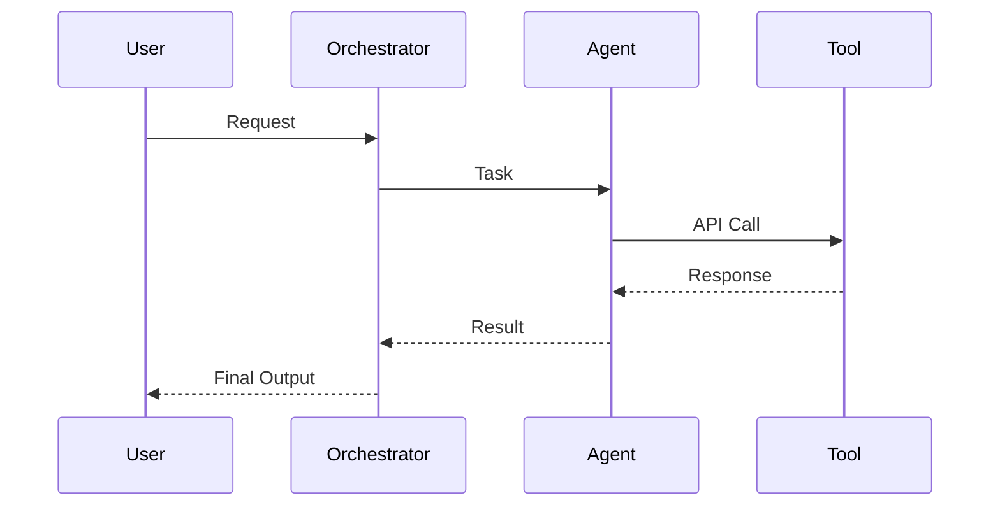
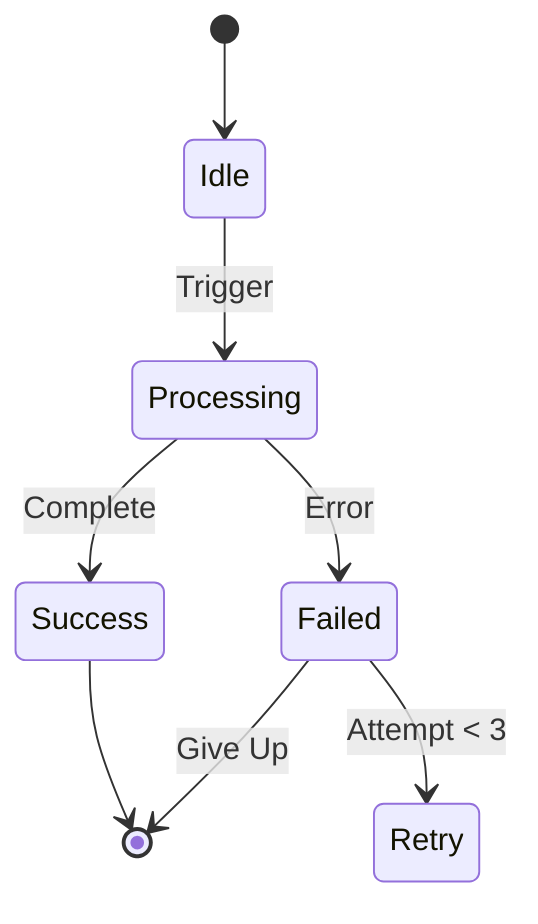

# AI AGENTS RULES

## DESIGN PRINCIPLES
- One agent = one job
- Clear trigger conditions
- Explicit inputs/outputs
- Deterministic logic paths
- Fallback behaviors defined

## AGENT STRUCTURE

### Required Elements
1. **Name** - Clear role (e.g., "Lead Enrichment Agent")
2. **Trigger** - When it runs (e.g., "New lead created")
3. **Inputs** - What data it receives
4. **Tools** - APIs/functions it calls
5. **Logic** - Decision tree (if/then)
6. **Output** - What it returns
7. **Fallback** - Error handling

## AGENT TYPES

### 1. Analysis Agents
- Process data
- Extract insights
- Score/rank results
- No external actions

### 2. Action Agents
- Execute tasks
- Call APIs
- Update databases
- Send notifications

### 3. Orchestrator Agents
- Coordinate other agents
- Manage workflows
- Handle state transitions
- Make routing decisions

## ORCHESTRATION RULES

### Single Orchestrator Pattern
```
User Request
    ↓
Main Orchestrator (decides)
    ↓
├── Agent A (specialized task)
├── Agent B (specialized task)
└── Agent C (specialized task)
    ↓
Orchestrator (combines results)
    ↓
User Response
```

### Avoid
- ❌ Agent-to-agent direct calls
- ❌ Circular dependencies
- ❌ Undefined state transitions
- ❌ Agents making UI decisions

## TOOL INTEGRATION

### Allowed Tools
- Search APIs (Google, Bing)
- Maps APIs (Google Maps)
- Calendar APIs
- Email/SMS services
- Payment processors
- Database queries
- File storage
- LLM APIs (Gemini, Claude)

### Tool Rules
- One tool per agent when possible
- Cache API results
- Handle rate limits
- Timeout after 30s
- Validate responses

## CONTEXT MANAGEMENT

### Memory Types
1. **Session** - Current conversation
2. **User** - Persistent profile
3. **Workflow** - Multi-step state
4. **System** - Global settings

### Context Rules
- Clear context scope
- Purge after completion
- Don't leak between users
- Validate before use

## PROMPT ENGINEERING

### Agent Prompts Must Include
1. Role definition
2. Task description
3. Input format
4. Output format
5. Constraints
6. Examples

### Template
```
You are [ROLE].
Your task: [TASK]
Input: [FORMAT]
Output: [FORMAT]
Rules: [CONSTRAINTS]
Example: [SAMPLE]
```

## SAFETY RULES

### Validation
- Check input types
- Sanitize user data
- Validate API responses
- Catch exceptions
- Log errors

### Privacy
- No PII in logs
- Encrypt sensitive data
- User consent required
- Data retention limits

### Rate Limits
- Max 10 API calls per agent
- Max 60s execution time
- Max 3 retry attempts
- Exponential backoff

## TESTING CHECKLIST

### Before Production
- [ ] Happy path tested
- [ ] Edge cases handled
- [ ] Error states defined
- [ ] Fallback works
- [ ] Rate limits tested
- [ ] Security validated
- [ ] Performance measured

## DOCUMENTATION REQUIRED

### Per Agent
1. Purpose (1 sentence)
2. Trigger conditions
3. Input schema
4. Output schema
5. Tools used
6. Error codes
7. Example execution

## MERMAID DIAGRAM FORMAT

### Sequence Diagram


### State Diagram


## ANTI-PATTERNS

### Never Do
- ❌ Agents calling agents directly
- ❌ Infinite loops
- ❌ Unbounded API calls
- ❌ No timeout limits
- ❌ Silent failures
- ❌ Hardcoded credentials
- ❌ Global state mutation

## GEMINI SPECIFIC

### Model Selection
- **Gemini 2.0 Flash** - Fast, cheap, real-time
- **Gemini 2.0 Pro** - Complex reasoning
- **Gemini Thinking** - Multi-step problems

### Features to Use
- Function calling (structured outputs)
- Grounding with Search
- Grounding with Maps
- Code execution (calculations)
- Structured outputs (JSON schema)

### Context Caching
- Cache system prompts
- Cache user profiles
- Cache reference data
- Update every 24h

## CURSOR AI HANDOFF

### What Figma Make Provides
- UI components (React/TypeScript)
- Mock data structures
- API endpoint specs
- Type definitions

### What Cursor AI Builds
- Backend API routes
- Database schemas
- Agent logic (code)
- Integration tests
- Deployment configs

### Handoff Format
```
/handoff/
  /specs/
    api-endpoints.md
    database-schema.md
    agent-logic.md
  /types/
    types.ts (from Figma Make)
  /mocks/
    mock-data.ts
```

## VALIDATION SYSTEM

### Agent Checklist
- [ ] Purpose clear
- [ ] Trigger defined
- [ ] Inputs validated
- [ ] Tools integrated
- [ ] Logic tested
- [ ] Errors handled
- [ ] Output structured
- [ ] Fallback works
- [ ] Performance OK
- [ ] Security checked
