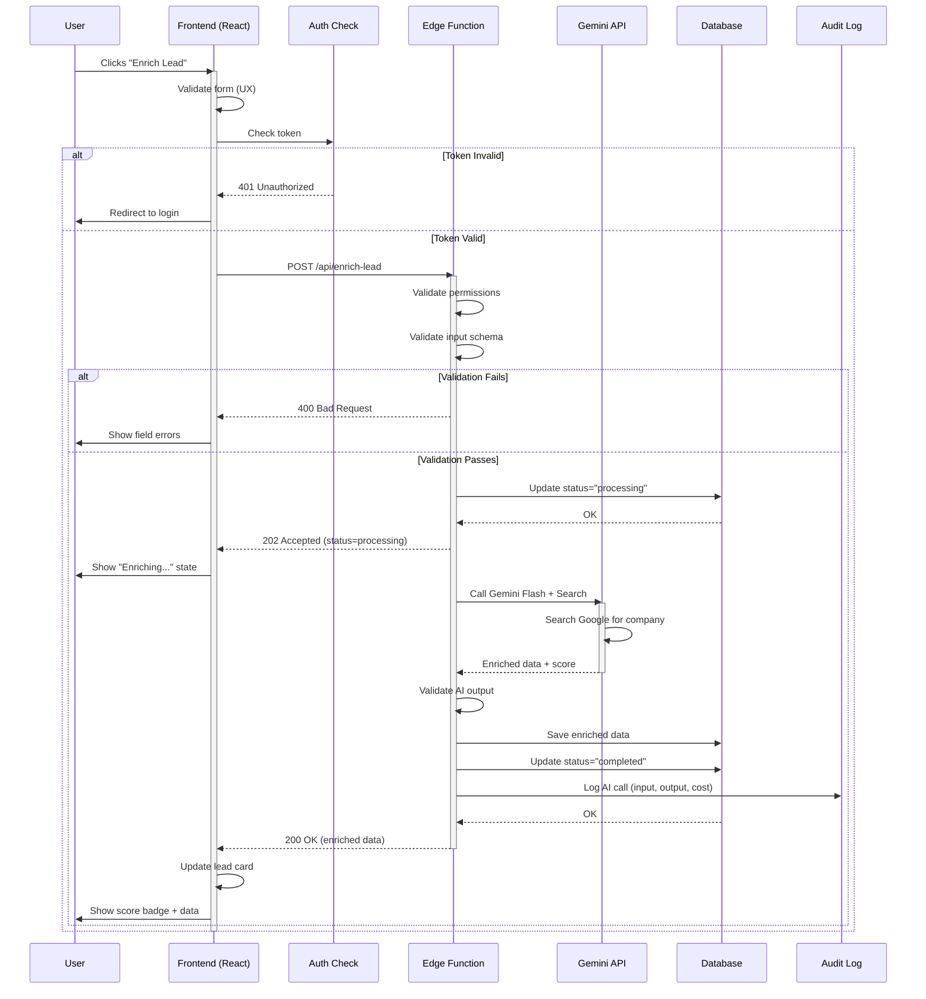

# RULE — Frontend ↔ Backend Wiring

**Purpose**: Define how frontend connects to backend safely  
**Audience**: Full-stack developers, AI engineers  
**Status**: Production-Ready

---

## 1) PURPOSE

"Wiring" means connecting UI actions to backend systems safely:
- **User events** → API calls → Edge Functions → Database writes/reads → UI updates
- **AI actions** always execute through backend boundaries (never client-side)
- **Every action is validated, logged, and traceable** from UI to database and back

This ensures security, consistency, and debuggability in production.

---

## 2) SYSTEM COMPONENTS

### Frontend (React)
**Responsibilities**:
- Render UI screens and forms
- Capture user input and intent
- Show loading, empty, error states
- Trigger API calls (never direct DB access)
- Validate UX (format, required fields)
- Display results from backend

**Does NOT**:
- Write to database directly
- Execute AI calls directly
- Determine permissions
- Calculate business logic results

---

### Backend (Supabase PostgreSQL)
**Responsibilities**:
- Store all data (source of truth)
- Enforce Row Level Security (RLS)
- Validate all writes
- Execute database triggers
- Maintain referential integrity

**Does NOT**:
- Trust frontend input without validation
- Allow anonymous writes
- Execute AI calls (that's Edge Functions)

---

### Edge Functions (Serverless)
**Responsibilities**:
- Validate user permissions (auth token)
- Validate input data (schema + business rules)
- Orchestrate AI calls (Gemini API)
- Execute business logic
- Write to database (after validation)
- Return structured responses
- Log all actions

**Does NOT**:
- Render UI
- Store state (stateless functions)
- Trust any input without validation

---

### AI Layer (Gemini API)
**Responsibilities**:
- Process prompts sent by Edge Functions
- Use tools (Search, Maps, Function Calling, etc.)
- Return structured outputs
- Execute code (Pro model only)

**Does NOT**:
- Write to database directly
- Navigate users
- Execute side effects without confirmation

---

### Logging/Observability
**Responsibilities**:
- Audit trail for all actions
- Error tracking and alerts
- Performance metrics
- AI call logs (input, model, output, cost)

**Tools**: Supabase logs, Sentry (errors), custom audit table

---

### Storage (Supabase Storage)
**Responsibilities**:
- Store files (call recordings, documents, images)
- Generate signed URLs for secure access
- Enforce access policies

**Does NOT**:
- Allow public write access
- Store without virus scanning (production requirement)

---

## 3) WIRING RULES (NON-NEGOTIABLE)

### Rule 1: Auth First
**Every API call must include authentication token.**

- Frontend sends: `Authorization: Bearer <token>`
- Edge Function validates: User exists, token not expired
- Database enforces: Row Level Security (RLS) per user

**Failure Mode**: 401 Unauthorized → Frontend shows login screen

---

### Rule 2: Backend Is Authoritative
**Frontend never trusts itself. Backend is source of truth.**

- Frontend validates UX (format, required fields)
- Backend validates truth (uniqueness, permissions, business rules)
- Frontend displays only what backend returns

**Example**: Frontend shows "Score: 85" only if backend calculated and returned it.

---

### Rule 3: One Source of Truth
**All IDs, statuses, timestamps come from database.**

- Frontend never generates permanent IDs (use temp IDs for optimistic UI)
- Backend assigns real IDs on creation
- Status transitions controlled by backend only

**Example**: Lead status = "enriching" → Only backend can change to "enriched"

---

### Rule 4: Validation Boundaries
**Frontend validates UX. Backend validates truth.**

**Frontend Validation** (immediate feedback):
- Email format
- Required fields
- Character limits
- Date ranges

**Backend Validation** (authoritative):
- Email uniqueness
- User permissions
- Business rules (e.g., "can't delete lead with active deals")
- Rate limits

---

### Rule 5: Idempotency
**Safe retries: Same input + same request = same result.**

- All mutations use idempotency keys
- Double-click "Save" doesn't create duplicates
- Retrying failed request is safe

**Implementation**: Edge Function checks if action already completed before executing.

---

### Rule 6: Error Contracts
**Errors have two audiences: users and developers.**

**User-Facing** (frontend displays):
- "Failed to save lead. Please try again."
- "Permission denied. Contact your admin."

**Developer-Facing** (logs):
- `ERROR_CODE: LEAD_DUPLICATE`
- `Stack trace: ...`
- `User ID: 123, Input: {...}`

---

### Rule 7: No Direct DB Writes from Client
**Client-side database SDKs are read-only for authenticated users.**

- Frontend can query own data (RLS enforced)
- Frontend cannot insert/update/delete without Edge Function
- All writes go through Edge Functions (validation layer)

---

### Rule 8: AI Cannot Perform Side Effects Directly
**AI outputs are suggestions, not actions.**

- AI generates email draft → User approves → Edge Function sends
- AI suggests meeting time → User confirms → Edge Function books
- AI recommends task → User saves → Edge Function writes to DB

**Exception**: Explicitly enabled workflows (e.g., Ghost Detection alerts run automatically)

---

### Rule 9: All AI Outputs Must Be Stored + Traceable
**Every AI call is logged.**

**Audit Log Includes**:
- Input (prompt + context)
- Model (Flash, Pro, Thinking)
- Tools used (Search, Function Calling, etc.)
- Output (raw response)
- Timestamp
- User ID
- Cost estimate

**Why**: Debugging, cost tracking, compliance, improving prompts

---

## 4) REQUEST/RESPONSE CONTRACTS

### Standard Request Format

**Required Inputs**:
- `userId` (from auth token)
- `action` (what to do: "enrich_lead", "analyze_call")
- `data` (input payload)
- `idempotencyKey` (for mutations)

**Optional Inputs**:
- `options` (filters, preferences)
- `metadata` (tracking context)

---

### Standard Response Format

**Success Response**:
- `status`: "success"
- `data`: Result object
- `message`: User-friendly confirmation
- `meta`: Timestamps, IDs, debug info

**Error Response**:
- `status`: "error"
- `code`: Error code (e.g., "VALIDATION_FAILED")
- `message`: User-friendly error
- `details`: Developer details (optional, not shown to user)

---

### Standard Error Types

| Error Code | HTTP Status | Meaning | User Message | Recovery |
|------------|-------------|---------|--------------|----------|
| `AUTH_REQUIRED` | 401 | No token | "Please log in" | Redirect to login |
| `PERMISSION_DENIED` | 403 | User can't access | "Permission denied" | Contact admin |
| `VALIDATION_FAILED` | 400 | Invalid input | "Invalid data. Check your input." | Show field errors |
| `NOT_FOUND` | 404 | Resource missing | "Not found" | Go back |
| `RATE_LIMIT` | 429 | Too many requests | "Too many requests. Try again later." | Wait 60s |
| `AI_TIMEOUT` | 504 | AI took too long | "Request timed out. Try again." | Retry |
| `SERVER_ERROR` | 500 | Unexpected error | "Something went wrong. We're on it." | Retry, report |

---

### Status Lifecycle States

**Common Workflow States**:
1. `created` → Resource exists, no processing yet
2. `processing` → AI/backend working on it
3. `completed` → Successfully finished
4. `failed` → Error occurred, need retry
5. `cancelled` → User cancelled

**UI Shows**:
- `created` → "Pending..."
- `processing` → "Analyzing..." (thinking state)
- `completed` → Show results
- `failed` → Error state + retry button
- `cancelled` → Empty state or removed

---

## 5) EVENT FLOW (UI → BACKEND → UI)

### Basic Flow Pattern



---

### Flow Examples by Action Type

#### Form Submit (Immediate)
1. User fills form
2. Frontend validates UX (required fields)
3. Frontend sends POST to Edge Function
4. Edge Function validates + writes to DB
5. Frontend receives success → Shows confirmation
6. **Time**: < 1 second

---

#### AI Action Button (Async)
1. User clicks "Analyze Call"
2. Frontend validates (file uploaded)
3. Frontend sends POST to Edge Function
4. Edge Function updates status="processing"
5. Frontend shows "Analyzing..." state
6. Edge Function calls Gemini AI (30s)
7. Edge Function writes results to DB
8. Frontend polls or receives webhook
9. Frontend shows results
10. **Time**: 10-60 seconds

---

#### Generate Plan (Multi-Step)
1. User clicks "Generate Plan"
2. Frontend opens modal with form
3. User fills preferences → Submits
4. Frontend sends POST to Edge Function
5. Edge Function creates job record (status="created")
6. Frontend navigates to `/plans/:id/generating` (status screen)
7. Edge Function calls Gemini Thinking (multi-step)
8. Edge Function saves partial results
9. Frontend polls status every 2s
10. Edge Function completes → status="completed"
11. Frontend navigates to `/plans/:id` (results screen)
12. **Time**: 1-3 minutes

---

#### Save/Export/Book (Confirmation)
1. User reviews AI-generated content
2. User clicks "Save"
3. Frontend shows confirmation modal
4. User confirms
5. Frontend sends POST to Edge Function
6. Edge Function validates + writes to DB
7. Frontend receives success → Shows toast
8. Frontend navigates to saved item
9. **Time**: < 1 second

---

## 6) EDGE FUNCTION RULES

### Design Principles

#### Rule 1: One Function = One Responsibility
**Good**:
- `/api/enrich-lead` → Enriches one lead
- `/api/analyze-call` → Analyzes one call
- `/api/search-query` → Executes search

**Bad**:
- `/api/do-everything` → Multiple unrelated actions

---

#### Rule 2: Input Validation & Permission Checks
**Every Edge Function Must**:
1. Extract auth token
2. Validate user exists
3. Check user permissions
4. Validate input schema (types, required fields)
5. Check business rules (e.g., "can't delete if has children")
6. Return 400/403 if validation fails

---

#### Rule 3: Consistent Naming
**Pattern**: `/api/{action}-{resource}`

**Examples**:
- `/api/create-lead`
- `/api/update-lead`
- `/api/delete-lead`
- `/api/enrich-lead`
- `/api/analyze-call`
- `/api/search-query`

---

#### Rule 4: Stable Outputs for UI
**Edge Functions return consistent schemas.**

**Example**: `/api/enrich-lead` always returns:
```
{
  status: "success" | "error",
  data: {
    leadId: string,
    score: number (0-100),
    companyData: {...},
    confidence: number (0-100)
  },
  meta: {
    timestamp: ISO string,
    processingTime: number (ms)
  }
}
```

**UI knows exactly what to expect.**

---

#### Rule 5: Logging Required
**Every Edge Function Must Log**:
- Start time
- User ID
- Action performed
- Input payload (sanitized)
- AI calls (if any)
- Database writes
- End time + duration
- Success or error

**Log Level**:
- Info: Normal operations
- Warn: Retries, fallbacks
- Error: Failures

---

#### Rule 6: Timeouts and Fallback Behavior
**Edge Functions have max execution time (60s default).**

**Patterns**:
- **Quick actions** (< 5s): Synchronous response
- **Medium actions** (5-30s): Async with polling
- **Long actions** (30s+): Background job + webhook

**Timeout Behavior**:
- Save partial progress to DB
- Return 202 Accepted with job ID
- User polls `/api/job/:id/status`

---

#### Rule 7: Async Workflow Pattern
**For long-running tasks:**

1. Edge Function creates job record (status="created")
2. Edge Function returns 202 Accepted with job ID
3. Background worker processes job
4. Worker updates job status in DB
5. Frontend polls `/api/job/:id/status` every 2-5s
6. When status="completed", frontend fetches results

**Alternative**: Webhooks (if frontend supports)

---

## 7) AI WIRING RULES (GEMINI)

### Model Selection Strategy

#### Gemini 2.0 Flash (Fast, Cheap)
**Use When**:
- Quick UI assistance (form suggestions)
- Search queries (Command Bar)
- Lead enrichment (company lookup)
- Chat responses
- Tag generation

**Cost**: ~$0.10 per 1M tokens  
**Latency**: < 2 seconds

---

#### Gemini 2.0 Pro (Reasoning)
**Use When**:
- Call transcript analysis
- Deal health assessment
- Sentiment analysis
- Email tone detection
- Complex scoring

**Cost**: ~$1.25 per 1M tokens  
**Latency**: 3-10 seconds

---

#### Gemini 2.0 Pro Thinking (Multi-Step)
**Use When**:
- Post-call action prioritization
- Strategic recommendations
- Multi-step planning
- Risk assessment
- Decision trees

**Cost**: ~$1.25 per 1M tokens + thinking time  
**Latency**: 10-60 seconds

---

### Tool Selection Strategy

#### Function Calling
**Use When**: You need structured outputs (database writes, UI components)

**Example**: Extract action items from call transcript
- Input: Call transcript text
- Output: `[{type: "send_email", priority: "high", ...}]`

---

#### Search Grounding
**Use When**: You need fresh external data

**Example**: Lead enrichment
- Input: Company name
- Tool: Google Search
- Output: Company size, industry, revenue, location

---

#### Maps Grounding
**Use When**: You need location data

**Example**: Territory planning
- Input: Lead addresses
- Tool: Google Maps
- Output: Distance, route, travel time

---

#### File Search / RAG
**Use When**: You need to search user's own data

**Example**: Search call transcripts
- Input: "What did John say about pricing?"
- Tool: Vector search in transcript DB
- Output: Relevant transcript segments

---

#### Code Execution
**Use When**: You need calculations or data transformations

**Example**: Contract value calculation
- Input: Contract terms
- Tool: Python sandbox
- Output: Total value, milestones, payment schedule

---

#### Structured Outputs
**Use When**: You need type-safe responses for DB writes

**Example**: Database insert
- Input: AI-generated lead data
- Output: Validated schema matching DB columns

---

### AI Trigger Rules

#### Rule: AI Triggers Must Be Explicit
**User must explicitly request AI action.**

**Allowed**:
- User clicks "Enrich Lead" button
- User types in Command Bar and presses Enter
- User uploads file and clicks "Analyze"
- User confirms "Generate" in modal

**Not Allowed**:
- Auto-enrichment on page load (expensive, unexpected)
- AI runs in background without indicator
- AI navigates user without confirmation

**Exception**: Scheduled workflows (Ghost Detection) run automatically but notify user.

---

## 8) WORKFLOWS (3 LEVELS)

### Simple Workflow: Lead Enrichment

**Type**: Immediate result (< 5 seconds)

**Flow**:
1. **UI**: User on `/leads/123`
2. **UI**: User clicks "Enrich Lead" button
3. **UI**: Shows "Enriching..." spinner inline
4. **Edge Function**: `/api/enrich-lead`
   - Validates user can access lead 123
   - Calls Gemini Flash + Search Grounding
   - AI returns company data + score
   - Validates AI output schema
   - Writes to database (lead enriched data)
   - Logs AI call
5. **UI**: Receives enriched data
6. **UI**: Updates lead card with score badge
7. **UI**: Shows toast "Lead enriched successfully"

**Screens Involved**: 1 (LeadDetailScreen)

**Validation Points**:
- Auth: User owns lead
- Input: Lead ID exists
- Output: Score 0-100, confidence 0-100

**Failure Modes**:
- AI timeout (30s) → Show "Try again" button
- Invalid response → Show "Enrichment failed"
- Permission denied → Show "Access denied"

**Success Criteria**:
- [ ] Score badge appears
- [ ] Company data fields populated
- [ ] Audit log entry created

---

### Medium Workflow: Call Analysis

**Type**: Async with progress (10-30 seconds)

**Flow**:
1. **UI**: User on `/calls`
2. **UI**: User uploads call recording → Modal opens
3. **UI**: User clicks "Analyze"
4. **Edge Function**: `/api/analyze-call`
   - Validates file (audio format, size < 100MB)
   - Creates call record (status="processing")
   - Returns 202 Accepted with call ID
5. **UI**: Navigates to `/calls/:id/analyzing` (status screen)
6. **UI**: Shows "Analyzing..." with thinking animation
7. **Edge Function**: Background processing
   - Transcribes audio (Speech-to-Text API)
   - Calls Gemini Pro (analyze transcript)
   - Extracts actions (Function Calling)
   - Calculates deal health (Code Execution)
   - Writes results to DB (status="completed")
   - Logs AI call
8. **UI**: Polls `/api/call/:id/status` every 2s
9. **Edge Function**: Returns status="completed"
10. **UI**: Navigates to `/calls/:id/results`
11. **UI**: Shows summary + action cards

**Screens Involved**: 3 (CallsListScreen, CallAnalyzingStatusScreen, CallAnalysisResultsScreen)

**Validation Points**:
- Auth: User owns call
- Input: Audio file valid
- Progress: Status updates in DB
- Output: Transcript exists, actions extracted

**Failure Modes**:
- Audio transcription fails → Show "Upload failed, try again"
- AI timeout → Save transcript, show "Analysis incomplete"
- Network error during polling → Auto-retry 3x

**Success Criteria**:
- [ ] Transcript saved
- [ ] Action items extracted
- [ ] Deal health score calculated
- [ ] User can execute actions

---

### Complex Workflow: Multi-Step Project Plan

**Type**: Background job with partial saves (1-3 minutes)

**Flow**:
1. **UI**: User on `/dashboard`
2. **UI**: User clicks "Create Plan" → Wizard modal opens
3. **UI**: User fills preferences (Step 1, 2, 3) → Clicks "Generate"
4. **Edge Function**: `/api/create-plan`
   - Validates input preferences
   - Creates plan record (status="created")
   - Returns 202 Accepted with plan ID
5. **UI**: Navigates to `/plans/:id/generating` (status screen)
6. **UI**: Shows progress bar + thinking animation
7. **Edge Function**: Background processing
   - Calls Gemini Thinking (multi-step planning)
   - **Step 1**: Analyze requirements → Save to DB
   - **Step 2**: Generate options → Save to DB
   - **Step 3**: Evaluate options → Save to DB
   - **Step 4**: Recommend best option → Save to DB
   - Updates status="completed"
   - Logs AI call
8. **UI**: Polls `/api/plan/:id/status` every 2s
9. **UI**: Shows partial progress (Step 1/4 complete...)
10. **Edge Function**: Returns status="completed"
11. **UI**: Navigates to `/plans/:id` (results screen)
12. **UI**: Shows final plan + recommendations
13. **User**: Reviews, edits, saves or rejects

**Screens Involved**: 4 (DashboardScreen, PlanWizardModal, PlanGeneratingStatusScreen, PlanDetailScreen)

**Validation Points**:
- Auth: User has plan quota
- Input: Preferences valid
- Progress: Partial saves successful
- Output: Final plan has required sections

**Failure Modes**:
- AI fails at Step 2 → Partial plan saved, user can retry from Step 2
- Timeout at Step 3 → Show "Generation incomplete" with partial results
- User cancels → Save draft (status="cancelled")

**Success Criteria**:
- [ ] All 4 steps completed
- [ ] Plan saved to database
- [ ] User can edit before finalizing
- [ ] Audit log shows all AI steps

---

## 9) REAL-WORLD EXAMPLES

### Example 1: User Generates Lead Recommendations and Saves

**Scenario**: User wants AI to recommend top 5 leads to contact this week

**UI Trigger**:
- User on `/dashboard`
- User clicks "Recommend Leads" button
- Modal opens: "What's your priority? (Revenue, Quick Wins, New Markets)"
- User selects "Revenue" → Clicks "Generate"

**Backend/Edge Function Actions**:
1. **Edge Function**: `/api/recommend-leads`
   - Validates user authenticated
   - Checks user has active leads
   - Calls Gemini Pro Thinking:
     - Input: All user's leads + deal data + recent activity
     - Tool: Code Execution (scoring algorithm)
     - Output: Ranked list with reasoning
   - Validates output (5 leads returned)
   - Saves recommendations to DB (temporary, expires in 7 days)
   - Logs AI call (cost: ~$0.05)

**AI Role**:
- Gemini Pro Thinking analyzes all leads
- Uses Code Execution to calculate revenue potential
- Returns structured output with reasoning

**Final UI Outcome**:
1. Modal closes
2. `/dashboard` shows "Recommendations Ready" card
3. User clicks → Navigates to `/recommendations`
4. Shows 5 lead cards with scores + reasoning
5. User can:
   - "Save to Campaign" → Writes to DB
   - "Dismiss" → Deletes temporary record
   - "Regenerate" → Calls Edge Function again

**Time**: 10-20 seconds (Thinking model)

---

### Example 2: User Uploads Docs → RAG Summarizes → Dashboard Updates

**Scenario**: User uploads contract PDF, AI extracts key terms, dashboard shows summary

**UI Trigger**:
- User on `/contracts`
- User drags PDF file → Upload zone
- Modal shows preview → User clicks "Analyze Contract"

**Backend/Edge Function Actions**:
1. **Storage**: Upload file to Supabase Storage
   - Validates: PDF format, size < 25MB
   - Virus scan (production requirement)
   - Returns signed URL

2. **Edge Function**: `/api/analyze-contract`
   - Validates user authenticated
   - Validates file exists
   - Creates contract record (status="processing")
   - Returns 202 Accepted with contract ID

3. **Background Worker**:
   - Extracts text from PDF
   - Chunks text into paragraphs
   - Stores in vector database (pgvector)
   - Calls Gemini Pro + File Search (RAG):
     - Input: "Extract payment terms, milestones, total value"
     - Tool: RAG search in contract chunks
     - Output: Structured contract data
   - Calls Gemini Pro + Code Execution:
     - Input: Payment terms
     - Tool: Python calculation
     - Output: Payment schedule
   - Saves to database (status="completed")
   - Logs AI call

**AI Role**:
- Gemini Pro uses RAG to find relevant contract sections
- Gemini Pro uses Code Execution to calculate milestones
- Returns structured data (payment schedule, key dates)

**Final UI Outcome**:
1. **UI**: Navigates to `/contracts/:id/analyzing` (status screen)
2. **UI**: Shows "Analyzing contract..." (30-60s)
3. **UI**: Polls status every 2s
4. **Edge Function**: Returns status="completed"
5. **UI**: Navigates to `/contracts/:id` (results screen)
6. **UI**: Shows:
   - Payment terms (Net 30, 50% upfront)
   - Total value ($250,000)
   - Milestones (3 phases)
   - Key dates highlighted
7. **Dashboard**: Auto-updates "Contracts" widget with new count

**Time**: 30-60 seconds (RAG + Code Execution)

---

### Example 3: User Triggers Multi-Step Automation with Progress States

**Scenario**: User activates "Ghost Detection" workflow to find stale leads and send re-engagement emails

**UI Trigger**:
- User on `/workflows`
- User clicks "Ghost Detection" card → Detail modal
- Modal shows: "This will find leads inactive for 30+ days and draft re-engagement emails"
- User clicks "Run Now"

**Backend/Edge Function Actions**:
1. **Edge Function**: `/api/run-workflow`
   - Validates user authenticated
   - Validates workflow exists ("ghost-detection")
   - Creates job record (status="created")
   - Returns 202 Accepted with job ID

2. **Background Worker** (Multi-Step):
   - **Step 1: Find Stale Leads**
     - Query DB: Leads with no activity in 30+ days
     - Finds: 42 leads
     - Updates job: `{step: 1, total: 42, status: "processing"}`
   
   - **Step 2: Score Leads**
     - Calls Gemini Flash for each lead (batch 10):
       - Input: Lead data + past activity
       - Tool: Function Calling (scoring)
       - Output: Re-engagement score (0-100)
     - Updates job: `{step: 2, processed: 10/42, status: "processing"}`
   
   - **Step 3: Draft Emails**
     - Calls Gemini Pro for top 20 leads:
       - Input: Lead profile + last interaction
       - Tool: RAG (past emails for style)
       - Output: Personalized email draft
     - Saves drafts to DB
     - Updates job: `{step: 3, processed: 20/20, status: "processing"}`
   
   - **Step 4: Finalize**
     - Updates job: `{step: 4, status: "completed"}`
     - Logs workflow execution

**AI Role**:
- Gemini Flash scores 42 leads (fast, cheap)
- Gemini Pro drafts 20 emails (personalized, quality)
- All AI outputs saved for review (not auto-sent)

**Final UI Outcome**:
1. **UI**: Navigates to `/workflows/jobs/:id` (progress screen)
2. **UI**: Shows progress bar:
   - Step 1: Finding leads... ✅
   - Step 2: Scoring leads... (10/42) ⏳
   - Step 3: Drafting emails... 
   - Step 4: Finalizing...
3. **UI**: Polls `/api/job/:id/status` every 2s
4. **UI**: Progress updates in real-time
5. **Edge Function**: Returns status="completed" (after ~2 minutes)
6. **UI**: Navigates to `/workflows/jobs/:id/results`
7. **UI**: Shows:
   - 42 stale leads found
   - 20 high-priority leads scored
   - 20 email drafts ready for review
   - "Review Emails" button → Opens `/emails/drafts`
8. **User**: Reviews drafts, edits if needed, clicks "Send Selected"
9. **Edge Function**: `/api/send-emails` (with user confirmation)
10. **UI**: Shows "5 emails sent" toast

**Time**: 2-3 minutes (batch processing)

---

## 10) TESTING & VALIDATION (MANDATORY)

### Acceptance Test Format

All tests use **Given / When / Then** format.

---

### Test 1: Auth & Permission Failures

**Given**: User is not logged in  
**When**: User tries to access `/leads`  
**Then**:
- [ ] UI redirects to `/login`
- [ ] API returns 401 Unauthorized
- [ ] No data exposed

---

**Given**: User A tries to access User B's lead  
**When**: User A calls `/api/leads/:id` (User B's lead)  
**Then**:
- [ ] API returns 403 Permission Denied
- [ ] Database RLS blocks query
- [ ] Error logged with user ID

---

### Test 2: Partial Network Failure + Retry

**Given**: User clicks "Enrich Lead"  
**When**: Network fails after 15s (AI call in progress)  
**Then**:
- [ ] UI shows "Network error. Retrying..."
- [ ] Edge Function marked as failed (timeout)
- [ ] UI auto-retries 1x after 3s
- [ ] If retry succeeds → Show results
- [ ] If retry fails → Show "Failed. Retry manually?"

---

**Given**: User uploads call recording  
**When**: Network drops during transcription  
**Then**:
- [ ] Transcription continues server-side (background job)
- [ ] UI shows "Connection lost. Reconnecting..."
- [ ] UI resumes polling when reconnected
- [ ] Results appear when job completes

---

### Test 3: Idempotency (Double-Click Submit)

**Given**: User fills "Add Lead" form  
**When**: User double-clicks "Save" button (2 POST requests)  
**Then**:
- [ ] Only 1 lead created in database
- [ ] Second request returns 200 OK (already created)
- [ ] UI shows 1 success toast (not 2)
- [ ] Idempotency key used: `{userId}-{action}-{timestamp}`

---

**Given**: User clicks "Send Email" twice  
**When**: Both requests reach server  
**Then**:
- [ ] Only 1 email sent
- [ ] Second request detects duplicate (check last 60s)
- [ ] Both requests return 200 OK (same result)

---

### Test 4: AI Failure Fallback (Manual Path)

**Given**: User clicks "Analyze Call"  
**When**: Gemini API times out (60s)  
**Then**:
- [ ] UI shows "Analysis timed out"
- [ ] Transcript saved (partial success)
- [ ] UI offers: "Retry Analysis" or "Extract Actions Manually"
- [ ] User can manually add action items

---

**Given**: User clicks "Enrich Lead"  
**When**: Gemini returns invalid data (score > 100)  
**Then**:
- [ ] Edge Function rejects AI output
- [ ] UI shows "Enrichment failed. Try again or enter manually."
- [ ] User can manually enter company data
- [ ] Error logged with AI response for debugging

---

### Test 5: Data Consistency (IDs, Timestamps, Status)

**Given**: User creates lead  
**When**: Lead saved to database  
**Then**:
- [ ] Lead ID is UUID (generated by DB)
- [ ] `createdAt` timestamp is server time (not client time)
- [ ] Status = "active" (default)
- [ ] User cannot override ID or timestamps from frontend

---

**Given**: AI enrichment completes  
**When**: Edge Function writes enriched data  
**Then**:
- [ ] Status changes: "processing" → "completed"
- [ ] `enrichedAt` timestamp recorded
- [ ] Previous status cannot be restored (status transitions are append-only in audit log)

---

## 11) PRODUCTION CHECKLIST

### Security Boundaries Enforced
- [ ] All API routes require authentication
- [ ] Database RLS policies active (no anonymous writes)
- [ ] Edge Functions validate all inputs
- [ ] File uploads virus-scanned
- [ ] API keys never exposed to client
- [ ] CORS configured correctly
- [ ] Rate limiting enabled (100 req/min per user)

---

### Logs Exist for All Actions
- [ ] All Edge Function calls logged
- [ ] All AI calls logged (input, model, output, cost)
- [ ] All database writes logged (audit table)
- [ ] Errors logged with stack traces
- [ ] Performance metrics tracked (P50, P95, P99)

---

### UI Has Loading/Empty/Error States
- [ ] Every screen has loading skeleton
- [ ] Every screen has empty state with CTA
- [ ] Every screen has error state with retry
- [ ] No blank white screens
- [ ] Thinking animations for AI tasks

---

### Mobile Responsiveness Verified
- [ ] All screens tested on mobile (375px width)
- [ ] Touch targets ≥ 44px
- [ ] Forms usable on mobile
- [ ] Modals scrollable on small screens
- [ ] Bottom navigation works

---

### AI Actions Auditable and Reversible
- [ ] All AI calls logged in audit table
- [ ] User can see "Why this recommendation?"
- [ ] User can undo AI actions (e.g., delete draft email)
- [ ] AI costs tracked per user
- [ ] AI outputs can be regenerated

---

### End-to-End Flows Tested
- [ ] New user signup → first lead → enrichment → view
- [ ] Upload call → analysis → action execution → task created
- [ ] Search query → results → click → detail page
- [ ] Workflow trigger → progress → completion → results
- [ ] Error scenarios (timeout, network fail, invalid input)

---

### Performance Benchmarks Met
- [ ] Page load < 2s (First Contentful Paint)
- [ ] API response < 500ms (P95)
- [ ] AI enrichment < 5s (Flash)
- [ ] AI analysis < 30s (Pro)
- [ ] Background jobs < 5 min (Thinking)

---

### Deployment Validated
- [ ] Environment variables set
- [ ] Database migrations applied
- [ ] Edge Functions deployed
- [ ] AI API keys active
- [ ] Monitoring alerts configured
- [ ] Backup strategy active

---

**Status**: Production-ready wiring checklist  
**Last Updated**: 2024-12-20  
**Enforcement**: All checks must pass before production deploy
