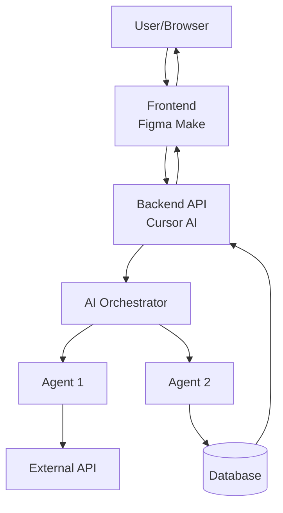
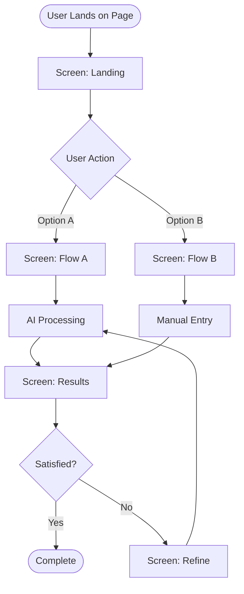
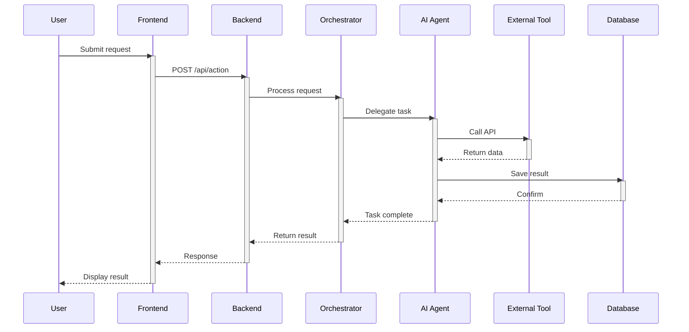
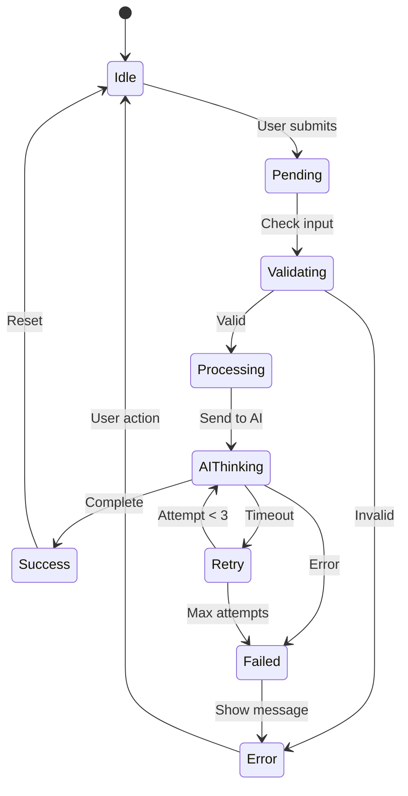
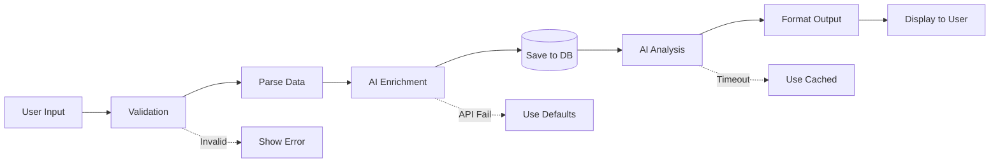
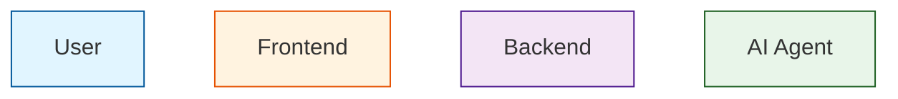
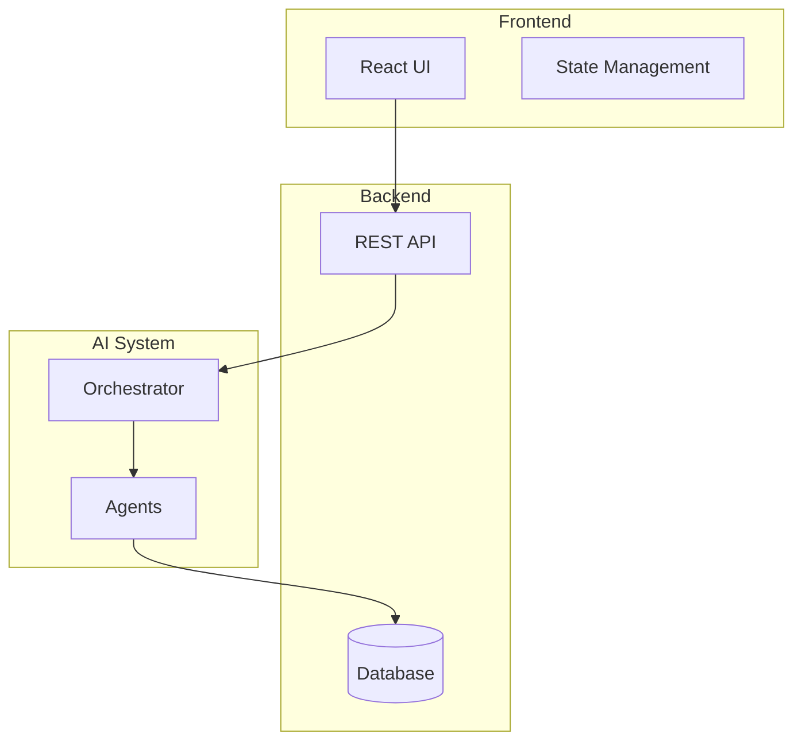

# MERMAID DIAGRAM STANDARDS

## REQUIRED DIAGRAMS

### 1. System Architecture
**When**: Every product plan  
**Shows**: Frontend, backend, AI, databases, external APIs  
**Type**: `graph TB` or `graph LR`

### 2. User Journey Flow
**When**: For each main user journey  
**Shows**: Screens, decisions, outcomes  
**Type**: `flowchart TD`

### 3. Agent Sequence
**When**: For each AI agent workflow  
**Shows**: User → UI → Orchestrator → Agents → Tools  
**Type**: `sequenceDiagram`

### 4. State Machine
**When**: Complex workflows with states  
**Shows**: States, transitions, triggers  
**Type**: `stateDiagram-v2`

### 5. Data Flow
**When**: Data processing workflows  
**Shows**: Input → Processing → Storage → Output  
**Type**: `graph LR`

---

## DIAGRAM RULES

### General
- Label every node clearly
- Use consistent naming
- Keep diagrams focused (one concept)
- Max 20 nodes per diagram
- Use colors sparingly

### Node Naming
- User-facing: "User", "Customer", "Admin"
- Systems: "Frontend", "API", "Database"
- Agents: "Orchestrator", "Agent Name"
- Actions: Verbs ("Process", "Validate", "Send")

### Arrow Labels
- Keep short (2-4 words)
- Use present tense
- Be specific ("Send email" not "Do thing")

---

## TEMPLATES

### System Architecture

### User Journey Flow

### Agent Sequence

### State Machine

### Data Flow

---

## STYLING GUIDE

### Use Colors for Clarity

### Use Subgraphs for Grouping

---

## VALIDATION CHECKLIST

### Before Committing Diagram
- [ ] All nodes labeled clearly
- [ ] All arrows labeled (if needed)
- [ ] Direction makes sense (top-to-bottom or left-to-right)
- [ ] No orphan nodes
- [ ] No circular references (unless intentional)
- [ ] Fits in standard viewport (no excessive scrolling)
- [ ] Matches written specs
- [ ] Updated if specs change

---

## ANTI-PATTERNS

### ❌ Too Complex
- More than 20 nodes
- Unclear hierarchy
- Spaghetti connections

### ❌ Too Vague
- Unlabeled nodes
- Generic names ("Thing", "Stuff")
- No context

### ❌ Outdated
- Doesn't match current implementation
- Shows features not yet built
- Missing new components

---

## DIAGRAM TYPES QUICK REF

| Type | Use Case | Syntax |
|------|----------|--------|
| Graph | Architecture, data flow | `graph TB` |
| Flowchart | User journeys, decisions | `flowchart TD` |
| Sequence | API calls, agent interactions | `sequenceDiagram` |
| State | Workflow states, transitions | `stateDiagram-v2` |
| Class | Data models (rare) | `classDiagram` |
| ERD | Database schema (rare) | `erDiagram` |

---

## INTEGRATION WITH DOCS

### In Product Plans
- One diagram per major section
- Reference diagrams in text
- Keep diagrams updated with specs

### In Handoff Docs
- Include relevant diagrams
- Export as images if needed
- Version diagrams with code

### In Implementation
- Reference diagram in code comments
- Update diagram when architecture changes
- Use diagrams for PR reviews

---

**Status**: Use these standards for all diagrams
