# 🎛️ Dashboard Architecture - Luxury AI CRM

**Comprehensive guide to all dashboard screens, AI agents, workflows, and user journeys**

---

## 📊 **DASHBOARD ECOSYSTEM OVERVIEW**

### **3 Dashboard Categories**
1. **CLIENT DASHBOARD** (2 screens) - Project tracking & collaboration
2. **CRM/ADMIN PORTAL** (4 screens) - Lead management & system control
3. **SALES INTELLIGENCE OS** (4 screens) - Call analysis & AI insights

**Total:** 11 dashboard screens (10 admin, 1 client)

---

## 🗺️ **DASHBOARD SITEMAP**

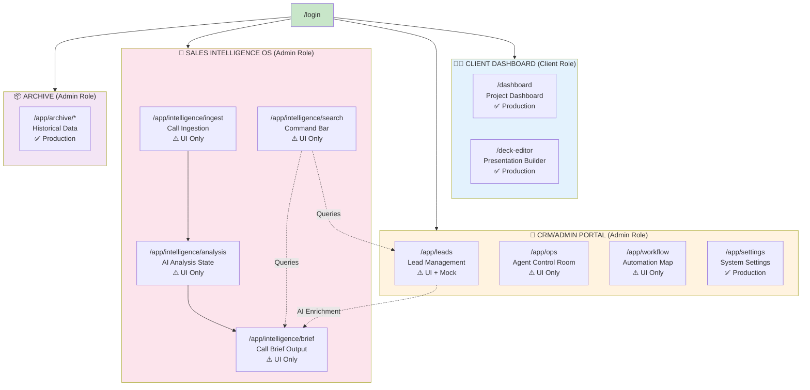

---

## 🧑‍💼 **CLIENT DASHBOARD (Client Role)**

### **Screen 1: Project Dashboard** (`/dashboard`)

#### **Overview**
Post-wizard interface where clients track project milestones, download deliverables, and communicate with the Sun AI team.

#### **Features**
```
┌─────────────────────────────────────────────────────────────────┐
│ PROJECT DASHBOARD                                               │
├─────────────────────────────────────────────────────────────────┤
│                                                                 │
│ 🎯 Progress Overview                                            │
│ ├── Phase visualization (1-5)                                   │
│ ├── Overall completion % with progress bar                      │
│ ├── Current milestone status                                    │
│ └── Estimated completion date                                   │
│                                                                 │
│ 📋 Milestone Tracker                                            │
│ ├── Phase cards (Discovery, Design, Build, Test, Launch)       │
│ ├── Checkboxes for sub-tasks                                   │
│ ├── File attachments per milestone                             │
│ └── Team comments & feedback                                    │
│                                                                 │
│ 📁 Deliverables Library                                         │
│ ├── Downloadable mockups (Figma exports)                        │
│ ├── Design system docs                                          │
│ ├── Code snippets & documentation                               │
│ └── Final deployment links                                      │
│                                                                 │
│ 💬 Team Messaging                                               │
│ ├── Threaded conversations                                      │
│ ├── @mentions for notifications                                 │
│ ├── File sharing in chat                                        │
│ └── Read receipts                                               │
│                                                                 │
│ 🔔 Activity Feed                                                │
│ └── Real-time updates (file uploaded, milestone completed)      │
└─────────────────────────────────────────────────────────────────┘
```

#### **User Journey**
```mermaid
graph LR
    A[Client Logs In] --> B{First Visit?}
    B -->|Yes| C[Welcome Tour]
    B -->|No| D[Dashboard Home]
    C --> D
    D --> E[View Progress: Phase 3, 75%]
    E --> F[Click Milestone 3.2]
    F --> G[Download Mockups ZIP]
    G --> H[Review Designs]
    H --> I{Approve?}
    I -->|Yes| J[Click 'Approve' Button]
    I -->|No| K[Open Team Chat]
    K --> L[Type Feedback]
    L --> M[Team Receives Notification]
    J --> N[Milestone Auto-Advances]
    N --> O[Email Confirmation Sent]
    
    style A fill:#c8e6c9
    style D fill:#e3f2fd
    style G fill:#fff9c4
    style J fill:#c5e1a5
```

#### **Technical Specs**
- **Frontend:** React + Tailwind, motion/react animations
- **State:** React Context for project data
- **Real-time:** WebSocket for live updates (optional)
- **File Storage:** Supabase Storage for deliverables
- **Auth:** Protected route, requires `client` role

#### **AI Agents Required**
❌ None - Pure frontend with database reads

#### **Workflows**
1. **Milestone Completion Flow**
   - Admin marks milestone complete → Client receives email → Dashboard updates
2. **File Upload Flow**
   - Admin uploads file → Appears in deliverables → Client downloads
3. **Comment Flow**
   - Client posts comment → Admin receives Slack notification → Responds

#### **Status**
✅ **Production Ready** - No AI implementation needed

---

### **Screen 2: Presentation Builder** (`/deck-editor`)

#### **Overview**
Drag-and-drop slide editor for clients to create pitch decks using pre-built templates and their project data.

#### **Features**
```
┌─────────────────────────────────────────────────────────────────┐
│ PRESENTATION BUILDER                                            │
├─────────────────────────────────────────────────────────────────┤
│                                                                 │
│ 📑 Template Library                                             │
│ ├── Investor Pitch (12 slides)                                  │
│ ├── Client Proposal (8 slides)                                  │
│ ├── Product Demo (10 slides)                                    │
│ └── Team Update (6 slides)                                      │
│                                                                 │
│ 🎨 Slide Editor                                                 │
│ ├── Drag-and-drop components                                    │
│ ├── Text editing with formatting                                │
│ ├── Image upload & positioning                                  │
│ ├── Chart insertion (from project data)                         │
│ └── Logo/brand color customization                              │
│                                                                 │
│ 🖼️ Slide Navigator                                              │
│ ├── Thumbnail view of all slides                                │
│ ├── Drag to reorder                                             │
│ ├── Duplicate/delete slides                                     │
│ └── Add blank slide                                             │
│                                                                 │
│ 📤 Export Options                                               │
│ ├── PDF export (print-ready)                                    │
│ ├── PPTX export (editable)                                      │
│ ├── Share link (view-only)                                      │
│ └── Embed code (iframe)                                         │
│                                                                 │
│ 🎨 Brand Kit                                                    │
│ ├── Upload logo                                                 │
│ ├── Custom color palette                                        │
│ ├── Font selection                                              │
│ └── Footer customization                                        │
└─────────────────────────────────────────────────────────────────┘
```

#### **User Journey**
```mermaid
graph LR
    A[Client Needs Pitch Deck] --> B[Navigate to /deck-editor]
    B --> C[Browse Templates]
    C --> D[Select 'Investor Pitch']
    D --> E[Template Loads: 12 Slides]
    E --> F[Click Slide 1: Cover]
    F --> G[Edit Title Text]
    G --> H[Upload Company Logo]
    H --> I[Customize Brand Colors]
    I --> J[Navigate to Slide 5: Traction]
    J --> K[Insert Chart from Dashboard Data]
    K --> L[Review All Slides]
    L --> M{Ready to Export?}
    M -->|No| F
    M -->|Yes| N[Click 'Export PDF']
    N --> O[Download Generated PDF]
    O --> P[Share with Investors]
    
    style A fill:#fff3e0
    style E fill:#e3f2fd
    style N fill:#c5e1a5
    style O fill:#fff9c4
```

#### **Technical Specs**
- **Frontend:** React + Tailwind, drag-and-drop library (react-dnd)
- **Canvas:** HTML5 Canvas API for slide rendering
- **Export:** jsPDF for PDF, PptxGenJS for PPTX
- **Storage:** Supabase for saving drafts
- **Auth:** Protected route, requires `client` role

#### **AI Agents Required**
❌ None - Pure frontend editor

#### **Workflows**
1. **Template Selection Flow**
   - Client selects template → Slides populate → Edits content → Saves draft
2. **Export Flow**
   - Client clicks export → Canvas renders to PDF → Download triggers
3. **Sharing Flow**
   - Client generates share link → Creates public URL → Copies to clipboard

#### **Status**
✅ **Production Ready** - No AI implementation needed

---

## 🏢 **CRM/ADMIN PORTAL (Admin Role)**

### **Screen 3: Lead Management** (`/app/leads`)

#### **Overview**
Kanban-style CRM for managing sales leads with AI-powered enrichment, pipeline tracking, and activity logs.

#### **Features**
```
┌─────────────────────────────────────────────────────────────────┐
│ LEAD MANAGEMENT CRM                                             │
├─────────────────────────────────────────────────────────────────┤
│                                                                 │
│ 🎯 Pipeline View (Kanban)                                       │
│ ├── New (12 leads)                                              │
│ ├── Contacted (8 leads)                                         │
│ ├── Qualified (6 leads)                                         │
│ ├── Proposal Sent (4 leads)                                     │
│ └── Closed/Won (2 leads)                                        │
│                                                                 │
│ 🔍 Filters & Search                                             │
│ ├── Status filter (Hot/Warm/Cold)                               │
│ ├── Source filter (Wizard/Manual/Import)                        │
│ ├── Date range picker                                           │
│ └── Free text search (name, company, email)                     │
│                                                                 │
│ 📇 Lead Card (Individual)                                       │
│ ├── Contact info (name, email, phone)                           │
│ ├── Company data (size, industry, revenue) [AI ENRICHED]        │
│ ├── Lead score (1-100) [AI CALCULATED]                          │
│ ├── Source & timestamp                                          │
│ ├── Tags (e.g., "Enterprise", "Urgent")                         │
│ └── Quick actions (Call, Email, Archive)                        │
│                                                                 │
│ 📋 Lead Detail View (Modal/Sidebar)                             │
│ ├── Full contact details                                        │
│ ├── Enriched company data (Clearbit/Apollo) [AI]                │
│ │   ├── Company website, LinkedIn                               │
│ │   ├── Employee count, funding stage                           │
│ │   └── Tech stack (if SaaS)                                    │
│ ├── Activity timeline (calls, emails, meetings)                 │
│ ├── Notes section (rich text editor)                            │
│ ├── File attachments (proposals, contracts)                     │
│ └── Related deals & opportunities                               │
│                                                                 │
│ 🤖 AI Features                                                  │
│ ├── Auto-enrichment (company data lookup)                       │
│ ├── Lead scoring algorithm                                      │
│ ├── Duplicate detection                                         │
│ └── Suggested next actions                                      │
└─────────────────────────────────────────────────────────────────┘
```

#### **User Journey**
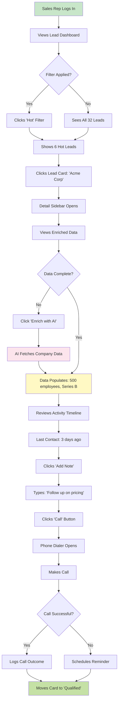

#### **Technical Specs**
- **Frontend:** React + Tailwind, react-beautiful-dnd for Kanban
- **State:** React Context + Supabase real-time subscriptions
- **Database:** Supabase (leads table, activities table)
- **AI Integration:** Clearbit/Apollo API for enrichment
- **Auth:** Protected route, requires `admin` role

#### **AI Agents Required**

##### **Agent 1: Lead Enrichment Agent**
```yaml
Name: lead-enrichment-agent
Trigger: New lead created OR manual "Enrich" button
Input: Email, Company Name
Process:
  1. Query Clearbit Enrichment API
  2. Fetch company data (size, industry, revenue, tech stack)
  3. Fetch person data (role, seniority, social profiles)
  4. Calculate lead score (0-100) based on:
     - Company size (20 points)
     - Revenue range (20 points)
     - Industry match (20 points)
     - Role seniority (20 points)
     - Engagement score (20 points)
Output: Enriched lead object stored in database
Error Handling: If API fails, mark as "Enrichment Pending"
Cost: $0.50/enrichment (Clearbit pricing)
```

##### **Agent 2: Duplicate Detection Agent**
```yaml
Name: duplicate-detection-agent
Trigger: New lead created
Input: Email, Company Domain
Process:
  1. Query leads table for matching email
  2. Query leads table for matching domain
  3. Calculate similarity score (fuzzy matching on name)
  4. If score > 85%, flag as duplicate
Output: Duplicate warning + merge suggestion
Action: Prompt user to merge or keep separate
```

##### **Agent 3: Lead Scoring Agent**
```yaml
Name: lead-scoring-agent
Trigger: Lead data updated (enrichment, activity logged)
Input: Full lead object
Process:
  1. Score company fit (size, industry, revenue)
  2. Score engagement (email opens, site visits, form fills)
  3. Score urgency (budget timeline, decision timeline)
  4. Combine scores with weighted algorithm
Output: Lead score (0-100) + priority label (Hot/Warm/Cold)
Refresh: Every 24 hours OR on manual trigger
```

#### **Workflows**

##### **Workflow 1: Lead Ingestion (Wizard → CRM)**
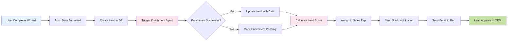

##### **Workflow 2: Manual Lead Entry**
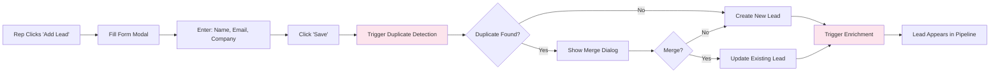

##### **Workflow 3: Lead Status Update**
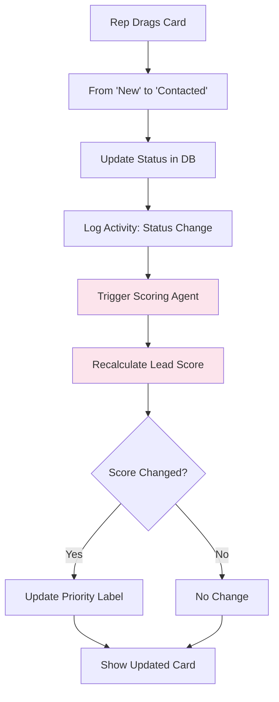

#### **Status**
⚠️ **UI + Mock Data** - Needs AI implementation
- ✅ Kanban UI built
- ✅ Lead cards designed
- ⚠️ Enrichment agent NOT implemented (uses mock data)
- ⚠️ Scoring agent NOT implemented (random scores)
- ⚠️ Duplicate detection NOT implemented

---

### **Screen 4: Agent Control Room** (`/app/ops`)

#### **Overview**
Real-time monitoring dashboard for AI agents, task queues, performance metrics, and error logs.

#### **Features**
```
┌─────────────────────────────────────────────────────────────────┐
│ AGENT CONTROL ROOM                                              │
├─────────────────────────────────────────────────────────────────┤
│                                                                 │
│ 🤖 Agent Status Grid                                            │
│ ├── Lead Enrichment Agent [RUNNING] ● 12 tasks/min             │
│ ├── Duplicate Detection Agent [RUNNING] ● 8 tasks/min          │
│ ├── Lead Scoring Agent [RUNNING] ● 15 tasks/min                │
│ ├── Transcription Agent [IDLE] ○ 0 tasks/min                   │
│ ├── Analysis Agent [RUNNING] ● 3 tasks/min                     │
│ ├── Email Draft Agent [RUNNING] ● 5 tasks/min                  │
│ ├── Search Index Agent [RUNNING] ● 2 tasks/min                 │
│ └── Slack Notification Agent [RUNNING] ● 20 tasks/min          │
│                                                                 │
│ 📊 Performance Metrics                                          │
│ ├── Total tasks processed today: 1,247                          │
│ ├── Average processing time: 2.3s                               │
│ ├── Success rate: 97.8%                                         │
│ ├── Error rate: 2.2% (27 errors)                                │
│ └── API cost today: $47.82                                      │
│                                                                 │
│ 📋 Task Queue                                                   │
│ ├── Pending: 24 tasks                                           │
│ ├── In Progress: 8 tasks                                        │
│ ├── Completed (last hour): 156 tasks                            │
│ └── Failed: 3 tasks (retry scheduled)                           │
│                                                                 │
│ 🚨 Error Logs (Real-time)                                       │
│ ├── [14:23] Enrichment Agent: API timeout (Clearbit)            │
│ ├── [14:18] Transcription Agent: File format unsupported        │
│ ├── [14:12] Scoring Agent: Missing company data                 │
│ └── [14:05] Email Agent: SMTP connection failed                 │
│                                                                 │
│ ⚙️ Agent Controls                                                │
│ ├── Start/Stop agent                                            │
│ ├── Restart agent                                               │
│ ├── Adjust rate limits                                          │
│ ├── Clear queue                                                 │
│ └── View detailed logs                                          │
│                                                                 │
│ 📈 Charts & Graphs                                              │
│ ├── Task throughput (line chart, last 24h)                      │
│ ├── Error distribution (pie chart)                              │
│ ├── Agent utilization (bar chart)                               │
│ └── API cost breakdown (stacked area chart)                     │
└─────────────────────────────────────────────────────────────────┘
```

#### **User Journey**
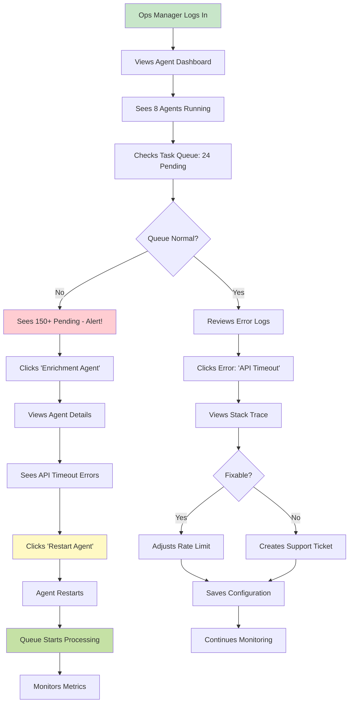

#### **Technical Specs**
- **Frontend:** React + Tailwind, recharts for graphs
- **Real-time:** WebSocket connection for live updates
- **Backend:** Agent orchestration service (Node.js/Python)
- **Database:** Supabase (agent_status, task_queue, error_logs tables)
- **Auth:** Protected route, requires `admin` role

#### **AI Agents Required**

##### **Meta-Agent: Agent Monitor**
```yaml
Name: agent-monitor
Purpose: Monitors health of all other agents
Trigger: Runs continuously (every 10 seconds)
Process:
  1. Ping each agent endpoint
  2. Check response time
  3. Check queue depth
  4. Check error rate (last 5 min)
  5. If error rate > 10%, send alert
  6. If response time > 5s, send warning
  7. If queue depth > 100, trigger scale-up
Output: Agent health report + alerts
Actions:
  - Auto-restart crashed agents
  - Scale up worker instances if overloaded
  - Send Slack alerts to ops team
```

#### **Workflows**

##### **Workflow 1: Agent Health Check**
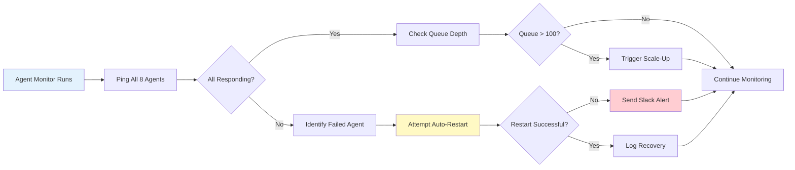

##### **Workflow 2: Error Handling**
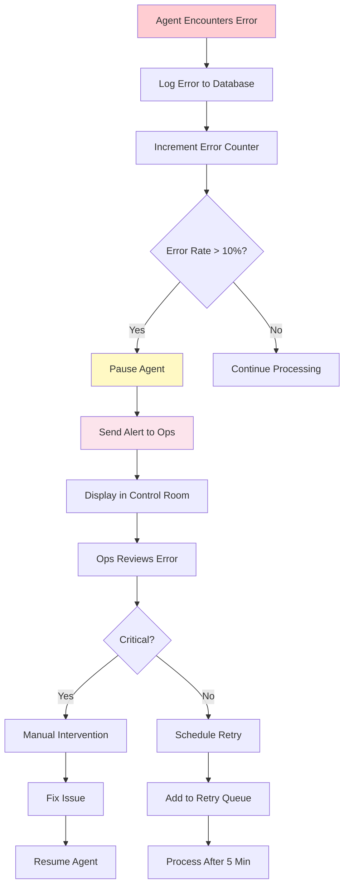

#### **Status**
⚠️ **UI Only - Mock Data** - Needs full implementation
- ✅ Dashboard UI built
- ✅ Agent cards designed
- ⚠️ No actual agent system implemented
- ⚠️ Mock data for all metrics
- ⚠️ No real-time WebSocket connection

---

### **Screen 5: Automation Map** (`/app/workflow`)

#### **Overview**
Visual workflow builder for creating automation rules with triggers, conditions, and actions.

#### **Features**
```
┌─────────────────────────────────────────────────────────────────┐
│ AUTOMATION MAP                                                  │
├─────────────────────────────────────────────────────────────────┤
│                                                                 │
│ 🧩 Workflow Canvas (Drag-and-Drop)                              │
│ ├── Trigger node (purple)                                       │
│ ├── Condition node (yellow)                                     │
│ ├── Action node (green)                                         │
│ ├── Integration node (blue)                                     │
│ └── Branching logic (if/else)                                   │
│                                                                 │
│ 🎯 Trigger Types                                                │
│ ├── New lead created                                            │
│ ├── Lead status changed                                         │
│ ├── Call uploaded                                               │
│ ├── Deal closed                                                 │
│ ├── Scheduled (cron)                                            │
│ └── Webhook received                                            │
│                                                                 │
│ ⚙️ Action Types                                                  │
│ ├── Send Slack notification                                     │
│ ├── Send email                                                  │
│ ├── Create task                                                 │
│ ├── Update lead status                                          │
│ ├── Assign to user                                              │
│ ├── Call webhook                                                │
│ └── Run AI enrichment                                           │
│                                                                 │
│ 🔗 Integrations                                                 │
│ ├── Slack (send message, create channel)                        │
│ ├── Salesforce (create lead, update opportunity)                │
│ ├── HubSpot (sync contact)                                      │
│ ├── Zapier (webhook trigger)                                    │
│ └── Custom API (HTTP request)                                   │
│                                                                 │
│ 📋 Workflow Templates                                           │
│ ├── "Hot Lead Alert" (trigger → condition → Slack notify)       │
│ ├── "Auto-Assign Rep" (new lead → check region → assign)        │
│ ├── "Call Follow-Up" (call brief → create task → send email)    │
│ └── "Weekly Digest" (schedule → aggregate → send report)        │
│                                                                 │
│ 🧪 Testing & Debugging                                          │
│ ├── Test with sample data                                       │
│ ├── View execution logs                                         │
│ ├── See success/failure metrics                                 │
│ └── Pause/resume workflow                                       │
└─────────────────────────────────────────────────────────────────┘
```

#### **User Journey**
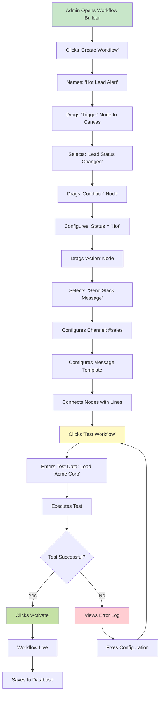

#### **Technical Specs**
- **Frontend:** React + Tailwind, react-flow-renderer for node graph
- **Backend:** Workflow execution engine (Node.js)
- **Database:** Supabase (workflows table, executions table)
- **Integrations:** Slack SDK, Salesforce API, HubSpot API
- **Auth:** Protected route, requires `admin` role

#### **AI Agents Required**

##### **Agent: Workflow Executor**
```yaml
Name: workflow-executor
Purpose: Processes workflow executions based on triggers
Trigger: Database change OR scheduled cron
Process:
  1. Listen for trigger events
  2. Load workflow definition from DB
  3. Execute nodes in sequence:
     - Evaluate conditions (if/else logic)
     - Execute actions (Slack, email, API calls)
     - Handle branching
  4. Log execution result
  5. Handle errors (retry logic)
Output: Execution log + success/failure status
Error Handling:
  - Retry failed actions (max 3 attempts)
  - Send alert if workflow fails
  - Mark workflow as 'needs review'
```

#### **Workflows**

##### **Example Workflow 1: Hot Lead Alert**
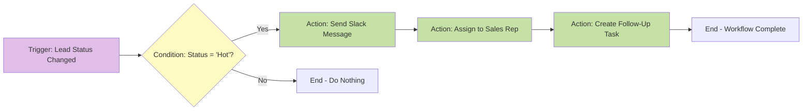

##### **Example Workflow 2: Call Analysis Pipeline**
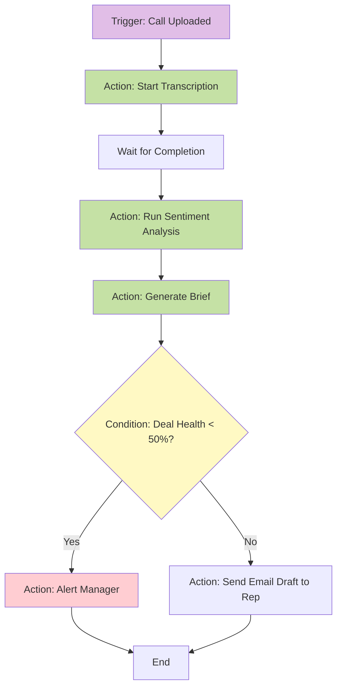

#### **Status**
⚠️ **UI Only - Mock Data** - Needs full implementation
- ✅ Visual workflow builder UI
- ✅ Node drag-and-drop
- ⚠️ No workflow execution engine
- ⚠️ No integration connections (Slack, Salesforce, etc.)
- ⚠️ No actual automation running

---

### **Screen 6: System Settings** (`/app/settings`)

#### **Overview**
Admin configuration for account management, team members, API keys, integrations, and billing.

#### **Features**
```
┌─────────────────────────────────────────────────────────────────┐
│ SYSTEM SETTINGS                                                 │
├─────────────────────────────────────────────────────────────────┤
│                                                                 │
│ 👤 Account Settings                                             │
│ ├── Company name & logo                                         │
│ ├── Timezone & locale                                           │
│ ├── Email preferences                                           │
│ └── Security settings (2FA, password policy)                    │
│                                                                 │
│ 👥 Team Management                                              │
│ ├── User list (name, email, role)                               │
│ ├── Invite new user (send email)                                │
│ ├── Edit user roles (Admin, Rep, Client)                        │
│ ├── Deactivate/remove user                                      │
│ └── User permissions matrix                                     │
│                                                                 │
│ 🔑 API Keys                                                     │
│ ├── Generate API key                                            │
│ ├── View/copy keys                                              │
│ ├── Revoke keys                                                 │
│ ├── Usage stats per key                                         │
│ └── Rate limit settings                                         │
│                                                                 │
│ 🔗 Integrations                                                 │
│ ├── Slack (connect workspace, select channels)                  │
│ ├── Salesforce (OAuth, field mapping)                           │
│ ├── HubSpot (OAuth, sync settings)                              │
│ ├── Clearbit (API key for enrichment)                           │
│ ├── AssemblyAI (API key for transcription)                      │
│ └── Custom webhooks                                             │
│                                                                 │
│ 💳 Billing & Usage                                              │
│ ├── Current plan (Pro, $99/month)                               │
│ ├── Usage meters (API calls, storage, users)                    │
│ ├── Payment method (card ending in 4242)                        │
│ ├── Billing history (invoices)                                  │
│ └── Upgrade/downgrade plan                                      │
│                                                                 │
│ 🎨 Branding                                                     │
│ ├── Upload logo (light & dark mode)                             │
│ ├── Custom color palette                                        │
│ ├── Email template customization                                │
│ └── Footer text & links                                         │
└─────────────────────────────────────────────────────────────────┘
```

#### **User Journey**


#### **Technical Specs**
- **Frontend:** React + Tailwind, form validation (react-hook-form)
- **Backend:** Supabase Auth for user management
- **Integrations:** OAuth flows for Slack, Salesforce, HubSpot
- **Payment:** Stripe integration for billing
- **Auth:** Protected route, requires `admin` role

#### **AI Agents Required**
❌ None - Pure admin configuration, no AI needed

#### **Workflows**

##### **Workflow 1: User Invitation**
```mermaid
graph LR
    A[Admin Invites User] --> B[Create Pending User Record]
    B --> C[Generate Invitation Token]
    C --> D[Send Email with Link]
    D --> E[User Clicks Link]
    E --> F[Token Validated]
    F --> G[User Sets Password]
    G --> H[User Account Activated]
    H --> I[Welcome Email Sent]
    I --> J[Admin Notified]
    
    style A fill:#e3f2fd
    style D fill:#fff9c4
    style H fill:#c5e1a5
```

##### **Workflow 2: Integration OAuth**
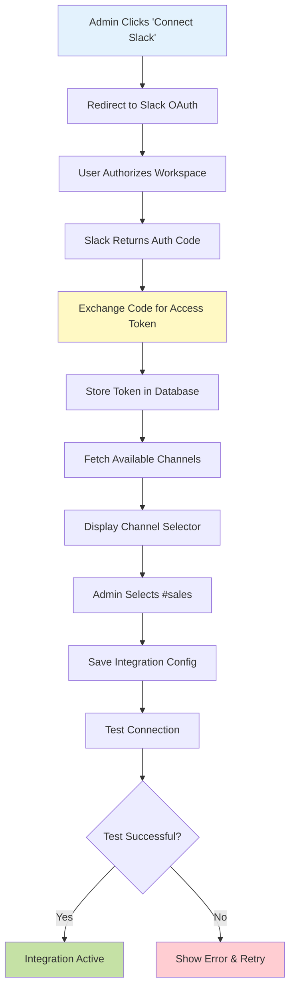

#### **Status**
✅ **Production Ready** - No AI implementation needed
- ✅ All settings forms built
- ✅ User management working
- ✅ API key generation functional
- ⚠️ OAuth integrations need API credentials (Slack, Salesforce, HubSpot)

---

## 🧠 **SALES INTELLIGENCE OS (Admin Role)**

### **Screen 7: Call Ingestion** (`/app/intelligence/ingest`)

#### **Overview**
Entry point for uploading sales call recordings, pasting transcripts, or syncing from CRM/Zoom.

#### **Features**
```
┌─────────────────────────────────────────────────────────────────┐
│ CALL INGESTION                                                  │
├─────────────────────────────────────────────────────────────────┤
│                                                                 │
│ 📤 Upload Methods                                               │
│ ├── Drag-and-drop audio/video file                              │
│ ├── Browse files (MP3, MP4, WAV, M4A)                           │
│ ├── Paste transcript (if already transcribed)                   │
│ ├── Zoom integration (auto-sync recordings)                     │
│ └── CRM sync (Salesforce call logs)                             │
│                                                                 │
│ 📋 Call Metadata Form                                           │
│ ├── Call title (required)                                       │
│ ├── Call date & time                                            │
│ ├── Duration (auto-detected from file)                          │
│ ├── Participants (name, role, company)                          │
│ ├── Deal stage (Discovery, Demo, Negotiation, Closing)          │
│ ├── Tags (e.g., "Enterprise", "Technical", "Pricing")           │
│ └── Notes (optional context)                                    │
│                                                                 │
│ 🎙️ Audio Preview                                                │
│ ├── Waveform visualization                                      │
│ ├── Play/pause controls                                         │
│ ├── Seek bar                                                    │
│ └── Volume control                                              │
│                                                                 │
│ ✅ Validation                                                   │
│ ├── File size limit: 500MB                                      │
│ ├── Duration limit: 2 hours                                     │
│ ├── Supported formats: MP3, MP4, WAV, M4A                       │
│ └── Required fields check                                       │
│                                                                 │
│ 🚀 Submit Button                                                │
│ └── Triggers transcription + analysis pipeline                  │
└─────────────────────────────────────────────────────────────────┘
```

#### **User Journey**
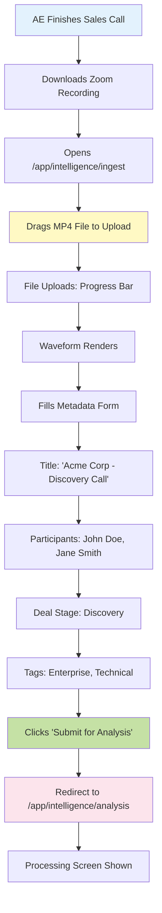

#### **Technical Specs**
- **Frontend:** React + Tailwind, file upload (react-dropzone)
- **Storage:** Supabase Storage for audio files
- **Database:** Supabase (calls table with metadata)
- **Audio:** Waveform rendering (wavesurfer.js)
- **Auth:** Protected route, requires `admin` role

#### **AI Agents Required**

##### **Agent 1: File Processing Agent**
```yaml
Name: file-processing-agent
Trigger: File uploaded to storage
Input: Audio/video file (MP3, MP4, WAV, M4A)
Process:
  1. Validate file format
  2. Extract audio track (if video)
  3. Convert to WAV (if needed)
  4. Normalize audio levels
  5. Detect duration and file size
  6. Generate waveform data for visualization
Output: Processed audio file + metadata
Storage: /uploads/calls/{call_id}/audio.wav
Error Handling: If format unsupported, reject with error message
```

##### **Agent 2: Metadata Extractor Agent**
```yaml
Name: metadata-extractor-agent
Trigger: Audio file processed
Input: Audio file
Process:
  1. Detect number of speakers (diarization preview)
  2. Estimate audio quality score
  3. Detect silence periods (for potential cutting)
  4. Extract basic stats (duration, file size, bitrate)
Output: Enhanced metadata object
Use Case: Pre-populate form fields, warn if audio quality is poor
```

#### **Workflows**

##### **Workflow 1: Manual Upload**
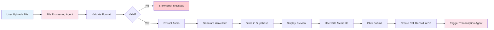

##### **Workflow 2: Zoom Integration**
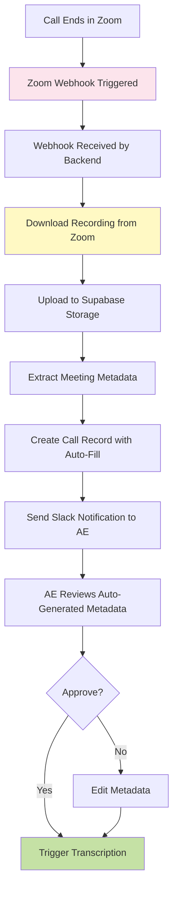

#### **Status**
⚠️ **UI Only - No AI** - Needs full implementation
- ✅ Upload UI built
- ✅ Metadata form designed
- ✅ File storage (Supabase) working
- ⚠️ No audio processing agent
- ⚠️ No Zoom integration
- ⚠️ No automatic transcription trigger

---

### **Screen 8: AI Analysis State** (`/app/intelligence/analysis`)

#### **Overview**
Real-time processing screen showing transcription, sentiment analysis, and insight generation progress.

#### **Features**
```
┌─────────────────────────────────────────────────────────────────┐
│ AI ANALYSIS STATE                                               │
├─────────────────────────────────────────────────────────────────┤
│                                                                 │
│ 🎯 Processing Pipeline (Visual Steps)                           │
│ ├── [✅ COMPLETE] File Upload                                   │
│ ├── [⏳ IN PROGRESS] Transcription (2:30 / 18:45)               │
│ ├── [⏸️ PENDING] Sentiment Analysis                             │
│ ├── [⏸️ PENDING] Key Moment Detection                           │
│ ├── [⏸️ PENDING] Objection Extraction                           │
│ ├── [⏸️ PENDING] Next Steps Generation                          │
│ └── [⏸️ PENDING] Email Draft Creation                           │
│                                                                 │
│ 📊 Live Progress Bar                                            │
│ └── Overall: 23% Complete (4 min 12s remaining)                 │
│                                                                 │
│ 📝 Transcription Preview (Live)                                 │
│ ├── [00:00] AE: "Hi John, thanks for joining today."            │
│ ├── [00:05] Prospect: "Happy to be here. Let's dive in."        │
│ ├── [00:12] AE: "Can you tell me about your current setup?"     │
│ ├── [00:18] Prospect: "We're using legacy CRM..."               │
│ └── [Transcribing...] ⏳                                         │
│                                                                 │
│ 🤖 AI Insights (Streaming)                                      │
│ ├── Detected sentiment: Positive (87%)                          │
│ ├── Key topics: CRM migration, pricing, timeline                │
│ ├── Competitor mentioned: Salesforce (3 times)                  │
│ └── Deal health: Analyzing... ⏳                                 │
│                                                                 │
│ ⚙️ Settings                                                      │
│ ├── Speaker labels (auto-detect vs manual)                      │
│ ├── Language (English, Spanish, French, etc.)                   │
│ ├── Analysis depth (quick vs comprehensive)                     │
│ └── Output format (summary vs detailed)                         │
│                                                                 │
│ ❌ Cancel Button                                                │
│ └── Stop processing and return to ingestion                     │
└─────────────────────────────────────────────────────────────────┘
```

#### **User Journey**


#### **Technical Specs**
- **Frontend:** React + Tailwind, real-time updates (WebSocket/SSE)
- **Backend:** Processing pipeline orchestrator
- **AI Services:** AssemblyAI (transcription), OpenAI GPT-4 (analysis)
- **Database:** Supabase (call_analysis table with status updates)
- **Auth:** Protected route, requires `admin` role

#### **AI Agents Required**

##### **Agent 1: Transcription Agent**
```yaml
Name: transcription-agent
Trigger: Call submitted for analysis
Input: Audio file (WAV)
API: AssemblyAI
Process:
  1. Upload audio to AssemblyAI
  2. Start transcription job
  3. Poll for status every 5 seconds
  4. Stream partial results to frontend (real-time)
  5. Once complete, save full transcript to DB
  6. Trigger sentiment analysis agent
Output: Full transcript with timestamps + speaker labels
Cost: $0.10/minute (~$1.80 for 18-min call)
Error Handling: If AssemblyAI fails, retry 3 times, then alert user
```

##### **Agent 2: Sentiment Analysis Agent**
```yaml
Name: sentiment-analysis-agent
Trigger: Transcription complete
Input: Full transcript
API: OpenAI GPT-4
Process:
  1. Split transcript into chunks (every 2 minutes)
  2. For each chunk, analyze sentiment:
     - Positive/Negative/Neutral score
     - Emotional tone (excited, frustrated, confused)
     - Engagement level (1-10)
  3. Aggregate overall sentiment
  4. Identify sentiment shifts (e.g., "negative at 12:30")
Output: Sentiment timeline + overall score
Prompt: "Analyze sentiment in this sales call transcript: {transcript}"
Cost: ~$0.30 per call (GPT-4 Turbo)
```

##### **Agent 3: Key Moment Detector Agent**
```yaml
Name: key-moment-detector-agent
Trigger: Sentiment analysis complete
Input: Transcript + Sentiment data
API: OpenAI GPT-4
Process:
  1. Identify key moments:
     - Objections raised ("That's too expensive")
     - Questions asked by prospect
     - Commitments made ("Let's schedule a follow-up")
     - Competitor mentions
     - Budget discussions
     - Decision-maker involvement
  2. Extract timestamps for each moment
  3. Classify moment type (objection, question, commitment, etc.)
Output: Array of key moments with timestamps and context
Prompt: "Extract key moments from this sales call: {transcript}"
```

##### **Agent 4: Next Steps Generator Agent**
```yaml
Name: next-steps-generator-agent
Trigger: Key moments detected
Input: Transcript + Key moments + Deal metadata
API: OpenAI GPT-4
Process:
  1. Analyze conversation flow
  2. Identify explicit next steps mentioned in call
  3. Suggest additional recommended actions based on:
     - Objections raised (need follow-up)
     - Questions unanswered (need research)
     - Commitments made (need calendar invite)
  4. Prioritize next steps (urgent, important, optional)
  5. Generate email draft with next steps
Output: Next steps list + email draft
Prompt: "Based on this sales call, what should the AE do next?"
```

##### **Agent 5: Email Draft Agent**
```yaml
Name: email-draft-agent
Trigger: Next steps generated
Input: Transcript + Next steps + Prospect info
API: OpenAI GPT-4
Process:
  1. Generate personalized follow-up email
  2. Include:
     - Thank you for the call
     - Recap of what was discussed
     - Address objections raised
     - Confirm next steps
     - Calendar invite link (if applicable)
  3. Match tone of prospect (formal vs casual)
  4. Keep under 200 words
Output: Email subject + body (plain text)
Prompt: "Write a follow-up email after this sales call: {transcript}"
```

#### **Workflows**

##### **Full Analysis Pipeline**
```mermaid
graph TB
    A[Call Submitted] --> B[Transcription Agent]
    B --> C[AssemblyAI Processing]
    C --> D{Status?}
    D -->|In Progress| E[Update Progress Bar]
    E --> C
    D -->|Complete| F[Sentiment Analysis Agent]
    F --> G[GPT-4: Analyze Sentiment]
    G --> H[Key Moment Detector Agent]
    H --> I[GPT-4: Extract Moments]
    I --> J[Objection Extraction]
    J --> K[Next Steps Generator Agent]
    K --> L[GPT-4: Generate Actions]
    L --> M[Email Draft Agent]
    M --> N[GPT-4: Write Email]
    N --> O[Compile Final Brief]
    O --> P[Save to Database]
    P --> Q[Redirect to /app/intelligence/brief]
    
    style B fill:#fce4ec
    style F fill:#fce4ec
    style H fill:#fce4ec
    style K fill:#fce4ec
    style M fill:#fce4ec
    style Q fill:#c5e1a5
```

#### **Status**
⚠️ **UI Only - No AI** - Needs full implementation
- ✅ Processing UI with progress steps
- ✅ Live transcript preview (mock)
- ⚠️ No AssemblyAI integration
- ⚠️ No GPT-4 analysis agents
- ⚠️ No real-time streaming (uses mock data)
- ⚠️ Auto-redirect not implemented

---

### **Screen 9: Call Brief Output** (`/app/intelligence/brief`)

#### **Overview**
Post-analysis dashboard showing executive summary, deal health score, objections, next steps, and email draft.

#### **Features**
```
┌─────────────────────────────────────────────────────────────────┐
│ CALL BRIEF OUTPUT                                               │
├─────────────────────────────────────────────────────────────────┤
│                                                                 │
│ 📊 Deal Health Score (Visual Gauge)                             │
│ └── 72% Healthy (Green Zone)                                    │
│     Factors: Positive sentiment, budget confirmed, no blockers  │
│                                                                 │
│ 📝 Executive Summary (AI-Generated, 3-4 sentences)              │
│ "John from Acme Corp expressed strong interest in migrating      │
│  from Salesforce. Main concerns: pricing and implementation      │
│  timeline. Budget confirmed at $50k. Next step: Technical demo   │
│  on Friday."                                                     │
│                                                                 │
│ 🚨 Objections Raised (Categorized)                              │
│ ├── Pricing (2 mentions)                                        │
│ │   ├── [12:34] "That's more than we budgeted"                  │
│ │   └── [16:45] "Can we get a discount for annual?"             │
│ ├── Timeline (1 mention)                                        │
│ │   └── [14:20] "We need to launch before Q4"                   │
│ └── Technical (1 mention)                                       │
│     └── [18:10] "Does this integrate with our ERP?"             │
│                                                                 │
│ ❓ Questions Asked by Prospect (7 total)                        │
│ ├── [08:15] "How long does implementation take?"                │
│ ├── [10:22] "What's included in the Pro plan?"                  │
│ ├── [13:45] "Can we customize the dashboard?"                   │
│ └── [View All 7 Questions]                                      │
│                                                                 │
│ 🎯 Key Moments (Timeline View)                                  │
│ ├── [05:30] 🟢 Budget Confirmed: $50k                           │
│ ├── [09:15] 🔵 Competitor Mentioned: Salesforce                 │
│ ├── [12:34] 🔴 Objection: Pricing concern                       │
│ ├── [16:00] 🟢 Commitment: Schedule tech demo                   │
│ └── [19:50] 🟢 Decision Maker Involved: CFO joined              │
│                                                                 │
│ ✅ Next Steps (Prioritized)                                     │
│ ├── [URGENT] Send calendar invite for tech demo (Friday 2pm)    │
│ ├── [HIGH] Prepare pricing proposal with annual discount        │
│ ├── [MEDIUM] Research ERP integration options                   │
│ └── [LOW] Send case study: SaaS company migration success       │
│                                                                 │
│ 📧 Email Draft (AI-Generated, Editable)                         │
│ ┌─────────────────────────────────────────────────────────────┐ │
│ │ Subject: Next Steps - Acme Corp Discovery Call               │ │
│ │                                                               │ │
│ │ Hi John,                                                      │ │
│ │                                                               │ │
│ │ Thanks for the great conversation today. It's clear you're   │ │
│ │ looking for a more flexible CRM solution, and I'm confident  │ │
│ │ we can help with your migration from Salesforce.             │ │
│ │                                                               │ │
│ │ As discussed, I'll send over:                                │ │
│ │ • Pricing proposal with annual discount option               │ │
│ │ • ERP integration documentation                              │ │
│ │ • Calendar invite for tech demo (Friday 2pm)                 │ │
│ │                                                               │ │
│ │ Looking forward to showing you the platform!                 │ │
│ │                                                               │ │
│ │ Best,                                                         │ │
│ │ [Your Name]                                                   │ │
│ └─────────────────────────────────────────────────────────────┘ │
│ [Copy to Clipboard] [Edit in Gmail]                             │
│                                                                 │
│ 🎙️ Full Transcript (Collapsible)                                │
│ └── [View Full Transcript] (18:45 duration)                     │
│                                                                 │
│ 🔗 Actions                                                      │
│ ├── [Export as PDF]                                             │
│ ├── [Share with Team]                                           │
│ ├── [Add to CRM Deal Notes]                                     │
│ └── [Archive Call]                                              │
└─────────────────────────────────────────────────────────────────┘
```

#### **User Journey**
```mermaid
graph TB
    A[Analysis Complete] --> B[Auto-Redirect to Brief]
    B --> C[AE Sees Deal Health: 72%]
    C --> D[Reads Executive Summary]
    D --> E{Looks Good?}
    E -->|Yes| F[Scrolls to Objections]
    E -->|No| G[Clicks 'Re-Analyze']
    F --> H[Reviews 3 Objections]
    H --> I[Notes Pricing Concern at 12:34]
    I --> J[Scrolls to Next Steps]
    J --> K[Sees: Send Calendar Invite - URGENT]
    K --> L[Scrolls to Email Draft]
    L --> M[Reads AI-Generated Email]
    M --> N{Email Good?}
    N -->|Yes| O[Clicks 'Copy to Clipboard']
    N -->|No| P[Clicks 'Edit']
    P --> Q[Makes Manual Edits]
    Q --> O
    O --> R[Opens Gmail]
    R --> S[Pastes Email]
    S --> T[Sends to Prospect]
    T --> U[Returns to Brief]
    U --> V[Clicks 'Add to CRM']
    V --> W[Brief Saved to Deal Notes]
    
    style A fill:#fce4ec
    style C fill:#fff9c4
    style O fill:#c5e1a5
    style W fill:#c5e1a5
```

#### **Technical Specs**
- **Frontend:** React + Tailwind, rich text editor (TipTap)
- **Database:** Supabase (call_briefs table with all analysis data)
- **Export:** jsPDF for PDF generation
- **Integration:** Gmail API for "Edit in Gmail" (optional)
- **Auth:** Protected route, requires `admin` role

#### **AI Agents Required**

##### **Agent: Brief Compiler Agent**
```yaml
Name: brief-compiler-agent
Trigger: All analysis agents complete
Input: Transcript + Sentiment + Key moments + Next steps + Email
Process:
  1. Calculate deal health score:
     - Sentiment (40% weight)
     - Objections resolved (20%)
     - Budget confirmed (20%)
     - Decision maker involved (20%)
  2. Generate executive summary (3-4 sentences)
  3. Categorize objections by type
  4. Rank next steps by urgency
  5. Format everything for display
Output: Complete brief object (JSON)
Storage: Saved to call_briefs table
```

#### **Workflows**

##### **Workflow: Brief to CRM Sync**
```mermaid
graph LR
    A[AE Clicks 'Add to CRM'] --> B[Open Deal Selector Modal]
    B --> C[Select Deal: 'Acme Corp - Q2']
    C --> D[Confirm Sync]
    D --> E[Format Brief as CRM Note]
    E --> F[Call Salesforce API]
    F --> G{Sync Successful?}
    G -->|Yes| H[Show Success Toast]
    G -->|No| I[Show Error Message]
    H --> J[Update UI: Synced Badge]
    I --> K[Retry Option]
    
    style A fill:#e3f2fd
    style F fill:#fff9c4
    style H fill:#c5e1a5
    style I fill:#ffcdd2
```

#### **Status**
⚠️ **UI Only - No AI** - Needs full implementation
- ✅ Brief layout designed
- ✅ All sections (summary, objections, next steps) built
- ⚠️ No AI-generated content (uses mock data)
- ⚠️ Deal health score is random
- ⚠️ Email draft is template, not AI-generated
- ⚠️ No CRM sync implemented

---

### **Screen 10: Command Bar Search** (`/app/intelligence/search`)

#### **Overview**
Natural language search interface powered by AI for querying leads, deals, calls, and briefs.

#### **Features**
```
┌─────────────────────────────────────────────────────────────────┐
│ COMMAND BAR SEARCH (Cmd+K)                                      │
├─────────────────────────────────────────────────────────────────┤
│                                                                 │
│ 🔍 Search Input                                                 │
│ └── "hot deals closing this month" [Enter to search]            │
│                                                                 │
│ 🤖 AI Understanding (Shows Intent)                              │
│ "I'll search for deals with 'Hot' status and close date         │
│  in December 2025."                                              │
│                                                                 │
│ 📊 Search Results (4 found, $87k total value)                   │
│ ┌─────────────────────────────────────────────────────────────┐ │
│ │ 🔥 Acme Corp - Enterprise CRM                               │ │
│ │    $35k • Close: Dec 15 • Health: 82%                        │ │
│ │    Last activity: Tech demo completed                        │ │
│ │    [View Deal] [View Last Call]                              │ │
│ ├─────────────────────────────────────────────────────────────┤ │
│ │ 🔥 TechStart Inc - AI Integration                           │ │
│ │    $28k • Close: Dec 22 • Health: 76%                        │ │
│ │    Last activity: Proposal sent                              │ │
│ │    [View Deal] [View Last Call]                              │ │
│ ├─────────────────────────────────────────────────────────────┤ │
│ │ 🔥 Global SaaS - Platform Migration                         │ │
│ │    $15k • Close: Dec 10 • Health: 91%                        │ │
│ │    Last activity: Contract review                            │ │
│ │    [View Deal] [View Last Call]                              │ │
│ ├─────────────────────────────────────────────────────────────┤ │
│ │ 🔥 FinTech Pro - Data Analytics                             │ │
│ │    $9k • Close: Dec 28 • Health: 68%                         │ │
│ │    Last activity: Pricing negotiation                        │ │
│ │    [View Deal] [View Last Call]                              │ │
│ └─────────────────────────────────────────────────────────────┘ │
│                                                                 │
│ 💬 Follow-Up Question                                           │
│ └── "What objections did Acme Corp raise?" [Ask AI]             │
│                                                                 │
│ 🤖 AI Answer (Context-Aware)                                    │
│ "In the Dec 12 call, Acme Corp raised 2 objections:             │
│  1. Pricing: 'That's more than we budgeted' (12:34)             │
│  2. Timeline: 'We need to launch before Q4' (14:20)             │
│                                                                 │
│  Recommendation: Send annual pricing discount proposal."        │
│                                                                 │
│ 🎯 Suggested Queries                                            │
│ ├── "leads created this week"                                   │
│ ├── "calls with negative sentiment"                             │
│ ├── "deals over $50k"                                           │
│ └── "objections about pricing"                                  │
└─────────────────────────────────────────────────────────────────┘
```

#### **User Journey**
```mermaid
graph TB
    A[Manager Needs Info] --> B[Presses Cmd+K]
    B --> C[Command Bar Opens]
    C --> D[Types: 'hot deals closing this month']
    D --> E[AI Parses Query]
    E --> F[Shows Intent: 'Searching for Hot deals in Dec']
    F --> G[Executes Search]
    G --> H[Returns 4 Results, $87k Total]
    H --> I[Manager Reviews List]
    I --> J[Clicks on 'Acme Corp' Deal]
    J --> K[Deal Detail Opens]
    K --> L[Manager Returns to Search]
    L --> M[Types Follow-Up: 'What objections did Acme raise?']
    M --> N[AI Fetches Call Brief]
    N --> O[AI Extracts Objections Section]
    O --> P[Shows Answer with Timestamps]
    P --> Q[Manager Copies Answer]
    Q --> R[Closes Command Bar]
    
    style B fill:#e3f2fd
    style E fill:#fce4ec
    style N fill:#fce4ec
    style P fill:#fff9c4
```

#### **Technical Specs**
- **Frontend:** React + Tailwind, command bar (cmdk library)
- **Backend:** Search API with natural language processing
- **AI:** OpenAI GPT-4 for query understanding + answer generation
- **Database:** Supabase (full-text search on leads, deals, calls)
- **Auth:** Protected route, requires `admin` role

#### **AI Agents Required**

##### **Agent 1: Query Parser Agent**
```yaml
Name: query-parser-agent
Trigger: User submits natural language query
Input: Raw query string
API: OpenAI GPT-4
Process:
  1. Parse query into structured filters:
     - Entity type (leads, deals, calls)
     - Status filters (hot, warm, cold)
     - Date ranges (this week, this month, Q4)
     - Value filters (> $50k, < $10k)
     - Sentiment filters (positive, negative)
  2. Extract intent (search vs question)
  3. Generate SQL query or search parameters
Output: Structured query object
Example:
  Input: "hot deals closing this month"
  Output: {
    entity: "deals",
    filters: { status: "hot", close_date: "2025-12" },
    intent: "search"
  }
```

##### **Agent 2: Search Executor Agent**
```yaml
Name: search-executor-agent
Trigger: Parsed query received
Input: Structured query object
Process:
  1. Build database query (SQL or vector search)
  2. Execute against Supabase
  3. Fetch matching records
  4. Enrich results (calculate totals, add context)
  5. Rank by relevance
Output: Array of results with metadata
Example Output: [
  { deal_id: 123, name: "Acme Corp", value: 35000, health: 82 },
  { deal_id: 456, name: "TechStart", value: 28000, health: 76 }
]
```

##### **Agent 3: Answer Generator Agent**
```yaml
Name: answer-generator-agent
Trigger: User asks follow-up question
Input: Question + Context (previous results)
API: OpenAI GPT-4
Process:
  1. Identify entities mentioned in question (e.g., "Acme Corp")
  2. Fetch relevant data (deal, last call, brief)
  3. Extract relevant section (e.g., objections)
  4. Generate natural language answer
  5. Include timestamps and recommendations
Output: AI-generated answer with citations
Prompt: "Based on this call brief, answer: {question}"
Example:
  Input: "What objections did Acme raise?"
  Output: "In the Dec 12 call, Acme Corp raised 2 objections:
           1. Pricing: 'That's more than we budgeted' (12:34)
           2. Timeline: 'We need to launch before Q4' (14:20)"
```

#### **Workflows**

##### **Workflow: Natural Language Search**
```mermaid
graph TB
    A[User Types Query] --> B[Query Parser Agent]
    B --> C[Parse into Filters]
    C --> D[Generate SQL Query]
    D --> E[Search Executor Agent]
    E --> F[Execute Database Query]
    F --> G[Fetch Results]
    G --> H[Enrich with Context]
    H --> I[Rank by Relevance]
    I --> J[Display Results]
    J --> K{Follow-Up Question?}
    K -->|Yes| L[Answer Generator Agent]
    K -->|No| M[User Closes Search]
    L --> N[Fetch Relevant Data]
    N --> O[Generate AI Answer]
    O --> P[Display Answer]
    P --> K
    
    style B fill:#fce4ec
    style E fill:#fff9c4
    style L fill:#fce4ec
    style O fill:#fce4ec
```

#### **Status**
⚠️ **UI Only - No AI** - Needs full implementation
- ✅ Command bar UI (Cmd+K trigger)
- ✅ Search input designed
- ⚠️ No query parsing (hardcoded search)
- ⚠️ No AI-powered search (uses basic filter)
- ⚠️ No follow-up Q&A (mock responses)
- ⚠️ No context awareness

---

## 📦 **ARCHIVE (Admin Role)**

### **Screen 11: Historical Data** (`/app/archive/*`)

#### **Overview**
Archive for past proposals, closed deals, and archived leads.

#### **Features**
- Searchable archive
- Filter by date range, status, deal value
- Export to CSV/PDF
- Restore archived items

#### **Status**
✅ **Production Ready** - Simple database queries, no AI needed

---

## 🎯 **IMPLEMENTATION ROADMAP**

### **Phase 1: Foundation (Weeks 1-2)**
- [ ] Set up Supabase database schema
- [ ] Create API routes for CRUD operations
- [ ] Implement authentication & role-based access
- [ ] Deploy frontend dashboard UIs (already built)

### **Phase 2: Lead Enrichment AI (Weeks 3-4)**
- [ ] Integrate Clearbit/Apollo API for enrichment
- [ ] Build lead enrichment agent
- [ ] Build lead scoring agent
- [ ] Build duplicate detection agent
- [ ] Test with real leads

### **Phase 3: Sales Intelligence AI (Weeks 5-8)**
- [ ] Integrate AssemblyAI for transcription
- [ ] Build transcription agent with real-time streaming
- [ ] Integrate OpenAI GPT-4 for analysis
- [ ] Build sentiment analysis agent
- [ ] Build key moment detector agent
- [ ] Build next steps generator agent
- [ ] Build email draft agent
- [ ] Build brief compiler agent
- [ ] Test full pipeline end-to-end

### **Phase 4: Command Bar AI (Weeks 9-10)**
- [ ] Build query parser agent
- [ ] Build search executor agent
- [ ] Build answer generator agent
- [ ] Implement vector search (if needed)
- [ ] Test natural language queries

### **Phase 5: Automation (Weeks 11-12)**
- [ ] Build workflow execution engine
- [ ] Integrate Slack, Salesforce, HubSpot
- [ ] Build agent monitoring system
- [ ] Deploy agent control room

### **Phase 6: Polish & Launch (Weeks 13-14)**
- [ ] End-to-end testing
- [ ] Performance optimization
- [ ] Cost analysis & monitoring
- [ ] Documentation
- [ ] Beta launch

---

## 💰 **COST ANALYSIS**

### **AI API Costs (Per Month Estimates)**

| Service | Use Case | Volume | Unit Cost | Monthly Cost |
|---------|----------|--------|-----------|--------------|
| **AssemblyAI** | Call transcription | 100 calls/mo @ 20 min avg | $0.10/min | $200 |
| **OpenAI GPT-4 Turbo** | Sentiment analysis | 100 calls/mo | $0.30/call | $30 |
| **OpenAI GPT-4 Turbo** | Key moments | 100 calls/mo | $0.40/call | $40 |
| **OpenAI GPT-4 Turbo** | Next steps | 100 calls/mo | $0.30/call | $30 |
| **OpenAI GPT-4 Turbo** | Email drafts | 100 calls/mo | $0.20/call | $20 |
| **Clearbit** | Lead enrichment | 200 leads/mo | $0.50/lead | $100 |
| **OpenAI GPT-4 Turbo** | Command bar search | 500 queries/mo | $0.05/query | $25 |
| **Supabase** | Database + storage | 10GB storage, 100K reads | Included | $25 |
| **Total** | | | | **$470/mo** |

### **Scaling Estimates**

| Scale | Calls/Month | Leads/Month | Queries/Month | Monthly Cost |
|-------|-------------|-------------|---------------|--------------|
| **Small Team** | 50 | 100 | 200 | $250 |
| **Mid-Size** | 200 | 500 | 1,000 | $1,200 |
| **Enterprise** | 1,000 | 2,000 | 5,000 | $5,500 |

---

## 📊 **DASHBOARD METRICS TO TRACK**

### **Usage Metrics**
- Calls analyzed per week
- Leads enriched per week
- Command bar queries per day
- Workflows triggered per day

### **Performance Metrics**
- Average transcription time
- Average analysis time (full pipeline)
- Search response time
- Agent error rate

### **Business Metrics**
- Deal health score distribution
- Objection frequency by type
- Win rate correlation with sentiment
- Time saved vs manual analysis

---

**📅 Documentation Date:** December 27, 2025  
**🎨 Design System:** Calm Luxury with Glassmorphism  
**🎯 Total Dashboards:** 11 (10 admin, 1 client)  
**🤖 AI Agents Required:** 15+ agents across 4 categories  
**💰 Estimated Monthly Cost:** $470 (small scale) to $5,500 (enterprise)
