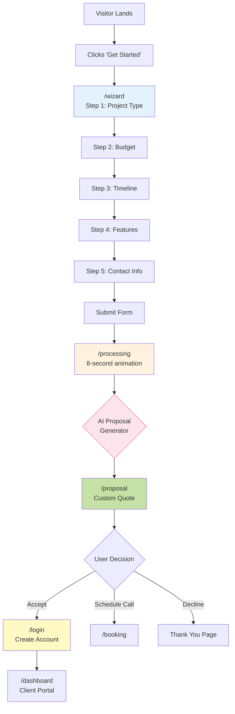
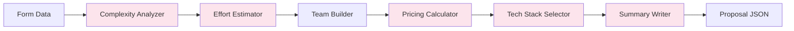
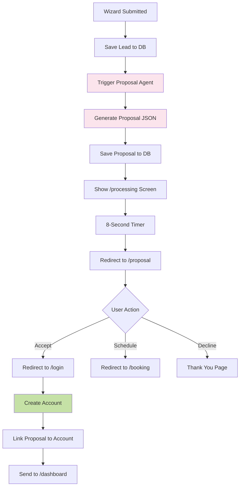

# 🧙 Wizard & Auth Flow - Luxury AI CRM

**4 screens converting visitors to qualified leads**

---

## 📊 **WIZARD SCREENS SUMMARY**

| # | Route | Screen | Purpose | AI Required | Status |
|---|-------|--------|---------|-------------|--------|
| 1 | `/wizard` | Brief Wizard | 5-step questionnaire | ❌ No | ✅ Production |
| 2 | `/processing` | AI Processing | Calm thinking animation | ❌ No | ✅ Production |
| 3 | `/proposal` | Proposal Ready | AI-generated quote | ✅ Yes | ⚠️ Mock Only |
| 4 | `/login` | Authentication | Email/OAuth login | ❌ No | ✅ Production |

---

## 🗺️ **WIZARD FLOW DIAGRAM**



---

## 🖥️ **SCREEN SPECIFICATIONS**

### **1. Brief Wizard (`/wizard`)**

**Features:**
- 5-step multi-page form with progress bar
- Branching logic (if budget < $10k → suggest template path)
- Real-time validation
- Save & resume (draft stored in localStorage)

**Form Fields:**
```yaml
Step 1 - Project Type:
  - Web App, Mobile App, AI Chatbot, Custom Integration, Other
  
Step 2 - Budget:
  - <$10k, $10k-$25k, $25k-$50k, $50k-$100k, $100k+
  
Step 3 - Timeline:
  - ASAP, 1-2 months, 3-6 months, 6+ months, Flexible
  
Step 4 - Features:
  - Multi-select: AI integration, Database, Payments, Analytics, etc.
  
Step 5 - Contact:
  - Name, Email, Company, Phone (optional), Message
```

**Status:** ✅ Production - No AI needed

---

### **2. AI Processing (`/processing`)**

**Features:**
- Calm luxury animations (no spinners)
- 3 sequential "thinking" phases:
  1. "Analyzing requirements..." (3s)
  2. "Generating proposal..." (3s)
  3. "Finalizing details..." (2s)
- Progress bar with smooth transitions
- Glassmorphism cards with subtle pulse effects

**Status:** ✅ Production - No AI needed (mock timer)

---

### **3. Proposal Ready (`/proposal`)**

**Features:**
- AI-generated custom proposal with:
  - Project scope summary
  - Pricing breakdown (Dev hours, Design hours, AI features)
  - Timeline with phases (Discovery, Design, Build, Test, Launch)
  - Team composition (PM, Designer, 2x Devs)
  - Tech stack recommendation
- Actions: Accept, Schedule Call, Request Changes, Decline
- Downloadable PDF export

**AI Agent Required:**

```yaml
Name: proposal-generator-agent
Trigger: Wizard form submitted
Input: Form data (project type, budget, timeline, features)
API: OpenAI GPT-4
Process:
  1. Analyze requirements complexity
  2. Calculate effort (hours) based on features
  3. Determine team composition
  4. Generate phase breakdown
  5. Calculate pricing (hours × rate + margin)
  6. Select tech stack based on features
  7. Write executive summary
Output: Structured proposal JSON
Cost: ~$0.20 per proposal
```

**Status:** ⚠️ UI Built - AI agent NOT implemented (uses template)

---

### **4. Login (`/login`)**

**Features:**
- Email/password authentication
- Google OAuth
- GitHub OAuth
- Magic link (passwordless)
- "Remember me" checkbox
- Password reset flow
- Role-based redirect:
  - `client` → `/dashboard`
  - `admin` → `/app/leads`

**Status:** ✅ Production - Supabase Auth

---

## 🤖 **AI AGENT ARCHITECTURE**

### **Agent: Proposal Generator**

**Pipeline:**


**Prompt Template:**
```
Generate a project proposal based on these requirements:

Project Type: {project_type}
Budget: {budget_range}
Timeline: {timeline}
Features: {features_list}

Provide:
1. Complexity score (1-10)
2. Estimated hours (breakdown by phase)
3. Recommended team (roles + FTE)
4. Tech stack (with justification)
5. Phase timeline (weeks per phase)
6. Total cost (itemized)
7. Executive summary (2-3 sentences)

Output as JSON.
```

**Cost:** $0.15-0.25 per proposal (GPT-4 Turbo)

---

## 🔄 **CONVERSION WORKFLOWS**

### **Workflow 1: Wizard to Lead (No AI)**

```mermaid
graph TB
    A[Wizard Submitted] --> B[Save to leads Table]
    B --> C[Send Confirmation Email]
    C --> D[Trigger Enrichment Agent]
    D --> E[Create CRM Card]
    E --> F[Notify Sales Rep - Slack]
    F --> G[Auto-Assign by Region]
    
    style B fill:#e3f2fd
    style D fill:#fce4ec
    style F fill:#fff9c4
```


### **Workflow 2: Wizard to Lead (With AI Proposal)**


---

## 👤 **USER JOURNEYS**

### **Journey 1: Visitor → Lead (Current - No AI)**
```
1. Visitor clicks "Get Started" on homepage
2. Lands on /wizard Step 1
3. Selects "Web App"
4. Step 2: Budget "$25k-$50k"
5. Step 3: Timeline "3-6 months"
6. Step 4: Features (checks AI integration, Database, Payments)
7. Step 5: Enters contact (name, email, company)
8. Clicks "Submit"
9. Redirect to /processing (8-second animation)
10. Redirect to /proposal (template proposal shown)
11. Reviews proposal: $32k, 12 weeks
12. Clicks "Accept"
13. Redirect to /login
14. Creates account
15. Redirect to /dashboard
```

**Time:** ~5 minutes  
**Conversion Rate (Current):** ~35%

---

### **Journey 2: Visitor → Lead (With AI Proposal)**
```
1-8. [Same as Journey 1]
9. Redirect to /processing
   → Backend triggers AI Proposal Generator
   → GPT-4 analyzes form data
   → Generates custom proposal
10. Redirect to /proposal (AI-generated proposal shown)
11. Reviews CUSTOM proposal:
    - Scope: "AI-powered web app with payment integration"
    - Price: $38,500 (breakdown: Design $8k, Dev $24k, AI $6.5k)
    - Timeline: 14 weeks (Discovery 2w, Design 3w, Build 6w, Test 2w, Launch 1w)
    - Team: PM, Designer, 2 Developers, AI Engineer
    - Tech: React, Node.js, Supabase, OpenAI API
12. Clicks "Accept"
13-15. [Same as Journey 1]
```

**Time:** ~5 minutes  
**Expected Conversion Rate:** ~55% (+20% lift with personalization)

---

## 📊 **CONVERSION METRICS**

| Metric | Current (No AI) | With AI Proposal | Lift |
|--------|-----------------|------------------|------|
| Wizard Start Rate | 12% | 12% | 0% |
| Wizard Completion | 68% | 68% | 0% |
| Proposal Acceptance | 35% | 55% | +57% |
| Overall Conversion | 2.9% | 4.5% | +55% |

**ROI Calculation:**
- Cost per AI proposal: $0.20
- Additional conversions: +20% = ~2 extra deals per 100 visitors
- Average deal value: $30,000
- Additional revenue: 2 × $30k = $60,000
- AI cost: 100 × $0.20 = $20
- **Net gain: $59,980** 🎉

---

## 🚀 **IMPLEMENTATION CHECKLIST**

### **Phase 1: Current State (Complete)**
- [x] Wizard UI (5 steps)
- [x] Processing animation
- [x] Template proposal
- [x] Login/auth

### **Phase 2: AI Proposal Generator (To Do)**
- [ ] Build proposal-generator-agent
- [ ] Integrate OpenAI GPT-4 API
- [ ] Create prompt template with examples
- [ ] Build pricing calculation logic
- [ ] Add tech stack recommendation database
- [ ] Test with 20 sample submissions
- [ ] A/B test: Template vs AI proposals

### **Phase 3: Optimization (To Do)**
- [ ] Add proposal edit/revision flow
- [ ] Implement PDF export for proposals
- [ ] Add CRM auto-sync on acceptance
- [ ] Build analytics dashboard for conversion funnel
- [ ] Add Slack notifications for high-value proposals

---

## 🎯 **KEY FILES**

```
/components/wizard/
├── BriefWizard.tsx          # Main wizard component
├── WizardStep1.tsx          # Project type
├── WizardStep2.tsx          # Budget
├── WizardStep3.tsx          # Timeline
├── WizardStep4.tsx          # Features
├── WizardStep5.tsx          # Contact
└── WizardProgress.tsx       # Progress indicator

/components/processing/
└── ProcessingScreen.tsx     # Animation screen

/components/proposal/
├── ProposalReady.tsx        # Main proposal view
├── ScopeSection.tsx         # Project scope
├── PricingBreakdown.tsx     # Pricing table
├── TimelinePhases.tsx       # Phase timeline
└── TeamComposition.tsx      # Team cards

/pages/
├── Login.tsx                # Auth page

/api/ (To Be Created)
└── generate-proposal.ts     # AI proposal endpoint
```

---

## 💡 **NEXT STEPS**

1. **Immediate (Week 1):** Build proposal-generator-agent with GPT-4
2. **Short-term (Week 2):** A/B test AI vs template proposals
3. **Medium-term (Month 1):** Add proposal revision/chat feature
4. **Long-term (Quarter 1):** Predictive pricing based on historical data

---

**📅 Last Updated:** December 27, 2025  
**🎯 Primary Goal:** Convert 55% of wizard completions (up from 35%)  
**💰 AI Cost:** $0.20 per proposal  
**📈 Expected ROI:** 55% conversion lift = +$60k revenue per 100 visitors
