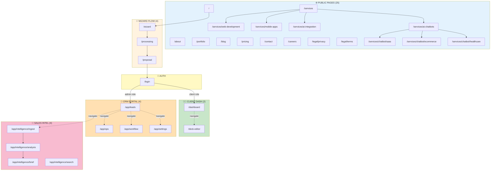
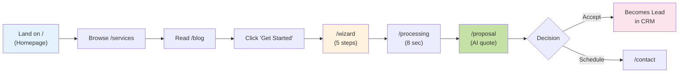
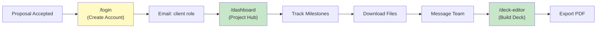
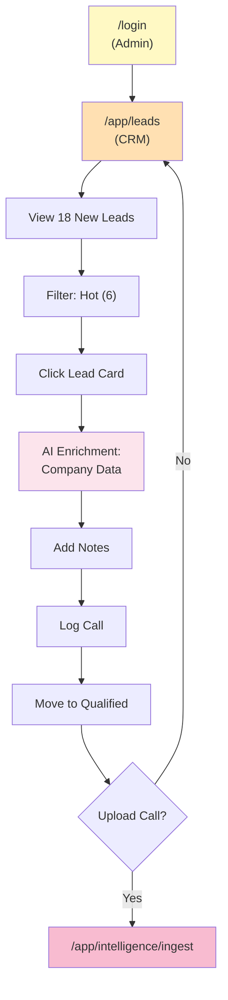
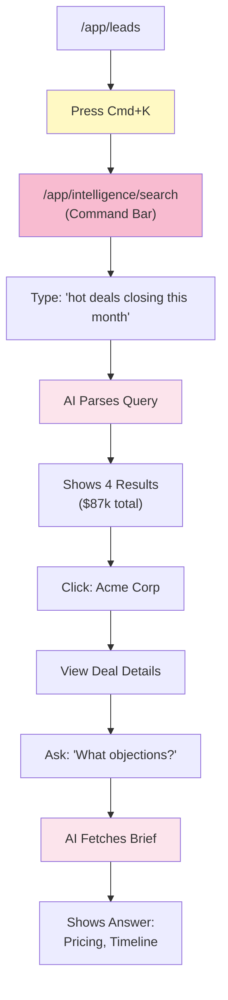
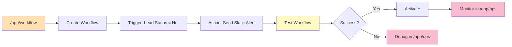
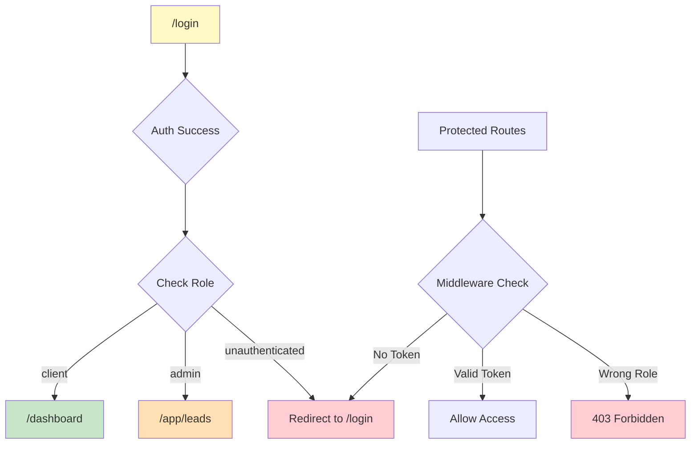

# 🗺️ Complete Sitemap - Luxury AI CRM

**40 routes organized by user role and purpose**

---

## 📊 **SITE STRUCTURE OVERVIEW**

```
Total Routes: 40
├── Marketing (Public): 25 pages
├── Client Dashboard (Protected): 2 pages
├── CRM/Admin Portal (Protected): 4 pages
├── Sales Intelligence (Protected): 4 pages
├── Wizards & Auth (Public): 4 pages
└── Archive (Protected): 1 page
```

---

## 🌲 **ROUTE TREE**

```
/
├── 🌐 MARKETING PAGES (Public - 25 routes)
│   ├── / (Homepage V6)
│   ├── /about
│   ├── /services
│   │   ├── /services/web-development
│   │   ├── /services/mobile-apps
│   │   ├── /services/ai-integration
│   │   ├── /services/ai-chatbots
│   │   ├── /services/chatbot/saas
│   │   ├── /services/chatbot/ecommerce
│   │   ├── /services/chatbot/healthcare
│   │   ├── /services/chatbot/finance
│   │   ├── /services/chatbot/realestate
│   │   ├── /services/chatbot/education
│   │   └── /services/chatbot/hospitality
│   ├── /portfolio
│   ├── /blog
│   │   ├── /blog/[slug]
│   │   └── /blog/category/[category]
│   ├── /pricing
│   ├── /contact
│   ├── /careers
│   ├── /press
│   ├── /legal/privacy
│   └── /legal/terms
│
├── 🧑‍💼 CLIENT DASHBOARD (Protected: client role - 2 routes)
│   ├── /dashboard (Project Dashboard)
│   └── /deck-editor (Presentation Builder)
│
├── 🏢 CRM/ADMIN PORTAL (Protected: admin role - 4 routes)
│   ├── /app/leads (Lead Management)
│   ├── /app/ops (Agent Control Room)
│   ├── /app/workflow (Automation Map)
│   └── /app/settings (System Settings)
│
├── 🧠 SALES INTELLIGENCE OS (Protected: admin role - 4 routes)
│   ├── /app/intelligence/ingest (Call Ingestion)
│   ├── /app/intelligence/analysis (AI Analysis State)
│   ├── /app/intelligence/brief (Call Brief Output)
│   └── /app/intelligence/search (Command Bar Search)
│
├── 🧙 WIZARDS & AUTH (Public entry - 4 routes)
│   ├── /wizard (Brief Wizard - 5 steps)
│   ├── /processing (AI Processing Screen)
│   ├── /proposal (Proposal Ready)
│   └── /login (Authentication)
│
└── 📦 ARCHIVE (Protected: admin role - 1 route)
    └── /app/archive/* (Historical Data)
```

---

## 🗺️ **COMPLETE SITEMAP DIAGRAM**



---

## 👥 **USER JOURNEYS BY ROLE**

### **Journey 1: Anonymous Visitor → Lead**



**Pages Visited:** `/` → `/services` → `/blog` → `/wizard` → `/processing` → `/proposal`  
**Outcome:** Lead captured in `/app/leads`

---

### **Journey 2: Lead → Client**



**Pages Used:** `/login` → `/dashboard` → `/deck-editor`  
**Role:** `client` (limited access)

---

### **Journey 3: Sales Rep (Admin) - Lead Management**



**Pages Used:** `/login` → `/app/leads` → `/app/intelligence/ingest`  
**AI Used:** Lead enrichment agent

---

### **Journey 4: Sales Rep - Call Analysis**

```mermaid
graph LR
    A["/app/intelligence/ingest"] --> B["Upload Call Recording"]
    B --> C["Fill Metadata"]
    C --> D["Submit"]
    D --> E["/app/intelligence/analysis<br/>(Live Processing)"]
    E --> F["Transcribing..."]
    F --> G["Analyzing Sentiment..."]
    G --> H["Detecting Objections..."]
    H --> I["/app/intelligence/brief<br/>(Results)"]
    I --> J["Read Deal Health: 72%"]
    J --> K["Copy Email Draft"]
    K --> L["Send to Prospect"]
    
    style A fill:#f8bbd0
    style E fill:#fce4ec
    style I fill:#c5e1a5
```



**Pages Used:** `/app/intelligence/ingest` → `/app/intelligence/analysis` → `/app/intelligence/brief`  
**AI Used:** 5 agents (transcription, sentiment, objections, next steps, email draft)

---

### **Journey 5: Manager - Natural Language Search**



**Pages Used:** Any admin page → `/app/intelligence/search` (modal)  
**AI Used:** Query parser, search executor, answer generator

---

### **Journey 6: Admin - Workflow Automation**



**Pages Used:** `/app/workflow` → `/app/ops`  
**AI Used:** Workflow executor, agent monitor

---

## 📊 **ROUTE STATISTICS**

| Category | Routes | Auth Required | AI Features | Status |
|----------|--------|---------------|-------------|--------|
| **Marketing** | 25 | ❌ No | 1 (Proposal) | ✅ 96% |
| **Client Dashboard** | 2 | ✅ Yes (client) | ❌ None | ✅ 100% |
| **CRM Portal** | 4 | ✅ Yes (admin) | 3 agents | ⚠️ 50% |
| **Sales Intelligence** | 4 | ✅ Yes (admin) | 13 agents | ⚠️ 0% |
| **Wizards** | 3 | ❌ No | 1 agent | ⚠️ 33% |
| **Auth** | 1 | ❌ No | ❌ None | ✅ 100% |
| **Archive** | 1 | ✅ Yes (admin) | ❌ None | ✅ 100% |
| **TOTAL** | **40** | **15 protected** | **18 agents** | **73%** |

---

## 🎯 **NAVIGATION STRUCTURE**

### **Public Header Navigation**
```
Logo | About | Services ▾ | Portfolio | Blog | Pricing | Contact | Get Started
```

### **Client Dashboard Navigation**
```
Logo | Dashboard | Deck Editor | Profile ▾ | Logout
```

### **Admin Portal Navigation**
```
Logo | Leads | Ops | Workflow | Intelligence ▾ | Settings | Profile ▾
         │      │      │           └─ Ingest
         │      │      │              Analysis
         │      │      │              Briefs
         │      │      │              Search (Cmd+K)
         │      │      └─ Workflow Builder
         │      └─ Agent Control Room
         └─ CRM Pipeline
```

---

## 🔐 **AUTHENTICATION FLOWS**

### **Role-Based Redirects**


---

## 📱 **MOBILE NAVIGATION**

**Hamburger Menu (Mobile):**
```
☰
├── Home
├── Services
│   ├── Web Development
│   ├── Mobile Apps
│   ├── AI Integration
│   └── AI Chatbots
├── Portfolio
├── Blog
├── Pricing
├── About
├── Contact
└── Get Started (CTA)
```

---

## 🚀 **QUICK LINKS REFERENCE**

### **Marketing**
- Homepage: `/`
- Services hub: `/services`
- Lead capture: `/wizard`
- Proposal view: `/proposal`

### **Client Portal**
- Project dashboard: `/dashboard`
- Presentation builder: `/deck-editor`

### **Admin CRM**
- Lead management: `/app/leads`
- Call analysis: `/app/intelligence/ingest`
- System config: `/app/settings`

### **Admin Intelligence**
- Upload call: `/app/intelligence/ingest`
- View analysis: `/app/intelligence/analysis`
- Read brief: `/app/intelligence/brief`
- Search (Cmd+K): `/app/intelligence/search`

---

## 📋 **SITEMAP.XML PRIORITY**

```xml
Homepage (/)               - Priority: 1.0  - Update: Daily
Services pages             - Priority: 0.9  - Update: Weekly
Portfolio                  - Priority: 0.8  - Update: Weekly
Blog posts                 - Priority: 0.7  - Update: Daily
Pricing                    - Priority: 0.9  - Update: Monthly
Contact                    - Priority: 0.8  - Update: Monthly
About/Careers/Press        - Priority: 0.6  - Update: Quarterly
Industry chatbot pages     - Priority: 0.7  - Update: Monthly
Legal (Privacy/Terms)      - Priority: 0.5  - Update: Yearly

Protected routes (dashboards) - Not in sitemap.xml (requires auth)
```

---

## 🎨 **FOOTER LINKS (5 Columns)**

**Column 1: Services**
- Web Development
- Mobile Apps
- AI Integration
- AI Chatbots

**Column 2: Company**
- About
- Portfolio
- Careers
- Press

**Column 3: Resources**
- Blog
- Pricing
- Contact
- Support

**Column 4: Legal**
- Privacy Policy
- Terms of Service

**Column 5: Connect**
- Twitter
- LinkedIn
- GitHub
- Email

---

**📅 Last Updated:** December 27, 2025  
**🎯 Total Routes:** 40  
**🤖 AI-Powered Routes:** 8 (20%)  
**🔐 Protected Routes:** 15 (38%)  
**✅ Production Ready:** 73%
