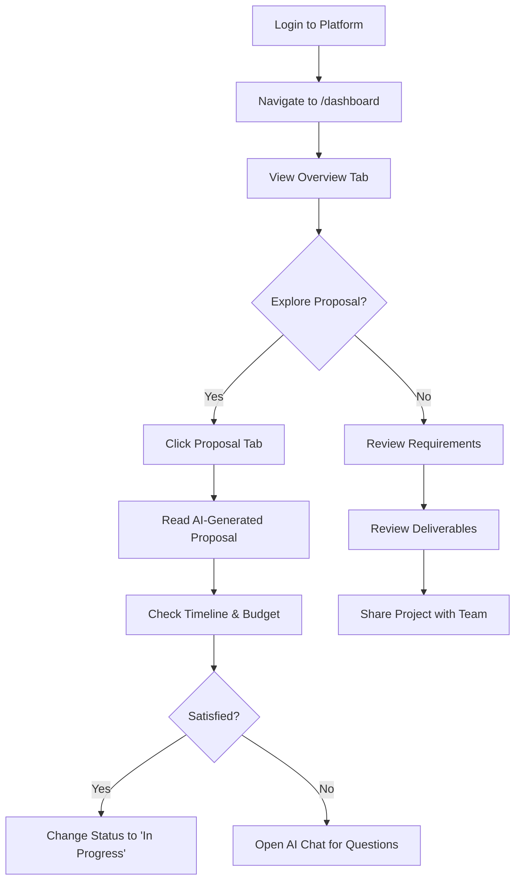
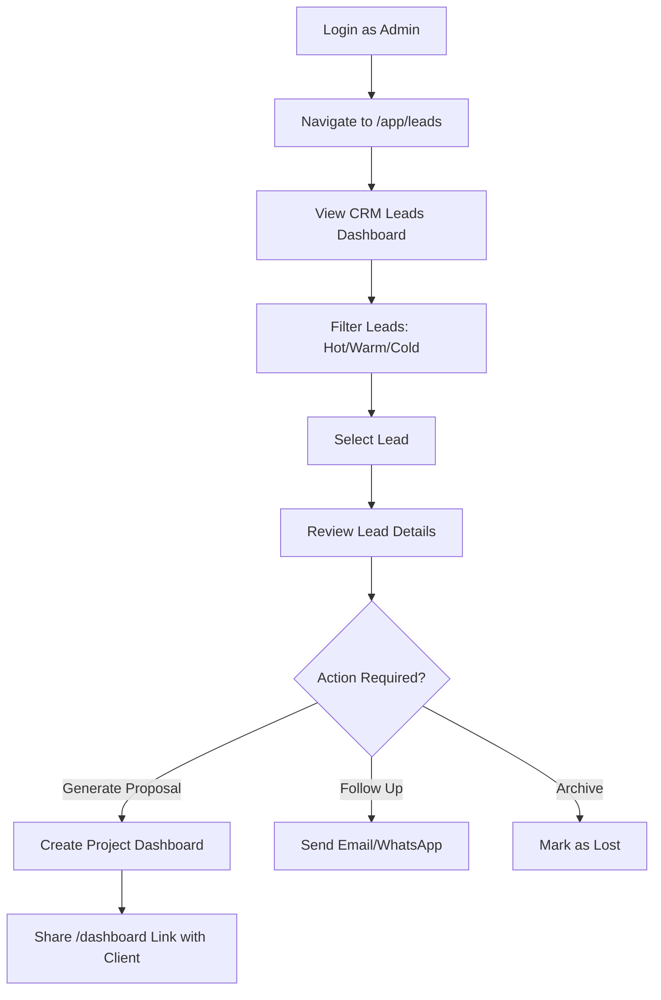
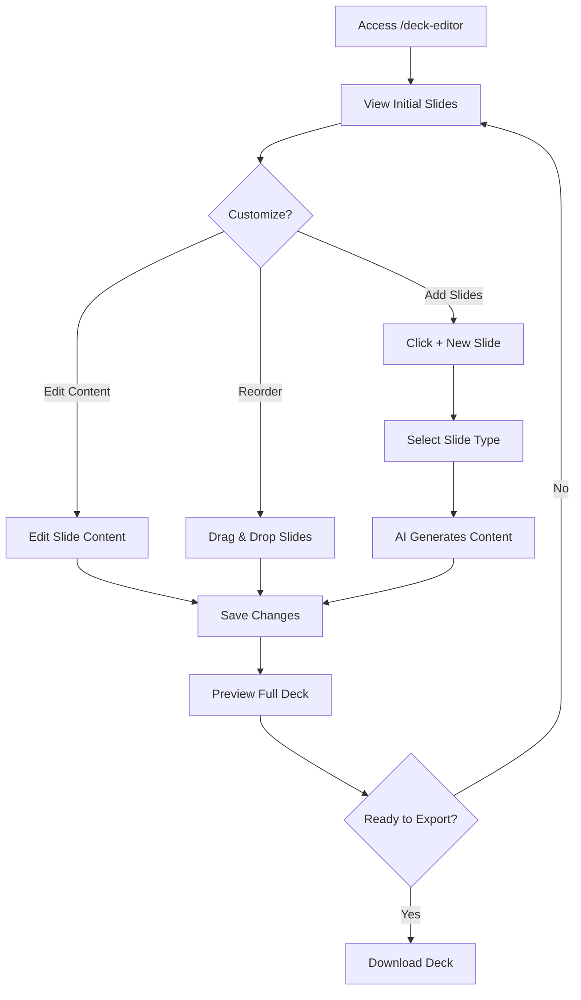
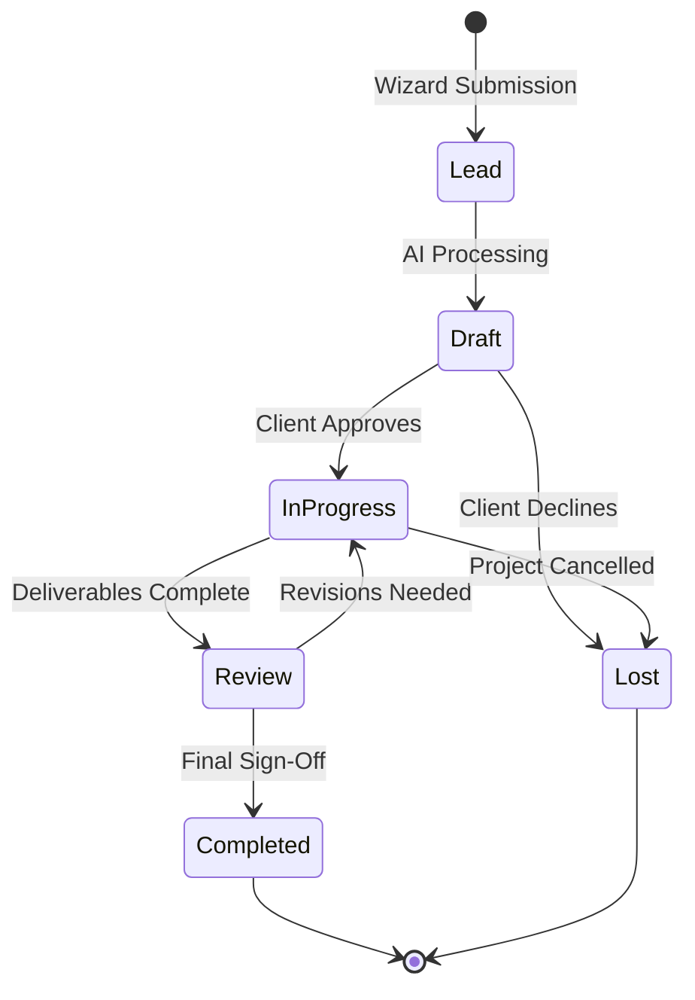
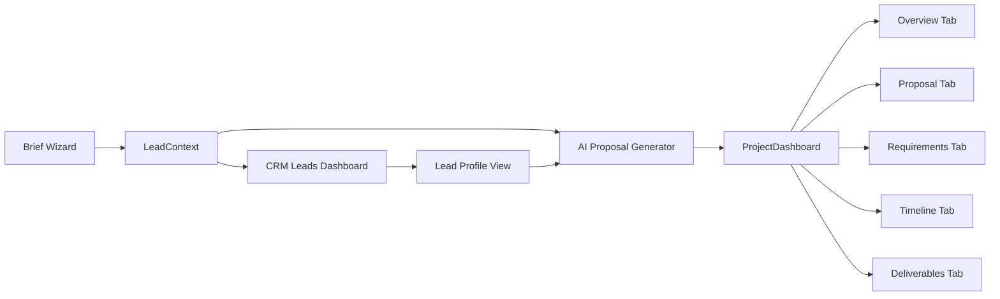

# 08. Client Dashboard System

## Overview
**Primary Route:** `/dashboard`  
**Component:** `ProjectDashboard.tsx`  
**Access:** Protected (requires authentication)  
**Role:** Client & Admin access

---

## Dashboard Screens Inventory

| # | Screen Name | Route | Access | Status | Data Source |
|---|-------------|-------|--------|--------|-------------|
| 1 | **Client Dashboard** | `/dashboard` | Client, Admin | ✅ Active | LeadContext |
| 2 | **Deck Editor** | `/deck-editor` | Client, Admin | ✅ Active | Mock Slides |
| 3 | **Admin CRM Leads** | `/app/leads` | Admin Only | ✅ Active | LeadContext |
| 4 | **Agent Control Room** | `/app/ops` | Admin Only | ✅ Active | Mock Data |
| 5 | **Automation Workflows** | `/app/workflow` | Admin Only | ✅ Active | Mock Data |
| 6 | **Settings** | `/app/settings` | Client, Admin | ✅ Active | Mock Data |
| 7 | **Intelligence Ingest** | `/app/intelligence/ingest` | Admin Only | ✅ Active | Mock Data |
| 8 | **Intelligence Analysis** | `/app/intelligence/analysis` | Admin Only | ✅ Active | Mock Data |
| 9 | **Intelligence Brief** | `/app/intelligence/brief` | Admin Only | ✅ Active | Mock Data |
| 10 | **Intelligence Search** | `/app/intelligence/search` | Admin Only | ✅ Active | Mock Data |

---

## Client Dashboard (`/dashboard`)

### Tab Navigation
| Tab | Icon | Component | Features | Data |
|-----|------|-----------|----------|------|
| **Overview** | LayoutDashboard | OverviewTab | Project summary, goals, key features, proposal snapshot, timeline/milestones | Lead data + AI proposal |
| **Proposal** | FileText | ProposalView | Full AI-generated proposal document | Generated proposal |
| **Requirements** | ListChecks | RequirementsPageClean | Requirements management, acceptance criteria | Mock requirements |
| **Timeline** | Calendar | TimelinePage | Project timeline, milestones | Proposal phases |
| **Deliverables** | Package | DeliverablesPage | Deliverable tracking, progress | Generated deliverables |
| **Files** | FolderOpen | EmptyState | File upload area (placeholder) | None |
| **AI Chat** | MessageSquare | EmptyState | AI assistant conversation (placeholder) | None |

### Header Features
- **Project Title** - Dynamic from lead data
- **Creation Date** - Shows lead creation date
- **Status Dropdown** - Draft / In Progress / Review / Completed
- **Share Button** - Share project (placeholder)
- **Start Project CTA** - Primary action button
- **Close Button** - Returns to homepage

### Sidebar Components
1. **Metadata Card**
   - Company name
   - Website (clickable)
   - Team size
   - Industry
   
2. **AI Assistant Notes Card**
   - Next Best Action
   - Risk Analysis (bullet list)
   - AI-generated insights

### Overview Tab Content
1. **Project Summary Card**
   - Core objectives (checkmarked list)
   - Key features (badge list)
   
2. **Proposal Snapshot**
   - Timeline metric
   - Budget range
   - Deliverables count
   
3. **Timeline & Milestones**
   - Phase-based timeline
   - Visual connector lines
   - Progress indicators

---

## Deck Editor (`/deck-editor`)

### Features
- **Slide Management** - Add, edit, delete slides
- **Slide Types** - Title, Problem, Solution, Market, Team, Traction
- **Live Preview** - Real-time slide preview
- **AI Generation** - Generate slides with AI (mock)
- **Export** - Download presentation (placeholder)

### Initial Slides (Mock Data)
1. Title Slide - Company name and tagline
2. The Problem - Pain point description
3. The Solution - Value proposition
4. Market Size - TAM/SAM data
5. Traction - ARR and waitlist metrics

---

## User Journeys

### Journey 1: Client Reviews Project Proposal



### Journey 2: Admin Manages Lead Pipeline



### Journey 3: Client Creates Investor Deck



---

## Workflows

### Workflow 1: Project Lifecycle



### Workflow 2: Dashboard Data Flow



### Workflow 3: Admin Intelligence System

```mermaid
graph TD
    A[Sales Call Recording] --> B[/app/intelligence/ingest]
    B --> C[Upload Audio/Paste Transcript]
    C --> D[AI Processing - Thinking State]
    D --> E[/app/intelligence/analysis]
    E --> F[Sentiment + Entity + Action Items]
    F --> G{User Action}
    G -->|View Brief| H[/app/intelligence/brief]
    G -->|Search Calls| I[/app/intelligence/search]
    H --> J[Post-Call Action Architect]
    I --> K[Query Natural Language]
    K --> L[Semantic Search Results]
```

---

## Component Architecture

### Primary Components
```
/components/ProjectDashboard.tsx (Main)
├── Header (Sticky)
│   ├── Project Title + Close Button
│   ├── Status Dropdown
│   ├── Share Button
│   ├── Start Project CTA
│   └── Tab Navigation (7 tabs)
├── Main Content Area
│   ├── OverviewTab (Project summary, proposal snapshot, milestones)
│   ├── ProposalTab → ProposalView.tsx
│   ├── RequirementsTab → RequirementsPageClean.tsx
│   ├── TimelineTab → TimelinePage.tsx
│   ├── DeliverablesTab → DeliverablesPage.tsx
│   ├── FilesTab (EmptyState)
│   └── ChatTab (EmptyState)
└── Sidebar (Conditional)
    ├── Metadata Card
    └── AI Assistant Notes Card
```

### Admin-Only Components
```
/app/* Routes (Admin Layout Wrapper)
├── /app/leads → CRMLeadsDashboard
├── /app/ops → AgentControlRoom
├── /app/workflow → AutomationMapPage
├── /app/settings → SettingsPage
└── /app/intelligence/*
    ├── /ingest → CallIngestionScreen
    ├── /analysis → AnalysisState
    ├── /brief → CallBrief
    └── /search → SearchResults
```

---

## Status Management

### Project Status Lifecycle
| Status | Color | Badge | Trigger | Next Step |
|--------|-------|-------|---------|-----------|
| **Draft** | Slate | Gray | Initial creation | Client review |
| **In Progress** | Blue | Blue | Client approval | Development |
| **Review** | Orange | Orange | Deliverables complete | QA testing |
| **Completed** | Green | Emerald | Final sign-off | Archive |

---

## Data Structure

### Project Data Schema
```typescript
{
  title: string,           // "AI Chatbot MVP for E-commerce"
  status: string,          // "Draft" | "In Progress" | "Review" | "Completed"
  createdDate: string,     // "Dec 24, 2025"
  company: {
    name: string,          // "Acme Corp"
    website: string,       // "acme.com"
    teamSize: string,      // "11-50"
    industry: string       // "E-commerce"
  },
  summary: string,         // AI-generated summary
  goals: string[],         // ["Increase conversions", "Reduce support"]
  keyFeatures: string[],   // ["AI Chatbot", "WhatsApp Integration"]
  proposal: {
    timeline: string,      // "8-12 weeks"
    budget: string,        // "$30k-$40k"
    deliverablesCount: number,
    phases: Phase[],
    generatedDeliverables: Deliverable[]
  },
  aiNotes: {
    nextStep: string,      // "Schedule kickoff call"
    risks: string[]        // ["Unclear requirements", "Tight timeline"]
  },
  stats: {
    requirements: number,
    files: number,
    messages: number
  }
}
```

---

## Implementation Checklist

### Phase 1: Core Dashboard ✅
- [x] Project Dashboard component
- [x] 7 tab navigation system
- [x] Overview tab with proposal snapshot
- [x] Status management dropdown
- [x] Sidebar with metadata & AI notes
- [x] Protected route with auth
- [x] LeadContext data integration

### Phase 2: Sub-Pages ✅
- [x] ProposalView component
- [x] RequirementsPageClean component
- [x] TimelinePage component
- [x] DeliverablesPage component
- [x] Empty states for Files & Chat

### Phase 3: Deck Editor ✅
- [x] DeckEditorPage component
- [x] Slide management UI
- [x] Mock slide data
- [ ] **AI slide generation** ⚠️ Mock only
- [ ] **Export functionality** ⚠️ Placeholder

### Phase 4: Admin Dashboards ✅
- [x] AdminLayout wrapper
- [x] CRM Leads Dashboard
- [x] Agent Control Room
- [x] Automation Workflows
- [x] Settings page
- [x] Intelligence OS (4 screens)

### Phase 5: Missing Features 🚧
- [ ] **Files Tab** - Real file upload system
- [ ] **AI Chat Tab** - Live AI conversation
- [ ] **Real-time Updates** - WebSocket integration
- [ ] **Notifications** - In-app alerts
- [ ] **Comments System** - Deliverable comments
- [ ] **Version History** - Change tracking
- [ ] **Team Collaboration** - Multi-user support
- [ ] **Export Options** - PDF/Excel exports

---

## AI Features (Mock Data)

### Currently Mock - Zero AI Implementation
1. **AI Proposal Generator** - Uses template logic
2. **AI Assistant Notes** - Static text
3. **AI Chat Tab** - Empty state
4. **Deck Slide Generation** - Placeholder
5. **Risk Analysis** - Hardcoded warnings
6. **Next Best Action** - Template suggestions
7. **Intelligence Analysis** - Mock sentiment
8. **Entity Extraction** - Fake data
9. **Search Semantic Query** - String matching

---

## Performance Notes

### Load Times (Target)
- Dashboard initial load: < 2s
- Tab switching: < 200ms
- Proposal generation: < 1s (currently instant - mock)

### Optimization Opportunities
- Lazy load tab content
- Virtualize long lists (deliverables, requirements)
- Cache proposal data in localStorage
- Debounce status dropdown updates

---

## Next Steps

1. **Connect Supabase** - Persist project data
2. **Implement Real AI** - OpenAI/Anthropic integration
3. **Add File Upload** - Cloudinary/S3 integration
4. **Build Chat Interface** - WebSocket + AI streaming
5. **Enable Collaboration** - Multi-user editing
6. **Create Export System** - PDF generation
7. **Add Analytics** - Track user engagement
8. **Mobile Optimization** - Responsive improvements

---

**Last Updated:** Dec 27, 2025  
**Version:** 1.0  
**Status:** Production UI + Mock Data
