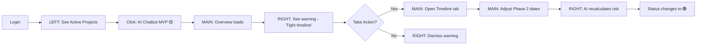
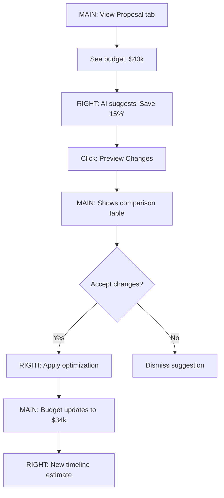
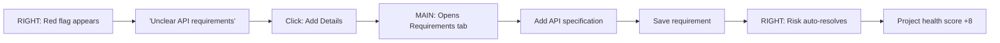

# 09. Client Dashboard Redesign — Universal Product System

**Route:** `/dashboard`  
**Layout:** LEFT (Context) · MAIN (Work) · RIGHT (Intelligence)

---

## 1️⃣ Core Mental Model

> **Left = Context** — Where am I? What am I working on?  
> **Main = Work** — Human decisions, edits, reviews  
> **Right = Intelligence** — AI suggestions, warnings, optimizations

---

## 2️⃣ Three-Panel Dashboard Layout

### 🟦 LEFT PANEL — Context & Navigation

**Width:** 280px fixed  
**Purpose:** Stable orientation, project switching, navigation  
**Rules:** No editing, no AI execution, no heavy logic

#### Navigation Structure
```
┌─ CONTEXT PANEL ──────────────┐
│                               │
│  ☀ Sun AI                    │
│                               │
│  ──────────────────────       │
│                               │
│  🏠 Dashboard Home            │
│  🔍 Explore Projects          │
│                               │
│  ──────────────────────       │
│                               │
│  📁 ACTIVE PROJECTS           │
│   • AI Chatbot MVP       🔴   │
│   • E-commerce Site      🟡   │
│   • Brand Refresh        🟢   │
│                               │
│  ──────────────────────       │
│                               │
│  📊 Views                     │
│   • All Projects              │
│   • In Progress (3)           │
│   • Awaiting Review (1)       │
│   • Completed (12)            │
│                               │
│  ──────────────────────       │
│                               │
│  💬 AI Concierge              │
│  📂 Files & Assets            │
│  📧 Messages                  │
│  ⚙️  Settings                  │
│                               │
└───────────────────────────────┘
```

#### Status Indicators
- 🔴 Red = Blocked / At Risk
- 🟡 Orange = Needs Attention
- 🟢 Green = On Track
- ⚪ Gray = Draft / Paused

#### Features
1. **Project Switcher** - Quick switch between active projects
2. **Smart Filters** - Status, date, budget range
3. **Saved Views** - Custom project groupings
4. **Quick Actions** - New project, upload files, message team

---

### 🟩 MAIN PANEL — Primary Work Area

**Width:** Fluid (60-70% of remaining space)  
**Purpose:** Human-first decisions, editing, reviewing  
**Rules:** AI assists, never replaces

#### Content Sections

##### Section 1: Project Header
```
┌─ PROJECT HEADER ─────────────────────────────────────┐
│                                                       │
│  AI Chatbot MVP for E-commerce                       │
│  Acme Corp · Created Dec 24, 2025                    │
│                                                       │
│  [In Progress ▼]  [Share]  [Export]  [Start Project] │
│                                                       │
└───────────────────────────────────────────────────────┘
```

##### Section 2: Primary Content (Tabbed Views)
```
Overview | Proposal | Requirements | Timeline | Deliverables | Files | Activity

┌─ OVERVIEW ───────────────────────────────────────────┐
│                                                       │
│  📋 PROJECT SUMMARY                                   │
│  AI-powered e-commerce chatbot to increase           │
│  conversions and reduce support tickets by 40%       │
│                                                       │
│  ✓ Core Objectives (3)                               │
│    • Increase conversion rate by 25%                 │
│    • Reduce support tickets by 40%                   │
│    • 24/7 automated customer service                 │
│                                                       │
│  🎯 Key Features (5)                                  │
│    [AI Chatbot] [WhatsApp] [Analytics]               │
│    [Multi-language] [CRM Integration]                │
│                                                       │
│  ──────────────────────────────────────              │
│                                                       │
│  📊 PROPOSAL SNAPSHOT                                 │
│                                                       │
│  ⏱️ Timeline      💰 Budget       📦 Deliverables    │
│  8-12 weeks      $30k-$40k       12 items            │
│                                                       │
│  ──────────────────────────────────────              │
│                                                       │
│  🗓️ TIMELINE & MILESTONES                            │
│                                                       │
│  Phase 1: Discovery (2 weeks)                        │
│  ├─ Requirements workshop                            │
│  ├─ Technical architecture                           │
│  └─ Design mockups                                   │
│                                                       │
│  Phase 2: Development (6 weeks)                      │
│  ├─ Frontend build                                   │
│  ├─ AI model training                                │
│  └─ Integration testing                              │
│                                                       │
│  Phase 3: Launch (2 weeks)                           │
│  └─ Deployment & training                            │
│                                                       │
└───────────────────────────────────────────────────────┘
```

##### Section 3: Interactive Elements
- **Editable Fields** - Click to edit project details
- **Status Updates** - Change project status with notes
- **Document Viewer** - Inline proposal/contract review
- **Requirement Cards** - Drag-to-reorder, expand/collapse
- **Timeline Gantt** - Interactive date adjustments
- **File Upload** - Drag-drop zone for assets

---

### 🟨 RIGHT PANEL — Intelligence & Actions

**Width:** 320px fixed  
**Purpose:** AI brain, suggestions, warnings, smart actions  
**Rules:** AI proposes, never commits without approval

#### Intelligence Modules

##### Module 1: Project Health Score
```
┌─ AI INTELLIGENCE ────────────────┐
│                                  │
│  🎯 PROJECT HEALTH               │
│  ████████░░ 82/100               │
│                                  │
│  ✅ On track for timeline        │
│  ⚠️  Budget utilization: 65%     │
│  ℹ️  3 risks detected            │
│                                  │
└──────────────────────────────────┘
```

##### Module 2: Next Best Actions
```
┌─ NEXT BEST ACTIONS ──────────────┐
│                                  │
│  🎬 Recommended Actions          │
│                                  │
│  1. Schedule kickoff call        │
│     [Schedule Now]               │
│                                  │
│  2. Review wireframes            │
│     Due in 2 days                │
│                                  │
│  3. Approve Phase 1 budget       │
│     [Review Budget]              │
│                                  │
└──────────────────────────────────┘
```

##### Module 3: Risk Warnings
```
┌─ RISK ANALYSIS ──────────────────┐
│                                  │
│  ⚠️  3 RISKS DETECTED             │
│                                  │
│  🔴 Critical                     │
│  • Unclear API requirements      │
│    [Add Details] [Dismiss]       │
│                                  │
│  🟡 Medium                       │
│  • Tight timeline for Phase 2    │
│  • Third-party integration TBD   │
│                                  │
└──────────────────────────────────┘
```

##### Module 4: Smart Optimizations
```
┌─ OPTIMIZATIONS ──────────────────┐
│                                  │
│  ✨ AI SUGGESTIONS               │
│                                  │
│  💡 You could save 15% by:       │
│  • Using pre-built chatbot UI    │
│  • Reducing custom integrations  │
│                                  │
│  [Preview Changes] [Learn More]  │
│                                  │
│  ──────────────────────          │
│                                  │
���  ⚡ Speed up timeline by:        │
│  • Parallel dev/design phases    │
│  • Reuse existing components     │
│                                  │
│  [Show Impact]                   │
│                                  │
└──────────────────────────────────┘
```

##### Module 5: Contextual AI Chat
```
┌─ ASK AI ─────────────────────────┐
│                                  │
│  💬 Quick Questions              │
│                                  │
│  "Why is Phase 2 flagged?"       │
│  "What's the typical timeline?"  │
│  "Can we add e-commerce later?"  │
│                                  │
│  ────────────────────────────    │
│                                  │
│  [Type your question...]         │
│                                  │
└──────────────────────────────────┘
```

##### Module 6: Smart Metadata
```
┌─ PROJECT DETAILS ────────────────┐
│                                  │
│  🏢 Company                      │
│  Acme Corp                       │
│                                  │
│  🌐 Website                      │
│  acme.com →                      │
│                                  │
│  👥 Team Size                    │
│  11-50 employees                 │
│                                  │
│  🏭 Industry                     │
│  E-commerce                      │
│                                  │
│  📅 Start Date                   │
│  Jan 15, 2026                    │
│                                  │
└──────────────────────────────────┘
```

---

## 3️⃣ User Workflows (Redesigned)

### Workflow 1: Review Project Status



### Workflow 2: AI-Assisted Budget Optimization



### Workflow 3: Risk Management



---

## 4️⃣ Implementation Spec

### Component Structure
```tsx
<DashboardLayout>
  {/* LEFT PANEL - Context */}
  <LeftPanel width={280}>
    <Logo />
    <Navigation />
    <ProjectList 
      projects={activeProjects}
      onSelect={handleProjectSwitch}
    />
    <ViewFilters />
    <QuickActions />
  </LeftPanel>

  {/* MAIN PANEL - Work */}
  <MainPanel fluid>
    <ProjectHeader 
      title={project.title}
      status={project.status}
      actions={[share, export, start]}
    />
    <TabNavigation 
      tabs={[overview, proposal, requirements, timeline, deliverables, files]}
    />
    <TabContent>
      {activeTab === 'overview' && <OverviewSection />}
      {activeTab === 'proposal' && <ProposalDocument editable />}
      {activeTab === 'requirements' && <RequirementsList />}
      {activeTab === 'timeline' && <TimelineGantt />}
      {activeTab === 'deliverables' && <DeliverablesTracker />}
      {activeTab === 'files' && <FileManager />}
    </TabContent>
  </MainPanel>

  {/* RIGHT PANEL - Intelligence */}
  <RightPanel width={320}>
    <ProjectHealthScore score={82} />
    <NextBestActions actions={aiActions} />
    <RiskWarnings risks={detectedRisks} />
    <SmartOptimizations suggestions={aiSuggestions} />
    <ContextualAIChat context={currentView} />
    <ProjectMetadata data={project.company} />
  </RightPanel>
</DashboardLayout>
```

### Data Flow
```
LeadContext 
  → AI Proposal Generator
  → ProjectStore (Zustand/Context)
  → DashboardLayout
    ├─ LeftPanel (reads: project list, filters)
    ├─ MainPanel (reads/writes: project details)
    └─ RightPanel (reads: AI analysis, writes: user actions)
```

### Responsive Behavior
| Breakpoint | Left | Main | Right | Behavior |
|------------|------|------|-------|----------|
| **Desktop** (1440px+) | 280px | 60% | 320px | All visible |
| **Laptop** (1024px) | 240px | 65% | Collapsible | Right panel collapses to icon bar |
| **Tablet** (768px) | Drawer | 100% | Bottom sheet | Left = hamburger menu, Right = swipe-up sheet |
| **Mobile** (375px) | Drawer | 100% | Modal | Stack all panels, show one at a time |

---

## 5️⃣ AI Features (Right Panel)

### Real Implementation Needed

| # | Feature | Current Status | Real AI Needed |
|---|---------|----------------|----------------|
| 1 | **Project Health Score** | Mock (static 82/100) | Multi-factor analysis: timeline adherence, budget burn rate, requirement completion, risk count |
| 2 | **Next Best Actions** | Template suggestions | Context-aware recommendations based on project phase, overdue tasks, upcoming milestones |
| 3 | **Risk Detection** | Hardcoded warnings | NLP analysis of requirements, timeline conflicts, budget alerts, dependency issues |
| 4 | **Budget Optimization** | Fake savings | Cost analysis: feature prioritization, scope reduction suggestions, alternative tech stacks |
| 5 | **Timeline Predictions** | Static estimates | ML model: historical project data, team velocity, complexity scoring |
| 6 | **Smart Search** | String matching | Semantic search across projects, requirements, files, conversations |
| 7 | **Contextual Chat** | Empty state | GPT-4 with project context: answers questions about timeline, budget, risks, next steps |
| 8 | **Auto-Categorization** | Manual tags | Auto-tag requirements by type (frontend, backend, design, etc.) |
| 9 | **Sentiment Analysis** | N/A | Analyze client messages, meeting notes for satisfaction trends |

---

## 6️⃣ Left Panel Navigation Map

### Primary Navigation
1. **Dashboard Home** - `/dashboard`
   - All projects overview
   - Activity feed
   - Stats summary

2. **Explore Projects** - `/dashboard/explore`
   - Search all projects
   - Filter by status, date, budget
   - Sort by health score, deadline

### Project Views
3. **Active Projects** - Dynamic list
   - Click → Load in Main panel
   - Status badge → Quick status change
   - Right-click → Context menu (archive, duplicate, share)

4. **Smart Filters**
   - In Progress (3) → `/dashboard?status=in-progress`
   - Awaiting Review (1) → `/dashboard?status=review`
   - Completed (12) → `/dashboard?status=completed`
   - At Risk → `/dashboard?health=<60`

### Utility Navigation
5. **AI Concierge** - `/dashboard/chat`
   - Global AI assistant
   - Cross-project queries
   - Help & documentation

6. **Files & Assets** - `/dashboard/files`
   - All uploaded files
   - Organized by project
   - Search by name, type, date

7. **Messages** - `/dashboard/messages`
   - Team communications
   - Client conversations
   - Notifications

8. **Settings** - `/app/settings`
   - Profile preferences
   - Notification settings
   - Billing & subscription

---

## 7️⃣ State Management

### Zustand Store Structure
```typescript
// /stores/dashboardStore.ts
interface DashboardStore {
  // Left Panel State
  activeProjectId: string | null;
  projectList: Project[];
  selectedFilter: FilterType;
  isLeftPanelCollapsed: boolean;
  
  // Main Panel State
  activeTab: TabType;
  editMode: boolean;
  unsavedChanges: boolean;
  
  // Right Panel State
  aiSuggestions: Suggestion[];
  detectedRisks: Risk[];
  projectHealth: number;
  isRightPanelCollapsed: boolean;
  
  // Actions
  setActiveProject: (id: string) => void;
  updateProjectStatus: (id: string, status: ProjectStatus) => void;
  dismissRisk: (riskId: string) => void;
  acceptSuggestion: (suggestionId: string) => void;
  toggleLeftPanel: () => void;
  toggleRightPanel: () => void;
}
```

---

## 8️⃣ Design System Components

### New Components Needed
1. **`<ThreePanelLayout>`** - Main layout wrapper
2. **`<LeftNavPanel>`** - Navigation sidebar
3. **`<ProjectSwitcher>`** - Quick project dropdown
4. **`<HealthScoreCard>`** - AI health visualization
5. **`<RiskAlert>`** - Warning/error messages
6. **`<AISuggestionCard>`** - Optimization suggestions
7. **`<ContextualChat>`** - Inline AI assistant
8. **`<StatusBadge>`** - Color-coded status indicators
9. **`<ActionButton>`** - AI-suggested actions
10. **`<CollapsiblePanel>`** - Responsive panel behavior

### Existing Components to Reuse
- `Button`, `Card`, `Badge`, `Typography` from design system
- `ProposalView`, `RequirementsPageClean`, `TimelinePage`, `DeliverablesPage`

---

## 9️⃣ Migration Checklist

### Phase 1: Layout Restructure
- [ ] Create `<ThreePanelLayout>` component
- [ ] Build `<LeftNavPanel>` with project list
- [ ] Move existing content to Main panel
- [ ] Create `<RightPanel>` shell
- [ ] Add responsive collapse behavior
- [ ] Test all breakpoints

### Phase 2: Left Panel Features
- [ ] Implement project switcher
- [ ] Add smart filters (status, health score)
- [ ] Build saved views
- [ ] Add quick actions menu
- [ ] Integrate with navigation

### Phase 3: Right Panel Intelligence
- [ ] Build `<ProjectHealthScore>` component
- [ ] Create `<NextBestActions>` widget
- [ ] Implement `<RiskWarnings>` alerts
- [ ] Add `<SmartOptimizations>` suggestions
- [ ] Build `<ContextualAIChat>` interface
- [ ] Display `<ProjectMetadata>` card

### Phase 4: AI Integration
- [ ] Connect OpenAI/Anthropic for health scoring
- [ ] Implement risk detection logic
- [ ] Build optimization recommendation engine
- [ ] Add semantic search
- [ ] Create contextual chat with project awareness
- [ ] Set up real-time AI updates

### Phase 5: Polish & Optimization
- [ ] Add animations (panel slide, card transitions)
- [ ] Implement keyboard shortcuts
- [ ] Add drag-to-resize panels
- [ ] Create onboarding tour
- [ ] Performance optimization (lazy loading)
- [ ] Accessibility audit (WCAG 2.1 AA)

---

## 🔟 Key Differences from Current Design

| Aspect | Current Design | New Design |
|--------|----------------|------------|
| **Navigation** | Tabs only | Left panel + tabs |
| **Project Switching** | Manual route change | Quick switcher in left panel |
| **AI Placement** | Mixed in sidebar | Dedicated right panel |
| **Intelligence** | Static notes | Dynamic suggestions, warnings, actions |
| **Context** | Header only | Full left panel with filters, views |
| **Responsiveness** | Basic mobile | Intelligent panel collapsing |
| **Focus** | All-in-one view | Separation of concerns (Context · Work · Intelligence) |

---

**Last Updated:** Dec 27, 2025  
**Version:** 2.0 (Universal Product System)  
**Status:** Design Proposal
