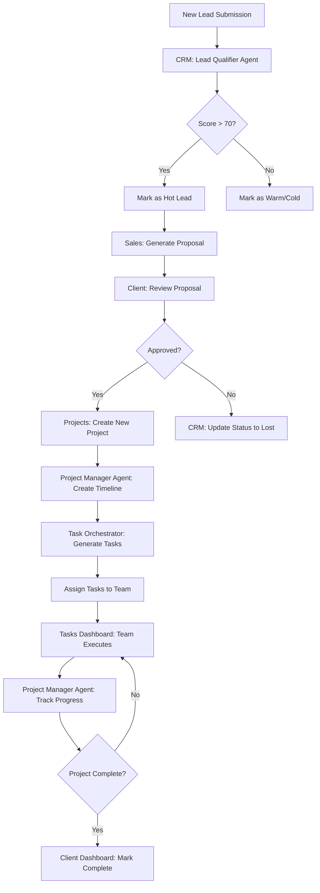
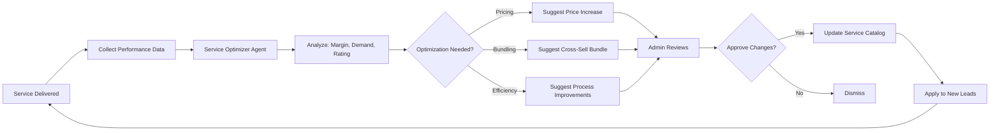
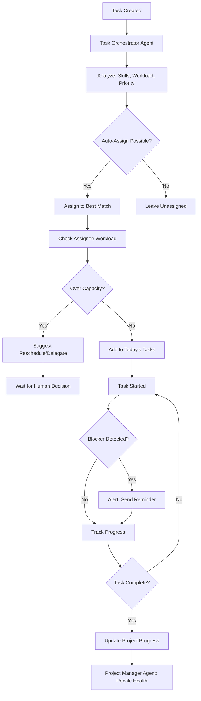
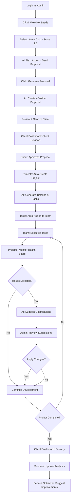
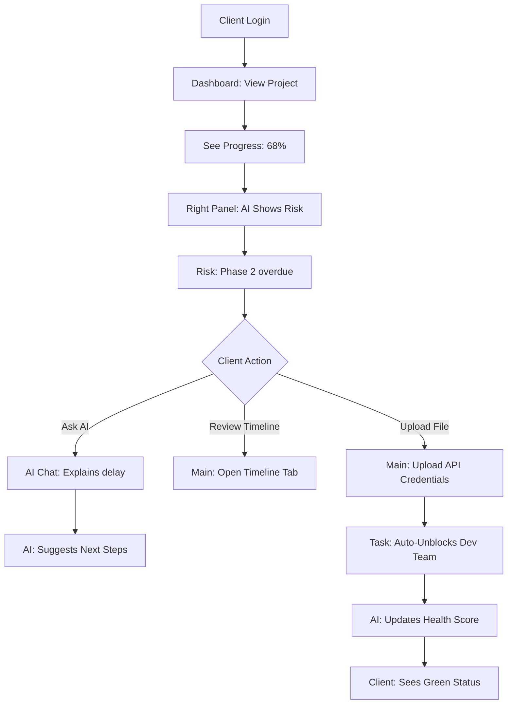
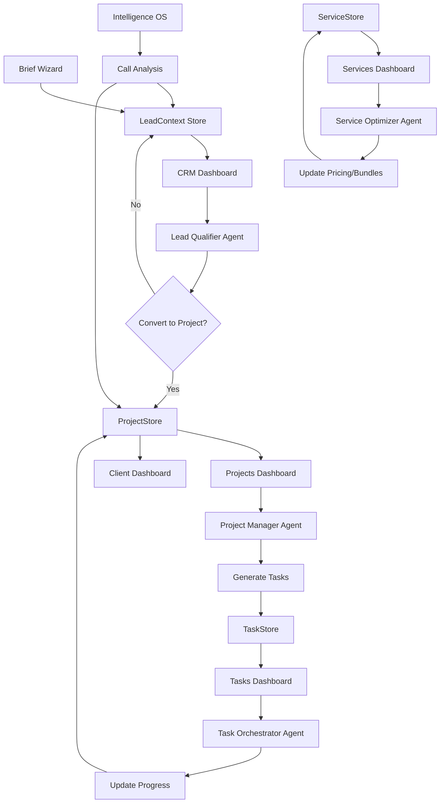

# 10. Complete Dashboard System Architecture

**Universal Product System:** LEFT (Context) · MAIN (Work) · RIGHT (Intelligence)

---

## 1️⃣ Dashboard System Overview

### Dashboard Ecosystem Map

| Dashboard | Route | Primary User | Purpose | AI Agent |
|-----------|-------|--------------|---------|----------|
| **CRM Leads** | `/app/leads` | Admin, Sales | Lead management, pipeline, scoring | Lead Qualifier Agent |
| **Projects** | `/app/projects` | Admin, PM | Project tracking, deliverables, timeline | Project Manager Agent |
| **Services** | `/app/services` | Admin, Ops | Service catalog, pricing, analytics | Service Optimizer Agent |
| **Tasks** | `/app/tasks` | All roles | Task management, assignments, automation | Task Orchestrator Agent |
| **Client Dashboard** | `/dashboard` | Client | Project view, proposals, collaboration | Client Concierge Agent |
| **Intelligence OS** | `/app/intelligence` | Admin, Sales | Call analysis, insights, search | Intelligence Analyst Agent |

---

## 2️⃣ CRM Leads Dashboard

**Route:** `/app/leads`  
**Access:** Admin, Sales roles  
**Agent:** Lead Qualifier Agent

### Three-Panel Layout

#### 🟦 LEFT PANEL — Lead Context
```
┌─ LEAD NAVIGATION ────────────┐
│                              │
│  🎯 PIPELINE VIEWS           │
│  • All Leads (47)            │
│  • Hot Leads (12) 🔥         │
│  • Warm Leads (18) 🟡        │
│  • Cold Leads (17) ❄️         │
│                              │
│  ──────────────────          │
│                              │
│  📊 STAGES                   │
│  • New (8)                   │
│  • Qualified (15)            │
│  • Proposal Sent (12)        │
│  • Negotiation (7)           │
│  • Closed Won (5) ✅         │
│  • Closed Lost (0)           │
│                              │
│  ──────────────────          │
│                              │
│  🏷️ SEGMENTS                 │
│  • E-commerce (12)           │
│  • SaaS (8)                  │
│  • Healthcare (5)            │
│  • Real Estate (3)           │
│                              │
│  ──────────────────          │
│                              │
│  📅 TIME FILTERS             │
│  • Today (3 new)             │
│  • This Week (12)            │
│  • This Month (28)           │
│  • This Quarter (47)         │
│                              │
│  ──────────────────          │
│                              │
│  ⚡ QUICK ACTIONS            │
│  [+ Add Lead]                │
│  [Import CSV]                │
│  [Export Pipeline]           │
│                              │
└──────────────────────────────┘
```

#### 🟩 MAIN PANEL — Lead Management
```
┌─ LEAD PIPELINE ─────────────────────────────────────────────┐
│                                                              │
│  Search leads...  [Filter ▼]  [Sort: Score ▼]  [View: Grid] │
│                                                              │
│  ────────────────────────────────────────────────────────   │
│                                                              │
│  🔥 HOT LEADS (12)                                          │
│                                                              │
│  ┌─ LEAD CARD ──────────────────────────────────┐          │
│  │ Acme Corp                            Score: 92│          │
│  │ contact@acme.com · acme.com                  │          │
│  │                                               │          │
│  │ 💰 Budget: $40k-$60k  ⏱️ Timeline: 8 weeks  │          │
│  │ 🎯 AI Chatbot + WhatsApp Integration         │          │
│  │                                               │          │
│  │ Last Activity: 2h ago · Stage: Qualified     │          │
│  │                                               │          │
│  │ [View Details] [Send Proposal] [Schedule]    │          │
│  └───────────────────────────────────────────────┘          │
│                                                              │
│  ┌─ LEAD CARD ──────────────────────────────────┐          │
│  │ TechNova AI                          Score: 88│          │
│  │ hello@technova.ai · technova.ai              │          │
│  │                                               │          │
│  │ 💰 Budget: $30k-$50k  ⏱️ Timeline: 10 weeks │          │
│  │ 🎯 MVP Development + AI Integration          │          │
│  │                                               │          │
│  │ Last Activity: 5h ago · Stage: Proposal Sent │          │
│  │                                               │          │
│  │ [Follow Up] [View Proposal] [Call Notes]     │          │
│  └───────────────────────────────────────────────┘          │
│                                                              │
│  [Load More...]                                              │
│                                                              │
└──────────────────────────────────────────────────────────────┘
```

#### 🟨 RIGHT PANEL — Lead Intelligence
```
┌─ LEAD QUALIFIER AGENT ───────┐
│                              │
│  🤖 AI LEAD SCORING          │
│  ████████░░ 92/100           │
│                              │
│  ✅ High intent signals      │
│  ✅ Budget confirmed         │
│  ✅ Decision maker           │
│  ⚠️  Competitive pressure    │
│                              │
│  ──────────────────          │
│                              │
│  🎯 NEXT BEST ACTIONS        │
│                              │
│  1. Send proposal today      │
│     Win rate drops 30% after │
│     48h delay                │
│     [Generate Proposal] 🚀   │
│                              │
│  2. Schedule discovery call  │
│     [Book Meeting]           │
│                              │
│  3. Share case study         │
│     Match: E-commerce + AI   │
│     [Send Case Study]        │
│                              │
│  ──────────────────          │
│                              │
│  ⚠️  RISK SIGNALS             │
│                              │
│  🔴 Competitor mentioned     │
│     "Also evaluating XYZ Co" │
│                              │
│  🟡 Budget concern           │
│     Asked about payment plans│
│                              │
│  ──────────────────          │
│                              │
│  📊 INSIGHTS                 │
│                              │
│  • Similar deals: 8          │
│    Avg win rate: 65%         │
│    Avg deal size: $42k       │
│                              │
│  • Best day to follow up:    │
│    Tuesday 10am              │
│                              │
│  • Recommended discount:     │
│    0-5% (strong intent)      │
│                              │
│  ──────────────────          │
│                              │
│  💬 ASK AI                   │
│  "Why is this lead hot?"     │
│  "What's the close strategy?"│
│                              │
└──────────────────────────────┘
```

### CRM Data Schema
```typescript
interface Lead {
  id: string;
  companyName: string;
  contactName: string;
  email: string;
  phone?: string;
  website?: string;
  
  // Qualification
  score: number;           // 0-100, AI-calculated
  stage: LeadStage;        // New | Qualified | Proposal | Negotiation | Won | Lost
  temperature: 'hot' | 'warm' | 'cold';
  
  // Requirements
  services: string[];      // ['AI Chatbot', 'WhatsApp']
  budget: string;          // '$40k-$60k'
  timeline: string;        // '8 weeks'
  goals: string[];
  
  // Engagement
  lastActivity: Date;
  touchpoints: number;
  callNotes: CallNote[];
  proposalSent: boolean;
  proposalViewedAt?: Date;
  
  // AI Insights
  aiScore: number;
  riskSignals: RiskSignal[];
  nextActions: Action[];
  competitorMentions: string[];
  
  // Metadata
  source: string;          // 'Website' | 'Referral' | 'Cold Outreach'
  assignedTo?: string;
  createdAt: Date;
  updatedAt: Date;
}
```

### AI Agent: Lead Qualifier

**Purpose:** Auto-score leads, detect intent, suggest actions

**Inputs:**
- Lead form data (services, budget, timeline, goals)
- Email/message sentiment analysis
- Website browsing behavior
- Proposal engagement (opens, time spent)
- Competitor mentions
- Response time patterns

**Outputs:**
- Lead score (0-100)
- Temperature (hot/warm/cold)
- Risk signals (competitor, budget concern, ghosting)
- Next best actions (send proposal, schedule call, share case study)
- Win probability prediction
- Recommended discount range

**Logic:**
```python
def calculate_lead_score(lead):
    score = 0
    
    # Budget qualification (30 points)
    if lead.budget_max >= 30000:
        score += 30
    elif lead.budget_max >= 15000:
        score += 20
    else:
        score += 10
    
    # Timeline urgency (20 points)
    if lead.timeline_weeks <= 4:
        score += 20  # Urgent
    elif lead.timeline_weeks <= 8:
        score += 15
    else:
        score += 10
    
    # Engagement signals (25 points)
    if lead.proposal_viewed:
        score += 10
    if lead.response_time_hours < 24:
        score += 10
    if lead.touchpoints >= 3:
        score += 5
    
    # Authority/Decision maker (15 points)
    if lead.job_title in ['CEO', 'CTO', 'Founder']:
        score += 15
    elif lead.job_title in ['VP', 'Director', 'Manager']:
        score += 10
    
    # Intent signals (10 points)
    if 'urgent' in lead.message_content.lower():
        score += 5
    if 'asap' in lead.message_content.lower():
        score += 5
    
    # Risk deductions
    if lead.competitor_mentions:
        score -= 10
    if lead.days_since_last_contact > 7:
        score -= 15
    
    return min(100, max(0, score))
```

---

## 3️⃣ Projects Dashboard

**Route:** `/app/projects`  
**Access:** Admin, Project Manager, Developers  
**Agent:** Project Manager Agent

### Three-Panel Layout

#### 🟦 LEFT PANEL — Project Context
```
┌─ PROJECT NAVIGATION ─────────┐
│                              │
│  📂 MY PROJECTS              │
│  • Active (8)                │
│  • Planning (3)              │
│  • On Hold (2)               │
│  • Completed (24)            │
│                              │
│  ──────────────────          │
│                              │
│  🎯 BY STATUS                │
│  • On Track (5) 🟢           │
│  • At Risk (2) 🟡            │
│  • Blocked (1) 🔴            │
│                              │
│  ──────────────────          │
│                              │
│  👥 BY CLIENT                │
│  • Acme Corp (2)             │
│  • TechNova AI (1)           │
│  • Urban Realty (1)          │
│                              │
│  ──────────────────          │
│                              │
│  📊 VIEWS                    │
│  • Kanban Board              │
│  • Timeline (Gantt)          │
│  • Table View                │
│  • Calendar                  │
│                              │
│  ──────────────────          │
│                              │
│  🔍 FILTERS                  │
│  Budget: All                 │
│  Timeline: All               │
│  Team: All                   │
│  Priority: All               │
│                              │
└──────────────────────────────┘
```

#### 🟩 MAIN PANEL — Project Management
```
┌─ PROJECT BOARD (KANBAN) ───────────────────────────────────┐
│                                                             │
│  [Timeline] [Kanban] [Table] [Calendar]    [+ New Project] │
│                                                             │
│  ───────────────────────────────────────────────────────   │
│                                                             │
│  PLANNING (3)    IN PROGRESS (5)    REVIEW (2)    DONE (1) │
│                                                             │
│  ┌─────────┐    ┌─────────┐        ┌─────────┐            │
│  │ Acme AI │    │TechNova │        │Urban    │            │
│  │ Chatbot │    │MVP Dev  │        │Website  │            │
│  │         │    │         │        │Redesign │            │
│  │ 🟢 Green│    │ 🟡 Risk │        │ 🟢 Green│            │
│  │         │    │         │        │         │            │
│  │ $40k    │    │ $35k    │        │ $25k    │            │
│  │ 8 weeks │    │ 10 weeks│        │ 6 weeks │            │
│  │         │    │         │        │         │            │
│  │ 15% ▓░░░│    │ 68% ▓▓▓▓│        │ 92% ▓▓▓▓│            │
│  │         │    │         │        │         │            │
│  │ Kickoff │    │ Phase 2 │        │ QA Test │            │
│  │ Dec 28  │    │ overdue │        │ Review  │            │
│  └─────────┘    └─────────┘        └─────────┘            │
│                                                             │
│  ┌─────────┐    ┌─────────┐        ┌─────────┐            │
│  │ HealthAI│    │FinTech  │        │ B2B SaaS│            │
│  │ Portal  │    │ Dashboard│        │ Launch  │            │
│  └─────────┘    └─────────┘        └─────────┘            │
│                                                             │
└─────────────────────────────────────────────────────────────┘
```

#### 🟨 RIGHT PANEL — Project Intelligence
```
┌─ PROJECT MANAGER AGENT ──────┐
│                              │
│  🤖 PROJECT HEALTH           │
│  TechNova MVP Development    │
│  ██████░░░░ 68/100           │
│                              │
│  ⚠️  2 CRITICAL ISSUES        │
│                              │
│  🔴 Phase 2 overdue by 3 days│
│     Impact: Launch delay     │
│     [View Timeline]          │
│                              │
│  🔴 API integration blocked  │
│     Waiting on client creds  │
│     [Send Reminder]          │
│                              │
│  ──────────────────          │
│                              │
│  🎯 NEXT ACTIONS             │
│                              │
│  1. Reschedule Phase 2 tasks │
│     AI suggests: Add 1 week  │
│     [Auto-Adjust Timeline]   │
│                              │
│  2. Follow up with client    │
│     Last contact: 4 days ago │
│     [Send Email Template]    │
│                              │
│  3. Review deliverables      │
│     3 items ready for QA     │
│     [Open Review Queue]      │
│                              │
│  ──────────────────          │
│                              │
│  📊 INSIGHTS                 │
│                              │
│  • Budget burn: 58% spent    │
│    vs 68% progress ✅        │
│                              │
│  • Team velocity: 12 pts/wk  │
│    Above avg (10 pts/wk)     │
│                              │
│  • Risk of delay: 40%        │
│    If no action in 48h       │
│                              │
│  ──────────────────          │
│                              │
│  ✨ OPTIMIZATIONS            │
│                              │
│  💡 Parallel dev/design      │
│     Save 1.5 weeks           │
│     [Preview Changes]        │
│                              │
│  💡 Reuse UI components      │
│     From Urban Realty proj   │
│     [Show Components]        │
│                              │
└──────────────────────────────┘
```

### Project Data Schema
```typescript
interface Project {
  id: string;
  title: string;
  client: Client;
  
  // Planning
  status: ProjectStatus;  // Planning | Active | Review | On Hold | Completed
  health: number;         // 0-100, AI-calculated
  priority: 'low' | 'medium' | 'high' | 'critical';
  
  // Scope
  services: string[];
  deliverables: Deliverable[];
  requirements: Requirement[];
  
  // Timeline
  startDate: Date;
  endDate: Date;
  milestones: Milestone[];
  phases: Phase[];
  
  // Budget
  budgetTotal: number;
  budgetSpent: number;
  budgetRemaining: number;
  
  // Team
  projectManager: User;
  team: TeamMember[];
  
  // Progress
  progressPercent: number;
  tasksTotal: number;
  tasksCompleted: number;
  
  // AI Insights
  healthScore: number;
  riskLevel: 'low' | 'medium' | 'high';
  blockers: Blocker[];
  nextActions: Action[];
  predictedEndDate: Date;
  
  // Metadata
  createdAt: Date;
  updatedAt: Date;
}
```

### AI Agent: Project Manager

**Purpose:** Track health, detect blockers, optimize timeline

**Inputs:**
- Task completion velocity
- Budget burn rate vs. progress
- Milestone deadlines
- Team capacity
- Client response times
- Blocker duration

**Outputs:**
- Health score (0-100)
- Risk level (low/medium/high)
- Predicted completion date
- Budget overrun alerts
- Timeline optimization suggestions
- Resource reallocation recommendations

**Logic:**
```python
def calculate_project_health(project):
    score = 100
    
    # Timeline adherence (30 points)
    if project.days_overdue > 7:
        score -= 30
    elif project.days_overdue > 3:
        score -= 20
    elif project.days_overdue > 0:
        score -= 10
    
    # Budget tracking (25 points)
    budget_vs_progress = project.budget_spent_percent - project.progress_percent
    if budget_vs_progress > 20:  # Overspending
        score -= 25
    elif budget_vs_progress > 10:
        score -= 15
    
    # Task velocity (20 points)
    if project.completed_tasks_this_week < project.planned_tasks_this_week:
        score -= 20
    
    # Blockers (15 points)
    score -= len(project.active_blockers) * 5
    
    # Client responsiveness (10 points)
    if project.days_since_client_response > 7:
        score -= 10
    elif project.days_since_client_response > 3:
        score -= 5
    
    return max(0, score)

def predict_completion_date(project):
    # Calculate average velocity
    weeks_elapsed = project.weeks_since_start
    progress = project.progress_percent
    
    if progress == 0:
        return project.planned_end_date
    
    velocity = progress / weeks_elapsed  # % per week
    remaining = 100 - progress
    
    weeks_needed = remaining / velocity
    predicted_date = today + timedelta(weeks=weeks_needed)
    
    # Add buffer for blockers
    buffer_weeks = len(project.active_blockers) * 0.5
    
    return predicted_date + timedelta(weeks=buffer_weeks)
```

---

## 4️⃣ Services Dashboard

**Route:** `/app/services`  
**Access:** Admin, Operations  
**Agent:** Service Optimizer Agent

### Three-Panel Layout

#### 🟦 LEFT PANEL — Service Context
```
┌─ SERVICE NAVIGATION ─────────┐
│                              │
│  🛠️ SERVICE CATALOG          │
│  • All Services (12)         │
│  • Active (8)                │
│  • Archived (4)              │
│                              │
│  ──────────────────          │
│                              │
│  📂 CATEGORIES               │
│  • AI Development (4)        │
│  • Web Development (3)       │
│  • Chatbots (2)              │
│  • Integrations (2)          │
│  • Consulting (1)            │
│                              │
│  ──────────────────          │
│                              │
│  💰 PRICING TIERS            │
│  • Starter ($10k-$20k)       │
│  • Professional ($20k-$40k)  │
│  • Enterprise ($40k+)        │
│                              │
│  ──────────────────          │
│                              │
│  📊 ANALYTICS                │
│  • Most Requested (5)        │
│  • Highest Revenue (3)       │
│  • Best Margins (4)          │
│  • Underperforming (2)       │
│                              │
│  ──────────────────          │
│                              │
│  ⚡ QUICK ACTIONS            │
│  [+ Add Service]             │
│  [Update Pricing]            │
│  [Generate Report]           │
│                              │
└──────────────────────────────┘
```

#### 🟩 MAIN PANEL — Service Management
```
┌─ SERVICE CATALOG ──────────────────────────────────────────┐
│                                                             │
│  Search services...  [Category ▼]  [Sort ▼]  [+ Service]  │
│                                                             │
│  ───────────────────────────────────────────────────────   │
│                                                             │
│  ┌─ SERVICE CARD ────────────────────────────────────┐     │
│  │ 🤖 AI Chatbot Development                         │     │
│  │                                                    │     │
│  │ Custom AI-powered chatbot with NLP, multi-channel │     │
│  │ support, and CRM integration                      │     │
│  │                                                    │     │
│  │ 💰 Pricing: $15k-$30k                             │     │
│  │ ⏱️ Timeline: 6-8 weeks                            │     │
│  │ 📦 Deliverables: 8 items                          │     │
│  │                                                    │     │
│  │ 📊 Performance:                                   │     │
│  │ • 24 projects completed                           │     │
│  │ • $580k total revenue                             │     │
│  │ • 4.8/5.0 client rating                           │     │
│  │ • 68% margin                                      │     │
│  │                                                    │     │
│  │ [Edit] [View Analytics] [Clone] [Archive]        │     │
│  └────────────────────────────────────────────────────┘     │
│                                                             │
│  ┌─ SERVICE CARD ────────────────────────────────────┐     │
│  │ 🌐 AI Web Development                             │     │
│  │                                                    │     │
│  │ Full-stack web app with React, Next.js, AI       │     │
│  │ integrations, and modern design                   │     │
│  │                                                    │     │
│  │ 💰 Pricing: $25k-$50k                             │     │
│  │ ⏱️ Timeline: 8-12 weeks                           │     │
│  │ 📦 Deliverables: 12 items                         │     │
│  │                                                    │     │
│  │ 📊 Performance:                                   │     │
│  │ • 18 projects completed                           │     │
│  │ • $720k total revenue                             │     │
│  │ • 4.9/5.0 client rating                           │     │
│  │ • 72% margin                                      │     │
│  │                                                    │     │
│  │ [Edit] [View Analytics] [Clone] [Archive]        │     │
│  └────────────────────────────────────────────────────┘     │
│                                                             │
└─────────────────────────────────────────────────────────────┘
```

#### 🟨 RIGHT PANEL — Service Intelligence
```
┌─ SERVICE OPTIMIZER AGENT ────┐
│                              │
│  🤖 SERVICE ANALYTICS        │
│  AI Chatbot Development      │
│                              │
│  📊 DEMAND TRENDS            │
│  ████████░░ High             │
│  +35% requests this quarter  │
│                              │
│  ✅ Strong performers:       │
│  • High close rate (72%)     │
│  • Fast delivery (avg 7 wks) │
│  • High satisfaction (4.8)   │
│                              │
│  ──────────────────          │
│                              │
│  💡 OPTIMIZATION IDEAS       │
│                              │
│  1. Increase pricing 15%     │
│     Market can support $35k  │
│     Demand is strong         │
│     [Preview Impact]         │
│                              │
│  2. Create "Lite" tier       │
│     $10k for basic chatbot   │
│     Captures small budgets   │
│     [Build Package]          │
│                              │
│  3. Bundle with WhatsApp     │
│     78% of clients add later │
│     [Create Bundle]          │
│                              │
│  ──────────────────          │
│                              │
│  ⚠️  RISKS                    │
│                              │
│  🟡 Margin compression       │
│     Dev costs +12% this Q    │
│     [Review Costs]           │
│                              │
│  ──────────────────          │
│                              │
│  📈 CROSS-SELL OPPORTUNITIES │
│                              │
│  Clients who buy this also:  │
│  • WhatsApp Integration (78%)│
│  • Analytics Dashboard (65%) │
│  • Ongoing Support (92%)     │
│                              │
│  ──────────────────          │
│                              │
│  🎯 RECOMMENDED ACTIONS      │
│                              │
│  • Update pricing sheet      │
│  • Create Lite package       │
│  • Add upsell sequence       │
│                              │
└──────────────────────────────┘
```

### Service Data Schema
```typescript
interface Service {
  id: string;
  name: string;
  category: ServiceCategory;
  description: string;
  
  // Pricing
  priceMin: number;
  priceMax: number;
  pricingModel: 'fixed' | 'hourly' | 'value-based';
  
  // Delivery
  timelineWeeks: string;      // '6-8 weeks'
  deliverables: string[];
  requirementsTemplate: string;
  
  // Performance
  projectsCompleted: number;
  totalRevenue: number;
  averageMargin: number;
  clientRating: number;
  
  // Analytics
  demandTrend: 'rising' | 'stable' | 'declining';
  closeRate: number;
  averageDeliveryTime: number;
  
  // AI Insights
  optimizationSuggestions: Suggestion[];
  pricingRecommendation: number;
  crossSellServices: string[];
  
  // Status
  isActive: boolean;
  createdAt: Date;
  updatedAt: Date;
}
```

### AI Agent: Service Optimizer

**Purpose:** Optimize pricing, detect trends, suggest bundles

**Inputs:**
- Service performance metrics (revenue, margin, close rate)
- Market demand trends
- Client feedback and ratings
- Cost structure changes
- Competitor pricing (manual input)
- Cross-sell patterns

**Outputs:**
- Pricing optimization recommendations
- New package suggestions (Lite/Premium tiers)
- Bundle opportunities
- Margin alerts
- Demand forecasts
- Cross-sell sequences

**Logic:**
```python
def optimize_pricing(service):
    # Analyze demand vs. supply
    if service.close_rate > 0.70 and service.demand_trend == 'rising':
        # High demand, raise prices
        suggested_increase = 0.15  # 15%
        new_price = service.price_max * (1 + suggested_increase)
        
        return {
            'action': 'increase_pricing',
            'current': service.price_max,
            'suggested': new_price,
            'reason': 'High close rate + rising demand',
            'confidence': 0.85
        }
    
    elif service.close_rate < 0.30 and service.demand_trend == 'declining':
        # Low demand, create value tier
        return {
            'action': 'create_lite_tier',
            'suggested_price': service.price_min * 0.6,
            'reason': 'Capture price-sensitive segment',
            'confidence': 0.70
        }
    
    elif service.margin < 0.50:
        # Margin compression
        return {
            'action': 'review_costs',
            'reason': 'Margin below target (50%)',
            'suggested_actions': [
                'Reduce scope',
                'Increase efficiency',
                'Raise prices'
            ]
        }

def suggest_bundles(service):
    # Find services frequently purchased together
    co_purchases = analyze_purchase_patterns(service.id)
    
    bundles = []
    for related_service, frequency in co_purchases.items():
        if frequency > 0.60:  # 60%+ co-purchase rate
            bundle_price = (service.price_max + related_service.price_max) * 0.85  # 15% discount
            
            bundles.append({
                'services': [service.name, related_service.name],
                'individual_price': service.price_max + related_service.price_max,
                'bundle_price': bundle_price,
                'savings': (service.price_max + related_service.price_max) - bundle_price,
                'co_purchase_rate': frequency
            })
    
    return bundles
```

---

## 5️⃣ Tasks Dashboard

**Route:** `/app/tasks`  
**Access:** All authenticated users  
**Agent:** Task Orchestrator Agent

### Three-Panel Layout

#### 🟦 LEFT PANEL — Task Context
```
┌─ TASK NAVIGATION ────────────┐
│                              │
│  ✅ MY TASKS                 │
│  • Today (5)                 │
│  • This Week (12)            │
│  • Overdue (2) 🔴            │
│  • Completed (48)            │
│                              │
│  ──────────────────          │
│                              │
│  📂 BY PROJECT               │
│  • Acme Chatbot (8)          │
│  • TechNova MVP (12)         │
│  • Urban Website (5)         │
│  • No Project (3)            │
│                              │
│  ──────────────────          │
│                              │
│  🏷️ BY PRIORITY              │
│  • Critical (2) 🔴           │
│  • High (5) 🟡               │
│  • Medium (8) 🔵             │
│  • Low (3) ⚪                │
│                              │
│  ──────────────────          │
│                              │
│  👥 BY ASSIGNMENT            │
│  • Assigned to Me (12)       │
│  • Assigned by Me (8)        │
│  • Team Tasks (15)           │
│  • Unassigned (4)            │
│                              │
│  ──────────────────          │
│                              │
│  📊 VIEWS                    │
│  • List View                 │
│  • Board View                │
│  • Calendar View             │
│  • Timeline View             │
│                              │
│  ──────────────────          │
│                              │
│  ⚡ QUICK ACTIONS            │
│  [+ Add Task]                │
│  [Create Template]           │
│  [Batch Update]              │
│                              │
└──────────────────────────────┘
```

#### 🟩 MAIN PANEL — Task Management
```
┌─ TASK LIST ────────────────────────────────────────────────┐
│                                                             │
│  Filter: Today  [Project ▼]  [Priority ▼]  [+ New Task]   │
│                                                             │
│  ───────────────────────────────────────────────────────   │
│                                                             │
│  🔴 OVERDUE (2)                                            │
│                                                             │
│  ☐ Review API documentation                                │
│     TechNova MVP · Due: Dec 25 (2 days overdue)            │
│     Assigned to: John · Priority: High 🟡                  │
│     [Start] [Reschedule] [Details]                         │
│                                                             │
│  ☐ Client approval on wireframes                           │
│     Acme Chatbot · Due: Dec 26 (1 day overdue)             │
│     Assigned to: Sarah · Priority: Critical 🔴             │
│     [Follow Up] [Details]                                  │
│                                                             │
│  ───────────────────────────────────────────────────────   │
│                                                             │
│  📅 TODAY (5)                                               │
│                                                             │
│  ☐ Design chatbot UI mockups                               │
│     Acme Chatbot · Due: Today 5pm                          │
│     Assigned to: Me · Priority: High 🟡                    │
│     Estimate: 4h · Progress: 60% ████▓▓░░░░                │
│     [Continue] [Details]                                   │
│                                                             │
│  ☐ Set up staging environment                              │
│     TechNova MVP · Due: Today 6pm                          │
│     Assigned to: DevOps · Priority: Medium 🔵              │
│     Blocked by: Server provisioning                        │
│     [View Blocker] [Details]                               │
│                                                             │
│  ☑️ Update project timeline                                │
│     Urban Website · Completed: Today 10am                  │
│     Assigned to: Me · Priority: Medium 🔵                  │
│     [View] [Undo]                                          │
│                                                             │
│  ───────────────────────────────────────────────────────   │
│                                                             │
│  📆 THIS WEEK (10 more...)                                 │
│  [Show All]                                                │
│                                                             │
└─────────────────────────────────────────────────────────────┘
```

#### 🟨 RIGHT PANEL — Task Intelligence
```
┌─ TASK ORCHESTRATOR AGENT ────┐
│                              │
│  🤖 WORKLOAD ANALYSIS        │
│  Today: 5 tasks (18h est.)   │
│  ⚠️  Over capacity by 2h     │
│                              │
│  ──────────────────          │
│                              │
│  🎯 SMART SUGGESTIONS        │
│                              │
│  1. Reschedule low priority  │
│     Move "Update docs" to    │
│     tomorrow                 │
│     [Auto-Reschedule]        │
│                              │
│  2. Delegate UI mockups      │
│     Sarah has 2h free today  │
│     [Assign to Sarah]        │
│                              │
│  3. Break down large task    │
│     "Set up staging" is 6h   │
│     Split into 3 subtasks?   │
│     [Auto-Split]             │
│                              │
│  ──────────────────          │
│                              │
│  ⚠️  BLOCKERS DETECTED        │
│                              │
│  🔴 2 tasks blocked          │
│                              │
│  • Staging setup             │
│    Waiting: Server access    │
│    Owner: DevOps             │
│    [Send Reminder]           │
│                              │
│  ──────────────────          │
│                              │
│  📊 PRODUCTIVITY INSIGHTS    │
│                              │
│  • Your best hours: 9-11am   │
│    Schedule deep work then   │
│                              │
│  • Avg completion: 14 tasks/wk│
│    This week: 12 (below avg) │
│                              │
│  • Context switches: 8/day   │
│    Try batching similar tasks│
│                              │
│  ──────────────────          │
│                              │
│  🔄 RECURRING TASKS          │
│                              │
│  • Weekly standup (Mon 10am) │
│  • Client check-in (Fri 2pm) │
│  • Timesheet (Fri 5pm)       │
│                              │
│  [Manage Recurring]          │
│                              │
│  ──────────────────          │
│                              │
│  ⚡ AUTOMATIONS              │
│                              │
│  ✅ Auto-assign by skill     │
│  ✅ Due date reminders       │
│  ✅ Overdue escalation       │
│  ⚪ Time tracking            │
│                              │
│  [Configure Automations]     │
│                              │
└──────────────────────────────┘
```

### Task Data Schema
```typescript
interface Task {
  id: string;
  title: string;
  description?: string;
  
  // Assignment
  assignedTo?: User;
  assignedBy?: User;
  projectId?: string;
  
  // Scheduling
  dueDate?: Date;
  estimatedHours?: number;
  actualHours?: number;
  
  // Status
  status: 'todo' | 'in_progress' | 'blocked' | 'review' | 'done';
  priority: 'low' | 'medium' | 'high' | 'critical';
  progressPercent: number;
  
  // Dependencies
  blockedBy?: string[];    // Task IDs
  blocks?: string[];       // Task IDs
  subtasks?: Task[];
  
  // AI Insights
  workloadImpact: number;  // Hours impact on assignee
  suggestedAssignee?: User;
  suggestedDueDate?: Date;
  automationRules?: Automation[];
  
  // Metadata
  tags: string[];
  isRecurring: boolean;
  recurrencePattern?: string;
  createdAt: Date;
  updatedAt: Date;
  completedAt?: Date;
}
```

### AI Agent: Task Orchestrator

**Purpose:** Optimize workload, detect blockers, suggest automation

**Inputs:**
- User capacity (hours/day)
- Task estimates vs. actuals
- Completion patterns (best hours, velocity)
- Blocker duration
- Team skills and availability
- Project deadlines

**Outputs:**
- Workload warnings (over/under capacity)
- Task delegation suggestions
- Due date optimization
- Blocker alerts and escalation
- Recurring task patterns
- Automation opportunities

**Logic:**
```python
def analyze_workload(user, date):
    tasks_today = get_tasks_for_date(user, date)
    total_hours = sum(task.estimated_hours for task in tasks_today)
    user_capacity = user.hours_per_day  # Usually 8
    
    if total_hours > user_capacity:
        # Overloaded
        overage = total_hours - user_capacity
        
        # Find tasks to reschedule
        low_priority = [t for t in tasks_today if t.priority in ['low', 'medium']]
        low_priority.sort(key=lambda t: t.priority)
        
        suggestions = []
        hours_freed = 0
        
        for task in low_priority:
            if hours_freed >= overage:
                break
            
            suggestions.append({
                'action': 'reschedule',
                'task': task,
                'suggested_date': date + timedelta(days=1),
                'reason': f'Free up {task.estimated_hours}h'
            })
            hours_freed += task.estimated_hours
        
        return {
            'status': 'overloaded',
            'overage_hours': overage,
            'suggestions': suggestions
        }
    
    elif total_hours < user_capacity * 0.5:
        # Underutilized
        return {
            'status': 'underutilized',
            'available_hours': user_capacity - total_hours,
            'suggestions': [
                {'action': 'pull_forward_tasks', 'from_date': date + timedelta(days=1)}
            ]
        }
    
    return {'status': 'balanced'}

def suggest_delegation(task, team):
    # Find team members with matching skills
    required_skills = extract_skills_from_task(task)
    
    candidates = []
    for member in team:
        skill_match = len(set(required_skills) & set(member.skills)) / len(required_skills)
        workload = analyze_workload(member, task.due_date)
        
        if skill_match > 0.5 and workload['status'] != 'overloaded':
            candidates.append({
                'user': member,
                'skill_match': skill_match,
                'available_hours': workload.get('available_hours', 0),
                'score': skill_match * 0.6 + (workload.get('available_hours', 0) / 8) * 0.4
            })
    
    candidates.sort(key=lambda c: c['score'], reverse=True)
    return candidates[0] if candidates else None

def detect_automation_opportunities(user):
    tasks = get_completed_tasks(user, last_n_days=90)
    
    # Find recurring patterns
    patterns = defaultdict(list)
    for task in tasks:
        normalized_title = normalize_task_title(task.title)
        patterns[normalized_title].append(task)
    
    automations = []
    for title, occurrences in patterns.items():
        if len(occurrences) >= 3:
            # Recurring task detected
            avg_interval = calculate_avg_interval(occurrences)
            
            automations.append({
                'type': 'recurring_task',
                'title': title,
                'frequency': avg_interval,
                'suggested_pattern': f'Every {avg_interval} days',
                'confidence': len(occurrences) / 10  # More occurrences = higher confidence
            })
    
    return automations
```

---

## 6️⃣ Unified System Workflows

### Workflow 1: Lead → Project → Tasks



### Workflow 2: Service Optimization Loop



### Workflow 3: Task Automation



---

## 7️⃣ User Journey: Complete System

### Journey 1: Admin Manages Full Lifecycle



### Journey 2: Team Member Daily Workflow

```mermaid
graph LR
    A[Login] --> B[Tasks: View Today 5 tasks]
    B --> C{Workload OK?}
    C -->|Overloaded| D[AI: Suggests Reschedule 2 tasks]
    C -->|OK| E[Start First Task]
    D --> F[Accept Suggestion]
    F --> E
    E --> G[Work on Task]
    G --> H{Blocker?}
    H -->|Yes| I[Mark as Blocked]
    H -->|No| J[Continue]
    I --> K[AI: Alerts PM]
    K --> L[PM: Resolves Blocker]
    L --> J
    J --> M[Complete Task]
    M --> N[AI: Updates Project Health]
    N --> O{More Tasks Today?}
    O -->|Yes| E
    O -->|No| P[Review Tomorrow's Tasks]
```



### Journey 3: Client Self-Service



---

## 8️⃣ AI Agents Summary

| Agent | Dashboard | Purpose | Inputs | Outputs |
|-------|-----------|---------|--------|---------|
| **Lead Qualifier** | CRM Leads | Auto-score, prioritize, suggest actions | Form data, engagement, sentiment | Lead score, temperature, next actions, win probability |
| **Project Manager** | Projects | Track health, predict delays, optimize | Tasks, budget, timeline, team velocity | Health score, risk alerts, timeline predictions, optimizations |
| **Service Optimizer** | Services | Optimize pricing, suggest bundles | Performance, demand, costs, ratings | Pricing recommendations, bundles, margin alerts |
| **Task Orchestrator** | Tasks | Balance workload, detect blockers | Capacity, estimates, skills, dependencies | Delegation suggestions, workload warnings, automations |
| **Client Concierge** | Client Dashboard | Answer questions, explain status | Project data, AI insights, client queries | Contextual answers, proactive updates, risk explanations |
| **Intelligence Analyst** | Intelligence OS | Analyze calls, extract insights | Call transcripts, audio, metadata | Sentiment, entities, action items, trends |

---

## 9️⃣ Automation Rules

### Auto-Assignment Rules
```typescript
// When task is created
if (task.title.includes('design')) {
  task.assignTo = team.find(u => u.role === 'designer');
}
else if (task.title.includes('frontend') || task.title.includes('UI')) {
  task.assignTo = team.find(u => u.skills.includes('React'));
}
else if (task.title.includes('backend') || task.title.includes('API')) {
  task.assignTo = team.find(u => u.skills.includes('Node.js'));
}

// Check workload
if (task.assignTo.workload > task.assignTo.capacity) {
  task.status = 'needs_manual_assignment';
  notify_pm(`Task "${task.title}" needs manual assignment - ${task.assignTo.name} is over capacity`);
}
```

### Auto-Escalation Rules
```typescript
// When task is overdue
if (task.days_overdue > 2 && task.priority === 'critical') {
  notify_pm(`URGENT: Critical task overdue - ${task.title}`);
  notify_client(`We're addressing a delay in ${task.title}`);
}

// When blocker is unresolved
if (task.blocker_duration > 48_hours) {
  escalate_to_admin({
    task: task,
    blocker: task.blocker,
    owner: task.blocker.owner,
    message: 'Blocker unresolved for 48h'
  });
}
```

### Auto-Status Updates
```typescript
// When all subtasks complete
if (task.subtasks.every(st => st.status === 'done')) {
  task.status = 'review';
  notify_assignee(`Task ready for review: ${task.title}`);
}

// When project milestone reached
if (project.progress_percent >= milestone.threshold) {
  notify_client(`Milestone reached: ${milestone.name}`);
  create_task({
    title: `Client review: ${milestone.name}`,
    assignTo: project.pm,
    dueDate: today + 2_days
  });
}
```

### Auto-Health Monitoring
```typescript
// Run every 24 hours
function check_project_health() {
  for (project of active_projects) {
    const health = calculate_project_health(project);
    
    if (health < 60 && project.last_health >= 60) {
      // Health dropped below threshold
      notify_pm({
        project: project,
        health: health,
        risks: project.risks,
        actions: suggest_recovery_actions(project)
      });
    }
    
    if (health < 40) {
      // Critical health
      notify_admin({
        project: project,
        health: health,
        message: 'Project in critical state - immediate action required'
      });
    }
    
    project.last_health = health;
  }
}
```

---

## 🔟 Implementation Roadmap

### Phase 1: Core Dashboards (4 weeks)
- [ ] Week 1: Three-panel layout component
- [ ] Week 2: CRM Leads Dashboard
- [ ] Week 3: Projects Dashboard
- [ ] Week 4: Tasks Dashboard

### Phase 2: AI Agents (6 weeks)
- [ ] Week 5-6: Lead Qualifier Agent
- [ ] Week 7-8: Project Manager Agent
- [ ] Week 9-10: Task Orchestrator Agent

### Phase 3: Advanced Features (4 weeks)
- [ ] Week 11: Services Dashboard + Optimizer Agent
- [ ] Week 12: Client Concierge Agent
- [ ] Week 13: Automation rules engine
- [ ] Week 14: Integration testing

### Phase 4: Intelligence & Polish (4 weeks)
- [ ] Week 15: Intelligence OS integration
- [ ] Week 16: Cross-dashboard workflows
- [ ] Week 17: Performance optimization
- [ ] Week 18: User testing & refinement

---

## Data Flow Architecture



---

**Last Updated:** Dec 27, 2025  
**Version:** 1.0 (Universal Product System)  
**Status:** System Architecture Proposal
