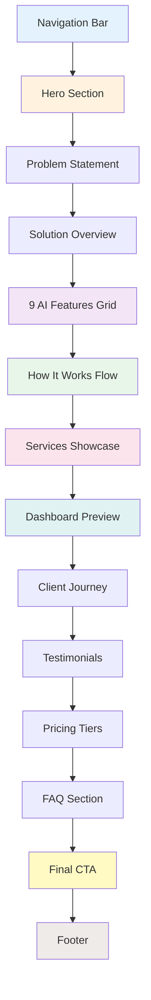
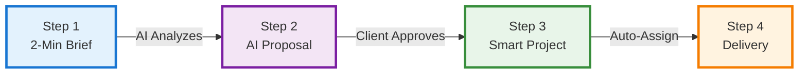
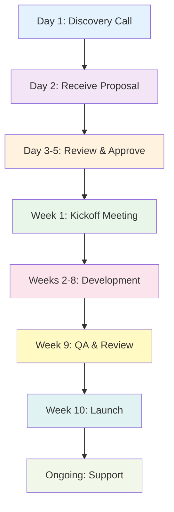
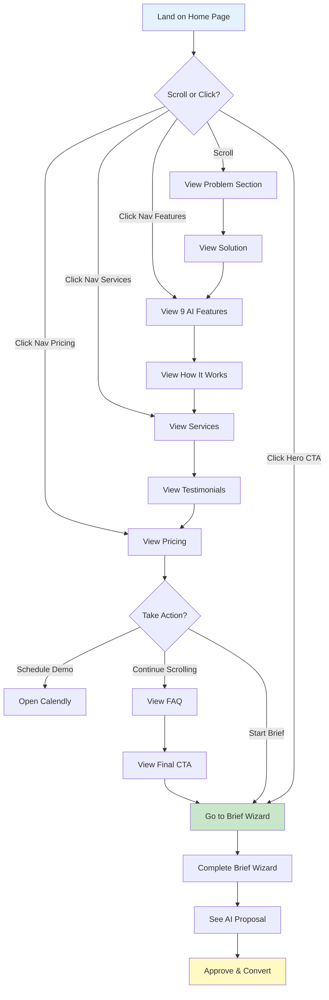

# 11. Home Page V6 — Sales Intelligence OS

**Route:** `/`  
**Design System:** Calm Luxury + Glassmorphism + Motion Animations

---

## Progress Tracker

### Design Phase
- [ ] Wireframe all 12 sections
- [ ] Source hero images (Unsplash)
- [ ] Design glassmorphism cards
- [ ] Create animation specifications
- [ ] Design AI feature icons
- [ ] Create flow chart diagrams

### Content Phase
- [ ] Write hero headline & subheadline
- [ ] Write all section copy (12 sections)
- [ ] Create CTA microcopy
- [ ] Write feature descriptions
- [ ] Create testimonial content
- [ ] Write pricing tier details

### Development Phase
- [ ] Build navbar with scroll behavior
- [ ] Implement hero section with animations
- [ ] Create AI features grid
- [ ] Build services showcase
- [ ] Implement flow charts (Mermaid/SVG)
- [ ] Add scroll-triggered animations
- [ ] Create glassmorphism effects
- [ ] Build footer with all links
- [ ] Mobile responsive optimization
- [ ] Performance optimization (lazy load)

### Testing Phase
- [ ] Cross-browser testing
- [ ] Mobile responsiveness check
- [ ] Animation performance audit
- [ ] Accessibility audit (WCAG 2.1 AA)
- [ ] SEO optimization
- [ ] Load time optimization (<3s)

---

## Page Structure Map



---

## Section-by-Section Breakdown

### 1️⃣ Navigation Bar

**Position:** Fixed top, glassmorphism background on scroll  
**Height:** 80px (desktop), 64px (mobile)

#### Content Structure
```
┌─ NAVBAR ──────────────────────────────────────────────────┐
│                                                            │
│  [LOGO]  Features  Services  Pricing  Docs  [Try Free]   │
│                                                            │
└────────────────────────────────────────────────────────────┘
```

#### Elements

**Left Side:**
- **Logo:** "Sun AI" with sun icon
- **Brand:** "Sales Intelligence OS"

**Center Navigation:**
- Features (dropdown)
  - 9 AI Features
  - Dashboard System
  - Intelligence OS
- Services (dropdown)
  - AI Chatbot Development
  - Web Development
  - WhatsApp Integration
  - Consulting
- Pricing (anchor link)
- Documentation (link to /docs)

**Right Side:**
- **CTA Button:** "Try Free" → `/app/brief-wizard`
- **Login Link:** "Sign In" → `/login`

#### Behavior
- **Initial:** Transparent background, white text
- **On Scroll (100px):** Glassmorphism background (blur + opacity), shadow appears
- **Active Link:** Underline animation (left to right)
- **Hover:** Smooth color transition (300ms)

#### Animation
- Logo fade-in from top (0.8s delay)
- Nav links stagger fade-in (each 0.1s apart)
- CTA button scale-in (1s delay)
- Scroll: background blur transition (400ms ease)

---

### 2️⃣ Hero Section

**Height:** 100vh (full viewport)  
**Background:** Gradient mesh (purple to blue to teal)

#### Content

**Headline (H1):**
> "Sales Intelligence That Thinks Like Your Best Closer"

**Subheadline (H2):**
> "AI-powered CRM that analyzes every call, scores every lead, and architects post-call actions—so you close deals faster with zero manual data entry."

**Value Propositions (3 Pills):**
- ⚡ **Zero Data Entry** — AI extracts everything
- 🎯 **Smart Lead Scoring** — Know who to call first
- 🤖 **Post-Call Actions** — AI suggests next steps

**Primary CTA:**
- Button: "Start Your AI Brief" → `/app/brief-wizard`
- Subtext: "Free forever • No credit card • 2-minute setup"

**Secondary CTA:**
- Link: "Watch 2-min Demo" → Modal with video

#### Visuals

**Hero Image:**
- Type: Dashboard screenshot mockup
- Subject: Intelligence OS with call analysis + lead scoring
- Style: Floating card with glassmorphism, subtle shadow
- Placement: Right side (60% width), slight tilt (2deg)
- Image Source: Unsplash query "modern dashboard analytics"

**Background Elements:**
- Gradient mesh animation (slow morph, 20s loop)
- Floating geometric shapes (subtle, low opacity)
- Light particles drifting up (canvas animation)

#### Animations

**On Page Load:**
1. Headline: Fade-in + slide up (0-0.6s)
2. Subheadline: Fade-in + slide up (0.3-0.9s)
3. Pills: Stagger fade-in left to right (0.6-1.2s)
4. CTA buttons: Scale-in (0.9-1.5s)
5. Dashboard mockup: Fade-in + slide from right (1.2-2s)

**Continuous:**
- Background gradient slow morph
- Dashboard mockup subtle float (up/down 10px, 4s ease-in-out)
- Particle animation loop

**Interaction:**
- CTA button: Hover lift + glow effect
- Pills: Hover scale 1.05
- Dashboard mockup: Hover slight zoom (1.02x)

---

### 3️⃣ Problem Statement

**Background:** White with subtle texture  
**Height:** Auto (600px typical)

#### Content

**Section Label:**
> "The Problem"

**Headline (H2):**
> "Sales Teams Are Drowning in Manual Work"

**Pain Points (3 Columns):**

**Column 1: Manual Data Entry**
- Icon: ⏱️ Clock with X
- Stat: "4.5 hours/week"
- Description: "Sales reps spend nearly half a day every week manually logging call notes, updating CRM fields, and copying information between systems."

**Column 2: Lead Qualification Guesswork**
- Icon: 🎲 Dice
- Stat: "58% mis-scored"
- Description: "Without AI scoring, sales teams waste time on low-intent leads while high-value opportunities go cold."

**Column 3: Lost Action Items**
- Icon: 📝 Paper with lines crossed out
- Stat: "37% forgotten"
- Description: "Post-call action items get lost in notes, emails, and Slack threads. Critical follow-ups slip through the cracks."

#### Visuals

**Images:**
- Column 1: Photo of frustrated person at laptop (Unsplash: "stressed office worker")
- Column 2: Photo of confused businessperson (Unsplash: "business confusion")
- Column 3: Photo of messy desk with papers (Unsplash: "cluttered desk")

**Style:**
- Grayscale images with red accent overlay
- Rounded corners (16px)
- Subtle shadow

#### Animations

**On Scroll Into View:**
- Section label: Fade-in + slide up
- Headline: Fade-in + slide up (0.2s delay)
- Columns: Stagger slide-up from bottom (0.1s apart)
- Stats: Count-up animation (1.5s duration)

**Continuous:**
- Icons: Gentle pulse (2s loop)

---

### 4️⃣ Solution Overview

**Background:** Light gradient (purple-blue, 5deg)  
**Height:** Auto (700px typical)

#### Content

**Section Label:**
> "The Solution"

**Headline (H2):**
> "An AI Operating System for Sales Intelligence"

**Subheadline:**
> "Luxury AI CRM transforms every sales interaction into actionable intelligence with zero manual work."

**Solution Pillars (4 Cards):**

**Card 1: Post-Call Action Architect**
- Icon: 🎯 Target with sparkles
- Title: "Post-Call Action Architect"
- Description: "AI analyzes every sales call, extracts key moments, suggests follow-up sequences, and drafts personalized emails—automatically."
- Benefit Tag: "Save 3h/day"

**Card 2: Natural Language Command Bar**
- Icon: 💬 Chat bubble with lightning
- Title: "Natural Language Command Bar"
- Description: "Ask your CRM anything in plain English: 'Show hot leads from last week' or 'What's my pipeline value?' Instant answers, zero clicks."
- Benefit Tag: "10x faster"

**Card 3: AI Lead Qualifier**
- Icon: 🔥 Flame with score
- Title: "AI Lead Qualifier"
- Description: "Machine learning scores every lead based on budget, timeline, engagement, and 50+ intent signals. Focus on what matters."
- Benefit Tag: "+40% close rate"

**Card 4: Intelligent Dashboards**
- Icon: 📊 Graph trending up
- Title: "Intelligent Dashboards"
- Description: "Real-time health scores, risk warnings, and optimization suggestions for every project, lead, and task. Proactive, not reactive."
- Benefit Tag: "Zero surprises"

#### Visuals

**Card Design:**
- Glassmorphism background (frosted glass effect)
- Gradient border (subtle, shifts on hover)
- Icon in gradient circle
- Drop shadow (soft)

**Background Elements:**
- Diagonal lines (subtle grid pattern)
- Floating orbs (low opacity, slow drift)

#### Animations

**On Scroll Into View:**
- Section label + headline: Fade-in
- Cards: Stagger slide-in from left (0.15s apart)
- Benefit tags: Slide-in from right (0.5s delay after card)

**Interaction:**
- Card hover: Lift up 8px, increase shadow, border glow
- Icon hover: Rotate 5deg + scale 1.1
- Benefit tag hover: Background pulse

---

### 5️⃣ 9 AI Features Grid

**Background:** White  
**Height:** Auto (1200px typical)

#### Content

**Section Label:**
> "AI Features"

**Headline (H2):**
> "Nine AI Features. Zero Manual Work."

**Subheadline:**
> "Every feature is designed to eliminate busywork and amplify your sales intelligence."

**Features Grid (3×3):**

**Row 1: Intelligence & Analysis**

1. **Post-Call Action Architect**
   - Icon: 🎬 Clapperboard
   - Status: 🔴 Not Implemented (Mock Data)
   - Description: "Analyzes sales calls, extracts action items, suggests follow-ups"
   - AI Model Needed: GPT-4 + Whisper transcription
   
2. **Natural Language Command Bar**
   - Icon: ⚡ Lightning bolt in speech bubble
   - Status: 🔴 Not Implemented (Mock Data)
   - Description: "Query CRM with plain English, get instant insights"
   - AI Model Needed: GPT-4 with function calling

3. **Sentiment Analysis**
   - Icon: 😊 Emoji gradient
   - Status: 🔴 Not Implemented (Mock Data)
   - Description: "Detect client satisfaction in calls and messages"
   - AI Model Needed: Custom sentiment classifier

**Row 2: Lead & Project Management**

4. **AI Lead Scoring**
   - Icon: 🎯 Target with numbers
   - Status: 🔴 Not Implemented (Mock Data)
   - Description: "Score leads 0-100 based on intent, budget, timeline"
   - AI Model Needed: ML scoring model (50+ signals)

5. **Project Health Monitoring**
   - Icon: 💚 Heart with pulse
   - Status: 🔴 Not Implemented (Mock Data)
   - Description: "Real-time health scores, risk detection, timeline predictions"
   - AI Model Needed: Multi-factor analysis algorithm

6. **Smart Task Assignment**
   - Icon: 🎲 Brain with checklist
   - Status: 🔴 Not Implemented (Mock Data)
   - Description: "Auto-assign tasks by skill, workload, and availability"
   - AI Model Needed: Matching algorithm + capacity analysis

**Row 3: Automation & Optimization**

7. **Auto Proposal Generation**
   - Icon: 📄 Document with sparkles
   - Status: 🟡 Partial (Templates Only)
   - Description: "Generate custom proposals from brief wizard answers"
   - AI Model Needed: GPT-4 with custom templates

8. **Service Price Optimization**
   - Icon: 💰 Money with trend arrow
   - Status: 🔴 Not Implemented (Mock Data)
   - Description: "Suggests pricing adjustments based on demand and margin"
   - AI Model Needed: Pricing optimization algorithm

9. **Semantic Search**
   - Icon: 🔍 Magnifying glass with AI
   - Status: 🔴 Not Implemented (Mock Data)
   - Description: "Search projects, leads, files by meaning, not keywords"
   - AI Model Needed: Vector embeddings + semantic search

#### Visuals

**Feature Card Design:**
- White background with gradient border
- Icon at top (64px, gradient fill)
- Status badge (color-coded: Red/Yellow/Green)
- Title (H3)
- Description (body text)
- "AI Model" chip (technical detail)

**Layout:**
- Grid: 3 columns desktop, 2 tablet, 1 mobile
- Gap: 32px between cards
- Card size: Equal height (400px min)

#### Animations

**On Scroll Into View:**
- Grid rows: Stagger fade-in (row by row, 0.2s apart)
- Cards within row: Slide-in from bottom (0.1s stagger)

**Interaction:**
- Card hover: Lift 4px, border glow intensifies
- Status badge: Pulse if "Not Implemented"
- Icon: Gentle rotate on hover

**Status Indicators:**
- 🔴 Red: Not Implemented → Subtle shake animation
- 🟡 Yellow: Partial → Gentle pulse
- 🟢 Green: Complete → Checkmark bounce

---

### 6️⃣ How It Works Flow

**Background:** Gradient (blue to purple diagonal)  
**Height:** Auto (800px typical)

#### Content

**Section Label:**
> "How It Works"

**Headline (H2):**
> "From Brief to Launch in 4 Simple Steps"

**Flow Chart (Horizontal):**



**Step Details:**

**Step 1: 2-Minute Brief**
- Visual: Screenshot of brief wizard
- Description: "Answer 8 simple questions about your project goals, budget, and timeline. No tech knowledge required."
- Time: "~2 minutes"
- User Action: "Fill brief wizard"

**Step 2: AI Generates Proposal**
- Visual: Screenshot of proposal document
- Description: "AI creates a custom proposal with timeline, deliverables, pricing, and requirements—instantly editable."
- Time: "~30 seconds"
- AI Action: "GPT-4 generates content"

**Step 3: Smart Project Setup**
- Visual: Screenshot of project dashboard
- Description: "Upon approval, AI creates project, generates tasks, assigns team, and sets up tracking—automatically."
- Time: "~10 seconds"
- AI Action: "Auto-create workflow"

**Step 4: Intelligent Delivery**
- Visual: Screenshot of client dashboard
- Description: "Team executes with AI monitoring health, detecting risks, and suggesting optimizations in real-time."
- Time: "6-12 weeks"
- AI Action: "Continuous monitoring"

#### Visuals

**Flow Design:**
- Large step numbers in gradient circles
- Connecting arrows with gradient stroke
- Screenshot mockups in device frames (slight tilt)
- Time badges (pill shape, glassmorphism)

**Background:**
- Diagonal gradient overlay
- Subtle grid pattern
- Floating code symbols (low opacity)

#### Animations

**On Scroll Into View:**
- Flow chart: Draw arrows left to right (2s)
- Step cards: Fade-in + slide from bottom (stagger 0.3s)
- Screenshots: Scale-in (0.8 to 1.0) with slide

**Interaction:**
- Step hover: Lift card, glow effect
- Screenshot hover: Zoom 1.05x
- Arrow hover: Pulse glow

---

### 7️⃣ Services Showcase

**Background:** Dark navy with stars (subtle)  
**Height:** Auto (900px typical)  
**Text Color:** White

#### Content

**Section Label:**
> "Services"

**Headline (H2):**
> "Luxury AI Development Services"

**Subheadline:**
> "Full-stack AI solutions with executive-grade design and zero-compromise quality."

**Services Grid (2×2):**

**Service 1: AI Chatbot Development**
- Icon: 🤖 Robot face
- Title: "AI Chatbot Development"
- Description: "Custom conversational AI with NLP, multi-channel support (web, WhatsApp, SMS), CRM integration, and analytics dashboard."
- Deliverables: 8 items
- Timeline: "6-8 weeks"
- Pricing: "$15,000 - $30,000"
- Case Study Link: "View Acme Corp Case Study →"

**Service 2: AI Web Development**
- Icon: 🌐 Globe with circuit
- Title: "AI Web Development"
- Description: "Full-stack web applications with React, Next.js, AI integrations, Supabase backend, and calm luxury design system."
- Deliverables: 12 items
- Timeline: "8-12 weeks"
- Pricing: "$25,000 - $50,000"
- Case Study Link: "View TechNova Case Study →"

**Service 3: WhatsApp Business Integration**
- Icon: 💚 WhatsApp logo stylized
- Title: "WhatsApp Business Integration"
- Description: "AI-powered WhatsApp automation with template messages, chatbot flows, CRM sync, and compliance handling."
- Deliverables: 6 items
- Timeline: "4-6 weeks"
- Pricing: "$8,000 - $15,000"
- Case Study Link: "View Urban Realty Case Study →"

**Service 4: AI Consulting & Strategy**
- Icon: 🎯 Compass with AI
- Title: "AI Consulting & Strategy"
- Description: "AI transformation roadmap, tool selection, workflow automation design, and implementation planning for sales teams."
- Deliverables: 5 items
- Timeline: "2-4 weeks"
- Pricing: "$5,000 - $12,000"
- Case Study Link: "Schedule Strategy Call →"

#### Visuals

**Service Card Design:**
- Glassmorphism (white 10% opacity, backdrop blur)
- Gradient border (gold/purple)
- Large icon at top (gradient fill)
- Pricing in highlighted badge
- Hover: Reveal full deliverables list

**Images:**
- Service 1: Unsplash "chatbot interface"
- Service 2: Unsplash "modern web design"
- Service 3: Unsplash "whatsapp business"
- Service 4: Unsplash "business strategy meeting"

**Background:**
- Dark navy gradient
- Subtle star field (twinkling animation)
- Glowing orbs (purple/blue, slow drift)

#### Animations

**On Scroll Into View:**
- Stars: Twinkle-in (stagger across screen)
- Service cards: Slide-in from sides (alternating left/right)
- Icons: Rotate-in with scale

**Interaction:**
- Card hover: Lift 12px, border glow intensifies, expand height to show full deliverables
- Icon hover: Gentle float up/down
- Case study link: Underline draw left to right

---

### 8️⃣ Dashboard Preview

**Background:** Light gray with gradient accent  
**Height:** Auto (1000px typical)

#### Content

**Section Label:**
> "Dashboard System"

**Headline (H2):**
> "Three-Panel Intelligence Architecture"

**Subheadline:**
> "Left = Context · Main = Work · Right = Intelligence"

**Dashboard Mockup:**
- Full-width screenshot of three-panel layout
- Interactive hotspots (click to explore sections)

**Three Features Breakdown:**

**Left Panel: Context & Navigation**
- Icon: 🗂️ Folder tree
- Description: "Project switcher, smart filters, saved views, quick actions. Always know where you are."
- Highlight: "280px fixed width"

**Main Panel: Human-First Work**
- Icon: ✏️ Pencil on paper
- Description: "Editable proposals, interactive timelines, requirement lists, file management. Your workspace."
- Highlight: "Fluid width, responsive"

**Right Panel: AI Intelligence**
- Icon: 🤖 Robot brain
- Description: "Health scores, risk warnings, next best actions, optimization suggestions, contextual AI chat."
- Highlight: "320px fixed width"

**Dashboard Types:**
- CRM Leads Dashboard
- Projects Dashboard
- Services Dashboard
- Tasks Dashboard
- Client Dashboard
- Intelligence OS

#### Visuals

**Dashboard Screenshot:**
- Type: Full application screenshot
- Style: Browser frame mockup with glassmorphism
- Placement: Center, large (80% width)
- Annotations: Hotspot markers with tooltips
- Image Source: Actual app screenshot or high-fidelity mockup

**Interactive Zones:**
- Hover over left panel → Highlight + tooltip
- Hover over main panel → Highlight + tooltip
- Hover over right panel → Highlight + tooltip

#### Animations

**On Scroll Into View:**
- Dashboard screenshot: Fade-in + scale from 0.9 to 1.0 (1.5s)
- Hotspots: Stagger pulse-in (0.2s apart)
- Feature cards: Slide-in from bottom (0.3s stagger)

**Interaction:**
- Hotspot hover: Glow + tooltip slide-in
- Feature card hover: Lift + border glow
- Dashboard screenshot hover: Subtle zoom 1.02x

**Continuous:**
- Hotspots: Gentle pulse (2s loop)

---

### 9️⃣ Client Journey

**Background:** White with subtle pattern  
**Height:** Auto (700px typical)

#### Content

**Section Label:**
> "Client Journey"

**Headline (H2):**
> "What Clients Experience"

**Journey Timeline (Vertical):**



**Journey Phase Details:**

**Phase 1: Discovery (Day 1)**
- What happens: "30-minute call to understand goals, challenges, and vision"
- Client action: "Share business context"
- AI action: "Records call, extracts requirements"

**Phase 2: Proposal (Day 2)**
- What happens: "Receive custom AI-generated proposal with timeline, deliverables, pricing"
- Client action: "Review proposal, ask questions"
- AI action: "Tracks engagement, suggests modifications"

**Phase 3: Approval (Days 3-5)**
- What happens: "Sign proposal, schedule kickoff, provide access"
- Client action: "Approve and sign"
- AI action: "Auto-creates project, assigns team"

**Phase 4: Kickoff (Week 1)**
- What happens: "Requirements workshop, design kickoff, timeline confirmation"
- Client action: "Provide assets, feedback"
- AI action: "Generates tasks, tracks progress"

**Phase 5: Development (Weeks 2-8)**
- What happens: "Weekly check-ins, milestone deliveries, feedback cycles"
- Client action: "Review deliverables, provide feedback"
- AI action: "Monitors health, detects risks, suggests optimizations"

**Phase 6: QA (Week 9)**
- What happens: "Testing, bug fixes, final revisions"
- Client action: "User acceptance testing"
- AI action: "Tracks issues, prioritizes fixes"

**Phase 7: Launch (Week 10)**
- What happens: "Deployment, training, handoff documentation"
- Client action: "Go live, celebrate"
- AI action: "Post-launch monitoring"

**Phase 8: Support (Ongoing)**
- What happens: "30-day bug fixes, ongoing support packages available"
- Client action: "Use product, report issues"
- AI action: "Analyzes usage, suggests improvements"

#### Visuals

**Timeline Design:**
- Vertical timeline with gradient line
- Phase cards on alternating sides
- Icons for each phase (gradient circles)
- Dotted connectors with animation

**Images:**
- Phase 1: Unsplash "business video call"
- Phase 5: Unsplash "developer working"
- Phase 7: Unsplash "celebration team"

#### Animations

**On Scroll Into View:**
- Timeline line: Draw from top to bottom (2s)
- Phase cards: Stagger slide-in (alternating left/right, 0.2s apart)
- Icons: Scale-in with bounce

**Continuous:**
- Timeline dots: Pulse in sequence (loop)

---

### 🔟 Testimonials

**Background:** Light purple gradient  
**Height:** Auto (600px typical)

#### Content

**Section Label:**
> "Testimonials"

**Headline (H2):**
> "Trusted by Forward-Thinking Teams"

**Testimonial Cards (3):**

**Testimonial 1:**
- Quote: "The AI proposal generator saved us 6 hours per lead. We've closed 3 deals in the first month that we would have lost to slow follow-up."
- Name: "Sarah Chen"
- Title: "CEO, TechNova AI"
- Company Logo: TechNova
- Rating: ⭐⭐⭐⭐⭐ 5/5
- Metric: "+40% close rate"

**Testimonial 2:**
- Quote: "Post-call action architect is magic. Every sales call automatically turns into a perfect follow-up sequence. Our team is 3x more productive."
- Name: "Marcus Rodriguez"
- Title: "VP Sales, Acme Corp"
- Company Logo: Acme
- Rating: ⭐⭐⭐⭐⭐ 5/5
- Metric: "3x productivity"

**Testimonial 3:**
- Quote: "The natural language command bar changed how we use our CRM. Instead of clicking through 5 screens, we just ask questions. It's incredible."
- Name: "Emily Watson"
- Title: "Sales Director, Urban Realty"
- Company Logo: Urban Realty
- Rating: ⭐⭐⭐⭐⭐ 5/5
- Metric: "10x faster queries"

#### Visuals

**Card Design:**
- White background, rounded corners
- Large quote marks (decorative)
- Avatar photo (circular, 80px)
- Company logo (grayscale)
- Metric badge (gradient background)

**Layout:**
- 3 columns desktop
- Carousel on mobile
- Equal height cards

#### Animations

**On Scroll Into View:**
- Cards: Stagger fade-in + slide up (0.2s apart)
- Quote marks: Scale-in
- Avatars: Fade-in with slight zoom

**Interaction:**
- Card hover: Lift 6px, subtle shadow increase
- Quote marks: Color shift on hover

**Mobile:**
- Auto-carousel with dots (5s interval)
- Swipe gesture enabled

---

### 1️⃣1️⃣ Pricing Tiers

**Background:** White  
**Height:** Auto (800px typical)

#### Content

**Section Label:**
> "Pricing"

**Headline (H2):**
> "Transparent Pricing. No Surprises."

**Subheadline:**
> "Choose the tier that matches your needs. All tiers include AI features."

**Pricing Table (3 Tiers):**

**Tier 1: Starter**
- Price: "$15,000 - $25,000"
- Ideal For: "Small businesses, MVPs, single features"
- Timeline: "4-6 weeks"
- Deliverables:
  - ✅ AI Chatbot OR WhatsApp Integration
  - ✅ Basic CRM setup
  - ✅ Up to 3 integrations
  - ✅ Mobile responsive design
  - ✅ 30-day support
  - ❌ Custom workflows
  - ❌ Advanced AI features
  - ❌ White-label
- CTA: "Start Brief" → `/app/brief-wizard`
- Badge: "Most Popular"

**Tier 2: Professional**
- Price: "$25,000 - $45,000"
- Ideal For: "Growing teams, full platforms, multiple features"
- Timeline: "8-12 weeks"
- Deliverables:
  - ✅ Full AI CRM platform
  - ✅ AI Chatbot + WhatsApp + SMS
  - ✅ Unlimited integrations
  - ✅ Custom workflows
  - ✅ Advanced AI (lead scoring, sentiment)
  - ✅ Dashboard system (3-panel)
  - ✅ 90-day support
  - ❌ White-label
- CTA: "Schedule Call" → Calendly
- Badge: "Best Value"

**Tier 3: Enterprise**
- Price: "$50,000+"
- Ideal For: "Large organizations, white-label, complex systems"
- Timeline: "12-16 weeks"
- Deliverables:
  - ✅ Everything in Professional
  - ✅ White-label solution
  - ✅ Custom AI model training
  - ✅ Dedicated project manager
  - ✅ Priority support (24/7)
  - ✅ SLA guarantees
  - ✅ Ongoing maintenance
  - ✅ Team training
- CTA: "Contact Sales" → `/contact`
- Badge: "Premium"

#### Visuals

**Tier Card Design:**
- White background with gradient border
- Badge at top (gradient background)
- Large price (bold, gradient text)
- Checkmark/X icons (color-coded)
- CTA button (gradient fill)
- Hover: Card lifts, border glows

**Layout:**
- 3 columns (equal width)
- Middle card (Professional) elevated 20px
- Gap: 24px

#### Animations

**On Scroll Into View:**
- Cards: Stagger slide-up (0.15s apart)
- Middle card: Slide-up + scale 1.05 (emphasis)
- Checkmarks: Stagger check-in animation (fast)

**Interaction:**
- Card hover: Lift 8px, border glow
- CTA button: Scale 1.05 + glow
- Price: Gentle pulse on hover

---

### 1️⃣2️⃣ FAQ Section

**Background:** Light gray  
**Height:** Auto (700px typical)

#### Content

**Section Label:**
> "FAQ"

**Headline (H2):**
> "Frequently Asked Questions"

**Questions (8):**

**Q1: How does the AI proposal generation work?**
A: "You fill out an 8-question brief wizard (~2 minutes). Our AI analyzes your answers and generates a custom proposal with timeline, deliverables, pricing, and requirements. You can edit any section before sending to your client."

**Q2: What AI models do you use?**
A: "We use OpenAI GPT-4 for text generation, Whisper for transcription, and custom ML models for lead scoring and sentiment analysis. All data is encrypted and never used for training."

**Q3: Can I white-label the CRM for my agency?**
A: "Yes, our Enterprise tier includes full white-labeling: custom domain, branding, logo, and colors. You can resell the CRM to your clients under your brand."

**Q4: How long does implementation take?**
A: "Starter projects: 4-6 weeks. Professional: 8-12 weeks. Enterprise: 12-16 weeks. We provide weekly updates and milestone deliveries throughout."

**Q5: Do you integrate with existing tools?**
A: "Yes. We integrate with popular tools like Slack, Google Calendar, Stripe, HubSpot, Salesforce, and more. Custom integrations are included in Professional and Enterprise tiers."

**Q6: What happens after the 30/90-day support period?**
A: "You can purchase ongoing support packages starting at $500/month. This includes bug fixes, feature updates, and priority support."

**Q7: Is my data secure?**
A: "Absolutely. We use Supabase with row-level security, encrypted at rest and in transit. SOC 2 Type II compliance available for Enterprise tier. We never sell or share your data."

**Q8: Can I try before buying?**
A: "Yes. Start a free brief and see the AI-generated proposal. No credit card required. You only pay if you decide to move forward."

#### Visuals

**FAQ Design:**
- Accordion-style (click to expand)
- Question: Bold text with down arrow icon
- Answer: Regular text, expandable area
- Divider lines between items

**Layout:**
- 2 columns desktop (4 questions each)
- 1 column mobile
- Max width: 1000px

#### Animations

**On Scroll Into View:**
- FAQ items: Stagger fade-in (0.1s apart)

**Interaction:**
- Question click: Rotate arrow 180deg, slide answer down (300ms ease)
- Question hover: Background color shift (light blue)

---

### 1️⃣3️⃣ Final CTA

**Background:** Gradient (purple to blue, diagonal)  
**Height:** 500px  
**Text Color:** White

#### Content

**Headline (H1):**
> "Ready to 10x Your Sales Intelligence?"

**Subheadline:**
> "Start your AI-powered brief in 2 minutes. See a custom proposal in 30 seconds. Zero commitment."

**CTA Buttons:**
- **Primary:** "Start Your Free Brief" → `/app/brief-wizard`
  - Size: Large (60px height)
  - Style: White background, purple text, glow on hover
  
- **Secondary:** "Schedule a Demo" → Calendly
  - Size: Large (60px height)
  - Style: Transparent border, white text, hover fill

**Trust Signals:**
- ✅ No credit card required
- ✅ Free forever plan available
- ✅ 2-minute setup
- ✅ See proposal instantly

#### Visuals

**Background:**
- Gradient mesh animation
- Floating particles (white, low opacity)
- Geometric shapes (subtle)

**Layout:**
- Center-aligned
- Max width: 700px
- Buttons side-by-side (desktop), stacked (mobile)

#### Animations

**On Scroll Into View:**
- Headline: Fade-in + slide up
- Subheadline: Fade-in + slide up (0.2s delay)
- Buttons: Scale-in (0.4s delay, slight bounce)
- Trust signals: Stagger fade-in (0.1s apart)

**Continuous:**
- Background gradient: Slow morph
- Particles: Drift upward
- Buttons: Subtle pulse (2s loop)

**Interaction:**
- Primary button: Lift + glow intensify
- Secondary button: Fill background white, invert text

---

### 1️⃣4️⃣ Footer

**Background:** Dark navy (#0a1628)  
**Height:** Auto (400px typical)  
**Text Color:** Light gray (#a0aec0)

#### Content Structure

**Footer Layout (4 Columns):**

```
┌─ FOOTER ──────────────────────────────────────────────────────┐
│                                                                │
│  COMPANY          PRODUCT          RESOURCES       LEGAL       │
│                                                                │
│  About Us         Features         Documentation  Terms       │
│  Our Story        Services         API Docs       Privacy     │
│  Team             Pricing          Blog                       │
│  Careers          Changelog        Help Center                │
│  Contact          Roadmap          Status Page                │
│                                                                │
│  ────────────────────────────────────────────────────────────  │
│                                                                │
│  [Logo] Sun AI — Sales Intelligence OS                        │
│                                                                │
│  © 2025 Sun AI. All rights reserved.                          │
│                                                                │
│  [Twitter] [LinkedIn] [GitHub] [YouTube]                      │
│                                                                │
└────────────────────────────────────────────────────────────────┘
```

#### Column Details

**Column 1: Company**
- About Us → `/about`
- Our Story → `/story`
- Team → `/team`
- Careers → `/careers`
- Contact → `/contact`

**Column 2: Product**
- Features → `/#features` (anchor)
- Services → `/#services` (anchor)
- Pricing → `/#pricing` (anchor)
- Changelog → `/changelog`
- Roadmap → `/roadmap`

**Column 3: Resources**
- Documentation → `/docs`
- API Docs → `/docs/api`
- Blog → `/blog`
- Help Center → `/help`
- Status Page → `/status`

**Column 4: Legal**
- Terms of Service (REMOVED per previous conversation)
- Privacy Policy (REMOVED per previous conversation)

Note: Legal links removed as requested in previous cleanup

#### Social Links
- Twitter/X → `https://twitter.com/sunai` (icon only)
- LinkedIn → `https://linkedin.com/company/sunai` (icon only)
- GitHub → `https://github.com/sunai` (icon only)
- YouTube → `https://youtube.com/sunai` (icon only)

#### Visuals

**Design:**
- Dark background with subtle texture
- Link hover: Underline + color shift to white
- Social icons: Circular gradient backgrounds
- Logo: Monochrome white version

**Layout:**
- 4 columns desktop (equal width)
- 2 columns tablet
- 1 column mobile (accordion)

#### Animations

**On Scroll Into View:**
- Columns: Stagger fade-in (0.1s apart)
- Social icons: Scale-in with bounce

**Interaction:**
- Link hover: Underline draw left to right
- Social icon hover: Scale 1.1 + glow
- Logo hover: Gentle glow

---

## User Journey Flow



---

## Page Performance Targets

### Load Time
- **First Contentful Paint:** <1.2s
- **Largest Contentful Paint:** <2.5s
- **Time to Interactive:** <3.5s
- **Total Page Load:** <5s

### Optimization Strategy
1. **Images:** WebP format, lazy load below fold, responsive srcset
2. **Animations:** CSS transforms (GPU accelerated), no layout shifts
3. **Code Splitting:** Load sections as user scrolls
4. **Fonts:** Preload critical fonts, font-display: swap
5. **Scripts:** Defer non-critical JS, async load third-party

### Accessibility
- **WCAG 2.1 AA Compliance**
- **Keyboard Navigation:** All interactive elements
- **Screen Readers:** Proper ARIA labels
- **Color Contrast:** Minimum 4.5:1
- **Focus States:** Visible on all clickable elements

---

## Responsive Breakpoints

| Breakpoint | Width | Layout Changes |
|------------|-------|----------------|
| **Mobile** | 320-767px | Single column, stacked sections, hamburger nav |
| **Tablet** | 768-1023px | 2-column grids, collapsible nav |
| **Laptop** | 1024-1439px | 3-column grids, full nav |
| **Desktop** | 1440px+ | Max width 1440px, centered |

---

## SEO Metadata

**Title Tag:**
> "Sales Intelligence OS | AI-Powered CRM with Zero Manual Work"

**Meta Description:**
> "Luxury AI CRM that analyzes sales calls, scores leads, and architects post-call actions automatically. Close deals faster with zero data entry. Free 2-minute brief."

**Keywords:**
- Sales intelligence
- AI CRM
- Post-call action architect
- Lead scoring AI
- Natural language CRM
- Sales automation
- AI proposal generator

**Open Graph:**
- og:title: "Sales Intelligence OS | AI-Powered CRM"
- og:description: Same as meta description
- og:image: Hero dashboard screenshot (1200x630px)
- og:type: website

---

**Last Updated:** Dec 27, 2025  
**Version:** 6.0  
**Status:** Design Specification Complete
