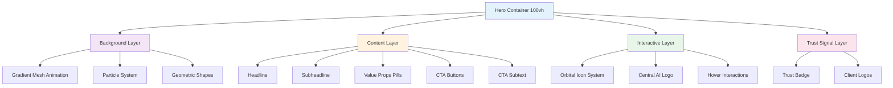

# 12. Hero Section V6 — Design Specification

**Route:** `/` (Home Page)  
**Component:** Hero Section  
**Design System:** Calm Luxury + Glassmorphism + Motion Animations  
**Viewport Height:** 100vh (full screen)

---

## Progress Tracker

### Phase 1: Design & Planning
- [ ] Complete wireframe layout
- [ ] Define color palette and gradients
- [ ] Specify typography hierarchy
- [ ] Design orbital icon system
- [ ] Create glassmorphism card specs
- [ ] Define animation timeline
- [ ] Source all images (Unsplash)
- [ ] Create mobile responsive layout

### Phase 2: Content Strategy
- [ ] Write headline (max 10 words)
- [ ] Write subheadline (max 25 words)
- [ ] Create 3 value proposition pills
- [ ] Write primary CTA copy
- [ ] Write secondary CTA copy
- [ ] Define trust signal content
- [ ] Write CTA subtext (micro-copy)

### Phase 3: Animation System
- [ ] Define page load sequence (0-3s)
- [ ] Specify orbital rotation logic
- [ ] Create particle system specs
- [ ] Define gradient mesh animation
- [ ] Specify hover interactions
- [ ] Define scroll behavior (parallax)
- [ ] Create loading states

### Phase 4: Development Ready
- [ ] Export all visual assets
- [ ] Document component structure
- [ ] Define state management
- [ ] Specify responsive breakpoints
- [ ] Create accessibility requirements
- [ ] Define performance budgets
- [ ] Document API integrations (if any)

### Phase 5: Quality Assurance
- [ ] Visual QA (design match)
- [ ] Animation performance test
- [ ] Cross-browser compatibility
- [ ] Mobile device testing
- [ ] Accessibility audit
- [ ] Load time optimization
- [ ] A/B test variants prepared

---

## Hero Section Architecture



---

## Layout Specification

### Desktop Layout (1440px+)

```
┌─────────────────────────────────────────────────────────────┐
│ HERO SECTION (100vh)                                        │
│                                                              │
│  ┌─ LEFT CONTENT ZONE (45%) ─────────────────────┐         │
│  │                                                 │         │
│  │  [BADGE] PRODUCTION-READY AI                   │         │
│  │                                                 │         │
│  │  Build Intelligent                             │         │
│  │  AI Products,                    ┌─────────────┼────┐    │
│  │  Agents                          │             │    │    │
│  │  & Automation                    │   ORBITAL   │    │    │
│  │                                  │   ICON      │    │    │
│  │  Sun AI designs and launches     │   SYSTEM    │    │    │
│  │  production-ready AI platforms,  │             │    │    │
│  │  automation systems, and multi-  │   [AI LOGO] │    │    │
│  │  agent solutions that transform  │             │    │    │
│  │  how teams work and scale.       │             │    │    │
│  │                                  │             │    │    │
│  │  ┌───────────────────────┐      └─────────────┼────┘    │
│  │  │ ⚡ Zero Data Entry    │                     │         │
│  │  │ 🎯 Smart Lead Scoring │                     │         │
│  │  │ 🤖 Post-Call Actions  │                     │         │
│  │  └───────────────────────┘                     │         │
│  │                                                 │         │
│  │  ┌──────────────────┐  ┌──────────────────┐   │         │
│  │  │ Start Your Project│  │ Talk to an Expert│   │         │
│  │  └──────────────────┘  └──────────────────┘   │         │
│  │                                                 │         │
│  │  Free forever • No credit card • 2-min setup   │         │
│  │                                                 │         │
│  └─────────────────────────────────────────────────┘         │
│                                                              │
│  ┌─ TRUST SIGNALS (Bottom) ─────────────────────┐           │
│  │  TRUSTED BY INNOVATIVE TEAMS                  │           │
│  │  [Logo] [Logo] [Logo] [Logo] [Logo]          │           │
│  └───────────────────────────────────────────────┘           │
│                                                              │
└─────────────────────────────────────────────────────────────┘
```

### Tablet Layout (768-1023px)

```
┌──────────────────────────────────────────┐
│ HERO SECTION (100vh)                     │
│                                           │
│  ┌─ CONTENT (Centered, 90%) ───────┐    │
│  │                                   │    │
│  │  [BADGE] PRODUCTION-READY AI     │    │
│  │                                   │    │
│  │  Build Intelligent               │    │
│  │  AI Products, Agents             │    │
│  │  & Automation                    │    │
│  │                                   │    │
│  │         ┌───────────┐            │    │
│  │         │  ORBITAL  │            │    │
│  │         │   ICON    │            │    │
│  │         │  SYSTEM   │            │    │
│  │         │ [AI LOGO] │            │    │
│  │         └───────────┘            │    │
│  │                                   │    │
│  │  Subheadline text (centered)     │    │
│  │                                   │    │
│  │  [Pills stacked vertically]      │    │
│  │                                   │    │
│  │  [Button] [Button]               │    │
│  │                                   │    │
│  │  Free forever • No card          │    │
│  │                                   │    │
│  └───────────────────────────────────┘    │
│                                           │
│  [Trust Logos - Horizontal scroll]       │
│                                           │
└──────────────────────────────────────────┘
```

### Mobile Layout (320-767px)

```
┌─────────────────────────┐
│ HERO (Auto height)      │
│                         │
│  [BADGE]               │
│                         │
│  Build Intelligent     │
│  AI Products,          │
│  Agents                │
│  & Automation          │
│                         │
│     ┌─────────┐        │
│     │ ORBITAL │        │
│     │  ICONS  │        │
│     │[AI LOGO]│        │
│     └─────────┘        │
│                         │
│  Subheadline text      │
│  (centered, smaller)   │
│                         │
│  ⚡ Zero Data Entry    │
│  🎯 Smart Scoring      │
│  🤖 Post-Call Actions  │
│                         │
│  [Primary Button]      │
│  [Secondary Button]    │
│                         │
│  Free • No card        │
│                         │
│  TRUSTED BY TEAMS      │
│  [Logo] [Logo]         │
│  [Logo] [Logo]         │
│                         │
└─────────────────────────┘
```

---

## Content Specifications

### Headline

**Text:**
> "Build Intelligent AI Products, Agents & Automation"

**Typography:**
- Font Family: `font-display` (from globals.css)
- Font Size: 72px (desktop), 56px (tablet), 40px (mobile)
- Font Weight: 700 (bold)
- Line Height: 1.1
- Letter Spacing: -0.02em (tight)
- Color: Navy `#0a1628` (Dark mode: White `#ffffff`)

**Gradient Treatment:**
- Apply gradient to "AI Products"
- Gradient: Linear 135deg
  - Start: `#667eea` (purple)
  - Middle: `#764ba2` (deep purple)
  - End: `#f093fb` (pink)
- Background Clip: Text
- Animation: Gradient position shift (subtle, 10s loop)

**Layout:**
- Max Width: 600px
- Text Align: Left (desktop), Center (mobile)
- Margin Bottom: 24px

---

### Badge (Top Label)

**Text:**
> "⚡ PRODUCTION-READY AI"

**Typography:**
- Font Family: `font-sans` (system font)
- Font Size: 12px
- Font Weight: 600 (semibold)
- Letter Spacing: 0.05em (wide)
- Text Transform: Uppercase
- Color: Purple `#667eea`

**Design:**
- Background: Glassmorphism
  - Color: `rgba(102, 126, 234, 0.1)`
  - Backdrop Blur: 12px
  - Border: 1px solid `rgba(102, 126, 234, 0.2)`
- Padding: 8px 16px
- Border Radius: 20px (pill shape)
- Display: Inline-block
- Margin Bottom: 16px

**Animation:**
- Fade-in from top (0-0.8s)
- Slight bounce at end (0.6-0.8s)

---

### Subheadline

**Text:**
> "Sun AI designs and launches production-ready AI platforms, automation systems, and multi-agent solutions that transform how teams work and scale."

**Typography:**
- Font Family: `font-sans`
- Font Size: 20px (desktop), 18px (tablet), 16px (mobile)
- Font Weight: 400 (regular)
- Line Height: 1.6
- Color: Gray `#4a5568` (Dark mode: `#a0aec0`)

**Layout:**
- Max Width: 560px
- Text Align: Left (desktop), Center (mobile)
- Margin Bottom: 32px

**Animation:**
- Fade-in + slide up (0.3-0.9s)

---

### Value Proposition Pills

**Design Pattern:**
Three horizontal pills (desktop), vertical stack (mobile)

**Pill 1: Zero Data Entry**
- Icon: ⚡ Lightning (gradient gold to yellow)
- Text: "Zero Data Entry"
- Subtext: "AI extracts everything"

**Pill 2: Smart Lead Scoring**
- Icon: 🎯 Target (gradient red to pink)
- Text: "Smart Lead Scoring"
- Subtext: "Know who to call first"

**Pill 3: Post-Call Actions**
- Icon: 🤖 Robot (gradient blue to purple)
- Text: "Post-Call Actions"
- Subtext: "AI suggests next steps"

**Pill Design:**
- Background: White with subtle shadow
- Border: 1px solid `#e2e8f0`
- Border Radius: 12px
- Padding: 16px 20px
- Display: Flex (icon + text vertical stack)
- Min Width: 160px

**Icon Style:**
- Size: 32px
- Margin Bottom: 8px

**Text Typography:**
- Font Size: 14px
- Font Weight: 600
- Color: Navy `#0a1628`

**Subtext Typography:**
- Font Size: 12px
- Font Weight: 400
- Color: Gray `#718096`

**Layout:**
- Gap: 16px between pills
- Flex Direction: Row (desktop), Column (mobile)

**Animation:**
- Stagger fade-in left to right (0.6-1.2s)
- Each pill 0.2s apart
- Slide-in from left with slight overshoot

**Interaction:**
- Hover: Scale 1.05, shadow increase
- Transition: 300ms ease-out

---

### CTA Buttons

**Primary Button: "Start Your Project"**

**Design:**
- Background: Navy `#0a1628` (Dark mode: White)
- Text Color: White (Dark mode: Navy)
- Font Size: 18px
- Font Weight: 600
- Padding: 18px 36px
- Border Radius: 12px
- Border: None
- Box Shadow: 0 4px 12px rgba(10, 22, 40, 0.2)
- Icon: Arrow right → (after text)

**Interaction:**
- Hover: Lift 4px, shadow intensify, icon slide right 4px
- Active: Scale 0.98
- Transition: All 300ms ease

**Animation:**
- Scale-in (0.9-1.5s)
- Slight bounce at end

---

**Secondary Button: "Talk to an Expert"**

**Design:**
- Background: Transparent
- Text Color: Navy `#0a1628`
- Font Size: 18px
- Font Weight: 600
- Padding: 18px 36px
- Border Radius: 12px
- Border: 2px solid `#e2e8f0`
- Icon: Message circle 💬 (before text)

**Interaction:**
- Hover: Background `#f7fafc`, border color `#cbd5e0`
- Active: Scale 0.98
- Transition: All 300ms ease

**Animation:**
- Scale-in (0.9-1.5s, 0.1s delay after primary)

---

**Button Layout:**
- Display: Flex row (desktop), Column (mobile)
- Gap: 16px
- Margin Top: 32px
- Margin Bottom: 16px

---

### CTA Subtext (Micro-copy)

**Text:**
> "Free forever • No credit card • 2-minute setup"

**Typography:**
- Font Size: 14px
- Font Weight: 400
- Color: Gray `#718096`
- Text Align: Left (desktop), Center (mobile)

**Layout:**
- Display: Inline
- Separator: Bullet • (middle dot)
- Margin Top: 16px

**Animation:**
- Fade-in (1.5-2s)

---

## Orbital Icon System

### Central AI Logo

**Design:**
- Type: Circle with gradient mesh
- Size: 320px diameter (desktop), 240px (tablet), 180px (mobile)
- Background: Radial gradient
  - Center: `rgba(102, 126, 234, 0.3)` (purple)
  - Edge: `rgba(102, 126, 234, 0.05)` (fade to transparent)
- Inner Logo: "AI" text
  - Font Size: 96px (desktop), 72px (tablet), 48px (mobile)
  - Font Weight: 700
  - Gradient Fill: Purple to blue
  - Dotted pattern overlay (halftone effect)

**Glassmorphism Effect:**
- Backdrop Blur: 24px
- Border: 1px solid `rgba(255, 255, 255, 0.3)`
- Box Shadow: 0 8px 32px rgba(102, 126, 234, 0.2)

**Animation:**
- Fade-in + scale (1.2-2s)
- Scale from 0.8 to 1.0
- Continuous subtle pulse (2s loop, scale 1.0 to 1.02)

---

### Orbiting Icons

**Icon List (8 total):**
1. **HELP** — Question mark in circle
2. **ANALYTICS** — Bar chart
3. **CLOUD** — Cloud upload
4. **AUTOMATIONS** — Workflow nodes
5. **INTEGRATIONS** — Puzzle pieces
6. **SOLUTIONS** — Light bulb
7. **AI AGENTS** — Robot head
8. **DATA** — Database

**Icon Design:**
- Container: Circle 64px diameter
- Background: White with glassmorphism
  - Color: `rgba(255, 255, 255, 0.9)`
  - Backdrop Blur: 12px
  - Border: 1px solid `rgba(102, 126, 234, 0.2)`
- Icon: 24px, gradient color (unique per icon)
- Label: 10px, uppercase, gray
- Shadow: 0 4px 12px rgba(0, 0, 0, 0.1)

**Orbital Path:**
- Type: Perfect circle (ellipse on mobile for space)
- Radius: 280px from center (desktop), 200px (tablet), 140px (mobile)
- Rotation: Clockwise continuous
- Speed: 60 seconds per full rotation
- Easing: Linear (constant speed)

**Icon Positions (Starting):**
- HELP: 0° (top)
- ANALYTICS: 45° (top-right)
- CLOUD: 90° (right)
- AUTOMATIONS: 135° (bottom-right)
- INTEGRATIONS: 180° (bottom)
- SOLUTIONS: 225° (bottom-left)
- AI AGENTS: 270° (left)
- DATA: 315° (top-left)

**Animation Logic:**

```javascript
// Rotation animation (Motion/React)
const orbitRotation = {
  rotate: [0, 360],
  transition: {
    duration: 60,
    repeat: Infinity,
    ease: "linear"
  }
};

// Icon counter-rotation (keep upright)
const iconCounterRotation = {
  rotate: [0, -360],
  transition: {
    duration: 60,
    repeat: Infinity,
    ease: "linear"
  }
};
```

**Interaction:**
- Hover on icon: Pause orbit, scale 1.15, show tooltip
- Click: Navigate to feature page
- Tooltip: Feature name + short description

**Gradient Colors per Icon:**
- HELP: Blue `#667eea` to Teal `#38b2ac`
- ANALYTICS: Purple `#764ba2` to Pink `#f093fb`
- CLOUD: Cyan `#00d4ff` to Blue `#667eea`
- AUTOMATIONS: Orange `#f57c00` to Yellow `#ffd54f`
- INTEGRATIONS: Green `#4caf50` to Teal `#009688`
- SOLUTIONS: Yellow `#ffd54f` to Orange `#ff9800`
- AI AGENTS: Purple `#9c27b0` to Pink `#e91e63`
- DATA: Blue `#2196f3` to Indigo `#3f51b5`

---

## Background Design System

### Layer 1: Gradient Mesh

**Type:** Animated gradient background

**Gradient Specification:**
- Type: Radial gradient mesh (3 focal points)
- Colors:
  - Point 1 (top-left): `#667eea` (purple) at 20%
  - Point 2 (center-right): `#764ba2` (deep purple) at 50%
  - Point 3 (bottom): `#f093fb` (pink) at 80%
- Blend Mode: Normal
- Opacity: 0.15 (very subtle)

**Animation:**
- Duration: 20 seconds loop
- Effect: Morph gradient focal points
- Movement: Slow drift (each point moves 100px radius)
- Easing: Ease-in-out

```javascript
// Gradient mesh animation keyframes
const gradientMesh = {
  backgroundPosition: [
    "0% 0%",
    "100% 100%",
    "0% 0%"
  ],
  transition: {
    duration: 20,
    repeat: Infinity,
    ease: "easeInOut"
  }
};
```

---

### Layer 2: Particle System

**Type:** Canvas-based floating particles

**Particle Specifications:**
- Count: 50 particles
- Size: 2-6px diameter
- Shape: Circle
- Color: White with opacity 0.2-0.5 (random)
- Distribution: Random across viewport

**Movement:**
- Direction: Upward drift
- Speed: 20-40px per second (random per particle)
- Horizontal Drift: ±10px sine wave
- Respawn: When particle exits top, respawn at bottom

**Animation Logic:**

```javascript
// Particle animation (canvas)
particles.forEach(particle => {
  particle.y -= particle.speed * deltaTime;
  particle.x += Math.sin(particle.y * 0.01) * particle.drift;
  particle.opacity = 0.2 + Math.sin(particle.y * 0.02) * 0.3;
  
  if (particle.y < 0) {
    particle.y = viewportHeight;
    particle.x = Math.random() * viewportWidth;
  }
});
```

**Performance:**
- Use `requestAnimationFrame` for smooth 60fps
- Offload to GPU when possible
- Pause when section not in viewport

---

### Layer 3: Geometric Shapes

**Type:** Floating SVG shapes (decorative)

**Shapes:**
1. **Large Circle** — 400px diameter, top-right, purple stroke, no fill
2. **Triangle** — 200px, bottom-left, pink stroke, no fill
3. **Square** — 150px, rotated 45deg, center-left, blue stroke, no fill

**Style:**
- Stroke Width: 2px
- Stroke Opacity: 0.1
- Fill: None
- Blur: 1px (soft edges)

**Animation:**
- Slow rotation (30s per full rotation)
- Gentle scale pulse (1.0 to 1.05, 8s loop)
- Opacity fade (0.05 to 0.15, 6s loop)

**Positioning:**
- Position: Absolute
- Z-index: Below content, above gradient

---

## Trust Signal Section

**Position:** Bottom of hero section (absolute bottom)

**Label:**
> "TRUSTED BY INNOVATIVE TEAMS"

**Label Typography:**
- Font Size: 11px
- Font Weight: 600
- Letter Spacing: 0.1em
- Text Transform: Uppercase
- Color: Gray `#a0aec0`
- Text Align: Center

**Client Logos:**
- Count: 5 logos
- Style: Grayscale (desaturate 100%)
- Opacity: 0.5
- Hover: Opacity 1.0, original color (if color version available)
- Size: Auto height 32px, max width 120px
- Gap: 40px between logos
- Layout: Flex row, centered

**Logo Examples:**
- Acme Corp
- TechNova AI
- Urban Realty
- HealthAI
- FinTech Solutions

**Desktop Layout:**
- Horizontal row, all visible

**Mobile Layout:**
- Horizontal scroll carousel
- Show 2.5 logos at a time
- Swipe gesture enabled

**Animation:**
- Fade-in (2.5-3s)
- Logos stagger left to right (0.1s apart)

---

## Page Load Animation Timeline

**Complete sequence from page load to ready state:**

```mermaid
gantt
    title Hero Section Load Animation Timeline
    dateFormat SSS
    axisFormat %Ss
    
    section Background
    Gradient mesh fade-in       :a1, 000, 800ms
    Particles start             :a2, 400, 1600ms
    Geometric shapes appear     :a3, 600, 1000ms
    
    section Content
    Badge slide from top        :b1, 000, 800ms
    Headline fade + slide       :b2, 000, 600ms
    Subheadline fade + slide    :b3, 300, 600ms
    Value pills stagger         :b4, 600, 600ms
    CTA buttons scale-in        :b5, 900, 600ms
    CTA subtext fade            :b6, 1500, 500ms
    
    section Interactive
    AI logo scale-in            :c1, 1200, 800ms
    Orbital icons appear        :c2, 1600, 400ms
    Orbital rotation starts     :c3, 2000, 200ms
    
    section Trust
    Trust label fade            :d1, 2500, 500ms
    Logos stagger               :d2, 2500, 800ms
```



**Total Animation Duration:** 3.3 seconds  
**User Can Interact:** After 1.5 seconds (CTAs ready)

---

## Responsive Breakpoint Specifications

### Desktop (1440px+)

**Layout:**
- Two-column: Left (content 45%) + Right (orbital 55%)
- Max Container Width: 1440px
- Padding: 80px horizontal

**Headline:**
- Font Size: 72px
- Max Width: 600px

**Orbital System:**
- Logo Size: 320px
- Orbit Radius: 280px
- Icon Size: 64px

---

### Laptop (1024-1439px)

**Layout:**
- Same two-column, tighter spacing
- Padding: 60px horizontal

**Headline:**
- Font Size: 64px
- Max Width: 540px

**Orbital System:**
- Logo Size: 280px
- Orbit Radius: 240px
- Icon Size: 56px

---

### Tablet (768-1023px)

**Layout:**
- Single column, centered
- Padding: 40px horizontal

**Headline:**
- Font Size: 56px
- Text Align: Center
- Max Width: 90%

**Orbital System:**
- Logo Size: 240px
- Orbit Radius: 200px
- Icon Size: 48px
- Position: Below headline, above subheadline

**Buttons:**
- Full width (stacked)
- Max Width: 400px

---

### Mobile (320-767px)

**Layout:**
- Single column, centered
- Padding: 24px horizontal
- Auto height (not 100vh)

**Headline:**
- Font Size: 40px
- Text Align: Center
- Max Width: 100%

**Orbital System:**
- Logo Size: 180px
- Orbit Radius: 140px
- Icon Size: 40px
- Icon Labels: Hidden (icons only)

**Value Pills:**
- Full width stacked
- Simplified design (icon + text only, no subtext)

**Buttons:**
- Full width stacked
- Padding: 16px 24px

**Trust Logos:**
- Horizontal scroll
- Show 2.5 logos

---

## Accessibility Requirements

### Keyboard Navigation
- [ ] Tab order: Badge → Headline → Pills → Primary CTA → Secondary CTA → Trust logos
- [ ] Focus states: 2px blue outline on all interactive elements
- [ ] Skip link: "Skip to main content" (hidden, shows on focus)

### Screen Readers
- [ ] Headline: `<h1>` tag with proper hierarchy
- [ ] Badge: `<span role="status">` for announcement
- [ ] Orbital icons: `aria-label` with descriptive text
- [ ] Buttons: Clear action-oriented text
- [ ] Decorative elements: `aria-hidden="true"`

### Color Contrast
- [ ] Headline on background: Minimum 7:1 (AAA)
- [ ] Subheadline on background: Minimum 4.5:1 (AA)
- [ ] Button text on background: Minimum 4.5:1 (AA)
- [ ] All interactive states meet AA standards

### Motion Preferences
- [ ] Respect `prefers-reduced-motion`
- [ ] If enabled: Disable orbital rotation, particle drift, gradient animation
- [ ] Keep fade-ins and button interactions (essential UX)

```css
@media (prefers-reduced-motion: reduce) {
  /* Disable non-essential animations */
  .orbital-system,
  .particle-system,
  .gradient-mesh {
    animation: none !important;
  }
}
```

---

## Performance Budget

### Load Metrics
- **First Contentful Paint:** <1.0s
- **Largest Contentful Paint (Headline):** <1.5s
- **Time to Interactive:** <2.5s
- **Cumulative Layout Shift:** <0.1

### Asset Optimization
- [ ] Hero background gradient: CSS-only (0kb)
- [ ] Orbital icons: SVG sprites (<10kb total)
- [ ] Trust logos: WebP format (<5kb each)
- [ ] Fonts: Preload display font, subset to used characters
- [ ] Animations: CSS transforms (GPU accelerated)

### Code Splitting
- [ ] Particle system: Load async after hero visible
- [ ] Orbital system: Lazy load if viewport width > 768px
- [ ] Trust logos: Load after 2s delay (non-critical)

---

## Success Criteria

### Design Quality
- [ ] Matches "Calm Luxury" aesthetic
- [ ] Glassmorphism applied consistently
- [ ] All gradients smooth and premium
- [ ] Typography hierarchy clear
- [ ] Visual balance between left/right

### User Experience
- [ ] Headline communicates value in <3 seconds
- [ ] CTAs stand out and are clickable within 1.5s
- [ ] No layout shift during animations
- [ ] Mobile experience feels native, not shrunk desktop
- [ ] Scroll indication visible (down arrow or animation)

### Technical Performance
- [ ] 60fps animations on desktop
- [ ] 30fps+ animations on mobile
- [ ] No janky scrolling
- [ ] Works in Chrome, Firefox, Safari, Edge
- [ ] Degrades gracefully in older browsers

### Conversion Optimization
- [ ] Primary CTA color contrasts with background
- [ ] Value props immediately visible (no scroll)
- [ ] Trust signals build credibility
- [ ] Secondary CTA offers low-commitment option
- [ ] Micro-copy removes objections (free, no card, 2-min)

### Accessibility
- [ ] WCAG 2.1 AA compliance
- [ ] Keyboard navigable
- [ ] Screen reader friendly
- [ ] Works with reduced motion
- [ ] Focus states visible

---

## Production-Ready Checklist

### Design Assets
- [ ] All images exported (WebP + PNG fallback)
- [ ] SVG icons optimized (SVGO)
- [ ] Gradients documented (CSS format)
- [ ] Font files hosted (WOFF2)
- [ ] Color palette variables defined

### Component Structure
- [ ] Hero container component created
- [ ] Background layer component
- [ ] Content layer component
- [ ] Orbital system component
- [ ] Trust signal component
- [ ] Mobile-specific variants

### Animation System
- [ ] Motion/React animations implemented
- [ ] Page load sequence tested
- [ ] Interaction states working
- [ ] Performance profiled (Chrome DevTools)
- [ ] Reduced-motion fallback

### Responsive Design
- [ ] Tested at 320px, 375px, 768px, 1024px, 1440px
- [ ] No horizontal scroll at any breakpoint
- [ ] Touch targets minimum 44x44px (mobile)
- [ ] Text readable at all sizes
- [ ] Images scale properly

### Cross-Browser
- [ ] Chrome (latest)
- [ ] Firefox (latest)
- [ ] Safari (latest, iOS Safari)
- [ ] Edge (latest)
- [ ] Graceful degradation for IE11 (if required)

### SEO & Metadata
- [ ] H1 tag on headline
- [ ] Meta description includes headline copy
- [ ] Open Graph image (hero screenshot)
- [ ] Structured data (Organization schema)
- [ ] Alt text on decorative images (empty for aria-hidden)

### Analytics Events
- [ ] Track "Hero CTA - Start Project" click
- [ ] Track "Hero CTA - Talk to Expert" click
- [ ] Track time spent in hero section
- [ ] Track scroll depth (reached 25%, 50%, 75%, 100%)
- [ ] Track orbital icon clicks (if interactive)

---

## Multi-Step Development Prompts

### Prompt 1: Background System

> "Create the hero section background with three layers: (1) animated gradient mesh using radial gradients in purple/pink tones with 20s morph animation, (2) canvas particle system with 50 floating particles drifting upward, and (3) decorative SVG geometric shapes (circle, triangle, square) with slow rotation. Use Motion/React for animations. Ensure performance is 60fps on desktop."

---

### Prompt 2: Content Layout

> "Build the hero content layout with left-aligned text (desktop) and centered (mobile). Include: (1) badge component with 'PRODUCTION-READY AI' text and glassmorphism style, (2) headline with gradient on 'AI Products', (3) subheadline in gray, (4) three value proposition pills with icons and text, (5) two CTA buttons (primary solid, secondary outline), and (6) micro-copy subtext. Use responsive breakpoints at 768px and 1024px."

---

### Prompt 3: Orbital Icon System

> "Create an orbital icon system with a central AI logo (320px glassmorphism circle with gradient) and 8 icons orbiting in a perfect circle at 280px radius. Icons should rotate clockwise (60s per rotation) while staying upright. Each icon is a 64px white glassmorphism circle with unique gradient icons (HELP, ANALYTICS, CLOUD, etc.). Add hover pause and scale interaction. Use Motion/React for smooth animation."

---

### Prompt 4: Animation Timeline

> "Implement the page load animation sequence: (1) Badge + headline fade-in 0-0.8s, (2) subheadline 0.3-0.9s, (3) pills stagger 0.6-1.2s, (4) buttons scale-in 0.9-1.5s, (5) AI logo 1.2-2s, (6) orbital icons 1.6-2s, (7) trust signals 2.5-3s. Use Motion/React stagger and delay features. Ensure no cumulative layout shift."

---

### Prompt 5: Trust Signal Component

> "Add a trust signal section at the bottom of the hero with 'TRUSTED BY INNOVATIVE TEAMS' label and 5 client logos in grayscale. Logos should be horizontal on desktop, scrollable carousel on mobile. Apply fade-in animation at 2.5s with stagger. Hover should restore color. Use WebP images with PNG fallback."

---

### Prompt 6: Responsive Optimization

> "Optimize hero section for mobile: (1) Stack layout vertically, (2) reduce orbital system to 180px with smaller icons, (3) hide icon labels, (4) full-width buttons, (5) auto height instead of 100vh, (6) horizontal scroll trust logos. Test at 375px width. Ensure touch targets are 44x44px minimum."

---

### Prompt 7: Accessibility & Performance

> "Add accessibility features: (1) proper heading hierarchy (h1 for headline), (2) aria-labels on orbital icons, (3) keyboard navigation with visible focus states, (4) respect prefers-reduced-motion by disabling non-essential animations, (5) ensure 4.5:1 color contrast on all text. Profile performance and optimize for <1.5s LCP."

---

## Design Inspiration References

**Visual Style:**
- Apple product pages (premium feel, clean hierarchy)
- Linear.app (glassmorphism, subtle animations)
- Stripe (clear value props, strong CTAs)
- Vercel (gradient mesh backgrounds, modern typography)

**Animation Reference:**
- Framer Motion showcase (smooth transitions)
- Awwwards (orbital systems, particle effects)
- Codrops (canvas animations, performance)

**Color Palette:**
- Primary: Purple `#667eea`, Deep Purple `#764ba2`, Pink `#f093fb`
- Neutrals: Navy `#0a1628`, Gray `#4a5568`, Light Gray `#e2e8f0`
- Accents: Teal `#38b2ac`, Orange `#f57c00`, Green `#4caf50`

---

## A/B Test Variations

### Variation A: Current Design
- Orbital icon system with 8 icons
- Left-aligned headline (desktop)
- Two CTAs side-by-side

### Variation B: Simplified
- Static dashboard mockup instead of orbital system
- Centered headline
- Single primary CTA (larger)
- Social proof moved higher (before CTAs)

### Variation C: Video-First
- Replace orbital system with auto-play background video
- Headline overlaid on video
- Single CTA: "Watch Demo" (opens modal)

**Test Metrics:**
- Primary: Click-through rate on "Start Your Project"
- Secondary: Time on page, scroll depth, bounce rate
- Goal: Optimize for conversion to brief wizard

---

**Last Updated:** Dec 27, 2025  
**Version:** 6.0  
**Status:** Production-Ready Design Spec  
**Figma Reference:** See attached image
