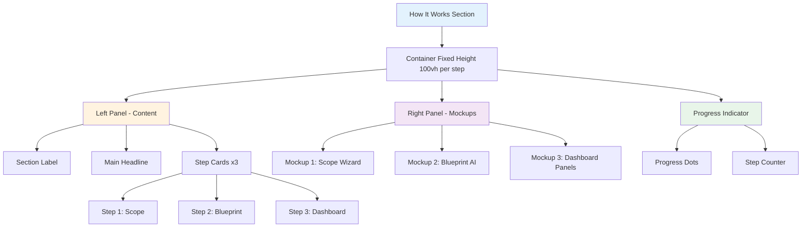
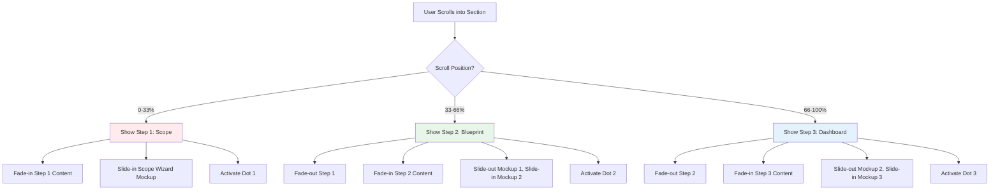

# 13. How It Works Section V6 — Design Specification

**Route:** `/` (Home Page)  
**Component:** How It Works Section  
**Design System:** Calm Luxury + Glassmorphism + Motion Animations  
**Section Type:** Scroll-triggered interactive showcase

---

## Progress Tracker

### Phase 1: Design & Planning
- [ ] Complete wireframe for all 3 steps
- [ ] Define scroll-triggered animation sequence
- [ ] Design mockup screens (Scope, Blueprint, Dashboard)
- [ ] Create glassmorphism card specifications
- [ ] Define color palette per step
- [ ] Specify typography hierarchy
- [ ] Design progress dots indicator
- [ ] Create mobile responsive layout

### Phase 2: Content Strategy
- [ ] Write section headline
- [ ] Write section subheadline
- [ ] Write step 1 (Scope) content
- [ ] Write step 2 (Blueprint) content
- [ ] Write step 3 (Dashboard) content
- [ ] Create microcopy for each step
- [ ] Define CTA button text
- [ ] Write image alt text

### Phase 3: Mockup Design
- [ ] Design Project Scope Wizard mockup
- [ ] Design AI Blueprint Generator mockup
- [ ] Design 3-Panel Dashboard mockup
- [ ] Add realistic UI elements (buttons, forms, data)
- [ ] Apply glassmorphism to mockup containers
- [ ] Create browser chrome wrapper
- [ ] Add subtle shadows and depth

### Phase 4: Animation System
- [ ] Define scroll trigger points (0%, 33%, 66%, 100%)
- [ ] Specify step fade-in sequence
- [ ] Create mockup slide-in animations
- [ ] Define progress dot transitions
- [ ] Specify parallax scroll effects
- [ ] Create hover interactions
- [ ] Define mobile swipe gestures

### Phase 5: Development Ready
- [ ] Export all mockup images (WebP)
- [ ] Document component structure
- [ ] Define scroll observer logic
- [ ] Specify responsive breakpoints
- [ ] Create accessibility requirements
- [ ] Define performance budgets
- [ ] Document animation timing

### Phase 6: Quality Assurance
- [ ] Visual QA (design match Figma)
- [ ] Scroll animation smoothness test
- [ ] Cross-browser compatibility
- [ ] Mobile device testing
- [ ] Accessibility audit
- [ ] Performance profiling
- [ ] A/B test variants prepared

---

## Section Architecture



---

## Scroll Behavior Flow



---

## Layout Specification

### Desktop Layout (1440px+)

```
┌──────────────────────────────────────────────────────────────┐
│ HOW IT WORKS SECTION (300vh total, 100vh per step)           │
│                                                               │
│ ┌─ LEFT PANEL (40%) ──────────┐  ┌─ RIGHT PANEL (60%) ────┐ │
│ │                              │  │                         │ │
│ │  HOW IT WORKS                │  │   ┌───────────────────┐ │ │
│ │                              │  │   │ Browser Chrome    │ │ │
│ │  The smarter way to          │  │   │ ● ● ●            │ │ │
│ │  build your startup          │  │   ├───────────────────┤ │ │
│ │                              │  │   │                   │ │ │
│ │  ┌────────────────────────┐  │  │   │  Project Scope   │ │ │
│ │  │ 1  Scope          [→]  │  │  │   │     Wizard       │ │ │
│ │  │                        │  │  │   │                   │ │ │
│ │  │ Start your project.    │  │  │   │  Select project:  │ │ │
│ │  │ Use AI or work with    │  │  │   │  [AI Product]     │ │ │
│ │  │ an expert to build a   │  │  │   │  [Dashboard]      │ │ │
│ │  │ custom scope...        │  │  │   │  [CRM]            │ │ │
│ │  └────────────────��───────┘  │  │   │                   │ │ │
│ │                              │  │   │  [Continue]       │ │ │
│ │  ┌────────────────────────┐  │  │   │                   │ │ │
│ │  │ 2  Blueprint      [→]  │  │  │   └───────────────────┘ │ │
│ │  │ (faded/inactive)       │  │  │                         │ │
│ │  └────────────────────────┘  │  │   Progress Dots:        │ │
│ │                              │  │   ● ○ ○                 │ │
│ │  ┌────────────────────────┐  │  │                         │ │
│ │  │ 3  Dashboard      [→]  │  │  └─────────────────────────┘ │
│ │  │ (faded/inactive)       │  │                               │
│ │  └────────────────────────┘  │                               │
│ │                              │                               │
│ └──────────────────────────────┘                               │
│                                                               │
└──────────────────────────────────────────────────────────────┘
```

### Tablet Layout (768-1023px)

```
┌─────────────────────────────────────────┐
│ HOW IT WORKS SECTION                    │
│                                          │
│ ┌─ STACKED LAYOUT ──────────────────┐   │
│ │                                    │   │
│ │  HOW IT WORKS (centered)           │   │
│ │  The smarter way to build...       │   │
│ │                                    │   │
│ │  ┌──────────────────────────────┐  │   │
│ │  │  Browser Mockup (80% width)  │  │   │
│ │  │                              │  │   │
│ │  │  [Scope Wizard Interface]    │  │   │
│ │  │                              │  │   │
│ │  └──────────────────────────────┘  │   │
│ │                                    │   │
│ │  ● ○ ○ (Progress Dots)             │   │
│ │                                    │   │
│ │  ┌───────────────────────────┐     │   │
│ │  │ 1  Scope                  │     │   │
│ │  │                           │     │   │
│ │  │ Start your project...     │     │   │
│ │  └───────────────────────────┘     │   │
│ │                                    │   │
│ │  [Next Step →]                     │   │
│ │                                    │   │
│ └────────────────────────────────────┘   │
│                                          │
└─────────────────────────────────────────┘
```

### Mobile Layout (320-767px)

```
┌──────────────────────────┐
│ HOW IT WORKS             │
│                          │
│ The smarter way to       │
│ build your startup       │
│                          │
│ ┌──────────────────────┐ │
│ │  Mockup Screenshot   │ │
│ │  (Full width)        │ │
│ │                      │ │
│ │  [Swipe carousel]    │ │
│ │                      │ │
│ └──────────────────────┘ │
│                          │
│ ● ○ ○                    │
│                          │
│ ┌──────────────────────┐ │
│ │ 1. Scope             │ │
│ │                      │ │
│ │ Start your project.  │ │
│ │ Use AI or work with  │ │
│ │ an expert...         │ │
│ │                      │ │
│ │ [View Details →]     │ │
│ └──────────────────────┘ │
│                          │
│ [Next] [Skip to Step 2]  │
│                          │
└──────────────────────────┘
```

---

## Content Specifications

### Section Label

**Text:**
> "HOW IT WORKS"

**Typography:**
- Font Family: `font-sans`
- Font Size: 12px
- Font Weight: 600 (semibold)
- Letter Spacing: 0.1em (wide)
- Text Transform: Uppercase
- Color: Orange `#ff6b35` (brand accent)

**Layout:**
- Margin Bottom: 16px
- Text Align: Left (desktop), Center (mobile)

**Animation:**
- Fade-in on section enter viewport (0-0.5s)

---

### Main Headline

**Text:**
> "The smarter way to build your startup"

**Typography:**
- Font Family: `font-display`
- Font Size: 56px (desktop), 42px (tablet), 32px (mobile)
- Font Weight: 700 (bold)
- Line Height: 1.2
- Letter Spacing: -0.01em
- Color: Navy `#0a1628`

**Gradient Treatment (Optional):**
- Apply gradient to "smarter way"
- Gradient: Linear 135deg
  - Start: `#667eea` (purple)
  - End: `#f093fb` (pink)

**Layout:**
- Max Width: 500px (desktop), 100% (mobile)
- Margin Bottom: 48px
- Text Align: Left (desktop), Center (mobile)

**Animation:**
- Fade-in + slide up (0.2-0.8s)

---

## Step Cards Design

### Card Container

**Design:**
- Background: White
- Border: 2px solid transparent
- Border Radius: 16px
- Padding: 32px
- Margin Bottom: 24px
- Transition: All 400ms ease

**Active State:**
- Border: 2px solid `#667eea` (purple)
- Box Shadow: 0 8px 24px rgba(102, 126, 234, 0.15)
- Background: `rgba(102, 126, 234, 0.02)` (very subtle tint)

**Inactive State:**
- Opacity: 0.4
- Transform: Scale(0.95)
- Pointer Events: None

**Hover (Active Card Only):**
- Transform: TranslateY(-4px)
- Box Shadow: 0 12px 32px rgba(102, 126, 234, 0.2)

---

### Step 1: Scope

**Step Number:**
- Display: Circle 48px diameter
- Background: Gradient (purple to pink)
- Color: White
- Font Size: 24px
- Font Weight: 700
- Position: Top-left of card

**Title:**
> "Scope"

**Typography:**
- Font Size: 32px (desktop), 24px (mobile)
- Font Weight: 700
- Color: Navy `#0a1628`
- Margin Bottom: 16px

**Description:**
> "Start your project. Use AI or work with an expert to build a custom scope to share with our engineers."

**Typography:**
- Font Size: 18px (desktop), 16px (mobile)
- Font Weight: 400
- Line Height: 1.6
- Color: Gray `#4a5568`
- Max Width: 420px

**CTA Link:**
- Text: "Learn More →"
- Font Size: 16px
- Font Weight: 600
- Color: Purple `#667eea`
- Hover: Underline + darken

**Icon/Badge:**
- Icon: 🎯 Target or ✨ Sparkles
- Size: 24px
- Position: Inline before title

---

### Step 2: Blueprint

**Step Number:**
- Circle with "2"
- Gradient: Orange to yellow

**Title:**
> "Blueprint"

**Description:**
> "AI analyzes your scope and generates a complete project blueprint with timeline, milestones, deliverables, and cost estimate—instantly editable."

**Icon:**
- 📐 Ruler or 🗺️ Map

**Color Accent:**
- Primary: Orange `#ff6b35`
- Gradient: Orange to Yellow

---

### Step 3: Dashboard

**Step Number:**
- Circle with "3"
- Gradient: Blue to teal

**Title:**
> "Dashboard"

**Description:**
> "Track everything in your intelligent dashboard. AI monitors health, detects risks, and suggests optimizations while your team delivers."

**Icon:**
- 📊 Chart or 🎛️ Control panel

**Color Accent:**
- Primary: Blue `#667eea`
- Gradient: Blue to Teal

---

## Mockup Specifications

### Browser Chrome Container

**Design:**
- Background: White
- Border Radius: 12px (top) / 8px (bottom)
- Box Shadow: 0 20px 60px rgba(0, 0, 0, 0.15)
- Overflow: Hidden

**Chrome Bar:**
- Height: 40px
- Background: `#f5f5f5`
- Border Bottom: 1px solid `#e0e0e0`
- Padding: 12px 16px

**Chrome Dots:**
- Three circles (close, minimize, maximize)
- Size: 12px diameter
- Colors: `#ff5f56`, `#ffbd2e`, `#27c93f` (macOS style)
- Gap: 8px
- Position: Left-aligned

**Address Bar (Optional):**
- Background: White
- Border Radius: 6px
- Padding: 6px 12px
- Font Size: 12px
- Color: Gray `#9ca3af`
- Text: "sunai.app/wizard"

---

### Mockup 1: Project Scope Wizard

**Viewport Size:** 1200px × 800px (scaled to fit)

**Content Structure:**

**Header:**
- Title: "Project Scope Wizard"
- Subtitle: "Select your project type"
- Font: Clean sans-serif, centered
- Background: Subtle gradient white to light purple

**Project Type Pills:**
Layout: 2 rows × 4 columns grid

**Row 1:**
1. MVP
2. **AI Product** (selected, orange background)
3. Automation
4. Mobile App

**Row 2:**
5. Dashboard
6. CRM
7. Landing Page
8. (empty/future)

**Pill Design (Default):**
- Background: White
- Border: 2px solid `#e2e8f0`
- Border Radius: 12px
- Padding: 16px 24px
- Font Size: 16px
- Font Weight: 600
- Color: Navy
- Hover: Border purple, shadow

**Pill Design (Selected):**
- Background: Orange `#ff6b35`
- Border: 2px solid `#ff6b35`
- Color: White
- Box Shadow: 0 4px 12px rgba(255, 107, 53, 0.3)

**Continue Button:**
- Position: Bottom-right
- Background: Navy `#0a1628`
- Color: White
- Padding: 14px 32px
- Border Radius: 8px
- Font Weight: 600

**Progress Indicator:**
- Position: Bottom-center
- Style: Dots (4 total, first active)
- Active: Orange, others gray

**Glassmorphism Effects:**
- Subtle backdrop blur on header
- Light shadow on pills
- Gradient background (very subtle)

**Image Source:**
- Use actual screenshot or high-fidelity Figma mockup
- Export as WebP (1200×800px at 2x = 2400×1600px)
- Compress to <150kb

---

### Mockup 2: AI Blueprint Generator

**Viewport Size:** 1200px × 800px

**Content Structure:**

**Header:**
- Title: "AI Blueprint Generator"
- Subtitle: "Generating your custom project blueprint..."
- Icon: Animated sparkles or loading indicator

**Main Content (Split View):**

**Left Panel (40%):**
- Section: "Analyzing Scope"
- Checkmarks appearing:
  - ✅ Project type identified
  - ✅ Timeline estimated
  - ✅ Resources calculated
  - ⏳ Generating deliverables...

**Right Panel (60%):**
- Live preview of generating blueprint
- Shows partial timeline appearing
- Milestones fading in
- Cost calculation animating

**Visual Style:**
- Clean white background
- Purple accent colors
- Smooth animations (dots, checkmarks)
- Progress bar at top (65% complete)

**AI Indicator:**
- Floating badge: "AI is working..." with pulse
- Gradient background (purple to pink)

**Example Deliverables List (Preview):**
1. Requirements Document
2. System Architecture
3. UI/UX Design Mockups
4. Frontend Development
5. Backend API Development
6. (more fading in...)

**Timeline Preview:**
- Gantt-style chart appearing
- Week 1-12 bars
- Phase labels (Discovery, Development, Launch)
- Color-coded by status

---

### Mockup 3: Three-Panel Dashboard

**Viewport Size:** 1400px × 900px (wider to show panels)

**Content Structure:**

**Layout:** LEFT (280px) | MAIN (fluid) | RIGHT (320px)

**Left Panel: Context**
- Header: "Projects"
- Active project highlighted: "Acme AI Chatbot"
- List of 5 projects with status dots
- Filters section
- Status colors: 🟢 Green, 🟡 Yellow, 🔴 Red

**Main Panel: Work**
- Tab Navigation: Overview | Timeline | Deliverables | Files
- Active tab: "Overview"
- Content:
  - Project header with title
  - Progress bar (68% complete)
  - Key metrics cards (Budget, Timeline, Tasks)
  - Upcoming milestones list
  - Recent activity feed

**Right Panel: Intelligence**
- Section 1: "Project Health"
  - Score: 82/100 (green)
  - Visual: Circular progress indicator
  
- Section 2: "AI Insights"
  - ⚠️ Warning: "Phase 2 overdue by 2 days"
  - 💡 Suggestion: "Add 1 week to timeline"
  - ✅ Positive: "Budget tracking on target"

- Section 3: "Next Actions"
  - Button: "Review Timeline"
  - Button: "Send Client Update"
  - Button: "Reschedule Tasks"

**Visual Style:**
- Clean separation between panels
- Subtle divider lines (1px gray)
- Glassmorphism cards in right panel
- Color-coded status indicators
- Modern sans-serif typography

**Data Realism:**
- Use realistic project names
- Actual dates (relative to today)
- Believable metrics (68%, $28k of $40k, etc.)
- Real task names ("Design wireframes", "API integration")

**Image Quality:**
- Export at 2800×1800px (2x resolution)
- Compress to <200kb WebP
- Include subtle shadows for depth

---

## Scroll-Triggered Animation System

### Scroll Observer Logic

**Concept:** As user scrolls through the section (300vh total), content on left and mockups on right change based on scroll position.

**Scroll Zones:**

| Scroll % | Active Step | Left Content | Right Mockup | Progress Dots |
|----------|-------------|--------------|--------------|---------------|
| 0-33%    | Step 1      | Scope card active | Scope Wizard visible | Dot 1 active |
| 33-66%   | Step 2      | Blueprint card active | Blueprint AI visible | Dot 2 active |
| 66-100%  | Step 3      | Dashboard card active | Dashboard visible | Dot 3 active |

**Transition Zones (Buffer):**
- 30-36%: Transition from Step 1 → Step 2
- 63-69%: Transition from Step 2 → Step 3

---

### Animation Specifications

**Step Card Transitions:**

```javascript
// When step becomes active
const activateStep = {
  opacity: [0.4, 1],
  scale: [0.95, 1],
  borderColor: ['transparent', '#667eea'],
  transition: {
    duration: 0.6,
    ease: 'easeOut'
  }
};

// When step becomes inactive
const deactivateStep = {
  opacity: [1, 0.4],
  scale: [1, 0.95],
  borderColor: ['#667eea', 'transparent'],
  transition: {
    duration: 0.4,
    ease: 'easeIn'
  }
};
```

---

**Mockup Transitions:**

```javascript
// Slide out (current mockup)
const slideOut = {
  x: [0, -100],
  opacity: [1, 0],
  scale: [1, 0.95],
  transition: {
    duration: 0.5,
    ease: [0.4, 0, 0.2, 1] // Custom cubic-bezier
  }
};

// Slide in (next mockup)
const slideIn = {
  x: [100, 0],
  opacity: [0, 1],
  scale: [0.95, 1],
  transition: {
    duration: 0.6,
    delay: 0.2, // Wait for slide-out to start
    ease: [0.4, 0, 0.2, 1]
  }
};
```

---

**Progress Dots Animation:**

```javascript
// Dot becomes active
const activateDot = {
  scale: [1, 1.3, 1],
  backgroundColor: ['#cbd5e0', '#667eea'],
  transition: {
    duration: 0.5,
    ease: 'easeInOut'
  }
};

// Dot becomes inactive
const deactivateDot = {
  scale: [1, 0.8, 1],
  backgroundColor: ['#667eea', '#cbd5e0'],
  transition: {
    duration: 0.4
  }
};
```

---

### Parallax Effects

**Left Panel (Content):**
- Scroll Speed: 0.9x (slower than scroll)
- Effect: Subtle upward drift as user scrolls
- Purpose: Creates depth, makes content feel "sticky"

**Right Panel (Mockups):**
- Scroll Speed: 1.1x (faster than scroll)
- Effect: Slight downward drift
- Purpose: Enhances 3D layering effect

**Parallax Code:**

```javascript
// Calculate parallax offset based on scroll position
const leftParallax = {
  y: scrollY * -0.1 // Moves up slightly slower
};

const rightParallax = {
  y: scrollY * 0.1 // Moves down slightly faster
};
```

---

### Hover Interactions

**Step Card Hover (Only Active Card):**
- Transform: TranslateY(-4px)
- Box Shadow: Increase from 8px to 12px
- Border Glow: Subtle outer glow effect
- Duration: 300ms
- Cursor: Pointer

**Mockup Hover:**
- Transform: Scale(1.02)
- Box Shadow: Increase depth
- Duration: 400ms
- Cursor: Zoom-in (indicates clickable for fullscreen)

**Progress Dot Hover:**
- Scale: 1.2x
- Cursor: Pointer
- Tooltip: "Jump to Step X"

---

## Progress Indicator Design

### Dot Style

**Container:**
- Position: Fixed right side (desktop), Bottom (mobile)
- Display: Flex column (desktop), Flex row (mobile)
- Gap: 16px (desktop), 12px (mobile)
- Padding: 24px

**Dot Design:**
- Size: 12px diameter
- Border Radius: 50% (perfect circle)
- Background: Gray `#cbd5e0` (inactive)
- Background: Purple `#667eea` (active)
- Border: 2px solid transparent
- Transition: All 400ms ease

**Active Dot:**
- Size: 16px diameter (larger)
- Background: Purple `#667eea`
- Border: 2px solid `rgba(102, 126, 234, 0.3)` (glow ring)
- Box Shadow: 0 0 0 4px `rgba(102, 126, 234, 0.1)`

**Step Counter (Optional):**
- Position: Above dots
- Text: "Step 1 of 3"
- Font Size: 12px
- Font Weight: 600
- Color: Gray `#718096`

**Click Behavior:**
- Click dot → Smooth scroll to that step
- Duration: 800ms
- Easing: Ease-in-out

---

## Responsive Breakpoint Specifications

### Desktop (1440px+)

**Layout:**
- Two-panel: Left 40% | Right 60%
- Container Max Width: 1440px
- Padding: 80px horizontal
- Section Height: 300vh (100vh per step)

**Step Cards:**
- Width: 100% of left panel
- Padding: 32px
- Font Size: 18px (description)

**Mockups:**
- Width: 85% of right panel
- Max Width: 1000px
- Centered vertically

**Progress Dots:**
- Position: Fixed right, center vertically
- Orientation: Vertical

---

### Laptop (1024-1439px)

**Layout:**
- Two-panel: Left 42% | Right 58%
- Padding: 60px horizontal

**Step Cards:**
- Padding: 28px
- Font Size: 17px

**Mockups:**
- Width: 90% of right panel
- Slightly smaller scale

---

### Tablet (768-1023px)

**Layout:**
- Stacked: Mockup on top, Steps below
- Padding: 40px horizontal
- Section Height: Auto (not fixed 100vh)

**Mockups:**
- Width: 80%
- Centered
- Margin Bottom: 40px

**Step Cards:**
- Full width
- Cards stack vertically
- Active card at top
- Inactive cards below (visible but faded)

**Progress Dots:**
- Position: Below mockup, centered
- Orientation: Horizontal

**Scroll Behavior:**
- Simplified: No scroll-triggered changes
- User manually navigates with buttons
- Or swipe gestures on mockups

---

### Mobile (320-767px)

**Layout:**
- Full vertical stack
- Padding: 24px horizontal
- Section Height: Auto

**Headline:**
- Font Size: 32px
- Text Align: Center
- Margin Bottom: 24px

**Mockups:**
- Width: 100%
- Carousel/Swiper component
- Swipe left/right to change steps
- Active mockup centered
- Inactive mockups partially visible (peek)

**Step Cards:**
- Show only active step
- Full width
- Padding: 24px
- Other steps hidden (accordion or tabs)

**Navigation:**
- Buttons: "Previous" | "Next"
- Position: Below step card
- Full width buttons on mobile

**Progress Dots:**
- Position: Between mockup and step card
- Orientation: Horizontal
- Size: 10px (smaller)

---

## Accessibility Requirements

### Keyboard Navigation
- [ ] Tab order: Step cards (1, 2, 3) → Progress dots → CTA links
- [ ] Focus states: 2px blue outline on all interactive elements
- [ ] Arrow keys: Navigate between steps (Left/Right or Up/Down)
- [ ] Enter/Space: Activate step or progress dot

### Screen Readers
- [ ] Section: `<section aria-labelledby="how-it-works-heading">`
- [ ] Headline: `<h2 id="how-it-works-heading">`
- [ ] Step cards: `<article role="region" aria-label="Step 1: Scope">`
- [ ] Progress dots: `<nav aria-label="Step navigation">`
- [ ] Mockup images: Descriptive alt text
  - "Screenshot of Project Scope Wizard interface showing project type selection"
  - "Screenshot of AI Blueprint Generator creating timeline and deliverables"
  - "Screenshot of three-panel dashboard with project overview and AI insights"

### Color Contrast
- [ ] Headline on background: Minimum 7:1 (AAA)
- [ ] Body text on background: Minimum 4.5:1 (AA)
- [ ] Active step card border: Clearly distinguishable
- [ ] Progress dots: Active vs inactive clearly visible

### Motion Preferences
- [ ] Respect `prefers-reduced-motion`
- [ ] If enabled: Disable parallax, slide transitions
- [ ] Keep fade-ins and simple opacity changes
- [ ] Instant step changes instead of animated

```css
@media (prefers-reduced-motion: reduce) {
  .step-card,
  .mockup-container,
  .progress-dot {
    transition: opacity 0.2s ease !important;
    transform: none !important;
  }
  
  .parallax-effect {
    transform: none !important;
  }
}
```

---

## Performance Budget

### Load Metrics
- **First Contentful Paint:** <1.2s
- **Largest Contentful Paint (Mockup Image):** <2.0s
- **Time to Interactive:** <3.0s
- **Cumulative Layout Shift:** <0.1

### Asset Optimization
- [ ] Mockup images: WebP format with PNG fallback
- [ ] Image sizes: 
  - Scope Wizard: ~120kb
  - Blueprint AI: ~130kb
  - Dashboard: ~180kb
- [ ] Lazy load mockups: Load only when step activates
- [ ] Browser chrome: CSS-only (no image)
- [ ] Progress dots: CSS-only

### Scroll Performance
- [ ] Use `IntersectionObserver` for scroll detection (not scroll event)
- [ ] Debounce scroll events if needed
- [ ] GPU-accelerated transforms (translateX, translateY, scale)
- [ ] Avoid layout-triggering properties (width, height, top, left)
- [ ] Target 60fps on desktop, 30fps on mobile

### Code Splitting
- [ ] Scroll observer logic: Load after section in viewport
- [ ] Mockup images: Lazy load with `loading="lazy"`
- [ ] Animation library: Load only if animations enabled

---

## Success Criteria

### Design Quality
- [ ] Matches Figma reference (attached image)
- [ ] Glassmorphism consistent with brand
- [ ] Typography hierarchy clear
- [ ] Color coding per step distinct
- [ ] Mockups look realistic and professional

### User Experience
- [ ] Scroll flow feels natural and smooth
- [ ] Active step always obvious
- [ ] Mockups align with step content
- [ ] No jarring transitions
- [ ] Progress dots provide clear navigation

### Technical Performance
- [ ] 60fps scroll animations on desktop
- [ ] 30fps+ on mobile devices
- [ ] No scroll jank or stuttering
- [ ] Images load progressively
- [ ] Works without JavaScript (graceful degradation)

### Conversion Optimization
- [ ] Each step has clear CTA
- [ ] Value proposition immediately clear
- [ ] Mockups build credibility (realistic UI)
- [ ] Progress indicator encourages completion
- [ ] Mobile experience doesn't feel compromised

### Accessibility
- [ ] WCAG 2.1 AA compliance
- [ ] Keyboard navigable
- [ ] Screen reader friendly
- [ ] Works with reduced motion
- [ ] Focus states visible and consistent

---

## Production-Ready Checklist

### Design Assets
- [ ] Mockup 1 (Scope Wizard) exported WebP + PNG
- [ ] Mockup 2 (Blueprint AI) exported WebP + PNG
- [ ] Mockup 3 (Dashboard) exported WebP + PNG
- [ ] Browser chrome created (CSS or SVG)
- [ ] Step icons sourced (emoji or SVG)
- [ ] Progress dot styles defined (CSS)

### Component Structure
- [ ] HowItWorks container component
- [ ] StepCard component (reusable for all 3 steps)
- [ ] MockupViewer component
- [ ] ProgressIndicator component
- [ ] ScrollObserver hook/utility
- [ ] Mobile swiper component (if carousel)

### Animation System
- [ ] Scroll position detection implemented
- [ ] Step transitions smooth (fade + scale)
- [ ] Mockup slide animations working
- [ ] Progress dot activation animated
- [ ] Parallax effect subtle and smooth
- [ ] Reduced-motion fallback tested

### Responsive Design
- [ ] Tested at 320px, 375px, 768px, 1024px, 1440px
- [ ] No horizontal scroll at any breakpoint
- [ ] Mobile carousel/swiper functional
- [ ] Touch gestures work on mobile
- [ ] Text readable at all sizes

### Cross-Browser
- [ ] Chrome (latest)
- [ ] Firefox (latest)
- [ ] Safari (latest, iOS Safari)
- [ ] Edge (latest)
- [ ] Graceful degradation for older browsers

### SEO & Metadata
- [ ] H2 tag on section headline
- [ ] Alt text on all mockup images (descriptive)
- [ ] Semantic HTML structure
- [ ] No text in images (all text as HTML)

### Analytics Events
- [ ] Track "How It Works - Step 1 Viewed"
- [ ] Track "How It Works - Step 2 Viewed"
- [ ] Track "How It Works - Step 3 Viewed"
- [ ] Track "Progress Dot Clicked - Jump to Step X"
- [ ] Track "Step Card CTA Clicked - Learn More"
- [ ] Track time spent on each step

---

## Multi-Step Development Prompts

### Prompt 1: Section Container & Layout

> "Create the How It Works section with a two-panel layout: left panel (40% width) for step content, right panel (60%) for mockup screenshots. Section should have 300vh total height (100vh per step). Use glassmorphism cards for step containers. Left panel is fixed position (sticky), right panel scrolls with mockups changing based on scroll position. Use Motion/React for animations. Ensure responsive breakpoints at 768px (stacked layout) and 1024px (adjusted proportions)."

---

### Prompt 2: Step Card Components

> "Build three step card components with the following content: (1) Scope - 'Start your project. Use AI or work with an expert to build a custom scope to share with our engineers', (2) Blueprint - 'AI analyzes your scope and generates a complete project blueprint with timeline, milestones, deliverables, and cost estimate', (3) Dashboard - 'Track everything in your intelligent dashboard. AI monitors health, detects risks, and suggests optimizations'. Each card has a gradient circle number badge, title, description, and 'Learn More' link. Active card has purple border and shadow, inactive cards are faded (opacity 0.4). Use scale and opacity transitions."

---

### Prompt 3: Mockup Images & Browser Chrome

> "Create browser chrome wrappers for three mockup screenshots: (1) Project Scope Wizard with project type selection pills, (2) AI Blueprint Generator with progress animation, (3) Three-panel dashboard. Browser chrome has macOS-style dots (red, yellow, green) and optional address bar. Mockups are WebP images with PNG fallback, lazy loaded. Add subtle shadow (0 20px 60px rgba(0,0,0,0.15)) and border radius (12px top, 8px bottom). Images should be 1200x800px for scope/blueprint, 1400x900px for dashboard."

---

### Prompt 4: Scroll Observer & Step Transitions

> "Implement scroll-triggered step activation using IntersectionObserver. Detect scroll position in section: 0-33% shows Step 1, 33-66% shows Step 2, 66-100% shows Step 3. When step activates: fade in step card (opacity 0.4 to 1), scale up (0.95 to 1), show purple border, slide in corresponding mockup from right (x: 100 to 0), activate progress dot. When step deactivates: fade out, scale down, slide out mockup to left (x: 0 to -100). Use Motion/React with stagger and delay. Target 60fps performance."

---

### Prompt 5: Progress Indicator & Navigation

> "Create a progress indicator with 3 dots positioned fixed on the right side (desktop) or bottom (mobile). Dots are 12px circles, active dot is 16px with purple fill and glow ring. Clicking a dot smoothly scrolls to that step (800ms ease-in-out). Active dot animates scale (1 to 1.3 to 1) and color change (gray to purple). Include optional 'Step X of 3' text above dots. On mobile, dots are horizontal below mockup carousel."

---

### Prompt 6: Mobile Swiper & Responsive Behavior

> "Optimize for mobile: convert mockups to swipeable carousel using react-slick or similar. Show one mockup at a time with partial peek of next/prev (2.5 cards visible). Swipe gesture changes active step and syncs progress dots. Step cards show only active step (accordion style). Add 'Next Step' and 'Previous Step' buttons below content. Test at 375px width. Disable scroll-triggered animations on mobile, use manual navigation instead."

---

### Prompt 7: Parallax Effects & Polish

> "Add subtle parallax scrolling: left panel (content) moves at 0.9x scroll speed (slower), right panel (mockups) at 1.1x (faster) to create depth. Add hover effects: active step card lifts 4px with increased shadow, mockup scales to 1.02x on hover. Implement glassmorphism on step cards with backdrop blur. Add smooth transitions (400-600ms) on all interactions. Ensure prefers-reduced-motion disables parallax and uses simple opacity transitions instead."

---

## Design Inspiration References

**Visual Style:**
- Stripe product pages (clean, professional mockups)
- Linear features section (scroll-triggered transitions)
- Apple WWDC pages (parallax, mockup showcases)
- Notion product tour (step-by-step with screens)

**Scroll Animations:**
- Apple AirPods Pro page (sticky content, changing images)
- Stripe Terminal page (scroll-sync animations)
- Codrops scroll effects (smooth transitions)

**Mockup Presentation:**
- Figma marketing site (realistic UI screenshots)
- Framer templates (glassmorphism, shadows)
- Webflow showcases (browser chrome, device frames)

---

## A/B Test Variations

### Variation A: Current Design (Scroll-Triggered)
- 300vh section with scroll detection
- Automatic step changes as user scrolls
- Sticky left panel, changing right panel
- Progress dots show current position

### Variation B: Interactive Tabs
- Single viewport height (100vh)
- Horizontal tab navigation at top
- Click tab to change active step
- Mockup fades in/out (no slide)
- Better mobile experience (no complex scroll)

### Variation C: Video Demo
- Replace mockups with screen recording video
- Video scrubs based on scroll position
- Chapters aligned with steps (0:00-0:10 = Step 1, etc.)
- Play button for continuous playthrough

### Variation D: Side-by-Side Comparison
- Show all 3 steps simultaneously (desktop)
- Horizontal scroll on mobile
- No active/inactive states
- Equal visual weight for all steps

**Test Metrics:**
- Primary: Click-through rate on step CTAs
- Secondary: Time on section, scroll completion rate
- Goal: Highest engagement with "Learn More" or "Start Project"

---

## Image Asset Specifications

### Mockup 1: Project Scope Wizard

**Filename:** `how-it-works-scope-wizard.webp` (+ `.png` fallback)

**Dimensions:** 2400px × 1600px (2x resolution)  
**Display Size:** 1200px × 800px  
**File Size Target:** <120kb (WebP), <300kb (PNG)

**Content Checklist:**
- [ ] Browser chrome with macOS dots
- [ ] Title: "Project Scope Wizard"
- [ ] Subtitle: "Select your project type"
- [ ] 7 project type pills (AI Product selected in orange)
- [ ] Continue button (navy, bottom-right)
- [ ] Progress dots (4 dots, first active)
- [ ] Clean white background with subtle gradient
- [ ] Realistic shadows and depth

**Alt Text:**
> "Project Scope Wizard interface showing 7 project type options including MVP, AI Product (selected), Automation, Mobile App, Dashboard, CRM, and Landing Page with a Continue button"

---

### Mockup 2: AI Blueprint Generator

**Filename:** `how-it-works-blueprint-ai.webp` (+ `.png` fallback)

**Dimensions:** 2400px × 1600px  
**Display Size:** 1200px × 800px  
**File Size Target:** <130kb (WebP), <320kb (PNG)

**Content Checklist:**
- [ ] Browser chrome
- [ ] Title: "AI Blueprint Generator"
- [ ] Subtitle: "Generating your custom project blueprint..."
- [ ] Left panel with checklist (3 done, 1 in progress)
- [ ] Right panel with partial timeline/deliverables
- [ ] Progress bar at top (65% complete)
- [ ] "AI is working..." floating badge with pulse
- [ ] Purple accent colors throughout
- [ ] Animated-looking elements (dotted lines, loading)

**Alt Text:**
> "AI Blueprint Generator interface showing automated project analysis with completed checklist items, generating timeline, and 65% progress indicator"

---

### Mockup 3: Three-Panel Dashboard

**Filename:** `how-it-works-dashboard-panels.webp` (+ `.png` fallback)

**Dimensions:** 2800px × 1800px (wider for 3 panels)  
**Display Size:** 1400px × 900px  
**File Size Target:** <180kb (WebP), <400kb (PNG)

**Content Checklist:**
- [ ] Browser chrome (wider format)
- [ ] Left panel (280px): Project list, 5 projects, filters
- [ ] Main panel (fluid): Overview tab, progress 68%, metrics cards
- [ ] Right panel (320px): Health score 82/100, AI insights, next actions
- [ ] Subtle panel dividers
- [ ] Color-coded status dots (green, yellow, red)
- [ ] Glassmorphism cards in right panel
- [ ] Realistic data (dates, names, numbers)
- [ ] Clean modern typography

**Alt Text:**
> "Three-panel dashboard interface showing project navigation (left), project overview with 68% progress (center), and AI-powered health score and insights (right)"

---

**Last Updated:** Dec 27, 2025  
**Version:** 6.0  
**Status:** Production-Ready Design Spec  
**Figma Reference:** See attached image
