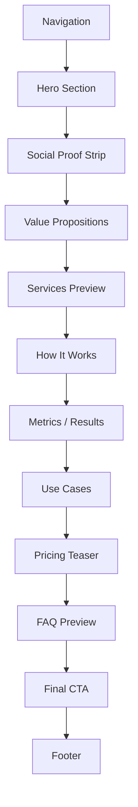
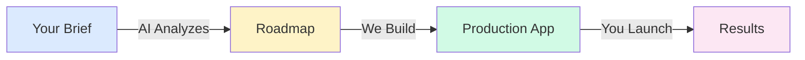
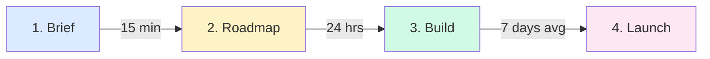

# Marketing Home Page - Complete Design Specification

**Page:** Marketing Homepage  
**Route:** `/`  
**Priority:** 🔥 P0 (Core)  
**Status:** Ready for design implementation

---

## 📋 Page Overview

**Purpose:** Convert visitors into leads through clear value proposition, social proof, and multiple conversion paths.

**Key Goals:**
1. Communicate core value in 5 seconds
2. Build trust through social proof
3. Guide users to wizard or booking
4. Showcase service offerings
5. Answer objections preemptively

**Target Audiences:**
- Startup founders looking for AI development
- Product managers evaluating AI solutions
- CTOs researching automation tools
- Marketing leaders exploring chatbot options

---

## 🎨 Design System Requirements

### Visual Language
- **Style:** Luxury SaaS / Calm Premium / Editorial
- **Background:** Warm off-white (#FAFAF9) with subtle gradient overlays
- **Texture:** Soft noise overlay (3-5% opacity)
- **Cards:** Illustrated, soft shadows, 16-24px border radius
- **Motion:** Micro-interactions (hover lift, icon nudge, shimmer)
- **Typography:** Editorial headlines + clean sans-serif body
- **Spacing:** 8px grid system, generous whitespace

### Color Palette
```css
/* Primary */
--primary-900: #1e293b;
--primary-600: #475569;
--primary-400: #94a3b8;

/* Accent */
--accent-600: #3b82f6;
--accent-500: #60a5fa;
--accent-100: #dbeafe;

/* Backgrounds */
--bg-primary: #fafaf9;
--bg-card: #ffffff;
--bg-subtle: #f8fafc;

/* Status */
--success-500: #10b981;
--warning-500: #f59e0b;
--error-500: #ef4444;
```

---

## 🎯 Page Structure

### Section Hierarchy



---

## 📐 Section 1: Navigation

### Desktop (1440px+)

**Component:** `GlobalNav/Desktop`

**Layout:**
```
[Logo]                    [Services] [Pricing] [Case Studies] [About]     [Book Call] [Start Brief →]
```

**Specifications:**
- Height: 72px
- Background: Translucent white (80% opacity) with backdrop blur
- Position: Sticky (z-index: 1000)
- Border: 1px solid rgba(0,0,0,0.05) bottom border
- Padding: 0 48px

**Links:**
- Logo → `/` (home)
- Services → `/services`
- Pricing → `/pricing`
- Case Studies → `/case-studies`
- About → `/about`
- Book Call → `/booking` (secondary button)
- Start Brief → `/wizard` (primary button)

**States:**
- Default: transparent background
- Scrolled: solid white background with subtle shadow
- Hover: underline animation on text links
- Active: current page gets accent color + bold weight

### Mobile (375px-767px)

**Component:** `GlobalNav/Mobile`

**Layout:**
```
[☰ Menu]        [Logo]        [Start Brief]
```

**Hamburger Menu:**
- Slides in from right
- Full-screen overlay
- Menu items stack vertically with 24px spacing
- Close button (X) top-right
- Book Call + Start Brief buttons at bottom

---

## 📐 Section 2: Hero Section

### Desktop Layout (1440px)

**Component:** `Hero/Home`

**Visual Structure:**
```
┌─────────────────────────────────────────────────┐
│  [Left Column - 60%]    [Right Column - 40%]   │
│                                                  │
│  EYEBROW: "AI DEVELOPMENT"                      │
│                                         [Animated│
│  HEADLINE:                               Diagram│
│  "Ship AI features                       Overlay│
│   without the 6-month                   showing │
│   learning curve."                      workflow]│
│                                                  │
│  SUBTEXT:                                       │
│  "We build production-ready AI chatbots,        │
│   agents, and automations in weeks."            │
│                                                  │
│  [Start Brief →]  [Book a Call]                 │
│                                                  │
│  TRUST STRIP:                                   │
│  "Shipped 40+ AI projects | 7-day avg delivery" │
└─────────────────────────────────────────────────┘
```

**Typography:**
- Eyebrow: 14px, uppercase, tracking 0.1em, accent color
- Headline: 64px (desktop), 700 weight, line-height 1.1, editorial font
- Subtext: 20px, 400 weight, line-height 1.6, neutral-600 color
- Trust strip: 14px, 500 weight, neutral-500 color

**Animated Diagram (Right):**


**Interactions:**
- Headline words fade in sequentially (0.1s delay each)
- Diagram connectors draw in with SVG animation
- CTA buttons have lift on hover (translateY: -2px)
- Background gradient subtly shifts on scroll

**Responsive (Mobile 375px):**
- Single column layout
- Headline: 36px
- Diagram moves below text
- CTAs stack vertically (100% width each)

---

## 📐 Section 3: Social Proof Strip

**Component:** `SocialProof/LogosStrip`

**Desktop Layout:**
```
┌──────────────────────────────────────────────────────┐
│  "Trusted by startups and enterprises"               │
│                                                       │
│  [Logo 1]  [Logo 2]  [Logo 3]  [Logo 4]  [Logo 5]   │
│                                                       │
│  "⭐⭐⭐⭐⭐  4.9/5 from 40+ projects"                 │
└──────────────────────────────────────────────────────┘
```

**Specifications:**
- Background: Subtle gradient (neutral-50 to neutral-100)
- Padding: 64px 0
- Logos: Grayscale filter (default), full color on hover
- Logo size: 120px width max, auto height
- Spacing: 48px between logos
- Marquee animation: Infinite scroll (optional)

**Alternative: Metrics Cards**
```
┌──────────────────────────────────────────────┐
│  [40+ Projects]  [7-day Avg]  [92% On-Time] │
│   Shipped        Delivery      Completion    │
└──────────────────────────────────────────────┘
```

---

## 📐 Section 4: Value Propositions

**Component:** `ValueProps/ThreeColumn`

**Layout:**
```
┌────────────────────────────────────────────────────────┐
│  SECTION HEADLINE:                                     │
│  "Why startups choose us over hiring or agencies"     │
│                                                         │
│  ┌─────────┐    ┌─────────┐    ┌─────────┐          │
│  │[Icon]   │    │[Icon]   │    │[Icon]   │          │
│  │         │    │         │    │         │          │
│  │Speed    │    │Quality  │    │Cost     │          │
│  │         │    │         │    │         │          │
│  │7-day    │    │Prod-    │    │50% less │          │
│  │avg      │    │ready    │    │than     │          │
│  │delivery │    │from day │    │hiring   │          │
│  │         │    │one      │    │         │          │
│  └─────────┘    └─────────┘    └─────────┘          │
└────────────────────────────────────────────────────────┘
```

**Card Specifications:**
- Width: 33.33% (desktop), 100% (mobile)
- Padding: 40px 32px
- Background: White with subtle shadow
- Border-radius: 20px
- Icon: 56px size, accent color
- Title: 24px, 600 weight
- Description: 16px, 400 weight, neutral-600

**Icons:**
- Speed: ⚡ Lightning bolt
- Quality: ✓ Checkmark shield
- Cost: 💰 Dollar sign in circle

**Hover Effect:**
- Card lifts (translateY: -4px)
- Shadow intensifies
- Icon scales (1.1x)
- Border appears (2px accent color)

---

## 📐 Section 5: Services Preview

**Component:** `ServicesPreview/BentoGrid`

**Layout (Desktop):**
```
┌──────────────────────────────────────────────────┐
│  SECTION HEADLINE:                               │
│  "What we build"                                 │
│                                                   │
│  ┌────────────┐  ┌────────────┐  ┌────────────┐│
│  │ AI         │  │ AI         │  │ Automations││
│  │ Chatbots   │  │ Agents     │  │            ││
│  │            │  │            │  │            ││
│  │ [Preview]  │  │ [Preview]  │  │ [Preview]  ││
│  └────────────┘  └────────────┘  └────────────┘│
│                                                   │
│  ┌────────────┐  ┌────────────┐  ┌────────────┐│
│  │ Dashboards │  │ Data/RAG   │  │ APIs       ││
│  │            │  │            │  │            ││
│  │ [Preview]  │  │ [Preview]  │  │ [Preview]  ││
│  └────────────┘  └────────────┘  └────────────┘│
│                                                   │
│             [View All Services →]                │
└──────────────────────────────────────────────────┘
```

**Card Content:**
- Illustrated icon/mini-scene (top)
- Service name (headline)
- 1-line outcome
- "Typical timeline" badge
- "Outputs" chips (e.g., "Dashboards", "APIs")
- Hover: Show "Learn more →" CTA

**Grid Specs:**
- 3 columns (desktop)
- 2 columns (tablet)
- 1 column (mobile)
- Gap: 24px
- Card aspect ratio: 4:3

**Routes:**
- Cards → `/services/[service-slug]`
- "View All Services" → `/services`

---

## 📐 Section 6: How It Works

**Component:** `HowItWorks/Timeline`

**Visual Flow:**


**Layout (Desktop):**
```
┌────────────────────────────────────────────────────────┐
│  SECTION HEADLINE:                                     │
│  "From brief to production in 7 days (average)"       │
│                                                         │
│  ┌────────┐ ─────→ ┌────────┐ ─────→ ┌────────┐ ───→│
│  │ Step 1 │        │ Step 2 │        │ Step 3 │      │
│  │        │        │        │        │        │      │
│  │ Brief  │        │ AI     │        │ Build  │      │
│  │        │        │ Plans  │        │        │      │
│  │ [Icon] │        │ [Icon] │        │ [Icon] │      │
│  │        │        │        │        │        │      │
│  │ 15 min │        │ 24 hrs │        │ 7 days │      │
│  └────────┘        └────────┘        └────────┘      │
│                                                         │
│  ┌────────┐                                           │
│  │ Step 4 │                                           │
│  │        │                                           │
│  │ Launch │                                           │
│  │        │                                           │
│  │ [Icon] │                                           │
│  │        │                                           │
│  │ Same   │                                           │
│  │ day    │                                           │
│  └────────┘                                           │
└────────────────────────────────────────────────────────┘
```

**Scroll Animation:**
- Steps fade in sequentially as user scrolls
- Connector lines draw in with SVG animation
- Icons pulse when in viewport

**Step Content:**
1. **Brief:** "Tell us what you need (15-min wizard)"
2. **AI Plans:** "AI generates roadmap + proposal (24 hours)"
3. **Build:** "We build + iterate with you (7 days avg)"
4. **Launch:** "Deploy to production + handoff (same day)"

---

## 📐 Section 7: Metrics / Results

**Component:** `Metrics/StatsGrid`

**Layout:**
```
┌──────────────────────────────────────────────────┐
│  "Our track record"                              │
│                                                   │
│  ┌──────┐  ┌──────┐  ┌──────┐  ┌──────┐        │
│  │ 40+  │  │ 92%  │  │ 7    │  │ 4.9  │        │
│  │      │  │      │  │ days │  │ ⭐   │        │
│  │Projects│On-time│Average│Rating│        │
│  └──────┘  └──────┘  └──────┘  └──────┘        │
└──────────────────────────────────────────────────┘
```

**Number Animation:**
- Count up from 0 when in viewport
- Use easing function for smooth acceleration/deceleration

---

## 📐 Section 8: Use Cases

**Component:** `UseCases/CardGrid`

**Layout:**
```
┌──────────────────────────────────────────────────────┐
│  "Real use cases from real clients"                  │
│                                                       │
│  ┌─────────────────┐  ┌─────────────────┐          │
│  │ E-commerce Bot  │  │ CRM Automation  │          │
│  │                 │  │                 │          │
│  │ [Screenshot]    │  │ [Screenshot]    │          │
│  │                 │  │                 │          │
│  │ "Qualified 300+ │  │ "Saved 15 hrs/  │          │
│  │  leads/month"   │  │  week on data"  │          │
│  │                 │  │                 │          │
│  │ [View Case →]   │  │ [View Case →]   │          │
│  └─────────────────┘  └─────────────────┘          │
│                                                       │
│  ┌─────────────────┐  ┌─────────────────┐          │
│  │ Support AI      │  │ Lead Gen Bot    │          │
│  │ [Similar...]    │  │ [Similar...]    │          │
│  └─────────────────┘  └─────────────────┘          │
└──────────────────────────────────────────────────────┘
```

**Routes:**
- Cards → `/case-studies/[slug]`
- "View All Cases" → `/case-studies`

---

## 📐 Section 9: Pricing Teaser

**Component:** `PricingTeaser/ThreeTiers`

**Layout:**
```
┌────────────────────────────────────────────────────────┐
│  "Transparent pricing, no surprises"                   │
│                                                         │
│  ┌────────┐    ┌────────┐    ┌────────┐              │
│  │Starter │    │Growth  │    │Enterprise│              │
│  │        │    │        │    │           │              │
│  │$5k-15k │    │$15k-50k│    │Custom    │              │
│  │        │    │        │    │           │              │
│  │• Item  │    │• Item  │    │• Item     │              │
│  │• Item  │    │• Item  │    │• Item     │              │
│  │        │    │        │    │           │              │
│  │[Brief] │    │[Brief] │    │[Book Call]│              │
│  └────────┘    └────────┘    └────────┘              │
│                                                         │
│              [See Full Pricing →]                      │
└────────────────────────────────────────────────────────┘
```

**Routes:**
- "See Full Pricing" → `/pricing`
- Tier buttons → `/wizard` (pre-fills tier selection)

---

## 📐 Section 10: FAQ Preview

**Component:** `FAQ/Accordion`

**Questions (Top 3):**
1. "How fast can you start?"
2. "What if we need changes?"
3. "Do you provide support after launch?"

**Accordion Specs:**
- Closed by default
- Smooth expand/collapse (0.3s ease)
- Icon rotates 180° when open
- Background highlight when open

**Route:**
- "View All FAQs" → `/pricing#faq` (anchor link)

---

## 📐 Section 11: Final CTA

**Component:** `CTA/Banner`

**Layout:**
```
┌────────────────────────────────────────────────────────┐
│                                                         │
│  HEADLINE:                                             │
│  "Get a proposal in 24 hours"                          │
│                                                         │
│  SUBTEXT:                                              │
│  "Tell us what you need. AI builds your roadmap.       │
│   We send pricing and timeline."                       │
│                                                         │
│  [Start Brief (15 min) →]    [Or book a call]          │
│                                                         │
└────────────────────────────────────────────────────────┘
```

**Background:** Gradient accent background, white text
**Padding:** 120px vertical

---

## 📐 Section 12: Footer

**Component:** `GlobalFooter`

**Layout:**
```
┌────────────────────────────────────────────────────────┐
│  [Logo]                                                │
│                                                         │
│  Services          Company         Resources           │
│  • AI Chatbots     • About         • Case Studies      │
│  • AI Agents       • Contact       • Pricing           │
│  • Automations     • Careers       • Blog              │
│  • Dashboards                                          │
│                                                         │
│  [LinkedIn] [Twitter] [GitHub]                         │
│                                                         │
│  © 2025 Company Name | Privacy | Terms                 │
└────────────────────────────────────────────────────────┘
```

**Routes:**
- All links functional
- Social icons → external links (open in new tab)

---

## 📱 Responsive Breakpoints

### Desktop (1440px+)
- All sections use grid layouts
- Maximum content width: 1280px (centered)

### Tablet (768px-1024px)
- 2-column grids become 2-column
- 3-column grids become 2-column
- Font sizes reduce by 10-15%

### Mobile (375px-767px)
- All grids become single column
- Hero headline: 36px
- Navigation: Hamburger menu
- Cards: 100% width, stacked
- Padding: 24px (vs 48px desktop)

---

## 🎬 Animation Specifications

### On Load
1. Navigation fades in (0.2s)
2. Hero headline words appear sequentially (0.1s delay each)
3. Diagram draws in (1s total)
4. CTA buttons scale in (0.3s)

### On Scroll (Intersection Observer)
- Sections fade in when 20% visible
- Stats count up when in viewport
- Cards stagger in (0.1s delay between each)
- Connector lines draw as you scroll

### Hover States
- Buttons: lift + shadow intensify
- Cards: lift + border glow
- Links: underline animation
- Icons: scale + color shift

---

## 🔗 Route Map

```mermaid
graph TD
    HOME[Homepage /] --> WIZARD[/wizard]
    HOME --> BOOKING[/booking]
    HOME --> SERVICES[/services]
    HOME --> PRICING[/pricing]
    HOME --> CASES[/case-studies]
    HOME --> ABOUT[/about]
    
    SERVICES --> SERVICE_DETAIL[/services/:slug]
    CASES --> CASE_DETAIL[/case-studies/:slug]
    
    SERVICE_DETAIL --> WIZARD
    SERVICE_DETAIL --> BOOKING
    
    CASE_DETAIL --> WIZARD
```

---

## ✅ Component Checklist

### Must Create
- [ ] `GlobalNav/Desktop` + `GlobalNav/Mobile`
- [ ] `Hero/Home` with animated diagram
- [ ] `SocialProof/LogosStrip`
- [ ] `ValueProps/ThreeColumn`
- [ ] `ServicesPreview/BentoGrid`
- [ ] `HowItWorks/Timeline` with SVG connectors
- [ ] `Metrics/StatsGrid` with count-up animation
- [ ] `UseCases/CardGrid`
- [ ] `PricingTeaser/ThreeTiers`
- [ ] `FAQ/Accordion`
- [ ] `CTA/Banner`
- [ ] `GlobalFooter`

### States Required
- [ ] Navigation: default, scrolled, mobile menu open
- [ ] Buttons: default, hover, active, disabled, loading
- [ ] Cards: default, hover, selected
- [ ] Accordion: collapsed, expanded
- [ ] Links: default, hover, active, focus

---

## 🎨 Figma Make AI Prompt (Ready to Paste)

```
Create a luxury SaaS homepage for an AI development company.

PAGE STRUCTURE (Desktop 1440px):
1. Sticky navigation with logo, links, and two CTAs
2. Hero section with large headline "Ship AI features without the 6-month learning curve", subtext, two CTAs (Start Brief, Book Call), and animated workflow diagram on the right
3. Social proof strip with 5 client logos and star rating
4. Three value proposition cards (Speed, Quality, Cost) with icons and metrics
5. Services preview as a 3x2 bento grid showcasing AI Chatbots, AI Agents, Automations, Dashboards, Data/RAG, APIs
6. "How It Works" timeline showing 4 steps with connector lines
7. Metrics section showing 40+ projects, 92% on-time, 7-day avg, 4.9 rating
8. Use cases grid with 4 cards showing screenshots and outcomes
9. Pricing teaser with 3 tiers (Starter, Growth, Enterprise)
10. FAQ accordion with top 3 questions
11. Final CTA banner with gradient background
12. Footer with links organized in 3 columns

DESIGN STYLE:
- Luxury SaaS / Calm Premium aesthetic
- Warm off-white background with subtle gradients
- Illustrated cards with soft shadows
- Editorial typography for headlines (64px)
- Micro-interactions on hover (lift, scale, glow)
- 8px spacing grid
- 16-24px border radius on cards
- Accent color: Blue (#3b82f6)

RESPONSIVE:
- Create desktop (1440px), tablet (1024px), and mobile (375px) variants
- Mobile: hamburger menu, stacked layouts, 100% width cards
- Tablet: 2-column grids instead of 3-column

INTERACTIONS:
- Navigation becomes solid white on scroll
- Hero diagram animates connector lines
- Stats count up when scrolled into view
- Cards lift and glow on hover
- Accordion smooth expand/collapse

ROUTES (Add to prototype):
- Logo → /
- Services → /services
- Pricing → /pricing
- Case Studies → /case-studies
- About → /about
- Book Call → /booking
- Start Brief → /wizard
- Service cards → /services/[slug]
```

---

**Status:** ✅ Complete specification ready for Figma Make AI implementation  
**Next Step:** Paste prompt into Figma Make → Review → Iterate
