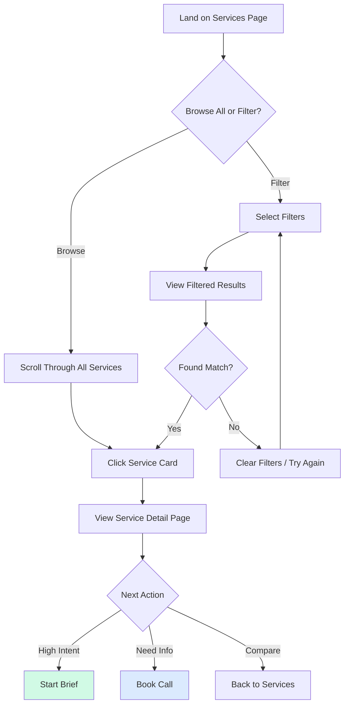
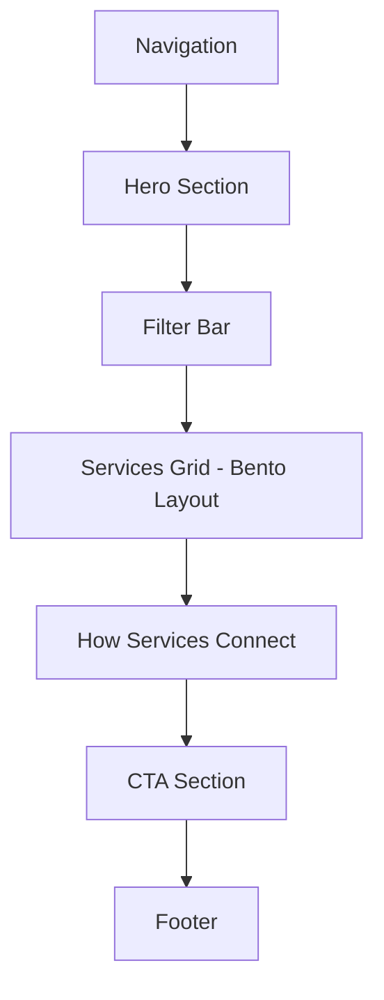
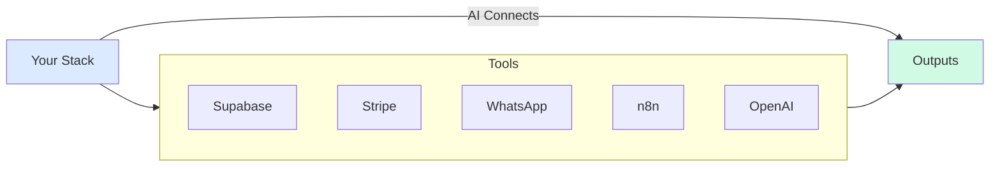
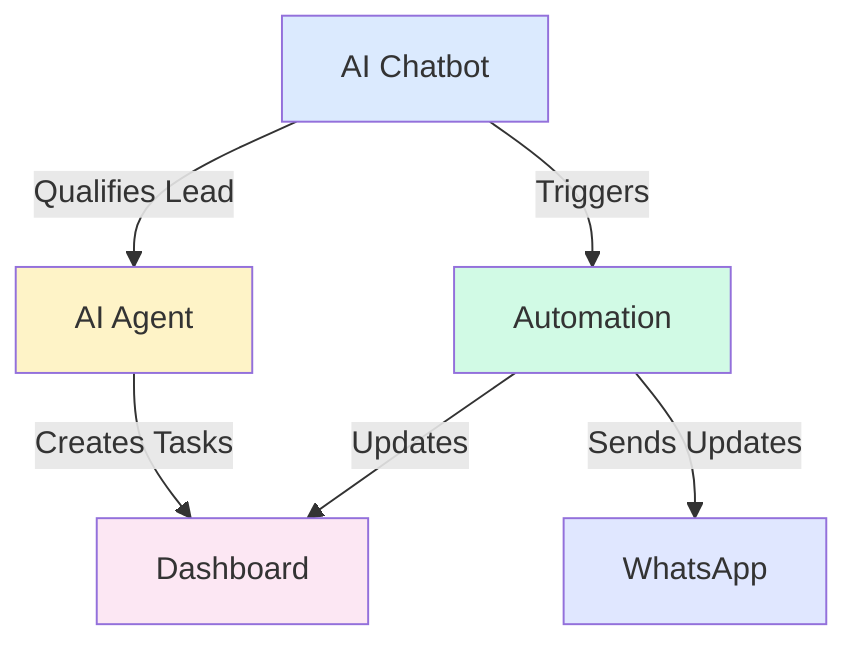
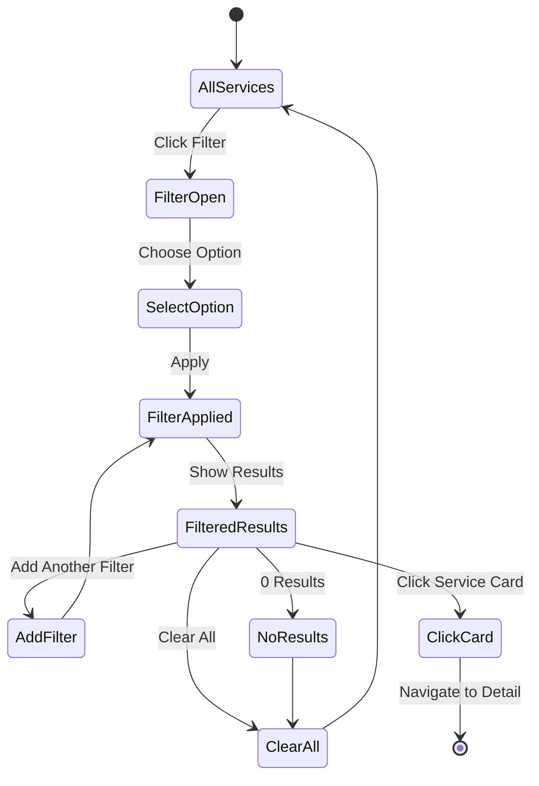

# Marketing Services Page - Complete Design Specification

**Page:** Services Overview  
**Route:** `/services`  
**Priority:** 🔥 P0 (Core)  
**Status:** Ready for design implementation

---

## 📋 Page Overview

**Purpose:** Help visitors understand all service offerings, compare options, and navigate to detailed service pages or start the brief process.

**Key Goals:**
1. Showcase all 6+ service offerings in scannable format
2. Enable filtering by type, industry, and technology
3. Provide quick comparison of timelines and outputs
4. Drive conversions to wizard or service detail pages
5. Build credibility through visual examples

**Target Audiences:**
- Decision-makers researching AI solutions
- Technical evaluators comparing capabilities
- Budget holders assessing scope and complexity
- Multi-stakeholder teams exploring options

---

## 🎯 User Journey Flow



---

## 🎨 Design System Requirements

### Visual Language
- **Style:** Luxury dashboard meets editorial magazine
- **Card Treatment:** Illustrated mini-scenes, not flat icons
- **Grid System:** Dynamic bento layout (not rigid table)
- **Filtering:** Premium dropdown chips (not e-commerce sidebar)
- **Motion:** Hover reveals, smooth filtering transitions
- **Empty States:** Illustrated "no results" with suggestions

### Color Coding (Subtle)
```css
/* Service Type Colors (Background tints) */
--chatbots: #dbeafe;    /* Blue */
--agents: #fef3c7;      /* Yellow */
--automations: #d1fae5; /* Green */
--dashboards: #fce7f3;  /* Pink */
--data: #e0e7ff;        /* Indigo */
--apis: #fed7aa;        /* Orange */
```

---

## 📐 Page Structure

### Section Hierarchy



---

## 📐 Section 1: Hero Section

**Component:** `ServicesHero`

**Desktop Layout (1440px):**
```
┌────────────────────────────────────────────────────────┐
│  EYEBROW: "SERVICES"                                   │
│                                                         │
│  HEADLINE:                                             │
│  "AI systems built for speed,                          │
│   clarity, and revenue."                               │
│                                                         │
│  SUBTEXT:                                              │
│  "From chatbots to dashboards, we build production-   │
│   ready AI in weeks, not months."                      │
│                                                         │
│  [Start Brief →]    [Book a Call]                      │
│                                                         │
│  ┌──────────────────────────────────────────────────┐ │
│  │ ANIMATED SYSTEM DIAGRAM                          │ │
│  │ [Your Stack] → [AI Layer] → [Outputs]           │ │
│  │ Tools: Supabase, Stripe, WhatsApp, n8n, OpenAI  │ │
│  └──────────────────────────────────────────────────┘ │
└────────────────────────────────────────────────────────┘
```

**Typography:**
- Eyebrow: 14px, uppercase, tracking 0.1em, accent color
- Headline: 56px, 700 weight, line-height 1.1
- Subtext: 18px, 400 weight, line-height 1.6, neutral-600

**Animated Diagram:**


**Interactions:**
- Connector lines draw in on scroll
- Tool icons pulse sequentially
- Background gradient shifts subtly

**Responsive (Mobile 375px):**
- Headline: 32px
- Diagram moves below text
- CTAs stack vertically

---

## 📐 Section 2: Filter Bar

**Component:** `FilterBar/Services`

**Desktop Layout:**
```
┌────────────────────────────────────────────────────────┐
│  [Type ▼]  [Industry ▼]  [Technology ▼]    [Clear All]│
│                                                         │
│  Showing 12 services                                   │
└────────────────────────────────────────────────────────┘
```

**Filter Dimensions:**

1. **Type** (Service category):
   - All Types
   - AI Chatbots
   - AI Agents
   - Automations
   - Dashboards & Ops
   - Data & RAG
   - Custom Development

2. **Industry** (Use case focus):
   - All Industries
   - SaaS
   - E-commerce
   - Real Estate
   - Automotive
   - Tourism & Hospitality
   - Enterprise
   - Healthcare
   - Finance

3. **Technology** (Integration):
   - All Technologies
   - Supabase
   - Stripe
   - WhatsApp
   - n8n
   - Webflow
   - OpenAI
   - Claude
   - Perplexity
   - Make.com
   - Zapier

**Filter Dropdown Specs:**
- Width: Auto (min 180px)
- Height: 40px
- Border: 1px solid neutral-300
- Border-radius: 8px
- Dropdown opens with 0.2s scale animation
- Selected filters show count badge (e.g., "Type (2)")

**Selected State:**
```
┌────────────────────────────────────────────────────────┐
│  [Type: Chatbots (×)]  [Industry: SaaS (×)]  [Clear]  │
│                                                         │
│  Showing 4 services                                    │
└────────────────────────────────────────────────────────┘
```

**Empty State (No Results):**
```
┌────────────────────────────────────────────────────────┐
│  [Type: Agents (×)]  [Industry: Healthcare (×)]        │
│                                                         │
│  No services match these filters                       │
│                                                         │
│  [Illustration of magnifying glass]                    │
│                                                         │
│  "Try different filters or"                            │
│  [Clear all filters]                                   │
└────────────────────────────────────────────────────────┘
```

**Mobile Filter (375px):**
- Opens as bottom sheet modal
- Filters stack vertically
- "Apply Filters" button at bottom
- "X results" count updates live as you select

---

## 📐 Section 3: Services Grid (Bento Layout)

**Component:** `ServicesGrid/Bento`

**Desktop Layout (1440px):**
```
┌──────────────────────────────────────────────────────┐
│  ┌─────────────┐  ┌─────────────┐  ┌─────────────┐ │
│  │             │  │             │  │             │ │
│  │ AI Chatbots │  │ AI Agents   │  │ Automations │ │
│  │             │  │             │  │             │ │
│  │ [Preview]   │  │ [Preview]   │  │ [Preview]   │ │
│  │             │  │             │  │             │ │
│  │ Timeline    │  │ Timeline    │  │ Timeline    │ │
│  │ Outputs     │  │ Outputs     │  │ Outputs     │ │
│  │             │  │             │  │             │ │
│  └─────────────┘  └─────────────┘  └─────────────┘ │
│                                                       │
│  ┌─────────────┐  ┌─────────────┐  ┌─────────────┐ │
│  │ Dashboards  │  │ Data & RAG  │  │ Custom APIs │ │
│  │ [Similar]   │  │ [Similar]   │  │ [Similar]   │ │
│  └─────────────┘  └─────────────┘  └─────────────┘ │
└──────────────────────────────────────────────────────┘
```

### Service Card Structure

**Component:** `ServiceCard/Illustrated`

```
┌───────────────────────────────────┐
│  [Type Badge]                     │
│                                   │
│  ┌─────────────────────────────┐ │
│  │  [Illustrated Scene]        │ │
│  │  (Chat bubbles, workflow,   │ │
│  │   dashboard preview, etc.)  │ │
│  └─────────────────────────────┘ │
│                                   │
│  TITLE: "AI Chatbots"            │
│  OUTCOME: "Qualify, sell, and    │
│           support 24/7"          │
│                                   │
│  TIMELINE BAR:                   │
│  [████████──] 7-14 days          │
│                                   │
│  OUTPUTS:                        │
│  [Chat Widget] [API] [Dashboard] │
│                                   │
│  TECH STACK:                     │
│  [OpenAI] [Supabase] [Webflow]  │
│                                   │
│  [View Details →]                │
└───────────────────────────────────┘
```

**Card Specifications:**
- Width: ~400px (responsive)
- Aspect ratio: 3:4 (portrait)
- Padding: 32px
- Background: White
- Border: 1px solid neutral-200
- Border-radius: 20px
- Shadow: Soft (0 4px 24px rgba(0,0,0,0.06))

**Illustrated Scene Guidelines:**
- For **Chatbots**: Chat bubbles with sample conversation
- For **Agents**: Multi-step workflow with icons
- For **Automations**: Trigger → Action → Result flow
- For **Dashboards**: Mini chart/table preview
- For **Data/RAG**: Knowledge base with search
- For **APIs**: Code snippet or endpoint diagram

**Timeline Bar:**
- Width: 100%
- Height: 8px
- Background: neutral-200
- Fill: Accent color (blue)
- Fill percentage represents typical duration
  - 7 days = 50%
  - 14 days = 75%
  - 21+ days = 100%
- Label: "7-14 days" right-aligned

**Output Chips:**
- Display: inline-flex
- Padding: 6px 12px
- Background: Neutral-100
- Border-radius: 6px
- Font-size: 12px
- Color: Neutral-700
- Icon: 14px before text

**Tech Stack Icons:**
- Size: 24px
- Grayscale by default
- Full color on card hover
- Tooltip on hover showing name

**Hover State:**
- Card lifts (translateY: -8px)
- Shadow intensifies (0 12px 40px rgba(0,0,0,0.12))
- Illustrated scene animates (subtle motion)
- "View Details" button gains gradient background
- Tech icons become full color
- Border glows with accent color

**Click Behavior:**
- Routes to `/services/[slug]`
- Slug examples:
  - `/services/ai-chatbots`
  - `/services/ai-agents`
  - `/services/automations`
  - `/services/dashboards`
  - `/services/data-rag`
  - `/services/custom-apis`

### Grid Responsive Behavior

**Desktop (1440px):**
- 3 columns
- Gap: 32px
- Max-width: 1280px (centered)

**Tablet (768-1024px):**
- 2 columns
- Gap: 24px
- Cards scale to fit

**Mobile (375-767px):**
- 1 column
- Gap: 16px
- Cards: 100% width
- Compact variant (smaller illustrations)

---

## 📐 Section 4: How Services Connect

**Component:** `ServicesSystemMap`

**Purpose:** Show how different services work together in a complete system.

**Desktop Layout:**
```
┌────────────────────────────────────────────────────────┐
│  SECTION HEADLINE:                                     │
│  "How services work together"                          │
│                                                         │
│  DIAGRAM:                                              │
│                                                         │
│  ┌─────────┐       ┌─────────┐       ┌─────────┐     │
│  │ Chatbot │  ───→ │ Agent   │  ───→ │Dashboard│     │
│  │ Qualifies│      │ Creates │       │ Shows   │     │
│  │ Lead     │      │ Tasks   │       │ Status  │     │
│  └─────────┘       └─────────┘       └─────────┘     │
│       │                                     ↑          │
│       └──────────→ Automation ──────────────┘         │
│                    Sends WhatsApp Updates             │
│                                                         │
│  CAPTION:                                              │
│  "Example: Lead qualification → Task creation →        │
│   Dashboard tracking → WhatsApp notifications"         │
└────────────────────────────────────────────────────────┘
```

**Mermaid Diagram:**


**Animation:**
- Connectors draw in sequentially
- Each service card pulses as connector reaches it
- Full loop animation completes in 4 seconds

**Responsive (Mobile):**
- Diagram becomes vertical flow
- Cards stack
- Connector lines adjust to vertical orientation

---

## 📐 Section 5: CTA Section

**Component:** `CTA/ServicesPage`

**Desktop Layout:**
```
┌────────────────────────────────────────────────────────┐
│  HEADLINE:                                             │
│  "Not sure which service you need?"                    │
│                                                         │
│  SUBTEXT:                                              │
│  "Start the brief. Our AI will recommend the right    │
│   solution + give you pricing in 24 hours."           │
│                                                         │
│  [Start Brief (15 min) →]    [Book Expert Call]       │
└────────────────────────────────────────────────────────┘
```

**Background:** Gradient (accent-50 to accent-100)
**Padding:** 80px vertical
**Routes:**
- Start Brief → `/wizard`
- Book Expert Call → `/booking`

---

## 📐 Section 6: Footer

(Same as homepage footer component)

---

## 🔗 Route Map

```mermaid
graph TD
    SERVICES[/services] --> FILTER[Apply Filters]
    FILTER --> FILTERED[/services?type=X&industry=Y]
    
    SERVICES --> CARD_CLICK[Click Service Card]
    CARD_CLICK --> CHATBOTS[/services/ai-chatbots]
    CARD_CLICK --> AGENTS[/services/ai-agents]
    CARD_CLICK --> AUTO[/services/automations]
    CARD_CLICK --> DASH[/services/dashboards]
    CARD_CLICK --> DATA[/services/data-rag]
    CARD_CLICK --> APIS[/services/custom-apis]
    
    CHATBOTS --> WIZARD[/wizard]
    CHATBOTS --> BOOKING[/booking]
    
    AGENTS --> WIZARD
    AGENTS --> BOOKING
    
    style WIZARD fill:#d1fae5
    style BOOKING fill:#dbeafe
```

---

## 🎬 Filter Interaction Flow



---

## 📱 Responsive Breakpoints

### Desktop (1440px+)
- 3-column grid
- All filters visible in top bar
- Card size: ~400px width

### Tablet (768-1024px)
- 2-column grid
- Filters may wrap to second row
- Card size: responsive (fills 50% minus gap)

### Mobile (375-767px)
- 1-column grid
- Filters open as bottom sheet modal
- Cards: 100% width, compact variant
- Sticky "Filter" button at bottom

---

## 🎨 Component Variants

### ServiceCard Variants
- `default` - Normal state
- `hover` - Lifted with shadow, animated scene
- `selected` - Blue border (if multi-select needed)
- `compact` - Smaller version for mobile
- `disabled` - Grayed out (for "Coming Soon" services)

### FilterDropdown Variants
- `closed` - Default closed state
- `open` - Dropdown menu visible
- `selected` - Shows selected option + count badge
- `error` - If no results (red border pulse)

### EmptyState Variants
- `no-results` - When filters return nothing
- `no-services` - When category has no services (shouldn't happen)

---

## 🎯 Interactive States

### Filter Interaction
1. Click dropdown → Opens with scale animation
2. Select option → Checkbox appears + highlight
3. Click "Apply" → Grid animates (fade out old, fade in new)
4. "Showing X services" count updates
5. Selected filters show as removable pills

### Card Interaction
1. Hover → Lift + shadow + border glow + scene animates
2. Click → Route to detail page with transition
3. Focus (keyboard) → Visible focus ring

### Empty State
1. No results → Fade out grid
2. Show illustration + message
3. Pulse "Clear filters" button
4. Click clear → Fade back to all results

---

## ✅ Component Checklist

### Must Create
- [ ] `ServicesHero` with animated system diagram
- [ ] `FilterBar/Services` with 3 dropdowns
- [ ] `FilterDropdown` component (reusable)
- [ ] `FilterPill` (selected state chip)
- [ ] `ServiceCard/Illustrated` (6+ unique illustrations)
- [ ] `ServiceCard/Compact` (mobile variant)
- [ ] `ServicesGrid/Bento` (responsive layout)
- [ ] `EmptyState/NoResults` with illustration
- [ ] `ServicesSystemMap` with animated connectors
- [ ] `CTA/ServicesPage`

### States Required
- [ ] Filter: closed, open, selected, empty
- [ ] Card: default, hover, focus, disabled
- [ ] Grid: all, filtered, empty
- [ ] Loading: skeleton cards during filter

---

## 🎨 Figma Make AI Prompt (Ready to Paste)

```
Create a luxury services overview page for an AI development company with filtering.

PAGE STRUCTURE (Desktop 1440px):

1. HERO SECTION:
   - Headline: "AI systems built for speed, clarity, and revenue."
   - Subtext about building production-ready AI
   - Two CTAs: Start Brief, Book a Call
   - Animated system diagram showing: Your Stack → AI Layer → Outputs (with tool icons: Supabase, Stripe, WhatsApp, n8n, OpenAI)

2. FILTER BAR:
   - Three dropdown filters: Type, Industry, Technology
   - Results count: "Showing 12 services"
   - Clear all button
   - Design as premium chips, not e-commerce sidebar

3. SERVICES GRID (Bento Layout):
   Create 6 service cards in 3-column grid:
   
   a) AI Chatbots Card:
      - Illustrated scene: Chat bubbles with conversation
      - Title: "AI Chatbots"
      - Outcome: "Qualify, sell, and support 24/7"
      - Timeline bar: 50% filled, "7-14 days"
      - Output chips: Chat Widget, API, Dashboard
      - Tech stack icons: OpenAI, Supabase, Webflow
      - CTA: "View Details →"
   
   b) AI Agents Card:
      - Illustrated scene: Multi-step workflow diagram
      - Title: "AI Agents"
      - Outcome: "Autonomous task execution"
      - Timeline bar: 75% filled, "14-21 days"
      - Output chips: Tasks, Automations, Integrations
      - Tech stack icons: OpenAI, n8n, Supabase
   
   c) Automations Card:
      - Illustrated scene: Trigger → Action → Result flow
      - Title: "Automations"
      - Outcome: "Connect tools, eliminate manual work"
      - Timeline bar: 40% filled, "5-10 days"
      - Output chips: Workflows, Webhooks, Notifications
      - Tech stack icons: n8n, WhatsApp, Stripe
   
   d) Dashboards & Ops Card:
      - Illustrated scene: Mini chart/KPI dashboard
      - Title: "Dashboards & Ops"
      - Outcome: "Real-time visibility into operations"
      - Timeline bar: 60% filled, "10-14 days"
      - Output chips: Dashboards, Reports, Alerts
      - Tech stack icons: Supabase, React, Webflow
   
   e) Data & RAG Card:
      - Illustrated scene: Knowledge base with search icon
      - Title: "Data & RAG"
      - Outcome: "AI that knows your business"
      - Timeline bar: 70% filled, "14-21 days"
      - Output chips: Knowledge Base, Search, Embeddings
      - Tech stack icons: OpenAI, Supabase, Perplexity
   
   f) Custom APIs Card:
      - Illustrated scene: Code snippet with endpoints
      - Title: "Custom Development"
      - Outcome: "Tailored solutions for unique needs"
      - Timeline bar: 100% filled, "3-6 weeks"
      - Output chips: APIs, Integrations, Custom Features
      - Tech stack icons: Multiple tools

4. HOW SERVICES CONNECT:
   - System diagram showing services working together
   - Example flow: Chatbot → Agent → Dashboard → Automation → WhatsApp
   - Animated connector lines between services

5. CTA SECTION:
   - Headline: "Not sure which service you need?"
   - Subtext about AI recommendation
   - Two CTAs: Start Brief, Book Expert Call

DESIGN STYLE:
- Luxury SaaS / Editorial aesthetic
- Card illustrations should be soft vector scenes (not flat icons)
- Each service type gets subtle color tint background
- Timeline bars with gradient fill
- Premium dropdown filters (not e-commerce style)
- Hover: cards lift 8px, shadow intensifies, illustrations animate

FILTER STATES:
- Default: All filters closed
- Filtered: Selected filters shown as removable pills
- Empty: "No results" illustration with clear filters CTA

RESPONSIVE:
- Desktop: 3-column grid
- Tablet: 2-column grid
- Mobile: 1-column, filters open as bottom sheet

INTERACTIONS:
- Filter dropdown: smooth scale animation
- Card hover: lift + glow + illustration motion
- Click card → routes to /services/[slug]
- System diagram: connectors draw in on scroll

ROUTES:
- Start Brief → /wizard
- Book Call → /booking
- Service cards → /services/ai-chatbots, /services/ai-agents, etc.
```

---

**Status:** ✅ Complete specification ready for Figma Make AI implementation  
**Next Step:** Paste prompt into Figma Make → Review → Iterate → Link to service detail pages
