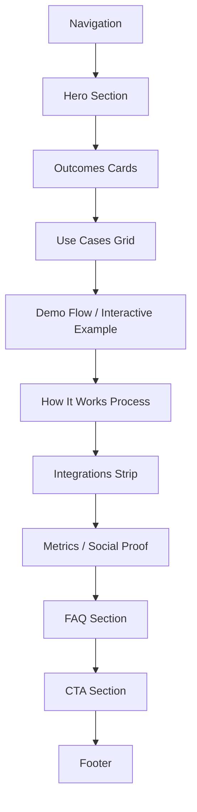
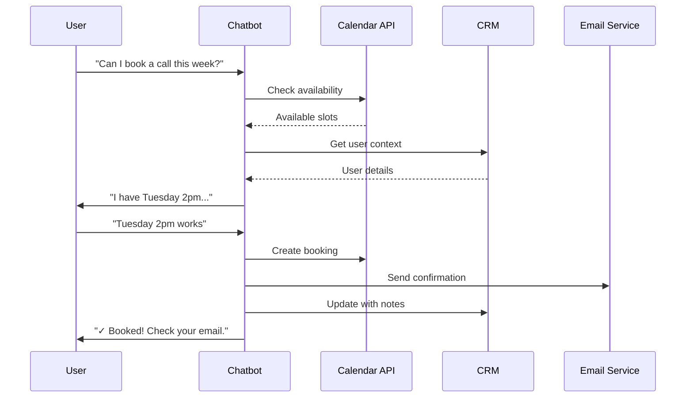

# Service Detail Page - Complete Design Specification

**Page:** Service Detail Template (Reusable)  
**Route:** `/services/:slug`  
**Priority:** 🔥 P0 (Core)  
**Status:** Ready for design implementation

---

## 📋 Page Overview

**Purpose:** Convert service-interested visitors into qualified leads by demonstrating value, showing real examples, and providing clear next steps.

**Key Goals:**
1. Explain the service clearly with outcomes focus
2. Show real-world use cases and examples
3. Demonstrate technical capabilities without jargon
4. Build trust through process transparency
5. Drive conversions to wizard or booking
6. Answer common objections preemptively

**Target Audiences:**
- Decision-makers evaluating specific service
- Technical evaluators assessing capabilities
- Stakeholders comparing against alternatives
- Budget holders understanding scope/timeline

---

## 🎯 Service Detail Pages to Create

Each service gets its own page using this template:

| Service | Route | Primary Outcome | Key Visual |
|---------|-------|-----------------|------------|
| **AI Chatbots** | `/services/ai-chatbots` | Qualify, sell, support 24/7 | Chat conversation flow |
| **AI Agents** | `/services/ai-agents` | Autonomous task execution | Multi-agent workflow |
| **Automations** | `/services/automations` | Connect tools, eliminate manual work | Trigger→Action→Result |
| **Dashboards & Ops** | `/services/dashboards` | Real-time operational visibility | KPI dashboard preview |
| **Data & RAG** | `/services/data-rag` | AI that knows your business | Knowledge base + search |
| **Custom Development** | `/services/custom-apis` | Tailored solutions | API architecture |

---

## 🎯 User Journey Flow

```mermaid
graph TD
    A[Land from Services Grid] --> B[Read Hero + Outcome]
    B --> C{Interested?}
    C -->|No| D[Scroll to Learn More]
    C -->|Yes| E[Click Start Brief]
    
    D --> F[View Use Cases]
    F --> G[Watch Demo/See Flow]
    G --> H[Check Integrations]
    H --> I[Read How It Works]
    I --> J{Convinced?}
    
    J -->|Yes| K[Start Brief]
    J -->|Maybe| L[Book Call]
    J -->|Need Proof| M[View Case Study]
    
    M --> K
    
    E --> N[/wizard]
    K --> N
    L --> O[/booking]
    
    style N fill:#d1fae5
    style O fill:#dbeafe
```

---

## 🎨 Design System Requirements

### Visual Language
- **Hero Treatment:** Large illustrated scene showing service in action
- **Use Cases:** Screenshot + annotation style (Figma-like callouts)
- **Demo Flow:** Step-by-step with animated connectors
- **Integration Strip:** Logo carousel with tooltips
- **Trust Signals:** Metrics, timelines, customer quotes
- **CTA Placement:** Above fold + bottom of page

### Color by Service Type
```css
/* Service-specific accent colors */
--chatbots-accent: #3b82f6;    /* Blue */
--agents-accent: #f59e0b;      /* Amber */
--automations-accent: #10b981; /* Green */
--dashboards-accent: #ec4899;  /* Pink */
--data-accent: #6366f1;        /* Indigo */
--custom-accent: #f97316;      /* Orange */
```

---

## 📐 Page Structure

### Section Hierarchy



---

## 📐 Section 1: Hero Section

**Component:** `ServiceDetailHero`

**Desktop Layout (1440px):**
```
┌────────────────────────────────────────────────────────┐
│  [← Back to Services]                                  │
│                                                         │
│  [Left Column - 50%]         [Right Column - 50%]     │
│                                                         │
│  EYEBROW: "AI CHATBOTS"      ┌─────────────────────┐  │
│  (+ service type badge)      │                     │  │
│                               │  [Large Illustrated │  │
│  HEADLINE:                   │   Scene showing     │  │
│  "AI chat that qualifies,    │   service in        │  │
│   sells, and supports—       │   action]           │  │
│   24/7."                     │                     │  │
│                               │  Example: Chat      │  │
│  SUBTEXT:                    │  bubbles with real  │  │
│  "Turn website visitors      │  conversation,      │  │
│   into qualified leads        │  tool calls, and   │  │
│   while you sleep."          │  handoff to human   │  │
│                               │                     │  │
│  TIMELINE: "7-14 days avg"   └─────────────────────┘  │
│  STARTING: "From $5k"                                  │
│                                                         │
│  [Start Brief →]                                       │
│  [Book Expert Call]                                    │
│  [View Pricing]                                        │
└────────────────────────────────────────────────────────┘
```

**Typography:**
- Eyebrow: 14px, uppercase, service accent color
- Headline: 56px (desktop), 700 weight, line-height 1.1
- Subtext: 18px, 400 weight, neutral-600
- Timeline: 16px, 600 weight with clock icon
- Pricing: 16px, 600 weight with dollar icon

**Illustrated Scene Specifications:**

### For AI Chatbots:
```
┌─────────────────────────────┐
│  Chat Widget Preview        │
│                             │
│  User: "Can I book a call?" │
│  Bot: "Sure! I have these   │
│       slots available..."   │
│  [Shows calendar picker]    │
│                             │
│  User: "Tuesday 2pm works"  │
│  Bot: ✓ "Booked! I'll send  │
│       confirmation + prep." │
│                             │
│  [Tool Call Indicator:]     │
│  → Checked calendar         │
│  → Created booking          │
│  → Sent email              │
└─────────────────────────────┘
```

### For AI Agents:
```
┌─────────────────────────────┐
│  Agent Orchestration        │
│                             │
│  [Planner Agent]            │
│  ↓ Creates roadmap          │
│  [Operator Agent]           │
│  ↓ Executes tasks           │
│  [Analyst Agent]            │
│  ↓ Checks quality           │
│  [Output: Dashboard]        │
└─────────────────────────────┘
```

### For Automations:
```
┌─────────────────────────────┐
│  Automation Flow            │
│                             │
│  Trigger: New lead          │
│    ↓                        │
│  Action 1: Add to CRM       │
│    ↓                        │
│  Action 2: Send WhatsApp    │
│    ↓                        │
│  Action 3: Notify team      │
│    ↓                        │
│  Result: Lead qualified     │
└─────────────────────────────┘
```

**Hover Interaction:**
- Illustrated scene animates (subtle motion)
- Tool call indicators pulse
- Connector lines draw sequentially

**Responsive (Mobile 375px):**
- Single column layout
- Illustration moves below text
- Headline: 36px
- CTAs stack vertically

---

## 📐 Section 2: Outcomes Cards

**Component:** `OutcomesGrid`

**Desktop Layout:**
```
┌────────────────────────────────────────────────────────┐
│  SECTION HEADLINE:                                     │
│  "What you get"                                        │
│                                                         │
│  ┌──────────┐    ┌──────────┐    ┌──────────┐        │
│  │ [Icon]   │    │ [Icon]   │    │ [Icon]   │        │
│  │          │    │          │    │          │        │
│  │ Outcome  │    │ Outcome  │    │ Outcome  │        │
│  │ Title    │    │ Title    │    │ Title    │        │
│  │          │    │          │    │          │        │
│  │ Metric   │    │ Metric   │    │ Metric   │        │
│  │ +34%     │    │ -28%     │    │ 24/7     │        │
│  │ increase │    │ reduction│    │ uptime   │        │
│  │          │    │          │    │          │        │
│  │ [Chart]  │    │ [Chart]  │    │ [Chart]  │        │
│  └──────────┘    └──────────┘    └──────────┘        │
└────────────────────────────────────────────────────────┘
```

### Example Outcomes by Service:

**AI Chatbots:**
1. **Lead Qualification**
   - Metric: "+34% qualified leads"
   - Chart: Upward trend line
   - Icon: Funnel with checkmark

2. **Support Deflection**
   - Metric: "-28% support tickets"
   - Chart: Downward trend line
   - Icon: Shield with minus

3. **24/7 Availability**
   - Metric: "24/7 uptime"
   - Chart: Clock with checkmark
   - Icon: Clock

**AI Agents:**
1. **Task Automation**
   - Metric: "15 hrs/week saved"
   - Icon: Robot

2. **Accuracy**
   - Metric: "99.2% accuracy"
   - Icon: Target

3. **Scale**
   - Metric: "10x more tasks"
   - Icon: Growth arrow

**Card Specifications:**
- Width: 33.33% (desktop)
- Padding: 32px
- Background: White
- Border: 1px solid neutral-200
- Border-radius: 16px
- Icon: 48px, service accent color
- Metric: 32px, 700 weight
- Chart: 120px × 60px, animated on scroll

---

## 📐 Section 3: Use Cases Grid

**Component:** `UseCasesGrid`

**Desktop Layout:**
```
┌────────────────────────────────────────────────────────┐
│  SECTION HEADLINE:                                     │
│  "Real-world examples"                                 │
│                                                         │
│  ┌─────────────────────┐  ┌─────────────────────┐    │
│  │ USE CASE 1          │  │ USE CASE 2          │    │
│  │                     │  │                     │    │
│  │ [Screenshot with    │  │ [Screenshot with    │    │
│  │  annotations]       │  │  annotations]       │    │
│  │                     │  │                     │    │
│  │ SCENARIO:           │  │ SCENARIO:           │    │
│  │ "Customer asks..."  │  │ "Lead needs..."     │    │
│  │                     │  │                     │    │
│  │ ACTION:             │  │ ACTION:             │    │
│  │ "Bot responds..."   │  │ "Agent creates..."  │    │
│  │                     │  │                     │    │
│  │ RESULT:             │  │ RESULT:             │    │
│  │ "Booking created"   │  │ "Task scheduled"    │    │
│  └─────────────────────┘  └─────────────────────┘    │
│                                                         │
│  ┌─────────────────────┐  ┌─────────────────────┐    │
│  │ USE CASE 3          │  │ USE CASE 4          │    │
│  │ [Similar...]        │  │ [Similar...]        │    │
│  └─────────────────────┘  └─────────────────────┘    │
└────────────────────────────────────────────────────────┘
```

### Example Use Cases by Service:

**AI Chatbots:**

**Use Case 1: Lead Qualification**
```
Scenario: "Can I book a demo this week?"
Action: Bot checks calendar, asks qualifying questions
Result: Meeting booked + lead scored + CRM updated
Tools used: Calendar API, CRM, Email
```

**Use Case 2: Product Recommendation**
```
Scenario: "Which plan fits my team size?"
Action: Bot asks 2-3 questions, analyzes needs
Result: Plan recommended with reasoning + pricing
Tools used: Knowledge base, Pricing calculator
```

**Use Case 3: Support Deflection**
```
Scenario: "How do I integrate with Stripe?"
Action: Bot searches docs, provides step-by-step
Result: Issue resolved without human support
Tools used: Documentation search, Code snippets
```

**Use Case 4: Handoff to Human**
```
Scenario: "I need custom enterprise pricing"
Action: Bot collects context, notifies sales team
Result: Sales rep joins chat with full context
Tools used: CRM, Slack notification, Handoff protocol
```

**Card Specifications:**
- Width: 50% (desktop), 100% (mobile)
- Aspect ratio: 4:3
- Screenshot: Placeholder with realistic UI
- Annotations: Arrow callouts with labels
- Padding: 24px
- Background: Subtle gradient
- Border-radius: 12px

**Annotation Style:**
```
┌─────────────────┐
│  [Screenshot]   │ ←── "Calendar API called"
│                 │
│  [Action area]  │ ←── "Lead score calculated"
│                 │
│  [Result]       │ ←── "CRM auto-updated"
└─────────────────┘
```

---

## 📐 Section 4: Demo Flow / Interactive Example

**Component:** `DemoFlow`

**Desktop Layout:**
```
┌────────────────────────────────────────────────────────┐
│  SECTION HEADLINE:                                     │
│  "See it in action"                                    │
│                                                         │
│  [Tabbed Interface]                                    │
│  [Step 1] [Step 2] [Step 3] [Step 4]                  │
│                                                         │
│  ┌──────────────────────────────────────────────────┐ │
│  │  STEP 1: User Input                              │ │
│  │                                                   │ │
│  │  [Visual showing user question/trigger]          │ │
│  │  "Can I book a call this week?"                  │ │
│  │                                                   │ │
│  └──────────────────────────────────────────────────┘ │
│                         ↓                              │
│  ┌──────────────────────────────────────────────────┐ │
│  │  STEP 2: AI Processing                           │ │
│  │                                                   │ │
│  │  [Visual showing tool calls]                     │ │
│  │  → Checking calendar availability                │ │
│  │  → Retrieving user context from CRM             │ │
│  │  → Generating response                           │ │
│  │                                                   │ │
│  └──────────────────────────────────────────────────┘ │
│                         ↓                              │
│  ┌──────────────────────────────────────────────────┐ │
│  │  STEP 3: Response                                │ │
│  │                                                   │ │
│  │  [Visual showing bot response]                   │ │
│  │  "I have Tuesday 2pm and Thursday 10am available"│ │
│  │  [Calendar picker UI]                            │ │
│  │                                                   │ │
│  └──────────────────────────────────────────────────┘ │
│                         ↓                              │
│  ┌──────────────────────────────────────────────────┐ │
│  │  STEP 4: Action Taken                            │ │
│  │                                                   │ │
│  │  [Visual showing outcomes]                       │ │
│  │  ✓ Meeting booked                                │ │
│  │  ✓ Confirmation email sent                       │ │
│  │  ✓ CRM updated with notes                        │ │
│  │                                                   │ │
│  └──────────────────────────────────────────────────┘ │
└────────────────────────────────────────────────────────┘
```

**Mermaid Flow:**


**Interactive States:**
- Tabs: Click to jump to specific step
- Auto-play: Steps animate sequentially (optional)
- Hover: Highlight tool calls and API connections
- Progress: Show which step is active

**Responsive (Mobile):**
- Steps stack vertically
- Remove tabs, use scroll-triggered reveals
- Connector arrows adjust to vertical

---

## 📐 Section 5: How It Works Process

**Component:** `ProcessTimeline`

**Desktop Layout:**
```
┌────────────────────────────────────────────────────────┐
│  SECTION HEADLINE:                                     │
│  "From brief to launch"                                │
│                                                         │
│  ┌────────┐ ───→ ┌────────┐ ───→ ┌────────┐ ───→    │
│  │ Day 1  │      │ Day 2  │      │ Week 1 │          │
│  │        │      │        │      │        │          │
│  │ Brief  │      │ Design │      │ Build  │          │
│  │        │      │        │      │        │          │
│  │ • Tell │      │ • AI   │      │ • Code │          │
│  │   us   │      │   maps │      │ • Test │          │
│  │   what │      │   flow │      │ • Iter │          │
│  │   you  │      │ • We   │      │   ate  │          │
│  │   need │      │   send │      │        │          │
│  │        │      │   spec │      │        │          │
│  └────────┘      └────────┘      └────────┘          │
│                                                         │
│  ┌────────┐                                           │
│  │ Week 2 │                                           │
│  │        │                                           │
│  │ Launch │                                           │
│  │        │                                           │
│  │ • QA   │                                           │
│  │ • Deploy│                                          │
│  │ • Train│                                           │
│  │ • Hand │                                           │
│  │   off  │                                           │
│  └────────┘                                           │
└────────────────────────────────────────────────────────┘
```

**Timeline Specifications:**
- Card width: 200px
- Connector: Dashed line with arrow
- Icon: Service-specific (chat bubble, robot, workflow)
- Duration: Bold, accent color
- Activities: Bullet list, 14px
- Animation: Draw connectors on scroll

---

## 📐 Section 6: Integrations Strip

**Component:** `IntegrationsStrip`

**Desktop Layout:**
```
┌────────────────────────────────────────────────────────┐
│  SECTION HEADLINE:                                     │
│  "Works with your stack"                               │
│                                                         │
│  [Logo] [Logo] [Logo] [Logo] [Logo] [Logo] [Logo]    │
│  OpenAI Supabase Stripe WhatsApp n8n Webflow Claude  │
│                                                         │
│  + 20 more integrations                                │
└────────────────────────────────────────────────────────┘
```

**Logo Specifications:**
- Size: 40px height, auto width
- Filter: Grayscale 100% (default)
- Hover: Grayscale 0% (full color)
- Tooltip: Shows integration name + capability
- Spacing: 48px between logos

**Example Tooltip:**
```
┌─────────────────────┐
│ OpenAI GPT-4        │
│ Natural language    │
│ understanding +     │
│ function calling    │
└─────────────────────┘
```

**Integrations by Service:**

**AI Chatbots:**
- OpenAI, Claude, Perplexity (LLMs)
- Supabase (Database)
- Stripe (Payments)
- Webflow (Embedding)
- Calendly (Scheduling)
- HubSpot, Salesforce (CRM)

**AI Agents:**
- OpenAI, Claude (LLMs)
- LangChain, LangGraph, CrewAI (Frameworks)
- Supabase (State management)
- n8n, Make.com (Orchestration)
- Slack, Email (Notifications)

**Automations:**
- n8n, Make.com, Zapier (Platforms)
- WhatsApp, Telegram (Messaging)
- Stripe (Payments)
- Supabase (Database)
- Webhooks (Custom integrations)

---

## 📐 Section 7: Metrics / Social Proof

**Component:** `SocialProof`

**Desktop Layout:**
```
┌────────────────────────────────────────────────────────┐
│  "Trusted by 40+ companies"                            │
│                                                         │
│  ┌──────────┐    ┌──────────┐    ┌──────────┐        │
│  │ 92%      │    │ 7 days   │    │ 4.9 ⭐   │        │
│  │ On-time  │    │ Avg      │    │ Rating   │        │
│  │ delivery │    │ delivery │    │          │        │
│  └──────────┘    └──────────┘    └──────────┘        │
│                                                         │
│  ┌────────────────────────────────────────────────┐   │
│  │ TESTIMONIAL:                                   │   │
│  │                                                 │   │
│  │ "The chatbot qualified 300+ leads in the      │   │
│  │  first month. Our sales team only talks to    │   │
│  │  serious buyers now."                          │   │
│  │                                                 │   │
│  │  — Sarah Chen, Head of Growth @ SaaS Co       │   │
│  │  [Photo] [Logo]                                │   │
│  └────────────────────────────────────────────────┘   │
└────────────────────────────────────────────────────────┘
```

**Testimonial Specifications:**
- Background: Gradient (neutral-50 to white)
- Padding: 40px
- Border-radius: 16px
- Quote: 20px, italic, neutral-700
- Attribution: 16px, 600 weight
- Photo: 56px circle
- Logo: 80px width, grayscale

---

## 📐 Section 8: FAQ Section

**Component:** `FAQ/Accordion`

**Desktop Layout:**
```
┌────────────────────────────────────────────────────────┐
│  SECTION HEADLINE:                                     │
│  "Common questions"                                    │
│                                                         │
│  ┌──────────────────────────────────────────────────┐ │
│  │ How long does it take? [+]                       │ │
│  └──────────────────────────────────────────────────┘ │
│                                                         │
│  ┌──────────────────────────────────────────────────┐ │
│  │ What if we need changes? [-]                     │ │
│  │                                                   │ │
│  │ We include 2 weeks of revisions. After that,    │ │
│  │ we offer maintenance plans starting at $500/mo. │ │
│  └──────────────────────────────────────────────────┘ │
│                                                         │
│  ┌──────────────────────────────────────────────────┐ │
│  │ Do you provide training? [+]                     │ │
│  └──────────────────────────────────────────────────┘ │
│                                                         │
│  [View All FAQs →]                                     │
└────────────────────────────────────────────────────────┘
```

### Example FAQs by Service:

**AI Chatbots:**
1. How long does it take? → 7-14 days average
2. What if we need changes? → 2 weeks revisions included
3. Do you provide training? → Yes, 1-hour session + docs
4. Can we customize the look? → Yes, matches your brand
5. What platforms does it work on? → Webflow, WordPress, React, any site

**FAQ Accordion Specs:**
- Closed height: 64px
- Open: Auto height (smooth transition)
- Icon: Rotate 180° when open
- Background: White (closed), Neutral-50 (open)
- Border: 1px solid neutral-200
- Spacing: 16px gap between items

---

## 📐 Section 9: CTA Section

**Component:** `CTA/ServiceDetail`

**Desktop Layout:**
```
┌────────────────────────────────────────────────────────┐
│  HEADLINE:                                             │
│  "Ready to get started?"                               │
│                                                         │
│  SUBTEXT:                                              │
│  "Tell us what you need. Get a proposal in 24 hours." │
│                                                         │
│  [Start Brief (15 min) →]                              │
│  [Book a Call]                                         │
│  [View Pricing]                                        │
│                                                         │
│  "Or view other services" →                            │
└────────────────────────────────────────────────────────┘
```

**Background:** Service accent color (10% opacity)
**Padding:** 120px vertical
**Button Hierarchy:**
- Primary: Start Brief (largest, accent color)
- Secondary: Book a Call (outlined)
- Tertiary: View Pricing (text link)

**Routes:**
- Start Brief → `/wizard` (with service pre-selected)
- Book a Call → `/booking`
- View Pricing → `/pricing#[service-name]`
- Other services → `/services`

---

## 🔗 Route Map

```mermaid
graph TD
    SERVICES[/services] --> DETAIL[/services/:slug]
    
    DETAIL --> WIZARD[/wizard?service=:slug]
    DETAIL --> BOOKING[/booking?service=:slug]
    DETAIL --> PRICING[/pricing]
    DETAIL --> CASE[/case-studies?filter=:slug]
    DETAIL --> BACK[Back to /services]
    
    WIZARD --> THANK_YOU[Wizard completion]
    BOOKING --> CONFIRM[Booking confirmation]
    
    style WIZARD fill:#d1fae5
    style BOOKING fill:#dbeafe
```

---

## 📱 Responsive Breakpoints

### Desktop (1440px+)
- Hero: 50/50 split (text/visual)
- Outcomes: 3-column grid
- Use Cases: 2×2 grid
- Demo Flow: Horizontal tabs

### Tablet (768-1024px)
- Hero: 60/40 split
- Outcomes: 2-column grid (3rd wraps)
- Use Cases: 2-column grid
- Demo Flow: Horizontal tabs (smaller)

### Mobile (375-767px)
- Hero: Single column, visual below text
- Outcomes: Single column stacked
- Use Cases: Single column
- Demo Flow: Vertical steps (no tabs)
- All CTAs: 100% width, stacked

---

## 🎬 Animation Specifications

### On Load
1. Hero illustration fades in with scale (0.95 → 1)
2. Text elements stagger in (0.1s delay each)
3. CTAs scale in

### On Scroll (Intersection Observer)
- Outcomes cards: Stagger in from bottom
- Charts: Count up animation when visible
- Use case screenshots: Fade in with annotations appearing sequentially
- Demo flow: Steps reveal as you scroll
- Timeline connectors: Draw from left to right
- Integration logos: Fade in sequentially

### Hover States
- Hero visual: Subtle parallax on mouse move
- Outcome cards: Lift + border glow
- Use case cards: Lift + annotation highlights
- Demo flow tabs: Underline animation
- Integration logos: Grayscale → Color transition
- FAQ items: Background color shift
- CTAs: Lift + shadow intensify

---

## ✅ Component Checklist

### Must Create
- [ ] `ServiceDetailHero` with illustrated scene (6 variants)
- [ ] `OutcomesGrid` (3-column)
- [ ] `OutcomeCard` with chart animation
- [ ] `UseCasesGrid` (2×2)
- [ ] `UseCaseCard` with screenshot + annotations
- [ ] `DemoFlow` with tabbed interface
- [ ] `ProcessTimeline` with 4 steps
- [ ] `IntegrationsStrip` with 12+ logos
- [ ] `SocialProof` with testimonial
- [ ] `FAQ/Accordion` (5-6 questions)
- [ ] `CTA/ServiceDetail`

### States Required
- [ ] Hero: default, animated
- [ ] Outcome cards: default, hover, animated chart
- [ ] Use case cards: default, hover, annotations sequence
- [ ] Demo tabs: inactive, active, hover
- [ ] FAQ: collapsed, expanded, hover
- [ ] CTAs: default, hover, loading

### Illustrations Needed (6 unique)
- [ ] AI Chatbots: Chat conversation with tool calls
- [ ] AI Agents: Multi-agent orchestration
- [ ] Automations: Trigger-action-result flow
- [ ] Dashboards: KPI dashboard preview
- [ ] Data/RAG: Knowledge base with search
- [ ] Custom APIs: Architecture diagram

---

## 🎨 Figma Make AI Prompt (Ready to Paste)

```
Create a luxury service detail page for "AI Chatbots" (reusable template for 6 services).

PAGE STRUCTURE (Desktop 1440px):

1. HERO SECTION (50/50 split):
   Left side:
   - Back link: "← Back to Services"
   - Eyebrow: "AI CHATBOTS" (blue accent)
   - Headline: "AI chat that qualifies, sells, and supports—24/7."
   - Subtext: "Turn website visitors into qualified leads while you sleep."
   - Timeline badge: "7-14 days avg"
   - Pricing badge: "From $5k"
   - Three CTAs: Start Brief (primary), Book Expert Call (secondary), View Pricing (link)
   
   Right side:
   - Large illustrated scene showing chatbot conversation
   - Chat bubbles with real dialogue:
     User: "Can I book a call this week?"
     Bot: "Sure! I have Tuesday 2pm and Thursday 10am available."
     [Shows calendar picker]
   - Tool call indicators showing: Calendar API, CRM update, Email sent
   - Subtle animation: messages appear sequentially

2. OUTCOMES SECTION (3 cards):
   Card 1: Lead Qualification
   - Icon: Funnel with checkmark (blue)
   - Metric: "+34% qualified leads"
   - Small chart: Upward trend line
   
   Card 2: Support Deflection
   - Icon: Shield with minus
   - Metric: "-28% support tickets"
   - Small chart: Downward trend line
   
   Card 3: 24/7 Availability
   - Icon: Clock
   - Metric: "24/7 uptime"
   - Small chart: Uptime indicator

3. USE CASES SECTION (2×2 grid):
   Create 4 use case cards, each with:
   - Screenshot placeholder with annotations
   - Scenario: User question
   - Action: What bot does
   - Result: Outcome achieved
   - Tools used: API icons
   
   Example use case 1:
   Scenario: "Can I book a demo this week?"
   Action: Bot checks calendar, asks qualifying questions
   Result: Meeting booked + lead scored + CRM updated
   Tools: Calendar API, CRM, Email

4. DEMO FLOW (Tabbed interface):
   Create 4 step tabs showing:
   Step 1: User Input → "Can I book a call?"
   Step 2: AI Processing → Shows tool calls (Calendar check, CRM lookup)
   Step 3: Response → Bot shows available times
   Step 4: Action Taken → Meeting booked, email sent, CRM updated
   
   Connector arrows between steps

5. HOW IT WORKS TIMELINE (4 steps):
   Day 1: Brief → Tell us what you need
   Day 2: Design → AI maps flow, we send spec
   Week 1: Build → Code, test, iterate
   Week 2: Launch → QA, deploy, train, handoff
   
   Connected with dashed arrows

6. INTEGRATIONS STRIP:
   Logo carousel showing: OpenAI, Supabase, Stripe, WhatsApp, n8n, Webflow, Claude
   Logos grayscale by default, color on hover
   Caption: "+ 20 more integrations"

7. SOCIAL PROOF SECTION:
   3 metric cards: "92% on-time delivery", "7 days avg", "4.9 ⭐ rating"
   Testimonial card with quote, photo, name, title, company logo

8. FAQ ACCORDION (5 questions):
   - How long does it take?
   - What if we need changes?
   - Do you provide training?
   - Can we customize the look?
   - What platforms does it work on?
   
   First question open by default, others closed

9. CTA SECTION:
   Headline: "Ready to get started?"
   Subtext: "Tell us what you need. Get a proposal in 24 hours."
   Three CTAs: Start Brief, Book a Call, View Pricing
   Link: "Or view other services →"

DESIGN STYLE:
- Luxury SaaS aesthetic
- Service accent color: Blue (#3b82f6) for chatbots
- Illustrated hero scene (not flat icons)
- Screenshot annotations with arrow callouts
- Animated charts in outcome cards
- Smooth accordion transitions
- Generous whitespace

RESPONSIVE:
- Desktop: 50/50 hero split, 3-column outcomes, 2×2 use cases
- Tablet: 60/40 hero, 2-column outcomes
- Mobile: Single column all sections, hero visual below text

INTERACTIONS:
- Hero scene: Subtle animation (messages appear)
- Outcome charts: Count up when scrolled into view
- Use case annotations: Appear sequentially on hover
- Demo flow tabs: Click to switch steps
- Integration logos: Grayscale → color on hover
- FAQ: Smooth expand/collapse (0.3s ease)
- Timeline connectors: Draw on scroll

ROUTES (prototype):
- Back → /services
- Start Brief → /wizard?service=ai-chatbots
- Book Call → /booking?service=ai-chatbots
- View Pricing → /pricing#chatbots
- View All FAQs → /pricing#faq
- Other services → /services
```

**TEMPLATE NOTE:** Create this for AI Chatbots, then duplicate and customize for:
- AI Agents (amber accent, workflow illustration)
- Automations (green accent, trigger-action flow)
- Dashboards (pink accent, KPI preview)
- Data/RAG (indigo accent, knowledge base)
- Custom APIs (orange accent, architecture diagram)

---

**Status:** ✅ Complete specification ready for Figma Make AI implementation  
**Next Step:** Create base template for AI Chatbots → Duplicate → Customize for other 5 services
