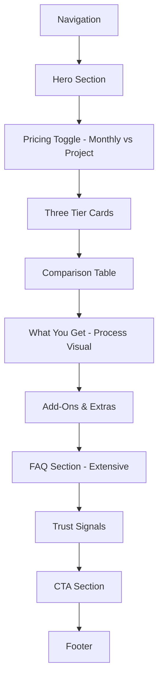
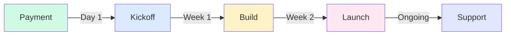

# Pricing Page - Complete Design Specification

**Page:** Pricing & Plans  
**Route:** `/pricing`  
**Priority:** 🔥 P0 (Core)  
**Status:** Ready for design implementation

---

## 📋 Page Overview

**Purpose:** Provide transparent pricing that builds trust and drives conversions to wizard or booking based on project complexity.

**Key Goals:**
1. Make pricing immediately understandable
2. Guide users to appropriate tier
3. Answer pricing objections preemptively
4. Show value, not just cost
5. Provide multiple conversion paths
6. Build trust through transparency

**Target Audiences:**
- Budget holders evaluating costs
- Decision-makers comparing against alternatives
- Procurement teams needing documentation
- Finance teams requiring clear breakdowns

---

## 🎯 User Journey Flow

```mermaid
graph TD
    A[Land on Pricing Page] --> B[Scan Tier Cards]
    B --> C{Know Which Tier?}
    
    C -->|Yes| D[Click Tier CTA]
    C -->|No| E[Scroll to Comparison Table]
    
    E --> F[Compare Features]
    F --> G{Decision Made?}
    
    G -->|Yes| D
    G -->|Still Unsure| H[Read FAQ]
    
    H --> I{Convinced?}
    I -->|Yes| D
    I -->|Need Help| J[Book Call]
    
    D --> K{Which CTA?}
    K -->|Start Brief| L[/wizard]
    K -->|Talk to Us| J
    
    J --> M[/booking]
    
    style L fill:#d1fae5
    style M fill:#dbeafe
```

---

## 🎨 Design System Requirements

### Visual Language
- **Pricing Cards:** Editorial luxury, not SaaS template
- **Comparison Table:** Clean, scannable (not cluttered)
- **Mobile Solution:** Accordion, not tiny table
- **Trust Signals:** Money-back guarantee, flexibility badges
- **Value Props:** Outcomes, not features
- **CTA Hierarchy:** Clear primary vs secondary

### Pricing Psychology
- Show value before price
- Use "Starting from" for flexibility
- Highlight most popular tier
- Include "what's included" not just features
- Money-back guarantee visible
- No hidden fees messaging

---

## 📐 Page Structure

### Section Hierarchy



---

## 📐 Section 1: Hero Section

**Component:** `PricingHero`

**Desktop Layout (1440px):**
```
┌────────────────────────────────────────────────────────┐
│  EYEBROW: "PRICING"                                    │
│                                                         │
│  HEADLINE:                                             │
│  "Clear pricing. No surprises."                        │
│                                                         │
│  SUBTEXT:                                              │
│  "Get a proposal in 24 hours. Pay only when you're    │
│   100% satisfied with the plan."                       │
│                                                         │
│  TRUST BADGES:                                         │
│  ✓ 14-day money-back guarantee                        │
│  ✓ No hidden fees                                     │
│  ✓ Flexible payment plans                             │
└────────────────────────────────────────────────────────┘
```

**Typography:**
- Eyebrow: 14px, uppercase, accent color
- Headline: 56px, 700 weight, line-height 1.1
- Subtext: 20px, 400 weight, neutral-600
- Trust badges: 16px, checkmark icon, neutral-700

---

## 📐 Section 2: Pricing Toggle

**Component:** `PricingToggle`

**Desktop Layout:**
```
┌────────────────────────────────────────────────────────┐
│                                                         │
│          [Monthly Retainer] ⚪ [Project-Based]         │
│                                                         │
└────────────────────────────────────────────────────────┘
```

**Toggle Specifications:**
- Width: 320px
- Height: 48px
- Background: Neutral-100
- Selected: Accent color (blue)
- Border-radius: 12px
- Transition: 0.3s ease
- Position: Centered above pricing cards

**States:**
- **Monthly Retainer:** Ongoing support and maintenance
- **Project-Based:** One-time build with handoff

**Content Changes:**
When toggled, pricing cards update to show:
- Monthly: "$500/mo - $5k/mo" ranges
- Project: "$5k - $50k" ranges

---

## 📐 Section 3: Pricing Tier Cards

**Component:** `PricingTierCard`

**Desktop Layout (1440px):**
```
┌────────────────────────────────────────────────────────┐
│  ┌──────────┐    ┌──────────┐    ┌──────────┐        │
│  │ STARTER  │    │ GROWTH   │    │ENTERPRISE│        │
│  │          │    │ [Popular]│    │          │        │
│  │ $5k-15k  │    │ $15k-50k │    │ Custom   │        │
│  │          │    │          │    │          │        │
│  │ For...   │    │ For...   │    │ For...   │        │
│  │          │    │          │    │          │        │
│  │ Includes │    │ Includes │    │ Includes │        │
│  │ • Item   │    │ • Item   │    │ • Item   │        │
│  │ • Item   │    │ • Item   │    │ • Item   │        │
│  │ • Item   │    │ • Item   │    │ • Item   │        │
│  │          │    │          │    │          │        │
│  │ Timeline │    │ Timeline │    │ Timeline │        │
│  │ 1-2 wks  │    │ 2-4 wks  │    │ 4+ wks   │        │
│  │          │    │          │    │          │        │
│  │ [Start   │    │ [Start   │    │ [Book    │        │
│  │  Brief]  │    │  Brief]  │    │  Call]   │        │
│  │          │    │          │    │          │        │
│  │ [Talk    │    │ [Talk    │    │          │        │
│  │  to Us]  │    │  to Us]  │    │          │        │
│  └──────────┘    └──────────┘    └──────────┘        │
└────────────────────────────────────────────────────────┘
```

### Tier Specifications

**STARTER TIER:**
```
┌─────────────────────────────┐
│ STARTER                     │
│                             │
│ $5k - $15k                 │
│ (Project-Based)             │
│                             │
│ FOR:                        │
│ • Small teams               │
│ • Single use case           │
│ • Quick validation          │
│                             │
│ INCLUDES:                   │
│ ✓ AI Chatbot OR Automation  │
│ ✓ 1 integration             │
│ ✓ Basic dashboard           │
│ ✓ 2 weeks support           │
│ ✓ Documentation             │
│ ✓ 1 training session        │
│                             │
│ TIMELINE: 1-2 weeks         │
│                             │
│ DELIVERABLES:               │
│ • Production deployment     │
│ • Source code               │
│ • User guide                │
│                             │
│ [Start Brief →]             │
│ [Talk to Us]                │
└─────────────────────────────┘
```

**GROWTH TIER (Most Popular):**
```
┌─────────────────────────────┐
│ ⭐ MOST POPULAR              │
│                             │
│ GROWTH                      │
│                             │
│ $15k - $50k                │
│ (Project-Based)             │
│                             │
│ FOR:                        │
│ • Growing companies         │
│ • Multiple use cases        │
│ • Custom workflows          │
│                             │
│ INCLUDES:                   │
│ ✓ Multi-agent system        │
│ ✓ 3-5 integrations          │
│ ✓ Custom dashboard          │
│ ✓ 1 month support           │
│ ✓ Full documentation        │
│ ✓ Team training             │
│ ✓ Priority updates          │
│                             │
│ TIMELINE: 2-4 weeks         │
│                             │
│ DELIVERABLES:               │
│ • Multi-feature deployment  │
│ • Source code + tests       │
│ • Admin panel               │
│ • Analytics setup           │
│                             │
│ [Start Brief →]             │
│ [Talk to Us]                │
└─────────────────────────────┘
```

**ENTERPRISE TIER:**
```
┌─────────────────────────────┐
│ ENTERPRISE                  │
│                             │
│ Custom Pricing              │
│ (Contact Us)                │
│                             │
│ FOR:                        │
│ • Large organizations       │
│ • Complex requirements      │
│ • Security/compliance needs │
│                             │
│ INCLUDES:                   │
│ ✓ Everything in Growth      │
│ ✓ Unlimited integrations    │
│ ✓ Custom architecture       │
│ ✓ Dedicated support         │
│ ✓ SLA guarantees            │
│ ✓ Security audit            │
│ ✓ On-premise option         │
│ ✓ Multi-team training       │
│                             │
│ TIMELINE: 4+ weeks          │
│                             │
│ DELIVERABLES:               │
│ • Enterprise deployment     │
│ • Full source + tests       │
│ • Admin + analytics         │
│ • Compliance docs           │
│ • Ongoing maintenance       │
│                             │
│ [Book Call →]               │
└─────────────────────────────┘
```

**Card Design Specs:**
- Width: 33.33% (desktop), 100% (mobile)
- Padding: 40px 32px
- Background: White
- Border: 2px solid neutral-200
- Border-radius: 24px
- Shadow: 0 4px 24px rgba(0,0,0,0.06)

**Most Popular Badge:**
- Position: Absolute, top -12px
- Background: Accent color gradient
- Color: White
- Padding: 8px 24px
- Border-radius: 24px
- Font-size: 14px, 600 weight

**Hover State:**
- Lift: translateY(-8px)
- Shadow: 0 12px 40px rgba(0,0,0,0.12)
- Border: Accent color
- Scale buttons: 1.02

**CTA Hierarchy:**
- Primary: "Start Brief" (solid accent button)
- Secondary: "Talk to Us" (outlined button)
- Enterprise: "Book Call" (solid button, different color)

---

## 📐 Section 4: Comparison Table

**Component:** `PricingComparisonTable`

**Desktop Layout (1440px):**
```
┌──────────────────────────────────────────────────────────┐
│  SECTION HEADLINE:                                       │
│  "Compare features"                                      │
│                                                           │
│  ┌────────────────┬────────┬────────┬────────────┐      │
│  │ Feature        │ Starter│ Growth │ Enterprise │      │
│  ├────────────────┼────────┼────────┼────────────┤      │
│  │ BASICS         │        │        │            │      │
│  ├────────────────┼────────┼────────┼────────────┤      │
│  │ AI Model       │ GPT-4  │ GPT-4  │ Custom     │      │
│  │ Integrations   │ 1      │ 3-5    │ Unlimited  │      │
│  │ Support        │ 2 weeks│ 1 month│ Dedicated  │      │
│  │ Training       │ 1 hr   │ 3 hrs  │ Full team  │      │
│  ├────────────────┼────────┼────────┼────────────┤      │
│  │ FEATURES       │        │        │            │      │
│  ├────────────────┼────────┼────────┼────────────┤      │
│  │ Chatbot        │ ✓      │ ✓      │ ✓          │      │
│  │ Multi-agents   │ ✗      │ ✓      │ ✓          │      │
│  │ Automations    │ Basic  │ Advanced│ Custom    │      │
│  │ Dashboard      │ Basic  │ Custom │ Enterprise │      │
│  │ Analytics      │ ✗      │ ✓      │ Advanced   │      │
│  │ API access     │ ✗      │ ✓      │ ✓          │      │
│  ├────────────────┼────────┼────────┼────────────┤      │
│  │ SUPPORT        │        │        │            │      │
│  ├────────────────┼────────┼────────┼────────────┤      │
│  │ Email support  │ ✓      │ ✓      │ ✓          │      │
│  │ Slack channel  │ ✗      │ ✓      │ ✓          │      │
│  │ Priority queue │ ✗      │ ✗      │ ✓          │      │
│  │ SLA guarantee  │ ✗      │ ✗      │ ✓          │      │
│  │ Dedicated CSM  │ ✗      │ ✗      │ ✓          │      │
│  ├────────────────┼────────┼────────┼────────────┤      │
│  │ SECURITY       │        │        │            │      │
│  ├────────────────┼────────┼────────┼────────────┤      │
│  │ SSL encryption │ ✓      │ ✓      │ ✓          │      │
│  │ SSO            │ ✗      │ ✗      │ ✓          │      │
│  │ Audit logs     │ ✗      │ ✗      │ ✓          │      │
│  │ Custom hosting │ ✗      │ ✗      │ ✓          │      │
│  │ Compliance     │ ✗      │ ✗      │ SOC2/GDPR  │      │
│  └────────────────┴────────┴────────┴────────────┘      │
└──────────────────────────────────────────────────────────┘
```

**Table Specifications:**
- Sticky header row
- Category rows: Background neutral-100, bold
- Feature rows: Alternate white/neutral-50
- Checkmarks: Accent color, 20px
- X marks: Neutral-400, 20px
- Text values: Neutral-700, 14px
- Hover: Highlight entire row (neutral-50)

**Mobile Alternative (375px):**
Replace table with accordion:
```
┌─────────────────────────────┐
│ [Starter] ▼                 │
│                             │
│ • AI Model: GPT-4           │
│ • Integrations: 1           │
│ • Support: 2 weeks          │
│ • Training: 1 hour          │
│ • Chatbot: ✓                │
│ • Multi-agents: ✗           │
│ [... more features]         │
└─────────────────────────────┘

┌─────────────────────────────┐
│ [Growth] ▼                  │
└─────────────────────────────┘

┌─────────────────────────────┐
│ [Enterprise] ▼              │
└─────────────────────────────┘
```

---

## 📐 Section 5: What You Get - Process Visual

**Component:** `PricingProcess`

**Desktop Layout:**
```
┌────────────────────────────────────────────────────────┐
│  SECTION HEADLINE:                                     │
│  "What happens after you pay?"                         │
│                                                         │
│  ┌────────┐ ──→ ┌────────┐ ──→ ┌────────┐ ──→       │
│  │ Day 1  │     │ Week 1 │     │ Week 2 │           │
│  │        │     │        │     │        │           │
│  │ Kickoff│     │ Build  │     │ Launch │           │
│  │        │     │        │     │        │           │
│  │ • Spec │     │ • Code │     │ • QA   │           │
│  │   call │     │ • Test │     │ • Deploy│          │
│  │ • Setup│     │ • Daily│     │ • Train │          │
│  │   repo │     │   demo │     │ • Handoff│         │
│  └────────┘     └────────┘     └────────┘           │
│                                                         │
│  ┌────────┐                                           │
│  │ Ongoing│                                           │
│  │        │                                           │
│  │ Support│                                           │
│  │        │                                           │
│  │ • Bug  │                                           │
│  │   fixes│                                           │
│  │ • Minor│                                           │
│  │   tweaks│                                          │
│  │ • Docs │                                           │
│  └────────┘                                           │
└────────────────────────────────────────────────────────┘
```

**Mermaid Diagram:**


---

## 📐 Section 6: Add-Ons & Extras

**Component:** `AddOns`

**Desktop Layout:**
```
┌────────────────────────────────────────────────────────┐
│  SECTION HEADLINE:                                     │
│  "Need something extra?"                               │
│                                                         │
│  ┌──────────────┐  ┌──────────────┐  ┌──────────────┐│
│  │ Additional   │  │ Extended     │  │ Priority     ││
│  │ Integration  │  │ Support      │  │ Updates      ││
│  │              │  │              │  │              ││
│  │ $500-2k      │  │ $500/mo      │  │ $1k/mo       ││
│  │              │  │              │  │              ││
│  │ • API setup  │  │ • 24/7 help  │  │ • Feature    ││
│  │ • Testing    │  │ • Slack      │  │   requests   ││
│  │ • Docs       │  │ • Phone      │  │ • Fast fixes ││
│  └──────────────┘  └──────────────┘  └──────────────┘│
└────────────────────────────────────────────────────────┘
```

**Add-On Card Specs:**
- Width: 33.33%
- Padding: 32px 24px
- Background: Neutral-50
- Border: 1px solid neutral-200
- Border-radius: 16px

---

## 📐 Section 7: FAQ Section (Extensive)

**Component:** `FAQ/AccordionExtensive`

**Desktop Layout:**
```
┌────────────────────────────────────────────────────────┐
│  SECTION HEADLINE:                                     │
│  "Pricing questions answered"                          │
│                                                         │
│  ┌──────────────────────────────────────────────────┐ │
│  │ What payment methods do you accept? [-]          │ │
│  │                                                   │ │
│  │ We accept bank transfer, credit card, and       │ │
│  │ PayPal. For projects over $25k, we offer        │ │
│  │ milestone-based payment plans.                   │ │
│  │                                                   │ │
│  │ → See payment terms                              │ │
│  └──────────────────────────────────────────────────┘ │
│                                                         │
│  ┌──────────────────────────────────────────────────┐ │
│  │ How does the 14-day guarantee work? [+]         │ │
│  └──────────────────────────────────────────────────┘ │
│                                                         │
│  ┌──────────────────────────────────────────────────┐ │
│  │ Do you offer refunds? [+]                        │ │
│  └──────────────────────────────────────────────────┘ │
│                                                         │
│  [+ 15 more questions]                                 │
└────────────────────────────────────────────────────────┘
```

### FAQ Questions (20 total):

**PRICING:**
1. What payment methods do you accept?
2. How does the 14-day guarantee work?
3. Do you offer refunds?
4. Can I pay in installments?
5. Are there any hidden fees?
6. What happens if the project goes over budget?

**SCOPE:**
7. What's included in "support"?
8. How many revisions are included?
9. Can I upgrade my plan later?
10. What if I need something not in my tier?
11. Do you offer discounts for multiple projects?

**TIMELINE:**
12. How fast can you start?
13. What if you miss a deadline?
14. Can I get a fixed price quote?
15. Do timelines include weekends?

**TECHNICAL:**
16. Who owns the code?
17. Do you use third-party services?
18. What about API costs?
19. Can you work with our existing stack?

**SUPPORT:**
20. What happens after launch?

---

## 📐 Section 8: Trust Signals

**Component:** `TrustSignals`

**Desktop Layout:**
```
┌────────────────────────────────────────────────────────┐
│  ┌──────────┐    ┌──────────┐    ┌──────────┐        │
│  │ [Icon]   │    │ [Icon]   │    │ [Icon]   │        │
│  │          │    │          │    │          │        │
│  │ Money-   │    │ No Lock- │    │ Cancel   │        │
│  │ Back     │    │ In       │    │ Anytime  │        │
│  │          │    │          │    │          │        │
│  │ 14 days  │    │ Own your │    │ Full     │        │
│  │ full     │    │ code +   │    │ refund   │        │
│  │ refund   │    │ data     │    │ unused   │        │
│  └──────────┘    └──────────┘    └──────────┘        │
└────────────────────────────────────────────────────────┘
```

---

## 📐 Section 9: CTA Section

**Component:** `CTA/Pricing`

**Desktop Layout:**
```
┌────────────────────────────────────────────────────────┐
│  HEADLINE:                                             │
│  "Still not sure which tier is right?"                 │
│                                                         │
│  SUBTEXT:                                              │
│  "Start the brief. Our AI will recommend the right    │
│   solution and give you an exact quote in 24 hours."  │
│                                                         │
│  [Start Brief (15 min) →]    [Book Expert Call]       │
└────────────────────────────────────────────────────────┘
```

**Background:** Accent color (10% opacity)
**Padding:** 120px vertical

---

## 🔗 Route Map

```mermaid
graph TD
    PRICING[/pricing] --> WIZARD[/wizard]
    PRICING --> BOOKING[/booking]
    PRICING --> SERVICES[/services]
    
    WIZARD --> TIER_SELECT[Wizard with tier pre-selected]
    BOOKING --> CONSULT[Pricing consultation call]
    
    PRICING --> ANCHOR[Anchor links to FAQ sections]
    
    style WIZARD fill:#d1fae5
    style BOOKING fill:#dbeafe
```

---

## 📱 Responsive Breakpoints

### Desktop (1440px+)
- Tier cards: 3-column grid
- Comparison table: Full table
- FAQ: 2-column layout

### Tablet (768-1024px)
- Tier cards: 3-column (adjusted spacing)
- Comparison table: Horizontal scroll
- FAQ: Single column

### Mobile (375-767px)
- Tier cards: Single column, stacked
- Comparison table: Replaced with accordion per tier
- FAQ: Single column, full width
- Toggle: Simplified layout
- Add-ons: Single column

---

## 🎬 Animation Specifications

### On Load
- Hero fades in
- Trust badges stagger in (0.1s delay each)
- Tier cards scale in from center

### On Scroll
- Comparison table rows highlight as you scroll
- Process timeline steps reveal sequentially
- Add-on cards fade in
- Trust signal icons pulse when visible

### Interactions
- Toggle: Smooth slide (0.3s), cards update with fade
- Tier cards: Lift on hover
- CTA buttons: Lift + glow
- FAQ: Smooth accordion (0.3s ease)
- Table: Row highlight on hover

---

## ✅ Component Checklist

### Must Create
- [ ] `PricingHero` with trust badges
- [ ] `PricingToggle` (Monthly vs Project)
- [ ] `PricingTierCard` (3 variants: Starter, Growth, Enterprise)
- [ ] `PricingComparisonTable` (Desktop)
- [ ] `PricingComparisonAccordion` (Mobile)
- [ ] `PricingProcess` timeline
- [ ] `AddOns` grid (3 cards)
- [ ] `FAQ/AccordionExtensive` (20 questions)
- [ ] `TrustSignals` (3 badges)
- [ ] `CTA/Pricing`

### States Required
- [ ] Toggle: Monthly, Project
- [ ] Tier cards: default, hover, most popular
- [ ] Table: default, row hover
- [ ] FAQ: collapsed, expanded
- [ ] Buttons: default, hover, loading

---

## 🎨 Figma Make AI Prompt (Ready to Paste)

```
Create a luxury pricing page for an AI development company with transparent tiers.

PAGE STRUCTURE (Desktop 1440px):

1. HERO SECTION:
   - Eyebrow: "PRICING"
   - Headline: "Clear pricing. No surprises."
   - Subtext: "Get a proposal in 24 hours. Pay only when you're 100% satisfied with the plan."
   - Trust badges (horizontal row):
     ✓ 14-day money-back guarantee
     ✓ No hidden fees
     ✓ Flexible payment plans

2. PRICING TOGGLE:
   - Centered toggle switch
   - Two options: [Monthly Retainer] | [Project-Based]
   - Default: Project-Based selected
   - Smooth slide animation when toggled

3. THREE TIER CARDS (3-column grid):
   
   CARD 1 - STARTER:
   - Title: "STARTER"
   - Price: "$5k - $15k" (large, bold)
   - Subtitle: "(Project-Based)"
   - For: Small teams, Single use case, Quick validation
   - Includes (with checkmarks):
     ✓ AI Chatbot OR Automation
     ✓ 1 integration
     ✓ Basic dashboard
     ✓ 2 weeks support
     ✓ Documentation
     ✓ 1 training session
   - Timeline: "1-2 weeks"
   - Deliverables: Production deployment, Source code, User guide
   - Two buttons: "Start Brief →" (primary), "Talk to Us" (secondary)
   
   CARD 2 - GROWTH (Most Popular):
   - Badge: "⭐ MOST POPULAR" (top, gradient background)
   - Title: "GROWTH"
   - Price: "$15k - $50k"
   - For: Growing companies, Multiple use cases, Custom workflows
   - Includes:
     ✓ Multi-agent system
     ✓ 3-5 integrations
     ✓ Custom dashboard
     ✓ 1 month support
     ✓ Full documentation
     ✓ Team training
     ✓ Priority updates
   - Timeline: "2-4 weeks"
   - Deliverables: Multi-feature deployment, Source code + tests, Admin panel, Analytics
   - Buttons: Same as Starter
   - Border: Accent color (blue)
   - Shadow: Stronger than other cards
   
   CARD 3 - ENTERPRISE:
   - Title: "ENTERPRISE"
   - Price: "Custom Pricing"
   - Subtitle: "(Contact Us)"
   - For: Large organizations, Complex requirements, Security/compliance
   - Includes:
     ✓ Everything in Growth
     ✓ Unlimited integrations
     ✓ Custom architecture
     ✓ Dedicated support
     ✓ SLA guarantees
     ✓ Security audit
     ✓ On-premise option
   - Timeline: "4+ weeks"
   - Button: "Book Call →" (single, primary)

4. COMPARISON TABLE:
   - Section headline: "Compare features"
   - Sticky header row: Feature | Starter | Growth | Enterprise
   - Category rows (bold, gray background):
     BASICS
     FEATURES
     SUPPORT
     SECURITY
   - Feature rows with checkmarks (✓), x marks (✗), or values
   - Examples:
     AI Model: GPT-4 | GPT-4 | Custom
     Integrations: 1 | 3-5 | Unlimited
     Multi-agents: ✗ | ✓ | ✓
     SLA guarantee: ✗ | ✗ | ✓
   - Hover: Highlight entire row

5. PROCESS TIMELINE:
   - Headline: "What happens after you pay?"
   - 4 connected steps:
     Day 1: Kickoff → Spec call, Setup repo
     Week 1: Build → Code, Test, Daily demo
     Week 2: Launch → QA, Deploy, Train, Handoff
     Ongoing: Support → Bug fixes, Minor tweaks, Docs
   - Connected with arrows
   - Icons for each step

6. ADD-ONS SECTION (3 cards):
   - Headline: "Need something extra?"
   - Card 1: Additional Integration ($500-2k)
   - Card 2: Extended Support ($500/mo)
   - Card 3: Priority Updates ($1k/mo)
   - Each with bullet points of what's included

7. FAQ SECTION (Accordion):
   - Headline: "Pricing questions answered"
   - 20 questions organized by category
   - First question open by default
   - Examples:
     "What payment methods do you accept?"
     "How does the 14-day guarantee work?"
     "Can I pay in installments?"
     "Who owns the code?"
   - Smooth expand/collapse animation

8. TRUST SIGNALS (3 badges):
   - Money-Back: 14 days full refund
   - No Lock-In: Own your code + data
   - Cancel Anytime: Full refund unused

9. CTA SECTION:
   - Headline: "Still not sure which tier is right?"
   - Subtext: "Start the brief. Our AI will recommend the right solution..."
   - Two buttons: "Start Brief (15 min) →", "Book Expert Call"

DESIGN STYLE:
- Luxury SaaS / Editorial aesthetic
- Growth card highlighted with "Most Popular" badge
- Cards have soft shadows, 24px border radius
- Comparison table: Clean, scannable (not cluttered)
- Checkmarks: Accent color (blue)
- Trust badges: Icon + text, centered

RESPONSIVE:
- Desktop: 3-column tier cards, full table
- Tablet: 3-column cards, horizontal scroll table
- Mobile: Single column cards, accordion instead of table

INTERACTIONS:
- Toggle: Smooth slide, prices update
- Tier cards: Lift + shadow on hover
- Growth card: Slightly elevated by default
- Table: Row highlight on hover
- FAQ: 0.3s accordion animation
- Buttons: Lift + glow on hover

ROUTES:
- Start Brief → /wizard
- Talk to Us → /booking
- Book Call → /booking
```

---

**Status:** ✅ Complete specification ready for Figma Make AI implementation  
**Next Step:** Create pricing page → Test toggle functionality → Link to wizard with tier pre-selection
