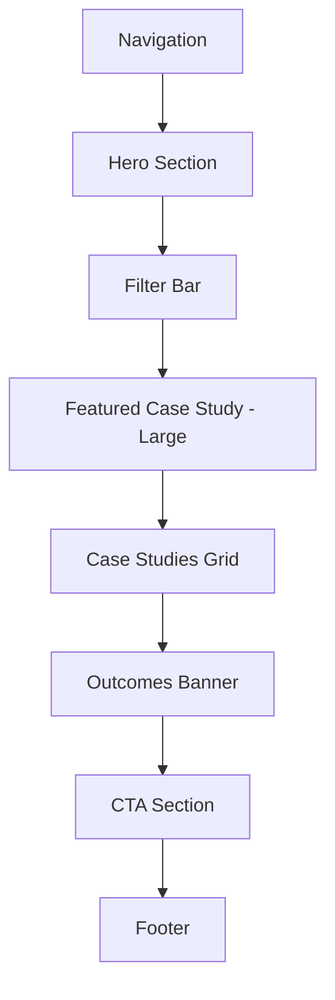

# Case Studies Page - Complete Design Specification

**Page:** Case Studies Overview  
**Route:** `/case-studies`  
**Priority:** 🟡 P1 (Important)  
**Status:** Ready for design implementation

---

## 📋 Page Overview

**Purpose:** Build credibility through real project outcomes, demonstrate expertise across industries, and inspire confidence in potential clients.

**Key Goals:**
1. Showcase real results with metrics
2. Demonstrate industry expertise
3. Inspire confidence through proof
4. Enable discovery through filtering
5. Drive conversions to wizard or booking
6. Establish thought leadership

**Target Audiences:**
- Decision-makers seeking proof of capability
- Industry-specific evaluators
- Technical stakeholders assessing quality
- Procurement teams doing due diligence
- Marketing/ops leaders looking for similar solutions

---

## 🎯 User Journey Flow

```mermaid
graph TD
    A[Land on Case Studies] --> B{Know Industry?}
    
    B -->|Yes| C[Filter by Industry]
    B -->|No| D[Browse All Cases]
    
    C --> E[View Filtered Results]
    D --> F[Scan Card Metrics]
    
    E --> G{Found Relevant Case?}
    F --> G
    
    G -->|Yes| H[Click Case Study Card]
    G -->|Not Sure| I[Filter by Service or Tech]
    
    I --> E
    
    H --> J[Read Case Study Detail]
    J --> K{Convinced?}
    
    K -->|Yes| L[Start Brief]
    K -->|Want Similar| M[Book Call]
    K -->|Need More| N[View Another Case]
    
    N --> D
    
    L --> O[/wizard]
    M --> P[/booking]
    
    style O fill:#d1fae5
    style P fill:#dbeafe
```

---

## 🎨 Design System Requirements

### Visual Language
- **Editorial Portfolio:** Magazine-style layout, not grid template
- **Hero Images:** High-quality screenshots or system diagrams
- **Metrics Focus:** Numbers first, story second
- **Before/After:** Clear comparison visualization
- **Trust Signals:** Company logos, testimonials, results
- **Filtering:** Premium chips (like Services page)

### Case Study Types
```css
/* Industry-based color coding (subtle) */
--saas: #3b82f6;        /* Blue */
--ecommerce: #10b981;   /* Green */
--realestate: #8b5cf6;  /* Purple */
--automotive: #f59e0b;  /* Amber */
--tourism: #ec4899;     /* Pink */
--enterprise: #475569;  /* Slate */
```

---

## 📐 Page Structure

### Section Hierarchy



---

## 📐 Section 1: Hero Section

**Component:** `CaseStudiesHero`

**Desktop Layout (1440px):**
```
┌────────────────────────────────────────────────────────┐
│  EYEBROW: "CASE STUDIES"                               │
│                                                         │
│  HEADLINE:                                             │
│  "Real projects.                                       │
│   Real results."                                       │
│                                                         │
│  SUBTEXT:                                              │
│  "See how we've helped 40+ companies automate         │
│   workflows, qualify leads, and scale with AI."       │
│                                                         │
│  QUICK STATS:                                          │
│  [40+ Projects]  [92% On-Time]  [4.9/5 Rating]        │
└────────────────────────────────────────────────────────┘
```

**Typography:**
- Eyebrow: 14px, uppercase, accent color
- Headline: 64px (desktop), 700 weight, line-height 1.05
- Subtext: 20px, 400 weight, neutral-600
- Stats: 24px number, 14px label

**Stats Specs:**
- Display: inline-flex, gap 48px
- Number: 700 weight, accent color
- Label: 400 weight, neutral-500
- Animation: Count up when in viewport

---

## 📐 Section 2: Filter Bar

**Component:** `FilterBar/CaseStudies`

**Desktop Layout:**
```
┌────────────────────────────────────────────────────────┐
│  [Industry ▼]  [Service ▼]  [Technology ▼]  [Clear]  │
│                                                         │
│  Showing 12 case studies                               │
└────────────────────────────────────────────────────────┘
```

**Filter Dimensions:**

1. **Industry** (Project domain):
   - All Industries
   - SaaS
   - E-commerce
   - Real Estate
   - Automotive
   - Tourism & Hospitality
   - Enterprise
   - Healthcare
   - Finance

2. **Service** (What we built):
   - All Services
   - AI Chatbots
   - AI Agents
   - Automations
   - Dashboards
   - Data & RAG
   - Custom Development

3. **Technology** (Stack used):
   - All Technologies
   - OpenAI
   - Claude
   - Supabase
   - Stripe
   - WhatsApp
   - n8n
   - Webflow
   - LangChain

**Filter Behavior:**
- Same specs as Services page filter
- Selected filters show as removable pills
- Results count updates live
- Empty state with "Clear filters" CTA

**Mobile (375px):**
- Bottom sheet modal
- Stacked filters
- Apply button at bottom

---

## 📐 Section 3: Featured Case Study

**Component:** `FeaturedCaseStudy`

**Desktop Layout (1440px):**
```
┌────────────────────────────────────────────────────────┐
│  [Featured Case Study - Large Card]                    │
│                                                         │
│  ┌──────────────────────────────────────────────────┐ │
│  │  [Left 60%]           [Right 40%]                │ │
│  │                                                   │ │
│  │  [Hero Image/         INDUSTRY: SaaS             │ │
│  │   Screenshot]         SERVICE: AI Chatbot        │ │
│  │                                                   │ │
│  │                       TITLE:                     │ │
│  │                       "How an AI chatbot         │ │
│  │                        qualified 300+ leads      │ │
│  │                        per month"                │ │
│  │                                                   │ │
│  │                       COMPANY:                   │ │
│  │                       [Logo] TechStartup Inc.    │ │
│  │                                                   │ │
│  │                       RESULTS (3 metrics):       │ │
│  │                       ┌────────┬────────┬─────┐  │ │
│  │                       │ +300   │ -28%   │ 24/7│  │ │
│  │                       │ Leads  │ Support│ Up  │  │ │
│  │                       │ /month │ Load   │ time│  │ │
│  │                       └────────┴────────┴─────┘  │ │
│  │                                                   │ │
│  │                       [Read Case Study →]        │ │
│  └──────────────────────────────────────────────────┘ │
└────────────────────────────────────────────────────────┘
```

**Featured Card Specs:**
- Width: 100% (full container)
- Height: 480px
- Layout: 60/40 split (image/content)
- Background: White
- Border: 2px solid neutral-200
- Border-radius: 24px
- Shadow: 0 8px 32px rgba(0,0,0,0.08)
- Badge: "FEATURED" top-left corner

**Image Section:**
- Full height
- Object-fit: cover
- Overlay gradient (bottom): rgba(0,0,0,0.1)

**Content Section:**
- Padding: 48px
- Industry + Service badges at top
- Title: 32px, 700 weight
- Logo: 120px width, centered
- Metrics: 3-column grid
- CTA: Full width button

**Hover State:**
- Lift: translateY(-4px)
- Shadow: 0 12px 48px rgba(0,0,0,0.12)
- Image: Subtle zoom (1.05)
- CTA: Gradient shift

---

## 📐 Section 4: Case Studies Grid

**Component:** `CaseStudiesGrid`

**Desktop Layout (1440px):**
```
┌────────────────────────────────────────────────────────┐
│  ┌─────────────┐  ┌─────────────┐  ┌─────────────┐   │
│  │             │  │             │  │             │   │
│  │ [Image]     │  │ [Image]     │  │ [Image]     │   │
│  │             │  │             │  │             │   │
│  ├─────────────┤  ├─────────────┤  ├─────────────┤   │
│  │ [Industry]  │  │ [Industry]  │  │ [Industry]  │   │
│  │             │  │             │  │             │   │
│  │ Title       │  │ Title       │  │ Title       │   │
│  │             │  │             │  │             │   │
│  │ [Logo]      │  │ [Logo]      │  │ [Logo]      │   │
│  │             │  │             │  │             │   │
│  │ Metrics:    │  │ Metrics:    │  │ Metrics:    │   │
│  │ +34% • -28% │  │ +50% • -15% │  │ +120 • 3x   │   │
│  │             │  │             │  │             │   │
│  │ [Read →]    │  │ [Read →]    │  │ [Read →]    │   │
│  └─────────────┘  └─────────────┘  └─────────────┘   │
│                                                         │
│  [... 9 more case study cards in 3×3 grid]            │
│                                                         │
│  [Load More Cases]                                     │
└────────────────────────────────────────────────────────┘
```

### Case Study Card Structure

**Component:** `CaseStudyCard`

```
┌───────────────────────────────────┐
│  [Hero Image/Screenshot]          │
│  200px height, cover fit          │
│  Gradient overlay at bottom       │
│                                   │
│  [Industry Badge]                 │
│  Positioned: top-right            │
└───────────────────────────────────┘
├───────────────────────────────────┤
│  PADDING: 24px                    │
│                                   │
│  SERVICE BADGE: "AI Chatbot"      │
│                                   │
│  TITLE:                           │
│  "How Company X achieved Y"       │
│  (2-line max, truncate)           │
│                                   │
│  COMPANY:                         │
│  [Logo, 80px width]               │
│                                   │
│  METRICS (2 key numbers):         │
│  +300 leads • -28% support        │
│                                   │
│  [Read Case Study →]              │
└───────────────────────────────────┘
```

**Card Specifications:**
- Width: ~400px (responsive)
- Aspect ratio: 3:4 overall
- Image: 200px height
- Content padding: 24px
- Background: White
- Border: 1px solid neutral-200
- Border-radius: 16px
- Shadow: 0 2px 12px rgba(0,0,0,0.04)

**Industry Badge:**
- Position: absolute, top-right 16px
- Background: Industry color (10% opacity)
- Color: Industry color (full)
- Padding: 6px 12px
- Border-radius: 6px
- Font-size: 12px, 600 weight

**Service Badge:**
- Background: Neutral-100
- Color: Neutral-700
- Padding: 4px 10px
- Border-radius: 4px
- Font-size: 12px

**Title:**
- Font-size: 20px
- Weight: 600
- Line-height: 1.3
- Color: Neutral-900
- Max-height: 2 lines
- Overflow: ellipsis

**Company Logo:**
- Height: 40px
- Width: auto (max 120px)
- Grayscale: 100% (default)
- Grayscale: 0% (hover)

**Metrics:**
- Font-size: 14px
- Weight: 600
- Color: Accent
- Format: "[+/-]Value Label • [+/-]Value Label"
- Icons: Up/down arrows for +/-

**CTA Button:**
- Width: 100%
- Height: 40px
- Background: Transparent
- Border: 1px solid neutral-300
- Hover: Background accent, color white

**Hover State:**
- Card lift: translateY(-4px)
- Shadow: 0 8px 24px rgba(0,0,0,0.08)
- Image: Zoom 1.05
- Logo: Full color
- CTA: Solid background

**Grid Specs:**
- Desktop: 3 columns
- Gap: 32px
- Max-width: 1280px

---

## 📐 Example Case Studies (12 total)

### Case Study 1: SaaS - AI Chatbot
```
Title: "How an AI chatbot qualified 300+ leads per month"
Company: TechStartup Inc.
Industry: SaaS
Service: AI Chatbots
Metrics: +300 leads/mo • -28% support load
Tech: OpenAI, Supabase, Webflow
```

### Case Study 2: E-commerce - Automation
```
Title: "Automating order fulfillment saved 15 hours/week"
Company: ShopStyle Co.
Industry: E-commerce
Service: Automations
Metrics: 15 hrs saved/wk • +34% faster shipping
Tech: n8n, WhatsApp, Stripe
```

### Case Study 3: Real Estate - AI Agent
```
Title: "AI agent that pre-qualifies 90% of property leads"
Company: HomeMatch Realty
Industry: Real Estate
Service: AI Agents
Metrics: 90% qualification rate • -40% wasted calls
Tech: OpenAI, Supabase, Calendly
```

### Case Study 4: Automotive - Dashboard
```
Title: "Real-time inventory dashboard increased sales 23%"
Company: AutoDealer Pro
Industry: Automotive
Service: Dashboards
Metrics: +23% sales • -50% manual reporting
Tech: Supabase, React, Webhooks
```

### Case Study 5: Tourism - Chatbot
```
Title: "24/7 booking assistant increased conversions 45%"
Company: TravelEase
Industry: Tourism
Service: AI Chatbots
Metrics: +45% conversions • 24/7 availability
Tech: OpenAI, Stripe, Webflow
```

### Case Study 6: Enterprise - Multi-Agent
```
Title: "Multi-agent system reduced proposal time by 80%"
Company: ConsultCorp
Industry: Enterprise
Service: AI Agents
Metrics: -80% proposal time • +120 deals/quarter
Tech: LangChain, Supabase, n8n
```

### Case Study 7: Healthcare - RAG
```
Title: "AI knowledge base deflected 60% of support tickets"
Company: MedTech Solutions
Industry: Healthcare
Service: Data & RAG
Metrics: -60% tickets • 2-min avg response
Tech: OpenAI, Supabase, Perplexity
```

### Case Study 8: Finance - Custom API
```
Title: "Custom API integration saved $50k in manual data entry"
Company: FinanceHub
Industry: Finance
Service: Custom Development
Metrics: $50k saved/year • -95% data errors
Tech: Supabase, Stripe, Custom
```

### Case Study 9: SaaS - Automation
```
Title: "n8n workflow automated entire onboarding process"
Company: SaaS Onboard
Industry: SaaS
Service: Automations
Metrics: -70% onboarding time • 100% accuracy
Tech: n8n, Supabase, Email
```

### Case Study 10: E-commerce - AI Agent
```
Title: "AI shopping assistant increased AOV by 38%"
Company: BuyNow Marketplace
Industry: E-commerce
Service: AI Agents
Metrics: +38% AOV • +26% repeat purchases
Tech: OpenAI, Shopify, Stripe
```

### Case Study 11: Real Estate - Dashboard
```
Title: "Lead tracking dashboard improved conversion 31%"
Company: PropertyPros
Industry: Real Estate
Service: Dashboards
Metrics: +31% conversion • -12 hrs/week admin
Tech: Supabase, React, CRM API
```

### Case Study 12: Tourism - Automation
```
Title: "WhatsApp automation sent 10k confirmations/month"
Company: BookTravel
Industry: Tourism
Service: Automations
Metrics: 10k msgs/mo • 99.8% delivery rate
Tech: WhatsApp, n8n, Calendly
```

---

## 📐 Section 5: Outcomes Banner

**Component:** `OutcomesBanner`

**Desktop Layout:**
```
┌────────────────────────────────────────────────────────┐
│  HEADLINE:                                             │
│  "Outcomes that matter"                                │
│                                                         │
│  ┌──────────┐    ┌──────────┐    ┌──────────┐        │
│  │ Average  │    │ Average  │    │ Average  │        │
│  │ Results: │    │ Time     │    │ Client   │        │
│  │          │    │ Saved:   │    │ Satisfaction:│    │
│  │ +42%     │    │ 12 hrs   │    │ 4.9/5    │        │
│  │ increase │    │ per week │    │ rating   │        │
│  └──────────┘    └──────────┘    └──────────┘        │
└────────────────────────────────────────────────────────┘
```

**Specs:**
- Background: Gradient (accent-50 to white)
- Padding: 80px vertical
- Numbers: 48px, 700 weight, accent color
- Labels: 16px, neutral-600
- Animation: Count up when scrolled into view

---

## 📐 Section 6: CTA Section

**Component:** `CTA/CaseStudies`

**Desktop Layout:**
```
┌────────────────────────────────────────────────────────┐
│  HEADLINE:                                             │
│  "Want results like these?"                            │
│                                                         │
│  SUBTEXT:                                              │
│  "Tell us your challenge. We'll show you how we can   │
│   help—with a custom proposal in 24 hours."           │
│                                                         │
│  [Start Your Brief (15 min) →]    [Book a Call]       │
└────────────────────────────────────────────────────────┘
```

**Routes:**
- Start Brief → `/wizard`
- Book a Call → `/booking`

---

## 🔗 Route Map

```mermaid
graph TD
    CASES[/case-studies] --> FILTER[Apply Filters]
    FILTER --> FILTERED[/case-studies?industry=X&service=Y]
    
    CASES --> CARD_CLICK[Click Case Card]
    CARD_CLICK --> DETAIL[/case-studies/:slug]
    
    DETAIL --> WIZARD[/wizard]
    DETAIL --> BOOKING[/booking]
    DETAIL --> BACK[Back to /case-studies]
    
    CASES --> WIZARD
    CASES --> BOOKING
    
    style WIZARD fill:#d1fae5
    style BOOKING fill:#dbeafe
```

---

## 📐 Empty State

**Component:** `EmptyState/NoCases`

**Layout:**
```
┌────────────────────────────────────────────────────────┐
│  [No results illustration]                             │
│                                                         │
│  "No case studies match these filters"                 │
│                                                         │
│  "Try different filters or view all case studies"      │
│                                                         │
│  [Clear Filters]    [View All]                         │
└────────────────────────────────────────────────────────┘
```

---

## 📱 Responsive Breakpoints

### Desktop (1440px+)
- Featured case: 60/40 split
- Grid: 3 columns
- Filter bar: Horizontal

### Tablet (768-1024px)
- Featured case: 50/50 split
- Grid: 2 columns
- Filter bar: May wrap

### Mobile (375-767px)
- Featured case: Stacked (image top, content below)
- Grid: 1 column
- Filter bar: Bottom sheet modal
- Cards: 100% width

---

## 🎬 Animation Specifications

### On Load
1. Hero fades in
2. Stats count up
3. Filter bar slides in
4. Featured case scales in (0.95 → 1)

### On Scroll
- Grid cards: Stagger in from bottom (0.1s delay each)
- Outcomes banner: Count up when visible
- Images: Fade in with subtle scale

### Interactions
- Filter: Dropdown smooth open (0.2s)
- Cards: Lift on hover (translateY: -4px)
- Images: Zoom on hover (scale: 1.05)
- Logos: Grayscale to color transition
- CTA buttons: Lift + glow

---

## ✅ Component Checklist

### Must Create
- [ ] `CaseStudiesHero` with stats
- [ ] `FilterBar/CaseStudies` (3 dropdowns)
- [ ] `FeaturedCaseStudy` (large card)
- [ ] `CaseStudyCard` (12 variants with real data)
- [ ] `CaseStudiesGrid` (3-column responsive)
- [ ] `OutcomesBanner` with animated stats
- [ ] `EmptyState/NoCases`
- [ ] `CTA/CaseStudies`

### States Required
- [ ] Filter: closed, open, selected, empty
- [ ] Featured card: default, hover
- [ ] Grid cards: default, hover, loading
- [ ] Empty state: visible when no results

### Content Needed
- [ ] 12 case study thumbnails/screenshots
- [ ] 12 company logos (can be placeholders)
- [ ] Real metrics for each case
- [ ] Industry and service tags

---

## 🎨 Figma Make AI Prompt (Ready to Paste)

```
Create a luxury case studies overview page with filtering for an AI development company.

PAGE STRUCTURE (Desktop 1440px):

1. HERO SECTION:
   - Eyebrow: "CASE STUDIES"
   - Headline: "Real projects. Real results." (64px, bold)
   - Subtext: "See how we've helped 40+ companies automate workflows, qualify leads, and scale with AI."
   - Quick stats row: 40+ Projects | 92% On-Time | 4.9/5 Rating
   - Stats animate (count up) when page loads

2. FILTER BAR:
   - Three dropdown filters: Industry, Service, Technology
   - Results count: "Showing 12 case studies"
   - Clear all button
   - Same premium style as Services page

3. FEATURED CASE STUDY (Large card, 60/40 split):
   Left side: Hero image/screenshot (full height)
   Right side:
   - Badge: "FEATURED" (top)
   - Industry badge: "SaaS" (blue)
   - Service badge: "AI Chatbot"
   - Title: "How an AI chatbot qualified 300+ leads per month"
   - Company logo: TechStartup Inc. (placeholder)
   - Results (3 metrics in grid):
     +300 Leads/month
     -28% Support Load
     24/7 Uptime
   - Button: "Read Case Study →" (full width)

4. CASE STUDIES GRID (3×4 grid = 12 cards):
   Create 12 case study cards, each with:
   - Hero image (200px height, gradient overlay)
   - Industry badge (top-right): SaaS/E-commerce/Real Estate/etc.
   - Service badge: AI Chatbots/Agents/Automations/etc.
   - Title (2-line max): "How Company X achieved Y"
   - Company logo (80px width, grayscale default)
   - 2 key metrics: "+300 leads • -28% support"
   - CTA: "Read Case Study →" (outlined button)
   
   Example cards:
   Card 1: SaaS + Chatbot, +300 leads, -28% support
   Card 2: E-commerce + Automation, 15 hrs saved, +34% faster
   Card 3: Real Estate + Agent, 90% qualification, -40% wasted calls
   Card 4: Automotive + Dashboard, +23% sales, -50% reporting
   Card 5: Tourism + Chatbot, +45% conversions, 24/7 available
   Card 6: Enterprise + Agents, -80% proposal time, +120 deals
   
   (Continue with 6 more unique combinations)

5. OUTCOMES BANNER:
   - Headline: "Outcomes that matter"
   - 3 stat cards:
     Average Results: +42% increase
     Average Time Saved: 12 hrs/week
     Client Satisfaction: 4.9/5 rating
   - Background: Gradient (blue to white)
   - Stats animate (count up) when scrolled into view

6. CTA SECTION:
   - Headline: "Want results like these?"
   - Subtext: "Tell us your challenge. We'll show you how..."
   - Two buttons: "Start Your Brief (15 min) →", "Book a Call"

DESIGN STYLE:
- Editorial portfolio / Magazine layout
- Featured card: 60/40 split, strong shadow
- Grid cards: Illustrated thumbnails (not stock photos)
- Industry color coding (subtle badges)
- Metrics prominent (accent color)
- Company logos grayscale → color on hover

RESPONSIVE:
- Desktop: 3-column grid, featured 60/40
- Tablet: 2-column grid, featured 50/50
- Mobile: 1-column, featured stacked

INTERACTIONS:
- Filter dropdown: smooth open
- Featured card: lift + image zoom on hover
- Grid cards: lift 4px, shadow intensifies, image zoom 1.05
- Company logos: grayscale → full color
- Metrics: Count up animation on scroll
- "Load More" button at bottom

ROUTES:
- Filter → /case-studies?industry=X&service=Y
- Case card → /case-studies/:slug
- Start Brief → /wizard
- Book Call → /booking

EMPTY STATE (when no results):
- Illustration: Magnifying glass
- Message: "No case studies match these filters"
- CTA: "Clear Filters" button
```

---

**Status:** ✅ Complete specification ready for Figma Make AI implementation  
**Next Step:** Create case studies overview → Link to detail pages → Implement filtering logic
