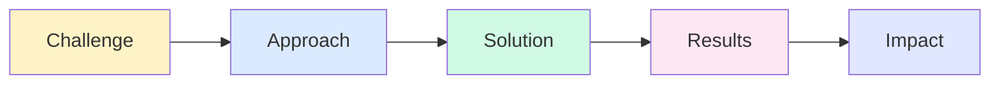
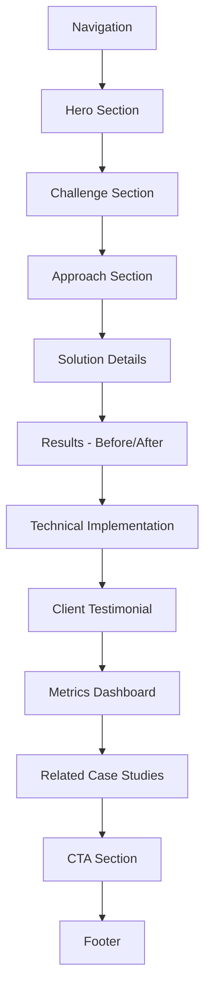
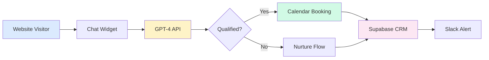

# Case Study Detail Page - Complete Design Specification

**Page:** Case Study Detail Template (Reusable)  
**Route:** `/case-studies/:slug`  
**Priority:** 🟡 P1 (Important)  
**Status:** Ready for design implementation

---

## 📋 Page Overview

**Purpose:** Showcase project success through storytelling, demonstrate expertise, build credibility, and convert readers into leads.

**Key Goals:**
1. Tell compelling success story with narrative arc
2. Show measurable results with before/after comparison
3. Demonstrate technical capabilities
4. Build trust through authentic client voice
5. Drive conversions to wizard or booking
6. Establish industry expertise

**Target Audiences:**
- Prospects researching similar challenges
- Decision-makers evaluating capabilities
- Technical stakeholders assessing approach
- Stakeholders seeking proof points

---

## 🎯 User Journey Flow

```mermaid
graph TD
    A[Land from Case Studies Grid] --> B[Read Hero/Challenge]
    B --> C[Scan Metrics]
    C --> D{Interested in Solution?}
    
    D -->|Yes| E[Read Solution Section]
    D -->|Skip Ahead| F[Jump to Results]
    
    E --> G[View Process/Timeline]
    G --> H[See Technical Details]
    H --> F
    
    F --> I[Read Testimonial]
    I --> J{Convinced?}
    
    J -->|Yes| K[Start Brief]
    J -->|Want to Discuss| L[Book Call]
    J -->|Need More Proof| M[View Another Case]
    
    M --> N[Back to Case Studies]
    
    K --> O[/wizard]
    L --> P[/booking]
    
    style O fill:#d1fae5
    style P fill:#dbeafe
```

---

## 🎨 Design System Requirements

### Visual Language
- **Editorial Storytelling:** Magazine feature style
- **Before/After:** Side-by-side comparisons with metrics
- **Process Visualization:** Timeline with milestones
- **Technical Details:** Clean code snippets, architecture diagrams
- **Client Voice:** Large pull quotes with photos
- **Proof:** Screenshots, dashboards, real data

### Story Arc Structure


---

## 📐 Page Structure

### Section Hierarchy



---

## 📐 Section 1: Hero Section

**Component:** `CaseStudyHero`

**Desktop Layout (1440px):**
```
┌────────────────────────────────────────────────────────┐
│  [← Back to Case Studies]                              │
│                                                         │
│  [Left Column - 50%]         [Right Column - 50%]     │
│                                                         │
│  INDUSTRY BADGE: "SaaS"      ┌─────────────────────┐  │
│  SERVICE BADGE: "AI Chatbot" │                     │  │
│                               │  [Hero Image/       │  │
│  HEADLINE:                   │   Screenshot]       │  │
│  "How an AI chatbot          │                     │  │
│   qualified 300+ leads       │  Example: Chat UI   │  │
│   per month"                 │  with conversation  │  │
│                               │  flow visible      │  │
│  COMPANY:                    │                     │  │
│  [Logo] TechStartup Inc.     │                     │  │
│                               └─────────────────────┘  │
│  QUICK FACTS:                                          │
│  • Industry: SaaS                                      │
│  • Company Size: 50-200                                │
│  • Timeline: 14 days                                   │
│  • Tech Stack: OpenAI, Supabase, Webflow              │
│                                                         │
│  KEY RESULTS (3 metrics):                              │
│  ┌────────┬────────┬────────┐                         │
│  │ +300   │ -28%   │ 24/7   │                         │
│  │ Leads  │ Support│ Uptime │                         │
│  │ /month │ Load   │        │                         │
│  └────────┴────────┴────────┘                         │
└────────────────────────────────────────────────────────┘
```

**Typography:**
- Industry/Service badges: 12px, uppercase, accent colors
- Headline: 48px, 700 weight, line-height 1.1
- Company name: 20px, 600 weight, with logo
- Quick facts: 16px, neutral-700
- Metrics: 32px number, 14px label

**Hero Image Specs:**
- Width: 100% of column
- Aspect ratio: 4:3
- Border-radius: 16px
- Shadow: Soft elevation
- Content: Actual screenshot or system diagram

**Responsive (Mobile 375px):**
- Single column layout
- Image moves below text
- Headline: 32px
- Metrics stack vertically

---

## 📐 Section 2: Challenge Section

**Component:** `ChallengeSection`

**Desktop Layout:**
```
┌────────────────────────────────────────────────────────┐
│  SECTION HEADLINE:                                     │
│  "The challenge"                                       │
│                                                         │
│  [Left 60%]                  [Right 40%]              │
│                                                         │
│  PARAGRAPH 1:                "Before we started"      │
│  "TechStartup was getting    ┌─────────────────────┐  │
│   200+ leads per month, but  │ Pain Point 1:       │  │
│   80% were unqualified.      │ • 80% unqualified   │  │
│   Sales team spent 15 hours  │   leads             │  │
│   per week on discovery      │                     │  │
│   calls that went nowhere."  │ Pain Point 2:       │  │
│                               │ • 15 hrs/week       │  │
│  PARAGRAPH 2:                │   wasted on calls   │  │
│  "They needed a solution     │                     │  │
│   that could..."             │ Pain Point 3:       │  │
│   • Qualify leads 24/7       │ • No weekend        │  │
│   • Ask the right questions  │   coverage          │  │
│   • Route to right rep       │                     │  │
│   • Capture context          └─────────────────────┘  │
└────────────────────────────────────────────────────────┘
```

**Pain Points Card Specs:**
- Background: Neutral-50
- Border: 1px solid neutral-200
- Border-radius: 12px
- Padding: 24px
- Icon: Red warning triangle (16px)
- List items: Bullet points with metrics

---

## 📐 Section 3: Approach Section

**Component:** `ApproachSection`

**Desktop Layout:**
```
┌────────────────────────────────────────────────────────┐
│  SECTION HEADLINE:                                     │
│  "Our approach"                                        │
│                                                         │
│  TIMELINE (Horizontal):                                │
│                                                         │
│  ┌────────┐ ───→ ┌────────┐ ───→ ┌────────┐ ───→    │
│  │ Week 1 │      │ Week 2 │      │ Week 3 │          │
│  │        │      │        │      │        │          │
│  │ Discov │      │ Design │      │ Build  │          │
│  │ ery    │      │        │      │        │          │
│  │        │      │        │      │        │          │
│  │ • Map  │      │ • Flow │      │ • Code │          │
│  │   user │      │   dia- │      │ • Test │          │
│  │   flow │      │   grams│      │ • QA   │          │
│  │ • ID   │      │ • Ques │      │        │          │
│  │   qual │      │   tion │      │        │          │
│  │   crit │      │   bank │      │        │          │
│  │   eria │      │        │      │        │          │
│  └────────┘      └────────┘      └────────┘          │
│                                                         │
│  ┌────────┐                                           │
│  │ Week 4 │                                           │
│  │        │                                           │
│  │ Launch │                                           │
│  │        │                                           │
│  │ • Deploy│                                          │
│  │ • Train│                                           │
│  │ • Monitor│                                         │
│  └────────┘                                           │
│                                                         │
│  KEY DECISIONS:                                        │
│  ✓ Used GPT-4 for natural conversation                │
│  ✓ Supabase for lead storage + real-time sync         │
│  ✓ Webflow embed for seamless brand match             │
│  ✓ Slack integration for instant sales notifications  │
└────────────────────────────────────────────────────────┘
```

**Timeline Card Specs:**
- Width: 200px each
- Background: White
- Border: 1px solid neutral-200
- Border-radius: 12px
- Padding: 24px
- Week label: 700 weight, accent color
- Phase name: 20px, 600 weight
- Activities: Bullet list, 14px

**Key Decisions List:**
- Checkmark: Green, 20px
- Text: 16px, neutral-700
- Format: Technology + reason

---

## 📐 Section 4: Solution Details

**Component:** `SolutionDetails`

**Desktop Layout:**
```
┌────────────────────────────────────────────────────────┐
│  SECTION HEADLINE:                                     │
│  "What we built"                                       │
│                                                         │
│  ┌──────────────────────────────────────────────────┐ │
│  │  FEATURE 1: Intelligent Qualification             │ │
│  │                                                    │ │
│  │  [Screenshot: Chat asking qualification Q's]      │ │
│  │                                                    │ │
│  │  Description: The chatbot asks 5 key questions   │ │
│  │  to determine if the lead is qualified based on  │ │
│  │  budget, timeline, and use case.                 │ │
│  │                                                    │ │
│  │  Tech: GPT-4 function calling + custom scoring   │ │
│  └──────────────────────────────────────────────────┘ │
│                                                         │
│  ┌──────────────────────────────────────────────────┐ │
│  │  FEATURE 2: Calendar Integration                  │ │
│  │                                                    │ │
│  │  [Screenshot: Calendar booking flow]              │ │
│  │                                                    │ │
│  │  Description: Qualified leads can book directly  │ │
│  │  with the right sales rep based on territory and │ │
│  │  expertise.                                       │ │
│  │                                                    │ │
│  │  Tech: Calendly API + rep availability sync      │ │
│  └──────────────────────────────────────────────────┘ │
│                                                         │
│  ┌──────────────────────────────────────────────────┐ │
│  │  FEATURE 3: CRM Auto-Update                       │ │
│  │                                                    │ │
│  │  [Screenshot: CRM record with chat transcript]    │ │
│  │                                                    │ │
│  │  Description: Every conversation automatically   │ │
│  │  creates/updates a lead in Supabase with full    │ │
│  │  context and qualification score.                │ │
│  │                                                    │ │
│  │  Tech: Supabase real-time sync + structured data │ │
│  └──────────────────────────────────────────────────┘ │
└────────────────────────────────────────────────────────┘
```

**Feature Block Specs:**
- Width: 100%
- Padding: 32px
- Background: White
- Border: 1px solid neutral-200
- Border-radius: 16px
- Margin: 32px between blocks

**Screenshot Specs:**
- Max-width: 600px
- Border-radius: 8px
- Shadow: Subtle
- Annotation callouts (optional)

---

## 📐 Section 5: Results - Before/After

**Component:** `BeforeAfterComparison`

**Desktop Layout:**
```
┌────────────────────────────────────────────────────────┐
│  SECTION HEADLINE:                                     │
│  "The results"                                         │
│                                                         │
│  ┌─────────────────────┬─────────────────────┐        │
│  │ BEFORE              │ AFTER               │        │
│  ├─────────────────────┼─────────────────────┤        │
│  │                     │                     │        │
│  │ 📊 200 leads/month  │ 📊 500 leads/month  │        │
│  │ Only 20% qualified  │ 60% qualified       │        │
│  │                     │                     │        │
│  │ ⏰ 15 hrs/week on   │ ⏰ 3 hrs/week on    │        │
│  │ Discovery calls     │ Discovery calls     │        │
│  │                     │                     │        │
│  │ 🕐 M-F 9-5 coverage │ 🕐 24/7 coverage    │        │
│  │                     │                     │        │
│  │ 📝 Manual CRM entry │ 📝 Auto CRM sync    │        │
│  │                     │                     │        │
│  │ 😞 Inconsistent     │ 😊 Every lead gets  │        │
│  │ Follow-up           │ Same questions      │        │
│  │                     │                     │        │
│  └─────────────────────┴─────────────────────┘        │
│                                                         │
│  IMPACT METRICS (4 cards):                             │
│  ┌──────┐  ┌──────┐  ┌──────┐  ┌──────┐              │
│  │ +150%│  │ -80% │  │ 24/7 │  │ 100% │              │
│  │ More │  │ Less │  │ Avail│  │ Data │              │
│  │ Leads│  │ Time │  │ able │  │ Accur│              │
│  └──────┘  └──────┘  └──────┘  └──────┘              │
└────────────────────────────────────────────────────────┘
```

**Before/After Table Specs:**
- 2-column layout
- Column width: 50% each
- Row height: Auto, min 80px
- Border: 1px solid neutral-300 between columns
- Background: Before (neutral-50), After (accent-50)
- Icons: Emoji or icon font, 24px
- Text: 16px, neutral-700

**Impact Metrics Cards:**
- Width: 25% each (4-column grid)
- Padding: 24px
- Background: White
- Border-radius: 12px
- Number: 40px, 700 weight, accent color
- Label: 14px, neutral-600

---

## 📐 Section 6: Technical Implementation

**Component:** `TechnicalDetails`

**Desktop Layout:**
```
┌────────────────────────────────────────────────────────┐
│  SECTION HEADLINE:                                     │
│  "Technical implementation"                            │
│                                                         │
│  ARCHITECTURE DIAGRAM:                                 │
│                                                         │
│  ┌──────────┐      ┌──────────┐      ┌──────────┐    │
│  │ Webflow  │ ───→ │ Chatbot  │ ───→ │ Supabase │    │
│  │ Website  │      │ (GPT-4)  │      │ CRM      │    │
│  └──────────┘      └──────────┘      └──────────┘    │
│       │                  │                  │         │
│       │                  ↓                  ↓         │
│       │            ┌──────────┐      ┌──────────┐    │
│       │            │ Calendly │      │ Slack    │    │
│       │            │ Booking  │      │ Alerts   │    │
│       │            └──────────┘      └──────────┘    │
│       └──────────────────────────────────────→        │
│                   (Embedded widget)                    │
│                                                         │
│  TECH STACK:                                           │
│  ┌──────────────┬──────────────┬──────────────┐      │
│  │ FRONTEND     │ BACKEND      │ INTEGRATIONS │      │
│  ├──────────────┼──────────────┼──────────────┤      │
│  │ • Webflow    │ • OpenAI     │ • Supabase   │      │
│  │ • Custom JS  │   GPT-4      │ • Calendly   │      │
│  │ • Widget     │ • Functions  │ • Slack      │      │
│  │   embed      │ • Edge Fns   │ • Email      │      │
│  └──────────────┴──────────────┴──────────────┘      │
│                                                         │
│  CODE SNIPPET (Optional):                              │
│  ┌──────────────────────────────────────────────────┐ │
│  │ // Qualification scoring logic                   │ │
│  │ const qualifyLead = (answers) => {              │ │
│  │   const score = calculateScore(answers);        │ │
│  │   return score > 70 ? 'qualified' : 'nurture';  │ │
│  │ }                                                │ │
│  └──────────────────────────────────────────────────┘ │
└────────────────────────────────────────────────────────┘
```

**Mermaid Architecture:**


**Diagram Specs:**
- Boxes: 120px × 80px
- Border-radius: 8px
- Border: 2px solid
- Arrows: 2px, dashed
- Font: 14px, 600 weight
- Colors: Match service type

**Code Snippet Specs:**
- Background: Neutral-900
- Color: Neutral-100
- Font: Monospace (Fira Code, JetBrains Mono)
- Padding: 24px
- Border-radius: 8px
- Syntax highlighting (optional)

---

## 📐 Section 7: Client Testimonial

**Component:** `ClientTestimonial`

**Desktop Layout:**
```
┌────────────────────────────────────────────────────────┐
│  ┌──────────────────────────────────────────────────┐ │
│  │                                                   │ │
│  │  QUOTE (Large):                                  │ │
│  │  "The chatbot qualified 300+ leads in the first │ │
│  │   month. Our sales team went from spending 15   │ │
│  │   hours per week on unqualified calls to only   │ │
│  │   3 hours. It's like having a sales development │ │
│  │   rep that never sleeps."                        │ │
│  │                                                   │ │
│  │  ┌─────────┐  Sarah Chen                        │ │
│  │  │ [Photo] │  Head of Growth                    │ │
│  │  │  80×80  │  TechStartup Inc.                  │ │
│  │  └─────────┘  [Company Logo]                    │ │
│  │                                                   │ │
│  └──────────────────────────────────────────────────┘ │
└────────────────────────────────────────────────────────┘
```

**Testimonial Card Specs:**
- Width: 100%, max-width 900px (centered)
- Padding: 48px
- Background: Gradient (neutral-50 to white)
- Border: 2px solid neutral-200
- Border-radius: 20px
- Quote: 24px, italic, 400 weight, neutral-700
- Quote marks: Large decorative (optional)
- Photo: 80px circle, object-fit cover
- Name: 20px, 600 weight
- Title: 16px, neutral-600
- Company: 16px, neutral-500
- Logo: 100px width, grayscale

---

## 📐 Section 8: Metrics Dashboard

**Component:** `MetricsDashboard`

**Desktop Layout:**
```
┌────────────────────────────────────────────────────────┐
│  SECTION HEADLINE:                                     │
│  "Impact over time"                                    │
│                                                         │
│  ┌──────────────────────────────────────────────────┐ │
│  │  [Line Chart: Lead Volume Over 6 Months]         │ │
│  │                                                   │ │
│  │  500 ┐                                    ●       │ │
│  │      │                             ●              │ │
│  │  400 ┤                      ●                     │ │
│  │      │               ●                            │ │
│  │  300 ┤        ●                                   │ │
│  │      │  ●                                         │ │
│  │  200 ┤                                            │ │
│  │      └───────────────────────────────────         │ │
│  │      Jan  Feb  Mar  Apr  May  Jun                │ │
│  │                                                   │ │
│  │  ─── Qualified Leads (grew from 40 to 300)       │ │
│  └──────────────────────────────────────────────────┘ │
│                                                         │
│  BREAKDOWN (3 metric cards):                           │
│  ┌─────────────┬─────────────┬─────────────┐         │
│  │ Time Saved  │ Revenue     │ Conversion  │         │
│  │             │ Impact      │ Rate        │         │
│  │ 12 hrs/week │ +$120k ARR  │ 9% → 28%    │         │
│  │ (80% less)  │ (from quali │ (3x better) │         │
│  │             │  fied leads)│             │         │
│  └─────────────┴─────────────┴─────────────┘         │
└────────────────────────────────────────────────────────┘
```

**Chart Specs:**
- Width: 100%
- Height: 300px
- Background: White
- Grid: Subtle horizontal lines
- Data points: Accent color circles (8px)
- Line: 2px, accent color
- Axes: 12px, neutral-500
- Labels: 14px, neutral-700

**Metric Cards Specs:**
- Width: 33.33% each
- Padding: 24px
- Background: White
- Border: 1px solid neutral-200
- Border-radius: 12px
- Primary metric: 28px, 700 weight, accent color
- Context: 14px, neutral-600

---

## 📐 Section 9: Related Case Studies

**Component:** `RelatedCaseStudies`

**Desktop Layout:**
```
┌────────────────────────────────────────────────────────┐
│  SECTION HEADLINE:                                     │
│  "More success stories"                                │
│                                                         │
│  ┌─────────────┐  ┌─────────────┐  ┌─────────────┐   │
│  │             │  │             │  │             │   │
│  │ [Image]     │  │ [Image]     │  │ [Image]     │   │
│  │             │  │             │  │             │   │
│  ├─────────────┤  ├─────────────┤  ├─────────────┤   │
│  │ Title       │  │ Title       │  │ Title       │   │
│  │ +50% metric │  │ -30% metric │  │ 24/7 metric │   │
│  │ [Read →]    │  │ [Read →]    │  │ [Read →]    │   │
│  └─────────────┘  └─────────────┘  └─────────────┘   │
└────────────────────────────────────────────────────────┘
```

**Card Specs:**
- Same as case study cards from overview page
- 3 cards shown (similar industry or service)
- Routes to other case study detail pages

---

## 📐 Section 10: CTA Section

**Component:** `CTA/CaseStudyDetail`

**Desktop Layout:**
```
┌────────────────────────────────────────────────────────┐
│  HEADLINE:                                             │
│  "Want similar results?"                               │
│                                                         │
│  SUBTEXT:                                              │
│  "Tell us your challenge. We'll send you a custom     │
│   proposal in 24 hours showing exactly how we can     │
│   help."                                               │
│                                                         │
│  [Start Your Brief (15 min) →]    [Book a Call]       │
│                                                         │
│  "Or explore more case studies" →                      │
└────────────────────────────────────────────────────────┘
```

**Background:** Service-specific accent color (10% opacity)
**Padding:** 100px vertical

**Routes:**
- Start Brief → `/wizard` (with industry/service pre-selected)
- Book Call → `/booking`
- More case studies → `/case-studies`

---

## 🔗 Route Map

```mermaid
graph TD
    CASES[/case-studies] --> DETAIL[/case-studies/:slug]
    
    DETAIL --> WIZARD[/wizard?industry=X&service=Y]
    DETAIL --> BOOKING[/booking]
    DETAIL --> RELATED[/case-studies/:other-slug]
    DETAIL --> BACK[Back to /case-studies]
    
    WIZARD --> THANK_YOU[Success page]
    BOOKING --> CONFIRM[Booking confirmation]
    
    style WIZARD fill:#d1fae5
    style BOOKING fill:#dbeafe
```

---

## 📱 Responsive Breakpoints

### Desktop (1440px+)
- Hero: 50/50 split (text/image)
- Before/After: Side-by-side table
- Related cases: 3-column grid

### Tablet (768-1024px)
- Hero: 60/40 split
- Before/After: Side-by-side (smaller text)
- Related cases: 2-column grid

### Mobile (375-767px)
- Hero: Single column, image below
- Before/After: Stacked (Before section, then After section)
- Solution features: Single column
- Related cases: Single column
- All text: Reduced sizes

---

## 🎬 Animation Specifications

### On Load
1. Hero image fades in with subtle scale (0.95 → 1)
2. Metrics count up
3. Back button slides in from left

### On Scroll
- Challenge section: Fade in from bottom
- Timeline: Steps reveal sequentially with connector lines drawing
- Before/After: Rows reveal one by one
- Solution features: Stagger in (0.2s delay each)
- Chart: Line draws from left to right
- Testimonial: Scale in (0.95 → 1)
- Related cases: Stagger in

### Hover States
- Related case cards: Lift + shadow
- CTA buttons: Lift + glow
- Screenshots: Subtle zoom (1.02)

---

## ✅ Component Checklist

### Must Create
- [ ] `CaseStudyHero` with company branding
- [ ] `ChallengeSection` with pain points
- [ ] `ApproachSection` with timeline
- [ ] `SolutionDetails` (3 feature blocks)
- [ ] `BeforeAfterComparison` table
- [ ] `TechnicalDetails` with architecture diagram
- [ ] `ClientTestimonial` (large quote card)
- [ ] `MetricsDashboard` with chart
- [ ] `RelatedCaseStudies` (3 cards)
- [ ] `CTA/CaseStudyDetail`

### States Required
- [ ] Hero: default, loading
- [ ] Timeline: default, animated progression
- [ ] Before/After: default, animated reveal
- [ ] Chart: default, animated draw
- [ ] Related cards: default, hover

### Content Needed (per case study)
- [ ] Hero screenshot
- [ ] Company logo
- [ ] 3 solution feature screenshots
- [ ] Client photo + testimonial
- [ ] Metrics data for chart
- [ ] 3 related case studies

---

## 🎨 Figma Make AI Prompt (Ready to Paste)

```
Create a luxury case study detail page for "How an AI chatbot qualified 300+ leads per month" (reusable template).

PAGE STRUCTURE (Desktop 1440px):

1. HERO SECTION (50/50 split):
   Left side:
   - Back link: "← Back to Case Studies"
   - Industry badge: "SaaS" (blue)
   - Service badge: "AI Chatbot"
   - Headline: "How an AI chatbot qualified 300+ leads per month"
   - Company: TechStartup Inc. logo (placeholder)
   - Quick facts:
     • Industry: SaaS
     • Company Size: 50-200
     • Timeline: 14 days
     • Tech Stack: OpenAI, Supabase, Webflow
   - Key results (3 metric cards):
     +300 Leads/month | -28% Support Load | 24/7 Uptime
   
   Right side:
   - Hero screenshot: Chat interface showing qualification conversation
   - Soft shadow, 16px border radius

2. CHALLENGE SECTION:
   Headline: "The challenge"
   Left column (60%):
   - Paragraph 1: "TechStartup was getting 200+ leads per month, but 80% were unqualified. Sales team spent 15 hours per week on discovery calls that went nowhere."
   - Paragraph 2: "They needed a solution that could..."
     • Qualify leads 24/7
     • Ask the right questions
     • Route to right rep
     • Capture context
   
   Right column (40%):
   - "Before we started" pain points card:
     Pain Point 1: 80% unqualified leads
     Pain Point 2: 15 hrs/week wasted on calls
     Pain Point 3: No weekend coverage

3. APPROACH SECTION:
   Headline: "Our approach"
   Timeline (4 weeks, horizontal):
   Week 1: Discovery → Map user flow, ID qualification criteria
   Week 2: Design → Flow diagrams, Question bank
   Week 3: Build → Code, Test, QA
   Week 4: Launch → Deploy, Train, Monitor
   
   Key Decisions:
   ✓ Used GPT-4 for natural conversation
   ✓ Supabase for lead storage + real-time sync
   ✓ Webflow embed for seamless brand match
   ✓ Slack integration for instant notifications

4. SOLUTION DETAILS (3 feature blocks):
   Feature 1: Intelligent Qualification
   - Screenshot: Chat asking qualification questions
   - Description: Bot asks 5 key questions to qualify based on budget, timeline, use case
   - Tech: GPT-4 function calling + custom scoring
   
   Feature 2: Calendar Integration
   - Screenshot: Calendar booking flow
   - Description: Qualified leads book directly with right sales rep
   - Tech: Calendly API + rep availability sync
   
   Feature 3: CRM Auto-Update
   - Screenshot: CRM record with chat transcript
   - Description: Every conversation auto-creates/updates lead with full context
   - Tech: Supabase real-time sync + structured data

5. RESULTS - BEFORE/AFTER (2-column table):
   Before | After
   ──────────────────────────
   200 leads/month, 20% qualified | 500 leads/month, 60% qualified
   15 hrs/week on discovery | 3 hrs/week on discovery
   M-F 9-5 coverage | 24/7 coverage
   Manual CRM entry | Auto CRM sync
   Inconsistent follow-up | Every lead gets same questions
   
   Impact metrics (4 cards):
   +150% More Leads | -80% Less Time | 24/7 Available | 100% Data Accuracy

6. TECHNICAL IMPLEMENTATION:
   Architecture diagram showing:
   Webflow Website → Chat Widget (GPT-4) → Supabase CRM
                      ↓                      ↓
                   Calendly Booking      Slack Alerts
   
   Tech stack table (3 columns):
   Frontend: Webflow, Custom JS, Widget embed
   Backend: OpenAI GPT-4, Functions, Edge Fns
   Integrations: Supabase, Calendly, Slack, Email
   
   Optional code snippet showing qualification logic

7. CLIENT TESTIMONIAL (Large quote card):
   Quote: "The chatbot qualified 300+ leads in the first month. Our sales team went from spending 15 hours per week on unqualified calls to only 3 hours. It's like having an SDR that never sleeps."
   
   Attribution:
   Photo (80px circle)
   Sarah Chen
   Head of Growth
   TechStartup Inc.
   Company logo (100px, grayscale)

8. METRICS DASHBOARD:
   Headline: "Impact over time"
   Line chart: Lead volume over 6 months (200 → 500)
   
   Breakdown (3 cards):
   Time Saved: 12 hrs/week (80% less)
   Revenue Impact: +$120k ARR
   Conversion Rate: 9% → 28% (3x better)

9. RELATED CASE STUDIES (3 cards):
   Headline: "More success stories"
   3 case study cards (same style as overview page):
   - E-commerce automation
   - Real estate AI agent
   - Tourism chatbot

10. CTA SECTION:
    Headline: "Want similar results?"
    Subtext: "Tell us your challenge. We'll send you a custom proposal in 24 hours..."
    Buttons: "Start Your Brief (15 min) →", "Book a Call"
    Link: "Or explore more case studies →"

DESIGN STYLE:
- Editorial storytelling / Magazine feature style
- Hero: 50/50 split, professional screenshot
- Before/After: Clean table with color-coded columns
- Timeline: Horizontal connected steps
- Feature blocks: Screenshot + description + tech details
- Testimonial: Large pull quote with photo
- Chart: Clean line chart with accent color

RESPONSIVE:
- Desktop: 50/50 hero, side-by-side before/after
- Tablet: 60/40 hero, side-by-side before/after
- Mobile: Single column, stacked before/after sections

INTERACTIONS:
- Hero metrics: Count up on load
- Timeline: Steps reveal sequentially on scroll
- Before/After rows: Reveal one by one
- Chart: Line draws from left to right
- Testimonial: Scale in when visible
- Related cards: Lift on hover

ROUTES:
- Back → /case-studies
- Start Brief → /wizard?industry=saas&service=chatbots
- Book Call → /booking
- Related cases → /case-studies/:other-slug
```

**TEMPLATE NOTE:** Create this for the featured SaaS chatbot case, then duplicate and customize for the other 11 case studies with different industries, services, and metrics.

---

**Status:** ✅ Complete specification ready for Figma Make AI implementation  
**Next Step:** Create first case study template → Duplicate → Customize for other industries/services
