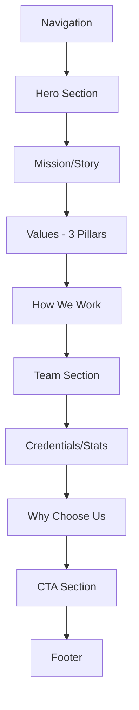

# About Page - Complete Design Specification

**Page:** About Us  
**Route:** `/about`  
**Priority:** 🟡 P1 (Important)  
**Status:** Ready for design implementation

---

## 📋 Page Overview

**Purpose:** Build trust through transparency, humanize the brand, demonstrate expertise, and establish credibility with potential clients.

**Key Goals:**
1. Humanize the company with team faces and stories
2. Establish expertise and credibility
3. Communicate values and approach
4. Show why we're different from agencies/freelancers
5. Build emotional connection
6. Drive conversions to wizard or booking

**Target Audiences:**
- Decision-makers evaluating trust/credibility
- Potential clients researching background
- Partners exploring collaboration
- Job seekers (future expansion)

---

## 🎯 User Journey Flow

```mermaid
graph TD
    A[Land on About Page] --> B[Read Mission/Story]
    B --> C{Trust Established?}
    
    C -->|Want More| D[Scroll to Values]
    C -->|Skip| E[Jump to Team]
    
    D --> F[Read How We Work]
    F --> E
    
    E --> G[View Team Members]
    G --> H{Feeling Connection?}
    
    H -->|Yes| I[Read Credentials]
    H -->|Need Proof| J[View Stats/Numbers]
    
    I --> J
    J --> K{Convinced?}
    
    K -->|Yes| L[Start Brief]
    K -->|Want to Talk| M[Book Call]
    K -->|Need More| N[View Case Studies]
    
    L --> O[/wizard]
    M --> P[/booking]
    N --> Q[/case-studies]
    
    style O fill:#d1fae5
    style P fill:#dbeafe
```

---

## 🎨 Design System Requirements

### Visual Language
- **Human-First:** Real photos, authentic tone
- **Trust Signals:** Credentials, stats, transparency
- **Storytelling:** Narrative arc (why we exist)
- **Team Focus:** Photos, expertise, personality
- **Professional:** Polished but approachable

### Brand Personality
- Expert but not arrogant
- Technical but not jargon-heavy
- Professional but friendly
- Fast but thoughtful

---

## 📐 Page Structure

### Section Hierarchy



---

## 📐 Section 1: Hero Section

**Component:** `AboutHero`

**Desktop Layout (1440px):**
```
┌────────────────────────────────────────────────────────┐
│  EYEBROW: "ABOUT US"                                   │
│                                                         │
│  HEADLINE:                                             │
│  "We build AI systems                                  │
│   that actually work."                                 │
│                                                         │
│  SUBTEXT:                                              │
│  "No 6-month learning curves. No enterprise           │
│   bureaucracy. Just production-ready AI delivered     │
│   in weeks."                                           │
│                                                         │
│  QUICK STATS:                                          │
│  [40+ Projects]  [7-day Avg]  [92% On-Time]           │
└────────────────────────────────────────────────────────┘
```

**Typography:**
- Eyebrow: 14px, uppercase, accent color
- Headline: 64px, 700 weight, line-height 1.05
- Subtext: 20px, 400 weight, neutral-600
- Stats: 28px number, 14px label

**Stats Animation:**
- Count up when page loads
- Stagger: 0.2s delay between each

---

## 📐 Section 2: Mission/Story

**Component:** `MissionStory`

**Desktop Layout:**
```
┌────────────────────────────────────────────────────────┐
│  [Left 60%]                  [Right 40%]              │
│                                                         │
│  SECTION HEADLINE:           [Founder photo or        │
│  "Why we exist"              team photo,              │
│                               400×500px,              │
│  PARAGRAPH 1:                rounded corners]         │
│  "We started this company                             │
│   after spending 2 years at                           │
│   a traditional agency. We                            │
│   watched companies wait 6                            │
│   months for AI projects that                         │
│   should take 2 weeks."                               │
│                                                         │
│  PARAGRAPH 2:                                          │
│  "The problem wasn't the                              │
│   technology—it was the                               │
│   process. Agencies over-                             │
│   complicate. Freelancers                             │
│   lack structure. We built                            │
│   a system that delivers                              │
│   speed without sacrificing                           │
│   quality."                                            │
│                                                         │
│  PARAGRAPH 3:                                          │
│  "Today, we've shipped 40+                            │
│   AI projects with an average                         │
│   delivery time of 7 days.                            │
│   Every client gets production-                       │
│   ready code, full documentation,                     │
│   and 2 weeks of support."                            │
└────────────────────────────────────────────────────────┘
```

**Layout Specs:**
- Left column: 60% width, padding-right 64px
- Right column: 40% width
- Paragraph spacing: 24px
- Font-size: 18px, line-height 1.7
- Color: Neutral-700

**Image Specs:**
- Width: 100% of column
- Aspect ratio: 4:5 (portrait)
- Border-radius: 20px
- Shadow: Soft elevation
- Object-fit: cover

---

## 📐 Section 3: Values - 3 Pillars

**Component:** `ValuesPillars`

**Desktop Layout:**
```
┌────────────────────────────────────────────────────────┐
│  SECTION HEADLINE:                                     │
│  "What we stand for"                                   │
│                                                         │
│  ┌──────────┐    ┌──────────┐    ┌──────────┐        │
│  │ [Icon]   │    │ [Icon]   │    │ [Icon]   │        │
│  │          │    │          │    │          │        │
│  │ SPEED    │    │ QUALITY  │    │ TRUST    │        │
│  │          │    │          │    │          │        │
│  │ We ship  │    │ We don't │    │ We treat │        │
│  │ in weeks,│    │ cut      │    │ your     │        │
│  │ not      │    │ corners. │    │ project  │        │
│  │ months.  │    │ Every    │    │ like our │        │
│  │          │    │ feature  │    │ own.     │        │
│  │ 7-day    │    │ is tested│    │          │        │
│  │ average  │    │ and      │    │ Full code│        │
│  │ delivery │    │ production│   │ ownership│        │
│  │ time.    │    │ ready.   │    │ No lock- │        │
│  │          │    │          │    │ in.      │        │
│  └──────────┘    └──────────┘    └──────────┘        │
└────────────────────────────────────────────────────────┘
```

**Card Specifications:**
- Width: 33.33% (desktop)
- Padding: 40px 32px
- Background: White
- Border: 1px solid neutral-200
- Border-radius: 20px
- Shadow: 0 4px 16px rgba(0,0,0,0.04)
- Gap: 32px

**Icon Specs:**
- Size: 56px
- Color: Accent
- Style: Outlined (not filled)
- Icons:
  - Speed: Lightning bolt ⚡
  - Quality: Shield with checkmark ✓
  - Trust: Handshake 🤝

**Typography:**
- Title: 24px, 700 weight, neutral-900
- Description: 16px, 400 weight, neutral-600
- Metric: 16px, 600 weight, accent color

**Hover State:**
- Lift: translateY(-4px)
- Shadow: 0 8px 32px rgba(0,0,0,0.08)
- Icon: Scale 1.1

---

## 📐 Section 4: How We Work

**Component:** `HowWeWork`

**Desktop Layout:**
```
┌────────────────────────────────────────────────────────┐
│  SECTION HEADLINE:                                     │
│  "Our process"                                         │
│                                                         │
│  ┌────────┐ ──→ ┌────────┐ ──→ ┌────────┐ ──→       │
│  │ Step 1 │     │ Step 2 │     │ Step 3 │           │
│  │        │     │        │     │        │           │
│  │ Brief  │     │ AI     │     │ Build  │           │
│  │        │     │ Plans  │     │        │           │
│  │        │     │        │     │        │           │
│  │ 15 min │     │ 24 hrs │     │ 7 days │           │
│  │ wizard │     │ roadmap│     │ average│           │
│  │        │     │ + quote│     │        │           │
│  └────────┘     └────────┘     └────────┘           │
│                                                         │
│  ┌────────┐                                           │
│  │ Step 4 │                                           │
│  │        │                                           │
│  │ Launch │                                           │
│  │        │                                           │
│  │ Same   │                                           │
│  │ day    │                                           │
│  │ deploy │                                           │
│  └────────┘                                           │
└────────────────────────────────────────────────────────┘
```

**Step Card Specs:**
- Width: 200px
- Height: 240px
- Background: Gradient (white to neutral-50)
- Border: 2px solid neutral-200
- Border-radius: 16px
- Padding: 32px 24px

**Content Hierarchy:**
- Step number: 14px, uppercase, accent color
- Phase name: 24px, 700 weight, neutral-900
- Duration: 18px, 600 weight, accent color
- Description: 14px, neutral-600

**Connectors:**
- Style: Dashed arrow
- Width: 2px
- Color: Neutral-300
- Animation: Draw on scroll

---

## 📐 Section 5: Team Section

**Component:** `TeamGrid`

**Desktop Layout:**
```
┌────────────────────────────────────────────────────────┐
│  SECTION HEADLINE:                                     │
│  "Meet the team"                                       │
│                                                         │
│  ┌─────────────┐  ┌─────────────┐  ┌─────────────┐   │
│  │             │  │             │  │             │   │
│  │ [Photo      │  │ [Photo      │  │ [Photo      │   │
│  │  Square     │  │  Square     │  │  Square     │   │
│  │  280×280]   │  │  280×280]   │  │  280×280]   │   │
│  │             │  │             │  │             │   │
│  ├─────────────┤  ├─────────────┤  ├─────────────┤   │
│  │             │  │             │  │             │   │
│  │ Alex Chen   │  │ Sarah Kim   │  │ Marcus      │   │
│  │             │  │             │  │ Williams    │   │
│  │ Founder &   │  │ Lead AI     │  │ Full-Stack  │   │
│  │ CEO         │  │ Engineer    │  │ Developer   │   │
│  │             │  │             │  │             │   │
│  │ • 8 years   │  │ • 5 years   │  │ • 6 years   │   │
│  │   AI/ML     │  │   NLP       │  │   React     │   │
│  │ • 100+      │  │ • Stanford  │  │ • 50+ AI    │   │
│  │   projects  │  │   CS        │  │   UIs       │   │
│  │             │  │             │  │             │   │
│  │ [LinkedIn]  │  │ [LinkedIn]  │  │ [LinkedIn]  │   │
│  └─────────────┘  └─────────────┘  └─────────────┘   │
│                                                         │
│  [+ 3 more team members in same format]               │
└────────────────────────────────────────────────────────┘
```

**Team Card Specs:**
- Width: 33.33% (desktop), 50% (tablet), 100% (mobile)
- Background: White
- Border: 1px solid neutral-200
- Border-radius: 16px
- Overflow: hidden (photo fills top)

**Photo Section:**
- Width: 100%
- Height: 280px (square)
- Object-fit: cover
- Grayscale: 0% (color photo)
- Filter: Slight warmth/professional edit

**Content Section:**
- Padding: 24px
- Name: 20px, 600 weight, neutral-900
- Role: 16px, 500 weight, accent color
- Credentials: 14px, neutral-600, bullet list
- Social icon: 20px, neutral-400 (default), accent (hover)

**Hover State:**
- Photo: Slight zoom (1.05)
- Card: Lift 4px
- Social icon: Color shift to accent

**Team Members (Example):**
1. **Alex Chen** - Founder & CEO
   - 8 years AI/ML
   - 100+ projects shipped
   
2. **Sarah Kim** - Lead AI Engineer
   - 5 years NLP
   - Stanford CS
   
3. **Marcus Williams** - Full-Stack Developer
   - 6 years React/Node
   - 50+ AI UIs built
   
4. **Priya Sharma** - Product Designer
   - 7 years UX/UI
   - 30+ AI products
   
5. **James Park** - DevOps Engineer
   - 5 years infrastructure
   - AWS/Supabase expert
   
6. **Lisa Chen** - Customer Success
   - 4 years tech support
   - 98% satisfaction rate

---

## 📐 Section 6: Credentials/Stats

**Component:** `CredentialsStats`

**Desktop Layout:**
```
┌────────────────────────────────────────────────────────┐
│  SECTION HEADLINE:                                     │
│  "By the numbers"                                      │
│                                                         │
│  ┌──────┐  ┌──────┐  ┌──────┐  ┌──────┐  ┌──────┐   │
│  │ 40+  │  │ 7    │  │ 92%  │  │ 4.9  │  │ 100% │   │
│  │      │  │ days │  │      │  │ ⭐   │  │      │   │
│  │Projects│Average│On-time│Rating│Code  │   │
│  │Shipped│Delivery│Delivery│      │Own   │   │
│  └──────┘  └──────┘  └──────┘  └──────┘  └──────┘   │
│                                                         │
│  CERTIFICATIONS (Optional):                            │
│  [AWS Certified] [OpenAI Partner] [Supabase Expert]   │
└────────────────────────────────────────────────────────┘
```

**Stat Card Specs:**
- Width: 20% each (5-column grid)
- Padding: 32px 24px
- Background: White
- Border: 1px solid neutral-200
- Border-radius: 12px
- Number: 40px, 700 weight, accent color
- Label: 14px, neutral-600
- Animation: Count up on scroll

**Certification Badges:**
- Height: 60px
- Grayscale: 100% (default)
- Grayscale: 0% (hover)
- Tooltip: Shows certification name

---

## 📐 Section 7: Why Choose Us

**Component:** `WhyChooseUs`

**Desktop Layout:**
```
┌────────────────────────────────────────────────────────┐
│  SECTION HEADLINE:                                     │
│  "Why companies choose us"                             │
│                                                         │
│  ┌────────────────────────────────────────────────┐   │
│  │ VS. HIRING IN-HOUSE                            │   │
│  │                                                 │   │
│  │ ✓ No 6-month ramp-up time                     │   │
│  │ ✓ No salary + benefits ($150k+/year saved)    │   │
│  │ ✓ No management overhead                      │   │
│  │ ✓ Instant expertise across stack              │   │
│  └────────────────────────────────────────────────┘   │
│                                                         │
│  ┌────────────────────────────────────────────────┐   │
│  │ VS. TRADITIONAL AGENCIES                       │   │
│  │                                                 │   │
│  │ ✓ 5x faster delivery (weeks, not months)      │   │
│  │ ✓ 50% lower cost (no bloated teams)           │   │
│  │ ✓ No junior devs learning on your dime        │   │
│  │ ✓ Direct access to senior engineers           │   │
│  └────────────────────────────────────────────────┘   │
│                                                         │
│  ┌────────────────────────────────────────────────┐   │
│  │ VS. FREELANCERS                                │   │
│  │                                                 │   │
│  │ ✓ Structured process (not ad-hoc)             │   │
│  │ ✓ Team backup (never single point of failure) │   │
│  │ ✓ Long-term support (not disappear after)     │   │
│  │ ✓ Production-grade quality (tests, docs, QA)  │   │
│  └────────────────────────────────────────────────┘   │
└────────────────────────────────────────────────────────┘
```

**Comparison Card Specs:**
- Width: 100%
- Padding: 32px
- Background: Neutral-50
- Border-left: 4px solid accent color
- Border-radius: 12px
- Margin: 24px between cards

**Title:**
- Font-size: 18px
- Weight: 700
- Color: Neutral-900
- Text-transform: uppercase
- Letter-spacing: 0.05em

**Benefits List:**
- Checkmark: Green, 20px
- Text: 16px, neutral-700
- Line-height: 1.8
- Spacing: 12px between items

---

## 📐 Section 8: CTA Section

**Component:** `CTA/About`

**Desktop Layout:**
```
┌────────────────────────────────────────────────────────┐
│  HEADLINE:                                             │
│  "Ready to work together?"                             │
│                                                         │
│  SUBTEXT:                                              │
│  "Tell us what you need. We'll send you a custom      │
│   proposal in 24 hours."                               │
│                                                         │
│  [Start Your Brief (15 min) →]    [Book a Call]       │
└────────────────────────────────────────────────────────┘
```

**Background:** Accent color gradient
**Padding:** 120px vertical
**Text color:** White

**Routes:**
- Start Brief → `/wizard`
- Book a Call → `/booking`

---

## 🔗 Route Map

```mermaid
graph TD
    ABOUT[/about] --> WIZARD[/wizard]
    ABOUT --> BOOKING[/booking]
    ABOUT --> CASES[/case-studies]
    ABOUT --> SERVICES[/services]
    
    WIZARD --> THANK_YOU[Success page]
    BOOKING --> CONFIRM[Booking confirmation]
    
    style WIZARD fill:#d1fae5
    style BOOKING fill:#dbeafe
```

---

## 📱 Responsive Breakpoints

### Desktop (1440px+)
- Mission: 60/40 split
- Values: 3-column grid
- Team: 3-column grid
- Stats: 5-column grid

### Tablet (768-1024px)
- Mission: 50/50 split
- Values: 3-column grid (adjusted)
- Team: 2-column grid
- Stats: 3-column grid (wrap)

### Mobile (375-767px)
- Mission: Single column, image below
- Values: Single column stacked
- Team: Single column
- Stats: 2-column grid
- All text: Reduced sizes

---

## 🎬 Animation Specifications

### On Load
1. Hero stats count up
2. Mission section fades in

### On Scroll
- Values cards: Stagger in from bottom (0.1s delay each)
- Process steps: Reveal sequentially with connectors drawing
- Team cards: Stagger in grid pattern
- Stats: Count up when visible
- Comparison cards: Fade in one by one

### Hover States
- Values cards: Lift + glow
- Team cards: Photo zoom + lift
- LinkedIn icons: Color shift
- CTA buttons: Lift + shadow

---

## ✅ Component Checklist

### Must Create
- [ ] `AboutHero` with stats
- [ ] `MissionStory` with founder photo
- [ ] `ValuesPillars` (3 cards)
- [ ] `HowWeWork` timeline (4 steps)
- [ ] `TeamGrid` (6 team members)
- [ ] `CredentialsStats` (5 metrics)
- [ ] `WhyChooseUs` (3 comparison cards)
- [ ] `CTA/About`

### States Required
- [ ] Hero: default, stats animated
- [ ] Values cards: default, hover
- [ ] Team cards: default, hover, photo zoom
- [ ] Stats: default, count-up animation
- [ ] CTA buttons: default, hover, loading

### Content Needed
- [ ] Founder/team photo (mission section)
- [ ] 6 team member photos (square, 280×280px)
- [ ] Team member bios and credentials
- [ ] Company stats (verified numbers)
- [ ] Certification badges (optional)

---

## 🎨 Figma Make AI Prompt (Ready to Paste)

```
Create a luxury about page for an AI development company that builds trust through transparency and team focus.

PAGE STRUCTURE (Desktop 1440px):

1. HERO SECTION:
   - Eyebrow: "ABOUT US"
   - Headline: "We build AI systems that actually work." (64px, bold)
   - Subtext: "No 6-month learning curves. No enterprise bureaucracy. Just production-ready AI delivered in weeks."
   - Quick stats (animate count-up):
     40+ Projects | 7-day Avg Delivery | 92% On-Time

2. MISSION/STORY SECTION (60/40 split):
   Left column (60%):
   - Headline: "Why we exist"
   - 3 paragraphs of story:
     "We started this company after spending 2 years at a traditional agency. We watched companies wait 6 months for AI projects that should take 2 weeks."
     
     "The problem wasn't the technology—it was the process. Agencies over-complicate. Freelancers lack structure. We built a system that delivers speed without sacrificing quality."
     
     "Today, we've shipped 40+ AI projects with an average delivery time of 7 days. Every client gets production-ready code, full documentation, and 2 weeks of support."
   
   Right column (40%):
   - Founder or team photo (400×500px, rounded corners, soft shadow)

3. VALUES - 3 PILLARS (3-column grid):
   Headline: "What we stand for"
   
   Card 1 - SPEED:
   - Icon: Lightning bolt ⚡ (56px, blue)
   - Title: "SPEED"
   - Description: "We ship in weeks, not months."
   - Metric: "7-day average delivery time."
   
   Card 2 - QUALITY:
   - Icon: Shield with checkmark ✓ (56px, blue)
   - Title: "QUALITY"
   - Description: "We don't cut corners. Every feature is tested and production ready."
   
   Card 3 - TRUST:
   - Icon: Handshake 🤝 (56px, blue)
   - Title: "TRUST"
   - Description: "We treat your project like our own."
   - Metric: "Full code ownership. No lock-in."

4. HOW WE WORK (4-step timeline):
   Headline: "Our process"
   
   Step 1: Brief → 15 min wizard
   Step 2: AI Plans → 24 hrs roadmap + quote
   Step 3: Build → 7 days average
   Step 4: Launch → Same day deploy
   
   Connected with dashed arrows

5. TEAM SECTION (3×2 grid = 6 members):
   Headline: "Meet the team"
   
   Create 6 team member cards, each with:
   - Square photo (280×280px, professional)
   - Name (20px, bold)
   - Role (16px, blue)
   - 2-3 credentials (bullet points)
   - LinkedIn icon
   
   Example team members:
   1. Alex Chen - Founder & CEO - 8 years AI/ML, 100+ projects
   2. Sarah Kim - Lead AI Engineer - 5 years NLP, Stanford CS
   3. Marcus Williams - Full-Stack Developer - 6 years React, 50+ AI UIs
   4. Priya Sharma - Product Designer - 7 years UX/UI, 30+ AI products
   5. James Park - DevOps Engineer - 5 years infrastructure, AWS expert
   6. Lisa Chen - Customer Success - 4 years support, 98% satisfaction

6. CREDENTIALS/STATS (5-column grid):
   Headline: "By the numbers"
   
   5 stat cards:
   - 40+ Projects Shipped
   - 7 days Average Delivery
   - 92% On-time Delivery
   - 4.9 ⭐ Rating
   - 100% Code Ownership
   
   Numbers animate (count up) when scrolled into view

7. WHY CHOOSE US (3 comparison cards):
   Headline: "Why companies choose us"
   
   Card 1 - VS. HIRING IN-HOUSE:
   ✓ No 6-month ramp-up time
   ✓ No salary + benefits ($150k+/year saved)
   ✓ No management overhead
   ✓ Instant expertise across stack
   
   Card 2 - VS. TRADITIONAL AGENCIES:
   ✓ 5x faster delivery (weeks, not months)
   ✓ 50% lower cost (no bloated teams)
   ✓ No junior devs learning on your dime
   ✓ Direct access to senior engineers
   
   Card 3 - VS. FREELANCERS:
   ✓ Structured process (not ad-hoc)
   ✓ Team backup (never single point of failure)
   ✓ Long-term support (not disappear after)
   ✓ Production-grade quality (tests, docs, QA)

8. CTA SECTION:
   - Headline: "Ready to work together?"
   - Subtext: "Tell us what you need. We'll send you a custom proposal in 24 hours."
   - Buttons: "Start Your Brief (15 min) →", "Book a Call"
   - Background: Blue gradient
   - Text: White

DESIGN STYLE:
- Professional but approachable
- Real team photos (not stock)
- Luxury SaaS aesthetic
- Trust signals throughout
- Human-first storytelling

RESPONSIVE:
- Desktop: 60/40 mission split, 3-column values/team
- Tablet: 50/50 mission, 2-column team
- Mobile: Single column all sections, stacked layout

INTERACTIONS:
- Hero stats: Count up on load
- Values cards: Lift on hover
- Team cards: Photo zoom + lift on hover
- Process timeline: Steps reveal on scroll with connectors drawing
- Stats: Count up when scrolled into view
- LinkedIn icons: Color shift on hover

ROUTES:
- Start Brief → /wizard
- Book Call → /booking
```

---

**Status:** ✅ Complete specification ready for Figma Make AI implementation  
**Next Step:** Create about page → Add real team photos → Update with actual company story
