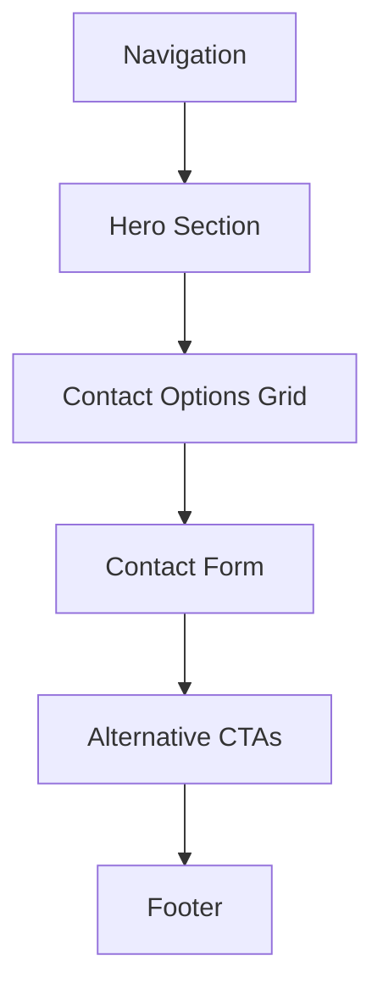

# Contact Page - Complete Design Specification

**Page:** Contact Us  
**Route:** `/contact`  
**Priority:** 🔥 P0 (Core)  
**Status:** Ready for design implementation

---

## 📋 Page Overview

**Purpose:** Provide easy, friction-free way for prospects to reach out, qualify leads through form fields, and route inquiries appropriately.

**Key Goals:**
1. Make contact as easy as possible
2. Qualify leads through smart form design
3. Provide multiple contact methods
4. Handle all form states (validation, loading, success, error)
5. Build trust through transparency (response time, availability)
6. Drive conversions to wizard or booking for qualified leads

**Target Audiences:**
- General inquiries
- Sales prospects
- Support requests
- Partnership inquiries
- Media/press

---

## 🎯 User Journey Flow

```mermaid
graph TD
    A[Land on Contact Page] --> B{Know What They Want?}
    
    B -->|Quick Question| C[Fill Contact Form]
    B -->|Want to Book| D[Click Book Call CTA]
    B -->|Start Project| E[Click Start Brief CTA]
    
    C --> F[Fill Required Fields]
    F --> G{Form Valid?}
    
    G -->|No| H[Show Inline Errors]
    H --> F
    
    G -->|Yes| I[Click Submit]
    I --> J[Show Loading State]
    J --> K{Submit Success?}
    
    K -->|Yes| L[Show Success Message]
    K -->|No| M[Show Error Message]
    
    L --> N[We'll Reply in 24 hrs]
    M --> O[Retry or Contact Support]
    
    D --> P[/booking]
    E --> Q[/wizard]
    
    style P fill:#dbeafe
    style Q fill:#d1fae5
```

---

## 🎨 Design System Requirements

### Visual Language
- **Form Design:** Clean, spacious, luxury feel
- **Validation:** Inline, real-time, helpful
- **States:** Clear loading, success, error states
- **Trust:** Response time guarantees, availability
- **Alternative CTAs:** Route qualified leads to wizard/booking

### Form UX Principles
- Large input fields (min 56px height)
- Clear labels (not placeholders as labels)
- Inline validation (on blur, not on every keystroke)
- Helpful error messages (not just "Invalid")
- Disabled submit until valid
- Loading state during submission
- Clear success/failure feedback

---

## 📐 Page Structure

### Section Hierarchy



---

## 📐 Section 1: Hero Section

**Component:** `ContactHero`

**Desktop Layout (1440px):**
```
┌────────────────────────────────────────────────────────┐
│  EYEBROW: "CONTACT US"                                 │
│                                                         │
│  HEADLINE:                                             │
│  "Let's talk about                                     │
│   your project."                                       │
│                                                         │
│  SUBTEXT:                                              │
│  "We respond to every inquiry within 24 hours.        │
│   For faster service, book a call or start the        │
│   brief wizard."                                       │
│                                                         │
│  RESPONSE TIME BADGE:                                  │
│  ⏱️ "Average response: 4 hours"                       │
└────────────────────────────────────────────────────────┘
```

**Typography:**
- Eyebrow: 14px, uppercase, accent color
- Headline: 56px, 700 weight, line-height 1.1
- Subtext: 20px, 400 weight, neutral-600
- Badge: 16px, 600 weight, with icon

**Response Time Badge:**
- Background: Accent-50
- Border: 1px solid accent-200
- Border-radius: 24px (pill)
- Padding: 8px 20px
- Icon: Clock, 20px
- Display: inline-flex, centered

---

## 📐 Section 2: Contact Options Grid

**Component:** `ContactOptionsGrid`

**Desktop Layout:**
```
┌────────────────────────────────────────────────────────┐
│  SECTION HEADLINE:                                     │
│  "How would you like to connect?"                      │
│                                                         │
│  ┌──────────┐    ┌──────────┐    ┌──────────┐        │
│  │ [Icon]   │    │ [Icon]   │    │ [Icon]   │        │
│  │          │    │          │    │          │        │
│  │ Email    │    │ Book     │    │ Start    │        │
│  │          │    │ Call     │    │ Brief    │        │
│  │ Fill form│    │ 30-min   │    │ Get quote│        │
│  │ below    │    │ video    │    │ in 24h   │        │
│  │          │    │ call     │    │          │        │
│  │ Response │    │ Same or  │    │ AI      │        │
│  │ in 24hrs │    │ next day │    │ generates│        │
│  │          │    │          │    │ roadmap  │        │
│  │ [→]      │    │ [Book →] │    │ [Start →]│        │
│  └──────────┘    └──────────┘    └──────────┘        │
└────────────────────────────────────────────────────────┘
```

**Option Card Specs:**
- Width: 33.33% (desktop)
- Padding: 40px 32px
- Background: White
- Border: 2px solid neutral-200
- Border-radius: 20px
- Shadow: 0 4px 16px rgba(0,0,0,0.04)
- Gap: 24px

**Icon:**
- Size: 48px
- Color: Accent
- Style: Outlined
- Icons:
  - Email: ✉️ Envelope
  - Book Call: 📞 Calendar
  - Start Brief: ⚡ Lightning

**Typography:**
- Title: 20px, 700 weight, neutral-900
- Description: 16px, 400 weight, neutral-600
- Benefit: 14px, 600 weight, accent color

**Hover State:**
- Lift: translateY(-4px)
- Shadow: 0 8px 32px rgba(0,0,0,0.08)
- Border: Accent color
- Icon: Scale 1.1

**CTA:**
- Email option: Scrolls to form below
- Book Call: Routes to `/booking`
- Start Brief: Routes to `/wizard`

---

## 📐 Section 3: Contact Form

**Component:** `ContactForm`

**Desktop Layout:**
```
┌────────────────────────────────────────────────────────┐
│  FORM HEADLINE:                                        │
│  "Send us a message"                                   │
│                                                         │
│  ┌──────────────────────────────────────────────────┐ │
│  │  NAME *                                          │ │
│  │  [                                          ]    │ │
│  │                                                   │ │
│  │  EMAIL *                                         │ │
│  │  [                                          ]    │ │
│  │                                                   │ │
│  │  COMPANY                                         │ │
│  │  [                                          ]    │ │
│  │                                                   │ │
│  │  WHAT DO YOU NEED HELP WITH? *                   │ │
│  │  [ Project inquiry          ▼ ]                 │ │
│  │                                                   │ │
│  │  MESSAGE *                                       │ │
│  │  [                                          ]    │ │
│  │  [                                          ]    │ │
│  │  [                                          ]    │ │
│  │  [                                          ]    │ │
│  │                                                   │ │
│  │  [ ] I agree to the privacy policy              │ │
│  │                                                   │ │
│  │  [Send Message →]                                │ │
│  └──────────────────────────────────────────────────┘ │
│                                                         │
│  * Required fields                                     │
└────────────────────────────────────────────────────────┘
```

### Form Field Specifications

**Container:**
- Max-width: 600px
- Padding: 48px
- Background: White
- Border: 1px solid neutral-200
- Border-radius: 20px
- Shadow: 0 4px 24px rgba(0,0,0,0.06)

**Text Input Fields:**
- Height: 56px
- Padding: 16px 20px
- Border: 2px solid neutral-300
- Border-radius: 12px
- Font-size: 16px
- Background: White
- Transition: 0.2s ease

**Textarea:**
- Height: 160px (4-5 lines)
- Padding: 16px 20px
- Resize: vertical
- Same border/radius as inputs

**Dropdown:**
- Height: 56px
- Custom styled (not native)
- Chevron icon right-aligned
- Options list: Same styling as input

**Label:**
- Font-size: 14px
- Weight: 600
- Color: Neutral-700
- Margin-bottom: 8px
- Required indicator: Red asterisk *

**Checkbox:**
- Size: 20px
- Border: 2px solid neutral-300
- Border-radius: 4px
- Checkmark: Accent color
- Label: 14px, neutral-600

### Form Fields

1. **Name** (required)
   - Type: Text input
   - Validation: Min 2 characters
   - Error: "Please enter your name"

2. **Email** (required)
   - Type: Email input
   - Validation: Valid email format
   - Error: "Please enter a valid email address"

3. **Company** (optional)
   - Type: Text input
   - No validation

4. **What do you need help with?** (required)
   - Type: Dropdown
   - Options:
     - "Project inquiry"
     - "Technical question"
     - "Partnership"
     - "Support request"
     - "Media/Press"
     - "Other"
   - Error: "Please select an option"

5. **Message** (required)
   - Type: Textarea
   - Validation: Min 10 characters
   - Error: "Please provide more details (min 10 characters)"

6. **Privacy Policy** (required)
   - Type: Checkbox
   - Label: "I agree to the privacy policy"
   - Link: Opens privacy policy in modal or new tab
   - Error: "You must agree to the privacy policy"

---

## 📐 Section 4: Form States

### State 1: Default (Empty)
```
┌────────────────────────────────┐
│ NAME *                         │
│ [                         ]    │
│                                │
│ EMAIL *                        │
│ [                         ]    │
│                                │
│ [Send Message]                 │
│ (Button disabled, gray)        │
└────────────────────────────────┘
```

**Input State:**
- Border: 2px solid neutral-300
- Background: White
- Placeholder: Light gray (neutral-400)

**Submit Button:**
- Background: Neutral-300 (disabled)
- Color: Neutral-500
- Cursor: not-allowed
- No hover effect

---

### State 2: Field Focus
```
┌────────────────────────────────┐
│ NAME *                         │
│ [█                        ]    │ ← Cursor visible
│                                │
│ Border: Blue (accent)          │
│ Shadow: 0 0 0 4px accent-100   │
└────────────────────────────────┘
```

**Input State:**
- Border: 2px solid accent color
- Shadow: 0 0 0 4px rgba(accent, 0.1)
- Background: White

---

### State 3: Field Error
```
┌────────────────────────────────┐
│ EMAIL *                        │
│ [invalid@                 ]    │
│ ❌ Please enter a valid email  │
│                                │
│ Border: Red                    │
└────────────────────────────────┘
```

**Input State:**
- Border: 2px solid error-500 (red)
- Background: error-50 (light red)
- Error message: 14px, error-600, with icon

**Error Icon:**
- Size: 16px
- Color: Error-500
- Position: Before text

---

### State 4: Field Success
```
┌────────────────────────────────┐
│ EMAIL *                        │
│ [john@example.com         ] ✓  │
│                                │
│ Border: Green                  │
└────────────────────────────────┘
```

**Input State:**
- Border: 2px solid success-500 (green)
- Checkmark: 20px, success-500, right-aligned

---

### State 5: Submitting (Loading)
```
┌────────────────────────────────┐
│ [Sending... ⟳]                 │
│                                │
│ Button shows spinner           │
│ Form fields disabled           │
└────────────────────────────────┘
```

**Button State:**
- Background: Accent color (blue)
- Text: "Sending..."
- Icon: Spinner animation (rotating)
- Cursor: wait
- Disabled: true

**Form State:**
- All inputs: Disabled (opacity 0.6)
- Cursor: not-allowed

---

### State 6: Success
```
┌────────────────────────────────────────────┐
│                                            │
│  ✓ Message sent successfully!              │
│                                            │
│  Thanks for reaching out. We'll reply     │
│  within 24 hours (usually much faster).   │
│                                            │
│  [Back to Home]  [Start Brief →]          │
│                                            │
└────────────────────────────────────────────┘
```

**Success Screen:**
- Background: Success-50 (light green)
- Border: 2px solid success-500
- Border-radius: 20px
- Padding: 48px
- Checkmark: 64px, success-500
- Heading: 24px, 700 weight
- Message: 16px, neutral-700
- Buttons: Primary (Start Brief), Secondary (Home)

**Animation:**
- Success screen scales in (0.95 → 1)
- Checkmark draws/pulses
- Form fades out

---

### State 7: Error (Submission Failed)
```
┌────────────────────────────────────────────┐
│                                            │
│  ⚠️ Something went wrong                   │
│                                            │
│  We couldn't send your message. Please    │
│  try again or email us directly at        │
│  hello@company.com                         │
│                                            │
│  [Try Again]  [Email Us]                  │
│                                            │
└────────────────────────────────────────────┘
```

**Error Screen:**
- Background: Error-50 (light red)
- Border: 2px solid error-500
- Border-radius: 20px
- Padding: 48px
- Warning icon: 64px, error-500
- Heading: 24px, 700 weight
- Message: 16px, neutral-700
- Email: Clickable mailto: link
- Buttons: Primary (Try Again), Secondary (Email)

**Try Again Button:**
- Clears error state
- Returns to form (preserves data)
- Re-enables submit

---

## 📐 Section 5: Alternative CTAs

**Component:** `AlternativeCTAs`

**Desktop Layout:**
```
┌────────────────────────────────────────────────────────┐
│  SECTION HEADLINE:                                     │
│  "Prefer a different approach?"                        │
│                                                         │
│  ┌──────────────────────┬──────────────────────┐      │
│  │ START BRIEF          │ BOOK A CALL          │      │
│  │                      │                      │      │
│  │ Get an AI-generated  │ Talk to an expert    │      │
│  │ roadmap + proposal   │ via video call       │      │
│  │ in 24 hours          │                      │      │
│  │                      │ 30 minutes           │      │
│  │ [Start Brief →]      │ [Book Call →]        │      │
│  └──────────────────────┴──────────────────────┘      │
└────────────────────────────────────────────────────────┘
```

**Card Specs:**
- Width: 50% each
- Padding: 40px
- Background: Gradient (accent-50 to white)
- Border: 1px solid neutral-200
- Border-radius: 16px
- Gap: 24px

**Routes:**
- Start Brief → `/wizard`
- Book Call → `/booking`

---

## 🔗 Route Map

```mermaid
graph TD
    CONTACT[/contact] --> FORM_SUBMIT[Submit Form]
    CONTACT --> WIZARD[/wizard]
    CONTACT --> BOOKING[/booking]
    
    FORM_SUBMIT --> SUCCESS[Success State]
    FORM_SUBMIT --> ERROR[Error State]
    
    SUCCESS --> HOME[/]
    SUCCESS --> WIZARD
    
    ERROR --> RETRY[Try Again]
    ERROR --> EMAIL[mailto:hello@company.com]
    
    style WIZARD fill:#d1fae5
    style BOOKING fill:#dbeafe
```

---

## 📱 Responsive Breakpoints

### Desktop (1440px+)
- Contact options: 3-column grid
- Form: Max-width 600px, centered
- Alternative CTAs: 2-column

### Tablet (768-1024px)
- Contact options: 3-column (adjusted)
- Form: Max-width 540px
- Alternative CTAs: 2-column

### Mobile (375-767px)
- Contact options: Single column stacked
- Form: 100% width, padding 24px
- Input height: 52px (slightly smaller)
- Alternative CTAs: Single column stacked

---

## 🎬 Animation Specifications

### On Load
1. Hero fades in
2. Contact options stagger in (0.1s delay each)
3. Form scales in (0.95 → 1)

### On Interaction
- Input focus: Border color transition (0.2s)
- Input focus: Shadow appears (0.2s)
- Hover cards: Lift 4px (0.2s)
- Submit button: Loading spinner rotates (infinite)

### On Submit
- Form fades out (0.3s)
- Success/error screen scales in (0.95 → 1, 0.3s)
- Checkmark/warning icon draws/pulses

---

## 🎨 Validation Rules

### Name Field
```javascript
const validateName = (value) => {
  if (!value || value.trim().length < 2) {
    return "Please enter your name";
  }
  return null; // Valid
}
```

### Email Field
```javascript
const validateEmail = (value) => {
  const emailRegex = /^[^\s@]+@[^\s@]+\.[^\s@]+$/;
  if (!value) {
    return "Email is required";
  }
  if (!emailRegex.test(value)) {
    return "Please enter a valid email address";
  }
  return null; // Valid
}
```

### Message Field
```javascript
const validateMessage = (value) => {
  if (!value || value.trim().length < 10) {
    return "Please provide more details (min 10 characters)";
  }
  return null; // Valid
}
```

### Privacy Policy
```javascript
const validatePrivacy = (checked) => {
  if (!checked) {
    return "You must agree to the privacy policy";
  }
  return null; // Valid
}
```

---

## ✅ Component Checklist

### Must Create
- [ ] `ContactHero` with response time badge
- [ ] `ContactOptionsGrid` (3 cards)
- [ ] `ContactForm` with all fields
- [ ] `FormInput` (default, focus, error, success, disabled)
- [ ] `FormTextarea` (same states)
- [ ] `FormDropdown` (custom styled)
- [ ] `FormCheckbox` (checked, unchecked, error)
- [ ] `SubmitButton` (default, hover, loading, disabled)
- [ ] `SuccessScreen`
- [ ] `ErrorScreen`
- [ ] `AlternativeCTAs`

### States Required
- [ ] Input: default, focus, error, success, disabled
- [ ] Form: empty, partial, valid, submitting
- [ ] Submit button: disabled, enabled, hover, loading
- [ ] Success screen: visible, animated
- [ ] Error screen: visible, animated

### Validation Required
- [ ] Real-time inline validation (on blur)
- [ ] Submit button disabled until valid
- [ ] Clear error messages
- [ ] Email format validation
- [ ] Required field validation
- [ ] Min character validation (message)
- [ ] Privacy policy checkbox validation

---

## 🎨 Figma Make AI Prompt (Ready to Paste)

```
Create a luxury contact page with comprehensive form states and validation for an AI development company.

PAGE STRUCTURE (Desktop 1440px):

1. HERO SECTION:
   - Eyebrow: "CONTACT US"
   - Headline: "Let's talk about your project." (56px, bold)
   - Subtext: "We respond to every inquiry within 24 hours. For faster service, book a call or start the brief wizard."
   - Response time badge: "⏱️ Average response: 4 hours" (pill shape, blue background)

2. CONTACT OPTIONS GRID (3 cards):
   Headline: "How would you like to connect?"
   
   Card 1 - Email:
   - Icon: ✉️ Envelope (48px, blue)
   - Title: "Email"
   - Description: "Fill form below"
   - Benefit: "Response in 24hrs"
   - Button: Arrow icon (scrolls to form)
   
   Card 2 - Book Call:
   - Icon: 📞 Calendar (48px, blue)
   - Title: "Book Call"
   - Description: "30-min video call"
   - Benefit: "Same or next day"
   - Button: "Book →" → /booking
   
   Card 3 - Start Brief:
   - Icon: ⚡ Lightning (48px, blue)
   - Title: "Start Brief"
   - Description: "Get quote in 24h"
   - Benefit: "AI generates roadmap"
   - Button: "Start →" → /wizard

3. CONTACT FORM:
   Headline: "Send us a message"
   
   Form container (max-width 600px, centered, white card):
   
   Field 1: NAME * (required)
   - Text input, 56px height
   - Validation: Min 2 characters
   - Error message: "Please enter your name"
   
   Field 2: EMAIL * (required)
   - Email input, 56px height
   - Validation: Valid email format
   - Error message: "Please enter a valid email address"
   
   Field 3: COMPANY (optional)
   - Text input, 56px height
   - No validation
   
   Field 4: WHAT DO YOU NEED HELP WITH? * (required)
   - Dropdown, 56px height
   - Options: Project inquiry | Technical question | Partnership | Support request | Media/Press | Other
   - Error message: "Please select an option"
   
   Field 5: MESSAGE * (required)
   - Textarea, 160px height
   - Validation: Min 10 characters
   - Error message: "Please provide more details (min 10 characters)"
   
   Field 6: Privacy Policy Checkbox * (required)
   - Checkbox with label: "I agree to the privacy policy"
   - Link to privacy policy
   - Error message: "You must agree to the privacy policy"
   
   Submit Button: "Send Message →"
   - Disabled (gray) until all required fields valid
   - Enabled (blue) when valid
   - Loading state: "Sending... ⟳" with spinner

4. FORM STATES (create variants):
   
   A) DEFAULT STATE:
   - All inputs empty
   - Submit button disabled (gray)
   - Placeholder text in light gray
   
   B) FOCUS STATE:
   - Input has blue border (2px)
   - Subtle blue shadow (glow)
   - Cursor visible
   
   C) ERROR STATE:
   - Input has red border
   - Light red background
   - Error message below input (red text with ❌ icon)
   - Show errors for: empty name, invalid email, short message, unchecked privacy
   
   D) SUCCESS STATE (per field):
   - Input has green border
   - Green checkmark ✓ right side
   
   E) SUBMITTING STATE:
   - Submit button shows "Sending... ⟳"
   - All inputs disabled (grayed out)
   - Cursor: wait
   
   F) SUCCESS SCREEN (replaces form):
   - Green background (light)
   - Large checkmark ✓ (64px)
   - Headline: "Message sent successfully!"
   - Message: "Thanks for reaching out. We'll reply within 24 hours..."
   - Buttons: "Back to Home" | "Start Brief →"
   - Scale in animation (0.95 → 1)
   
   G) ERROR SCREEN (replaces form):
   - Red background (light)
   - Warning icon ⚠️ (64px)
   - Headline: "Something went wrong"
   - Message: "We couldn't send your message. Please try again or email us directly at hello@company.com"
   - Buttons: "Try Again" | "Email Us"

5. ALTERNATIVE CTAs (2 cards):
   Headline: "Prefer a different approach?"
   
   Card 1 - Start Brief:
   - Title: "START BRIEF"
   - Description: "Get an AI-generated roadmap + proposal in 24 hours"
   - Button: "Start Brief →" → /wizard
   
   Card 2 - Book Call:
   - Title: "BOOK A CALL"
   - Description: "Talk to an expert via video call. 30 minutes"
   - Button: "Book Call →" → /booking

DESIGN STYLE:
- Luxury form design with generous spacing
- Input fields: 56px height, 12px border radius
- All inputs have clear labels (not placeholder-as-label)
- Inline validation (shows on blur, not every keystroke)
- Form in white card with soft shadow
- Success/error states with color-coded backgrounds
- Professional, clean, trustworthy

RESPONSIVE:
- Desktop: 3-column options, centered form (600px max)
- Tablet: 3-column options, centered form (540px max)
- Mobile: Single column, form 100% width, inputs 52px height

INTERACTIONS:
- Input focus: Border color + shadow transition (0.2s)
- Contact option cards: Lift 4px on hover
- Submit button: Disabled state until form valid
- Loading: Spinner rotates during submit
- Success/Error: Scale in animation (0.95 → 1)
- Validation: Shows on blur, clears on fix

VALIDATION:
- Name: Min 2 characters
- Email: Valid email format (regex)
- Message: Min 10 characters
- Dropdown: Must select option
- Privacy: Must be checked
- Submit disabled until all valid

ROUTES:
- Email option → Scroll to form
- Book Call → /booking
- Start Brief → /wizard
- Success "Start Brief" → /wizard
- Error "Email Us" → mailto:hello@company.com
```

---

**Status:** ✅ Complete specification ready for Figma Make AI implementation  
**Next Step:** Create contact page with all states → Test form validation → Integrate with email service (Supabase Edge Function or similar)
