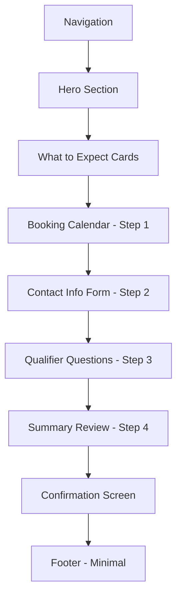

# Booking Page - Complete Design Specification

**Page:** Booking / Schedule Call  
**Route:** `/booking`  
**Priority:** 🔥 P0 (Core)  
**Status:** Ready for design implementation

---

## 📋 Page Overview

**Purpose:** Enable prospects to easily schedule discovery/consultation calls with minimal friction while qualifying leads through smart form design.

**Key Goals:**
1. Make scheduling as easy as possible (Calendly-like UX)
2. Qualify leads before the call
3. Collect necessary context for productive conversation
4. Handle all scheduling states (loading, success, error, conflicts)
5. Send automatic confirmations and reminders
6. Provide clear next steps after booking

**Target Audiences:**
- Qualified leads ready to discuss project
- Decision-makers seeking consultation
- Technical stakeholders needing deep-dive
- Budget holders evaluating options

---

## 🎯 User Journey Flow

```mermaid
graph TD
    A[Land on Booking Page] --> B[Read About Call]
    B --> C[Select Date]
    C --> D[Select Time Slot]
    D --> E{Slot Available?}
    
    E -->|Yes| F[Fill Contact Info]
    E -->|No| G[Show Conflict Message]
    
    G --> D
    
    F --> H[Fill Qualifier Questions]
    H --> I[Review Summary]
    I --> J[Confirm Booking]
    J --> K[Show Loading]
    K --> L{Booking Success?}
    
    L -->|Yes| M[Show Success Screen]
    L -->|No| N[Show Error Screen]
    
    M --> O[Receive Email Confirmation]
    M --> P[Add to Calendar]
    M --> Q[Optional: Start Brief]
    
    N --> R[Retry or Contact Support]
    
    Q --> S[/wizard]
    
    style S fill:#d1fae5
    style M fill:#d1fae5
```

---

## 🎨 Design System Requirements

### Visual Language
- **Calendar UX:** Clean, Calendly-inspired, luxury feel
- **Step Progression:** Clear visual indication of progress
- **Time Slots:** Large, touch-friendly, grouped by day
- **Confirmation:** Professional, reassuring, clear next steps
- **Trust Signals:** Expert photos, response time, preparation tips

### Booking Flow Principles
- One-column layout (focused, no distractions)
- Large interactive elements (min 56px touch targets)
- Instant feedback (no page reloads)
- Clear progress indication
- Back button available at each step
- Mobile-first design (works perfectly on phones)

---

## 📐 Page Structure

### Section Hierarchy



---

## 📐 Section 1: Hero Section

**Component:** `BookingHero`

**Desktop Layout (1440px):**
```
┌────────────────────────────────────────────────────────┐
│  EYEBROW: "BOOK A CALL"                                │
│                                                         │
│  HEADLINE:                                             │
│  "Let's discuss your project."                         │
│                                                         │
│  SUBTEXT:                                              │
│  "30-minute video call to understand your needs and   │
│   show you how we can help."                           │
│                                                         │
│  AVAILABILITY:                                         │
│  🗓️ "Next available: Today at 2pm EST"                │
└────────────────────────────────────────────────────────┘
```

**Typography:**
- Eyebrow: 14px, uppercase, accent color
- Headline: 48px, 700 weight, line-height 1.1
- Subtext: 18px, 400 weight, neutral-600
- Availability: 16px, 600 weight, with icon

**Availability Badge:**
- Background: Success-50 (light green)
- Border: 1px solid success-200
- Border-radius: 8px
- Padding: 8px 16px
- Icon: Calendar, 20px
- Real-time update (shows actual next slot)

---

## 📐 Section 2: What to Expect

**Component:** `CallExpectations`

**Desktop Layout:**
```
┌────────────────────────────────────────────────────────┐
│  SECTION HEADLINE:                                     │
│  "What to expect"                                      │
│                                                         │
│  ┌──────────┐    ┌──────────┐    ┌──────────┐        │
│  │ [Icon]   │    │ [Icon]   │    │ [Icon]   │        │
│  │          │    │          │    │          │        │
│  │ Duration │    │ Format   │    │ Outcome  │        │
│  │          │    │          │    │          │        │
│  │ 30 min   │    │ Video    │    │ Custom   │        │
│  │ focused  │    │ call via │    │ proposal │        │
│  │ call     │    │ Zoom     │    │ in 24hrs │        │
│  └──────────┘    └──────────┘    └──────────┘        │
└────────────────────────────────────────────────────────┘
```

**Card Specs:**
- Width: 33.33% each
- Padding: 32px 24px
- Background: White
- Border: 1px solid neutral-200
- Border-radius: 12px
- Icon: 40px, accent color
- Title: 18px, 600 weight
- Description: 14px, neutral-600

---

## 📐 Section 3: Booking Calendar - Step 1

**Component:** `CalendarSelector`

**Desktop Layout (1440px):**
```
┌────────────────────────────────────────────────────────┐
│  STEP INDICATOR: [1]───○───○───○                      │
│  STEP TITLE: "Select date & time"                     │
│                                                         │
│  ┌──────────────────────────────────────────────────┐ │
│  │  CALENDAR VIEW                                   │ │
│  │                                                   │ │
│  │  December 2025                           [< >]   │ │
│  │  ───────────────────────────────────────────────│ │
│  │  Sun Mon Tue Wed Thu Fri Sat                    │ │
│  │                      1   2   3   4              │ │
│  │   5   6   7   8   9  10  11                     │ │
│  │  12  13  14  15  16  17  18                     │ │
│  │  19  20  21  22  23  24  25                     │ │
│  │  26  27  28  29  30  31                         │ │
│  │                                                   │ │
│  │  SELECTED: Wednesday, December 18                │ │
│  └──────────────────────────────────────────────────┘ │
│                                                         │
│  ┌──────────────────────────────────────────────────┐ │
│  │  AVAILABLE TIME SLOTS                            │ │
│  │                                                   │ │
│  │  Morning                                         │ │
│  │  [9:00am] [9:30am] [10:00am] [10:30am] [11:00am]│ │
│  │                                                   │ │
│  │  Afternoon                                       │ │
│  │  [1:00pm] [1:30pm] [2:00pm] [2:30pm] [3:00pm]  │ │
│  │  [3:30pm] [4:00pm]                              │ │
│  │                                                   │ │
│  │  Evening                                         │ │
│  │  [5:00pm] [5:30pm] [Booked] [Booked]           │ │
│  └──────────────────────────────────────────────────┘ │
│                                                         │
│  [← Back]                            [Next: Your Info →]│
└────────────────────────────────────────────────────────┘
```

**Step Indicator:**
- 4 circles, filled = current/complete, outlined = upcoming
- Connected by lines
- Active step: Accent color, larger (24px)
- Completed: Checkmark inside
- Upcoming: Gray outline

**Calendar Specs:**
- Width: 100%, max 500px
- Month navigation: Arrows left/right
- Day cells: 56px × 56px
- Today: Outlined in accent color
- Selected: Filled accent color
- Disabled (past/unavailable): Gray, not clickable
- Hover: Background accent-50

**Time Slot Specs:**
- Width: Auto (fit content)
- Height: 48px
- Padding: 12px 20px
- Background: White
- Border: 2px solid neutral-300
- Border-radius: 8px
- Font-size: 16px, 600 weight
- Display: inline-flex, flex-wrap
- Gap: 12px

**Time Slot States:**
- **Available (default):**
  - Border: neutral-300
  - Hover: Border accent, background accent-50
  
- **Selected:**
  - Background: Accent color
  - Border: Accent color
  - Color: White
  - Checkmark icon right-aligned
  
- **Booked:**
  - Background: Neutral-100
  - Border: Neutral-200
  - Color: Neutral-400
  - Cursor: not-allowed
  - Text: "Booked"

**Time Grouping:**
- Section headers: "Morning", "Afternoon", "Evening"
- Font-size: 14px, uppercase, neutral-500
- Margin: 24px top

**Next Button:**
- Disabled until date + time selected
- Enabled: Accent color, white text
- Disabled: Gray background
- Width: Auto, min 160px
- Height: 56px

---

## 📐 Section 4: Contact Info Form - Step 2

**Component:** `ContactInfoForm`

**Desktop Layout:**
```
┌────────────────────────────────────────────────────────┐
│  STEP INDICATOR: [✓]───[2]───○───○                    │
│  STEP TITLE: "Your information"                       │
│                                                         │
│  SELECTED SLOT REMINDER:                               │
│  📅 Wednesday, Dec 18 at 2:00pm EST                    │
│                                                         │
│  ┌──────────────────────────────────────────────────┐ │
│  │  FULL NAME *                                     │ │
│  │  [                                          ]    │ │
│  │                                                   │ │
│  │  EMAIL *                                         │ │
│  │  [                                          ]    │ │
│  │                                                   │ │
│  │  PHONE (optional)                                │ │
│  │  [                                          ]    │ │
│  │                                                   │ │
│  │  COMPANY                                         │ │
│  │  [                                          ]    │ │
│  │                                                   │ │
│  │  LINKEDIN (optional)                             │ │
│  │  [                                          ]    │ │
│  └──────────────────────────────────────────────────┘ │
│                                                         │
│  [← Back to Calendar]               [Next: Tell Us More →]│
└────────────────────────────────────────────────────────┘
```

**Form Field Specs:**
- Same as Contact page form
- Input height: 56px
- Border-radius: 12px
- Label: 14px, 600 weight
- Required fields marked with *

**Validation Rules:**
- Name: Min 2 characters
- Email: Valid email format
- Phone: Optional, validates if entered
- Company: Optional
- LinkedIn: Optional, validates URL format if entered

**Selected Slot Reminder:**
- Background: Accent-50
- Border: 1px solid accent-200
- Border-radius: 8px
- Padding: 12px 20px
- Icon: Calendar
- Font-size: 16px, 600 weight
- Position: Sticky (stays visible on scroll)

---

## 📐 Section 5: Qualifier Questions - Step 3

**Component:** `QualifierQuestions`

**Desktop Layout:**
```
┌────────────────────────────────────────────────────────┐
│  STEP INDICATOR: [✓]───[✓]───[3]───○                  │
│  STEP TITLE: "Tell us about your project"             │
│                                                         │
│  SELECTED SLOT: 📅 Wed, Dec 18 at 2:00pm EST          │
│                                                         │
│  ┌──────────────────────────────────────────────────┐ │
│  │  WHAT DO YOU NEED HELP WITH? *                   │ │
│  │  [ AI Chatbot                           ▼ ]     │ │
│  │                                                   │ │
│  │  WHAT'S YOUR TIMELINE? *                         │ │
│  │  [ ASAP (1-2 weeks)                     ▼ ]     │ │
│  │                                                   │ │
│  │  WHAT'S YOUR BUDGET RANGE? *                     │ │
│  │  [ $5k - $15k                           ▼ ]     │ │
│  │                                                   │ │
│  │  TELL US MORE ABOUT YOUR PROJECT *               │ │
│  │  [                                          ]    │ │
│  │  [                                          ]    │ │
│  │  [                                          ]    │ │
│  │  [                                          ]    │ │
│  │  (Min 20 characters)                             │ │
│  │                                                   │ │
│  │  HOW DID YOU HEAR ABOUT US? (optional)           │ │
│  │  [                                          ]    │ │
│  └──────────────────────────────────────────────────┘ │
│                                                         │
│  [← Back]                           [Next: Review →]    │
└────────────────────────────────────────────────────────┘
```

**Qualifier Questions:**

1. **What do you need help with?** (Dropdown, required)
   - AI Chatbot
   - AI Agents
   - Automations
   - Dashboards & Ops
   - Data & RAG
   - Custom Development
   - Not Sure Yet

2. **What's your timeline?** (Dropdown, required)
   - ASAP (1-2 weeks)
   - Next month
   - 2-3 months
   - Exploring options

3. **What's your budget range?** (Dropdown, required)
   - Under $5k
   - $5k - $15k
   - $15k - $50k
   - $50k+
   - Not sure yet

4. **Tell us more about your project** (Textarea, required)
   - Min 20 characters
   - Placeholder: "What problem are you trying to solve? Who are your users? What's your current process?"

5. **How did you hear about us?** (Text input, optional)
   - Placeholder: "Google, referral, LinkedIn, etc."

**Purpose:**
These questions help the team prepare for the call with relevant context and qualify whether the lead is a good fit.

---

## 📐 Section 6: Summary Review - Step 4

**Component:** `BookingSummary`

**Desktop Layout:**
```
┌────────────────────────────────────────────────────────┐
│  STEP INDICATOR: [✓]───[✓]───[✓]───[4]                │
│  STEP TITLE: "Review & confirm"                       │
│                                                         │
│  ┌──────────────────────────────────────────────────┐ │
│  │  CALL DETAILS                            [Edit]  │ │
│  │  ────────────────────────────────────────────────│ │
│  │  📅 Wednesday, December 18, 2025                 │ │
│  │  🕐 2:00pm - 2:30pm EST                          │ │
│  │  📹 Video call (Zoom link sent via email)        │ │
│  └──────────────────────────────────────────────────┘ │
│                                                         │
│  ┌──────────────────────────────────────────────────┐ │
│  │  YOUR INFORMATION                        [Edit]  │ │
│  │  ────────────────────────────────────────────────│ │
│  │  John Smith                                      │ │
│  │  john@company.com                                │ │
│  │  +1 (555) 123-4567                               │ │
│  │  Acme Corp                                       │ │
│  └──────────────────────────────────────────────────┘ │
│                                                         │
│  ┌──────────────────────────────────────────────────┐ │
│  │  PROJECT DETAILS                         [Edit]  │ │
│  │  ────────────────────────────────────────────────│ │
│  │  Service: AI Chatbot                             │ │
│  │  Timeline: ASAP (1-2 weeks)                      │ │
│  │  Budget: $5k - $15k                              │ │
│  │  Description: "We need a chatbot to qualify..."  │ │
│  └──────────────────────────────────────────────────┘ │
│                                                         │
│  ┌──────────────────────────────────────────────────┐ │
│  │  BEFORE THE CALL                                 │ │
│  │  ────────────────────────────────────────────────│ │
│  │  ✓ You'll receive a calendar invite via email   │ │
│  │  ✓ A reminder 1 hour before the call            │ │
│  │  ✓ Zoom link will be in the calendar invite     │ │
│  │  ✓ We'll review your project details beforehand │ │
│  └──────────────────────────────────────────────────┘ │
│                                                         │
│  [← Back]                  [Confirm Booking →]         │
└────────────────────────────────────────────────────────┘
```

**Summary Card Specs:**
- Width: 100%, max 600px
- Background: White
- Border: 1px solid neutral-200
- Border-radius: 16px
- Padding: 32px
- Margin: 16px between cards

**Edit Links:**
- Position: Top-right of each card
- Color: Accent
- Font-size: 14px, 600 weight
- Icon: Pencil
- Click: Returns to that step (preserves data)

**Before the Call Section:**
- Background: Success-50 (light green)
- Checkmarks: Success-500
- List items: 16px, line-height 1.8

**Confirm Button:**
- Width: Full width on mobile, auto on desktop
- Height: 56px
- Background: Accent color
- Color: White
- Font-size: 18px, 600 weight
- Icon: Checkmark
- Hover: Darken 10%

---

## 📐 Section 7: Loading State

**Component:** `BookingLoading`

**Layout:**
```
┌────────────────────────────────────────────────────────┐
│                                                         │
│                    [Spinner Animation]                 │
│                                                         │
│              Confirming your booking...                │
│                                                         │
│            This usually takes a few seconds            │
│                                                         │
└────────────────────────────────────────────────────────┘
```

**Specs:**
- Full-screen overlay (or replaces content)
- Background: White (or semi-transparent)
- Spinner: 64px, accent color
- Text: 20px, neutral-700
- Subtext: 16px, neutral-500
- Center-aligned

---

## 📐 Section 8: Success Screen

**Component:** `BookingSuccess`

**Desktop Layout:**
```
┌────────────────────────────────────────────────────────┐
│                                                         │
│                    ✓ [Large Checkmark]                 │
│                                                         │
│              Call Confirmed!                           │
│                                                         │
│        Wednesday, December 18 at 2:00pm EST            │
│                                                         │
│  ┌──────────────────────────────────────────────────┐ │
│  │  NEXT STEPS                                      │ │
│  │                                                   │ │
│  │  1. Check your email for calendar invite        │ │
│  │  2. Click "Add to Calendar" below               │ │
│  │  3. We'll send a reminder 1 hour before         │ │
│  │  4. Join via Zoom link in the invite            │ │
│  └──────────────────────────────────────────────────┘ │
│                                                         │
│  [Add to Calendar]    [Start Brief Wizard →]          │
│                                                         │
│  ──────────────────────────────────────────────────── │
│                                                         │
│  MEETING WITH:                                         │
│  ┌──────────┐                                         │
│  │ [Photo]  │  Alex Chen                              │
│  │  80×80   │  Founder & CEO                          │
│  │          │  alex@company.com                       │
│  └──────────┘                                         │
│                                                         │
│  PREPARATION TIPS:                                     │
│  • Have your project details ready to discuss          │
│  • Prepare 2-3 key questions                          │
│  • Share any existing docs/mockups beforehand         │
│                                                         │
│  [← Back to Home]                                      │
└────────────────────────────────────────────────────────┘
```

**Success Screen Specs:**
- Background: Success-50 (very light green)
- Checkmark: 80px, success-500
- Headline: 32px, 700 weight, neutral-900
- Date/time: 20px, neutral-700
- Next steps card: White background, shadow
- Meeting with photo: 80px circle

**Add to Calendar Button:**
- Opens calendar file download (.ics)
- Works with Google Calendar, Apple Calendar, Outlook
- Icon: Calendar with plus

**Start Brief Wizard:**
- Secondary CTA (outlined button)
- Routes to `/wizard`
- Pre-fills info from booking form

**Meeting With Section:**
- Shows expert who will be on call
- Real photo, name, title, email
- Builds trust and sets expectations

---

## 📐 Section 9: Error Screen

**Component:** `BookingError`

**Layout:**
```
┌────────────────────────────────────────────────────────┐
│                                                         │
│                  ⚠️ [Warning Icon]                     │
│                                                         │
│            Booking Failed                              │
│                                                         │
│  We couldn't confirm your booking. This might be      │
│  because the time slot was just booked by someone     │
│  else, or there was a connection issue.               │
│                                                         │
│  [Try Again]    [Email Us Instead]                     │
│                                                         │
│  Or call us: +1 (555) 123-4567                         │
└────────────────────────────────────────────────────────┘
```

**Error Screen Specs:**
- Background: Error-50 (light red)
- Warning icon: 80px, error-500
- Headline: 32px, 700 weight
- Message: 18px, neutral-700
- Try Again: Routes back to calendar (preserves data)
- Email Us: Opens mailto: link
- Phone: Clickable tel: link

---

## 🔗 Route Map

```mermaid
graph TD
    BOOKING[/booking] --> CALENDAR[Step 1: Calendar]
    CALENDAR --> CONTACT[Step 2: Contact Info]
    CONTACT --> QUALIFIER[Step 3: Qualifier Questions]
    QUALIFIER --> SUMMARY[Step 4: Summary]
    SUMMARY --> SUBMIT[Submit Booking]
    
    SUBMIT --> SUCCESS[Success Screen]
    SUBMIT --> ERROR[Error Screen]
    
    SUCCESS --> HOME[/]
    SUCCESS --> WIZARD[/wizard]
    SUCCESS --> CALENDAR_FILE[Download .ics]
    
    ERROR --> RETRY[Back to Calendar]
    ERROR --> EMAIL[mailto:hello@company.com]
    
    CALENDAR -.Back.-> HOME
    CONTACT -.Back.-> CALENDAR
    QUALIFIER -.Back.-> CONTACT
    SUMMARY -.Back.-> QUALIFIER
    
    SUMMARY -.Edit Call Details.-> CALENDAR
    SUMMARY -.Edit Contact.-> CONTACT
    SUMMARY -.Edit Project.-> QUALIFIER
    
    style SUCCESS fill:#d1fae5
    style WIZARD fill:#d1fae5
```

---

## 📱 Responsive Breakpoints

### Desktop (1440px+)
- Calendar: 500px max width, centered
- Time slots: Multi-column grid
- Forms: 600px max width, centered
- Two-column layout for CTAs

### Tablet (768-1024px)
- Calendar: 450px max width
- Time slots: 2-3 columns
- Forms: 540px max width
- CTAs: Stacked if needed

### Mobile (375-767px)
- Calendar: 100% width, 40px day cells
- Time slots: Single column, 100% width
- Forms: 100% width, padding 16px
- All CTAs: 100% width, stacked
- Sticky selected slot reminder at top

---

## 🎬 Animation Specifications

### On Load
1. Hero fades in
2. Expectation cards stagger in (0.1s delay)
3. Calendar fades in

### Step Transitions
- Current content fades out (0.2s)
- New content fades in (0.3s)
- Step indicator updates with smooth fill

### Interactions
- Calendar day hover: Background color (0.2s)
- Time slot hover: Border + background (0.2s)
- Time slot select: Scale 1.05 → 1 with checkmark
- Form input focus: Border color + shadow (0.2s)
- Button hover: Lift + shadow (0.2s)

### Success/Error
- Screen fades in (0.3s)
- Checkmark/warning draws in (SVG animation)
- Content scales in (0.95 → 1, 0.3s)

---

## 🎨 Integration Requirements

### Calendar Backend
```javascript
// Calendar availability API
GET /api/calendar/availability
Params: { month: '2025-12', timezone: 'America/New_York' }
Returns: {
  available_dates: ['2025-12-18', '2025-12-19', ...],
  slots: {
    '2025-12-18': ['09:00', '09:30', '14:00', '14:30', ...]
  }
}
```

### Booking Submission
```javascript
// Create booking
POST /api/calendar/bookings
Body: {
  date: '2025-12-18',
  time: '14:00',
  timezone: 'America/New_York',
  contact: {
    name: 'John Smith',
    email: 'john@company.com',
    phone: '+15551234567',
    company: 'Acme Corp',
    linkedin: 'https://linkedin.com/in/johnsmith'
  },
  project: {
    service: 'AI Chatbot',
    timeline: 'ASAP (1-2 weeks)',
    budget: '$5k - $15k',
    description: '...',
    referral: 'Google'
  }
}
Returns: {
  booking_id: 'bk_12345',
  calendar_event: { ... },
  zoom_link: 'https://zoom.us/j/...'
}
```

### Calendar File (.ics)
```
BEGIN:VCALENDAR
VERSION:2.0
BEGIN:VEVENT
SUMMARY:Discovery Call with [Company Name]
DTSTART:20251218T140000Z
DTEND:20251218T143000Z
DESCRIPTION:Zoom Link: https://zoom.us/j/...
LOCATION:Video Call
END:VEVENT
END:VCALENDAR
```

---

## ✅ Component Checklist

### Must Create
- [ ] `BookingHero` with availability badge
- [ ] `CallExpectations` (3 cards)
- [ ] `CalendarSelector` with month navigation
- [ ] `TimeSlotGrid` with grouping
- [ ] `ContactInfoForm` (5 fields)
- [ ] `QualifierQuestions` (5 questions)
- [ ] `BookingSummary` with edit links
- [ ] `BookingLoading` state
- [ ] `BookingSuccess` screen
- [ ] `BookingError` screen
- [ ] `StepIndicator` (4 steps)
- [ ] `SelectedSlotReminder` (sticky)

### States Required
- [ ] Calendar: default, loading, selected date
- [ ] Time slots: available, selected, booked, loading
- [ ] Form inputs: default, focus, error, success, disabled
- [ ] Step indicator: current, completed, upcoming
- [ ] Buttons: default, hover, loading, disabled
- [ ] Loading: submitting booking
- [ ] Success: confirmed with next steps
- [ ] Error: failed with retry

### Integration Needed
- [ ] Calendar availability API
- [ ] Booking creation API
- [ ] Email confirmation service
- [ ] Calendar file (.ics) generation
- [ ] Zoom meeting creation (optional)
- [ ] SMS reminders (optional via Twilio)

---

## 🎨 Figma Make AI Prompt (Ready to Paste)

```
Create a luxury booking/scheduling page (Calendly-style) for an AI development company with multi-step flow.

PAGE STRUCTURE (Desktop 1440px):

1. HERO SECTION:
   - Eyebrow: "BOOK A CALL"
   - Headline: "Let's discuss your project." (48px, bold)
   - Subtext: "30-minute video call to understand your needs and show you how we can help."
   - Availability badge: "🗓️ Next available: Today at 2pm EST" (green background)

2. WHAT TO EXPECT (3 cards):
   Card 1: Duration - 30 min focused call
   Card 2: Format - Video call via Zoom
   Card 3: Outcome - Custom proposal in 24hrs

3. STEP 1 - CALENDAR SELECTOR:
   - Step indicator: [1]───○───○───○
   - Title: "Select date & time"
   
   Calendar view:
   - Month: December 2025 (with < > navigation)
   - Week days: Sun Mon Tue Wed Thu Fri Sat
   - Day cells: 56×56px, today outlined, selected filled blue
   - Disabled past dates: grayed out
   
   Time slots (grouped by Morning/Afternoon/Evening):
   - Available slots: "9:00am" "9:30am" "10:00am" etc.
   - Booked slots: Grayed out with "Booked" text
   - Selected slot: Blue background, white text, checkmark
   - Layout: Flex wrap, 48px height pills
   
   Buttons: "← Back" (left) | "Next: Your Info →" (right, disabled until time selected)

4. STEP 2 - CONTACT INFO FORM:
   - Step indicator: [✓]───[2]───○───○
   - Title: "Your information"
   - Sticky reminder: "📅 Wednesday, Dec 18 at 2:00pm EST"
   
   Form fields (all 56px height):
   - FULL NAME * (required)
   - EMAIL * (required, validated)
   - PHONE (optional)
   - COMPANY (optional)
   - LINKEDIN (optional)
   
   Buttons: "← Back to Calendar" | "Next: Tell Us More →"

5. STEP 3 - QUALIFIER QUESTIONS:
   - Step indicator: [✓]───[✓]───[3]───○
   - Title: "Tell us about your project"
   - Sticky reminder: Same as Step 2
   
   Questions:
   1. WHAT DO YOU NEED HELP WITH? * (dropdown)
      Options: AI Chatbot | AI Agents | Automations | Dashboards | Data & RAG | Custom | Not Sure
   
   2. WHAT'S YOUR TIMELINE? * (dropdown)
      Options: ASAP (1-2 weeks) | Next month | 2-3 months | Exploring
   
   3. WHAT'S YOUR BUDGET RANGE? * (dropdown)
      Options: Under $5k | $5k-$15k | $15k-$50k | $50k+ | Not sure
   
   4. TELL US MORE ABOUT YOUR PROJECT * (textarea, 160px height)
      Placeholder: "What problem are you trying to solve?..."
      Min 20 characters
   
   5. HOW DID YOU HEAR ABOUT US? (text input, optional)
   
   Buttons: "← Back" | "Next: Review →"

6. STEP 4 - SUMMARY REVIEW:
   - Step indicator: [✓]───[✓]───[✓]───[4]
   - Title: "Review & confirm"
   
   Three summary cards (white background, shadow, 32px padding):
   
   Card 1 - CALL DETAILS [Edit link]:
   📅 Wednesday, December 18, 2025
   🕐 2:00pm - 2:30pm EST
   📹 Video call (Zoom link sent via email)
   
   Card 2 - YOUR INFORMATION [Edit link]:
   John Smith
   john@company.com
   +1 (555) 123-4567
   Acme Corp
   
   Card 3 - PROJECT DETAILS [Edit link]:
   Service: AI Chatbot
   Timeline: ASAP (1-2 weeks)
   Budget: $5k - $15k
   Description: "We need a chatbot to qualify..."
   
   Card 4 - BEFORE THE CALL (green background):
   ✓ You'll receive a calendar invite via email
   ✓ A reminder 1 hour before the call
   ✓ Zoom link will be in the calendar invite
   ✓ We'll review your project details beforehand
   
   Buttons: "← Back" | "Confirm Booking →" (large, blue, full width on mobile)

7. LOADING STATE:
   - Full screen or content replacement
   - Spinner (64px, blue)
   - Text: "Confirming your booking..."
   - Subtext: "This usually takes a few seconds"

8. SUCCESS SCREEN:
   - Large green checkmark ✓ (80px)
   - Headline: "Call Confirmed!"
   - Date/time: "Wednesday, December 18 at 2:00pm EST"
   
   NEXT STEPS card (white, shadow):
   1. Check your email for calendar invite
   2. Click "Add to Calendar" below
   3. We'll send a reminder 1 hour before
   4. Join via Zoom link in the invite
   
   Buttons: "Add to Calendar" | "Start Brief Wizard →"
   
   MEETING WITH section:
   - Photo (80×80px circle)
   - Alex Chen
   - Founder & CEO
   - alex@company.com
   
   PREPARATION TIPS:
   • Have your project details ready
   • Prepare 2-3 key questions
   • Share docs/mockups beforehand
   
   Link: "← Back to Home"

9. ERROR SCREEN (if booking fails):
   - Red warning icon ⚠️ (80px)
   - Headline: "Booking Failed"
   - Message: "We couldn't confirm your booking. This might be because..."
   - Buttons: "Try Again" | "Email Us Instead"
   - Alternative: "Or call us: +1 (555) 123-4567"

DESIGN STYLE:
- Calendly-inspired, luxury feel
- Clean, focused, single-column layout
- Large touch targets (56px minimum)
- Generous whitespace
- Premium form design
- Trust-building elements throughout

RESPONSIVE:
- Desktop: 500px max calendar, 600px max forms, centered
- Tablet: 450px calendar, 540px forms
- Mobile: 100% width, 40px day cells, stacked time slots, sticky slot reminder

INTERACTIONS:
- Calendar day hover: Blue background
- Time slot hover: Blue border + light background
- Time slot select: Scale + checkmark appear
- Form focus: Blue border + shadow glow
- Step transitions: Fade out/in (0.2s)
- Success: Checkmark draws in with scale animation

STATES:
- Time slots: available, selected, booked, hover
- Form inputs: default, focus, error, success, disabled
- Buttons: default, hover, loading, disabled
- Steps: current (filled), completed (checkmark), upcoming (outline)

ROUTES:
- Success "Add to Calendar" → Downloads .ics file
- Success "Start Brief Wizard" → /wizard (pre-fills contact info)
- Error "Email Us" → mailto:hello@company.com
- Back buttons → Previous step (preserves data)
- Edit links → Jump to specific step
```

---

**Status:** ✅ Complete specification ready for Figma Make AI implementation  
**Next Step:** Create booking page with all 4 steps → Test calendar integration → Connect to scheduling service (Calendly API or custom Supabase)
