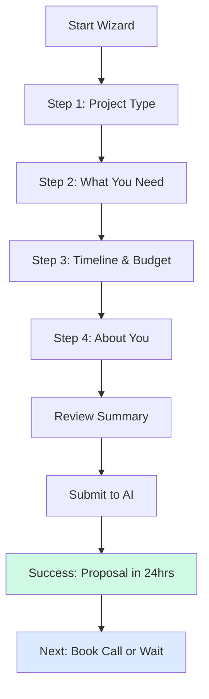

# Project Brief Wizard - Core Design Specification

**Page:** Project Brief Wizard (Multi-Step)  
**Route:** `/wizard`  
**Priority:** 🔥 P0 (Core)  
**Status:** Ready for design implementation

---

## 📋 Page Overview

**Purpose:** Guide users through a simple, AI-powered brief that generates a custom proposal in 24 hours with zero manual data entry.

**Key Goals:**
1. Make starting a project feel effortless (15 min max)
2. Qualify leads through smart questions
3. Collect enough context for accurate proposal
4. Build excitement about AI-powered process
5. Set clear expectations for next steps
6. Convert 80%+ of starters to completion

**Target Audiences:**
- Startup founders exploring AI solutions
- Product managers with project ideas
- CTOs evaluating partners
- Marketing leaders seeking automation

---

## 🎯 User Journey Flow



---

## 📐 Core Structure

### Wizard Layout (Minimal Navigation)
```
┌────────────────────────────────────────────────────────┐
│  [Logo]                                    [Exit ×]    │
│                                                         │
│  ┌──────────────────────────────────────────────────┐ │
│  │  PROGRESS: [████████████────────] 75% (Step 3/4) │ │
│  └──────────────────────────────────────────────────┘ │
│                                                         │
│  ┌──────────────────────────────────────────────────┐ │
│  │                                                   │ │
│  │  [STEP CONTENT AREA]                             │ │
│  │  Questions, inputs, selections                   │ │
│  │  Large, spacious, focused                        │ │
│  │                                                   │ │
│  └──────────────────────────────────────────────────┘ │
│                                                         │
│  [← Back]                              [Next →]        │
│                                                         │
│  No footer, no distractions                            │
└────────────────────────────────────────────────────────┘
```

**Navigation Rules:**
- Logo only (top-left) - click shows exit confirmation
- No main nav menu
- Exit button (top-right) - shows save progress modal
- Back/Next buttons only
- Clean, focused, single-column (max 600px)

---

## 📐 Step 1: Project Type

```
┌────────────────────────────────────────────────────────┐
│  PROGRESS: [███─────────────] 25% (Step 1/4)          │
│                                                         │
│  HEADLINE:                                             │
│  "What do you want to build?"                          │
│                                                         │
│  SUBTEXT:                                              │
│  "Choose the option that best describes your project" │
│                                                         │
│  ┌──────────┐  ┌──────────┐  ┌──────────┐           │
│  │ [Icon]   │  │ [Icon]   │  │ [Icon]   │           │
│  │          │  │          │  │          │           │
│  │ AI       │  │ AI       │  │ Auto-    │           │
│  │ Chatbot  │  │ Agents   │  │ mations  │           │
│  │          │  │          │  │          │           │
│  │ Qualify  │  │ Execute  │  │ Connect  │           │
│  │ & support│  │ tasks    │  │ tools    │           │
│  │          │  │ auto     │  │          │           │
│  └──────────┘  └──────────┘  └──────────┘           │
│                                                         │
│  ┌──────────┐  ┌──────────┐  ┌──────────┐           │
│  │ Dashboards│ │ Data/RAG │  │ Not Sure │           │
│  └──────────┘  └──────────┘  └──────────┘           │
│                                                         │
│                                  [Next →]               │
└────────────────────────────────────────────────────────┘
```

**Card Specs:**
- 3-column grid (desktop), 2-col (tablet), 1-col (mobile)
- 200px × 200px (square)
- Icon: 48px, accent color
- Title: 20px, 600 weight
- Description: 14px, neutral-600
- Border: 2px solid neutral-200
- Selected: Blue border, blue background (light)
- Hover: Lift 4px, shadow

---

## 📐 Step 2: What You Need

```
┌────────────────────────────────────────────────────────┐
│  PROGRESS: [██████──────────] 50% (Step 2/4)          │
│                                                         │
│  HEADLINE:                                             │
│  "Tell us about your needs"                            │
│                                                         │
│  QUESTION 1:                                           │
│  What problem are you solving? *                       │
│  [                                               ]     │
│  [                                               ]     │
│  [                                               ]     │
│  (Textarea, min 20 characters)                         │
│                                                         │
│  QUESTION 2:                                           │
│  Who will use this? *                                  │
│  [ Internal team            ▼ ]                       │
│  Options: Internal team | Customers | Both             │
│                                                         │
│  QUESTION 3:                                           │
│  How many users? *                                     │
│  [ 1-10                     ▼ ]                       │
│  Options: 1-10 | 11-50 | 51-200 | 200+                │
│                                                         │
│  QUESTION 4:                                           │
│  What tools do you use? (select all)                   │
│  [ ] Supabase  [ ] Stripe  [ ] WhatsApp               │
│  [ ] Webflow   [ ] n8n     [ ] Other                  │
│                                                         │
│  [← Back]                              [Next →]        │
└────────────────────────────────────────────────────────┘
```

**Field Specs:**
- Textarea: 120px height, 16px font
- Dropdowns: 56px height, custom styled
- Checkboxes: 20px, multi-select
- All required fields marked with *
- Validation on blur, not on every keystroke
- Next disabled until valid

---

## 📐 Step 3: Timeline & Budget

```
┌────────────────────────────────────────────────────────┐
│  PROGRESS: [█████████───────] 75% (Step 3/4)          │
│                                                         │
│  HEADLINE:                                             │
│  "Timeline & investment"                               │
│                                                         │
│  QUESTION 1:                                           │
│  When do you need this? *                              │
│  ┌──────────┐  ┌──────────┐  ┌──────────┐           │
│  │ ASAP     │  │ 1 month  │  │ 2-3 mos  │           │
│  │ 1-2 weeks│  │          │  │          │           │
│  └──────────┘  └──────────┘  └──────────┘           │
│                                                         │
│  QUESTION 2:                                           │
│  What's your budget range? *                           │
│  ┌──────────┐  ┌──────────┐  ┌──────────┐           │
│  │ $5k-15k  │  │ $15k-50k │  │ $50k+    │           │
│  │ Starter  │  │ Growth   │  │Enterprise│           │
│  └──────────┘  └──────────┘  └──────────┘           │
│                                                         │
│  💡 ESTIMATE PREVIEW:                                  │
│  Based on your selections: ~$12k, 2 weeks              │
│                                                         │
│  [← Back]                              [Next →]        │
└────────────────────────────────────────────────────────┘
```

**Budget Cards:**
- Same as project type cards
- Selected shows tier name below
- Estimate preview updates live
- Green box, soft background

---

## 📐 Step 4: About You

```
┌────────────────────────────────────────────────────────┐
│  PROGRESS: [████████████────] 90% (Step 4/4)          │
│                                                         │
│  HEADLINE:                                             │
│  "How can we reach you?"                               │
│                                                         │
│  FULL NAME *                                           │
│  [                                               ]     │
│                                                         │
│  EMAIL *                                               │
│  [                                               ]     │
│                                                         │
│  COMPANY                                               │
│  [                                               ]     │
│                                                         │
│  PHONE (optional)                                      │
│  [                                               ]     │
│                                                         │
│  [ ] I agree to privacy policy                         │
│                                                         │
│  [← Back]                     [Review Brief →]         │
└────────────────────────────────────────────────────────┘
```

**Validation:**
- Name: Min 2 chars
- Email: Valid email format
- Privacy: Required checkbox
- Phone: Optional, validates if entered

---

## 📐 Step 5: Review Summary

```
┌────────────────────────────────────────────────────────┐
│  PROGRESS: [████████████████] 100% (Review)           │
│                                                         │
│  HEADLINE:                                             │
│  "Review your brief"                                   │
│                                                         │
│  PROJECT TYPE                                 [Edit]   │
│  AI Chatbot - Qualify & support                        │
│                                                         │
│  YOUR NEEDS                                   [Edit]   │
│  • Problem: "We need to qualify 300+ leads..."         │
│  • Users: Customers                                    │
│  • Scale: 50-200 users                                 │
│  • Tools: Supabase, Stripe, Webflow                    │
│                                                         │
│  TIMELINE & BUDGET                            [Edit]   │
│  • Timeline: ASAP (1-2 weeks)                          │
│  • Budget: $5k-15k (Starter tier)                      │
│                                                         │
│  CONTACT                                      [Edit]   │
│  • John Smith                                          │
│  • john@company.com                                    │
│  • Acme Corp                                           │
│                                                         │
│  WHAT HAPPENS NEXT:                                    │
│  ✓ Our AI analyzes your brief                         │
│  ✓ We generate a custom proposal                      │
│  ✓ You receive it within 24 hours                     │
│  ✓ Includes: roadmap, timeline, exact pricing         │
│                                                         │
│  [← Back]           [Submit Brief →] (Large, primary)  │
└────────────────────────────────────────────────────────┘
```

**Edit Links:**
- Click returns to that step
- Data preserved
- Can navigate back to review

---

## 📐 Success Screen

```
┌────────────────────────────────────────────────────────┐
│                                                         │
│                  ✓ [Large Checkmark]                   │
│                                                         │
│              Brief Submitted!                          │
│                                                         │
│  Your proposal will be ready in 24 hours (usually     │
│  much faster). We'll email you at john@company.com    │
│                                                         │
│  ┌──────────────────────────────────────────────────┐ │
│  │  WHAT'S HAPPENING NOW                            │ │
│  │                                                   │ │
│  │  1. AI is analyzing your requirements           │ │
│  │  2. Our team reviews AI recommendations         │ │
│  │  3. We build a custom proposal with:            │ │
│  │     • Project roadmap                            │ │
│  │     • Timeline breakdown                         │ │
│  │     • Exact pricing                              │ │
│  │     • Tech stack recommendations                 │ │
│  │                                                   │ │
│  │  Check your email in ~4 hours for proposal      │ │
│  └──────────────────────────────────────────────────┘ │
│                                                         │
│  WHILE YOU WAIT:                                       │
│  [Book a Call]  [View Case Studies]  [Go to Home]     │
└────────────────────────────────────────────────────────┘
```

**Success Specs:**
- Green checkmark: 80px, animated draw
- Headline: 32px, 700 weight
- What's happening card: White, shadow, 32px padding
- Numbered list with icons
- Email confirmation reference
- Alternative CTAs for engagement

---

## 📱 Responsive Design

**Desktop (1440px):**
- Content max-width: 600px, centered
- Card grid: 3 columns
- Large touch targets (56px)

**Mobile (375px):**
- Content: 100% width, 24px padding
- Card grid: 1 column, stacked
- Touch targets: 52px minimum
- Progress bar: Simplified (just percentage)

---

## 🎬 Core Animations

**Step Transitions:**
- Fade out current (0.2s)
- Fade in next (0.3s)
- Progress bar fills smoothly

**Interactions:**
- Card select: Scale 1.02 + border color
- Input focus: Border + shadow (0.2s)
- Button hover: Lift 2px

**Success:**
- Checkmark draws (SVG animation, 0.8s)
- Content scales in (0.95 → 1)

---

## ✅ Component Checklist

**Must Create:**
- [ ] `WizardShell` (minimal nav, progress bar)
- [ ] `ProgressBar` (4-5 steps)
- [ ] `StepHeader` (headline + subtext)
- [ ] `ProjectTypeCard` (6 options)
- [ ] `TimelineCard` (3 options)
- [ ] `BudgetCard` (3 tiers)
- [ ] `FormInput` (all states)
- [ ] `FormTextarea` (all states)
- [ ] `FormCheckbox` (checked/unchecked)
- [ ] `SummarySection` (with edit links)
- [ ] `SuccessScreen`
- [ ] `BackButton` + `NextButton`

**States Required:**
- [ ] Cards: default, hover, selected
- [ ] Inputs: default, focus, error, success
- [ ] Buttons: default, hover, disabled, loading
- [ ] Progress: per-step fill animation
- [ ] Exit: confirmation modal

---

## 🎨 Figma Make AI Prompt

```
Create a multi-step project brief wizard for an AI development company with minimal navigation and focused flow.

WIZARD SHELL:
- Logo top-left, Exit (×) top-right
- Progress bar: [████████────] 75% (Step 3/4)
- No main navigation, no footer
- Single column, max 600px width, centered
- Back/Next buttons bottom (disabled states)

STEP 1: Project Type
- Headline: "What do you want to build?"
- 6 cards in grid (3×2): AI Chatbot | AI Agents | Automations | Dashboards | Data/RAG | Not Sure
- Each card: Icon (48px), Title, 1-line description
- Selected: Blue border + light blue background
- Next button disabled until selection

STEP 2: What You Need
- Headline: "Tell us about your needs"
- 4 questions:
  1. Textarea: "What problem are you solving?" (min 20 chars)
  2. Dropdown: "Who will use this?" (Internal/Customers/Both)
  3. Dropdown: "How many users?" (1-10/11-50/51-200/200+)
  4. Multi-checkbox: "What tools do you use?" (Supabase, Stripe, WhatsApp, etc.)

STEP 3: Timeline & Budget
- Headline: "Timeline & investment"
- Timeline cards (3): ASAP (1-2 wks) | 1 month | 2-3 months
- Budget cards (3): $5k-15k Starter | $15k-50k Growth | $50k+ Enterprise
- Estimate preview: "Based on your selections: ~$12k, 2 weeks" (green box)

STEP 4: About You
- Headline: "How can we reach you?"
- Fields: Name*, Email*, Company, Phone (optional)
- Privacy checkbox: "I agree to privacy policy"*
- Validation: inline on blur

STEP 5: Review Summary
- Headline: "Review your brief"
- 4 summary sections with [Edit] links:
  1. Project Type
  2. Your Needs (bulleted list)
  3. Timeline & Budget
  4. Contact info
- "What happens next" section (4 checkmarks)
- Submit Brief button (large, primary)

SUCCESS SCREEN:
- Large green checkmark ✓ (80px, animated)
- Headline: "Brief Submitted!"
- Message: "Proposal in 24 hours..."
- "What's happening now" card:
  1. AI analyzing
  2. Team reviews
  3. Building proposal
  4. Email sent
- CTAs: Book a Call | View Case Studies | Go to Home

DESIGN STYLE:
- Clean, focused, minimal distractions
- Large cards (200×200px for selections)
- Generous whitespace
- Premium form design
- Progress always visible
- Trust-building messaging

RESPONSIVE:
- Desktop: 600px max content, 3-col cards
- Mobile: 100% width, 1-col cards, 24px padding

STATES:
- Cards: default, hover, selected
- Inputs: default, focus, error
- Buttons: default, hover, disabled, loading
- Progress: smooth fill animation
```

---

**Status:** ✅ Core wizard complete  
**Next:** See `11-wizard-advanced.md` for conditional logic, AI analysis, branching, edge cases
