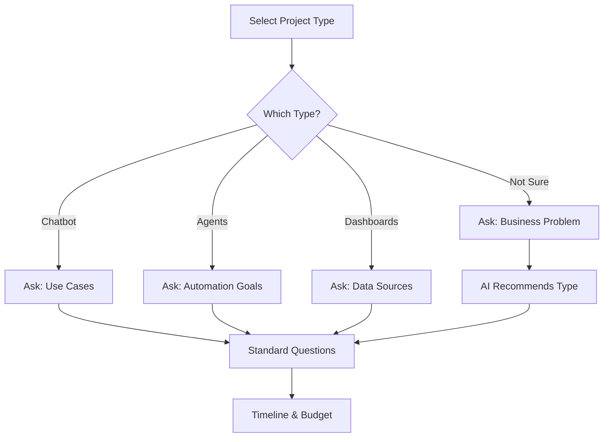

# Project Brief Wizard - Advanced Features Specification

**Document:** Wizard Advanced Logic & Features  
**Related:** See `10-wizard.md` for core flow  
**Priority:** 🔥 P0 (Core)  
**Status:** Ready for implementation

---

## 📋 Overview

This document covers advanced wizard features including conditional logic, AI analysis, progress saving, branching paths, and edge case handling.

**See `10-wizard.md` first for:**
- Basic 5-step flow
- Core components
- Standard form fields
- Success screen

**This document adds:**
- Conditional question branching
- AI-powered recommendations
- Progress auto-save
- Exit handling
- Pre-fill from other pages
- Error recovery
- Analytics tracking

---

## 🧠 Conditional Logic & Branching

### Question Flow Based on Project Type



### Conditional Questions (Step 2 Variations)

**IF Project Type = "AI Chatbot":**
```
Additional Questions:
- What should the chatbot help with? (multi-select)
  [ ] Lead qualification
  [ ] Customer support
  [ ] Booking/scheduling
  [ ] Product recommendations
  [ ] FAQs

- Where will it live?
  [ ] Website embed
  [ ] WhatsApp
  [ ] Slack
  [ ] SMS
```

**IF Project Type = "AI Agents":**
```
Additional Questions:
- What tasks should agents automate? (textarea)
  Placeholder: "E.g., Generate proposals, schedule meetings, update CRM..."

- Do you have existing workflows? *
  ( ) Yes, documented
  ( ) Yes, but undocumented
  ( ) No, starting fresh
```

**IF Project Type = "Dashboards":**
```
Additional Questions:
- What data sources? (multi-select)
  [ ] Supabase
  [ ] Google Sheets
  [ ] Stripe
  [ ] Custom API
  [ ] Other: [_____]

- Who needs access?
  [ ] Just me
  [ ] Team (5-20)
  [ ] Department (20-100)
  [ ] Company-wide
```

**IF Project Type = "Not Sure":**
```
Show AI Helper:
┌────────────────────────────────────────┐
│ 🤖 Let's figure it out together        │
│                                        │
│ Describe what you're trying to do:    │
│ [                                 ]   │
│ [                                 ]   │
│ [                                 ]   │
│                                        │
│ AI will suggest the best solution     │
└────────────────────────────────────────┘

On blur (after 30 chars typed):
→ AI analyzes input
→ Shows recommended project type
→ User can accept or continue manually
```

---

## 🤖 AI Analysis Features

### Real-Time Recommendations

**Trigger Points:**
1. After Step 2 (needs analysis)
2. After Step 3 (timeline/budget selected)
3. On "Not Sure" project type

**AI Analysis Endpoint:**
```javascript
POST /api/wizard/analyze
Body: {
  project_type: "chatbot",
  problem_description: "We get 200+ leads but 80% unqualified...",
  users: "customers",
  scale: "50-200",
  tools: ["supabase", "stripe"],
  timeline: "asap",
  budget: "$5k-15k"
}

Returns: {
  confidence: 0.92,
  recommended_services: ["AI Chatbot", "CRM Integration"],
  estimated_cost: "$12,000",
  estimated_timeline: "14 days",
  tech_stack: ["GPT-4", "Supabase", "Webflow"],
  similar_projects: ["case-study-1", "case-study-2"],
  ai_insights: [
    "Your lead volume suggests automation is essential",
    "Qualification logic can save 12hrs/week",
    "ROI expected in 2 months"
  ]
}
```

### AI Insight Display

**In-Progress Insights (Step 3):**
```
┌────────────────────────────────────────────────────────┐
│  💡 AI INSIGHT                                         │
│                                                         │
│  Based on your needs, we recommend:                    │
│  • AI Chatbot with qualification logic                │
│  • CRM integration (Supabase)                          │
│  • Estimated cost: $12k, Timeline: 14 days             │
│                                                         │
│  Similar successful projects:                          │
│  → [TechStartup Case Study] +300 leads/mo              │
│  → [SaaS Co Case Study] -28% support load              │
│                                                         │
│  [Adjust Budget] [Continue →]                          │
└────────────────────────────────────────────────────────┘
```

**Specs:**
- Background: Gradient (blue-50 to white)
- Icon: 💡 or robot
- Border: 1px accent-200
- Padding: 24px
- Case study links clickable (open in new tab)

---

## 💾 Progress Auto-Save

### Auto-Save Behavior

**Save Triggers:**
- After each field blur (debounced 2s)
- On step completion (click Next)
- On exit attempt (before showing modal)
- Every 30s (background interval)

**Storage:**
```javascript
// LocalStorage key
wizard_progress_{user_email_or_uuid}

// Structure
{
  step: 3,
  started_at: "2025-12-18T14:30:00Z",
  last_saved: "2025-12-18T14:45:00Z",
  data: {
    project_type: "chatbot",
    problem: "...",
    users: "customers",
    // ... all answers
  },
  completed_steps: [1, 2],
  ai_analysis: { ... }
}
```

### Resume Flow

**On page load:**
```javascript
if (savedProgress && isRecent(savedProgress.last_saved)) {
  showResumeModal();
}

function isRecent(timestamp) {
  const hoursSince = (Date.now() - timestamp) / 3600000;
  return hoursSince < 72; // 3 days
}
```

**Resume Modal:**
```
┌────────────────────────────────────────┐
│  Welcome back!                         │
│                                        │
│  You were on Step 3 of 4              │
│  Last saved: 2 hours ago              │
│                                        │
│  [Continue Where I Left Off]          │
│  [Start Fresh]                        │
└────────────────────────────────────────┘
```

---

## 🚪 Exit Handling

### Exit Confirmation Modal

**Triggered by:**
- Logo click
- Exit (×) button click
- Browser back button
- Closing tab (beforeunload)

**Exit Modal:**
```
┌────────────────────────────────────────┐
│  Save your progress?                   │
│                                        │
│  Your brief is 75% complete.          │
│  We'll save it and you can return     │
│  anytime in the next 3 days.          │
│                                        │
│  [Save & Exit]  [Cancel]              │
│                                        │
│  Or: [Exit Without Saving]            │
└────────────────────────────────────────┘
```

**Save & Exit Actions:**
1. Save to localStorage
2. Send partial brief to backend (optional)
3. Send email with resume link (if email captured)
4. Redirect to homepage or provided URL

**Email Template:**
```
Subject: Complete your brief in 5 minutes

Hi [Name],

You're 75% done with your project brief!

[Continue Brief →]

We'll keep it saved for 3 days.

---
What you'll get:
✓ Custom proposal in 24 hours
✓ Exact pricing & timeline
✓ AI-powered recommendations
```

---

## 🔗 Pre-Fill from Other Pages

### URL Parameters Support

**From Services page:**
```
/wizard?service=ai-chatbot
→ Pre-selects "AI Chatbot" in Step 1
```

**From Pricing page:**
```
/wizard?tier=growth
→ Pre-selects "$15k-50k" budget in Step 3
```

**From Case Study:**
```
/wizard?service=ai-chatbot&industry=saas
→ Pre-fills project type + adds industry context
```

**From Booking:**
```
/wizard?
  name=John+Smith
  &email=john@company.com
  &company=Acme+Corp
→ Pre-fills Step 4 contact info
```

### Pre-Fill Logic

```javascript
// On wizard mount
const params = new URLSearchParams(window.location.search);

if (params.has('service')) {
  setProjectType(params.get('service'));
  setStep(2); // Skip to Step 2
}

if (params.has('name') && params.has('email')) {
  setContactInfo({
    name: params.get('name'),
    email: params.get('email'),
    company: params.get('company') || ''
  });
}
```

---

## ⚠️ Error Handling & Recovery

### Network Errors

**If AI analysis fails:**
```
┌────────────────────────────────────────┐
│  ⚠️ Couldn't analyze brief             │
│                                        │
│  Don't worry - you can still continue │
│  We'll review manually instead.       │
│                                        │
│  [Continue Anyway →]                  │
└────────────────────────────────────────┘
```

**If submission fails:**
```
┌────────────────────────────────────────┐
│  ⚠️ Submission failed                  │
│                                        │
│  We couldn't submit your brief.       │
│  Your progress is saved.              │
│                                        │
│  [Retry]  [Email Instead]             │
│                                        │
│  Or download as PDF: [Download]       │
└────────────────────────────────────────┘
```

### Validation Errors

**Field-level (inline):**
- Show on blur, not on keystroke
- Red border + error message below
- Icon: ❌ or warning triangle

**Step-level (before Next):**
```
If incomplete fields:
→ Scroll to first error
→ Highlight all errors
→ Show banner: "Please complete all required fields"
→ Disable Next button
```

---

## 📊 Analytics & Tracking

### Event Tracking

**Track these events:**
```javascript
// Step progression
trackEvent('wizard_step_completed', {
  step: 2,
  time_spent: 45, // seconds
  project_type: 'chatbot'
});

// Abandonment
trackEvent('wizard_abandoned', {
  step: 3,
  completion: 0.75,
  reason: 'exit_button'
});

// AI analysis
trackEvent('wizard_ai_analysis', {
  confidence: 0.92,
  recommended_services: ['chatbot', 'crm'],
  estimated_cost: 12000
});

// Completion
trackEvent('wizard_completed', {
  total_time: 780, // seconds (13 min)
  project_type: 'chatbot',
  budget_range: '$5k-15k',
  source: 'services_page' // if pre-filled
});
```

### Conversion Funnel

```
Step 1: Start → 100%
Step 2: Needs → 85%
Step 3: Budget → 70%
Step 4: Contact → 60%
Step 5: Review → 55%
Submit: Complete → 50%

Target: 50%+ completion rate
```

---

## 🎯 Advanced UX Features

### Smart Defaults

**Based on previous users:**
- Most common project type: AI Chatbot (45%)
- Most common timeline: ASAP (60%)
- Most common budget: $5k-15k (40%)

**Smart suggestions:**
```
If user selects:
- E-commerce industry → Suggest Stripe integration
- Internal team → Suggest Slack integration
- High volume (200+ users) → Suggest automations
```

### Question Hints

**Progressive disclosure:**
```
QUESTION: What problem are you solving?
[                                        ]

[💡 Need help? See examples]

On click:
→ Shows 3 example problems
→ User can click to use as template
```

**Examples:**
- "We get 200+ leads/month but 80% are unqualified"
- "Support team spends 15 hrs/week answering FAQs"
- "Sales reps waste time on manual data entry"

---

## 🔄 Backend Integration

### Submission Endpoint

```javascript
POST /api/wizard/submit

Headers:
  Content-Type: application/json

Body: {
  project_type: "chatbot",
  needs: {
    problem: "...",
    users: "customers",
    scale: "50-200",
    tools: ["supabase", "stripe"]
  },
  timeline: "asap",
  budget: "$5k-15k",
  contact: {
    name: "John Smith",
    email: "john@company.com",
    company: "Acme Corp",
    phone: "+15551234567"
  },
  ai_analysis: {
    confidence: 0.92,
    recommended_services: ["chatbot", "crm"],
    estimated_cost: 12000,
    estimated_timeline: 14
  },
  source: "services_page", // if pre-filled
  session_id: "sess_abc123",
  started_at: "2025-12-18T14:30:00Z",
  completed_at: "2025-12-18T14:43:00Z"
}

Response (200 OK):
{
  brief_id: "brief_xyz789",
  status: "submitted",
  proposal_eta: "2025-12-19T14:43:00Z", // 24 hrs
  next_steps: [
    "Check email for confirmation",
    "Proposal sent within 24 hours",
    "Book optional call to discuss"
  ]
}

Response (400 Bad Request):
{
  error: "validation_failed",
  fields: {
    email: "Invalid email format",
    problem: "Minimum 20 characters required"
  }
}
```

### Email Notifications

**To User (Immediate):**
```
Subject: Brief received - Proposal in 24 hours

Hi John,

Thanks for submitting your project brief!

PROJECT SUMMARY:
- Type: AI Chatbot
- Timeline: ASAP (1-2 weeks)
- Budget: $5k-15k

WHAT'S NEXT:
1. Our AI is analyzing your requirements
2. Our team will review and build a custom proposal
3. You'll receive it within 24 hours at john@company.com

Expected proposal delivery: Tomorrow at 2:43pm

While you wait:
→ Book a call to discuss
→ View similar case studies

Questions? Reply to this email.

Best,
The Team
```

**To Team (Internal):**
```
Subject: New wizard brief submitted

Project: AI Chatbot
Contact: John Smith (john@company.com)
Company: Acme Corp
Budget: $5k-15k
Timeline: ASAP

PROBLEM:
"We get 200+ leads but 80% unqualified..."

AI CONFIDENCE: 92%
RECOMMENDATION: Chatbot + CRM integration
ESTIMATED: $12k, 14 days

[View Full Brief] [Generate Proposal]
```

---

## 🎨 Advanced Figma Components

**Additional components for advanced features:**

- [ ] `ConditionalQuestion` - Shows/hides based on previous answers
- [ ] `AIInsightCard` - Displays AI recommendations
- [ ] `ProgressSaveIndicator` - "Saved" checkmark, auto-save spinner
- [ ] `ResumeModal` - Continue or start fresh
- [ ] `ExitModal` - Save progress confirmation
- [ ] `ErrorBanner` - Network/validation errors
- [ ] `DownloadPDFButton` - Export brief as PDF
- [ ] `SmartHint` - Question examples/help
- [ ] `EstimatePreview` - Live cost/timeline estimate

---

## 📈 Success Metrics

**Target KPIs:**
- Start rate: 40% of visitors to landing pages
- Completion rate: 50% of starters
- Time to complete: <15 minutes (median)
- AI accuracy: >85% (recommendations accepted)
- Proposal conversion: 60% → paid project

**A/B Test Opportunities:**
- Number of steps (4 vs 5 vs 6)
- Question order
- AI insights placement
- Budget ranges shown
- Success screen CTAs

---

**Status:** ✅ Advanced features specified  
**Integration:** Pair with `10-wizard.md` core flow for complete implementation  
**Next:** Backend APIs (Supabase Edge Functions) + AI analysis (OpenAI/Claude)
