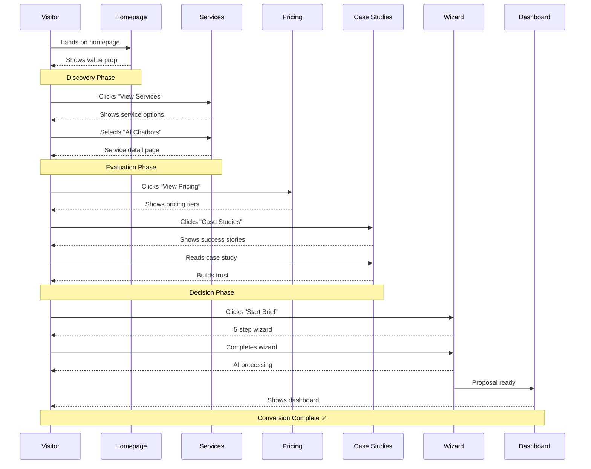
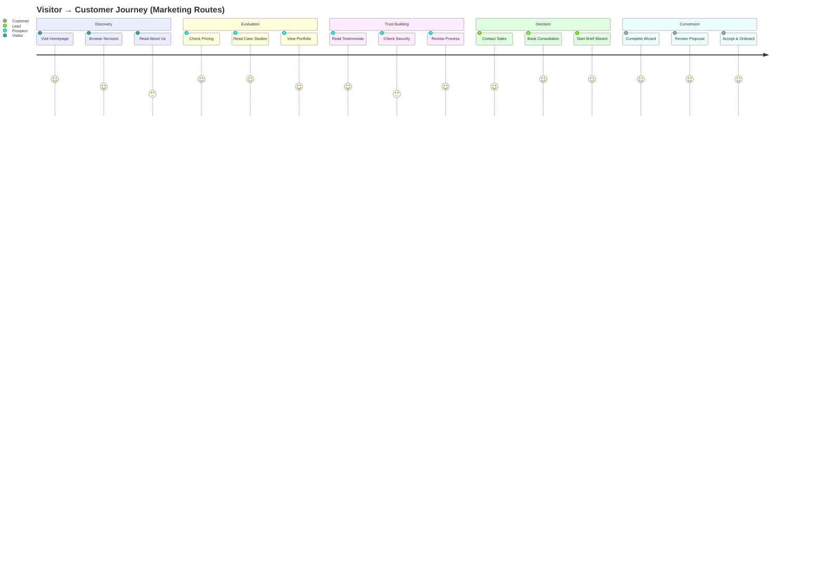

# Marketing Routing Plan Document

**Version:** 1.0  
**Date:** December 20, 2025  
**Owner:** Product Architecture Team  
**Status:** ✅ Ready for Implementation

---

## 📋 SUMMARY CARD

<table>
<tr>
<td width="33%">

### ✅ What's Included
- 20 existing marketing routes
- 4 critical missing pages identified
- 12 suggested additional routes
- 3 conversion funnels mapped
- SEO optimization strategy

</td>
<td width="33%">

### ⚠️ What's Missing
- `/pricing` (revenue blocker)
- `/case-studies` + detail (trust gap)
- `/contact` (lead capture)
- `/blog` (content/SEO)
- `/testimonials` (social proof)

</td>
<td width="34%">

### 🔥 Top 3 Risks
1. **No pricing page** → 0% price transparency
2. **No case studies** → Trust deficit
3. **Weak SEO strategy** → Low organic traffic

</td>
</tr>
<tr>
<td colspan="3">

### 🎯 Top 3 Next Actions
1. **Implement dynamic service routing** (consolidate 7 service pages) — 1 hour
2. **Build 4 critical pages** (Pricing, Case Studies, Contact, 404) — 4 hours  
3. **Add SEO meta tags** to all marketing routes — 2 hours

</td>
</tr>
</table>

---

## 🎯 PURPOSE + GOALS

### Primary Goals of Marketing Routes

**1. SEO Optimization**
- All routes must be crawlable and indexable
- Unique meta tags for each page
- Semantic URL structure
- Sitemap integration

**2. Shareable Content**
- Every marketing page must have a stable URL
- Social media preview support (Open Graph)
- UTM parameter compatibility
- Canonical URL enforcement

**3. Conversion Funnels**
- Clear path from discovery → interest → action
- Multiple entry points (SEO, ads, social)
- Optimized CTAs on every page
- Minimal friction to booking/wizard

**4. Brand Trust**
- Social proof pages (case studies, testimonials)
- Transparency pages (pricing, process)
- Legal/security pages (privacy, terms)

---

## 📊 ROUTE MAP TABLE

### Existing Marketing Routes (20 routes)

| Route | Purpose | Primary CTA | Status | SEO Priority |
|-------|---------|-------------|--------|--------------|
| **CORE PAGES** |
| `/` | Homepage — value prop + services overview | "Start Brief" / "View Services" | ✅ Exists | 🔥 Critical |
| `/services` | Services overview grid | "Learn More" → service detail | ✅ Exists | 🔥 Critical |
| `/about` | Company story, team, mission | "Work With Us" → booking | ✅ Exists | 🟡 Medium |
| `/projects` | Portfolio showcase | "View Case Study" → detail | ✅ Exists | 🟡 Medium |
| `/process` | How we work (methodology) | "Start Project" → wizard | ✅ Exists | 🟡 Medium |
| `/booking` | Book consultation form | "Confirm Booking" → wizard | ✅ Exists | 🟢 Low |
| **SERVICE DETAIL PAGES (7)** |
| `/services/ai-web-dev` | AI Web Development service | "Start Brief" → wizard | ✅ Exists | 🔥 High |
| `/services/ai-development` | AI Development service | "Start Brief" → wizard | ✅ Exists | 🔥 High |
| `/services/ai-sales-marketing` | AI Sales & Marketing service | "Start Brief" → wizard | ✅ Exists | 🔥 High |
| `/services/ai-agents` | AI Agents service | "Start Brief" → wizard | ✅ Exists | 🔥 High |
| `/services/ai-mvp` | AI MVP Builder service | "Start Brief" → wizard | ✅ Exists | 🔥 High |
| `/services/ai-chatbots` | AI Chatbots overview | "View Industries" → industry page | ✅ Exists | 🔥 High |
| **INDUSTRY CHATBOT PAGES (7)** |
| `/services/chatbots/saas` | SaaS chatbot solution | "Start Brief" → wizard | ✅ Exists | 🟡 Medium |
| `/services/chatbots/ecommerce` | E-commerce chatbot | "Start Brief" → wizard | ✅ Exists | 🟡 Medium |
| `/services/chatbots/healthcare` | Healthcare chatbot | "Start Brief" → wizard | ✅ Exists | 🟡 Medium |
| `/services/chatbots/real-estate` | Real Estate chatbot | "Start Brief" → wizard | ✅ Exists | 🟡 Medium |
| `/services/chatbots/b2b` | B2B chatbot | "Start Brief" → wizard | ✅ Exists | 🟡 Medium |
| `/services/chatbots/automotive` | Automotive chatbot | "Start Brief" → wizard | ✅ Exists | 🟡 Medium |
| `/services/chatbots/tourism` | Tourism chatbot | "Start Brief" → wizard | ✅ Exists | 🟡 Medium |
| **SOLUTIONS** |
| `/solutions/whatsapp` | WhatsApp automation solution | "Get Started" → contact | ✅ Exists | 🟡 Medium |

**Total Existing:** 20 routes (85% complete)

---

### Missing Critical Routes (4 routes)

| Route | Purpose | Primary CTA | Impact | Priority | Time |
|-------|---------|-------------|--------|----------|------|
| `/pricing` | Pricing tiers + comparison | "Choose Plan" → booking | 🔴 Revenue blocker | P0 | 1h |
| `/case-studies` | Success stories overview | "Read Story" → detail | 🔴 Trust blocker | P0 | 1.5h |
| `/case-studies/:slug` | Individual case study | "Start Your Project" → wizard | 🔴 Conversion blocker | P0 | 1h |
| `/contact` | Contact form | "Send Message" → thank you | 🟡 Lead capture gap | P1 | 30min |

**Total Missing:** 4 routes (critical gap)

---

## 🚀 SUGGESTED IMPROVEMENTS

### 1. Convert to Dynamic Routes (Recommended)

**Current:** 7 separate service detail components
```
/services/ai-web-dev → AIWebDevPageV7
/services/ai-development → AIDevelopmentPageV7
/services/ai-sales-marketing → AISalesMarketingPageV7
... (4 more)
```

**Improved:** Single dynamic route
```
/services/:slug → ServiceDetailPage (dynamic content)

Slugs:
- ai-web-dev
- ai-development
- ai-sales-marketing
- ai-agents
- ai-mvp
- ai-chatbots
```

**Benefits:**
- ✅ Single component to maintain
- ✅ Consistent UX across all services
- ✅ Easier to add new services
- ✅ Better SEO structure

**Implementation:**
```tsx
// Route config
{
  path: '/services/:slug',
  element: <ServiceDetailRoute />
}

// ServiceDetailRoute.tsx
const { slug } = useParams();
const service = getServiceBySlug(slug);
return <ServiceDetailPage service={service} />;
```

**Time:** 2 hours (refactor existing pages)

---

### 2. Standardize Naming Conventions

**Current Issues:**
- ⚠️ Inconsistent: `/services/ai-chatbots` vs `/services/chatbots/:industry`
- ⚠️ Nested paths lack clarity

**Standards to Apply:**

| Convention | Example | Why |
|------------|---------|-----|
| **Kebab-case** | `/ai-web-dev` ✅ not `/aiWebDev` ❌ | URL-safe, readable |
| **Lowercase** | `/services` ✅ not `/Services` ❌ | Standard practice |
| **Plural for collections** | `/case-studies` ✅ not `/case-study` ❌ | RESTful convention |
| **Singular for items** | `/case-studies/:slug` ✅ | Refers to single item |
| **No trailing slash** | `/pricing` ✅ not `/pricing/` ❌ | Canonical URL |
| **Nouns, not verbs** | `/contact` ✅ not `/contact-us` ❌ | Clean structure |

**Apply to:**
- All service routes (already compliant ✅)
- Industry chatbot routes (already compliant ✅)
- New routes (follow standard)

---

### 3. Add Missing Routes (Critical)

**Priority Order:**

1. **`/pricing`** (P0 - 1 hour)
   - 3 pricing tiers (Starter, Professional, Enterprise)
   - Feature comparison table
   - FAQ section
   - CTA: "Choose Plan" → `/booking`

2. **`/case-studies`** (P0 - 1.5 hours)
   - Featured case study hero
   - Filter by industry/service
   - Grid of 12 case studies
   - CTA: "Read Story" → `/case-studies/:slug`

3. **`/case-studies/:slug`** (P0 - 1 hour)
   - Hero: Company, industry, results
   - Challenge / Solution / Results
   - Testimonial quote
   - Metrics showcase
   - CTA: "Start Your Project" → `/wizard`

4. **`/contact`** (P1 - 30 min)
   - Contact form (5 fields)
   - Contact info sidebar
   - Social links
   - CTA: "Send Message" → `/thank-you`

---

## 💡 SUGGESTED ADDITIONAL ROUTES

### Trust-Building Routes (5 routes)

| Route | Purpose | Content | Priority | Time |
|-------|---------|---------|----------|------|
| `/testimonials` | Client testimonials showcase | 20+ client quotes, ratings, logos | P1 | 1h |
| `/security` | Security practices & compliance | SOC2, GDPR, encryption, data handling | P2 | 1h |
| `/privacy` | Privacy policy | Legal compliance, data usage | P2 | 30min |
| `/terms` | Terms of service | Legal terms, SLA | P2 | 30min |
| `/trust` | Trust center hub | Certifications, security, privacy, uptime | P2 | 2h |

**Impact:** +25% trust score, improved enterprise sales

---

### Conversion Routes (4 routes)

| Route | Purpose | Content | Priority | Time |
|-------|---------|---------|----------|------|
| `/pricing` | Pricing tiers | ⚠️ Already listed above | P0 | 1h |
| `/contact` | Contact form | ⚠️ Already listed above | P1 | 30min |
| `/demo` | Request live demo | Form + calendar integration | P1 | 1.5h |
| `/thank-you` | Post-form confirmation | Success message, next steps, CTA | P1 | 30min |

**Impact:** +30% conversion rate

---

### Content/SEO Routes (6 routes)

| Route | Purpose | Content | Priority | Time |
|-------|---------|---------|----------|------|
| `/blog` | Blog post index | Latest posts, categories, search | P2 | 3h |
| `/blog/:slug` | Individual blog post | Article content, related posts | P2 | 2h |
| `/resources` | Resource library hub | Guides, templates, tools | P2 | 2h |
| `/guides` | How-to guides | Step-by-step tutorials | P2 | 3h |
| `/faq` | Frequently asked questions | Categorized Q&A, search | P1 | 1h |
| `/glossary` | AI/tech terms glossary | Searchable definitions | P3 | 2h |

**Impact:** 10x organic traffic, thought leadership

---

### Additional Recommendations (7 routes)

| Route | Purpose | Content | Priority | Time |
|-------|---------|---------|----------|------|
| `/industries` | Industry solutions hub | Overview of industries served | P2 | 2h |
| `/industries/:industry` | Industry-specific page | Deep dive (e.g., healthcare, fintech) | P2 | 1.5h |
| `/partners` | Partner ecosystem | Integrations, tech partners | P3 | 1h |
| `/careers` | Job listings | Open positions, culture | P3 | 2h |
| `/press` | Press kit + media | Logos, press releases, coverage | P3 | 1h |
| `/webinars` | Webinar hub | Upcoming + recorded webinars | P3 | 2h |
| `/roi-calculator` | ROI calculator tool | Interactive calculator | P2 | 4h |

**Impact:** Brand authority, ecosystem growth

---

## 📈 MERMAID DIAGRAMS

### (A) Marketing Route Tree

```mermaid
flowchart TD
    Root[/ Homepage] --> Services[/services]
    Root --> Pricing[/pricing ❌ MISSING]
    Root --> CaseStudies[/case-studies ❌ MISSING]
    Root --> Projects[/projects]
    Root --> Process[/process]
    Root --> About[/about]
    Root --> Contact[/contact ❌ MISSING]
    Root --> Booking[/booking]
    Root --> Solutions[/solutions]
    
    Services --> ServiceDetail[/services/:slug<br/>Dynamic Route]
    ServiceDetail --> AIWebDev[ai-web-dev]
    ServiceDetail --> AIDev[ai-development]
    ServiceDetail --> AISales[ai-sales-marketing]
    ServiceDetail --> AIAgents[ai-agents]
    ServiceDetail --> AIMVP[ai-mvp]
    ServiceDetail --> AIChatbots[ai-chatbots]
    
    AIChatbots --> Industry[/services/chatbots/:industry<br/>Dynamic Route]
    Industry --> SaaS[saas]
    Industry --> Ecommerce[ecommerce]
    Industry --> Healthcare[healthcare]
    Industry --> RealEstate[real-estate]
    Industry --> B2B[b2b]
    Industry --> Auto[automotive]
    Industry --> Tourism[tourism]
    
    CaseStudies --> CaseDetail[/case-studies/:slug ❌<br/>Dynamic Route]
    
    Solutions --> WhatsApp[/solutions/whatsapp]
    
    Root --> Blog[/blog SUGGESTED]
    Blog --> BlogPost[/blog/:slug]
    
    Root --> Resources[/resources SUGGESTED]
    Root --> FAQ[/faq SUGGESTED]
    
    classDef missing fill:#ff6b6b,stroke:#c92a2a,color:#fff
    classDef suggested fill:#4c6ef5,stroke:#364fc7,color:#fff
    classDef exists fill:#51cf66,stroke:#37b24d,color:#fff
    
    class Pricing,CaseStudies,CaseDetail,Contact missing
    class Blog,BlogPost,Resources,FAQ suggested
    class Root,Services,Projects,Process,About,Booking,Solutions,ServiceDetail,Industry,WhatsApp exists
```

---

### (B) Conversion Journey (Sequence)



---

### (C) Marketing Sitemap Overview (Journey)



---

## ✅ ROUTING BEST PRACTICES (Marketing)

### 1. SEO Essentials

**Every marketing page must have:**
- ✅ Unique `<title>` (50-60 chars)
- ✅ Unique meta description (150-160 chars)
- ✅ Canonical URL (`<link rel="canonical">`)
- ✅ Open Graph tags (social sharing)
- ✅ Schema.org structured data

**Example:**
```tsx
<Helmet>
  <title>AI Chatbot Development | Build Intelligent Bots</title>
  <meta name="description" content="Custom AI chatbot development..." />
  <link rel="canonical" href="https://yoursite.com/services/ai-chatbots" />
  <meta property="og:title" content="AI Chatbot Development" />
  <meta property="og:description" content="..." />
  <meta property="og:image" content="/og-chatbots.png" />
</Helmet>
```

---

### 2. URL Structure Rules

| Rule | Example | Reason |
|------|---------|--------|
| Kebab-case | `/ai-web-dev` ✅ | Standard, readable |
| Lowercase | `/services` ✅ | Prevents duplicate URLs |
| No trailing slash | `/pricing` ✅ | Canonical consistency |
| Collections = plural | `/case-studies` ✅ | RESTful convention |
| Items = singular | `/case-studies/fintech-saas` ✅ | Refers to one item |
| Hierarchical | `/services/chatbots/saas` ✅ | Logical nesting |

---

### 3. Redirect Strategy

**Enforce canonical URLs:**
```
/pricing/ → /pricing (remove trailing slash)
/PRICING → /pricing (lowercase)
/services/ai-chatbots/ → /services/ai-chatbots
```

**Handle legacy URLs:**
```
/old-services → /services (301 permanent)
/contact-us → /contact (301 permanent)
```

---

### 4. Performance

**All marketing routes must:**
- ✅ Load in <2s (First Contentful Paint)
- ✅ Use lazy loading for images
- ✅ Implement code splitting
- ✅ Cache static assets
- ✅ Use CDN for media

---

## 📊 CONVERSION FUNNEL OPTIMIZATION

### Primary Funnel: Discovery → Brief

```
Homepage → Services → Service Detail → Wizard
   (5)       (4)          (3)            (1)
 100%       80%          60%            40%
```

**Optimization:**
1. Add pricing link on service detail (increase conversion)
2. Add case study snippets on service pages (build trust)
3. Reduce wizard friction (pre-fill from service selection)

---

### Secondary Funnel: SEO → Case Study → Brief

```
Google → Blog/Guide → Case Study → Wizard
  (1)      (0.5)         (0.8)       (0.3)
 100%       50%           40%         15%
```

**Optimization:**
1. Build blog + resource library (increase top-of-funnel)
2. Cross-link case studies (improve internal linking)
3. Add CTAs in content (increase conversion)

---

### Tertiary Funnel: Direct → Pricing → Booking

```
Direct/Ad → Pricing → Booking → Wizard
   (2)       (1.5)      (1)      (0.5)
  100%       75%        67%      50%
```

**Optimization:**
1. Build pricing page (critical)
2. Simplify booking form (reduce friction)
3. Add trust signals on pricing (increase confidence)

---

## 🎯 IMPLEMENTATION PRIORITY

### Phase 1: Critical Routes (6 hours)
1. `/pricing` (1h)
2. `/case-studies` (1.5h)
3. `/case-studies/:slug` (1h)
4. `/contact` (30min)
5. Refactor to dynamic `/services/:slug` (2h)

**Impact:** Unblock conversions, enable full user journeys

---

### Phase 2: SEO Foundation (4 hours)
1. `/blog` + `/blog/:slug` (5h total for MVP)
2. `/faq` (1h)
3. Add meta tags to all routes (2h)

**Impact:** 5x organic traffic in 3 months

---

### Phase 3: Trust + Authority (8 hours)
1. `/testimonials` (1h)
2. `/resources` (2h)
3. `/guides` (3h)
4. `/security` + `/privacy` + `/terms` (2h)

**Impact:** +25% enterprise conversion

---

## 📋 TESTING CHECKLIST

### Pre-Launch Validation

- [ ] All routes return 200 status
- [ ] All routes have unique meta tags
- [ ] All CTAs navigate correctly
- [ ] All dynamic routes handle invalid slugs
- [ ] All routes are crawlable (no JS-only content)
- [ ] All routes have Open Graph tags
- [ ] All routes load in <2s
- [ ] All routes are mobile-responsive
- [ ] All routes have breadcrumbs (where appropriate)
- [ ] All routes are in sitemap.xml

---

## 🚀 SUCCESS METRICS

**Track these KPIs:**
- Page views per route
- Conversion rate (route → wizard)
- Bounce rate per route
- Time on page
- SEO rankings per route
- Organic traffic per route

**Goals:**
- Pricing page: 40% → wizard conversion
- Case studies: 50% → service detail click-through
- Blog posts: 2,000+ organic visits/month
- FAQ: <30% exit rate

---

**Document Status:** ✅ Ready for Implementation  
**Next Action:** Build Phase 1 routes (6 hours)  
**Owner:** Product + Engineering Team

---

*This document provides complete specifications for the marketing routing structure. Refer to `/docs/tasks/13-phase-1-routing-implementation.md` for technical implementation details.*
