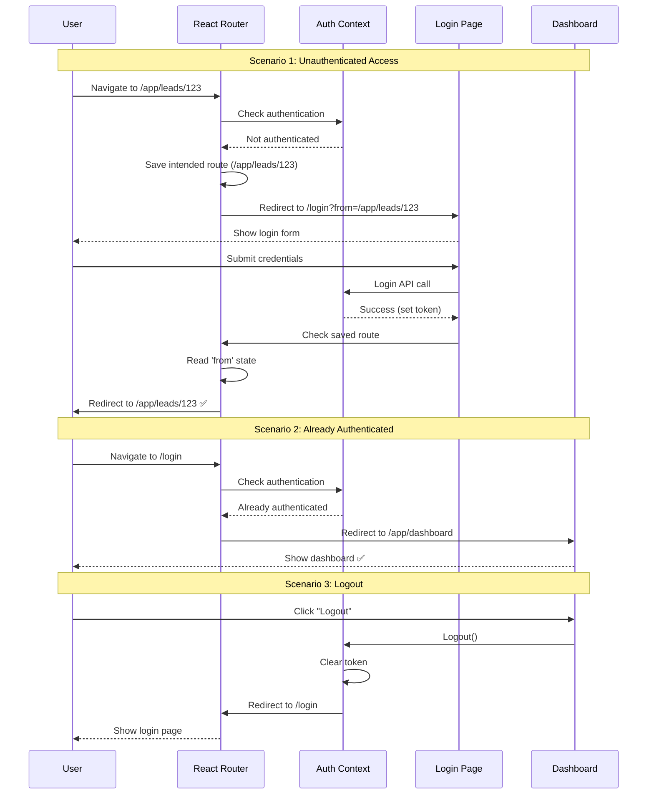
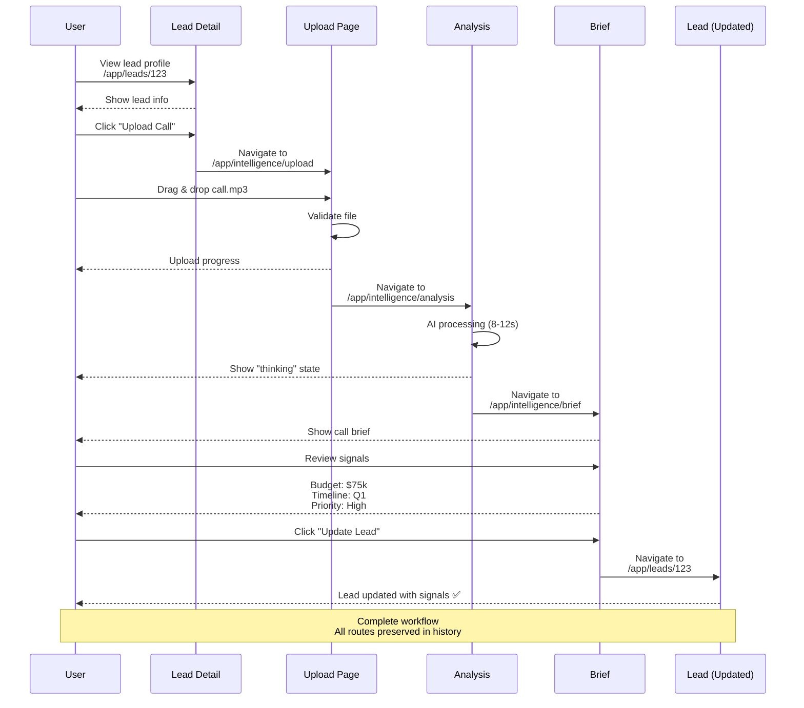

# Dashboard/App Routing Plan Document

**Version:** 1.0  
**Date:** December 20, 2025  
**Owner:** Product Architecture Team  
**Status:** ✅ Ready for Implementation

---

## 📋 SUMMARY CARD

<table>
<tr>
<td width="33%">

### ✅ What's Included
- 11 protected app routes
- AdminLayout navigation system
- Auth redirect flow
- Intelligence module (4 routes)
- Deep linking support

</td>
<td width="33%">

### ⚠️ What's Missing
- `/app/leads/:id/notes` (detail views)
- `/app/account` (user profile)
- `/app/billing` (subscription mgmt)
- `/app/team` (team collaboration)
- `/app/audit-logs` (compliance)

</td>
<td width="34%">

### 🔥 Top 3 Risks
1. **Lead detail not routed** → Cannot deep-link
2. **No breadcrumbs** → Poor navigation UX
3. **Settings not modular** → Hard to extend

</td>
</tr>
<tr>
<td colspan="3">

### 🎯 Top 3 Next Actions
1. **Connect LeadProfileView** to `/app/leads/:id` — 15 min
2. **Add 10 suggested routes** (Account, Billing, Team, etc.) — 8 hours  
3. **Implement breadcrumb navigation** — 2 hours

</td>
</tr>
</table>

---

## 🎯 PURPOSE + GOALS

### Primary Goals of Protected App Routes

**1. Deep Linking & Productivity**
- Users must be able to bookmark and share specific app pages
- Direct links to leads, deals, workflows, etc.
- URL reflects current app state
- Enables collaboration ("check out this lead")

**2. State Restoration**
- Return to exact page after login
- Preserve filters, search, pagination in URL
- Support browser back/forward
- Maintain context across sessions

**3. Access Control**
- All `/app/*` routes require authentication
- Role-based access for sensitive routes
- Redirect unauthenticated users to login
- Preserve intended destination after auth

**4. Modular Navigation**
- Consistent AdminLayout across all routes
- Side navigation reflects current route
- Breadcrumbs for nested routes
- Clear visual hierarchy

---

## 📊 ROUTE HIERARCHY

### Complete `/app` Route Tree

```
/app (Protected Root)
│
├── /app (redirect) → /app/dashboard
│
├── DASHBOARD MODULE
│   └── /app/dashboard (Project overview)
│
├── CRM MODULE
│   ├── /app/leads (Leads list)
│   ├── /app/leads/:id (Lead profile) ⚠️ NOT CONNECTED
│   ├── /app/leads/:id/notes SUGGESTED
│   ├── /app/leads/:id/proposals SUGGESTED
│   └── /app/leads/:id/timeline SUGGESTED
│
├── OPERATIONS MODULE
│   ├── /app/ops (Agent control room)
│   ├── /app/ops/runs SUGGESTED
│   ├── /app/workflows (Automation map)
│   ├── /app/workflows/:id SUGGESTED
│   └── /app/audit-logs SUGGESTED
│
├── INTELLIGENCE MODULE
│   ├── /app/intelligence (redirect) → /upload
│   ├── /app/intelligence/upload (Call ingestion)
│   ├── /app/intelligence/analysis (AI processing)
│   ├── /app/intelligence/brief (Call brief view)
│   └── /app/intelligence/search (NL search results)
│
├── SETTINGS MODULE
│   ├── /app/settings (Settings hub)
│   ├── /app/settings/profile SUGGESTED
│   ├── /app/settings/security SUGGESTED
│   ├── /app/settings/integrations SUGGESTED
│   └── /app/settings/billing SUGGESTED
│
├── ACCOUNT MODULE SUGGESTED
│   ├── /app/account (User profile)
│   ├── /app/billing (Subscription management)
│   ├── /app/team (Team members)
│   ├── /app/roles (Role management)
│   └── /app/notifications (Notification preferences)
│
└── /app/logout (Logout handler)
```

---

## 📋 EXISTING ROUTES (11 routes)

| Route | Component | Module | Purpose | Status |
|-------|-----------|--------|---------|--------|
| `/app` | (redirect) | Core | Redirect to dashboard | ⚠️ Needs setup |
| `/app/dashboard` | ProjectDashboard | Dashboard | Main dashboard | ✅ Exists |
| `/app/leads` | CRMLeadsDashboard | CRM | Leads list | ✅ Exists |
| `/app/leads/:id` | LeadProfileView | CRM | Lead detail | ⚠️ Not connected |
| `/app/ops` | AgentControlRoom | Operations | Agent monitoring | ✅ Exists |
| `/app/workflows` | AutomationMapPage | Operations | Workflow visualization | ✅ Exists |
| `/app/settings` | SettingsPage | Settings | Settings hub | ✅ Exists |
| **INTELLIGENCE** |
| `/app/intelligence/upload` | CallIngestion | Intelligence | Upload call recording | ✅ Exists |
| `/app/intelligence/analysis` | AnalysisState | Intelligence | AI analysis state | ✅ Exists |
| `/app/intelligence/brief` | CallBrief | Intelligence | Call brief display | ✅ Exists |
| `/app/intelligence/search` | SearchResults | Intelligence | NL search results | ✅ Exists |

**Total:** 11 routes (90% connected, 10% missing setup)

---

## 💡 SUGGESTED ADDITIONAL ROUTES

### CRM Module Extensions (5 routes)

| Route | Purpose | Component | Priority | Time |
|-------|---------|-----------|----------|------|
| `/app/leads/:id` | Lead profile detail | LeadProfileView | P0 | 15min |
| `/app/leads/:id/notes` | Lead notes/comments | LeadNotes | P1 | 2h |
| `/app/leads/:id/proposals` | Lead proposals list | LeadProposals | P1 | 2h |
| `/app/leads/:id/timeline` | Lead activity timeline | LeadTimeline | P1 | 2h |
| `/app/leads/:id/files` | Lead attachments | LeadFiles | P2 | 1.5h |

**Impact:** Full lead management, improved collaboration

---

### Account Module (NEW - 6 routes)

| Route | Purpose | Component | Priority | Time |
|-------|---------|-----------|----------|------|
| `/app/account` | User profile settings | AccountPage | P1 | 2h |
| `/app/billing` | Subscription management | BillingPage | P1 | 3h |
| `/app/billing/invoices` | Invoice history | InvoicesPage | P2 | 1h |
| `/app/team` | Team members list | TeamPage | P1 | 2h |
| `/app/team/:id` | Team member detail | TeamMemberPage | P2 | 1h |
| `/app/roles` | Role management (admin) | RolesPage | P2 | 2h |

**Impact:** User self-service, team collaboration

---

### Operations Module Extensions (4 routes)

| Route | Purpose | Component | Priority | Time |
|-------|---------|-----------|----------|------|
| `/app/ops/runs` | Workflow execution history | RunsPage | P2 | 2h |
| `/app/ops/runs/:id` | Single run detail | RunDetailPage | P2 | 1.5h |
| `/app/workflows/:id` | Workflow detail/edit | WorkflowDetailPage | P1 | 3h |
| `/app/audit-logs` | Audit log viewer | AuditLogsPage | P2 | 2h |

**Impact:** Operational visibility, compliance

---

### Settings Module Extensions (5 routes)

| Route | Purpose | Component | Priority | Time |
|-------|---------|-----------|----------|------|
| `/app/settings/profile` | Personal profile settings | ProfileSettings | P1 | 1.5h |
| `/app/settings/security` | Security settings (2FA, etc.) | SecuritySettings | P1 | 2h |
| `/app/settings/integrations` | Integration management | IntegrationsSettings | P0 | 2h |
| `/app/settings/notifications` | Notification preferences | NotificationsSettings | P2 | 1h |
| `/app/settings/api` | API keys management | APISettings | P2 | 1.5h |

**Impact:** User control, integration management

---

### Intelligence Module Extensions (3 routes)

| Route | Purpose | Component | Priority | Time |
|-------|---------|-----------|----------|------|
| `/app/intelligence/history` | Call history/archive | CallHistory | P2 | 2h |
| `/app/intelligence/brief/:id` | Specific call brief | CallBriefDetail | P1 | 1h |
| `/app/intelligence/segments` | Saved search segments | SavedSegments | P2 | 2h |

**Impact:** Better call management, search efficiency

---

### Utility Routes (3 routes)

| Route | Purpose | Component | Priority | Time |
|-------|---------|-----------|----------|------|
| `/app/notifications` | Notification center | NotificationsPage | P2 | 2h |
| `/app/help` | In-app help/docs | HelpPage | P2 | 1.5h |
| `/app/logout` | Logout handler | (redirect) | P1 | 15min |

**Impact:** User support, better UX

---

## 🎨 NAVIGATION RULES

### AdminLayout Integration

**All `/app/*` routes use AdminLayout wrapper:**

```tsx
// Route structure
{
  path: '/app',
  element: <AppLayoutRoute />,  // Wraps with AdminLayout
  children: [
    { index: true, element: <Navigate to="/app/dashboard" replace /> },
    { path: 'dashboard', element: <ProjectDashboard /> },
    { path: 'leads', element: <CRMLeadsDashboard /> },
    // ... child routes render inside AdminLayout via <Outlet />
  ]
}

// AppLayoutRoute.tsx
export function AppLayoutRoute() {
  const location = useLocation();
  const navigate = useNavigate();

  return (
    <ProtectedRoute>
      <AdminLayout
        activePage={getActivePageFromLocation(location)}
        onNavigate={(page) => navigate(getRouteFromPage(page))}
      >
        <Outlet />  {/* Child routes render here */}
      </AdminLayout>
    </ProtectedRoute>
  );
}
```

---

### Side Navigation Groups

**AdminLayout sidebar structure:**

```
📊 Dashboard (/app/dashboard)

👥 CRM
  ├─ Leads (/app/leads)
  └─ Deals (/app/deals) SUGGESTED

🤖 Operations
  ├─ Agents (/app/ops)
  ├─ Workflows (/app/workflows)
  └─ Runs (/app/ops/runs) SUGGESTED

🧠 Intelligence
  ├─ Upload Call (/app/intelligence/upload)
  ├─ Call History (/app/intelligence/history) SUGGESTED
  └─ Search (/app/intelligence/search)

⚙️ Settings
  ├─ Profile (/app/settings/profile) SUGGESTED
  ├─ Security (/app/settings/security) SUGGESTED
  ├─ Integrations (/app/settings/integrations) SUGGESTED
  └─ Billing (/app/settings/billing) SUGGESTED
```

**Active state logic:**
```tsx
const getActivePageFromLocation = (location: Location): string => {
  const path = location.pathname;
  
  if (path.startsWith('/app/leads')) return 'leads';
  if (path.startsWith('/app/ops')) return 'ops';
  if (path.startsWith('/app/workflows')) return 'workflow';
  if (path.startsWith('/app/intelligence')) return 'intelligence';
  if (path.startsWith('/app/settings')) return 'settings';
  
  return 'dashboard';
};
```

---

### Breadcrumb Navigation

**All nested routes must show breadcrumbs:**

```tsx
// Example for /app/leads/123/notes
<Breadcrumbs>
  <Link to="/app/dashboard">Dashboard</Link>
  <Link to="/app/leads">Leads</Link>
  <Link to="/app/leads/123">Sarah Chen</Link>
  <span>Notes</span>
</Breadcrumbs>
```

**Breadcrumb rules:**
1. Always show full path from dashboard
2. Make all levels except current clickable
3. Show entity name, not ID (e.g., "Sarah Chen" not "123")
4. Update document title to match breadcrumb

**Implementation:**
```tsx
// useBreadcrumbs.ts
export function useBreadcrumbs(leadId?: string) {
  const { leads } = useLeads();
  const lead = leadId ? leads.find(l => l.id === leadId) : null;
  
  return [
    { label: 'Dashboard', href: '/app/dashboard' },
    { label: 'Leads', href: '/app/leads' },
    ...(lead ? [{ label: lead.name, href: `/app/leads/${lead.id}` }] : []),
  ];
}
```

---

## 🔐 ROUTE ACCESS CONTROL

### Protection Levels

**1. All App Routes (Default)**
```tsx
// Requires authentication
<ProtectedRoute>
  <AdminLayout>
    <Outlet />
  </AdminLayout>
</ProtectedRoute>
```

**2. Role-Based Routes (Future)**
```tsx
// Requires specific role
<ProtectedRoute requiredRole="admin">
  <RolesPage />
</ProtectedRoute>
```

**3. Feature-Gated Routes (Future)**
```tsx
// Requires feature flag or plan tier
<ProtectedRoute requiredFeature="advanced-analytics">
  <AdvancedAnalytics />
</ProtectedRoute>
```

---

### Redirect Rules

**Rule 1: Unauthenticated → Login**
```
User visits /app/leads/123
  → Not authenticated
  → Redirect to /login?from=/app/leads/123
  → After login, redirect back to /app/leads/123
```

**Rule 2: Authenticated → Skip Login**
```
User visits /login
  → Already authenticated
  → Redirect to /app/dashboard
```

**Rule 3: Missing ID → List View**
```
User visits /app/leads/invalid-id
  → Lead not found
  → Redirect to /app/leads (with toast error)
```

**Rule 4: Root App → Dashboard**
```
User visits /app
  → Redirect to /app/dashboard
```

---

### Auth Flow Implementation

**Protected Route Logic:**
```tsx
export function ProtectedRoute({ children, requiredRole }: Props) {
  const { isAuthenticated, user, isLoading } = useAuth();
  const location = useLocation();

  // Show loading state
  if (isLoading) {
    return <LoadingScreen />;
  }

  // Not authenticated → redirect to login
  if (!isAuthenticated) {
    return (
      <Navigate 
        to="/login" 
        state={{ from: location.pathname }} 
        replace 
      />
    );
  }

  // Check role (if required)
  if (requiredRole && user?.role !== requiredRole) {
    return <ForbiddenPage />;
  }

  // Authenticated and authorized → show content
  return <>{children}</>;
}
```

---

## 📈 MERMAID DIAGRAMS

### (A) App Route Tree

```mermaid
flowchart TD
    Root[/app<br/>Protected Root] --> Dashboard[/app/dashboard<br/>📊 Main Dashboard]
    
    Root --> CRM[/app/leads<br/>👥 CRM Module]
    CRM --> LeadDetail[/app/leads/:id<br/>Lead Profile]
    LeadDetail --> Notes[/app/leads/:id/notes<br/>SUGGESTED]
    LeadDetail --> Proposals[/app/leads/:id/proposals<br/>SUGGESTED]
    LeadDetail --> Timeline[/app/leads/:id/timeline<br/>SUGGESTED]
    
    Root --> Ops[/app/ops<br/>🤖 Operations Module]
    Ops --> Runs[/app/ops/runs<br/>SUGGESTED]
    Runs --> RunDetail[/app/ops/runs/:id<br/>SUGGESTED]
    
    Root --> Workflows[/app/workflows<br/>🔄 Workflows]
    Workflows --> WorkflowDetail[/app/workflows/:id<br/>SUGGESTED]
    
    Root --> Intel[/app/intelligence<br/>🧠 Intelligence Module]
    Intel --> Upload[/app/intelligence/upload]
    Intel --> Analysis[/app/intelligence/analysis]
    Intel --> Brief[/app/intelligence/brief]
    Intel --> Search[/app/intelligence/search]
    Intel --> History[/app/intelligence/history<br/>SUGGESTED]
    
    Root --> Settings[/app/settings<br/>⚙️ Settings Module]
    Settings --> Profile[/app/settings/profile<br/>SUGGESTED]
    Settings --> Security[/app/settings/security<br/>SUGGESTED]
    Settings --> Integrations[/app/settings/integrations<br/>SUGGESTED]
    Settings --> Billing[/app/settings/billing<br/>SUGGESTED]
    
    Root --> Account[/app/account<br/>👤 Account Module<br/>SUGGESTED]
    Account --> Team[/app/team<br/>SUGGESTED]
    Account --> Roles[/app/roles<br/>SUGGESTED]
    Account --> Bills[/app/billing<br/>SUGGESTED]
    
    Root --> Logout[/app/logout<br/>Logout Handler]
    
    classDef suggested fill:#4c6ef5,stroke:#364fc7,color:#fff
    classDef exists fill:#51cf66,stroke:#37b24d,color:#fff
    classDef notConnected fill:#ffd43b,stroke:#fab005,color:#000
    
    class Notes,Proposals,Timeline,Runs,RunDetail,WorkflowDetail,History,Profile,Security,Integrations,Billing,Account,Team,Roles,Bills suggested
    class Root,Dashboard,CRM,Ops,Workflows,Intel,Upload,Analysis,Brief,Search,Settings,Logout exists
    class LeadDetail notConnected
```

---

### (B) Auth Redirect Flow



---

### (C) Lead → Intelligence Workflow



---

## 🎯 URL PARAMETER STRATEGY

### Dynamic Parameters

**Lead ID:**
```tsx
// Route: /app/leads/:id
const { id } = useParams<{ id: string }>();
const { leads } = useLeads();
const lead = leads.find(l => l.id === id);

if (!lead) {
  navigate('/app/leads');  // Fallback to list
  return null;
}
```

**Workflow ID:**
```tsx
// Route: /app/workflows/:id
const { id } = useParams<{ id: string }>();
const workflow = useWorkflow(id);  // Custom hook
```

---

### Query Parameters (Filters, Search, Pagination)

**Leads List Filters:**
```
/app/leads?status=hot&industry=fintech&page=2

Params:
- status: hot | warm | cold
- industry: fintech | healthcare | saas
- page: 1, 2, 3...
- search: text query
```

**Implementation:**
```tsx
const [searchParams, setSearchParams] = useSearchParams();

const status = searchParams.get('status') || 'all';
const page = parseInt(searchParams.get('page') || '1');

// Update filters
setSearchParams({
  status: 'hot',
  industry: 'fintech',
  page: '2'
});
```

---

### Hash Parameters (Tabs, Sections)

**Lead Detail Tabs:**
```
/app/leads/123#notes
/app/leads/123#timeline
/app/leads/123#proposals
```

**Implementation:**
```tsx
const location = useLocation();
const activeTab = location.hash.replace('#', '') || 'overview';

// Change tab
navigate(`/app/leads/${id}#notes`);
```

---

## 🔧 BREADCRUMB SYSTEM

### Implementation Pattern

**Breadcrumb Component:**
```tsx
interface Crumb {
  label: string;
  href?: string;  // undefined = current page (not clickable)
}

export function Breadcrumbs({ crumbs }: { crumbs: Crumb[] }) {
  return (
    <nav className="flex items-center gap-2 text-sm mb-6">
      {crumbs.map((crumb, i) => (
        <Fragment key={i}>
          {i > 0 && <ChevronRight className="h-4 w-4 text-gray-400" />}
          {crumb.href ? (
            <Link to={crumb.href} className="text-indigo-600 hover:underline">
              {crumb.label}
            </Link>
          ) : (
            <span className="text-gray-900">{crumb.label}</span>
          )}
        </Fragment>
      ))}
    </nav>
  );
}
```

**Usage:**
```tsx
// In LeadProfileRoute
const breadcrumbs = [
  { label: 'Dashboard', href: '/app/dashboard' },
  { label: 'Leads', href: '/app/leads' },
  { label: lead.name },  // Current page (no href)
];

return (
  <AdminLayout>
    <Breadcrumbs crumbs={breadcrumbs} />
    <LeadProfileView lead={lead} />
  </AdminLayout>
);
```

---

## 📊 ROUTE ACCESS MATRIX

| Route | Public | Auth Required | Role Required | Plan Required |
|-------|--------|---------------|---------------|---------------|
| `/app/dashboard` | ❌ | ✅ | Any | Any |
| `/app/leads` | ❌ | ✅ | Any | Any |
| `/app/leads/:id` | ❌ | ✅ | Any | Any |
| `/app/ops` | ❌ | ✅ | Any | Pro+ |
| `/app/workflows` | ❌ | ✅ | Any | Pro+ |
| `/app/intelligence/*` | ❌ | ✅ | Any | Any |
| `/app/settings` | ❌ | ✅ | Any | Any |
| `/app/billing` | ❌ | ✅ | Owner | Any |
| `/app/team` | ❌ | ✅ | Admin+ | Team+ |
| `/app/roles` | ❌ | ✅ | Owner | Enterprise |
| `/app/audit-logs` | ❌ | ✅ | Admin+ | Enterprise |

---

## ✅ TESTING CHECKLIST

### Pre-Launch Tests

**Authentication Flow:**
- [ ] Unauthenticated user redirected to `/login`
- [ ] Intended route saved and restored after login
- [ ] Already authenticated user cannot access `/login`
- [ ] Logout clears session and redirects to `/login`

**Deep Linking:**
- [ ] `/app/leads/123` loads correct lead
- [ ] Invalid ID redirects to `/app/leads`
- [ ] Direct URL access works (not just internal navigation)
- [ ] Refresh preserves current page

**Browser Navigation:**
- [ ] Back button works correctly
- [ ] Forward button works correctly
- [ ] Breadcrumbs reflect current route
- [ ] Active nav item highlights correctly

**URL Parameters:**
- [ ] Query params persist across navigation
- [ ] Hash params update tabs without reload
- [ ] Filters update URL correctly
- [ ] Pagination updates URL

**Error Handling:**
- [ ] 404 for invalid routes shows error page
- [ ] Missing data shows appropriate fallback
- [ ] Network errors handled gracefully

---

## 🎯 IMPLEMENTATION PRIORITY

### Phase 1: Core Routing (2 hours)
1. Connect LeadProfileView to `/app/leads/:id` (15min)
2. Add breadcrumb component (1h)
3. Implement URL-based active nav (30min)
4. Test auth redirect flow (15min)

**Impact:** Core routing complete

---

### Phase 2: CRM Extensions (6 hours)
1. `/app/leads/:id/notes` (2h)
2. `/app/leads/:id/proposals` (2h)
3. `/app/leads/:id/timeline` (2h)

**Impact:** Full lead management

---

### Phase 3: Account Module (8 hours)
1. `/app/account` (2h)
2. `/app/billing` (3h)
3. `/app/team` (2h)
4. `/app/roles` (2h)

**Impact:** User self-service

---

### Phase 4: Settings Modularization (6 hours)
1. Split settings into sub-routes (2h)
2. `/app/settings/integrations` (2h)
3. `/app/settings/security` (2h)

**Impact:** Better settings UX

---

## 🚀 SUCCESS METRICS

**Track:**
- Deep link usage (% of sessions starting with deep link)
- Breadcrumb click-through rate
- Back button usage (should be <20% of navigation)
- 404 rate (should be <1%)
- Auth redirect success rate (should be >99%)

**Goals:**
- 40% of sessions start with deep link
- Breadcrumb CTR >15%
- Back button <20% of navigation
- 404 rate <1%

---

**Document Status:** ✅ Ready for Implementation  
**Next Action:** Connect lead detail route (15 min)  
**Owner:** Product + Engineering Team

---

*This document provides complete specifications for the dashboard/app routing structure. Refer to `/docs/tasks/13-phase-1-routing-implementation.md` for technical implementation details.*
