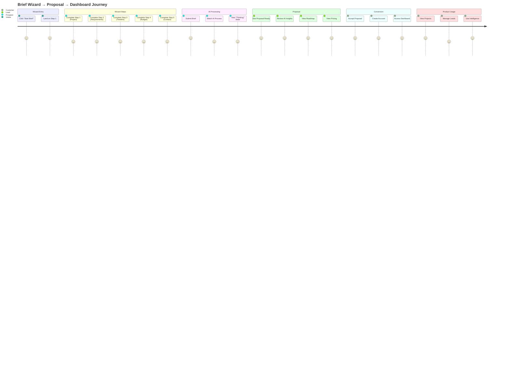
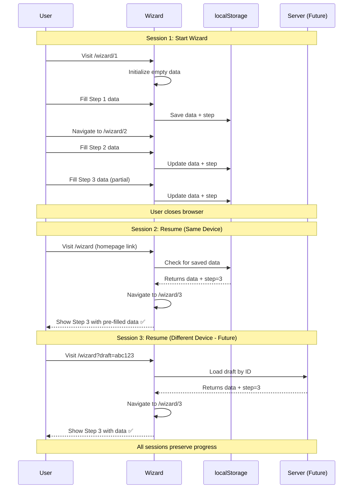

# Wizard Routing Plan Document

**Version:** 1.0  
**Date:** December 20, 2025  
**Owner:** Product Architecture Team  
**Status:** ✅ Ready for Implementation

---

## 📋 SUMMARY CARD

<table>
<tr>
<td width="33%">

### ✅ What's Included
- 3 wizard routes (wizard, processing, complete)
- State recovery strategy
- Exit path options
- Linear wizard flow
- Proposal → dashboard handoff

</td>
<td width="33%">

### ⚠️ What's Missing
- Step-based URLs (no `/wizard/1`, `/wizard/2`)
- Resume capability (can't share progress)
- Draft saving
- Multi-session support
- Back button handling

</td>
<td width="34%">

### 🔥 Top 3 Risks
1. **No step URLs** → Can't bookmark progress
2. **No resume** → Lost on refresh
3. **No exit/save** → Data loss risk

</td>
</tr>
<tr>
<td colspan="3">

### 🎯 Top 3 Next Actions
1. **Choose routing strategy** (Option B recommended) — 30 min decision
2. **Implement step-based routes** `/wizard/:step` — 2 hours  
3. **Add save & exit functionality** — 1.5 hours

</td>
</tr>
</table>

---

## 🎯 WIZARD ROUTING STRATEGY OPTIONS

### Current State

**Existing Routes (3):**
```
/wizard             → BriefWizard (5-step internal state)
/wizard/processing  → AIProcessingScreen
/wizard/complete    → ProposalReadyScreen
```

**How it works now:**
- Wizard uses internal state (`useState`) for steps
- No URL change between steps 1-5
- Processing and completion are separate routes

---

### ⚙️ OPTION A: 3 Routes (Current) — Minimal Change

**Structure:**
```
/wizard             (Steps 1-5 internal)
/wizard/processing  (AI processing)
/wizard/complete    (Proposal ready)
```

**Pros:**
- ✅ Simple URL structure
- ✅ Minimal code changes needed
- ✅ Works for linear flow

**Cons:**
- ❌ Can't bookmark step 3
- ❌ Can't share "resume here" link
- ❌ Browser back doesn't navigate steps
- ❌ Refresh goes to step 1

**Use Case:** Simple, non-resumable wizards

**Verdict:** ⚠️ **Not recommended** (poor UX for long wizard)

---

### ⚙️ OPTION B: Step Routes — URL-Based Steps ✅ RECOMMENDED

**Structure:**
```
/wizard/1          (Step 1: Project Type)
/wizard/2          (Step 2: Requirements)
/wizard/3          (Step 3: Timeline)
/wizard/4          (Step 4: Budget)
/wizard/5          (Step 5: Team & Contact)
/wizard/processing (AI processing)
/wizard/complete   (Proposal ready)
```

**Pros:**
- ✅ **Bookmarkable steps** (huge UX win)
- ✅ **Browser back/forward works**
- ✅ **Shareable progress** ("I'm on step 3")
- ✅ **Refresh preserves step**
- ✅ **Clear progress indication**

**Cons:**
- ⚠️ Slightly more complex routing
- ⚠️ Need to validate step order (can't skip to step 5)

**Implementation:**
```tsx
// Route config
{
  path: '/wizard/:step',
  element: <WizardStepRoute />,
  loader: ({ params }) => {
    const step = parseInt(params.step || '1');
    if (step < 1 || step > 5) {
      throw redirect('/wizard/1');
    }
    return { step };
  }
}

// WizardStepRoute.tsx
export function WizardStepRoute() {
  const { step } = useParams();
  const navigate = useNavigate();
  
  const handleNext = () => {
    if (step === 5) {
      navigate('/wizard/processing');
    } else {
      navigate(`/wizard/${parseInt(step) + 1}`);
    }
  };
  
  const handleBack = () => {
    if (step === 1) {
      navigate('/');  // Exit to home
    } else {
      navigate(`/wizard/${parseInt(step) - 1}`);
    }
  };
  
  return (
    <BriefWizard
      currentStep={parseInt(step)}
      onNext={handleNext}
      onBack={handleBack}
    />
  );
}
```

**Use Case:** Multi-step wizards, resumable flows

**Verdict:** ✅ **RECOMMENDED** (best UX, production-ready)

---

### ⚙️ OPTION C: Query Params — State in URL

**Structure:**
```
/wizard?step=1     (Step 1)
/wizard?step=2     (Step 2)
/wizard?step=3     (Step 3)
...
/wizard/processing (AI processing)
/wizard/complete   (Proposal ready)
```

**Pros:**
- ✅ Single route, simpler config
- ✅ Bookmarkable steps
- ✅ Browser back/forward works
- ✅ Can add other params (e.g., `?step=3&draft=abc123`)

**Cons:**
- ⚠️ URL less clean (`?step=3` vs `/3`)
- ⚠️ Slightly harder to read/share

**Implementation:**
```tsx
// Route config
{
  path: '/wizard',
  element: <WizardRoute />
}

// WizardRoute.tsx
const [searchParams, setSearchParams] = useSearchParams();
const step = parseInt(searchParams.get('step') || '1');

const handleNext = () => {
  if (step === 5) {
    navigate('/wizard/processing');
  } else {
    setSearchParams({ step: (step + 1).toString() });
  }
};
```

**Use Case:** Wizards with optional params, A/B testing

**Verdict:** 🟡 **Alternative** (good option, slightly less clean)

---

## 🏆 FINAL RECOMMENDATION: OPTION B (Step Routes)

**Why:**
1. **Clearest URLs** (`/wizard/3` > `/wizard?step=3`)
2. **Standard pattern** (most SaaS apps use this)
3. **Best UX** (bookmarkable, shareable, browser nav works)
4. **Future-proof** (easy to add validation, guards, analytics)

**When to use Option C instead:**
- Need multiple query params (draft ID, prefill data, etc.)
- A/B testing different wizard flows
- More complex state management needs

---

## 🔄 RESUME + SHARE STRATEGY

### Strategy 1: localStorage + URL Sync (Recommended)

**How it works:**
1. Save wizard data to localStorage on every change
2. URL reflects current step (`/wizard/3`)
3. On page load, check localStorage for saved data
4. If data exists, restore and continue
5. If no data, start fresh from step 1

**Implementation:**
```tsx
// Auto-save to localStorage
useEffect(() => {
  localStorage.setItem('wizard-data', JSON.stringify(data));
  localStorage.setItem('wizard-step', step.toString());
}, [data, step]);

// Restore on mount
const [data, setData] = useState(() => {
  const saved = localStorage.getItem('wizard-data');
  return saved ? JSON.parse(saved) : initialData;
});

// Navigate to saved step
useEffect(() => {
  const savedStep = localStorage.getItem('wizard-step');
  if (savedStep && savedStep !== step) {
    navigate(`/wizard/${savedStep}`);
  }
}, []);
```

**Shareable URLs:**
```
Current: /wizard/3 (uses localStorage)
Shareable: /wizard/3?draft=abc123 (loads from server)
```

**Pros:**
- ✅ Works offline
- ✅ Fast restoration
- ✅ No backend needed for basic flow

**Cons:**
- ⚠️ Data not portable across devices
- ⚠️ Can't share progress with others

---

### Strategy 2: Server-Side Draft Saving (Future)

**How it works:**
1. Create draft ID on wizard start
2. Save data to server on every change
3. URL includes draft ID: `/wizard/3?draft=abc123`
4. Anyone with URL can resume (if authorized)

**Implementation:**
```tsx
// Create draft on start
const { draftId } = await createDraft();
navigate(`/wizard/1?draft=${draftId}`);

// Auto-save to server
useEffect(() => {
  saveDraft(draftId, data);
}, [data, draftId]);

// Restore from server
const { data } = await loadDraft(draftId);
```

**Shareable URLs:**
```
/wizard/3?draft=f7a8c9b2
→ Anyone can resume this wizard (if team member)
```

**Pros:**
- ✅ Cross-device support
- ✅ Team collaboration possible
- ✅ Resumable from any device

**Cons:**
- ⚠️ Requires backend
- ⚠️ Requires auth for privacy

---

## 🚪 EXIT PATHS (REQUIRED)

### Exit Options

**1. Cancel (Any Step)**
```
User clicks "Cancel" →
  Show confirmation: "Discard changes?" →
    Yes: Clear localStorage, navigate to /
    No: Stay on wizard
```

**2. Save & Exit (Any Step)**
```
User clicks "Save & Exit" →
  Save data to localStorage (or server) →
  Show toast: "Progress saved" →
  Navigate to / or /app/dashboard
```

**3. Back (Step 1)**
```
User clicks "Back" on Step 1 →
  Show confirmation: "Exit wizard?" →
    Yes: Navigate to /
    No: Stay on wizard
```

**4. Browser Back**
```
User clicks browser back →
  Navigate to previous step (if step > 1) →
  Navigate to / (if step === 1)
```

---

### Implementation

```tsx
export function WizardStepRoute() {
  const { step } = useParams();
  const navigate = useNavigate();
  const [hasChanges, setHasChanges] = useState(false);

  const handleCancel = () => {
    if (hasChanges) {
      if (confirm('Discard changes?')) {
        localStorage.removeItem('wizard-data');
        navigate('/');
      }
    } else {
      navigate('/');
    }
  };

  const handleSaveExit = () => {
    // Data already saved to localStorage
    toast.success('Progress saved. Resume anytime!');
    navigate('/');
  };

  const handleBack = () => {
    const currentStep = parseInt(step);
    if (currentStep === 1) {
      handleCancel();
    } else {
      navigate(`/wizard/${currentStep - 1}`);
    }
  };

  return (
    <BriefWizard
      currentStep={parseInt(step)}
      onNext={handleNext}
      onBack={handleBack}
      onCancel={handleCancel}
      onSaveExit={handleSaveExit}
    />
  );
}
```

---

## 📈 MERMAID DIAGRAMS

### (A) Wizard Step Flow

```mermaid
flowchart TD
    Start([User Starts Wizard]) --> Entry{Entry Point}
    
    Entry -->|From Homepage| Home[Click CTA]
    Entry -->|From Service Page| Service[Click "Start Brief"]
    Entry -->|Resume Link| Resume[/wizard/3?draft=abc123]
    
    Home --> Step1
    Service --> Step1
    Resume --> Step3
    
    Step1[/wizard/1<br/>Step 1: Project Type] --> Step2[/wizard/2<br/>Step 2: Requirements]
    Step2 --> Step3[/wizard/3<br/>Step 3: Timeline]
    Step3 --> Step4[/wizard/4<br/>Step 4: Budget]
    Step4 --> Step5[/wizard/5<br/>Step 5: Team & Contact]
    
    Step1 -.->|Back| Exit1{Exit?}
    Step2 -.->|Back| Step1
    Step3 -.->|Back| Step2
    Step4 -.->|Back| Step3
    Step5 -.->|Back| Step4
    
    Exit1 -->|Yes| Cancel[Clear Data<br/>Go to /]
    Exit1 -->|No| Step1
    
    Step1 -.->|Save & Exit| Save1[Save to localStorage<br/>Go to /]
    Step2 -.->|Save & Exit| Save2[Save to localStorage<br/>Go to /]
    Step3 -.->|Save & Exit| Save3[Save to localStorage<br/>Go to /]
    Step4 -.->|Save & Exit| Save4[Save to localStorage<br/>Go to /]
    Step5 -.->|Save & Exit| Save5[Save to localStorage<br/>Go to /]
    
    Step5 --> Submit{Submit}
    Submit -->|Validation Error| Step5
    Submit -->|Success| Processing[/wizard/processing<br/>AI Analysis]
    
    Processing --> AI1[Analyze Requirements]
    AI1 --> AI2[Generate Architecture]
    AI2 --> AI3[Create Proposal]
    AI3 --> Complete[/wizard/complete<br/>Proposal Ready]
    
    Complete --> Action{User Action}
    Action -->|View Proposal| Proposal[Open Proposal]
    Action -->|Go to Dashboard| Dashboard[/app/dashboard]
    Action -->|Book Call| Booking[/booking]
    
    classDef step fill:#4c6ef5,stroke:#364fc7,color:#fff
    classDef process fill:#845ef7,stroke:#5f3dc4,color:#fff
    classDef complete fill:#51cf66,stroke:#37b24d,color:#fff
    
    class Step1,Step2,Step3,Step4,Step5 step
    class Processing,AI1,AI2,AI3 process
    class Complete,Proposal,Dashboard,Booking complete
```

---

### (B) Wizard → Proposal → Dashboard Journey



---

### (C) Resume Flow (Multi-Session)



---

## 🎨 URL STRUCTURE COMPARISON

| Option | Step 1 | Step 2 | Processing | Complete |
|--------|--------|--------|------------|----------|
| **A (Current)** | `/wizard` | `/wizard` | `/wizard/processing` | `/wizard/complete` |
| **B (Recommended)** | `/wizard/1` | `/wizard/2` | `/wizard/processing` | `/wizard/complete` |
| **C (Query)** | `/wizard?step=1` | `/wizard?step=2` | `/wizard/processing` | `/wizard/complete` |

**Winner:** Option B (cleanest, most standard)

---

## 🔐 VALIDATION RULES

### Step Order Validation

**Rule 1: Cannot skip steps**
```tsx
// User tries to go to /wizard/5 directly
// But has not completed steps 1-4
→ Redirect to /wizard/1 (or last completed step)
```

**Rule 2: Can go backwards**
```tsx
// User on step 5 can go back to step 2
→ Allowed (to edit previous data)
```

**Rule 3: Completed steps are editable**
```tsx
// User completed step 3, now on step 4
// Clicks "Edit Step 2" in progress indicator
→ Navigate to /wizard/2 (data preserved)
```

**Implementation:**
```tsx
// Route loader validation
loader: ({ params }) => {
  const step = parseInt(params.step);
  const completedSteps = getCompletedSteps();  // From localStorage
  
  // Step 1 always accessible
  if (step === 1) return { step };
  
  // Other steps: must have completed previous step
  if (completedSteps < step - 1) {
    throw redirect(`/wizard/${completedSteps + 1}`);
  }
  
  return { step };
}
```

---

## 📊 STATE MANAGEMENT

### What to Store

**localStorage:**
```json
{
  "wizard-data": {
    "projectName": "AI Chatbot",
    "projectUrl": "https://example.com",
    "company": "Acme Inc",
    "industry": "saas",
    "services": ["ai-chatbots", "ai-web-dev"],
    "goals": ["increase-conversions", "automate-support"],
    "description": "We need...",
    "timeline": "q1-2026",
    "budget": 75000,
    "name": "Sarah Chen",
    "role": "CEO",
    "email": "sarah@acme.com",
    "phone": "+1234567890",
    "referral": "google"
  },
  "wizard-step": 3,
  "wizard-completed": [1, 2],
  "wizard-timestamp": "2025-12-20T10:30:00Z"
}
```

**sessionStorage (for processing state):**
```json
{
  "wizard-processing": true,
  "wizard-processing-start": "2025-12-20T10:35:00Z"
}
```

---

### Cleanup Strategy

**When to clear:**
1. User completes wizard → clear on proposal accept
2. User explicitly cancels → clear immediately
3. Data older than 7 days → clear on load

**Implementation:**
```tsx
// On wizard completion
const handleComplete = () => {
  localStorage.removeItem('wizard-data');
  localStorage.removeItem('wizard-step');
  localStorage.removeItem('wizard-completed');
  navigate('/wizard/complete');
};

// On mount (check age)
useEffect(() => {
  const timestamp = localStorage.getItem('wizard-timestamp');
  if (timestamp) {
    const age = Date.now() - new Date(timestamp).getTime();
    const sevenDays = 7 * 24 * 60 * 60 * 1000;
    
    if (age > sevenDays) {
      // Data expired, clear it
      localStorage.removeItem('wizard-data');
      localStorage.removeItem('wizard-step');
      localStorage.removeItem('wizard-completed');
    }
  }
}, []);
```

---

## ✅ TESTING CHECKLIST

### Core Functionality
- [ ] Step 1 loads fresh wizard
- [ ] Steps 2-5 require completion of previous steps
- [ ] Next button navigates to next step
- [ ] Back button navigates to previous step
- [ ] Submit on step 5 goes to processing
- [ ] Processing completes and shows proposal

### URL Behavior
- [ ] URLs update when navigating steps
- [ ] Browser back goes to previous step
- [ ] Browser forward goes to next step
- [ ] Refresh preserves current step + data
- [ ] Direct URL to step 3 validates prerequisites

### Data Persistence
- [ ] Data saves to localStorage on change
- [ ] Data restores on page load
- [ ] Data clears on completion
- [ ] Data clears on cancel

### Exit Paths
- [ ] Cancel button shows confirmation
- [ ] Save & Exit saves data and exits
- [ ] Back on step 1 shows exit confirmation
- [ ] Browser close preserves data

### Error Handling
- [ ] Invalid step redirects to valid step
- [ ] Missing data shows validation errors
- [ ] Network errors handled gracefully

---

## 🎯 IMPLEMENTATION PLAN

### Phase 1: URL-Based Steps (2 hours)
1. Refactor wizard to use step routes (1h)
2. Add route validation (30min)
3. Test all navigation (30min)

**Impact:** Bookmarkable progress

---

### Phase 2: Exit Paths (1.5 hours)
1. Add cancel confirmation (30min)
2. Add save & exit (30min)
3. Add browser back handling (30min)

**Impact:** Prevent data loss

---

### Phase 3: Advanced Features (4 hours)
1. Server-side draft saving (2h)
2. Shareable draft URLs (1h)
3. Cross-device resume (1h)

**Impact:** Multi-device support

---

## 🚀 SUCCESS METRICS

**Track:**
- Wizard start rate
- Step completion rate (by step)
- Average time per step
- Abandonment rate (where users exit)
- Resume rate (% who return)
- Completion rate (start → proposal)

**Goals:**
- Step 1→2 completion: >80%
- Step 2→3 completion: >70%
- Step 3→4 completion: >60%
- Step 4→5 completion: >85%
- Overall completion: >50%
- Resume rate: >30%

---

**Document Status:** ✅ Ready for Implementation  
**Next Action:** Choose Option B, implement step routes (2h)  
**Owner:** Product + Engineering Team

---

*This document provides complete specifications for the wizard routing structure. Refer to `/docs/tasks/13-phase-1-routing-implementation.md` for technical implementation details.*
