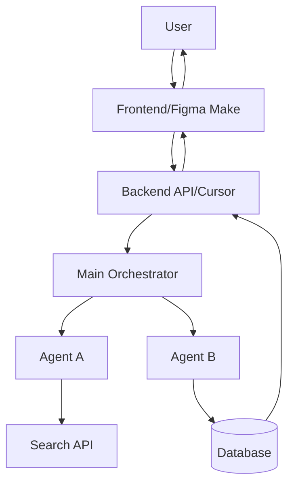
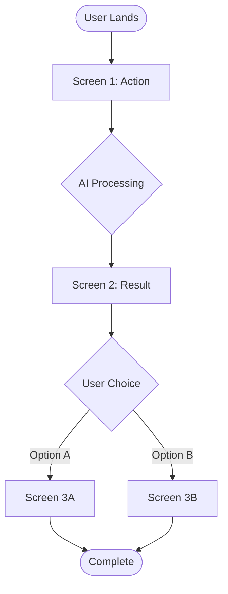
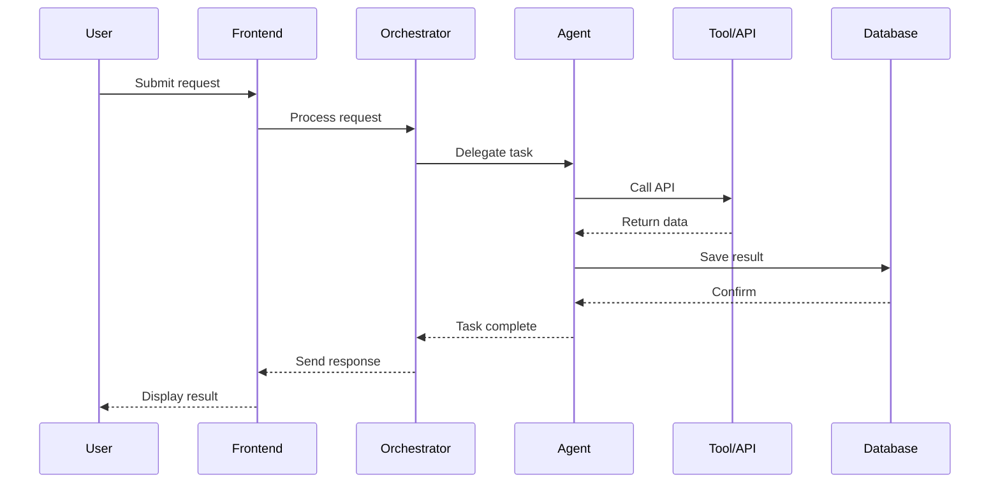
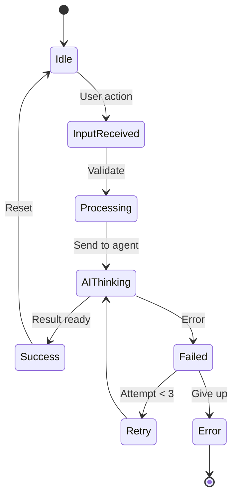
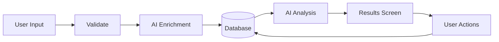

# [PRODUCT NAME] - AI Product Plan

**Last Updated**: [DATE]  
**Status**: [Planning / In Progress / Complete]  
**Owner**: [Name/Team]

---

## PROGRESS TRACKER

| Phase | Tasks | Status | Owner | Validation |
|-------|-------|--------|-------|------------|
| 0. Foundation | Product goal, users, metrics | ⬜ Not Started | Product | Goal clarity check |
| 1. Features | Feature matrix, prioritization | ⬜ Not Started | Product | Value validation |
| 2. UX Design | User journeys, screens, flows | ⬜ Not Started | Design | Flow completeness |
| 3. AI Design | Core AI features, agents, tools | ⬜ Not Started | AI Lead | Logic verification |
| 4. Workflows | End-to-end workflows (3) | ⬜ Not Started | UX | Journey testing |
| 5. Diagrams | Mermaid diagrams (all types) | ⬜ Not Started | Architect | Diagram accuracy |
| 6. Implementation | Figma + Cursor task breakdown | ⬜ Not Started | Dev Lead | Task clarity |
| 7. Testing | Acceptance tests, edge cases | ⬜ Not Started | QA | Coverage check |
| 8. Production | Checklists, deployment | ⬜ Not Started | DevOps | Launch readiness |

**Legend**: ⬜ Not Started | 🟡 In Progress | ✅ Complete

---

## 1. PRODUCT GOAL

### Problem
[What problem does this solve? 1 sentence]

### Users
[Who are the primary users? 1 sentence]

### Outcome
[What's the desired result? 1 sentence]

### Success Metric
[How do we measure success? 1 metric]

---

## 2. FEATURE MATRIX

| Feature | Type | User Value | AI Used | Screens | Priority | Status |
|---------|------|------------|---------|---------|----------|--------|
| [Feature 1] | Core | [Value] | Yes/No | [Screen names] | P0 | ⬜ |
| [Feature 2] | Advanced | [Value] | Yes/No | [Screen names] | P1 | ⬜ |

**Prioritization**
- P0 = Core (MVP required)
- P1 = Advanced (Phase 2)
- P2 = Nice-to-have

---

## 3. USER JOURNEYS

### Journey 1: First-Time User
**Goal**: [What they want to achieve]

| Step | Screen | User Action | AI Action | Next |
|------|--------|-------------|-----------|------|
| 1 | [Screen] | [Action] | [AI response] | [Next screen] |
| 2 | [Screen] | [Action] | [AI response] | [Next screen] |
| 3 | [Screen] | [Action] | [AI response] | [Outcome] |

**Validation**: Does user achieve goal in < 3 minutes?

### Journey 2: Returning User
[Same format as above]

### Journey 3: Power User
[Same format as above]

---

## 4. UI/UX SCREENS

### Screen 1: [Name]
**Purpose**: [Why this screen exists]

**Sections**:
1. [Section name] - [Purpose]
2. [Section name] - [Purpose]

**Primary CTA**: [Button text] → [Next screen]

**AI Feature**: [What AI does here]

**Mobile**: [How it adapts]

**Validation**: One clear action? No dead ends?

---

### Screen 2: [Name]
[Repeat format]

---

## 5. FORMS & CHATBOTS

### Form: [Name]
**Fields**: [List]  
**Validation**: [Rules]  
**AI Autofill**: [What gets auto-filled]  
**Submit Action**: [What happens]

### Chatbot: [Name]
**Trigger**: [When it appears]  
**Tasks**: [What it helps with]  
**Actions**: [Buttons/quick replies]  
**Memory**: [What it remembers]

---

## 6. AI FEATURES

### CORE AI (P0)

#### Feature 1: [Name]
- **Purpose**: [What it does]
- **Input**: [User provides]
- **Processing**: [AI analyzes]
- **Output**: [User receives]
- **Value**: [Why it matters]

### ADVANCED AI (P1)

#### Feature 2: [Name]
[Same format]

---

## 7. AI AGENTS

### Main Orchestrator
**Role**: [Coordinates all agents]  
**Trigger**: [User request received]  
**Routing Logic**:
- If [condition] → Call [Agent A]
- If [condition] → Call [Agent B]

### Agent A: [Name]
**Role**: [Specific task]  
**Trigger**: [When activated]  
**Inputs**: [Data needed]  
**Tools**: [APIs used]  
**Logic**:
1. Step 1
2. Step 2
3. Step 3
**Output**: [Returns what]  
**Fallback**: [If fails, then what]

### Agent B: [Name]
[Repeat format]

---

## 8. WORKFLOWS

### Workflow 1: [Simple Task]
**User Goal**: [What they want]

| Step | Actor | Action | Screen | AI/Tool | Result |
|------|-------|--------|--------|---------|--------|
| 1 | User | [Action] | [Screen] | - | [State change] |
| 2 | AI | [Processing] | - | [Agent + Tool] | [Output] |
| 3 | User | [Review] | [Screen] | - | [Decision] |
| 4 | System | [Execute] | [Screen] | [Action] | [Complete] |

**Validation**: Complete in < 2 minutes?

### Workflow 2: [Medium Complexity]
[Repeat format]

### Workflow 3: [Complex Task]
[Repeat format]

---

## 9. MERMAID DIAGRAMS

### System Architecture

### User Journey Flow

### Agent Sequence

### State Diagram

### Data Flow

---

## 10. REAL-WORLD USE CASES

### Use Case 1: [Scenario]
**User**: [Type]  
**Goal**: [What they need]  
**Flow**:
1. User: [Action on Screen X]
2. AI: [Processing via Agent Y]
3. User: [Review on Screen Z]
4. System: [Execute action]
**Result**: [Outcome + time saved]  
**Value**: [Business impact]

### Use Case 2-5
[Repeat format]

---

## 11. CONTENT & MICROCOPY

### Headlines
- Screen 1: "[Headline]"
- Screen 2: "[Headline]"

### Helper Text
- Form field: "[Help text]"
- Empty state: "[Message]"

### AI Responses
- Thinking: "[Message]"
- Success: "[Message]"
- Error: "[Message]"

### CTAs
- Primary: "[Button text]"
- Secondary: "[Button text]"

---

## 12. IMPLEMENTATION PLAN

### PHASE 1: CORE (MVP)

#### Figma Make Tasks
- [ ] Task 1: Design [Feature]
- [ ] Task 2: Create [Component]
- [ ] Task 3: Wire [Flow]
- [ ] Handoff: Export types, mocks, specs

#### Cursor AI Tasks
- [ ] Task 1: Build API for [Feature]
- [ ] Task 2: Implement [Agent]
- [ ] Task 3: Integrate [Tool]
- [ ] Task 4: Database schema
- [ ] Task 5: Deploy backend

### PHASE 2: ADVANCED

#### Figma Make Tasks
- [ ] Task 1: [Advanced UI]
- [ ] Task 2: [Additional screens]

#### Cursor AI Tasks
- [ ] Task 1: [Advanced agents]
- [ ] Task 2: [Optimizations]

---

## 13. ACCEPTANCE TESTS

### Test 1: [Feature Name]
**Given**: [Initial state]  
**When**: [User action]  
**Then**: [Expected result]

**Validation**: Pass/Fail

### Test 2-10
[Repeat format]

---

## 14. EDGE CASES & FALLBACKS

| Scenario | Detection | Fallback | User Message |
|----------|-----------|----------|--------------|
| AI timeout | > 30s | Show cached result | "Taking longer than expected..." |
| API failure | Error 500 | Retry 3x, then manual | "Service unavailable" |
| Invalid input | Validation fails | Show error | "Please check your input" |
| No results | Empty response | Show suggestions | "Try these instead..." |

---

## 15. PRODUCTION CHECKLIST

### UX
- [ ] All journeys tested
- [ ] No dead ends
- [ ] Mobile responsive
- [ ] Loading states
- [ ] Error states
- [ ] Empty states

### AI
- [ ] Agents tested
- [ ] Fallbacks work
- [ ] Rate limits set
- [ ] Timeouts configured
- [ ] Errors logged
- [ ] Context validated

### Performance
- [ ] Load time < 2s
- [ ] API response < 1s
- [ ] AI response < 10s
- [ ] Database optimized

### Security
- [ ] Input validation
- [ ] API auth
- [ ] Data encryption
- [ ] Privacy compliance

### Deployment
- [ ] Environment vars
- [ ] Error tracking
- [ ] Analytics
- [ ] Monitoring

---

## 16. PROMPT SEQUENCE

### Design Phase
1. "Design landing screen with [elements]"
2. "Create user flow from [A] to [B]"
3. "Design form for [purpose]"
4. "Create dashboard with [sections]"

### AI Phase
5. "Define agent for [task]"
6. "Create orchestrator routing logic"
7. "Design fallback for [error]"
8. "Write prompt for [AI feature]"

### Build Phase (Figma Make)
9. "Build [component] with [props]"
10. "Wire [screen A] to [screen B]"
11. "Generate types for [data]"
12. "Export handoff package"

### Build Phase (Cursor AI)
13. "Implement API endpoint for [feature]"
14. "Code agent logic for [task]"
15. "Set up database schema"
16. "Integrate [tool/API]"
17. "Deploy to production"

### Test Phase
18. "Test happy path for [journey]"
19. "Test edge case: [scenario]"
20. "Validate performance"

---

## SUCCESS CRITERIA

### Must Have
- [ ] Core journeys complete in < 3 min
- [ ] AI responds in < 10s
- [ ] Zero critical errors
- [ ] Mobile works perfectly

### Should Have
- [ ] Advanced features working
- [ ] Optimized performance
- [ ] Analytics tracking
- [ ] Error monitoring

### Nice to Have
- [ ] Animations
- [ ] Advanced AI features
- [ ] Integrations

---

## VALIDATION CHECKLIST

- [ ] Product goal clear
- [ ] Features prioritized correctly
- [ ] User journeys logical
- [ ] Screens map to features
- [ ] AI agents defined
- [ ] Workflows tested
- [ ] Diagrams accurate
- [ ] Implementation plan complete
- [ ] Tests cover edge cases
- [ ] Production ready

---

## NOTES & DECISIONS

[Track key decisions, open questions, blockers]

---

**TOTAL LINES**: ~600
