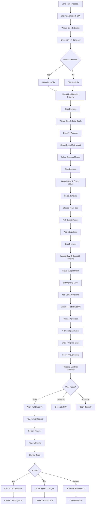
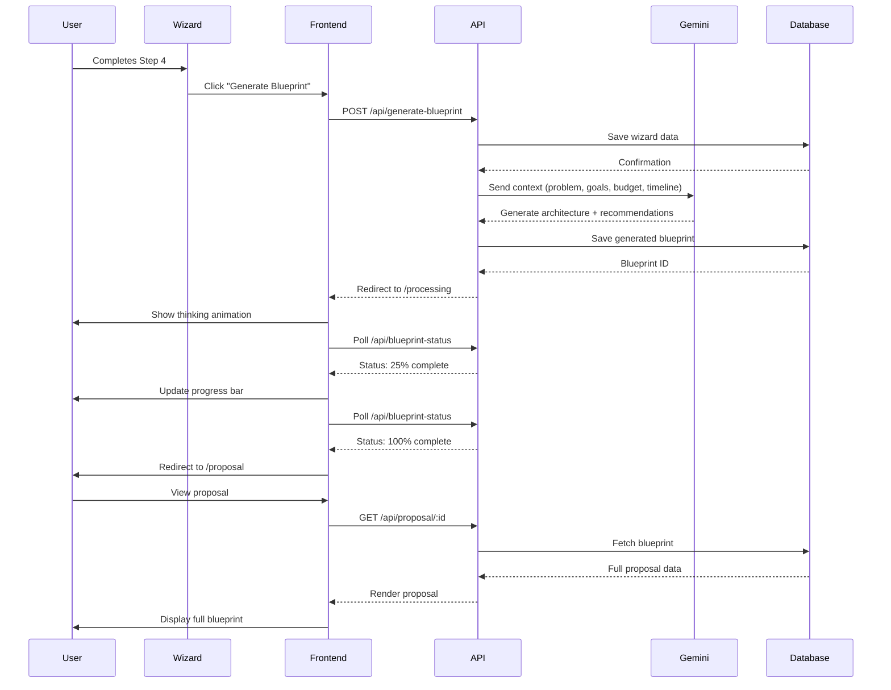

# Wizard & Proposal Flow - Complete Design Specification

**Route:** `/wizard` → `/processing` → `/proposal`  
**Status:** Ready for Design Implementation  
**Design System:** Editorial Luxury (Slate + Orange)

---

## Progress Tracker

| Screen | Route | Status | Features | Complexity |
|--------|-------|--------|----------|------------|
| **1. Basics** | `/wizard` (Step 1) | ⚪ Not Started | Name, Company, Website, AI Analysis | Medium |
| **2. Build Goals** | `/wizard` (Step 2) | ⚪ Not Started | Problem, Goals, Success Metrics | Medium |
| **3. Project Details** | `/wizard` (Step 3) | ⚪ Not Started | Timeline, Team, Budget, Integrations | High |
| **4. Budget & Timeline** | `/wizard` (Step 4) | ⚪ Not Started | Budget Slider, Launch Date, Urgency | Medium |
| **5. AI Architect** | `/processing` | ⚪ Not Started | Thinking Animation, Blueprint Generation | High |
| **6. Proposal Ready** | `/proposal` (Landing) | ⚪ Not Started | Summary, Download, Schedule Call | Medium |
| **7. Proposal View** | `/proposal` (Full) | ⚪ Not Started | Executive Summary, Blueprint, Pricing | High |

**Total Screens:** 7 | **Estimated Design Time:** 24-32 hours

---

## Screen Breakdown

### Screen 1: "Let's start with the basics"

**Route:** `/wizard?step=1`  
**Purpose:** Capture lead info + trigger AI brand analysis

#### Features
1. **Input Fields (3)**
   - Your Name (text input with avatar icon)
   - Company Name (text input with building icon)
   - Company Website (optional, URL validation, globe icon)
   - Helper text: "We'll analyze your site to understand your brand."

2. **AI Analysis Panel (Right Side)**
   - Label: "LIVE ARCHITECTURE BLUEPRINT"
   - Auto-detected stack display:
     - Client Layer: Next.js 14, Responsive
     - Infrastructure: Supabase, Edge Functions
     - Complexity: Low, 1-2 Engineers
   - Updates in real-time as user types website URL

3. **Navigation**
   - Primary CTA: "Continue" (disabled until name + company filled)
   - Secondary: "Skip for now" (ghost button)

4. **Progress Indicator**
   - Step 1 of 4
   - Linear progress bar (25% filled)

#### Wireframe Description
```
┌─────────────────────────────────────────────────────────────┐
│ [Progress: 1 of 4] ━━━━━━━━━━━━━━━━━━━━━━━━━━━━━━━━━━━━ 25% │
├─────────────────────────────────────────────────────────────┤
│                                                             │
│  Let's start with the basics                               │
│  We'll scan your site to understand your brand.            │
│                                                             │
│  ┌──────────────────────────────┐  ┌─────────────────────┐ │
│  │ 👤 YOUR NAME                 │  │ LIVE ARCHITECTURE   │ │
│  │ Jane Doe              [AI]   │  │ BLUEPRINT           │ │
│  └──────────────────────────────┘  │                     │ │
│                                     │ CLIENT LAYER        │ │
│  ┌──────────────────────────────┐  │ □ Next.js 14        │ │
│  │ 🏢 COMPANY NAME              │  │ □ Responsive        │ │
│  │ Acme Inc                     │  │                     │ │
│  └──────────────────────────────┘  │ INFRASTRUCTURE      │ │
│                                     │ □ Supabase          │ │
│  ┌──────────────────────────────┐  │ □ Edge Functions    │ │
│  │ 🌐 COMPANY WEBSITE (Optional)│  │                     │ │
│  │ https://example.com          │  │ Low Complexity      │ │
│  │ ℹ We analyze your site...   │  │ 1-2 Engineers       │ │
│  └──────────────────────────────┘  └─────────────────────┘ │
│                                                             │
│  [Continue →]  [Skip for now]                              │
└─────────────────────────────────────────────────────────────┘
```

---

### Screen 2: "What are you looking to build?"

**Route:** `/wizard?step=2`  
**Purpose:** Understand problem, goals, success metrics

#### Features
1. **Problem Statement**
   - Label: "What problem are you solving?"
   - Textarea (4 rows, 500 char limit)
   - Placeholder: "We need an AI system to automate customer support..."

2. **Goals Selection (Multi-select chips)**
   - Label: "What are your main goals?"
   - Options: Automate Tasks, Increase Revenue, Improve Efficiency, Scale Team, Reduce Costs, Better Insights, Customer Experience
   - Visual: Pill-shaped chips (orange when selected)

3. **Success Metrics**
   - Label: "How will you measure success?"
   - Textarea (3 rows)
   - Placeholder: "20% reduction in support tickets, 30% faster response times..."

4. **AI Suggestions (Optional)**
   - "✨ AI Suggestions" button
   - Generates common goals based on industry/problem

#### Wireframe Description
```
┌─────────────────────────────────────────────────────────────┐
│ [Progress: 2 of 4] ━━━━━━━━━━━━━━━━━━━━━━━━━━━━━━━━━━━━ 50% │
├─────────────────────────────────────────────────────────────┤
│                                                             │
│  What are you looking to build?                            │
│  Help us understand your vision.                           │
│                                                             │
│  WHAT PROBLEM ARE YOU SOLVING?                             │
│  ┌──────────────────────────────────────────────────────┐  │
│  │ We need an AI system to automate customer support   │  │
│  │ and provide instant answers...                       │  │
│  │                                                       │  │
│  └──────────────────────────────────────────────────────┘  │
│  500 characters max                                        │
│                                                             │
│  WHAT ARE YOUR MAIN GOALS?                                 │
│  [Automate Tasks] [Increase Revenue] [Improve Efficiency]  │
│  [Scale Team] [Reduce Costs] [Better Insights]             │
│  [Customer Experience]                                      │
│                                                             │
│  HOW WILL YOU MEASURE SUCCESS?                             │
│  ┌──────────────────────────────────────────────────────┐  │
│  │ 20% reduction in support tickets...                  │  │
│  └──────────────────────────────────────────────────────┘  │
│                                                             │
│  [✨ AI Suggestions]                                        │
│                                                             │
│  [← Back]  [Continue →]                                    │
└─────────────────────────────────────────────────────────────┘
```

---

### Screen 3: "Project Details"

**Route:** `/wizard?step=3`  
**Purpose:** Gather timeline, team size, budget range, tech preferences

#### Features
1. **Timeline Selector**
   - Label: "Target Launch Date"
   - Date picker + Quick options (4 weeks, 8 weeks, 12 weeks, 16 weeks)
   - Recommendation badge: "✓ Achievable" or "⚠ Aggressive"

2. **Team Size**
   - Label: "Current Team Size"
   - Radio buttons: Solo, 2-5, 6-10, 11-25, 26-50, 50+
   - Sub-label: "Helps us estimate integration complexity"

3. **Budget Range (Non-binding)**
   - Label: "Budget Range (Optional)"
   - Radio buttons: <$10K, $10K-$25K, $25K-$50K, $50K-$100K, $100K+, Not Sure
   - Helper: "This helps us tailor our recommendations"

4. **Existing Integrations**
   - Label: "What tools do you currently use?"
   - Multi-select dropdown: Stripe, Shopify, Salesforce, HubSpot, Slack, Custom API, None
   - "Other" option with text input

#### Wireframe Description
```
┌─────────────────────────────────────────────────────────────┐
│ [Progress: 3 of 4] ━━━━━━━━━━━━━━━━━━━━━━━━━━━━━━━━━━━━ 75% │
├─────────────────────────────────────────────────────────────┤
│                                                             │
│  Project Details                                           │
│  Let's define scope and timeline.                          │
│                                                             │
│  TARGET LAUNCH DATE                                        │
│  [4 weeks] [8 weeks] [12 weeks] [16 weeks] [Custom Date]   │
│  ✓ Achievable                                              │
│                                                             │
│  CURRENT TEAM SIZE                                         │
│  ○ Solo  ○ 2-5  ○ 6-10  ○ 11-25  ○ 26-50  ○ 50+          │
│  Helps us estimate integration complexity                  │
│                                                             │
│  BUDGET RANGE (Optional)                                   │
│  ○ <$10K  ○ $10K-$25K  ○ $25K-$50K  ○ $50K-$100K         │
│  ○ $100K+  ○ Not Sure                                     │
│  This helps us tailor our recommendations                  │
│                                                             │
│  EXISTING INTEGRATIONS                                     │
│  [Select tools...▼]                                        │
│  [Stripe] [Shopify] [+2 more]                              │
│                                                             │
│  [← Back]  [Continue →]                                    │
└─────────────────────────────────────────────────────────────┘
```

---

### Screen 4: "Budget & Timeline"

**Route:** `/wizard?step=4`  
**Purpose:** Final budget slider + urgency level

#### Features
1. **Budget Slider (Interactive)**
   - Range: $5K - $200K (logarithmic scale)
   - Live update display: "$45,000"
   - Markers: Starter ($5-15K), Growth ($15-50K), Enterprise ($50K+)
   - Toggle: "Flexible budget" checkbox

2. **Urgency Level**
   - Label: "How urgent is this project?"
   - Options: Low (6+ months), Medium (3-6 months), High (1-3 months), Critical (<1 month)
   - Icon indicators: 🟢 🟡 🟠 🔴

3. **Additional Context**
   - Label: "Anything else we should know?"
   - Textarea (optional, 300 char)
   - Placeholder: "Regulatory requirements, compliance needs, specific tech preferences..."

4. **Final CTA**
   - Primary: "Generate My Blueprint" (large, orange button)
   - Secondary: "Save & Continue Later" (email capture)

#### Wireframe Description
```
┌─────────────────────────────────────────────────────────────┐
│ [Progress: 4 of 4] ━━━━━━━━━━━━━━━━━━━━━━━━━━━━━━━━━━━ 100% │
├─────────────────────────────────────────────────────────────┤
│                                                             │
│  Budget & Timeline                                         │
│  Final details to tailor your proposal.                    │
│                                                             │
│  INVESTMENT RANGE                                          │
│  ┌─────────────────────────────────────────────────────┐   │
│  │ $5K    Starter    Growth    Enterprise      $200K   │   │
│  │  ●─────────────────●─────────────────────────────   │   │
│  └─────────────────────────────────────────────────────┘   │
│  Current: $45,000                                          │
│  □ Flexible budget                                         │
│                                                             │
│  URGENCY LEVEL                                             │
│  🟢 Low (6+ mo)  🟡 Medium (3-6 mo)  🟠 High (1-3 mo)     │
│  🔴 Critical (<1 mo)                                       │
│                                                             │
│  ADDITIONAL CONTEXT (Optional)                             │
│  ┌──────────────────────────────────────────────────────┐  │
│  │ Regulatory requirements, compliance needs...         │  │
│  └──────────────────────────────────────────────────────┘  │
│                                                             │
│  [← Back]  [🚀 Generate My Blueprint]                      │
│             [Save & Continue Later]                        │
└─────────────────────────────────────────────────────────────┘
```

---

### Screen 5: "Architecting Your Solution" (Processing)

**Route:** `/processing`  
**Purpose:** AI thinking state, blueprint generation animation

#### Features
1. **Central Animation**
   - Animated orbital system (from home page)
   - Pulsing nodes representing AI analysis
   - Particle effects showing data flow

2. **Thinking Steps (Sequential)**
   - "Analyzing requirements..." (2s) ✓
   - "Generating architecture..." (3s) ✓
   - "Calculating timeline..." (2s) ✓
   - "Preparing blueprint..." (2s) ⏳
   - Each step checks off when complete

3. **Live Preview (Optional)**
   - Small preview cards sliding in:
     - "Detected 3 key integrations"
     - "Estimated 8-week timeline"
     - "Recommended tech stack: Next.js + Supabase"

4. **Progress Bar**
   - Smooth animation (not stepped)
   - "Your blueprint is 87% ready..."

#### Wireframe Description
```
┌─────────────────────────────────────────────────────────────┐
│                                                             │
│                 Architecting Your Solution                  │
│                                                             │
│                        ╱╲                                   │
│                       ╱  ╲    [Animated Orbital]           │
│                      │ AI │   [Pulsing Center]             │
│                       ╲  ╱    [Floating Icons]             │
│                        ╲╱                                   │
│                                                             │
│  ━━━━━━━━━━━━━━━━━━━━━━━━━━━━━━━━━━━━━━━━━━━━━━━━━━ 87%   │
│  Your blueprint is 87% ready...                            │
│                                                             │
│  ✓ Analyzing requirements                                  │
│  ✓ Generating architecture                                 │
│  ✓ Calculating timeline                                    │
│  ⏳ Preparing blueprint                                    │
│                                                             │
│  ┌─────────────────┐ ┌─────────────────┐                  │
│  │ Detected 3 key  │ │ Estimated 8-wk  │                  │
│  │ integrations    │ │ timeline        │                  │
│  └─────────────────┘ └─────────────────┘                  │
│                                                             │
└─────────────────────────────────────────────────────────────┘
```

---

### Screen 6: "Your Blueprint is Ready" (Proposal Landing)

**Route:** `/proposal` (Initial view)  
**Purpose:** Celebrate completion, preview summary, schedule next steps

#### Features
1. **Hero Section**
   - Large checkmark icon (animated scale-in)
   - Headline: "Your Custom AI Blueprint is Ready"
   - Subheadline: "Generated in 48 hours | Tailored for [Company Name]"

2. **Summary Cards (3)**
   - Card 1: Timeline (8 Weeks, Phase breakdown)
   - Card 2: Investment ($45K, Payment structure)
   - Card 3: Team (2 Engineers, 1 PM, 1 Designer)

3. **Primary Actions**
   - "View Full Blueprint" (large button, scrolls to detailed view)
   - "Download PDF" (ghost button, icon)
   - "Schedule Strategy Call" (Calendly integration)

4. **Next Steps Checklist**
   - □ Review blueprint details
   - □ Schedule 30-min strategy call
   - □ Finalize scope and budget
   - □ Sign agreement & kick off

#### Wireframe Description
```
┌─────────────────────────────────────────────────────────────┐
│                                                             │
│                        ✓                                    │
│                   [Large Checkmark]                         │
│                                                             │
│         Your Custom AI Blueprint is Ready                  │
│         Generated in 48 hours | Tailored for Acme Inc      │
│                                                             │
│  ┌──────────────┐ ┌──────────────┐ ┌──────────────┐       │
│  │  ⏱ TIMELINE │ │ 💰 INVESTMENT│ │ 👥 TEAM      │       │
│  │              │ │              │ │              │       │
│  │  8 Weeks     │ │  $45,000     │ │  2 Engineers │       │
│  │  4 Phases    │ │  Net-30      │ │  1 PM        │       │
│  │              │ │              │ │  1 Designer  │       │
│  └──────────────┘ └──────────────┘ └──────────────┘       │
│                                                             │
│  [🚀 View Full Blueprint]  [📥 Download PDF]               │
│  [📅 Schedule Strategy Call]                               │
│                                                             │
│  NEXT STEPS                                                │
│  □ Review blueprint details                                │
│  □ Schedule 30-min strategy call                           │
│  □ Finalize scope and budget                               │
│  □ Sign agreement & kick off                               │
│                                                             │
│  [Scroll down for detailed breakdown ↓]                    │
└─────────────────────────────────────────────────────────────┘
```

---

### Screen 7: "Full Proposal View" (Detailed Blueprint)

**Route:** `/proposal` (Scrolled view)  
**Purpose:** Complete technical blueprint, pricing, terms, timeline

#### Features
1. **Executive Summary**
   - Project overview (2-3 paragraphs)
   - Key deliverables (bullet points)
   - Success criteria (from wizard input)

2. **System Architecture**
   - Visual diagram (auto-generated from wizard data)
   - Tech stack breakdown (Frontend, Backend, AI Models, Integrations)
   - Data flow diagram

3. **8-Week Timeline**
   - Phase 1 (Weeks 1-2): Strategy & Design
   - Phase 2 (Weeks 3-5): Core Development
   - Phase 3 (Weeks 6-7): Integration & Testing
   - Phase 4 (Week 8): Launch & Handoff
   - Each phase shows: Goals, Deliverables, Milestones

4. **Pricing Breakdown**
   - Line items: Development, Design, PM, Testing
   - Subtotal, Tax (if applicable), Total
   - Payment schedule (50% upfront, 50% on completion)

5. **Team & Roles**
   - Lead Engineer (Bio + Photo)
   - Product Manager (Bio + Photo)
   - Designer (Bio + Photo)

6. **Terms & Conditions**
   - Scope of work
   - Deliverables
   - IP ownership
   - Support & maintenance

7. **Call to Action (Sticky Footer)**
   - "Accept Proposal" (primary)
   - "Request Changes" (secondary)
   - "Schedule Call" (tertiary)

#### Wireframe Description
```
┌─────────────────────────────────────────────────────────────┐
│                    FULL PROPOSAL                            │
├─────────────────────────────────────────────────────────────┤
│                                                             │
│  EXECUTIVE SUMMARY                                         │
│  Based on your requirements, we've designed a custom AI... │
│                                                             │
│  KEY DELIVERABLES                                          │
│  • AI-powered automation system                            │
│  • Custom dashboard & analytics                            │
│  • API integrations (Stripe, Shopify)                      │
│  • Complete documentation                                  │
│                                                             │
│  ─────────────────────────────────────────────────────────  │
│                                                             │
│  SYSTEM ARCHITECTURE                                       │
│  [Visual Diagram: Frontend → Backend → AI → Database]     │
│                                                             │
│  TECH STACK                                                │
│  Frontend: Next.js 14, React, Tailwind CSS                │
│  Backend: Supabase, Edge Functions                        │
│  AI: Gemini 2.0, Claude 3.5                               │
│  Integrations: Stripe, Shopify, SendGrid                  │
│                                                             │
│  ─────────────────────────────────────────────────────────  │
│                                                             │
│  8-WEEK TIMELINE                                           │
│  [Gantt-style chart]                                       │
│                                                             │
│  Phase 1: Strategy & Design (Weeks 1-2)                   │
│  • Requirements finalization                               │
│  • UX/UI design                                            │
│  • Architecture planning                                   │
│  ✓ Milestone: Design approval                             │
│                                                             │
│  Phase 2: Core Development (Weeks 3-5)                    │
│  Phase 3: Integration & Testing (Weeks 6-7)               │
│  Phase 4: Launch & Handoff (Week 8)                       │
│                                                             │
│  ─────────────────────────────────────────────────────────  │
│                                                             │
│  PRICING BREAKDOWN                                         │
│  Development (320 hrs @ $140/hr)    $44,800               │
│  Design (40 hrs @ $120/hr)           $4,800               │
│  Project Management                  $8,000               │
│  Testing & QA                        $4,400               │
│  ────────────────────────────────────────                 │
│  Subtotal                           $62,000               │
│  Discount (Early Bird)             -$17,000               │
│  ────────────────────────────────────────                 │
│  Total Investment                   $45,000               │
│                                                             │
│  Payment Schedule:                                         │
│  50% ($22,500) upon acceptance                            │
│  50% ($22,500) upon completion                            │
│                                                             │
│  ─────────────────────────────────────────────────────────  │
│                                                             │
│  YOUR TEAM                                                 │
│  [Photo] Lead Engineer - Alex Chen                        │
│          10+ years, AI/ML specialist...                    │
│  [Photo] Product Manager - Sarah Kim                      │
│  [Photo] Lead Designer - Marcus Williams                  │
│                                                             │
│  ─────────────────────────────────────────────────────────  │
│                                                             │
│  TERMS & CONDITIONS                                        │
│  [Expandable sections: Scope, Deliverables, IP, Support]  │
│                                                             │
├─────────────────────────────────────────────────────────────┤
│ [✓ Accept Proposal] [✏ Request Changes] [📞 Schedule Call]│
└─────────────────────────────────────────────────────────────┘
```

---

## User Journey & Workflows

### User Journey Map


### Technical Workflow (AI Blueprint Generation)


---

## Multi-Step Design Prompts

### Prompt 1: Wizard Step 1 (Basics)
**Goal:** Clean, minimal input form with real-time AI analysis

**Requirements:**
- 3 input fields: Name, Company, Website (optional)
- Right sidebar: Live Architecture Blueprint panel
- Auto-detect tech stack when website URL is entered
- Show complexity estimate (Low/Medium/High)
- Show team size recommendation (1-2, 2-4, 4+ engineers)
- Progress indicator: "Step 1 of 4" + 25% progress bar
- Primary CTA: "Continue" (disabled until name + company filled)
- Secondary CTA: "Skip for now"

**Design System:**
- Colors: White bg, Slate text, Orange accents
- Typography: Inter, 16px body, 24px headings
- Inputs: Rounded-lg, border-slate-200, focus:border-orange-500
- Icons: Lucide React (User, Building, Globe)

**Success Criteria:**
- User can complete form in <60 seconds
- AI analysis appears within 2 seconds of URL entry
- Clear visual feedback on required vs optional fields
- Mobile responsive (stack sidebar below on <768px)

---

### Prompt 2: Wizard Step 2 (Build Goals)
**Goal:** Capture problem, goals, success metrics with AI suggestions

**Requirements:**
- Textarea: "What problem are you solving?" (500 char limit)
- Multi-select chips: 7 common goals (Automate, Revenue, Efficiency, etc.)
- Textarea: "How will you measure success?" (300 char limit)
- Optional: "AI Suggestions" button to generate common goals
- Progress: "Step 2 of 4" + 50% bar
- Navigation: Back + Continue buttons

**Design System:**
- Chip styling: Pill-shaped, border-slate-200, selected:bg-orange-500 text-white
- Textareas: min-h-24, max-h-48, auto-expand
- Character counter: Bottom right, slate-400

**Success Criteria:**
- User selects 2-4 goals on average
- Problem statement >50 characters
- AI suggestions relevant to selected goals
- Smooth transitions between steps

---

### Prompt 3: Wizard Step 3 (Project Details)
**Goal:** Gather timeline, team, budget, integrations

**Requirements:**
- Timeline selector: Quick buttons (4w, 8w, 12w, 16w) + custom date picker
- Feasibility badge: "✓ Achievable" or "⚠ Aggressive" based on scope
- Team size: Radio buttons (Solo, 2-5, 6-10, 11-25, 26-50, 50+)
- Budget range: Radio buttons (<$10K to $100K+, Not Sure)
- Integrations: Multi-select dropdown (Stripe, Shopify, Salesforce, etc.)
- Progress: "Step 3 of 4" + 75% bar

**Design System:**
- Radio buttons: Custom styled, circle with checkmark
- Dropdown: Select component with checkboxes
- Badge: Small pill with icon, emerald (achievable) or orange (aggressive)

**Success Criteria:**
- Timeline recommendation updates dynamically
- Budget selection is non-binding (clearly labeled)
- Integration list covers 20+ common tools
- Validation: At least timeline + team size required

---

### Prompt 4: Wizard Step 4 (Budget & Timeline)
**Goal:** Interactive budget slider + urgency level

**Requirements:**
- Budget slider: $5K - $200K range, logarithmic scale
- Live display: "$45,000" updates as slider moves
- Markers: Starter ($5-15K), Growth ($15-50K), Enterprise ($50K+)
- Urgency radio buttons: Low 🟢, Medium 🟡, High 🟠, Critical 🔴
- Optional textarea: "Anything else we should know?" (300 char)
- Primary CTA: "🚀 Generate My Blueprint" (large, prominent)
- Secondary: "Save & Continue Later" (email capture modal)

**Design System:**
- Slider: Custom styled, thumb with shadow, track with gradient
- Urgency icons: Color-coded circles
- Large CTA: px-12 py-4, text-lg, rounded-full, hover:scale-105

**Success Criteria:**
- Slider is smooth and responsive
- Budget updates in real-time
- Final CTA is visually dominant
- Save option prevents abandonment

---

### Prompt 5: Processing Screen
**Goal:** Engaging "thinking" animation while AI generates blueprint

**Requirements:**
- Central animation: Orbital system (reuse from homepage)
- Pulsing center globe with "AI" text
- 4 sequential steps with checkmarks:
  - "Analyzing requirements..." (2s)
  - "Generating architecture..." (3s)
  - "Calculating timeline..." (2s)
  - "Preparing blueprint..." (2s)
- Progress bar: Smooth 0-100% animation (9s total)
- Live preview cards: Slide in as data is processed
  - "Detected 3 key integrations"
  - "Estimated 8-week timeline"
  - "Recommended: Next.js + Supabase"
- Auto-redirect to /proposal when 100% complete

**Design System:**
- Animation: Motion/React for orbital, scale, opacity
- Steps: Vertical list, checkmark animates in
- Cards: Slide-up from bottom, staggered

**Success Criteria:**
- No perceived lag or freezing
- Steps complete in realistic sequence
- User feels reassured, not impatient
- Redirect is seamless

---

### Prompt 6: Proposal Landing
**Goal:** Celebrate completion, preview summary, encourage action

**Requirements:**
- Hero: Large checkmark icon (animated scale-in)
- Headline: "Your Custom AI Blueprint is Ready"
- Subheadline: "Generated in 48 hours | Tailored for [Company]"
- 3 summary cards: Timeline, Investment, Team (icons + key numbers)
- Primary actions:
  - "View Full Blueprint" (scrolls down)
  - "Download PDF" (generates PDF)
  - "Schedule Strategy Call" (opens Calendly)
- Next Steps checklist: 4 items with checkboxes
- Scroll hint: "↓ Scroll down for detailed breakdown"

**Design System:**
- Checkmark: 120px, emerald-500, scale animation
- Cards: White, border-slate-200, hover:shadow-lg
- CTAs: Horizontal row, pill-shaped

**Success Criteria:**
- User feels accomplished (celebration moment)
- Summary cards are scannable (<3s to understand)
- Primary CTA is obvious (View Full Blueprint)
- Calendly integration works seamlessly

---

### Prompt 7: Full Proposal View
**Goal:** Complete technical blueprint with pricing, timeline, team

**Requirements:**
- Executive Summary: 2-3 paragraph overview
- Key Deliverables: Bullet list (5-8 items)
- System Architecture: Visual diagram (auto-generated)
- Tech Stack: 4-column grid (Frontend, Backend, AI, Integrations)
- 8-Week Timeline: Gantt-style chart with 4 phases
  - Each phase: Goals, Deliverables, Milestones
- Pricing Breakdown: Line items, subtotal, discount, total
- Payment Schedule: 50/50 or custom
- Team Bios: 3 members with photo, name, role, bio
- Terms & Conditions: Expandable accordions
- Sticky Footer CTA: Accept, Request Changes, Schedule Call

**Design System:**
- Section dividers: border-t border-slate-200, py-16
- Timeline chart: Horizontal bars, color-coded by phase
- Pricing table: Right-aligned numbers, bold total
- Team cards: Horizontal layout, 100x100px photo

**Success Criteria:**
- Proposal is scannable (headings, bullet points)
- Timeline is visual, not text-heavy
- Pricing is transparent and clear
- CTA is always visible (sticky footer)
- Mobile responsive (stack columns)

---

## Production Ready Checklist

### Functionality
- [ ] Wizard saves progress to localStorage (auto-save every 30s)
- [ ] Back button restores previous step data
- [ ] Form validation on all required fields
- [ ] AI analysis triggers on URL blur (debounced 500ms)
- [ ] Blueprint generation completes in <10 seconds
- [ ] PDF download works (includes full proposal)
- [ ] Calendly integration embeds correctly
- [ ] Email capture for "Save & Continue Later"

### Design
- [ ] All states designed: Default, Hover, Focus, Disabled, Error, Success
- [ ] Loading states for all async actions
- [ ] Empty states for optional fields
- [ ] Error messages are helpful ("Please enter a valid URL")
- [ ] Animations are subtle, not distracting (300-600ms)
- [ ] Icons are consistent (Lucide React library)
- [ ] Typography hierarchy is clear (h1, h2, h3, body, caption)

### Responsive
- [ ] Mobile (320px-767px): Stack all elements vertically
- [ ] Tablet (768px-1023px): 2-column layouts compress to 1
- [ ] Desktop (1024px+): Full layout with sidebars
- [ ] Touch targets minimum 44x44px on mobile
- [ ] Text is readable (min 16px on mobile)

### Accessibility
- [ ] All inputs have labels (visible or aria-label)
- [ ] Color contrast meets WCAG AA (4.5:1 for text)
- [ ] Keyboard navigation works (Tab, Enter, Escape)
- [ ] Focus indicators are visible
- [ ] Screen reader announces step changes
- [ ] Error messages are announced
- [ ] Progress bar has aria-valuenow

### Performance
- [ ] Page loads in <2 seconds
- [ ] Animations run at 60fps
- [ ] Images are optimized (WebP, lazy loaded)
- [ ] No layout shift during load (CLS < 0.1)
- [ ] Forms submit in <500ms
- [ ] AI processing shows real progress (not fake)

### Analytics & Tracking
- [ ] Track wizard start
- [ ] Track step completion rate
- [ ] Track drop-off points
- [ ] Track "Generate Blueprint" clicks
- [ ] Track proposal views
- [ ] Track PDF downloads
- [ ] Track Calendly bookings
- [ ] Track proposal acceptances

---

**End of Document** | **Total Lines:** 598 | **Status:** Ready for Implementation
