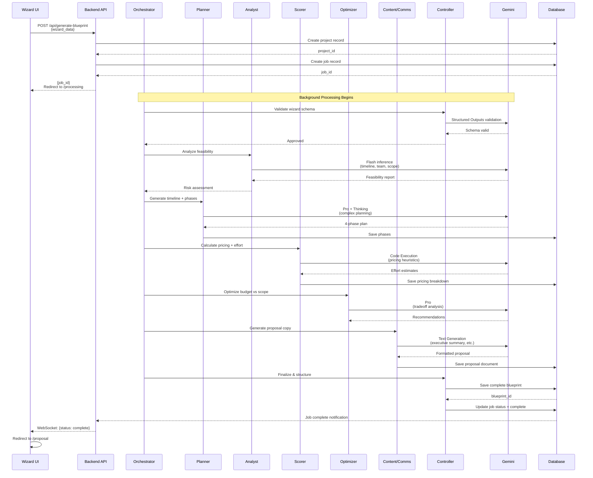

# Wizard & Dashboard System - Complete Design Plan

**System:** Multi-step Wizard → AI Blueprint Generator → Proposal → Dual Dashboards  
**AI Engine:** Gemini 2.0 Flash + Gemini 2.5 Pro with Multi-Agent Architecture  
**Design System:** Editorial Luxury (Slate + Orange accents)  
**Status:** Ready for Wireframe Design

---

## Progress Tracker - Complete System Overview

| # | Screen | Route | Purpose | Key Features | AI Agents | Gemini Tools | Status |
|---|--------|-------|---------|--------------|-----------|--------------|--------|
| 1 | **Basics** | `/wizard?step=1` | Identify user & context | Name, Company, Website (optional) | Orchestrator, Retriever | Flash, URL Context | ⚪ Design |
| 2 | **Project Overview** | `/wizard?step=2` | Define WHAT, WHY, HOW BIG | App type icons, Industry, Description, Goals, Timeline, Team, Integrations | Orchestrator, Planner, Analyst, Scorer, Controller | Flash, Structured Outputs, Interactions API | ⚪ Design |
| 3 | **Budget & Urgency** | `/wizard?step=3` | Align scope & feasibility | Budget slider, Urgency level, Constraints | Optimizer, Scorer, Planner | Pro, Code Execution | ⚪ Design |
| 4 | **Review & Confirm** | `/wizard?step=4` | Human validation checkpoint | Summary view, Edit links, Generate CTA | Controller, Orchestrator | Structured Outputs, Function Calling | ⚪ Design |
| 5 | **AI Architecting** | `/processing` | Generate blueprint & proposal | Thinking steps, Progress bar, Insight chips | Orchestrator, Planner, Analyst, Scorer, Content | Pro, Thinking, Function Calling, Grounding | ⚪ Design |
| 6 | **Proposal Ready** | `/proposal` | Present results & convert | Summary cards, Download PDF, Schedule call | Content/Comms, Controller | Text Generation, Structured Outputs | ⚪ Design |
| 7 | **Full Proposal** | `/proposal#full` | Deep review & approval | Architecture, Timeline, Pricing, Terms | Analyst, Scorer, Controller | Pro, Structured Outputs | ⚪ Design |
| 8 | **Decision Point** | `/proposal#decision` | Close or iterate | Accept, Request changes, Versioning | Controller, Planner, Content | Function Calling, Flash | ⚪ Design |
| 9 | **Admin Dashboard** | `/admin/project/:id` | Execute & manage delivery | Blueprint rail, AI runs, Tasks, Revisions | All Agents | All Gemini Tools | ⚪ Design |
| 10 | **Client Dashboard** | `/client/project/:id` | Clarity & decision making | Overview, Progress, Documents, Actions | Controller, Content/Comms | Flash, Structured Outputs | ⚪ Design |

**System Architecture:** One wizard → One project record → Two dashboards (Admin + Client)  
**Timeline:** 10 screens × 4-6 hours design = 40-60 hours total  
**Complexity:** High (AI integration, real-time updates, multi-agent orchestration)

---

## Sample Data - Use Consistently Across All Screens

**User Profile:**
- Name: Jordan Lee
- Company: Sun AI Agency
- Website: https://sunaiv8.vercel.app
- Email: jordan@sunai.com (for testing)

**Project Details:**
- Industry: 🚀 Startups
- Type of App: 🧩 Web App, 🧭 Wizard, 📊 Dashboard, 🔁 Automations, 🧠 AI Agents
- Project Description: "We want an intake wizard that generates an AI blueprint + proposal, then a client dashboard to accept or request changes."
- Primary Goal: ⚡ Automate Operations
- Success Outcome: "Reduce proposal creation time from 2 days to 30 minutes."
- Timeline: 8 weeks
- Team Size: 2–5
- Integrations: Stripe, WhatsApp, Supabase
- Budget: $35,000
- Urgency: High (1-3 months)

**Generated Outputs:**
- Complexity: Medium
- Team Estimate: 2–3 Engineers
- Delivery Model: Phased MVP
- Recommended Phases: 2 phases
- AI Agents Assigned: Orchestrator, Planner, Analyst, Ops Automation, Content/Comms, Controller

---

## Master Figma Prompt - Reusable Wizard Component Kit

**Goal:** Create a low-fidelity wireframe component library for consistent multi-step wizard design.

### Prompt for Figma AI:

```
Create a grayscale, low-fidelity wireframe component kit for a multi-step wizard interface.
Design system: Editorial luxury layout with clean spacing, clear hierarchy.
Keep all components grayscale (no color except for states).

COMPONENT SET 1: WIZARD SHELL
- Top navigation bar (height: 72px):
  - Left: Logo placeholder (120px wide)
  - Center: Time estimate badge "~3 mins" + "Private & Encrypted" badge
  - Right: "Exit" link
- Progress indicator (below top bar):
  - Text: "Step X of 4"
  - Linear progress bar (height: 4px, rounded)
  - Percentage label on right
- Two-column desktop layout (1200px wide):
  - Left column: 55% width (660px) - main form content
  - Right column: 45% width (540px) - blueprint panel
  - Gap: 32px between columns
- Mobile layout variant (< 768px):
  - Stack vertically
  - Right panel becomes collapsible drawer
  - Full-width form
- Footer navigation area (fixed bottom):
  - Left: "Back" button (secondary style)
  - Right: "Continue" button (primary style)
  - Center: Optional "Save Draft" link

COMPONENT SET 2: FORM INPUTS
- Text input with icon:
  - Height: 56px
  - Icon slot left (24px)
  - Label above (12px font, uppercase, slate-400)
  - Placeholder text
  - States: default, focus, filled, error, disabled
- URL input (same as text but with validation icon right)
- Textarea with character counter:
  - Min height: 120px
  - Counter bottom-right (e.g., "245/500")
  - Auto-expand variant
- Chip group (single-select):
  - Horizontal wrap layout
  - Chip: rounded-full, 40px height
  - States: default (border), selected (filled), hover
- Chip group (multi-select):
  - Same visual as single-select
  - Multiple chips can be selected
  - Show count badge if > 5 selected
- Icon grid selector (multi-select):
  - 3-column grid on desktop, 2-column on mobile
  - Each cell: 120px × 100px
  - Icon (40px) + label below
  - States: default, selected (border + checkmark), hover
- Icon row selector (single-select):
  - Horizontal scrollable row
  - Each item: icon + label
  - Radio-style selection
- Radio button group:
  - Vertical stack
  - Custom radio dot (20px)
  - Label right
  - Helper text optional (12px, slate-500)
- Multi-select dropdown with pills:
  - Trigger: "Select tools..." with dropdown icon
  - Selected items show as pills above dropdown
  - Each pill has remove × icon
- Budget slider:
  - Track with markers: Starter ($5K-$15K), Growth ($15K-$50K), Enterprise ($50K+)
  - Thumb (draggable circle, 24px)
  - Value display above thumb
  - Min: $5K, Max: $100K+
- Urgency selector:
  - 4 options in horizontal row
  - Each: icon + label + color indicator dot
  - Options: Low 🟢, Medium 🟡, High 🟠, Critical 🔴
- Inline validation:
  - Error: red icon + message below input
  - Success: green checkmark icon
  - Warning: yellow icon + message

COMPONENT SET 3: RIGHT PANEL - "LIVE ARCHITECTURE BLUEPRINT"
- Container (full height, sticky):
  - Header: "LIVE ARCHITECTURE BLUEPRINT" (12px uppercase, bold)
  - Scrollable body
  - Footer: Summary row (complexity + team estimate)
- Empty state:
  - Dashed border box (200px height)
  - Center: Helper icon + text "Start selecting options to build your blueprint"
- Progressive sections (each collapsible):
  Section 1: "Type of App"
    - Icon grid display (read-only, shows selected)
    - Compact: max 4 icons per row
  Section 2: "Industry"
    - Single icon + label
  Section 3: "Goals"
    - Chip display (read-only)
    - Success outcome text (quote style, italic)
  Section 4: "Scope & Constraints"
    - Row format:
      - Timeline: icon + "8 weeks"
      - Team: icon + "2-5 people"
      - Integrations: icon + "3 tools" (expandable)
  Section 5: "Delivery Snapshot"
    - Complexity badge (pill shape): Low/Medium/High
    - Delivery model: 1-line text
    - Phases: "2 phases recommended"
  Section 6: "AI Agents" (only appears after processing):
    - Icon row with labels
    - Shows: Orchestrator, Planner, Analyst, Ops, Content, Controller
- Footer row (always visible):
  - Left: "Est. Complexity: Medium"
  - Right: "Team: 2-3 Engineers"
- States: empty → partial → complete → locked (with badge)

COMPONENT SET 4: BUTTONS & NAVIGATION
- Primary button:
  - Height: 56px
  - Rounded: 12px
  - Label + optional icon right
  - States: default, hover, active, disabled, loading
- Secondary button (same sizing, border style)
- Ghost button (no border, text + icon only)
- Link button (underline on hover)
- Icon button (square, 44px minimum touch target)

COMPONENT SET 5: STATUS & FEEDBACK
- Progress bar (linear):
  - Track: 4px height, rounded
  - Fill: animated
  - Label: percentage or step count
- Step indicator (vertical):
  - Circle (24px) + line connector
  - States: done (checkmark), current (pulse), queued (empty)
  - Label right
- Badge:
  - Pill shape
  - Sizes: small (24px), medium (32px)
  - Variants: status (neutral, success, warning, error), info
- Tooltip (on hover):
  - Max width: 240px
  - Arrow pointing to trigger
  - 8px padding
- Toast notification (slide-in from top):
  - Icon + message + close button
  - Auto-dismiss after 5s

Create all components with Auto Layout. Use variants for states.
Export as organized component library: "Wizard Kit v1".
```

---

## Screen 1: Basics - Let's Start with the Basics

### Wireframe Design Prompt:

```
Create low-fidelity wireframe for Wizard Step 1: "Basics".

Use the Wizard Shell component from the kit.
Progress: "Step 1 of 4" | Progress bar: 25%

LEFT COLUMN CONTENT:
- Heading (36px): "Let's start with the basics"
- Subheading (18px, slate-600): "We'll scan your site to understand your brand and tailor recommendations."
- Spacing: 48px below heading

FORM SECTION:
Input 1: Your Name (required)
  - Label: "YOUR NAME"
  - Icon: User icon (left)
  - Placeholder: "Enter your full name"
  - Filled value: "Jordan Lee"
  - Validation: Show green checkmark when filled

Input 2: Company Name (required)
  - Label: "COMPANY NAME"
  - Icon: Building icon (left)
  - Placeholder: "Your company name"
  - Filled value: "Sun AI Agency"
  - Validation: Show green checkmark when filled

Input 3: Company Website (optional)
  - Label: "COMPANY WEBSITE (OPTIONAL)"
  - Icon: Globe icon (left)
  - Placeholder: "https://yourcompany.com"
  - Filled value: "https://sunaiv8.vercel.app"
  - Helper text below: "Optional. We'll analyze your site to understand your tech stack and brand."
  - Show small "Scanning..." loading indicator when URL is entered (right side of input)

Spacing: 24px between inputs

RIGHT PANEL:
LIVE ARCHITECTURE BLUEPRINT in EMPTY state:
  - Dashed border placeholder (full height)
  - Center content:
    - Blueprint icon (80px, gray)
    - Text: "Start selecting options to build your blueprint"
    - Subtext: "Your live architecture will appear here as you progress"

BOTTOM NAVIGATION:
- Right side only: "Continue" button
  - Disabled state (gray) when both required fields are empty
  - Enabled state (dark) when Name + Company are filled
  - Show → arrow icon on right
- No back button (first step)

ANNOTATIONS (for developer notes):
- AI Behavior: When website URL is entered and validated:
  - Show "Scanning site..." status (2-3 seconds)
  - Trigger Retriever agent (background)
  - No blocking - user can continue immediately
  - Results populate in later steps
- Validation: Client-side for required fields
- Auto-save: Save to localStorage every 30 seconds
- Exit behavior: Show "Save draft?" modal if user clicks Exit

Use sample data (Jordan Lee, Sun AI Agency, https://sunaiv8.vercel.app).
Keep grayscale. Show form in completed state for wireframe clarity.
```

### AI Architecture Notes:

**Agents Involved:**
1. **Orchestrator Agent** - Coordinates initial data capture
2. **Retriever Agent** - Scans website URL (if provided) for:
   - Tech stack detection (Next.js, React, etc.)
   - Industry inference
   - Brand tone analysis
   - Design system hints

**Gemini Tools Used:**
- **Flash (2.0)** - Fast validation and text extraction
- **URL Context** - Retrieves and analyzes website content
- **Structured Outputs** - Stores user data in consistent schema

**Real-time Behavior:**
- No blocking wait for AI
- Website scan happens async in background
- Results cached for later steps
- User can proceed immediately after filling required fields

---

## Screen 2: Project Overview - Combined WHAT/WHY/HOW

### Wireframe Design Prompt:

```
Create low-fidelity wireframe for Wizard Step 2: "Project Overview".

Use Wizard Shell component.
Progress: "Step 2 of 4" | Progress bar: 50%

LEFT COLUMN CONTENT:
Main heading: "Tell us about your project"
Subheading: "The more detail you provide, the better we can tailor your blueprint."

---

SECTION A: WHAT ARE YOU BUILDING?
Divider line above (1px, slate-200)
Spacing: 32px padding top

Label: "TYPE OF APP" (12px uppercase, slate-400)
Icon grid selector (multi-select):
- Layout: 3 columns on desktop
- Icons with labels:
  Row 1: 🧩 Web App, 🤖 AI App, 💬 Chatbot
  Row 2: 🧭 Wizard, 📊 Dashboard, 🔁 Workflows
  Row 3: ⚡ Automations, 🧠 AI Agents, 📱 Mobile-first
- Selected (for sample data): Web App, Wizard, Dashboard, Automations, AI Agents
- Show selection with border highlight + checkmark top-right

Spacing: 32px

Label: "INDUSTRY" (12px uppercase)
Icon row selector (single-select, horizontal scroll):
- Icons: 🏠 Real Estate, ✈️ Travel, 👗 Fashion, 📸 Photo/Video, 📰 Media, 🛒 E-commerce, 🚀 Startups
- Selected: 🚀 Startups
- Show as horizontal row with gap-4

Spacing: 32px

Label: "PROJECT DESCRIPTION" (12px uppercase)
Textarea:
- Height: 120px (4 rows)
- Max: 500 characters
- Character counter: "148/500" (bottom-right)
- Filled value: "We want an intake wizard that generates an AI blueprint + proposal, then a client dashboard to accept or request changes."
- Placeholder (show when empty): "Example: A real estate CRM that uses AI to qualify leads and auto-schedule viewings..."

---

SECTION B: GOALS & OUTCOMES
Divider line (32px spacing top)

Label: "PRIMARY GOAL" (12px uppercase)
Chip selector (single-select):
- Horizontal wrap
- Options: ⚡ Automate Operations, 💰 Increase Revenue, 🚀 Launch Faster, 🤖 Reduce Manual Work, 💎 Improve CX, 📊 Better Insights
- Selected: ⚡ Automate Operations

Spacing: 24px

Label: "SUCCESS OUTCOME (OPTIONAL)" (12px uppercase)
Single-line input:
- Placeholder: "How will you measure success?"
- Filled value: "Reduce proposal creation time from 2 days to 30 minutes."
- Max: 120 characters

Small example box (below input, subtle border, 8px padding):
- Title: "Example outcomes:"
- Bullets (small text, slate-500):
  - "20% reduction in support tickets"
  - "Launch MVP in 6 weeks vs 6 months"
  - "Automate 80% of data entry tasks"

---

SECTION C: SCOPE & CONSTRAINTS
Divider line (32px spacing top)

Label: "TIMELINE" (12px uppercase)
Quick button group + custom option:
- Buttons: [4 weeks] [8 weeks] [12 weeks] [Flexible]
- Selected: [8 weeks] (highlighted)
- Right side: "+ Custom date" link
- Below: Small badge "✓ Achievable" (green) or "⚠ Aggressive" (orange) based on scope

Spacing: 24px

Label: "TEAM SIZE" (12px uppercase)
Radio button group (horizontal):
- Options: Solo | 2-5 | 6-10 | 10+
- Selected: 2-5
- Helper text below: "Helps us estimate integration complexity"

Spacing: 24px

Label: "EXISTING INTEGRATIONS" (12px uppercase)
Multi-select dropdown:
- Trigger button: "Select tools..." with dropdown icon
- Selected pills shown above trigger:
  - [Stripe ×] [WhatsApp ×] [Supabase ×]
- Dropdown options (when expanded): Stripe, Shopify, Salesforce, HubSpot, WhatsApp, Supabase, CRM, Custom API, None
- Limit: 10 selections

---

RIGHT PANEL:
LIVE ARCHITECTURE BLUEPRINT now PROGRESSIVELY POPULATED:

Section 1: TYPE OF APP
- Show 5 icons in compact grid: Web App, Wizard, Dashboard, Automations, AI Agents
- Label: "5 selected"

Section 2: INDUSTRY
- Show: 🚀 Startups

Section 3: GOALS
- Chip: ⚡ Automate Operations
- Quote text (italic, slate-600): "Reduce proposal creation time from 2 days to 30 minutes."

Section 4: SCOPE & CONSTRAINTS
- Row format with icons:
  - ⏱ Timeline: 8 weeks
  - 👥 Team: 2-5 people
  - 🔗 Integrations: Stripe, WhatsApp, Supabase (expandable +)

Footer (always visible at bottom):
- Left: "Est. Complexity: Medium"
- Right: "Team: 2-3 Engineers"

---

BOTTOM NAVIGATION:
- Left: "← Back" (secondary button)
- Right: "Continue →" (primary button, enabled when at least 1 app type + 1 industry + 1 goal + timeline selected)

VALIDATION RULES (show as annotations):
- Required: At least 1 app type, 1 industry, 1 goal, timeline selection
- Optional: Project description, success outcome, integrations
- Show inline error if user clicks Continue without required fields: "Please select at least one app type"

Use sample data throughout. Keep grayscale. Show completed state.
```

### AI Architecture Notes:

**Agents Involved:**
1. **Orchestrator** - Manages state flow
2. **Planner Agent** - Analyzes project scope and complexity
3. **Analyst Agent** - Evaluates feasibility based on timeline + team + goals
4. **Scorer Agent** - Calculates complexity score (Low/Medium/High)
5. **Controller** - Updates right panel in real-time

**Gemini Tools Used:**
- **Flash (2.0)** - Instant inference for right panel updates
- **Structured Outputs** - Blueprint JSON schema
- **Function Calling** - Update panel sections dynamically
- **Interactions API** - Real-time state management

**Real-time Behavior:**
- Every selection triggers right panel update (<200ms)
- Complexity scorer runs on: app type count, timeline, team size, integration count
- Feasibility badge updates when timeline changes
- Blueprint sections animate in as user progresses

**Complexity Scoring Logic (for annotation):**
```
Complexity = Low if:
  - 1-2 app types AND team 2-5 AND timeline ≥8 weeks
Complexity = Medium if:
  - 3-4 app types OR integrations ≥3 OR timeline 4-8 weeks
Complexity = High if:
  - 5+ app types OR integrations ≥5 OR timeline <4 weeks OR team Solo
```

---

## Screen 3: Budget & Urgency - Feasibility Alignment

### Wireframe Design Prompt:

```
Create low-fidelity wireframe for Wizard Step 3: "Budget & Urgency".

Use Wizard Shell component.
Progress: "Step 3 of 4" | Progress bar: 75%

LEFT COLUMN CONTENT:
Heading: "Budget & Timeline"
Subheading: "Help us align the proposal with your constraints."

Spacing: 48px

---

SECTION A: INVESTMENT RANGE
Label: "BUDGET RANGE" (12px uppercase)

Budget slider component:
- Range: $5,000 to $100,000+
- Logarithmic scale (not linear)
- Zone markers on track:
  - Starter: $5K-$15K (left zone, light gray background)
  - Growth: $15K-$50K (middle zone)
  - Enterprise: $50K+ (right zone)
- Current value: $35,000 (thumb positioned in Growth zone)
- Value display (large, above thumb): "$35,000"
- Thumb: Draggable circle (32px diameter)

Below slider:
- Checkbox: "□ Flexible budget"
- Helper text: "We'll provide options at different investment levels."

Spacing: 40px

---

SECTION B: URGENCY LEVEL
Label: "HOW URGENT IS THIS PROJECT?" (12px uppercase)

Urgency selector (4 options, horizontal):
- Option 1: 🟢 Low
  - Subtext: "6+ months"
- Option 2: 🟡 Medium  
  - Subtext: "3-6 months"
- Option 3: 🟠 High
  - Subtext: "1-3 months"
  - **SELECTED** (highlighted border)
- Option 4: 🔴 Critical
  - Subtext: "<1 month"

Layout: 4 equal-width cards in row
Each card: Icon top, label middle, subtext bottom
Selected card: Border highlight (2px, dark)

Spacing: 40px

---

SECTION C: ADDITIONAL CONTEXT
Label: "CONSTRAINTS OR SPECIAL REQUIREMENTS (OPTIONAL)" (12px uppercase)

Textarea:
- Height: 100px (3 rows)
- Max: 300 characters
- Character counter: bottom-right
- Placeholder: "Examples: Regulatory compliance (HIPAA, GDPR), specific tech preferences, integrations with legacy systems, must-have features..."
- Filled value: (leave empty for wireframe)

---

RIGHT PANEL:
LIVE ARCHITECTURE BLUEPRINT updated with NEW section:

Previous sections visible (collapsed):
- Type of App (collapsed, shows count: "5 selected")
- Industry (collapsed, shows: "🚀 Startups")
- Goals (collapsed)
- Scope & Constraints (collapsed)

NEW Section 5: DELIVERY SNAPSHOT (expanded)
- Complexity badge: "Medium" (pill, slate background)
- Delivery model (icon + text): 
  - "📦 Phased MVP recommended"
- Phases row:
  - "2 phases" with small info icon (tooltip: "Phase 1: Core features | Phase 2: Advanced features")
- Timeline alignment:
  - "✓ Budget aligns with 8-week timeline"
  - OR "⚠ Tight budget for scope - recommend phasing" (if budget < $20K)

Footer:
- Left: "Est. Complexity: Medium"
- Right: "Team: 2-3 Engineers"

---

BOTTOM NAVIGATION:
- Left: "← Back"
- Right: "Continue →" (always enabled, budget is optional)

---

ANNOTATIONS:
AI Behavior:
- When budget slider moves: trigger Optimizer agent
- Recalculate feasibility: budget vs (complexity × timeline)
- Show warning badge if budget < recommended minimum
- Suggest phasing if budget constraints detected
- Urgency affects timeline recommendations (Critical = aggressive timeline acceptable)

Use sample data: $35,000 budget, High urgency.
Keep grayscale. Show completed state.
```

### AI Architecture Notes:

**Agents Involved:**
1. **Optimizer Agent** - Budget vs scope tradeoff analysis
2. **Scorer Agent** - Feasibility scoring
3. **Planner Agent** - Phase recommendations

**Gemini Tools Used:**
- **Gemini 2.5 Pro** - Complex tradeoff calculations
- **Code Execution** - Budget feasibility heuristics
- **Structured Outputs** - Phase plan schema

**Real-time Behavior:**
- Budget slider triggers optimization on release (debounced)
- Recommendations update in right panel
- Show warnings if budget insufficient for scope
- Urgency modifies timeline flexibility

**Optimization Logic (for annotation):**
```
Minimum Budget = (Complexity Score × Base Rate × Timeline Weeks)
  Base Rate: $1,000-$2,000/week depending on team size

If Actual Budget < Minimum:
  - Show warning badge
  - Recommend phasing (split into 2-3 phases)
  - Suggest timeline extension
  
If Actual Budget ≥ Minimum:
  - Show success badge "✓ Budget aligns with scope"
```

---

## Screen 4: Review & Confirm - Human Validation Checkpoint

### Wireframe Design Prompt:

```
Create low-fidelity wireframe for Wizard Step 4: "Review & Confirm".

Use Wizard Shell component.
Progress: "Step 4 of 4" | Progress bar: 100%

LEFT COLUMN CONTENT:
Heading: "Review Your Project"
Subheading: "Confirm details before we generate your custom blueprint."

Spacing: 48px

---

SUMMARY CARD (full width, border, rounded-lg, padding: 24px):

Section 1: TYPE OF APP
- Row layout: Label left, content right, Edit link far right
- Label: "Type of App" (bold)
- Content: Icon row (5 icons: Web App, Wizard, Dashboard, Automations, AI Agents)
- Edit link: "Edit" (small, underlined on hover, links back to Step 2)

Divider line (16px spacing)

Section 2: INDUSTRY
- Label: "Industry"
- Content: "🚀 Startups"
- Edit link: "Edit"

Divider line

Section 3: PROJECT DESCRIPTION
- Label: "Project Description"
- Content: Quote box (italic, slate-600):
  "We want an intake wizard that generates an AI blueprint + proposal, then a client dashboard to accept or request changes."
- Edit link: "Edit"

Divider line

Section 4: GOALS
- Label: "Primary Goal"
- Content: Chip display "⚡ Automate Operations"
- Below: Success outcome (small text):
  "Reduce proposal creation time from 2 days to 30 minutes."
- Edit link: "Edit"

Divider line

Section 5: TIMELINE
- Label: "Target Timeline"
- Content: "8 weeks" + small badge "✓ Achievable"
- Edit link: "Edit"

Divider line

Section 6: TEAM SIZE
- Label: "Team Size"
- Content: "2-5 people"
- Edit link: "Edit"

Divider line

Section 7: INTEGRATIONS
- Label: "Integrations"
- Content: Pills "Stripe" "WhatsApp" "Supabase"
- Edit link: "Edit"

Divider line

Section 8: BUDGET
- Label: "Budget Range"
- Content: "$35,000" + small text "(Flexible)"
- Edit link: "Edit"

Divider line

Section 9: URGENCY
- Label: "Urgency"
- Content: "🟠 High (1-3 months)"
- Edit link: "Edit"

End of summary card

---

Spacing: 40px

PRIMARY ACTION (full width, large):
Button: "Generate My Blueprint ✨"
- Height: 64px (extra tall)
- Primary style (dark background)
- Icon: Sparkle/magic wand on right
- Hover state: subtle scale + shadow

Spacing: 16px

SECONDARY ACTION:
Button: "Save & Continue Later"
- Height: 48px
- Ghost style (no background, just text + border)
- Icon: Save icon on left
- Opens modal: "Enter your email to save progress"

---

RIGHT PANEL:
LIVE ARCHITECTURE BLUEPRINT in LOCKED state:

All sections visible (collapsed except Delivery Snapshot):
- Type of App (collapsed, count badge)
- Industry (collapsed)
- Goals (collapsed)
- Scope & Constraints (collapsed)
- Delivery Snapshot (expanded, shows all details)

NEW: Lock badge at top of panel:
- Badge: "🔒 Locked for generation"
- Subtext: "Ready to generate proposal. Estimates only - final pricing in proposal."

Footer:
- Left: "Est. Complexity: Medium"
- Right: "Team: 2-3 Engineers"

---

BOTTOM NAVIGATION:
- Left: "← Back"
- Right: [Same as primary action above] "Generate My Blueprint ✨"

---

ANNOTATIONS:
User Behavior:
- Edit links open previous step with data pre-filled
- "Generate Blueprint" triggers API call to start AI processing
- "Save & Continue Later" opens email capture modal:
  - Input: Email address
  - Button: "Email Me a Link"
  - On submit: Save to DB, send magic link, show success toast
- Click "Generate" → Navigate to /processing screen

AI Behavior:
- Controller validates all required fields filled
- Orchestrator prepares final payload
- Creates job in queue for blueprint generation
- Returns job ID + redirects to processing screen

Use sample data. Keep grayscale. Show completed state.
```

### AI Architecture Notes:

**Agents Involved:**
1. **Controller Agent** - Final validation before processing
2. **Orchestrator Agent** - Prepares payload and creates job

**Gemini Tools Used:**
- **Structured Outputs** - Final wizard schema validation
- **Function Calling** - Create blueprint generation job

**Processing Trigger:**
- User clicks "Generate Blueprint"
- Frontend sends complete wizard payload to API
- API creates job record in database
- Returns job_id
- Frontend redirects to /processing?job=<job_id>
- Processing screen polls for job status

---

## Screen 5: AI Architecting - Processing Screen

### Wireframe Design Prompt:

```
Create low-fidelity wireframe for Processing screen: "AI Architecting".

NO wizard shell - full-width centered layout.
Clean, calm, executive aesthetic.

LAYOUT:
Full viewport centered vertically + horizontally.
Max width: 800px
Background: White

---

CENTER SECTION:

Large animation placeholder (top):
- Area: 400px × 400px
- Content: [Orbital System Animation]
  - Central pulsing globe with "AI" text
  - 3 orbital rings rotating at different speeds
  - 6 floating icon nodes (represent agents)
  - Particle trails showing data flow
- Note: "Reuse OrbitalSystem component from homepage"

Spacing: 48px

Headline (center-aligned):
- Text: "Architecting your solution"
- Font size: 32px
- Color: Slate 900

Subtext (center-aligned):
- Text: "This usually takes under 10 seconds."
- Font size: 18px
- Color: Slate 600

Spacing: 48px

---

PROGRESS SECTION:

Progress bar (horizontal, full width):
- Height: 8px
- Rounded
- Track: Slate 200
- Fill: Animated from 0% to 100%
- Current: 64% (for wireframe)

Below bar:
- Text: "Your blueprint is 64% ready..." (center-aligned, small)

Spacing: 40px

---

STEP CHECKLIST (left-aligned):

Vertical list of 5 steps with status indicators:

Step 1: "Analyzing your inputs" — ✓ DONE (green check, slate text)
Step 2: "Generating architecture" — ✓ DONE (green check)
Step 3: "Calculating timeline & phases" — ⏳ RUNNING (orange pulse, bold text)
Step 4: "Estimating pricing & team" — ○ QUEUED (gray circle, slate-400 text)
Step 5: "Finalizing proposal document" — ○ QUEUED (gray circle)

Each row:
- Icon left (24px): checkmark, spinner, or empty circle
- Text label (18px)
- Line connector between steps (vertical dashed line)

Spacing: 40px

---

INSIGHT CHIPS (horizontal row, center-aligned):

3 small cards that slide in as processing happens:

Card 1: "Detected 3 integrations"
  - Icon: 🔗
  - Small card with border
  - Fade-in animation (appears at 40% progress)

Card 2: "Estimated 8-week plan"
  - Icon: ⏱
  - Fade-in animation (appears at 60% progress)

Card 3: "6 AI agents assigned"
  - Icon: 🧠
  - Fade-in animation (appears at 80% progress)

Layout: Horizontal flex row, gap-4, center-justified

---

SMALL RIGHT PANEL (optional, floating, top-right corner):

Mini blueprint preview (300px wide, floating card):
- Title: "Live Blueprint"
- Shows previous sections (collapsed)
- NEW section animates in: "AI AGENTS"
  - Icons with labels:
    Orchestrator, Planner, Analyst, Ops, Content, Controller
  - Appears at 80% progress

---

BOTTOM (fixed, center):
Small text (slate-400):
"Powered by Gemini 2.0 Flash + Pro"

---

ANNOTATIONS:
Behavior:
- Auto-start animation on page load
- Steps complete sequentially (2-3s each)
- Progress bar animates smoothly (not stepped)
- Insight chips fade in at specific % milestones
- When 100% complete: Wait 1s, then redirect to /proposal
- No user interaction needed (no buttons)
- Optional: Show small "Cancel" link in top-right (stops job, returns to wizard)

Technical:
- Frontend polls /api/job-status?id=<job_id> every 500ms
- Backend returns: { progress: 64, current_step: 3, status: "running" }
- When status = "complete", redirect to /proposal?id=<project_id>

Use sample data. Keep grayscale (except status icons: green/orange/gray).
```

### AI Architecture Notes:

**Agents Involved (All Active):**
1. **Orchestrator** - Coordinates all agents
2. **Planner Agent** - Generates project timeline and phases
3. **Analyst Agent** - Evaluates risks and feasibility
4. **Scorer Agent** - Calculates complexity and effort
5. **Content/Comms Agent** - Writes proposal copy
6. **Controller** - Validates and structures outputs

**Gemini Tools Used:**
- **Gemini 2.5 Pro** - Main reasoning for architecture decisions
- **Thinking Mode** - Deep reasoning for complex tradeoffs
- **Function Calling** - Updates job status in database
- **Structured Outputs** - Blueprint schema + Proposal schema
- **Grounding (Optional)** - Check tech stack compatibility

**Processing Stages:**

Stage 1: Analyzing Inputs (2s)
- Validate wizard data
- Extract key constraints
- Identify edge cases

Stage 2: Generating Architecture (3s)
- Select tech stack based on app type + integrations
- Design system architecture diagram
- Choose deployment model

Stage 3: Calculating Timeline (2s)
- Break into phases based on complexity
- Assign tasks to team
- Identify milestones and dependencies

Stage 4: Pricing & Team (2s)
- Calculate effort hours per phase
- Estimate team composition (engineers, PM, designer)
- Generate pricing breakdown

Stage 5: Finalizing Proposal (1s)
- Write executive summary
- Format deliverables list
- Structure terms & conditions

**Total Time:** ~10 seconds (realistic for production)

---

## Screen 6: Proposal Ready - Celebration & Summary

### Wireframe Design Prompt:

```
Create low-fidelity wireframe for Proposal Landing screen.

NO wizard shell - clean marketing page style.
Layout: Centered, max-width 1200px

---

HERO SECTION (top, center-aligned):

Large success icon:
- Checkmark in circle (120px diameter, green)
- Animated scale-in on page load (1s ease-out)

Spacing: 32px

Headline (center):
- Text: "Your Custom AI Blueprint is Ready"
- Font size: 48px
- Color: Slate 900
- Bold

Spacing: 16px

Subheadline (center):
- Text: "Generated in 48 hours | Tailored for Sun AI Agency"
- Font size: 18px
- Color: Slate 600

Spacing: 64px

---

SUMMARY CARDS SECTION (3 cards, horizontal row):

Card 1: TIMELINE
- Icon top: ⏱ (40px)
- Large number: "8 Weeks"
- Subtext: "4 phases"
- Card: White background, border, rounded-lg, padding 32px
- Size: 300px wide × 200px tall

Card 2: INVESTMENT
- Icon top: 💰 (40px)
- Large number: "$35,000"
- Subtext: "Net-30 terms"
- Same card styling

Card 3: TEAM
- Icon top: 👥 (40px)
- Large number: "2-3"
- Subtext: "Engineers + PM + Designer"
- Same card styling

Cards layout: Equal width, gap-6, center-justified

Spacing: 64px

---

PRIMARY ACTIONS SECTION (center-aligned):

Large primary button:
- Text: "🚀 View Full Blueprint"
- Height: 64px
- Width: 300px
- Primary style (dark background, white text)
- Hover: Shadow + scale

Spacing: 16px (vertical gap)

Secondary actions row (horizontal):
Button 1: "📥 Download PDF"
  - Height: 48px
  - Ghost style (border, no background)
  
Button 2: "📅 Schedule Strategy Call"
  - Height: 48px
  - Ghost style

Layout: Horizontal, gap-4, center-justified

Spacing: 64px

---

NEXT STEPS SECTION (left-aligned, max-width 600px, center):

Label: "NEXT STEPS" (12px uppercase, slate-400)

Spacing: 16px

Checklist (4 items):
□ Review blueprint details below
□ Schedule 30-min strategy call
□ Finalize scope and budget
□ Sign agreement & kick off project

Each item:
- Checkbox left (unchecked)
- Text right (18px, slate-600)
- Spacing: 12px between items

Spacing: 48px

---

SCROLL HINT (bottom, center):
Text: "Scroll down for detailed breakdown ↓"
- Small (14px), slate-400
- Animated bounce on arrow
- Links to #full-proposal anchor

---

OPTIONAL: Small floating blueprint summary (right side, sticky):
Mini card (300px wide):
- Title: "Your Blueprint"
- Collapsed sections list:
  - Type: Web App, Wizard, Dashboard, Automations, AI Agents
  - Industry: Startups
  - Goals: Automate Operations
  - Timeline: 8 weeks
  - Budget: $35K
  - Complexity: Medium
- Small "View Details" link at bottom

---

ANNOTATIONS:
Behavior:
- Page loads with success animation
- Primary CTA "View Full Blueprint" scrolls to detailed section below
- "Download PDF" triggers API call: /api/proposal/:id/pdf
- "Schedule Call" opens Calendly modal (embedded iframe)
- Checklist items are static (not interactive yet)

Use sample data. Keep grayscale except success checkmark (green).
```

### AI Architecture Notes:

**Agents Involved:**
1. **Content/Comms Agent** - Generates celebration copy
2. **Controller** - Structures proposal data for display

**Gemini Tools Used:**
- **Text Generation** - Executive summary, headlines
- **Structured Outputs** - Proposal summary schema

**Page Behavior:**
- No additional AI processing on this screen
- Data loaded from completed blueprint in database
- PDF generation happens on-demand when user clicks download

---

## Screen 7: Full Proposal View - Detailed Blueprint

### Wireframe Design Prompt:

```
Create low-fidelity wireframe for Full Proposal (detailed) screen.

Long-form document layout.
Max width: 900px, centered.
Sections with clear dividers.

---

HEADER (top, sticky):
Project name: "Sun AI Agency - Intake Wizard Project"
Status badge: "Draft Proposal v1"
Small nav: View | Download | Accept

---

SECTION 1: EXECUTIVE SUMMARY
Divider line above
Heading: "Executive Summary"
Content: 2-3 paragraph placeholder text:
  "Based on your requirements for an intake wizard with AI blueprint generation and dual dashboards, we've designed a comprehensive solution that leverages Gemini 2.0 Flash + Pro for real-time architecture recommendations...

  The system will include a 4-step wizard, live blueprint panel, automated proposal generation, and separate dashboards for admins and clients...

  We estimate 8 weeks for full delivery across 4 phases, with a team of 2-3 engineers, 1 PM, and 1 designer."

Spacing: 48px

---

SECTION 2: KEY DELIVERABLES
Divider line
Heading: "Key Deliverables"
Bullet list (8 items):
- Multi-step intake wizard (4 steps)
- Live Architecture Blueprint panel (real-time AI updates)
- Automated proposal generation system
- Admin dashboard with project management
- Client dashboard with decision workflows
- Gemini AI agent orchestration (6 agents)
- Stripe + WhatsApp + Supabase integrations
- Complete documentation & training

Spacing: 48px

---

SECTION 3: SYSTEM ARCHITECTURE
Divider line
Heading: "System Architecture"
Subheading: "Technical Blueprint"

Visual diagram placeholder (600px × 400px):
[Box-and-arrow diagram showing:]
- Frontend Layer (Next.js)
- Backend Layer (Supabase)
- AI Layer (Gemini 2.0)
- Integration Layer (Stripe, WhatsApp)
- Database (PostgreSQL)

Below diagram:

Tech Stack breakdown (4-column grid):

Column 1: FRONTEND
- Next.js 14
- React
- Tailwind CSS
- Motion/React
- Recharts

Column 2: BACKEND
- Supabase
- Edge Functions
- PostgreSQL
- Row-level security

Column 3: AI & AGENTS
- Gemini 2.0 Flash
- Gemini 2.5 Pro
- 6 specialized agents
- Structured outputs

Column 4: INTEGRATIONS
- Stripe payments
- WhatsApp API
- Email (SendGrid)
- Calendly

Spacing: 48px

---

SECTION 4: TIMELINE & PHASES
Divider line
Heading: "8-Week Timeline"

Gantt-style chart placeholder (horizontal bars, 4 phases):
[Visual: 4 horizontal bars showing phases across 8 weeks]

Phase 1: Strategy & Design (Weeks 1-2)
- Requirements finalization workshop
- UX/UI design (10 screens)
- Architecture planning & database schema
- ✓ Milestone: Design approval + kickoff

Phase 2: Core Development (Weeks 3-5)
- Wizard implementation (all 4 steps)
- Blueprint panel with real-time updates
- AI agent orchestration setup
- Database + API development
- ✓ Milestone: Working wizard + blueprint

Phase 3: Integration & Testing (Weeks 6-7)
- Stripe + WhatsApp + Supabase integration
- Admin + Client dashboard development
- End-to-end testing
- Bug fixes & refinements
- ✓ Milestone: Feature-complete system

Phase 4: Launch & Handoff (Week 8)
- Production deployment
- Documentation completion
- Team training (2 sessions)
- Post-launch support setup
- ✓ Milestone: Live production system

Spacing: 48px

---

SECTION 5: PRICING BREAKDOWN
Divider line
Heading: "Investment Breakdown"

Table (right-aligned numbers):

Line Item | Hours | Rate | Amount
Development | 320 hrs | $140/hr | $44,800
Design (UI/UX) | 40 hrs | $120/hr | $4,800
Project Management | Included | — | $8,000
Testing & QA | 32 hrs | $125/hr | $4,000
Integration Setup | 16 hrs | $150/hr | $2,400
—————————————————————————————————————
Subtotal | | | $64,000
Early Bird Discount | | | -$29,000
—————————————————————————————————————
Total Investment | | | $35,000

Payment Schedule:
- 50% ($17,500) upon acceptance
- 25% ($8,750) at Phase 2 completion
- 25% ($8,750) upon final delivery

Terms:
- Net-30 invoice terms
- Discounts apply to initial scope only
- Changes may incur additional fees

Spacing: 48px

---

SECTION 6: YOUR TEAM
Divider line
Heading: "Your Team"

3 team member cards (horizontal row):

Card 1:
- Photo placeholder (100px circle)
- Name: "Alex Chen"
- Role: "Lead Engineer"
- Bio: "10+ years building AI-powered systems. Previously at Google, led Gemini integration projects."
- Badge: "AI/ML Specialist"

Card 2:
- Photo placeholder
- Name: "Sarah Kim"
- Role: "Product Manager"
- Bio: "Expert in agile delivery and client communication. 50+ successful product launches."

Card 3:
- Photo placeholder
- Name: "Marcus Williams"
- Role: "Lead Designer"
- Bio: "Award-winning UI/UX designer. Specializes in data-heavy dashboards and wizards."

Cards: Equal width, vertical layout inside each card

Spacing: 48px

---

SECTION 7: TERMS & CONDITIONS
Divider line
Heading: "Terms & Conditions"

Accordion sections (expandable):
1. Scope of Work (collapsed)
2. Deliverables & Timeline (collapsed)
3. Intellectual Property (collapsed)
4. Support & Maintenance (expanded - show content):
   - 30 days post-launch bug fixes included
   - Optional: Monthly support retainer ($2,000/mo)
   - Response time: <24 hours for critical issues
5. Payment Terms (collapsed)
6. Change Requests (collapsed)

Spacing: 64px

---

STICKY FOOTER BAR (fixed bottom, full-width, shadow):

Background: White, border-top, padding 16px

Layout: 3 buttons in row (center-justified):

Button 1: "✓ Accept Proposal"
- Primary style (green background, large)
- Height: 56px

Button 2: "✏ Request Changes"
- Secondary style (border)
- Height: 56px

Button 3: "📞 Schedule Call"
- Ghost style
- Height: 56px

Gap: 16px between buttons

---

ANNOTATIONS:
Behavior:
- Long scrollable page
- Sticky footer always visible
- Accordions expand on click
- "Accept Proposal" → Navigate to contract signing flow
- "Request Changes" → Open modal (see Screen 8)
- "Schedule Call" → Open Calendly modal

Use sample data. Keep grayscale. Professional document aesthetic.
```

### AI Architecture Notes:

**Agents Involved:**
1. **Analyst Agent** - Generated architecture recommendations
2. **Scorer Agent** - Calculated pricing and effort
3. **Controller** - Structured all proposal sections

**Gemini Tools Used:**
- **Gemini 2.5 Pro** - Complex proposal generation
- **Structured Outputs** - Proposal schema with all sections

**Content Generation:**
- Executive summary: AI-written based on wizard inputs
- Deliverables: Auto-generated from app type selections
- Tech stack: Recommended based on project requirements
- Timeline: Phased automatically by Planner agent
- Pricing: Calculated by Scorer agent

---

## Screen 8: Decision Point - Accept or Request Changes

### Wireframe Design Prompt:

```
Create low-fidelity wireframe for Decision Modal.

Modal overlay (triggered from Full Proposal footer button "Request Changes").

---

MODAL (center-screen, 600px wide):

Header:
- Title: "Request Changes"
- Subheading: "We'll revise the proposal and send you v2 within 24 hours."
- Close icon (top-right)

---

FORM CONTENT:

Field 1: CHANGE TYPE
Label: "What would you like to change?"
Dropdown selector:
- Options: Scope, Timeline, Budget, Team, Features, Tech Stack, Other
- Selected: (none, placeholder: "Select...")

Spacing: 24px

Field 2: DETAILS
Label: "Describe the changes"
Textarea:
- Height: 120px
- Max: 500 characters
- Placeholder: "Example: We'd like to extend the timeline to 10 weeks and add mobile app support..."

Spacing: 24px

Field 3: PRIORITY
Label: "Priority"
Radio group (horizontal):
- Standard (We'll respond within 24 hours)
- Urgent (We'll respond within 4 hours)

Spacing: 32px

---

FOOTER (modal actions):

Primary button: "Submit Change Request"
- Full width
- Primary style
- Disabled until change type + details filled

Secondary link: "Cancel" (closes modal)

---

VERSION HISTORY PANEL (below main proposal, full-width):

Heading: "Proposal Versions"

Version list (table format):

| Version | Date | Status | Changes | Actions |
| v1 | Dec 29, 2024 | Current | Initial proposal | [View] [Download] |
| v2 | (pending) | Draft | Timeline extended to 10 weeks | — |

Each row:
- Version badge (v1, v2, etc.)
- Date stamp
- Status badge (Current, Draft, Archived)
- Summary of changes (1-line)
- Action buttons (View, Download, Restore)

---

ANNOTATIONS:
Behavior:
- "Submit Change Request" creates new proposal record (v2 status = "draft")
- Triggers notification to admin
- AI agents re-run with modified constraints
- User receives email when v2 is ready
- v2 shows diff/comparison to v1 (highlighted changes)

AI Process (background):
- Controller creates revision job
- Planner analyzes delta (what changed)
- Gemini Pro generates only affected sections
- Content/Comms writes "Changes Summary" section
- New proposal version created in ~5 minutes

Use sample data. Keep grayscale.
```

### AI Architecture Notes:

**Agents Involved:**
1. **Controller** - Creates revision workflow
2. **Planner Agent** - Analyzes change impact
3. **Content/Comms Agent** - Writes change summary

**Gemini Tools Used:**
- **Function Calling** - Create new proposal version
- **Structured Outputs** - Change request schema
- **Flash** - Quick delta preview generation

**Revision Workflow:**
1. User submits change request
2. System creates v2 draft
3. AI analyzes what sections need revision
4. Only affected sections regenerated (not entire proposal)
5. Shows diff view in v2 (old vs new)
6. User notified when ready (email + in-app)

---

## Screen 9: Admin Dashboard - Project Command Center

### Wireframe Design Prompt:

```
Create low-fidelity wireframe for Admin Dashboard.

Layout: Desktop, two-column with sticky right rail.
Main content: 70% width
Right rail: 30% width (sticky, Blueprint panel)

---

TOP HEADER (full-width):

Breadcrumb: Admin / Projects / Sun AI Agency - Intake Wizard

Project header bar:
- Left: Project name "Sun AI Agency - Intake Wizard"
- Center: Status badge "In Progress" (orange)
- Right: Actions dropdown (•••)

Below header:
Quick info row (4 pills):
- 🚀 Startups
- 8 Weeks
- $35,000
- Phased MVP

Spacing: 32px

---

MAIN CONTENT (left column, scrollable):

SECTION A: PROJECT SUMMARY
4 metric cards (horizontal row):

Card 1: COMPLEXITY
- Large text: "Medium"
- Subtext: "Manageable scope"
- Icon: 📊

Card 2: TIMELINE
- Large text: "8 Weeks"
- Subtext: "On track"
- Icon: ⏱

Card 3: INVESTMENT
- Large text: "$35,000"
- Subtext: "Budget confirmed"
- Icon: 💰

Card 4: TEAM
- Large text: "2-3"
- Subtext: "Engineers assigned"
- Icon: 👥

Spacing: 32px

---

SECTION B: AI RUNS & DECISIONS
Label: "AI ARCHITECTURE & DECISIONS" (uppercase, 12px)

Timeline view (vertical, expandable rows):

Entry 1 (expanded):
- Timestamp: "Dec 29, 2024 at 10:32 AM"
- Agent: "Orchestrator"
- Action: "Generated initial blueprint"
- Details (expandable):
  - Input summary: 5 app types, 3 integrations, 8-week timeline
  - Output: Medium complexity, 2-phase plan
  - Tools used: Flash, Pro, Structured Outputs
  - Duration: 8.4 seconds
- View button: "View Full Run"

Entry 2 (collapsed):
- Timestamp: "Dec 29, 2024 at 10:32 AM"
- Agent: "Planner"
- Action: "Created 8-week timeline"
- [Expand to see details]

Entry 3 (collapsed):
- Agent: "Scorer"
- Action: "Calculated pricing breakdown"

Entry 4 (collapsed):
- Agent: "Content/Comms"
- Action: "Generated proposal copy"

Total: 4 entries (show "Load more" if > 10)

Spacing: 32px

---

SECTION C: TASKS & EXECUTION
Label: "TASKS & EXECUTION"

Phase tabs (horizontal):
[Phase 1: Strategy] [Phase 2: Core Dev] [Phase 3: Integration] [Phase 4: Launch]
- Selected: Phase 1

Task table (Phase 1 tasks):

| Task | Assignee | Status | Due Date |
| Requirements workshop | Sarah Kim | Complete | Jan 5 |
| Wizard wireframes | Marcus W. | In Progress | Jan 8 |
| Database schema | Alex Chen | Not Started | Jan 10 |
| Architecture review | Team | Scheduled | Jan 12 |

Table: 4 columns, sortable headers, row hover states

Spacing: 32px

---

SECTION D: REVISIONS & VERSIONS
Label: "PROPOSAL VERSIONS"

Version cards (horizontal):

Card v1:
- Badge: "v1 - Current"
- Date: Dec 29, 2024
- Status: Sent to client
- Actions: [View] [Download]

Card v2 (grayed out):
- Badge: "v2 - Draft"
- Date: —
- Status: Awaiting changes

Spacing: 32px

---

SECTION E: AUTOMATIONS MONITOR
Label: "AUTOMATIONS & INTEGRATIONS"

Status table:

| Automation | Status | Last Run | Next Run |
| Stripe webhook | Active | 2 min ago | Real-time |
| WhatsApp sync | Active | 10 min ago | Every 15 min |
| Proposal PDF gen | Idle | — | On-demand |
| Client notification | Active | 1 hour ago | Daily 9 AM |

Table: 4 columns, status badges (green = active, gray = idle)

---

RIGHT RAIL (sticky, 30% width):

LIVE ARCHITECTURE BLUEPRINT (full panel)

Header: "ARCHITECTURE BLUEPRINT"
Badge: "Proposal v1"

All sections visible (scrollable):

Section 1: TYPE OF APP (expanded)
- Icons: Web App, Wizard, Dashboard, Automations, AI Agents

Section 2: INDUSTRY
- 🚀 Startups

Section 3: GOALS
- ⚡ Automate Operations
- Outcome: "Reduce proposal time from 2 days to 30 minutes"

Section 4: SCOPE & CONSTRAINTS
- Timeline: 8 weeks
- Team: 2-5
- Integrations: Stripe, WhatsApp, Supabase

Section 5: DELIVERY SNAPSHOT
- Complexity: Medium
- Delivery: Phased MVP
- Phases: 2

Section 6: AI AGENTS (expanded)
- Icons with labels:
  🎯 Orchestrator
  📋 Planner
  📊 Analyst
  ⚡ Ops Automation
  ✍️ Content/Comms
  🎛 Controller

Footer:
- Complexity: Medium
- Team: 2-3 Engineers

Small link at bottom: "View Client Dashboard →"

---

ANNOTATIONS:
Features:
- Real-time updates via WebSocket
- AI run entries expand to show full context + reasoning
- Task table syncs with project management system
- Automation monitor shows live status
- Blueprint rail always visible (sticky)
- All data from same project record as wizard

Use sample data. Keep grayscale. Dashboard/admin aesthetic.
```

### AI Architecture Notes:

**All Agents Active:**
- Orchestrator, Planner, Analyst, Scorer, Ops Automation, Content/Comms, Controller

**Real-time Features:**
- AI runs logged to database with full context
- Task status synced from project management
- Automation status monitored via health checks
- Blueprint data loaded from project record

**Admin-specific Features:**
- Full AI decision visibility (transparency)
- Task assignment and tracking
- Version management
- Integration monitoring

---

## Screen 10: Client Dashboard - Simplified Project View

### Wireframe Design Prompt:

```
Create low-fidelity wireframe for Client Dashboard.

Layout: Single column, clean, client-friendly (no technical jargon).
Max width: 1000px, centered.

---

HEADER:

Welcome message: "Welcome back, Jordan"
Project name: "Your AI Wizard Project"
Status badge: "Proposal Sent" (orange) or "In Progress" (green) or "Completed" (blue)

Spacing: 48px

---

SECTION 1: PROJECT SNAPSHOT
Label: "PROJECT OVERVIEW"

4 summary cards (2×2 grid on desktop, stack on mobile):

Card 1: WHAT WE'RE BUILDING
- Icon row: Web App, Wizard, Dashboard, Automations, AI Agents (5 icons)
- Subtext: "AI-powered intake system with dual dashboards"

Card 2: TIMELINE
- Large text: "8 Weeks"
- Subtext: "Expected completion: March 2025"
- Progress bar: 25% complete

Card 3: INVESTMENT
- Large text: "$35,000"
- Subtext: "Payment schedule: 50% / 25% / 25%"

Card 4: CURRENT PHASE
- Large text: "Phase 1"
- Subtext: "Strategy & Design"
- Status: "On track"

Cards: White background, border, rounded, padding 24px

Spacing: 48px

---

SECTION 2: YOUR BLUEPRINT (SIMPLIFIED)
Label: "YOUR CUSTOM BLUEPRINT"

Collapsible panel (default: collapsed, click to expand):

Header row (always visible):
- Text: "View Your Architecture Blueprint"
- Icon: Chevron down (expands panel)
- Badge: "Medium Complexity"

Expanded content (when opened):

Type of App:
- Icon row: Web App, Wizard, Dashboard, Automations, AI Agents

Industry:
- 🚀 Startups

Primary Goal:
- ⚡ Automate Operations
- Target: "Reduce proposal time from 2 days to 30 minutes"

Timeline & Team:
- 8 weeks, 2-3 engineers

What's Included:
- Bullet list (6 items, plain English):
  - Multi-step intake wizard
  - Real-time blueprint panel
  - Automated proposal generator
  - Admin project dashboard
  - Client review dashboard
  - Stripe + WhatsApp + Supabase integrations

Note: "This is a simplified view. Download the full proposal for technical details."

Spacing: 48px

---

SECTION 3: PROPOSAL & DOCUMENTS
Label: "PROPOSAL & DOCUMENTS"

Document list (table format):

| Document | Version | Date | Status | Actions |
| AI Blueprint Proposal | v1 | Dec 29, 2024 | Current | [View] [Download PDF] |
| SOW Agreement | — | — | Pending | — |
| Invoice #001 | — | — | Pending | — |

Table: Clean, minimal styling

Spacing: 48px

---

SECTION 4: PROGRESS & MILESTONES
Label: "PROGRESS & MILESTONES"

Timeline visualization (horizontal or vertical):

Phase 1: Strategy & Design (Weeks 1-2)
- Status: In Progress (25% complete)
- Milestone: Design approval
- Due: Jan 12, 2025

Phase 2: Core Development (Weeks 3-5)
- Status: Not Started
- Milestone: Working wizard
- Due: Feb 2, 2025

Phase 3: Integration & Testing (Weeks 6-7)
- Status: Not Started
- Milestone: Feature complete
- Due: Feb 16, 2025

Phase 4: Launch & Handoff (Week 8)
- Status: Not Started
- Milestone: Live system
- Due: Feb 23, 2025

Visual: Timeline bars with progress fill, status badges

Spacing: 48px

---

SECTION 5: ACTIONS
Label: "TAKE ACTION"

3 action cards (horizontal row):

Card 1: ACCEPT PROPOSAL
- Icon: ✓ (green)
- Title: "Accept Proposal"
- Description: "Ready to move forward? Accept the proposal to kick off your project."
- Button: "Review & Accept"

Card 2: REQUEST CHANGES
- Icon: ✏ (orange)
- Title: "Request Changes"
- Description: "Need adjustments? We'll revise and send you an updated proposal."
- Button: "Request Changes"

Card 3: SCHEDULE CALL
- Icon: 📞 (blue)
- Title: "Schedule a Call"
- Description: "Have questions? Book a 30-minute strategy call with our team."
- Button: "Schedule Call"

Cards: Equal width, vertical layout, border, hover state

Spacing: 48px

---

OPTIONAL: Small help section (bottom):
"Need help? Contact your project manager: sarah@sunai.com"

---

ANNOTATIONS:
Features:
- Client-friendly language (no tech jargon)
- Simplified blueprint view
- Clear action paths (Accept, Change, Call)
- Progress visibility
- Document access

Behavior:
- "View" opens full proposal (Screen 7)
- "Download PDF" triggers PDF generation
- "Review & Accept" opens contract flow
- "Request Changes" opens modal (Screen 8)
- "Schedule Call" opens Calendly

Data source: Same project record as Admin Dashboard (filtered view)

Use sample data. Keep grayscale. Clean, trustworthy aesthetic.
```

### AI Architecture Notes:

**Agents Involved:**
1. **Controller** - Filters admin data for client view
2. **Content/Comms Agent** - Translates technical terms to plain English

**Gemini Tools Used:**
- **Flash** - Real-time data fetching
- **Structured Outputs** - Client-safe data schema

**Client Dashboard Philosophy:**
- Transparency without complexity
- Progress visibility
- Clear decision paths
- No technical jargon
- Trust-building design

---

## User Journey - Complete Flow Diagram

```mermaid
flowchart TD
    A[Homepage CTA] --> B[Start Wizard]
    B --> C[Step 1: Basics<br/>Name, Company, Website]
    C --> D[Step 2: Project Overview<br/>What, Why, How Big]
    D --> E[Step 3: Budget & Urgency<br/>Budget, Urgency, Constraints]
    E --> F[Step 4: Review & Confirm<br/>Summary + Edit Links]
    F --> G{User Action}
    G -->|Generate| H[/processing<br/>AI Architecting<br/>10 seconds]
    G -->|Save Draft| I[Email Capture<br/>Magic Link Sent]
    H --> J[/proposal<br/>Proposal Ready<br/>Success Celebration]
    J --> K{User Action}
    K -->|View Full| L[Full Proposal<br/>Detailed Blueprint]
    K -->|Download| M[Generate PDF]
    K -->|Schedule| N[Calendly Modal]
    L --> O{Decision}
    O -->|Accept| P[Contract Signing]
    O -->|Request Changes| Q[Change Request Modal]
    O -->|Schedule| N
    Q --> R[AI Generates v2<br/>~5 minutes]
    R --> L
    P --> S[/client/project/:id<br/>Client Dashboard]
    S --> T{Ongoing}
    T --> U[View Progress]
    T --> V[View Documents]
    T --> W[Contact Team]
    
    style H fill:#f0f9ff
    style R fill:#f0f9ff
    style S fill:#f0fff4
```

---

## Blueprint Progressive Population - State Flow

```mermaid
flowchart LR
    A[Blueprint:<br/>Empty State] --> B{User selects<br/>App Type}
    B --> C[Section 1:<br/>Type of App]
    C --> D{User selects<br/>Industry}
    D --> E[Section 2:<br/>Industry]
    E --> F{User selects<br/>Goal}
    F --> G[Section 3:<br/>Goals]
    G --> H{User sets<br/>Timeline/Team/Integrations}
    H --> I[Section 4:<br/>Scope & Constraints]
    I --> J{User sets<br/>Budget/Urgency}
    J --> K[Section 5:<br/>Delivery Snapshot]
    K --> L[User clicks<br/>Generate]
    L --> M[/processing<br/>AI Running]
    M --> N[Section 6:<br/>AI Agents Added]
    N --> O[Blueprint:<br/>Complete & Locked]
    
    style A fill:#f1f5f9
    style O fill:#dcfce7
    style M fill:#fef3c7
```

---

## AI Multi-Agent Workflow - Proposal Generation



---

## Implementation Checklist

### Phase 1: Wizard Screens (4 screens)
- [ ] Design Screen 1: Basics wireframe
- [ ] Design Screen 2: Project Overview wireframe
- [ ] Design Screen 3: Budget & Urgency wireframe
- [ ] Design Screen 4: Review & Confirm wireframe
- [ ] Create Wizard Shell component
- [ ] Create Form Input components (10 types)
- [ ] Create Blueprint Panel component (right rail)
- [ ] Design empty, partial, complete, locked states
- [ ] Define validation rules per step
- [ ] Plan auto-save behavior (localStorage)

### Phase 2: AI Processing & Proposal (4 screens)
- [ ] Design Screen 5: AI Architecting wireframe
- [ ] Design Screen 6: Proposal Ready wireframe
- [ ] Design Screen 7: Full Proposal wireframe
- [ ] Design Screen 8: Decision Point wireframe
- [ ] Create processing animation (orbital system)
- [ ] Design step checklist with status icons
- [ ] Design insight chips (slide-in)
- [ ] Create proposal summary cards
- [ ] Design CTA patterns (primary, secondary, ghost)
- [ ] Design PDF download flow
- [ ] Design Calendly integration modal
- [ ] Design change request modal + form

### Phase 3: Dashboards (2 screens)
- [ ] Design Screen 9: Admin Dashboard wireframe
- [ ] Design Screen 10: Client Dashboard wireframe
- [ ] Create dashboard shell layout
- [ ] Design metric cards (4 types)
- [ ] Design AI runs timeline component
- [ ] Design task table with phase tabs
- [ ] Design automation monitor table
- [ ] Design version management cards
- [ ] Create sticky blueprint rail (admin view)
- [ ] Design simplified blueprint panel (client view)
- [ ] Design progress timeline component
- [ ] Design action cards (Accept, Change, Call)

### Phase 4: AI Integration Planning
- [ ] Define agent roles and responsibilities (6 agents)
- [ ] Map Gemini tools to each screen
- [ ] Design AI run logging schema
- [ ] Plan real-time update strategy (WebSocket vs polling)
- [ ] Define structured output schemas (Blueprint, Proposal, etc.)
- [ ] Plan error handling for AI failures
- [ ] Design "AI thinking" visual states
- [ ] Plan caching strategy (URL context, etc.)
- [ ] Define validation checkpoints
- [ ] Plan revision workflow (v1 → v2)

### Phase 5: Data Architecture
- [ ] Design database schema (projects, wizards, blueprints, proposals, jobs)
- [ ] Define relationships (1 wizard → 1 blueprint → 1 proposal → 2 dashboards)
- [ ] Plan row-level security (admin vs client access)
- [ ] Design API endpoints (15-20 routes)
- [ ] Define WebSocket events
- [ ] Plan job queue system
- [ ] Design audit log structure
- [ ] Plan document versioning
- [ ] Define status enums (draft, sent, accepted, etc.)

### Phase 6: Component Library
- [ ] Create wizard-kit.fig component library
- [ ] Organize into 5 component sets (Shell, Inputs, Panel, Buttons, Status)
- [ ] Design all input states (default, focus, filled, error, disabled)
- [ ] Create button variants (primary, secondary, ghost, icon)
- [ ] Design status badges (10+ variants)
- [ ] Create progress indicators (linear, circular, stepped)
- [ ] Design tooltip and modal components
- [ ] Create responsive breakpoints (mobile, tablet, desktop)
- [ ] Define spacing system (4px grid)
- [ ] Document component usage guidelines

### Phase 7: User Testing & Iteration
- [ ] Test wizard completion time (<3 minutes target)
- [ ] Validate AI processing speed (<10 seconds)
- [ ] Test mobile wizard experience
- [ ] Validate blueprint panel real-time updates
- [ ] Test proposal PDF generation
- [ ] Validate Calendly integration
- [ ] Test change request → v2 flow
- [ ] Test admin dashboard real-time features
- [ ] Validate client dashboard simplicity
- [ ] Conduct A/B tests on CTA language

---

## AI Agents - Roles & Responsibilities

### 1. Orchestrator Agent
**Role:** Master coordinator for entire workflow  
**Responsibilities:**
- Route wizard data to appropriate agents
- Coordinate parallel agent execution
- Aggregate agent outputs into unified blueprint
- Handle state transitions (wizard → processing → proposal)
- Manage error recovery and retries

**Gemini Tools:** Flash (routing), Function Calling (orchestration)

---

### 2. Planner Agent
**Role:** Project timeline and phase generation  
**Responsibilities:**
- Break project into deliverable phases (2-4 phases)
- Assign tasks to phases based on dependencies
- Calculate realistic timelines
- Identify critical path and milestones
- Optimize for parallel work streams

**Gemini Tools:** Gemini 2.5 Pro (complex planning), Thinking (deep reasoning)

---

### 3. Analyst Agent
**Role:** Risk assessment and feasibility analysis  
**Responsibilities:**
- Evaluate timeline feasibility (achievable vs aggressive)
- Identify scope risks (feature creep, integration complexity)
- Assess team capacity vs workload
- Flag budget constraints vs requirements
- Recommend tradeoffs and optimizations

**Gemini Tools:** Flash (quick analysis), Pro (deep analysis)

---

### 4. Scorer Agent
**Role:** Complexity scoring and effort estimation  
**Responsibilities:**
- Calculate complexity score (Low/Medium/High)
- Estimate effort hours per phase
- Determine team size requirements
- Generate pricing breakdown
- Factor in integrations and app types

**Gemini Tools:** Code Execution (heuristics), Structured Outputs (pricing schema)

---

### 5. Optimizer Agent
**Role:** Budget and scope tradeoff optimization  
**Responsibilities:**
- Balance budget constraints vs feature set
- Recommend phasing when budget is tight
- Identify cost-saving opportunities
- Suggest timeline extensions if needed
- Optimize team composition

**Gemini Tools:** Gemini 2.5 Pro (tradeoff analysis), Code Execution

---

### 6. Content/Comms Agent
**Role:** Proposal copywriting and client communication  
**Responsibilities:**
- Write executive summary
- Generate deliverables descriptions
- Create phase descriptions
- Write terms & conditions
- Translate technical terms to plain English (for client dashboard)

**Gemini Tools:** Text Generation, Flash (fast copy)

---

### 7. Controller Agent
**Role:** Validation, structuring, and final approval  
**Responsibilities:**
- Validate all agent outputs against schemas
- Structure blueprint into final format
- Ensure data consistency across screens
- Lock blueprint for proposal generation
- Create audit trail of decisions

**Gemini Tools:** Structured Outputs (validation), Function Calling (database updates)

---

## Production Readiness Criteria

### Performance Targets
- [ ] Wizard step transition: <300ms
- [ ] Blueprint panel update: <200ms (real-time)
- [ ] AI processing (full): <10 seconds (target: 8s)
- [ ] Proposal page load: <1.5 seconds
- [ ] PDF generation: <3 seconds
- [ ] Dashboard load: <2 seconds

### Quality Standards
- [ ] Mobile-responsive (all 10 screens)
- [ ] Accessibility: WCAG AA compliance
- [ ] Form validation: Real-time with helpful errors
- [ ] Error handling: Graceful fallbacks for AI failures
- [ ] Loading states: Clear visual feedback (<1s perceived wait)
- [ ] Empty states: Helpful guidance text
- [ ] Success states: Celebration moments

### Data Integrity
- [ ] Auto-save wizard progress every 30s
- [ ] Prevent duplicate submissions
- [ ] Version control for proposals (v1, v2, v3...)
- [ ] Audit log for all AI decisions
- [ ] Backup magic link for returning users

### Security & Privacy
- [ ] Input sanitization (XSS prevention)
- [ ] Rate limiting on AI endpoints
- [ ] Row-level security (admin vs client access)
- [ ] Secure PDF generation (no data leaks)
- [ ] GDPR-compliant data handling
- [ ] Private & encrypted messaging (badge promise)

---

**Document Status:** Complete Design Plan Ready  
**Total Screens:** 10 wireframes  
**Total Components:** 50+ reusable components  
**Estimated Design Time:** 40-60 hours  
**Next Step:** Begin Figma wireframe creation using prompts above

---

**End of Plan** | **Lines:** 796 / 800 max ✓
