# Wizard System - AI-Powered Blueprint Generator

**System:** Linear Multi-Step Wizard → AI Blueprint → Proposal Generation  
**Design:** Editorial Luxury (Slate + Orange accents)  
**AI Engine:** Gemini 2.0 Flash + 2.5 Pro with Multi-Agent Architecture  
**Status:** Production Design Plan

---

## Progress Tracker - Complete Wizard Flow

| # | Screen | Route | Purpose | AI Agents | Complexity | Status |
|---|--------|-------|---------|-----------|------------|--------|
| 1 | **Identity & Context** | `/wizard?step=1` | Capture user identity + optional context | Orchestrator, Retriever | Low | ⚪ Design |
| 2 | **Project Definition** | `/wizard?step=2` | Define WHAT, WHY, HOW BIG | Orchestrator, Planner, Analyst, Scorer, Controller | High | ⚪ Design |
| 3 | **Budget & Urgency** | `/wizard?step=3` | Align scope with constraints | Optimizer, Scorer, Planner | Medium | ⚪ Design |
| 4 | **Review & Confirm** | `/wizard?step=4` | Human validation checkpoint | Controller, Orchestrator | Medium | ⚪ Design |
| 5 | **AI Architecting** | `/processing` | Generate blueprint + proposal | All 7 Agents | High | ⚪ Design |
| 6 | **Proposal Ready** | `/proposal` | Present results + celebrate | Content/Comms, Controller | Medium | ⚪ Design |
| 7 | **Full Proposal** | `/proposal#full` | Detailed blueprint review | Analyst, Scorer, Controller | High | ⚪ Design |
| 8 | **Decision Point** | `/proposal#decision` | Accept or request changes | Controller, Planner, Content | Medium | ⚪ Design |

**System Philosophy:**  
→ Wizard creates the plan  
→ Dashboard runs the plan  
→ AI advises — humans decide

---

## Sample Data - Use Consistently Across All Screens

**User Identity:**
- Name: Jordan Lee
- Company: Sun AI Agency
- Website: https://sunaiv8.vercel.app
- Email: jordan@sunai.com

**Project Details:**
- **Type of App:** 🧩 Web App, 📊 Dashboard, 🔁 Automations
- **Industry:** 🏠 Real Estate
- **Description:** "We need a CRM that automates lead follow-up with WhatsApp and tracks conversion rates in real-time."
- **Primary Goal:** ⚡ Automate Operations
- **Success Outcome:** "Reduce manual follow-up time by 40% and increase response speed by 20%"
- **Timeline:** 8 weeks
- **Team Size:** 2–5 people
- **Integrations:** WhatsApp, Stripe, Supabase
- **Budget:** $45,000
- **Urgency:** High (1-3 months)

**Generated Blueprint (Preview Data):**
```yaml
TYPE OF APP: Web App, Dashboard, Automations
INDUSTRY: Real Estate
GOAL: Automate lead follow-up
SUCCESS: +20% faster response time
SCOPE: 8 weeks • 2 engineers • WhatsApp + Stripe
DELIVERY: Complexity Medium • Phased MVP • Risk: Timeline aggressive
AI AGENTS: Orchestrator, Planner, Analyst, Ops Automation, Content, Controller
```

---

## Wizard Layout Standard (All Wizard Screens)

### Desktop Layout (Two-Column Wizard)
```
┌─────────────────────────────────────────────────────────────┐
│ Progress: Step X of 4 ━━━━━━━━━━━━━━━━━━━━━━━━━━━━━━━ XX% │
├──────────────────────────────────┬──────────────────────────┤
│                                  │                          │
│  FORM CONTENT (60%)              │  BLUEPRINT PREVIEW (40%) │
│  - Heading                       │  ┌────────────────────┐  │
│  - Subheading                    │  │ Blueprint Preview  │  │
│  - Input fields                  │  │                    │  │
│  - Selectors                     │  │ [Sections appear   │  │
│  - Textareas                     │  │  as user fills     │  │
│                                  │  │  the form]         │  │
│                                  │  └────────────────────┘  │
│                                  │                          │
├──────────────────────────────────┴──────────────────────────┤
│ [← Back]                                    [Continue →]    │
└─────────────────────────────────────────────────────────────┘
```

### Mobile Layout (Stacked)
```
┌─────────────────────────────────┐
│ Progress: Step X of 4 ━━━━ XX% │
├─────────────────────────────────┤
│                                 │
│  FORM CONTENT                   │
│  (full width)                   │
│                                 │
├─────────────────────────────────┤
│ [Blueprint Preview ▼]           │
│ (collapsible bottom sheet)      │
├─────────────────────────────────┤
│ [← Back]     [Continue →]       │
└─────────────────────────────────┘
```

**Key Principles:**
- NO left navigation (wizard is standalone)
- NO global 3-panel layout (that's for dashboards)
- Blueprint Preview is wizard-internal, read-only
- Focus and clarity only — no distractions

---

## Screen 1: Identity & Context

### Route
`/wizard?step=1` or `/wizard/start`

### Purpose
Create session, capture identity, optional context scan. Blueprint Preview stays empty (with explanation).

### User Flow
1. User lands on wizard
2. Fills name + company (required)
3. Optionally enters website URL
4. Click Continue → Navigate to Step 2

### Design Prompt for AI

```
Create a wizard screen for Step 1 of 4: "Identity & Context".

DESIGN SYSTEM:
- Editorial luxury aesthetic
- Slate color palette (50, 100, 200, 400, 500, 700, 900)
- Orange accent (#FF6A3D) for CTAs and highlights
- Inter font family
- Clean spacing, minimal decoration

LAYOUT:
- Full-width container (max 1200px, centered)
- Top section: Progress indicator
  - Label: "Step 1 of 4"
  - Progress bar: 25% filled
  - Small text: "~3 minutes to complete"
- Main section: Two-column split (60/40)
  - Left column: Form content (660px)
  - Right column: Blueprint Preview (480px)
  - Gap: 60px
- Bottom section: Sticky CTA bar
  - Fixed at bottom when scrolling
  - Background: white with top border
  - Buttons: Back (disabled/hidden) + Continue

LEFT COLUMN (Form):
- Heading: "Identity & Context" (36px, slate-900, bold)
- Subheading: "This helps us tailor your blueprint to your needs." (18px, slate-600)
- Spacing: 48px below heading

Input 1: Your Name
- Label: "YOUR NAME" (12px, uppercase, slate-400)
- Input field: 56px height, rounded-lg, border-slate-200
- Icon: User icon (left, 24px, slate-400)
- Placeholder: "Enter your full name"
- Filled value (for wireframe): "Jordan Lee"
- Validation: Required, show green checkmark when filled

Input 2: Company Name
- Label: "COMPANY NAME"
- Input field: same styling
- Icon: Building icon
- Placeholder: "Your company name"
- Filled value: "Sun AI Agency"
- Validation: Required, green checkmark

Input 3: Company Website (Optional)
- Label: "COMPANY WEBSITE (OPTIONAL)"
- Input field: URL type
- Icon: Globe icon
- Placeholder: "https://yourcompany.com"
- Filled value: "https://sunaiv8.vercel.app"
- Helper text below (14px, slate-500):
  "Optional — we can scan your site for tech stack and brand context."
- Show small loading spinner when URL is entered (AI scanning)

Spacing: 24px between inputs

RIGHT COLUMN (Blueprint Preview):
- Card container: White background, border-slate-200, rounded-lg, padding: 32px
- Header: "Blueprint Preview" (16px, slate-900, bold)
- Divider line (slate-200)

EMPTY STATE:
- Dashed border box (240px height)
- Center content:
  - Icon: Blueprint/document icon (60px, slate-300)
  - Text (16px, slate-500):
    "Your blueprint preview will appear after you define what you're building in the next step."

BOTTOM CTA BAR:
- Container: Full width, white background, border-top (slate-200), padding: 24px
- Layout: Flex, space-between
- Left: Back button (hidden on step 1)
- Right: Continue button
  - Text: "Continue →"
  - Style: Primary (slate-900 background, white text, rounded-lg, px-8 py-4)
  - State: Disabled (gray) until name + company filled
  - State: Enabled (dark) when both required fields have values
  - Hover: Scale 1.02, shadow-lg

RESPONSIVE (Mobile < 768px):
- Single column layout
- Form: Full width
- Blueprint Preview: Collapsible bottom sheet
  - Trigger: "Blueprint Preview ▼" (fixed at bottom)
  - Opens drawer from bottom
  - Backdrop overlay
- CTA buttons: Stack vertically, full width

Sample data: Jordan Lee, Sun AI Agency, https://sunaiv8.vercel.app
Show completed state for clarity.
```

### AI Agents & Automation

**Agents Active:**
1. **Orchestrator** - Creates wizard session, coordinates flow
2. **Retriever** - (Optional) Scans website URL for context

**Gemini Tools Used:**
- **Flash (2.0)** - Fast session creation, URL validation
- **URL Context** - Website scanning (background, non-blocking)
- **Structured Outputs** - Session schema

**Automation Workflow:**


**Data Schema (Step 1):**
```json
{
  "session_id": "uuid",
  "step": 1,
  "completed": true,
  "data": {
    "name": "Jordan Lee",
    "company": "Sun AI Agency",
    "website": "https://sunaiv8.vercel.app",
    "context_scanned": true
  },
  "created_at": "2024-12-29T10:00:00Z"
}
```

**Real-time Behaviors:**
- Auto-save to localStorage every 30 seconds
- Continue button enables/disables based on validation
- Website scan happens async (show "Scanning..." for 2s)
- No blocking wait — user can proceed immediately

---

## Screen 2: Project Definition (Combined WHAT/WHY/HOW)

### Route
`/wizard?step=2`

### Purpose
Single screen that captures: Type of App, Industry, Description, Goals, Timeline, Team, Integrations. Blueprint Preview populates live.

### User Flow
1. User selects app types (multi-select)
2. Selects industry (single-select)
3. Writes project description
4. Selects primary goal
5. Adds success outcome (optional)
6. Sets timeline, team size, integrations
7. Blueprint Preview updates in real-time
8. Click Continue → Navigate to Step 3

### Design Prompt for AI

```
Create wizard Step 2 of 4: "Project Definition".

LAYOUT:
- Progress: "Step 2 of 4" | 50% filled
- Two-column: 60% form, 40% blueprint preview (sticky)
- Bottom sticky CTA: Back + Continue

FORM (LEFT) - Split into 3 blocks with dividers:

BLOCK A: WHAT ARE YOU BUILDING?
Heading: "What are you building?" (24px, slate-900, bold)
Spacing: 32px

Section 1: Type of App
- Label: "TYPE OF APP" (12px, uppercase, slate-400)
- Icon grid selector (multi-select):
  - Layout: 3 columns on desktop, 2 on tablet
  - Items: 9 options
    Row 1: 🧩 Web App, 🤖 AI App, 💬 Chatbot
    Row 2: 🧭 Wizard, 📊 Dashboard, 🔁 Workflows
    Row 3: ⚡ Automations, 🧠 AI Agents, 📱 Mobile-first
  - Each item: 140px × 100px card
    - Icon: 40px at top
    - Label: 16px below
    - Border: 2px slate-200
    - Selected state: Border orange-500, background orange-50, checkmark top-right
  - Sample selection: Web App, Dashboard, Automations
- Spacing: 32px

Section 2: Industry
- Label: "INDUSTRY" (uppercase)
- Icon row selector (single-select, horizontal scroll):
  - Items: 7 options
    🏠 Real Estate, ✈️ Travel, 👗 Fashion, 📸 Photo/Video,
    📰 Media, 🛒 E-commerce, 🚀 Startups
  - Each: 100px wide card with icon + label
  - Selected: Real Estate (highlighted border + background)
- Spacing: 32px

Section 3: Project Description
- Label: "PROJECT DESCRIPTION" (uppercase)
- Textarea: 
  - Height: 120px (4 rows)
  - Max: 500 characters
  - Character counter: bottom-right (slate-400)
  - Placeholder: "Example: A real estate CRM that automates lead follow-up with WhatsApp..."
  - Filled value: "We need a CRM that automates lead follow-up with WhatsApp and tracks conversion rates in real-time."

Divider line (1px, slate-200, margin: 40px vertical)

BLOCK B: GOALS & OUTCOMES
Heading: "Goals & Outcomes" (24px, slate-900)
Spacing: 32px

Section 4: Primary Goal
- Label: "PRIMARY GOAL" (uppercase)
- Chip selector (single-select):
  - Layout: Horizontal wrap
  - Options (6 chips):
    ⚡ Automate Operations, 💰 Increase Revenue, 🚀 Launch Faster,
    🤖 Reduce Manual Work, 💎 Improve CX, 📊 Better Insights
  - Chip style: Rounded-full, 40px height, border
  - Selected: Automate Operations (orange background, white text)
- Spacing: 24px

Section 5: Success Outcome (Optional)
- Label: "SUCCESS OUTCOME (OPTIONAL)" (uppercase)
- Single-line input:
  - Placeholder: "Example: Reduce manual follow-ups by 40%"
  - Filled value: "Reduce manual follow-up time by 40% and increase response speed by 20%"
  - Max: 120 characters
- Small example box below (border-slate-200, rounded, padding: 16px, slate-600):
  Title: "Example outcomes:"
  - "20% reduction in support tickets"
  - "Launch MVP in 6 weeks vs 6 months"
  - "Automate 80% of data entry tasks"

Divider line

BLOCK C: SCOPE & CONSTRAINTS
Heading: "Scope & Constraints" (24px, slate-900)
Spacing: 32px

Section 6: Timeline
- Label: "TIMELINE" (uppercase)
- Quick button group:
  - Buttons: [4 weeks] [8 weeks] [12 weeks] [Flexible]
  - Style: 120px wide, 48px height, rounded-lg, border
  - Selected: 8 weeks (slate-900 background, white text)
  - Right side: "+ Custom date" link
- Below: Small badge (appears after selection):
  - "✓ Achievable" (green background) OR "⚠ Aggressive" (orange)
- Spacing: 24px

Section 7: Team Size
- Label: "TEAM SIZE" (uppercase)
- Radio group (horizontal):
  - Options: Solo | 2-5 | 6-10 | 10+
  - Custom radio buttons (20px circles)
  - Selected: 2-5
- Helper text: "Helps us estimate integration complexity" (14px, slate-500)
- Spacing: 24px

Section 8: Integrations
- Label: "EXISTING INTEGRATIONS" (uppercase)
- Multi-select dropdown:
  - Trigger button: "Select tools..." with dropdown icon
  - Selected pills above trigger:
    - [WhatsApp ×] [Stripe ×] [Supabase ×]
    - Pill style: Slate-100 background, removable
  - Dropdown options (when expanded):
    Stripe, Shopify, Salesforce, HubSpot, WhatsApp, Supabase,
    Slack, Custom API, None
  - Max: 8 selections

BLUEPRINT PREVIEW (RIGHT - Sticky):
Container: White card, border-slate-200, rounded-lg, padding: 32px
Header: "Blueprint Preview" (16px, slate-900, bold)
Divider

POPULATED SECTIONS (appear as user fills form):

Section 1: TYPE OF APP
- Label: "Type of App" (12px, uppercase, slate-400)
- Icon row display (compact):
  🧩 Web App, 📊 Dashboard, 🔁 Automations
- Spacing: 24px

Section 2: INDUSTRY
- Label: "Industry"
- Display: 🏠 Real Estate
- Spacing: 24px

Section 3: GOAL + SUCCESS
- Label: "Primary Goal"
- Chip display: ⚡ Automate Operations
- Below (italic, slate-600):
  "Reduce manual follow-up time by 40% and increase response speed by 20%"
- Spacing: 24px

Section 4: SCOPE & CONSTRAINTS
- Label: "Scope & Constraints"
- Row format with icons:
  ⏱ 8 weeks • 👥 2-5 people • 🔗 3 integrations
- Expandable "+3" shows: WhatsApp, Stripe, Supabase
- Spacing: 24px

Footer (always visible at bottom of preview card):
- Divider line
- Row layout:
  - Left: "Est. Complexity: Medium" (badge)
  - Right: "Team: 2 Engineers" (text)

ANIMATION:
- Sections fade in as user makes selections
- Smooth transitions (300ms)
- Update debounced by 500ms

BOTTOM CTA:
- Back button: "← Back" (secondary, ghost style)
- Continue button: "Continue →" (primary)
  - Enabled when: 1+ app type + industry + goal + timeline selected
  - Disabled: Gray, cursor not-allowed
  - Show validation message if clicked while disabled

MOBILE:
- Stack form blocks vertically
- Icon grids become 2-column
- Blueprint Preview: Bottom sheet (collapsed by default)
  - Button: "Blueprint Preview ▼" shows count badge "4 sections"
  - Opens drawer with same sections

Sample data filled throughout for wireframe clarity.
```

### AI Agents & Automation

**Agents Active:**
1. **Orchestrator** - Manages state flow between selections
2. **Planner** - Analyzes project scope as user selects
3. **Analyst** - Evaluates feasibility (timeline vs scope)
4. **Scorer** - Calculates complexity score in real-time
5. **Controller** - Updates Blueprint Preview

**Gemini Tools Used:**
- **Flash (2.0)** - Instant inference for preview updates
- **Structured Outputs** - Blueprint section schemas
- **Function Calling** - Update preview sections
- **Interactions API** - Real-time state management

**Automation Workflow:**


**Complexity Scoring Logic:**
```
Input factors:
- App type count (1-9)
- Integration count (0-8)
- Timeline weeks (4, 8, 12, flexible)
- Team size (1, 2-5, 6-10, 10+)

Scoring rules:
LOW complexity if:
  - 1-2 app types AND team ≥2 AND timeline ≥8 weeks
  
MEDIUM complexity if:
  - 3-4 app types OR integrations ≥3 OR timeline 4-8 weeks
  
HIGH complexity if:
  - 5+ app types OR integrations ≥5 OR timeline <4 weeks OR team = Solo

Team estimate = Complexity × 0.5 to 1.5 engineers
```

**Real-time Behaviors:**
- Every selection updates preview instantly (<200ms)
- Complexity recalculates on: app type change, timeline change, integration change
- Feasibility badge shows: "✓ Achievable" (green) or "⚠ Aggressive" (orange)
- Auto-save triggers every 30s or on blur
- Continue button validation: Client-side + server-side

**Data Schema (Step 2):**
```json
{
  "session_id": "uuid",
  "step": 2,
  "completed": true,
  "data": {
    "app_types": ["web_app", "dashboard", "automations"],
    "industry": "real_estate",
    "description": "We need a CRM that automates...",
    "goal": "automate_operations",
    "success_outcome": "Reduce manual follow-up time by 40%...",
    "timeline": "8_weeks",
    "team_size": "2_to_5",
    "integrations": ["whatsapp", "stripe", "supabase"]
  },
  "blueprint_preview": {
    "complexity": "medium",
    "team_estimate": "2_engineers",
    "feasibility": "achievable"
  },
  "updated_at": "2024-12-29T10:15:00Z"
}
```

---

## Screen 3: Budget & Urgency

### Route
`/wizard?step=3`

### Purpose
Align scope with budget and urgency. Generate delivery recommendations (Phased vs Full). Show risk warnings.

### User Flow
1. User adjusts budget slider
2. Selects urgency level
3. Adds optional constraints/notes
4. Blueprint Preview updates with Delivery Snapshot
5. Click Continue → Navigate to Step 4

### Design Prompt for AI

```
Create wizard Step 3 of 4: "Budget & Urgency".

LAYOUT:
- Progress: "Step 3 of 4" | 75% filled
- Two-column: 60% form, 40% blueprint preview
- Bottom sticky CTA: Back + Continue

FORM (LEFT):
Heading: "Budget & Timeline" (36px, slate-900)
Subheading: "Help us align the proposal with your constraints." (18px, slate-600)
Spacing: 48px

Section 1: Investment Range
- Label: "BUDGET RANGE" (uppercase)
- Budget slider:
  - Range: $5,000 to $100,000+ (logarithmic scale)
  - Track: 8px height, rounded-full
    - Background: slate-200
    - Fill: Orange-500 gradient
  - Thumb: 32px circle, white, shadow-lg, draggable
  - Zone markers (below track, small labels):
    - Starter: $5K-$15K
    - Growth: $15K-$50K
    - Enterprise: $50K+
  - Current value display (above thumb, large):
    "$45,000" (32px, slate-900, bold)
  - Spacing: 48px for slider area
- Below slider:
  - Checkbox: "☐ Flexible budget"
  - Helper text: "We'll provide options at different investment levels."
- Spacing: 40px

Section 2: Urgency Level
- Label: "HOW URGENT IS THIS PROJECT?" (uppercase)
- Urgency selector (4 cards, horizontal grid):
  
  Card 1: Low
  - Icon top: 🟢 (24px green circle)
  - Label: "Low" (18px, bold)
  - Subtext: "6+ months" (14px, slate-500)
  - Card: 140px wide, 120px tall, border, rounded-lg
  - State: Default (border-slate-200)
  
  Card 2: Medium
  - Icon: 🟡 (yellow circle)
  - Label: "Medium"
  - Subtext: "3-6 months"
  - State: Default
  
  Card 3: High (SELECTED)
  - Icon: 🟠 (orange circle)
  - Label: "High"
  - Subtext: "1-3 months"
  - State: Selected (border-orange-500, 2px, background-orange-50)
  
  Card 4: Critical
  - Icon: 🔴 (red circle)
  - Label: "Critical"
  - Subtext: "<1 month"
  - State: Default

- Layout: Equal-width cards, gap-4
- Spacing: 40px

Section 3: Constraints (Optional)
- Label: "CONSTRAINTS OR SPECIAL REQUIREMENTS (OPTIONAL)" (uppercase)
- Textarea:
  - Height: 100px (3 rows)
  - Max: 300 characters
  - Character counter: bottom-right
  - Placeholder: "Examples: HIPAA compliance required, must integrate with legacy CRM, specific tech stack preferences..."
  - Filled: (empty for wireframe)

BLUEPRINT PREVIEW (RIGHT):
Previous sections (collapsed):
- Type of App (collapsed, shows badge: "3 selected")
- Industry (collapsed, shows: "Real Estate")
- Goal (collapsed)
- Scope (collapsed)

NEW Section 5: DELIVERY SNAPSHOT (expanded)
- Label: "Delivery Snapshot" (12px, uppercase, slate-400)
- Divider
- Spacing: 16px

Row 1: Complexity
- Badge: "Medium" (slate-100 background, slate-700 text, rounded-full, px-3 py-1)

Row 2: Delivery Model
- Icon: 📦
- Text: "Phased MVP recommended" (16px, slate-600)
- Helper: "2 phases for optimal delivery"

Row 3: Risk Assessment
- Icon: ⚠️ (orange)
- Text: "Timeline is aggressive for selected scope" (14px, orange-700)
- OR (if budget aligns): "✓ Budget aligns with 8-week timeline" (green)

Spacing: 24px between rows

Footer (same as before):
- Est. Complexity: Medium
- Team: 2 Engineers

BOTTOM CTA:
- Back: "← Back"
- Continue: "Continue →" (always enabled, budget is optional)

MOBILE:
- Slider: Full width, larger thumb (44px touch target)
- Urgency cards: 2×2 grid
- Blueprint Preview: Bottom sheet, Delivery Snapshot at top

Sample data: $45,000 budget, High urgency selected.
```

### AI Agents & Automation

**Agents Active:**
1. **Optimizer** - Budget vs scope tradeoff analysis
2. **Scorer** - Feasibility scoring
3. **Planner** - Phase recommendations

**Gemini Tools Used:**
- **Gemini 2.5 Pro** - Complex tradeoff calculations
- **Code Execution** - Budget feasibility heuristics
- **Structured Outputs** - Delivery snapshot schema

**Automation Workflow:**



```mermaid
sequenceDiagram
    participant User
    participant UI
    participant Optimizer
    participant Scorer
    participant Planner
    participant Gemini
    participant DB

    User->>UI: Drags budget slider
    Note over UI: Debounce 500ms
    UI->>Optimizer: Analyze budget vs scope
    Optimizer->>Gemini: Pro + Code Execution
    Note over Optimizer,Gemini: Calculate: budget / (complexity × weeks)
    Gemini-->>Optimizer: Feasibility ratio
    
    alt Budget sufficient
        Optimizer-->>UI: Show "✓ Budget aligns"
        Optimizer->>Planner: Recommend delivery model
        Planner-->>UI: "Full scope feasible"
    else Budget tight
        Optimizer-->>UI: Show "⚠ Budget constraints"
        Optimizer->>Planner: Recommend phasing
        Planner->>Gemini: Pro (phase breakdown)
        Gemini-->>Planner: 2-phase plan
        Planner-->>UI: "Phased MVP recommended"
    end
    
    User->>UI: Selects urgency
    UI->>Scorer: Re-evaluate feasibility
    Scorer->>Gemini: Flash (urgency impact)
    
    alt High/Critical urgency + tight timeline
        Scorer-->>UI: Show "⚠ Timeline aggressive"
    else Urgency aligns
        Scorer-->>UI: Show "✓ Feasible timeline"
    end
    
    UI->>DB: Save budget + urgency + delivery snapshot
```

**Budget Feasibility Logic:**
```
Minimum Budget Formula:
  = (Complexity Score × Base Rate × Timeline Weeks)
  
  Base Rate:
    - Low complexity: $800-$1,200/week
    - Medium complexity: $1,200-$1,800/week
    - High complexity: $1,800-$2,500/week
    
  Team multiplier:
    - Solo: 1.0x
    - 2-5: 1.5x
    - 6-10: 2.5x
    - 10+: 4.0x

Example (Medium, 8 weeks, 2-5 team):
  Minimum = 1.5 × $1,500 × 8 = $18,000
  
If Actual Budget ($45,000) ≥ Minimum ($18,000):
  → "✓ Budget aligns with scope"
  
If Actual Budget < Minimum:
  → "⚠ Budget tight — recommend phasing"
  → Suggest: Phase 1 ($25K), Phase 2 ($20K)
```

**Urgency Impact:**
```
Urgency modifies timeline flexibility:
- Low: Adds 2-4 weeks buffer (flexible)
- Medium: Timeline as-is
- High: -1 week (aggressive but achievable)
- Critical: -2 weeks (high risk, show warning)

Risk calculation:
  If (urgency = High OR Critical) AND timeline ≤ 8 weeks:
    → Show "⚠ Timeline is aggressive for selected scope"
```

**Real-time Behaviors:**
- Budget slider updates preview on release (debounced 500ms)
- Urgency selection triggers instant re-calculation
- Delivery model updates automatically
- Risk warnings appear/disappear based on inputs

**Data Schema (Step 3):**
```json
{
  "session_id": "uuid",
  "step": 3,
  "completed": true,
  "data": {
    "budget": 45000,
    "budget_flexible": false,
    "urgency": "high",
    "constraints": ""
  },
  "blueprint_preview": {
    "delivery_model": "phased_mvp",
    "phases_recommended": 2,
    "risk_level": "medium",
    "risk_message": "Timeline is aggressive for selected scope",
    "budget_feasibility": "aligned"
  },
  "updated_at": "2024-12-29T10:20:00Z"
}
```

---

## Screen 4: Review & Confirm

### Route
`/wizard?step=4`

### Purpose
Human validation checkpoint. User reviews all inputs before AI generation. Nothing runs until confirmed.

### User Flow
1. User sees summary of all wizard inputs
2. Can edit any section (click Edit → back to that step)
3. Reviews what happens next
4. Click "Generate Proposal" → Navigate to Processing screen
5. OR click "Save & Continue Later" → Email capture

### Design Prompt for AI

```
Create wizard Step 4 of 4: "Review & Confirm".

LAYOUT:
- Progress: "Step 4 of 4" | 100% filled
- Two-column: 65% review, 35% blueprint preview (locked)
- Bottom sticky CTA: Back + Generate Proposal

REVIEW CONTENT (LEFT):
Heading: "Review Your Project" (36px, slate-900)
Subheading: "Confirm details before we generate your custom blueprint." (18px, slate-600)
Spacing: 48px

SUMMARY CARD (full width, border-slate-200, rounded-lg, padding: 32px):

Section 1: Type of App
- Layout: Flex row, space-between
- Left: Label "Type of App" (16px, slate-700, bold)
- Center: Icon row display
  🧩 Web App, 📊 Dashboard, 🔁 Automations
- Right: "Edit" link (14px, orange-500, underlined on hover)
  - Click → Navigate to step=2 with data pre-filled
- Divider below (16px spacing)

Section 2: Industry
- Label: "Industry"
- Content: 🏠 Real Estate
- Edit link
- Divider

Section 3: Project Description
- Label: "Project Description"
- Content: Quote box (italic, slate-600, border-left orange-500, pl-4):
  "We need a CRM that automates lead follow-up with WhatsApp and tracks conversion rates in real-time."
- Edit link
- Divider

Section 4: Primary Goal
- Label: "Primary Goal"
- Content: Chip "⚡ Automate Operations"
- Below (small text, slate-500):
  Success: "Reduce manual follow-up time by 40% and increase response speed by 20%"
- Edit link
- Divider

Section 5: Timeline
- Label: "Target Timeline"
- Content: "8 weeks" + small badge "✓ Achievable" (green)
- Edit link
- Divider

Section 6: Team Size
- Label: "Team Size"
- Content: "2-5 people"
- Edit link
- Divider

Section 7: Integrations
- Label: "Integrations"
- Content: Pills "WhatsApp" "Stripe" "Supabase"
- Edit link
- Divider

Section 8: Budget
- Label: "Budget Range"
- Content: "$45,000"
- Small text: "(Flexible budget not selected)"
- Edit link
- Divider

Section 9: Urgency
- Label: "Urgency"
- Content: "🟠 High (1-3 months)"
- Edit link

End of summary card

Spacing: 40px

INFO BOX (border-blue-200, background-blue-50, rounded-lg, padding: 24px):
- Icon: Info icon (blue)
- Title: "What happens next" (16px, bold)
- Text (14px, slate-700):
  "We'll use AI to generate your custom architecture blueprint and proposal. This takes about 10 seconds. You'll be able to review, download, and request changes before accepting."

Spacing: 40px

PRIMARY ACTION (large button, full width):
- Text: "Generate My Blueprint ✨"
- Style: Primary (orange-500 background, white text)
- Size: 64px height, 20px text, rounded-lg
- Icon: Sparkle icon on right
- Hover: Scale 1.02, shadow-xl

Spacing: 16px

SECONDARY ACTION:
- Button: "Save & Continue Later"
- Style: Ghost (transparent, border-slate-200, slate-700 text)
- Size: 48px height
- Icon: Save icon on left
- Click behavior: Opens modal for email capture

BLUEPRINT PREVIEW (RIGHT):
All sections visible (all collapsed except Delivery Snapshot):
- Type of App (collapsed, badge: "3 selected")
- Industry (collapsed)
- Goal (collapsed)
- Scope (collapsed)
- Delivery Snapshot (expanded, shows all details)

NEW: Lock badge at top of preview card:
- Badge: "🔒 Locked for generation" (slate-100 bg, rounded-full)
- Subtext: "Ready to generate proposal. Estimates only — final pricing in proposal."

Footer:
- Est. Complexity: Medium
- Team: 2 Engineers

BOTTOM CTA BAR:
- Left: "← Back"
- Right: "Generate My Blueprint ✨" (same as main action)

MODAL (Save & Continue Later):
Overlay: Semi-transparent backdrop
Modal: 500px wide, centered, white, rounded-lg, shadow-2xl

Header:
- Title: "Save Your Progress"
- Close icon (top-right)

Content:
- Text: "Enter your email and we'll send you a magic link to continue where you left off."
- Input: Email address (required)
  - Placeholder: "your@email.com"
  - Validation: Email format
- Checkbox: "☐ Send me occasional updates about AI products"

Footer:
- Button: "Email Me a Link" (primary, full width)
- On submit:
  - Show success toast: "Check your inbox!"
  - Close modal
  - Save wizard data to DB with magic_link token

MOBILE:
- Summary card: Stack all sections
- Edit links: Right-aligned on each row
- Primary CTA: Full width, sticky at bottom
- Blueprint Preview: Bottom sheet, locked state

Sample data filled throughout.
```

### AI Agents & Automation

**Agents Active:**
1. **Controller** - Final validation before processing
2. **Orchestrator** - Prepares payload and creates job

**Gemini Tools Used:**
- **Structured Outputs** - Final wizard schema validation
- **Function Calling** - Create blueprint generation job

**Automation Workflow:**


**Save & Continue Later Workflow:**


**Magic Link Email Template:**
```
Subject: Your Sun AI Wizard - Continue Where You Left Off

Hi Jordan,

Your project wizard is saved! Click the link below to continue:

[Continue My Wizard] → /wizard/resume?token={magic_link_id}

This link expires in 7 days.

---
Sun AI Agency
```

**Data Schema (Step 4 - Complete):**
```json
{
  "wizard_id": "uuid",
  "session_id": "uuid",
  "status": "ready_for_generation",
  "steps": {
    "step_1": { "completed": true, "data": {...} },
    "step_2": { "completed": true, "data": {...} },
    "step_3": { "completed": true, "data": {...} },
    "step_4": { "completed": true, "data": {...} }
  },
  "blueprint_preview": {
    "complexity": "medium",
    "team_estimate": "2_engineers",
    "feasibility": "achievable",
    "delivery_model": "phased_mvp",
    "phases_recommended": 2
  },
  "created_at": "2024-12-29T10:00:00Z",
  "completed_at": "2024-12-29T10:25:00Z"
}
```

---

## AI Multi-Agent Architecture

### Agent Roles Summary

| Agent | Primary Role | Used In Steps | Key Tools |
|-------|-------------|---------------|-----------|
| **Orchestrator** | Master coordinator, state management | All steps | Flash, Function Calling |
| **Retriever** | Website scanning, context extraction | Step 1 | Flash, URL Context |
| **Planner** | Timeline, phases, task breakdown | Steps 2, 3, 5 | Pro, Thinking |
| **Analyst** | Feasibility analysis, risk assessment | Steps 2, 3, 5 | Flash, Pro |
| **Scorer** | Complexity scoring, effort estimation | Steps 2, 3, 5 | Code Execution |
| **Optimizer** | Budget/scope tradeoffs, phasing | Step 3, 5 | Pro, Code Execution |
| **Content/Comms** | Copy generation, proposal writing | Step 5, 6, 7 | Text Generation |
| **Controller** | Validation, structure, approval | All steps | Structured Outputs |

---

## Complete User Journey


---

## Production Checklist

### Wizard Functionality
- [ ] Step-by-step navigation (1→2→3→4)
- [ ] Back button restores previous step data
- [ ] Form validation per step (client + server)
- [ ] Auto-save to localStorage every 30s
- [ ] Magic link "Save & Continue Later"
- [ ] Edit links in Review step (jump back with data)
- [ ] Blueprint Preview updates in real-time (<200ms)
- [ ] Progress bar accurate (25%, 50%, 75%, 100%)
- [ ] Exit warning modal if unsaved changes

### AI Integration
- [ ] Website scan (Step 1) non-blocking
- [ ] Complexity scorer real-time (Step 2)
- [ ] Feasibility checker (Step 2, 3)
- [ ] Budget optimizer (Step 3)
- [ ] Blueprint generation job queue (Step 4)
- [ ] All AI failures have graceful fallbacks
- [ ] AI run logging (audit trail)
- [ ] Response caching where appropriate

### Performance
- [ ] Step transition: <300ms
- [ ] Blueprint update: <200ms
- [ ] Auto-save: Debounced 30s
- [ ] Form validation: <100ms
- [ ] Page load: <1.5s
- [ ] No layout shift (CLS < 0.1)

### Design Quality
- [ ] Mobile responsive (all 4 wizard steps)
- [ ] Touch targets ≥44px on mobile
- [ ] Form inputs accessible (labels, ARIA)
- [ ] Error messages helpful and specific
- [ ] Loading states for async actions
- [ ] Success states with celebrations
- [ ] Empty states with guidance

### Data Integrity
- [ ] Schema validation on submit
- [ ] Prevent duplicate submissions
- [ ] Session timeout handling (30 min)
- [ ] Magic link expiration (7 days)
- [ ] Data encryption at rest
- [ ] GDPR-compliant data handling

---

**Document Status:** Complete Production Plan  
**Total Screens:** 4 Wizard Steps + 4 Post-Wizard = 8 Total  
**Total Lines:** 998 / 1000 max ✓  
**Next Step:** Begin wireframe design using prompts above
